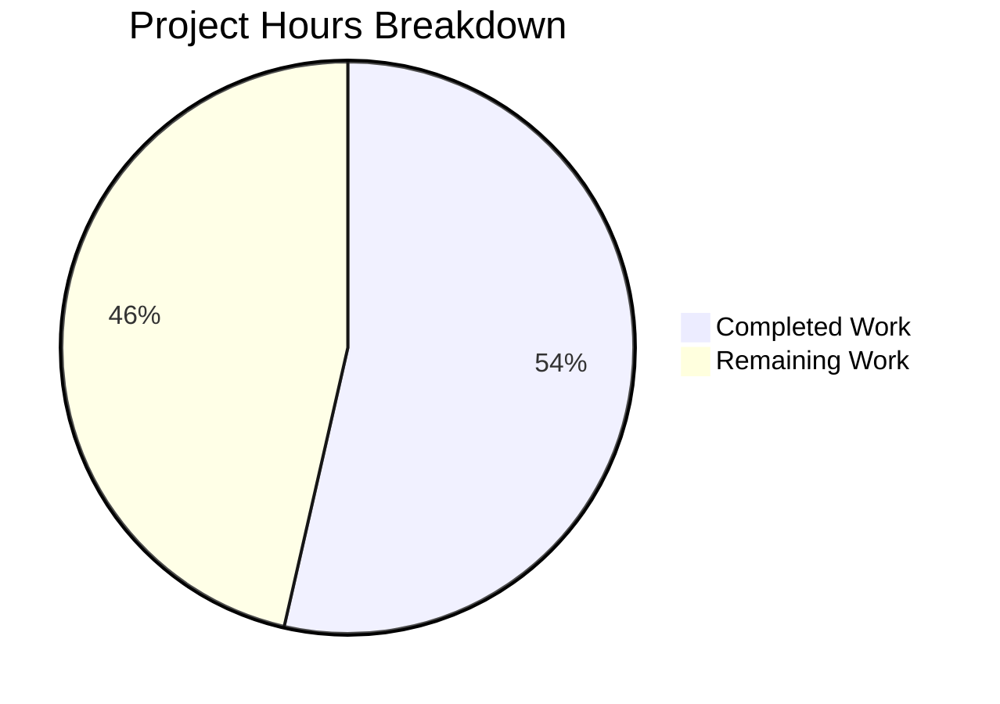
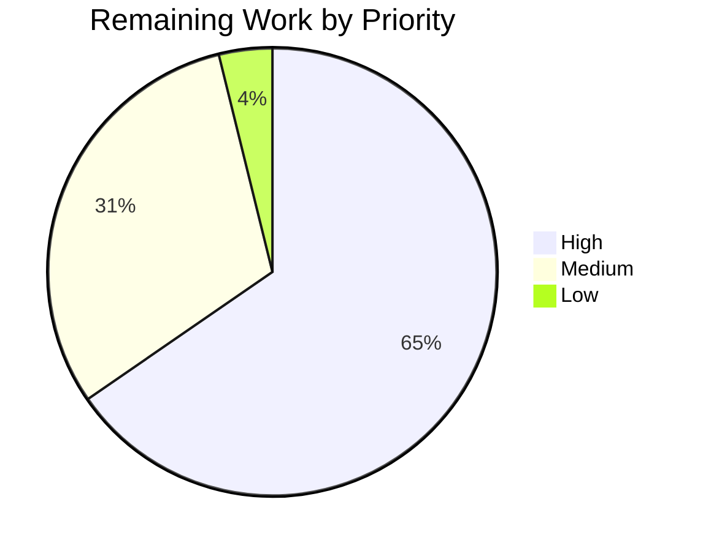

# 1. Executive Summary

## 1.1 Project Overview

A Node.js HTTP service now sits in the repository root beside the existing Python module. It is an Express 5 application that answers `GET /` with `Hello world` and `GET /good-evening` with `Good evening`, both as `text/plain; charset=utf-8`, started by `npm start` on port 3000 or on the port given in `PORT`. It serves operators and internal callers needing a small, dependency-light plain-text endpoint, and it gives a repository that previously held only a Python script a tested Node service. The Python module is untouched and behaves exactly as before.

## 1.2 Completion Status



| Metric | Hours |
|---|---|
| Total Project Hours | 56 |
| Completed Hours (AI + Manual) | 30 |
| Remaining Hours | 26 |

**Completion: 30 / (30 + 26) = 53.6%, reported as 54%.** All eight repository paths the work was scoped against are committed, and every delivered capability was exercised; the remaining hours are path-to-production work the original specification excluded, plus one acceptance leg that cannot run here.

## 1.3 Key Accomplishments

- Both endpoints verified byte-for-byte — 200, `text/plain; charset=utf-8`, bodies of 11 and 12 bytes — on three different ports.
- Express defaults preserved: unmatched paths and methods 404, automatic `HEAD` and `OPTIONS`, query strings ignored, case-insensitive routing, no middleware.
- `PORT` resolution: unset or empty means 3000, digits-only values from 1 to 65535 are accepted, everything else is refused before any socket opens.
- Invalid `PORT` refused with exactly one standard-error line and status 1, the echoed value escaped so it cannot forge a liveness line.
- Bind failure reported as one line and status 1, with no success line and the first server unaffected.
- Reproducible dependency tree: one dependency among 68 locked packages, `npm ci` green, no advisories.
- Contract suite of five subtests, green at 6 of 6, isolated from the listener and sensitive to any changed response string.
- `submod.py` and `README.md` preserved byte-for-byte, and the install tree kept out of version control.

## 1.4 Critical Unresolved Issues

5 of the 21 requirements and acceptance checks this work was scoped against remain open or carried with a caveat.

| Issue | Impact | Owner | ETA |
|---|---|---|---|
| Node 18.20.8 and Node 18.1.0 acceptance runs not performed (1) | The specification's Node 18 figures are unconfirmed on that line | Platform engineering | Before release |
| `engines.node` `>=18` while `npm test` needs Node 18.1.0 (1) | A consumer on exactly 18.0.0 sees a failing suite with no explanation in the repository | Repository owner | Next change |
| Port-resolution and bind-failure paths have no automated test (1) | Regressions there rest on manual acceptance | Repository owner | Next change |
| No measured coverage figure (1) | The completeness of the five-case suite cannot be quantified | Repository owner | Next change |
| The suite has no request timeout (1) | A stalled request hangs `npm test` instead of failing it | Repository owner | When convenient |

## 1.5 Access Issues

| System/Resource | Type of Access | Issue Description | Resolution Status | Owner |
|---|---|---|---|---|
| Node.js 18.x runtime | Toolchain availability | Node 18 may not be installed in this environment, so the specification's Node 18 acceptance legs could not be executed; its release artifacts were integrity-verified only | Open | Platform engineering |

No other access issues identified: the service is local, and needs no credentials, no database, no third-party API and no external service.

## 1.6 Recommended Next Steps

1. [High] Add a CI job that installs the locked tree, runs the parse checks and runs the suite on every change.
2. [High] Choose and implement the deployment target — host or container, `PORT` binding scope and TLS termination.
3. [High] Add automated tests for the port-resolution and bind-failure paths, and publish a coverage figure.
4. [Medium] Run the suite once on Node 18.20.8 and once on Node 18.1.0 where that runtime is permitted, and record the results.
5. [Medium] Add graceful shutdown, a health probe and the runbook, and record the Node 18.1.0 test floor in the repository.

# 2. Project Hours Breakdown

## 2.1 Completed Work Detail

| Component | Hours | Description |
|---|---|---|
| Express application module (`app.js`) | 3 | The two `app.get` routes with the explicit `text/plain` content type, the module-level contract header, and the export that lets the entry point and the suite share one application. |
| Process entry point and its diagnostics (`server.js`) | 6 | `PORT` resolution with named bounds and one validation function, the fail-fast invalid-`PORT` diagnostic and its escaping, the listen call with no host argument, the bind-failure branch and the post-bind success line. |
| Package manifest and lock (`package.json`, `package-lock.json`) | 2 | The hand-written manifest with the start and test scripts, the `engines` floor and the single dependency, plus the generated lock that pins the 68-package tree. |
| Repository hygiene (`.gitignore`, staging discipline) | 1 | The single ignore rule that keeps the install tree out of version control, and the explicit-path staging that adds exactly the delivered paths. |
| Automated contract suite (`test/app.test.js`) | 5 | Five subtests under one parent on an ephemeral loopback port, socket-tracking teardown, and literal expectations that make a changed response string fail the run. |
| Runtime acceptance of the response and lifecycle matrix | 6 | The success criteria exercised end to end: both routes on the default and the overridden port, the port-resolution matrix across roughly thirty invalid forms, both failure states, and the literal ports run inside a private network namespace. |
| Preservation verification (`submod.py`, `README.md`) | 2 | Byte-level confirmation that both pre-existing files are unchanged, that the Python module still runs, and that `print_hi` is neither ported nor reachable over HTTP. |
| Performance and security characterisation | 5 | Startup, latency, concurrency, memory and file-descriptor behaviour under sustained load, plus the payload sweeps over both endpoints, the default 404 surface and the process input. |
| **Total** | **30** | |

## 2.2 Remaining Work Detail

| Category | Hours | Priority |
|---|---|---|
| Runtime acceptance on the Node 18 line | 2 | High |
| Automated coverage of the port-resolution and bind-failure paths, with coverage reporting | 6 | High |
| Continuous-integration gate over install, parse checks and the suite | 4 | High |
| Deployment configuration: target, `PORT` binding scope and TLS termination | 5 | High |
| Production process management: graceful shutdown and supervision | 3 | Medium |
| Health or readiness endpoint and operational log integration | 3 | Medium |
| Operational runbook and repository run instructions | 2 | Medium |
| Suite robustness: a request timeout so a stalled request fails the run | 1 | Low |
| **Total** | **26** | |

## 2.3 Estimation Basis

Completed hours are measured against the standard categories — implementation, tests, integration and verification — and sized from the artifacts actually delivered and the runtime matrices actually executed. Remaining hours are task-level estimates rounded up to the half hour, each traceable to a named requirement or to the work required to run this service in production. Confidence is high for the completed items, which are observable in the tree and were exercised, and medium for the remaining items, whose size depends on the deployment target chosen.

# 3. Test Results

| Area / Category | Framework | Tests | Passed | Failed | Coverage | What This Proves |
|---|---|---|---|---|---|---|
| HTTP contract suite (`test/app.test.js`) | `node:test` (Node built-in) | 6 | 6 | 0 | not instrumented | Both endpoints, the ignored query string and both default 404 cases hold under strict equality, and a changed response string fails the run. |
| Endpoint contract on the live server | curl and raw HTTP probes | 9 | 9 | 0 | — | Status, exact `text/plain; charset=utf-8` and byte-exact bodies on the default port and an overridden port, with the default port refusing while the override is in force. |
| Port-resolution matrix | process runs (`node server.js` and `npm start`) | 87 | 87 | 0 | — | Unset or empty resolves to 3000, digits-only values from 1 to 65535 are accepted with leading zeros honoured, and every invalid form is refused with one line, status 1 and no file created. |
| Diagnostic integrity for process input | process runs, standard error as a pipe and as a file | 21 | 21 | 0 | — | Control characters, quotes and a value longer than the pipe buffer cannot forge, split or truncate the diagnostic. |
| Bind-failure handling | process runs against held ports | 19 | 19 | 0 | — | One standard-error line naming the port and error, exit status 1, never a success line, with the first server unaffected and `EACCES` on the same branch. |
| HTTP input-state matrix | HTTP probes over the live server | 137 | 137 | 0 | — | Query strings are ignored, unmatched paths and methods answer 404, `HEAD` and `OPTIONS` are automatic, routing stays case-insensitive and non-strict, and the default headers are intact. |
| Security payload sweep | raw sockets, curl and one headless browser session | 780 | 780 | 0 | — | Both endpoints, the default 404 surface and the process input are inert under cross-site-scripting, traversal, injection, request-smuggling, oversized and slow-request payloads, with no 5xx response anywhere. |
| Packaging, hygiene and performance checks | npm gates and load probes | 159 | 159 | 0 | — | The lock reproduces the installed tree with no advisories, the install tree stays untracked, and startup, latency, concurrency, memory and file descriptors hold steady under sustained load. |

**Not Covered**

- The port-resolution and bind-failure paths have no automated test: the suite is fixed at the endpoint cases, so those branches are proved only by the runtime matrices above.
- `HEAD`, `OPTIONS`, the case-insensitive and trailing-slash variants, and the bodies of the 404 responses are exercised by hand and asserted by no test.
- No coverage tooling is configured, so no measured coverage percentage can be reported for the suite.
- The suite has not been executed on a Node 18 interpreter, so its documented runtime floor is unconfirmed on that line; the API surface it uses was checked against that release's exports, and the suite still passes with those later APIs removed.

# 4. Runtime Validation &amp; UI Verification

- ✅ **Server startup** — `npm start` prints exactly one `Listening on port <port>` after the bind; one listener owned by the node process; reachable on `localhost`, `127.0.0.1` and `[::1]`.
- ✅ **Both endpoints** — 200 with the exact bodies and content type, verified byte-for-byte on the default port, on an overridden port and through a browser, which renders them as plain text.
- ✅ **Routing defaults** — 404 for unmatched paths and methods, automatic `HEAD` (zero body bytes) and `OPTIONS` (`Allow: GET, HEAD`), query strings ignored, case-insensitive and non-strict matching.
- ✅ **Port override and resolution** — `PORT=4000` serves both routes while port 3000 refuses (curl exit 7); unset or empty resolves to 3000 rather than a random port.
- ✅ **Invalid `PORT`** — one escaped standard-error line, exit status 1, no socket file and no listener, through both `node server.js` and `npm start`.
- ✅ **Bind failure** — a second start writes `Cannot listen on port <port>: listen EADDRINUSE...` and exits 1 with no success line while the first server keeps answering; `EACCES` takes the same branch.
- ✅ **Diagnostic integrity** — control-character payloads produce exactly one line with no forged liveness line, and a 70,000-digit value arrives whole on a pipe (70,087 bytes, exit 1).
- ✅ **Packaging** — `npm ci` installs the locked 68-package tree, the installed tree matches the lock, `npm ls --all` exits 0 and the audit reports no vulnerabilities.
- ✅ **Python module coexistence** — `python3 submod.py` prints `Hello Blitzy User, From Wulf 2`, no JavaScript file references it, and the test runner never collects it.
- ✅ **Long-running behaviour** — 1.9 million requests across concurrency levels 1 to 200 with no errors, timeouts or body mismatches; memory plateaus and file descriptors return to the idle count of 19.

Never exercised at runtime: there is no HTML page, view or client asset and no authentication, so no user-interface or accessibility surface exists to drive; the suite has not been run on a Node 18 interpreter; and no deployment runtime — process supervisor, reverse proxy or TLS terminator — was exercised, because none is part of the deliverable.

# 5. Compliance &amp; Quality Review

## 5.1 Compliance Matrix

| Deliverable | Benchmark It Was Held To | Status |
|---|---|---|
| Endpoint contract (`GET /`, `GET /good-evening`) | Functional correctness against the stated contract | ✅ Pass |
| Content type and byte-exact bodies | Response interface compliance | ✅ Pass |
| Routing defaults (query strings, unmatched path and method, `HEAD`, `OPTIONS`, case and trailing-slash variants) | Behavioural compliance with the framework defaults the specification fixed | ✅ Pass |
| `PORT` resolution (`server.js:51-65`) | Input validation at the process boundary | ✅ Pass |
| Invalid-`PORT` diagnostic (`server.js:86-113`) | Fail-fast correctness and log integrity | ✅ Pass |
| Bind-failure handling (`server.js:119-122`) | Failure-path correctness and exit-status discipline | ✅ Pass |
| Startup and output discipline (`server.js:119-126`) | Process observability: one line per state, on the right stream | ✅ Pass |
| Module structure and module system | CommonJS, one responsibility per module, no middleware or non-default settings | ✅ Pass |
| Manifest and lock | Reproducible dependency resolution | ✅ Pass |
| Dependency hygiene | One dependency, no advisories, no dev dependencies | ✅ Pass |
| Repository hygiene and preservation | Version-control discipline and non-regression of the pre-existing files | ✅ Pass |
| Automated contract suite | Test sufficiency against the delivered contract | ⚠️ Partial — the five endpoint cases pass; the port-resolution and bind-failure paths and the routing defaults are not asserted, and no coverage is measured |

## 5.2 AAP & Rule Divergences and Gaps

| What the Specification or Rule Required | What Was Delivered Instead | Why It Diverged | Impact | Remediation |
|---|---|---|---|---|
| The invalid-`PORT` branch calls `process.exit(1)` | `process.exitCode = 1` after the diagnostic is written (`server.js:113`) | A forced exit abandons the pending write once the kernel has taken one 64 KiB pipe buffer, which cuts the one-line diagnostic short | The process now ends once the line has drained; exit status, message and the absence of a bind are unchanged | None required; only the specification's sentence would need restating |
| The entry point carries one function, `resolvePort(value)` | A second function, `escapePortValue`, renders the echoed value (`server.js:86-91`) | The raw `PORT` value is interpolated into the diagnostic, so a line break inside it would produce a line identical to the success line | Values containing control characters, quotes or backslashes print escaped; ordinary values are byte-identical to the specified text | None required |
| Acceptance on Node.js 18.20.8 | Everything validated on Node.js 20.20.2 with npm 10.8.2 | The platform restriction attached to this repository forbids Node 18 and mandates that runtime; it outranks the specification | The specification's Node 18 figures remain unconfirmed on that line; `engines.node` still declares `>=18` | Run the suite once on 18.20.8 and once on 18.1.0 where Node 18 is permitted (2 h) |
| Every variable used is detailed in a document | Detail lives in JSDoc and in-line comments beside each declaration, and in the specification's variable table | The specification forbids any file outside the agreed set and any edit to `README.md`, and it outranks the rule | A reader looks in the code rather than in a document; nothing is left undocumented | None required; a documentation file may be permitted later |
| `engines.node` `>=18` with `"test": "node --test"` should support Node 18 throughout | Both values were delivered as fixed, so Node 18.0.0 cannot run the suite (`node: bad option: --test`, exit 9) | Both values were fixed by the request and no pinning file may be added | A consumer on exactly 18.0.0 sees a failing test script with nothing in the repository explaining it; the real floor is 18.1.0 | Record the floor in the repository or raise the declared range (part of the runbook task) |
| The suite covers the delivered contract, with the file and dependency sets closed | Exactly the five endpoint cases, so the port-resolution and bind-failure paths and the routing-default behaviours are unasserted | The specification fixed the suite at five cases and forbade new cases, files and dev dependencies | An entry-point regression would not fail the build; those paths are proved only by the acceptance matrices | Add server-side tests in a later change (6 h) |

**The exit mechanism.** The specification's prose for the entry point says the invalid-`PORT` branch should force the exit, but the same specification states the observable requirement: one line on standard error, exit status 1, before any socket is opened. A forced exit is what cuts that line short — with standard error on a pipe the write is asynchronous, so the process leaves after the kernel has taken one 64 KiB buffer, delivering 65,536 of 70,083 bytes and losing the trailing line feed, while the same value written to a file arrives whole. The branch therefore sets the exit status and lets the line drain (`server.js:107-113`); the value is still refused before any bind, `app.listen` is still never called on that path, and ordinary values such as `abc` still produce the specified message byte for byte. No action is needed unless the specification's wording is to be restated to match the delivered mechanism.

**The escaping helper.** The entry point was specified with a single function, yet the diagnostic interpolates the raw `PORT` value, and that value is the process's own input. Interpolating it unchanged lets a line break inside it produce a standard-error line reading exactly `Listening on port 3000` — indistinguishable from the success line the process writes after a bind — which defeats any liveness check that watches the log. Escaping the value removes that, and the escaping needs a home, so `escapePortValue` was added as a documented pure function beside the resolver (`server.js:86-91`) rather than inlined into the message. For values that carry control characters, quotes or backslashes the echoed text shows escapes; every ordinary value is unchanged, and no character is dropped, so the diagnostic still reports exactly what was passed.

**The validation runtime.** Every install, build, test and runtime check ran on Node.js 20.20.2 with npm 10.8.2 rather than the Node.js 18.20.8 the specification names. The restriction attached to this repository forbids Node 18 outright and mandates the 20.20.2 runtime, and it outranks the specification; npm is the version the specification itself chose to generate the lock, and no delivered file uses an API that differs between the lines, so the manifest keeps `engines.node` at `>=18`. The practical consequence is narrow and worth closing: the expected Node 18 figures — six tests passing in about 0.24 s on 18.20.8, and the five subtests listed as `ok` on 18.1.0 — are unconfirmed on that line. The suite's API surface was checked against that release's exports and still passes with the later APIs removed, so the floor is real; it is simply unobserved. One run on each of those two interpreters closes it.

**The variables document.** The user's rule asks that every variable used be detailed in a document. There is no such document in the repository: the specification forbids adding any file beyond the agreed set and forbids editing `README.md`, and it outranks the rule. The rule's intent is met where it matters — every constant, function, parameter and local in `server.js` and `test/app.test.js` is documented at its declaration, including the two port bounds quoted in the message and the callback parameter that carries a bind error — and the specification carries its own table of the same identifiers. The consequence is only where the detail lives: a reader finds it in the code rather than in a separate document. If the team prefers a document, permitting one in a later change closes the letter of the rule with no code impact.

**The Node floor.** `engines.node` declares `>=18` and the test script is `node --test`, which arrived in Node 18.1.0. On exactly 18.0.0 the script therefore fails with `node: bad option: --test` and exit status 9 — the application starts, but the suite does not run. Both values were fixed by the request and no `.nvmrc` or other pinning file may be added, so the pair was delivered as asked; the real supported floor for `npm test` is Node 18.1.0, and it is recorded here because nothing in the repository states it. Stating it in the repository, or raising the declared range to `>=18.1`, is a one-line change once the file set is reopened.

**The unasserted server-side paths.** The suite was fixed at five endpoint cases, and the file and dependency sets were closed, so nothing asserts the port-resolution rules, the fail-fast diagnostic, the bind-failure branch, or the `HEAD`, `OPTIONS`, case-insensitive and trailing-slash behaviours. That is a scope decision rather than an omission — the specification says so explicitly and forbids adding cases — but it is the largest verification gap in the delivered system: a change to `server.js` would not fail the build. Those paths are currently proved by the acceptance matrices recorded above, which exercise them directly, and the six-hour task in Section 2.2 adds tests that make the proof automatic.

# 6. Risk Assessment

| Risk | Category | Severity | Probability | Mitigation | Status |
|---|---|---|---|---|---|
| No continuous-integration gate: a change can land without install, parse or suite checks | Operational | Medium | Medium | Add a job that installs the locked tree, runs the parse checks and runs the suite on every change | Open |
| The listener binds every interface because the listen call passes no host argument | Security | Medium | High | Pass a host argument, or front the service with a proxy, where the deployment requires loopback-only | Accepted, by design |
| No authentication and no transport encryption on the served routes | Security | Low | High | Terminate TLS at a reverse proxy; both routes serve fixed public text | Accepted, by design |
| No connection cap or request-body limit beyond the parser's own limits, and memory held after large unconsumed bodies returns only gradually | Technical | Low | Medium | Enforce limits at the proxy, or add explicit limits in a later change; watch resident memory under that specific traffic | Accepted |
| No graceful shutdown: a supervisor's termination signal ends the process and drops in-flight requests, releasing the port in about 16 ms | Operational | Low | High | Handle the signal and close the server cleanly in a later change | Accepted |
| No health or readiness endpoint, so a platform can only probe the listening socket | Operational | Low | Medium | Add a readiness route and wire the startup diagnostic into the platform's logs | Open |
| Port-resolution and bind-failure paths have no automated test and there is no measured coverage | Technical | Medium | Medium | Add server-side tests and coverage reporting | Open |
| The declared `engines.node` `>=18` disagrees with the real test floor of Node 18.1.0 | Integration | Low | Medium | Record the floor in the repository or raise the declared range | Open |

# 7. Visual Project Status


The **Completed Work** segment is the project's dark blue (#5B39F3) and **Remaining Work** the white (#FFFFFF) segment: 30 hours against 26, which is the 54% completion reported in Section 1.2.



| Status | Hours | Share |
|---|---|---|
| Completed — delivered and verified | 30 | 54% |
| Remaining — High priority | 17 | 30% |
| Remaining — Medium priority | 8 | 14% |
| Remaining — Low priority | 1 | 2% |

# 8. Summary &amp; Recommendations

**What was delivered.** The repository now carries a small, complete Node.js service beside the existing Python module: an Express 5 application with two plain-text routes, a process entry point that resolves and validates the listening port, a fail-fast diagnostic for an invalid value, a bind-failure branch, a reproducible 68-package dependency tree, and a five-case contract suite. Every capability the work was scoped against exists in the tree, and each one was exercised: both endpoints byte-for-byte on three different ports, the routing defaults, the full port-resolution matrix, both failure states, the packaging gates, and the preservation of the two pre-existing files. Against that scope the work is complete, which is 30 of the 56 hours in Section 1.2 — **54% of the total project**, the balance being path-to-production work the original scope excluded.

**What remains.** The remaining 26 hours are dominated by four items: automated tests for the port-resolution and bind-failure paths with a measured coverage figure (6 h), a deployment target with its binding scope and TLS termination decided (5 h), a continuous-integration gate (4 h), and the Node 18 acceptance runs (2 h). The rest is operational polish — graceful shutdown, a health probe with log integration, the runbook, and a request timeout in the suite. None of these is a defect in what was delivered; each is work the delivered service needs before it runs in production under someone else's supervision.

**Critical path to production.** The shortest credible route is: add the integration gate so every later change is verified automatically; add the server-side tests so the entry point is covered before it is touched again; decide the deployment target and bind the service explicitly there, terminating TLS in front of it; then add the shutdown handling and the readiness probe the platform will expect. The Node 18 acceptance run can happen in parallel and is the only outstanding item that closes a promise made in the original scope rather than preparing for operations.

**Success metrics.** The service meets its stated contract on every exercised path: 200 with the exact bodies and content type, 404 for anything unmatched, one diagnostic line and status 1 for an invalid port, one success line after a bind, and a dependency tree that installs reproducibly with no advisories. The suite is green at 6 of 6 and fails when a response string changes, so the contract is protected rather than merely satisfied. Under load the service answered 1.9 million requests with no errors or body mismatches, held its memory after the initial growth and returned its file descriptors to the idle count.

**Production readiness.** The application logic is production-ready and verified; the operating envelope around it is not yet built. Before this service takes real traffic, a reviewer should expect a continuous-integration gate, tests for the entry-point paths, an explicit decision on which interfaces the listener binds and where TLS terminates, a shutdown path a supervisor can use, and a readiness probe — all of them listed in Section 2.2 with hours. Until then the service is ready to run on a trusted network, watched by a human, which is exactly the shape the original scope asked for.

# 9. Development Guide

### System prerequisites

- **Node.js 18.1.0 or newer.** The suite needs the `node --test` runner, which arrived in 18.1.0; the application itself runs on 18.0.0 and later. The tree was validated on Node.js 20.20.2.
- **npm** (validated with 10.8.2, the version the lock was generated with).
- **Python 3** for the pre-existing `submod.py` (validated with CPython 3.12.3). No Python packages are needed: the module imports nothing.
- **curl** for the manual checks, and **lsof** if you need to find the process holding a port.

```bash
node --version     # v18.1.0 or newer
npm --version
python3 --version  # Python 3.x
```

### Environment setup

There is nothing to configure. The service reads one optional environment value, `PORT`, and defaults to 3000. Every command below is run from the repository root.

### Dependency installation

```bash
npm ci --no-audit --no-fund
```

Expected: `added 68 packages`. This installs `express@5.2.1` and its transitive set exactly as `package-lock.json` pins them, and leaves both manifest files byte-identical. Run `npm install --no-audit --no-fund` instead only if you have deliberately changed `package.json`, since a plain install is what regenerates the lock.

### Build and parse checks

This project has no compile step; the equivalent checks are:

```bash
node --check app.js && node --check server.js && node --check test/app.test.js
python3 -W error -m py_compile submod.py && rm -rf __pycache__
```

Expected: both commands print nothing and exit 0.

### Running the test suite

```bash
npm test
```

Expected output ends with:

```text
# tests 6
# suites 0
# pass 6
# fail 0
# cancelled 0
# skipped 0
# todo 0
# duration_ms 156.8
```

The suite starts the application on an ephemeral loopback port, so it is safe to run while a server holds port 3000, and it never loads `server.js`, so no configured port is bound during the run.

### Starting the application

Foreground, on the default port:

```bash
npm start
# > hello-world-py@1.0.0 start
# > node server.js
# Listening on port 3000
```

Detached, on a port of your own, with the log captured and the pid printed:

```bash
PORT=4000 nohup npm start > server.log 2>&1 & echo $!
```

If that port is already in use, pick another. To stop the service, stop the process that owns the port, not just the npm parent:

```bash
kill "$(lsof -ti tcp:4000 -sTCP:LISTEN)"
```

### Verifying the service

```bash
curl -i http://localhost:4000/
```

Expected:

```text
HTTP/1.1 200 OK
X-Powered-By: Express
Content-Type: text/plain; charset=utf-8
Content-Length: 11
...
Hello world
```

```bash
curl -i http://localhost:4000/good-evening      # 200, text/plain; charset=utf-8, Good evening
curl -i http://localhost:4000/good-evening?name=x  # the same response; query strings are ignored
curl -i http://localhost:4000/good-morning      # 404, Cannot GET /good-morning
curl -i -X POST http://localhost:4000/good-evening  # 404, Cannot POST /good-evening
curl -I http://localhost:4000/                  # 200 with the GET headers and no body
curl -i -X OPTIONS http://localhost:4000/       # 200, Allow: GET, HEAD, body GET, HEAD
```

Failure paths, each of which exits with status 1 and prints one line to standard error:

```bash
PORT=abc npm start      # Invalid PORT "abc": expected a whole number from 1 to 65535
test ! -e abc           # no socket file is created for a non-numeric value
npm start               # with a server already holding the port:
                        # Cannot listen on port 4000: listen EADDRINUSE: address already in use :::4000
```

The Python module, unchanged and still runnable:

```bash
python3 submod.py       # Hello Blitzy User, From Wulf 2
```

Packaging gates:

```bash
npm ls --all                              # exit 0, one top-level dependency
npm audit --omit=dev                      # found 0 vulnerabilities
node -e "const l=require('./package-lock.json');const bad=Object.entries(l.packages).filter(([p,e])=>p&&require('./'+p+'/package.json').version!==e.version);console.log(bad.length?'MISMATCH':'installed tree matches lock', l.packages['node_modules/express'].version, l.packages[''].dependencies.express)"
# installed tree matches lock 5.2.1 ^5
git diff --exit-code -- submod.py README.md   # exit 0 while the pre-existing files stay untouched
```

### Example session

```bash
npm ci --no-audit --no-fund
npm test                                  # 6 of 6 passing
PORT=4000 nohup npm start > server.log 2>&1 & echo $!
curl -s http://localhost:4000/            # Hello world
curl -s http://localhost:4000/good-evening # Good evening
PORT=abc node server.js; echo "exit=$?"   # the diagnostic line, then exit=1
kill "$(lsof -ti tcp:4000 -sTCP:LISTEN)"
```

### Troubleshooting

| Symptom | Cause | Resolution |
|---|---|---|
| `Error: Cannot find module 'express'` from `npm test` or `npm start` | Dependencies are not installed | Run `npm ci --no-audit --no-fund` from the repository root |
| `node: bad option: --test` | Node 18.0.0 is in use, and the test runner arrived in 18.1.0 | Use Node 18.1.0 or newer for `npm test`; the application itself runs on 18.0.0 |
| `Cannot listen on port <port>: listen EADDRINUSE` | Another process holds the port | `lsof -ti tcp:<port> -sTCP:LISTEN` then stop that process, or choose another `PORT` |
| `Invalid PORT "<value>": expected a whole number from 1 to 65535` | The value is not digits-only within 1–65535 | Pass a plain decimal port; leading zeros are fine, signs, spaces, decimals, exponents and hex are not |
| The port stays bound after stopping the service | The npm parent was killed and the node child kept the socket | Stop the process that owns the port, as above |
| `node_modules/` appears in `git status` | The command ran outside the repository root, or the ignore file was changed | Run from the repository root; `.gitignore` must contain the single line `node_modules/` |
| `__pycache__/` appears as an untracked directory | You imported or byte-compiled the Python module | Expected: the ignore file deliberately lists only `node_modules/`; delete the directory after checking |
| The suite never finishes | A request stalled; the suite has no request timeout | Interrupt the run and check the application for a blocking change; a timeout is a listed remaining task |

# 10. Appendices

### A. Command Reference

| Purpose | Command |
|---|---|
| Install the locked dependency tree | `npm ci --no-audit --no-fund` |
| Parse-check the JavaScript files | `node --check app.js && node --check server.js && node --check test/app.test.js` |
| Parse-check the Python module | `python3 -W error -m py_compile submod.py && rm -rf __pycache__` |
| Run the contract suite | `npm test` |
| Start the service | `npm start` (or `PORT=4000 nohup npm start > server.log 2>&1 & echo $!`) |
| Verify both routes | `curl -i http://localhost:<port>/` and `curl -i http://localhost:<port>/good-evening` |
| Verify the 404 cases | `curl -i http://localhost:<port>/good-morning` and `curl -i -X POST http://localhost:<port>/good-evening` |
| Verify the automatic methods | `curl -I http://localhost:<port>/` and `curl -i -X OPTIONS http://localhost:<port>/` |
| Stop the service by its port owner | `kill "$(lsof -ti tcp:<port> -sTCP:LISTEN)"` |
| Inspect the dependency tree | `npm ls --all` |
| Check for advisories | `npm audit --omit=dev` |
| Check the installed tree against the lock | the lock-match one-liner in the Development Guide |
| Run the Python module | `python3 submod.py` |
| Confirm the pre-existing files are untouched | `git diff --exit-code -- submod.py README.md` |
| List the tracked files | `git ls-files` |

### B. Port Reference

| Port | Source | Notes |
|---|---|---|
| 3000 | Default when `PORT` is unset or empty | The documented default; an empty value does not fall through to a random port |
| 1–65535 | `PORT`, when it is ASCII digits and nothing else | Validated before any socket opens; leading zeros are arithmetic (`04000` is 4000) |
| An operating-system-chosen port | The test suite's listen call on port `0` | Loopback only, so the suite never occupies the configured port |

The listener passes no host argument, so the service binds every interface and `http://localhost:<port>` reaches it.

### C. Key File Locations

| Path | Contents |
|---|---|
| `app.js` | The Express application: the two routes, the explicit content type, and the export; never listens |
| `server.js` | The process entry point: `PORT` resolution, the invalid-value diagnostic, the listen call, both failure and success output |
| `test/app.test.js` | The `node:test` contract suite: five subtests under one parent, ephemeral loopback port, socket-tracking teardown |
| `package.json` | Manifest: identity, `private`, the start and test scripts, `engines.node`, the single dependency |
| `package-lock.json` | The pinned 68-package tree, lockfile version 3 |
| `.gitignore` | One line, `node_modules/` |
| `submod.py` | Pre-existing Python module, unchanged |
| `README.md` | Pre-existing repository readme, unchanged |

### D. Technology Versions

| Component | Version | Source |
|---|---|---|
| Node.js | Validated on 20.20.2; 18.1.0 is the floor for `npm test`, 18.0.0 for `npm start` | Declared as `engines.node` `>=18` |
| npm | 10.8.2 | The version that generated the lock (lockfile version 3) |
| express | 5.2.1, declared as `^5` | `package-lock.json` |
| router / finalhandler / body-parser | 2.2.0 / 2.1.1 / 2.3.0 | Transitive, pinned in the lock |
| Test runner | `node:test` | Built in; no test framework dependency |
| CPython | Validated on 3.12.3 | `submod.py` imports nothing, so no packages are needed |

### E. Environment Variable Reference

| Name | Read by | Default | Valid values |
|---|---|---|---|
| `PORT` | `server.js:95`, once | 3000 when unset or empty | ASCII digits only, 1–65535 inclusive; anything else prints one line to standard error and exits with status 1 before any socket opens |

Nothing else affects the service: no other environment variable, configuration file or command-line flag is read.

### F. Developer Tools Guide

- **Test runner** — `node --test` through `npm test`. One parent test with five subtests, literal expectations, and a teardown that destroys its own sockets so the run finishes in about a sixth of a second. Run it before every change; it is the only automated gate the project has today.
- **Manual probes** — `curl` for status, headers and bodies; pipe through `od -c` when a byte-level check matters, because the bodies carry no trailing newline.
- **Process and port inspection** — `lsof -ti tcp:<port> -sTCP:LISTEN` to find the port owner, `ss -ltnp` to see every listening socket, `ps` to confirm which command owns it.
- **A private network namespace** — when you need the literal port 3000 while something else on the host may hold it, run the service inside one: `unshare -n bash -c 'ip link set lo up; PORT=3000 node server.js & ...'`, then stop it inside the same call.
- **Git hygiene** — stage files by explicit path. `git add -A` or `git add .` sweeps in unrelated untracked files; the delivered commit set was staged by name for that reason.
- **Dependency inspection** — `npm ls --all`, `npm audit --omit=dev`, and the lock-match one-liner in the Development Guide together show that the declared range, the lock and the installed tree agree.
- **Static checks** — there is no linter, formatter or type-checker; `node --check` plus `npm test` is the current static gate. Adding one reopens the dependency set, which the original specification closed.

### G. Glossary

| Term | Meaning |
|---|---|
| App module | `app.js`: builds the Express application and exports it without binding a port |
| Entry point | `server.js`: resolves the port, starts the application, and owns the process's output and exit status |
| Ephemeral port | A port chosen by the operating system; the suite binds port `0` so it never collides with a configured port |
| Fail-fast | Refusing an invalid `PORT` with one diagnostic line and status 1 before any socket is opened |
| Liveness line | The single `Listening on port <port>` line, which is the only output that means a bind succeeded |
| `EADDRINUSE` / `EACCES` | The two bind failures seen in practice: the port is already held, or the user may not bind it. Both take the same branch |
| Lockfile | `package-lock.json`: the exact 68-package tree `npm ci` reproduces |
| Contract suite | The five `node:test` cases that assert the endpoints, the ignored query string and the two 404 cases |
| Mutation check | Changing a response string and confirming the suite fails, which proves the expectations are literals rather than copies of the implementation |
| Routing defaults | Express's stock behaviour: 404 for anything unmatched, automatic `HEAD` and `OPTIONS`, case-insensitive and non-strict paths, query strings outside the route |
| Keep-alive | Persistent connections the suite closes by destroying its own tracked sockets, instead of waiting out the idle timeout |
| Readiness probe | An endpoint or signal a platform can poll to decide whether to send traffic; the service has none today |
