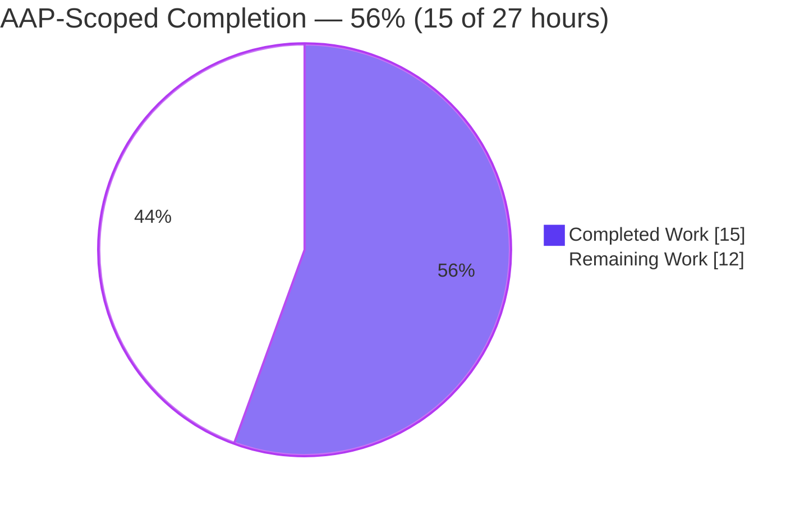
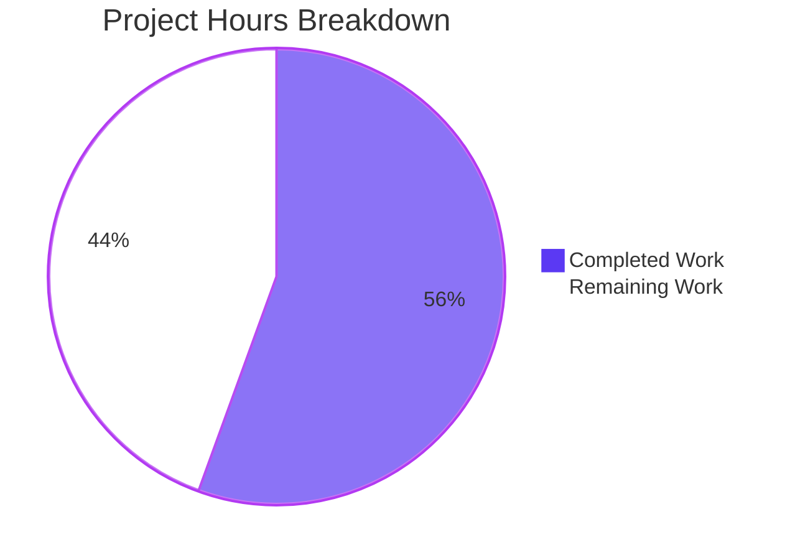
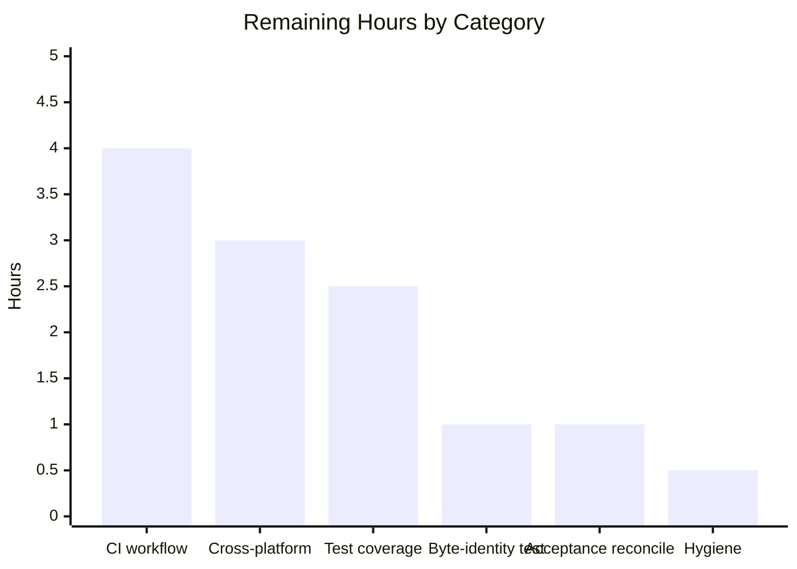

# 1. Executive Summary

Hello_World_py adds one standard-library Python module and its unittest suite to a four-file repository. The work is complete and verified: all twelve tests pass, every acceptance check with a subject passes, and the two pre-existing files are byte-identical to their prior state.

## 1.1 Project Overview

Hello_World_py is a small, standard-library-only Python 3 repository. This delivery adds the root module `a_cust_test_feature.py`, defining `aCustTestFeature` with three zero-argument static methods — `number2026721` (prints 1 through 10), `tebahpla2026721` (prints the lowercase alphabet reversed) and `oneWeek2026721` (prints the local date seven days ahead in ISO 8601) — plus the alias `aTestFeature`. It adds `tests/test_a_cust_test_feature.py`, a twelve-test `unittest` suite that fixes the clock through the module's `date` seam and pins `submod.py` and `README.md`. No server, UI, dataset or third-party dependency is involved.

## 1.2 Completion Status



| Metric | Hours |
| --- | --- |
| Total Hours | 27.0 |
| Completed Hours (AI + Manual) | 15.0 |
| Remaining Hours | 12.0 |

**Completion: 15.0 / 27.0 hours = 56%** (Completed = Dark Blue `#5B39F3`, Remaining = White `#FFFFFF`). All five requested work items are delivered and verified; the remaining hours are path-to-production hardening (CI, cross-platform verification, closing four coverage gaps), not missing functionality.

## 1.3 Key Accomplishments

- [x] `aCustTestFeature` and its `aTestFeature` alias resolve to one class object (`a_cust_test_feature.py:35,80`).
- [x] `number2026721` prints exactly `1`–`10`, one per line.
- [x] `tebahpla2026721` prints exactly `zyxwvutsrqponmlkjihgfedcba`.
- [x] `oneWeek2026721` prints today-plus-seven-days in ISO 8601 across month, year and leap-February boundaries.
- [x] Twelve `unittest` tests in five classes pass: 12/12, exit 0.
- [x] Importing is silent; `__all__ = ['aCustTestFeature', 'aTestFeature']`.
- [x] `submod.py`'s greeting and surface are unchanged; `README.md` is byte-identical.

## 1.4 Critical Unresolved Issues

**0 of 5 requested work items are unresolved.** Ten supporting items remain open — four coverage gaps, three governance/tooling absences, three environment/state limitations.

| Issue | Impact | Owner | ETA |
| --- | --- | --- | --- |
| Per-method stderr silence is not asserted by any test | A future write to stderr would not fail the suite | Maintainer | 0.5h |
| The module's silence under `-m` / as a script is not asserted | A stray top-level print would not fail the suite | Maintainer | 0.5h |
| `README.md` bytes are not asserted by any test | A byte-only edit is caught only by the diff gate | Maintainer | 0.5h |
| A byte-only edit to a pinned file is invisible to the suite | Pinned-file drift is caught only by the manual diff check | Maintainer | 0.5h |
| No CI workflow runs the suite | A regression reaches the branch unless tests are run by hand | Maintainer | 4.0h |
| No coverage / lint / type-check gate is configured | Prose and style regressions are unprotected by automation | Maintainer | 1.0h |
| No `.gitignore` exists | A non-`-B` run leaves untracked bytecode | Maintainer | 0.5h |
| Windows/Linux parity is unverified | Non-macOS behaviour is unproven | Maintainer | 3.0h |
| The acceptance procedure presupposes an untracked artifact that does not exist | Two baseline checks pass vacuously | Maintainer | 0.5h |
| The staging checks describe a mid-work state, not the committed tree | Two checks cannot be replayed verbatim | Maintainer | 0.5h |

## 1.5 Access Issues

No access issues identified. The project installs nothing, starts no service and requires no credential, API key or permission beyond read access to the checkout.

## 1.6 Recommended Next Steps

1. **[High]** Add a CI workflow running the suite and the pinned-file diff on every push and pull request.
2. **[Medium]** Add committed tests for the four uncovered behaviours (stderr silence, `-m`/script silence, `README.md` bytes, byte-only pinned edits).
3. **[Medium]** Add an automatic byte-identity assertion for the pinned files.
4. **[Medium]** Verify Windows and Linux parity; evidence is macOS arm64 only.
5. **[Low]** Add a `.gitignore` so a non-`-B` run leaves no untracked bytecode.

# 2. Project Hours Breakdown

The hours below are scoped entirely to the Agent Action Plan requirements and the standard path-to-production activities for the delivered module. Completed (15.0h) plus remaining (12.0h) equals the 27.0h total in Section 1.2.

## 2.1 Completed Work Detail

| Component | Hours | Description |
| --- | --- | --- |
| `a_cust_test_feature.py` | 3.5 | The `aCustTestFeature` class, the `aTestFeature` alias, the three zero-argument static methods, `__all__`, docstrings, and seam-correct date arithmetic (REQ-1 … REQ-12). |
| `tests/test_a_cust_test_feature.py` | 5.5 | Twelve tests in five classes: full-string stdout assertions, child-process regression checks, and four seam-patched date-boundary tests (REQ-17 … REQ-21). |
| Acceptance and environment execution | 3.0 | Running and verifying the acceptance commands, the `-B`/`__pycache__` discipline, and the isolated CPython 3.12.3 runtime (REQ-16, REQ-22 … REQ-24). |
| Baseline continuity and delivery verification | 3.0 | Pinned-file byte identity for `submod.py`/`README.md`, scope and cleanliness of the two-file change, and legacy-behaviour continuity (REQ-13 … REQ-15, REQ-25, REQ-26). |
| **Total** | **15.0** | |

## 2.2 Remaining Work Detail

| Category | Hours | Priority |
| --- | --- | --- |
| Continuous integration workflow (suite + pinned-file diff on every push) | 4.0 | High |
| Cross-platform verification (Windows/Linux parity) | 3.0 | Medium |
| Test-coverage hardening (stderr silence, `-m`/script silence, `README.md` bytes, byte-only pinned edits) | 2.5 | Medium |
| Automated pinned-file byte-identity test | 1.0 | Medium |
| Acceptance-procedure reconciliation (absent artifact; committed-state checks) | 1.0 | Medium |
| Repository hygiene (`.gitignore`) | 0.5 | Low |
| **Total** | **12.0** | |

# 3. Test Results

The twelve tests in the delivered suite were executed first-hand during this assessment with the project's isolated CPython 3.12.3 interpreter: 12 tests, 12 passed, 0 failed, exit 0. No coverage tooling is configured (none is in scope for this project), so the Coverage column reads `n/a` throughout.

| Area / Category | Framework | Tests | Passed | Failed | Coverage | What This Proves |
| --- | --- | --- | --- | --- | --- | --- |
| `number2026721` output | `unittest` | 1 | 1 | 0 | n/a | Prints exactly `1`–`10`, one integer per line. |
| `tebahpla2026721` output | `unittest` | 1 | 1 | 0 | n/a | Prints the lowercase ASCII alphabet reversed on one line. |
| `oneWeek2026721` date semantics | `unittest` | 4 | 4 | 0 | n/a | Prints today-plus-seven-days in ISO 8601 across same-month, month, year and leap-February boundaries through the clock seam. |
| Class surface (alias, static kind, `__all__`) | `unittest` | 3 | 3 | 0 | n/a | `aTestFeature` is the same class; the three methods are staticmethods callable on the class, the alias and an instance; `__all__` is correct. |
| Existing-behaviour regression | `unittest` | 3 | 3 | 0 | n/a | Importing produces no output, and `submod.py`'s greeting and public surface are unchanged, checked in child interpreters. |
| Full suite (aggregate) | `unittest` | 12 | 12 | 0 | n/a | All delivered behaviour holds under discovery, `-X dev`, `-W error`, shuffled orders and repeated runs; no flaky test. |

**Not Covered.** The following delivered behaviour is not exercised by any test and a human should test it before release:

- Per-method silence on **stderr**: the shipped tests capture and assert stdout only, so a method that also wrote to stderr would still pass. Add an assertion on the captured stderr stream.
- The module's silence when run under `-m a_cust_test_feature` and as a script: no shipped test runs the module that way, so a stray top-level print would not fail the suite.
- `README.md` byte integrity: no test reads the file; its pinning rests solely on the `git diff --exit-code` gate.
- A **byte-only** edit to a pinned file (for example an appended newline or comment): the three `submod.py` assertions are behavioural, so such an edit leaves the suite green.
- Extreme inputs (dates at `date.min`/`date.max`, extreme time zones, argument rejection, closed stdout) were checked during development but are not captured as committed assertions.
- Windows and Linux parity: all runtime evidence is from a single macOS arm64 host.

# 4. Runtime Validation & UI Verification

The module was driven at runtime with the project's isolated CPython 3.12.3 interpreter. There is no server, port, socket, UI, desktop target or external integration, so runtime validation is the module's import, its three methods and its script entry point.

- ✅ **Suite execution** — `"$PY" -B -m unittest discover -s tests -v --buffer`: 12 tests, OK, exit 0.
- ✅ **`number2026721` output** — printed `1` through `10`, one per line, exit 0.
- ✅ **`tebahpla2026721` output** — printed `zyxwvutsrqponmlkjihgfedcba`, exit 0.
- ✅ **`oneWeek2026721` output** — printed the local calendar date seven days ahead in ISO 8601 and matched an independent `date.today() + timedelta(days=7)` oracle.
- ✅ **Clock seam** — patching the module-level `date` changed only the module's result, left `datetime.date.today()` untouched inside the patch, and restored the real class afterwards; boundary dates from leap-year, century and year-end cases all produced the expected result.
- ✅ **Import silence** — importing `a_cust_test_feature` (and `submod`) produced no output, exit 0.
- ✅ **Method contract** — all three methods are staticmethods with no parameters; the class/alias/instance call matrix produced identical bytes and `None` returns.
- ✅ **Legacy entry point** — `"$PY" -B submod.py` printed `Hello Blitzy User, From Wulf 2`, exit 0.
- ✅ **Pinned files** — `git diff --exit-code HEAD -- submod.py README.md` exit 0 (both byte-identical); no `__pycache__` left behind.
- ❌ **Not exercised at runtime:** no browser, HTTP or desktop surface exists, so there is nothing there to drive; per-method stderr silence was observed only for the module's current code and is not guarded by a test; Windows/Linux runtime behaviour was never exercised on this host.

# 5. Compliance & Quality Review

This section maps each delivered capability to the quality and compliance benchmarks it was measured against, and records the divergences from the Agent Action Plan and from enterprise convention that a reader should know about.

## 5.1 Compliance Matrix

| AAP Deliverable | Benchmark | Status | Progress |
| --- | --- | --- | --- |
| `aCustTestFeature` class and `aTestFeature` alias (R1, R2) | AAP 0.6.1 — one class, alias resolves to it | Pass | ✅ |
| `number2026721` prints 1–10 (R3) | AAP 0.6.2 — exact stdout | Pass | ✅ |
| `tebahpla2026721` prints reversed alphabet (R4) | AAP 0.6.2 — exact stdout | Pass | ✅ |
| `oneWeek2026721` ISO date and clock seam (R5, 0.7) | AAP 0.6.2/0.6.3/0.7 | Pass | ✅ |
| Method contract (static, zero args, `None`, stdout-only) | AAP 0.6.2/0.6.4 | Pass | ✅ |
| Module surface, silent import, no `__main__` | AAP 0.6.5/0.6.6 | Pass | ✅ |
| Test suite: 12 tests in 5 classes | AAP 0.9.1/0.9.2 | Pass | ✅ |
| Evidence standard: full captured-stdout assertions | AAP 0.9.1 | Pass | ✅ |
| Scope and pinned-file discipline | AAP 0.3/0.7 | Pass | ✅ |
| Environment discipline (`-B`, isolated 3.12.3, no install) | AAP 0.11.1 | Pass | ✅ |
| Production quality: no placeholders, no stubs | Blitzy quality benchmark | Pass | ✅ |
| Documentation: docstrings and README | Blitzy quality benchmark | Pass with caveat | ⚠ |

The documentation caveat concerns the accepted string-literal/docstring style exceptions noted in Section 5.2 (D1); all other deliverables pass with no reservation.

## 5.2 AAP & Rule Divergences and Gaps

Six divergences were identified. None is a defect; each is an accepted style exception, an accepted limitation, or a necessary consequence of the agreement's constraints. No divergence blocks release.

| What the AAP / Rule Required | What Was Delivered Instead | Why It Diverged | Impact | Remediation |
| --- | --- | --- | --- | --- |
| Inline string literals single-quoted (AAP 0.2.3/0.6.6) and docstrings in that style | Two child-command literals are double-quoted and all docstrings use `"""` (`tests/test_a_cust_test_feature.py:196-197`) | The two literals contain single quotes; `"""` is the PEP 257 docstring form and PEP 8 directs the other quote over escapes. No user rules exist (AAP 0.10) | Cosmetic only | None required |
| The suite means "any later edit" to `submod.py` is detected (AAP 0.5.2) | The suite detects behavioural edits only; a byte-only edit leaves it green | The inventory is fixed at 12 tests and its standard is captured output; byte identity is enforced by the separate pinned-file diff check | Whitespace-only drift is caught only when the diff gate runs | Add an automatic byte-identity assertion (Section 2.2, 1.0h) |
| A pre-existing untracked `metering-inventory.md` is present for baseline hashing (AAP 0.2.1/0.7/0.9.4) | No such file exists anywhere in the repository | The artifact is not part of the repository; the agreement forbids adding files outside scope; why it is absent is not recorded | Two baseline checks and the content-hash check pass vacuously | Reconcile the procedure with the delivered tree (Section 2.2, 1.0h) |
| Acceptance commands 10/11 compare an untracked-then-staged tree (AAP 0.9.4) | Both files are committed and the working tree is clean at HEAD `2c32072` | The deliverable is committed; those commands describe a mid-work state | The two staging checks cannot be replayed as written; the equivalent committed state was verified | Document the committed-state equivalent (Section 2.2, 1.0h) |
| Enterprise best practice / PEP 8 naming (AAP 0.10) | Non-PEP 8 identifiers kept verbatim: `aCustTestFeature`, `aTestFeature`, `number2026721`, `tebahpla2026721`, `oneWeek2026721` | The AAP and the user's wording require the exact identifiers and forbid renaming (AAP 0.1.3/0.3.2/0.11.2) | Maintainability only; a future linter may flag the casing | None required (Sanctioned) |
| Clean, idiomatic module code | `submod.py`'s unused `name` parameter and missing trailing newline are left as-is | AAP 0.7/0.3.2 pin the file byte-identical; only a forbidden edit could settle it | None functional; a small clarity cost in a legacy file | None required |

The single-quote directive was written as a shorthand for inline literals, and the two double-quoted exceptions plus the `"""` docstrings are its standard-idiom exceptions rather than violations — they carry no functional effect. The pinned-file sensitivity gap matters only for whitespace-only edits, which the manual diff gate still catches; because a future maintainer may reasonably expect the suite alone to guard pinning, the guide recommends the automatic byte-identity assertion in Section 2.2. The absent `metering-inventory.md` is the one item a human should settle knowingly: the artifact named as a baseline is not in the repository, so those checks prove nothing about it. The two staging checks simply describe a state earlier in the workflow than the committed tree; the committed equivalent — clean status, only the two intended paths added, zero modifications and deletions — was verified instead. The non-PEP 8 identifiers are the user's own names, required verbatim, and the module carries a comment stating so; no remediation is expected. Finally, `submod.py` is frozen by design, so its unused parameter and absent newline are accepted as-is. All six are documented so a future reader is not surprised.

# 6. Risk Assessment

| Risk | Category | Severity | Probability | Mitigation | Status |
| --- | --- | --- | --- | --- | --- |
| A regression reaches the branch because no CI runs the suite | Operational | Medium | Medium | Add the CI workflow in Section 2.2 (4.0h) | Open |
| Pinned-file drift (byte-only edits) is missed by the suite | Technical | Low | Low | Extend the suite with a byte-identity assertion (1.0h); the manual diff gate catches it today | Open |
| Acceptance checks 10/11 cannot be replayed verbatim | Technical | Low | Medium | Document the committed-state equivalent (1.0h) | Open |
| Non-macOS (Windows/Linux) behaviour is unproven | Integration | Low | Low | Verify parity on those platforms (3.0h) | Open |
| A future write to stderr goes unnoticed by tests | Technical | Low | Low | Add stderr-silence assertions (0.5h) | Open |
| A caller straddling local midnight gets either adjacent day | Technical | Low | Low | Accepted: this is the specified local-calendar-date semantics | Accepted |
| Untracked bytecode from a non-`-B` run | Operational | Low | Low | Add `.gitignore` or keep using `-B` (0.5h) | Open |
| Third-party supply-chain / injection exposure | Security | Negligible | Negligible | Standard library only; no network, file or credential surface | Accepted |

No forward-looking risk is unresolved from delivery; the two `Accepted` rows are specified behaviour or an absent surface, not defects.

# 7. Visual Project Status





Colors follow the Blitzy brand: Completed Work = Dark Blue `#5B39F3`, Remaining Work = White `#FFFFFF`. **Priority distribution of remaining work:** High — 4.0h (CI workflow); Medium — 7.5h (cross-platform 3.0h, test-coverage hardening 2.5h, byte-identity test 1.0h, acceptance reconciliation 1.0h); Low — 0.5h (`.gitignore`). Totals reconcile with Sections 1.2 and 2.2 (12.0h remaining).

# 8. Summary & Recommendations

Hello_World_py delivered exactly what the Agent Action Plan scoped and completed and verified it. One new module, `a_cust_test_feature.py`, defines the `aCustTestFeature` class, its `aTestFeature` alias and its three static methods, each producing the precise output the plan specified; a new twelve-test suite in `tests/test_a_cust_test_feature.py` proves that output with full-string assertions and fixes the clock through the module's `date` seam so the date path is deterministic. The two pre-existing files, `submod.py` and `README.md`, are byte-identical to their prior state. Measured against the plan's own requirements, the delivery is 15.0 of 27.0 hours complete — 56% — where every one of the five requested work items is finished and the remaining hours are hardening and path-to-production work rather than missing functionality.

What was proven: all twelve tests pass (exit 0), the three methods emit the exact expected bytes, the class and alias are the same object, the methods are staticmethods callable three ways, importing is silent, and the legacy `submod.py` greeting and surface are unchanged. Six divergences from the plan or from enterprise convention were identified, none of which is a defect — two are style exceptions, two are acceptance-procedure statements that describe a state other than the committed tree, one is the user's own non-PEP 8 naming, and one is the deliberate freezing of a legacy file.

The critical path to production is short and clear. The single largest item is automation: without a CI workflow, the suite is a manual step, and the pinned-file diff that protects `submod.py` and `README.md` runs only by hand. Closing that, adding committed tests for the four uncovered behaviours (stderr silence, `-m`/script silence, `README.md` bytes, byte-only pinned edits) and verifying Windows/Linux parity are the changes that would move this from verified-here to verified-everywhere.

Success metrics for that work: the suite runs on every push (12/12 green), the pinned-file diff exits 0 on every push, and the four coverage gaps each gain a committed assertion so that any of them regressing fails the build. No third-party dependency, service or credential is introduced by any of it.

Production readiness: the delivered code is production-ready for its purpose — a self-contained, standard-library, side-effect-free module with a passing test suite and no external surface. The residual risk is operational rather than functional: automation is absent, so the guardrails today are the test suite run by hand and the diff check run by hand. The adversarial security surface is effectively nil (no dependency, no network, no file or credential access). With the CI workflow and the coverage-gap tests in place, the project would be fully ready to ship and maintain.

# 9. Development Guide

**System Prerequisites.** A CPython 3.12 interpreter. No compiler, service, database, container or network access is required; the project uses the standard library only. Set `PY` to the absolute path of the interpreter you will use — in this environment it is an isolated, read-only virtual environment:

```bash
export PY="/path/to/cpython-3.12.3/bin/python"
"$PY" -V    # must print Python 3.12.3
```

**Environment Setup.** No activation step and no environment variable are required. Call the interpreter by the `PY` path — a bare `python` or `python3` on `PATH` is a different interpreter and is not the project runtime.

**Dependency Installation.** There is nothing to install: no `requirements.txt`, `pyproject.toml` or lock file exists, and no third-party package is used. Do not add a manifest.

**Repository layout.**

```text
a_cust_test_feature.py            # the delivered module (class, alias, three static methods)
tests/test_a_cust_test_feature.py # the delivered 12-test unittest suite
submod.py                         # pre-existing script entry point (pinned, do not edit)
README.md                         # pre-existing project readme (pinned, do not edit)
```

**Running the tests.** From the repository root:

```bash
"$PY" -B -m unittest discover -s tests -v --buffer
```

Expected: twelve `... ok` lines, `Ran 12 tests in …`, `OK`, and exit status 0. `-s tests` is mandatory because `tests/` is not a package; omitting it makes discovery find nothing and exit 5. The transcript is written to stderr, not stdout.

**Compiling the module (syntax-only check).**

```bash
"$PY" -m py_compile a_cust_test_feature.py && rm -rf __pycache__
```

Expected: exit 0 with no output. `py_compile` writes a `__pycache__` directory even with `-B`, so remove it immediately — the repository has no `.gitignore`.

**Manual exercise.** There is no application to start; the observable behaviour is the text each method prints. Exercise all three methods in one call:

```bash
"$PY" -B -c "from a_cust_test_feature import aCustTestFeature, aTestFeature; \
aCustTestFeature.number2026721(); \
aTestFeature.tebahpla2026721(); \
aCustTestFeature().oneWeek2026721()"
```

Expected output:

```text
1
2
3
4
5
6
7
8
9
10
zyxwvutsrqponmlkjihgfedcba
2026-10-17
```

The last line is today's local date plus seven days in `YYYY-MM-DD` form and will differ per run.

**Legacy entry point.** `submod.py` is the only script entry point:

```bash
"$PY" -B submod.py
```

Expected: `Hello Blitzy User, From Wulf 2`, exit 0.

**Verifying the pinned files are untouched.**

```bash
git diff --exit-code HEAD -- submod.py README.md
```

Expected: exit 0 (no output). Both files must stay byte-identical.

**Verifying the environment left no artefacts.**

```bash
find . -name '__pycache__' -not -path './.git/*'
```

Expected: no output.

**Troubleshooting.**

- *Discovery reports 0 tests or exits 5* — you omitted `-s tests`; `tests/` has no `__init__.py`.
- *Output appears on stderr* — the `unittest` transcript is written to stderr; the module's own output goes to stdout.
- *A `python`/`python3` command behaves oddly* — you are not using the project runtime; always use `"$PY"`.
- *An untracked `__pycache__` appears* — a Python command ran without `-B`; remove it with `rm -rf __pycache__` (no `.gitignore` exists).
- *`oneWeek2026721` prints an unexpected day* — the method reads the host's local calendar date; a call that straddles local midnight can legitimately return either adjacent day.

**Working rules for this checkout.** Stage by explicit path only (`git add a_cust_test_feature.py tests/test_a_cust_test_feature.py`), never `git add -A` or `git add .`. Keep `submod.py` and `README.md` byte-identical. Keep the identifiers exactly as named (`aCustTestFeature`, `aTestFeature`, `number2026721`, `tebahpla2026721`, `oneWeek2026721`). Keep `oneWeek2026721` reading today through the module-level `date` name imported by `from datetime import date, timedelta` — the suite patches that seam, so do not switch the module to `import datetime`.

# 10. Appendices

The appendices below cover the commands, file locations, versions, environment variables, tools and terminology a developer needs. A port reference is omitted because this project binds no port.

## A. Command Reference

Run all commands from the repository root, with `PY` set to the project interpreter.

| Purpose | Command |
| --- | --- |
| Confirm the interpreter | `"$PY" -V` |
| Run the suite (verbose) | `"$PY" -B -m unittest discover -s tests -v --buffer` |
| Run the suite (quiet) | `"$PY" -B -m unittest discover -s tests --buffer` |
| Syntax check the module | `"$PY" -m py_compile a_cust_test_feature.py && rm -rf __pycache__` |
| Exercise all three methods | `"$PY" -B -c "from a_cust_test_feature import aCustTestFeature, aTestFeature; aCustTestFeature.number2026721(); aTestFeature.tebahpla2026721(); aCustTestFeature().oneWeek2026721()"` |
| Run the legacy entry point | `"$PY" -B submod.py` |
| Verify pinned files | `git diff --exit-code HEAD -- submod.py README.md` |
| Check for leftover bytecode | `find . -name '__pycache__' -not -path './.git/*'` |
| Inspect working-tree state | `git status --porcelain` |

## C. Key File Locations

| Path | Role |
| --- | --- |
| `a_cust_test_feature.py` | Delivered module: `aCustTestFeature`, `aTestFeature` alias, three static methods, `__all__` (80 lines) |
| `tests/test_a_cust_test_feature.py` | Delivered suite: 12 tests in 5 classes (204 lines) |
| `submod.py` | Pre-existing script entry point, pinned byte-identical (4 lines) |
| `README.md` | Pre-existing readme, pinned byte-identical (1 line) |

## D. Technology Versions

| Technology | Version | Notes |
| --- | --- | --- |
| CPython | 3.12.3 | Project runtime; isolated read-only virtual environment |
| `unittest` | standard library | Test framework; no third-party runner |
| `datetime` (`date`, `timedelta`) | standard library | Date arithmetic and the patchable clock seam |
| `string.ascii_lowercase` | standard library | Source of the reversed-alphabet output |
| Git | host install | Version control; git-lfs hooks present |

## E. Environment Variable Reference

No environment variable is required to build, run or test this project. The project reads none at runtime. If `V1` and `V2` are present in your environment, nothing in `a_cust_test_feature.py`, `tests/test_a_cust_test_feature.py`, `submod.py` or `README.md` references them.

| Variable | Required | Purpose |
| --- | --- | --- |
| `PY` | Recommended (shell convention) | Absolute path to the project's CPython 3.12.3 interpreter, so commands never fall through to a `PATH` interpreter |
| `V1`, `V2` | No | Not referenced by the project |

## F. Developer Tools Guide

- **Interpreter:** always invoke the project's CPython 3.12.3 by absolute path; a `python`/`python3` on `PATH` is a different interpreter.
- **Test runner:** use `unittest` discovery with `-s tests`. There is no `pytest`, `tox`, `nox` or configured runner.
- **Bytecode:** run Python with `-B`. `py_compile` still writes `__pycache__`; remove it afterwards. The repository has no `.gitignore`.
- **Linting / formatting / typing:** none is configured and none should be added as part of this scope. If you lint locally, do it in a throwaway virtual environment outside the checkout.
- **Version control:** stage by explicit path only; the git hooks are git-lfs only (`pre-push` runs `git lfs pre-push`).
- **Host notes:** the host clock is GMT, macOS bash is 3.2, and there is no `timeout` command on macOS.

## G. Glossary

| Term | Meaning |
| --- | --- |
| AAP | Agent Action Plan — the specification this delivery was built and assessed against |
| Clock seam | The module-level `date` name (from `from datetime import date, timedelta`) that the tests replace to fix "today" |
| Pinned file | A pre-existing file (`submod.py`, `README.md`) required to stay byte-identical |
| Static method | A method defined with `@staticmethod`, callable on the class, the alias or an instance with no first argument |
| Seam patch | `mock.patch.object(a_cust_test_feature, 'date', fixed_date(...))`, used to make the date path deterministic |
| `__all__` | The module's declared public names: `['aCustTestFeature', 'aTestFeature']` |
| Acceptance gate | The ordered command sequence that proves the whole package from a clean checkout |
