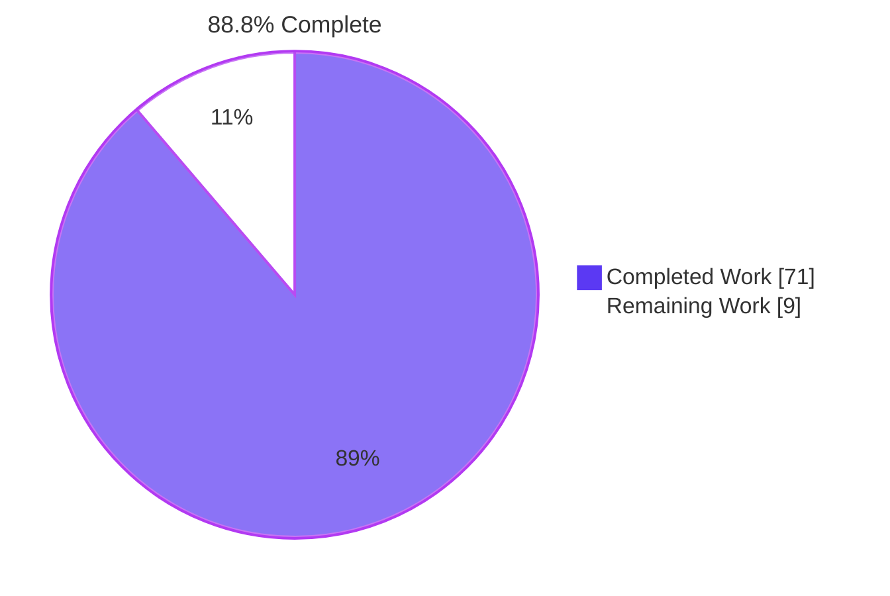
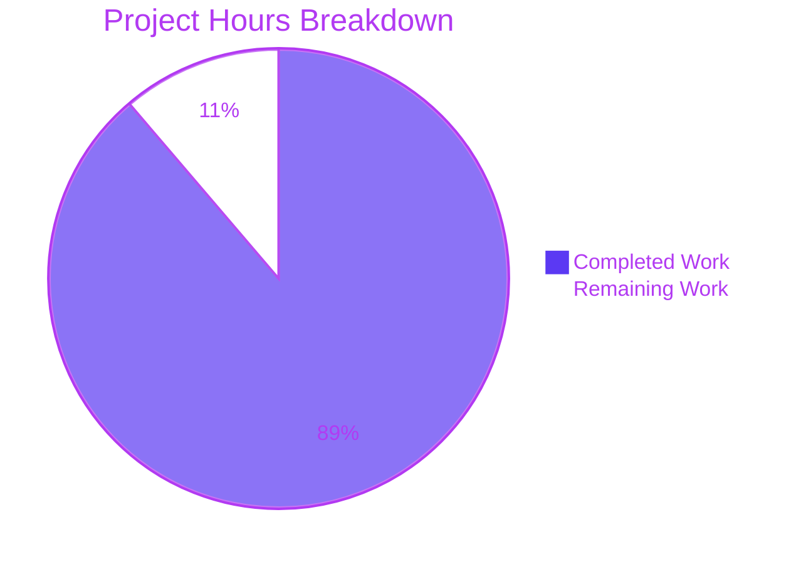
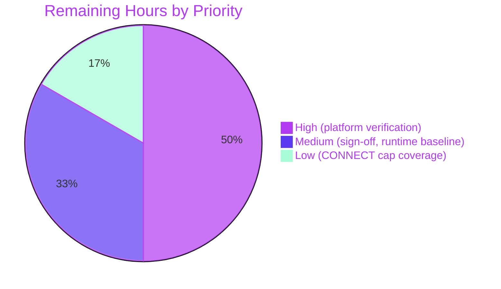

# 1. Executive Summary

## 1.1 Project Overview

hello-service is a dependency-free Node.js 20 HTTP service. It answers `GET /` with `Hello, world!` and greets a person named in an optional `name` query parameter (`Hello, Ada!`). Developers install, run and test it locally with `npm install`, `npm start` and `npm test`. It stores and logs nothing about who is greeted. It returns plain text only, so an echoed name is never rendered as HTML. Scope: one module on the built-in `http` module (`src/server.js`), a 20-case `node:test` suite, a manifest and lockfile, and a complete README.

## 1.2 Completion Status



| Metric | Value |
|---|---|
| Total Hours | 80 |
| Completed Hours (AI + Manual) | 71 (71 AI + 0 manual) |
| Remaining Hours | 9 |
| Percent Complete | 88.8% |

71 completed hours ÷ (71 + 9) total hours × 100 = 88.75%, shown as 88.8%.

## 1.3 Key Accomplishments

- [x] Full HTTP contract: greeting, trimming, the 50-code-point limit, 404, 405, HEAD and check precedence.
- [x] CONNECT gets a raw 405 or 404, never a tunnel, and every rejected socket closes within 5 seconds.
- [x] Unexpected errors return `500` or close the connection, logs hold only source literals, and serving continues.
- [x] `PORT` handling (default 3000, trimmed, `0`, invalid, in use) gives the exact messages and exit codes.
- [x] Zero-dependency package: `npm ci --offline` downloads nothing and leaves the lockfile byte-identical.
- [x] 20 of 20 tests pass on Node 20.20.2 and Node 22.23.3, exiting on their own in under one second.
- [x] Every response is `text/plain; charset=utf-8` with `nosniff`, and Chrome shows HTML in a name as literal text.
- [x] Every POSIX command in the README produces the output it states.

## 1.4 Critical Unresolved Issues

No defect is open. 3 items remain open. 1 of the 27 AAP requirements, identical behaviour on Windows and Linux, is unverified. 2 accepted caveats need an owner's decision before release.

| Issue | Impact | Owner | ETA |
|---|---|---|---|
| Behaviour on Windows (cmd, PowerShell) and Linux has never been exercised (Section 5.2, row 7) | The portability requirement is proven on macOS only | Developer with Windows and Linux hosts | 4.5 h |
| Node.js 20 reached end of life on 2026-04-30, and `engines` `>=20` still admits it | The baseline runtime receives no further security fixes | Tech lead | 1 h |
| Rejected CONNECT sockets are bounded by a 5-second lifetime cap rather than the idle timeout the AAP specifies (Section 5.2, row 1), and no automated test asserts the cap | The behaviour differs from the agreed wording, and a regression would go unnoticed | Reviewer | 1.5 h after sign-off |

## 1.5 Access Issues

| System/Resource | Type of Access | Issue Description | Resolution Status | Owner |
|---|---|---|---|---|
| Windows 10/11 and Linux test hosts | Test environment | Only a macOS arm64 host was available, so the cross-platform parity runs could not take place | Open | Developer |

No credentials, API keys, registries or external services are involved.

## 1.6 Recommended Next Steps

1. [High] Run `npm test` and success criteria 1–7 on Windows (cmd and PowerShell) and on Linux.
2. [Medium] Review and sign off the divergences in Section 5.2, then merge.
3. [Medium] Make Node.js 22 or 24 LTS the recommended runtime and rerun the package gate.
4. [Low] Decide whether to add an automated probe for the 5-second CONNECT lifetime cap.

# 2. Project Hours Breakdown

## 2.1 Completed Work Detail

| Component | Hours | Description |
|---|---|---|
| Package manifest and lockfile (AAP 0.4.5, D20) | 1.5 | `package.json` byte-identical to the AAP block (CommonJS, `engines` `>=20`, `start` and `test` scripts, empty dependency maps). npm-generated lockfile v3 with only the root entry |
| Greeting logic and input validation (FR2–FR4, D9–D12) | 4 | `greet`: Unicode-aware `trim()`, blank fallback, 50-code-point limit with no normalisation, first `name` value, lenient WHATWG decoding |
| HTTP routing and response contract (FR1, FR5, FR6, D4–D8, D21, D25) | 5 | `textHeaders`, `send` and `splitTarget`. Exact `/` match, 404 before 405 before 400, `Allow: GET`, HEAD declared lengths, byte-accurate `Content-Length`, `nosniff`, prompt body drain |
| CONNECT listener (D24, D27) | 6 | `rejectConnect`: raw 405 or 404 with `Connection: close`, no tunnel, half-close that sends no RST, 5-second lifetime cap, guarded raw 500 and destroy fallback |
| Error boundary and privacy-safe diagnostics (FR7, D26, D27) | 5 | Outer and inner `try/catch`, 500 or destroy, `describeError` built from frozen labels and an allowlist of 14 codes, `logSafely`; the server keeps serving |
| Start-up lifecycle and configuration (FR8–FR10, D1, D13–D16, D22) | 3.5 | `parsePort`, `start()`, the server `error` listener, the `require.main` guard and the `{ createServer, greet }` exports |
| Test suite (FR12, AAP 0.11.1) | 30 | 1,813 lines and 20 top-level tests. Raw socket clients, keep-alive and partial-body probes, child-process lifecycle tests, a per-test cleanup registry with bounded waits, Unicode and error-variant fixtures |
| README (FR11, AAP 0.4.5) | 6 | 362 lines in nine sections: requirements, install, run, `PORT` for bash/zsh, cmd and PowerShell, test, examples per interface row, behaviour matrix, troubleshooting |
| Runtime verification and hardening (AAP 0.10.2, 0.11.2) | 10 | Gates on Node 20 and Node 22, success criteria 1–6 checked live, browser rendering, hostile-input, load and memory probes, mutation runs against the suite |
| **Total** | **71** | |

## 2.2 Remaining Work Detail

| Category | Hours | Priority |
|---|---|---|
| Windows 10/11 verification in cmd and PowerShell: `npm install`, `npm test`, the README's per-shell `PORT` commands, `curl.exe` criteria 1–6, firewall prompt (AAP 0.10.2) | 3.0 | High |
| Linux verification: `npm test`, criteria 1–6, criterion 7 inside a network namespace (`unshare -rn`) (AAP 0.10.2, 0.11.2) | 1.5 | High |
| Review and sign-off of the Section 5.2 divergences, rows 1–6, then merge (path to production) | 2.0 | Medium |
| Runtime baseline decision for the Node 20 end-of-life: adopt Node 22 or 24 LTS and rerun the gate (AAP D3) | 1.0 | Medium |
| Decide on automated regression coverage for the 5-second CONNECT lifetime cap, given that AAP 0.11.1 fixes the suite at 20 tests (AAP D24) | 1.5 | Low |
| **Total** | **9.0** | |

## 2.3 Hours Calculation

- Completed: 1.5 + 4 + 5 + 6 + 5 + 3.5 + 30 + 6 + 10 = **71 hours**
- Remaining: 3.0 + 1.5 + 2.0 + 1.0 + 1.5 = **9 hours**
- Total: 71 + 9 = **80 hours**
- Completion: 71 ÷ 80 × 100 = **88.75%**, shown as 88.8%

Of the 27 AAP requirements, 26 are Completed and 1 is Partially Completed: cross-platform parity, about 60% done. The design is shell-neutral and has been statically reviewed, but it has only been run on macOS. None is Not Started. Confidence is high for completed work, which is backed by observed test runs. It is medium for the Windows estimate, since first-run behaviour there (firewall prompt, `curl.exe`, cmd quoting) is unproven.

# 3. Test Results

These results come from `npm test` (`node --test test/server.test.js`) at commit `ab16e17`, on Node v20.20.2 / npm 10.8.2, macOS arm64. The run reported `tests 20`, `pass 20` and `fail 0`, exited 0 and took about 0.97 s.

| Area / Category | Framework | Tests | Passed | Failed | Coverage | What This Proves |
|---|---|---|---|---|---|---|
| Greeting and input validation (T1–T7, T10–T12) | node:test + node:assert | 10 | 10 | 0 | In-process, see total | Default, named, trimmed, blank, 50/51-code-point, decoded and HTML-bearing names return exact bodies and headers |
| Routing, methods and HEAD (T8, T9) | node:test | 2 | 2 | 0 | In-process | Any other path gets 404, any non-GET on `/` gets 405 with `Allow: GET` promptly (even mid-body), and HEAD declares 19 or 10 bytes without sending them |
| CONNECT and parser boundary (T17, T18) | node:test + raw `node:net` | 2 | 2 | 0 | In-process | CONNECT gets a raw 405, 404 or 500, or a closed connection, never a tunnel. Unknown method tokens get Node's native 400, and serving continues |
| Error boundary and log privacy (T13, T19, T20) | node:test (`t.mock`) | 3 | 3 | 0 | In-process | Failures yield a 500 or a destroyed connection, logs never contain request data, keep-alive survives a 500, and the server keeps serving |
| Start-up lifecycle via the real entry point (T14–T16) | node:test + `child_process` | 3 | 3 | 0 | Child process (not instrumented) | `PORT` overrides (plain, padded, zero-padded, `0`) work, and port-in-use and invalid `PORT` exit 1 with the exact messages |
| Node 22 compatibility (`node --test test/server.test.js` on v22.23.3) | node:test | 20 | 20 | 0 | — | `engines` `>=20` holds on the next LTS line |
| Package gate (`npm ci --offline`, `git diff --exit-code package-lock.json`, `npm pkg get`) | npm 10.8.2 | 3 | 3 | 0 | — | The install downloads nothing, writes no `node_modules`, keeps the lockfile unchanged, and the manifest reads `">=20"`, `"commonjs"`, `{}`, `{}` |
| **Total, Node 20 suite** | node:test | **20** | **20** | **0** | `src/server.js`: 97.26% lines, 92.86% branches, 82.35% functions (`--experimental-test-coverage`, in-process) | Every interface row in AAP 0.4.3 has at least one passing test |

The uncovered lines in `src/server.js` (309–310, 313–314, 341–342, 346–348, 355) belong to `parsePort` and `start()`. Those run only inside the spawned child processes of T14–T16, which the coverage tool does not instrument.

**Not Covered**

- **Windows and Linux.** No test or runtime check has run on either OS. Before release, run `npm test` and criteria 1–7 in cmd, PowerShell and a Linux shell.
- **The 5-second CONNECT lifetime cap.** T17 runs the code path but asserts no timing. Probe it by hand: a client that trickles bytes after `CONNECT` must be disconnected about 5 s after hand-off.
- **Default port 3000 with `PORT` unset or blank.** No automated test covers this; it was checked by hand (`Listening on http://localhost:3000`).
- **The post-listen `Server error:` branch and non-`EADDRINUSE` listen failures (`Could not start the server on port <port>: <message>`).** No test triggers these lines (341–348).
- **The body drain itself (`req.resume()`).** From outside it cannot be told apart from Node's own discard. T9 asserts only the observable effect: a prompt 405 and the connection staying in step.
- **The README's cmd and PowerShell commands.** None has been executed.
- **Criterion 7 with networking disabled at the OS level.** The suite uses loopback only and the install runs offline, but no network-isolated run was made on this host.

# 4. Runtime Validation & UI Verification

The service was started with `npm start` and driven with `curl`, raw `nc` sockets and Chrome. The checks used isolated ports, plus port 3000 for the default-port check.

- ✅ **Start-up**: prints exactly one stdout line, `Listening on http://localhost:<port>`, and listens on `3000` when `PORT` is unset. The line reports the port actually bound, including for `PORT=0`.
- ✅ **Greeting flows**: `/` → `Hello, world!`; `?name=%20Ada%20` → `Hello, Ada!`; `?name=` → 200 with `Content-Length: 13`; 51 × `a` → 400; 50 × `a` → 200; `Zo%C3%AB` → `Hello, Zoë!`. No body ends with a trailing newline.
- ✅ **Routing**: `/about` → 404 `Not found.`; `POST /` → 405 with `Allow: GET`; `HEAD /` → 405 declaring `Content-Length: 19` with no body.
- ✅ **CONNECT and parser boundary (raw sockets)**: `CONNECT /` gets a raw 405 with the text headers, `Allow: GET` and `Connection: close`, and no `Date`. `CONNECT example.com:443` gets a raw 404. `FOO /` gets Node's native `400 Bad Request` with only `Connection: close`.
- ✅ **Port lifecycle**: a second start on an occupied port prints `Port <port> is already in use. Stop the other process or set PORT to a free port.` and exits 1. `PORT=abc` exits 1 with the invalid-`PORT` message. A `PORT` override serves the new port, and the old port then refuses connections (curl exit 7).
- ✅ **Browser (Chrome)**: `/` and `?name=Ada` render as unstyled plain text. `?name=%3Cb%3EAda%3C%2Fb%3E` shows `Hello, <b>Ada</b>!` literally (no `<b>` element, normal weight, `text/plain; charset=utf-8` with `nosniff`). `/about` returns 404. There are no unexpected console errors.
- ✅ **Error boundary at runtime** (through the `createServer({ greet })` injection): forced failures return `500 Something went wrong.` or a destroyed connection. Each logs one literal-only line, such as `Unexpected error while handling a request (stage: greeting): TypeError`, and later requests are still served.
- ✅ **Load and resources**: 1.63 million requests with unique names were each answered with their own name, with zero errors. File descriptors return to baseline. Request bodies from 128 MiB to 4 GiB are drained without buffering, with memory levelling off. Trickling, idle and recovered-500 CONNECT sockets close about 5.0 s after hand-off, and 128 KiB of early input still receives the full 405.
- ⚠ **Windows (cmd, PowerShell) and Linux**: never exercised at runtime. This includes the README's `set "PORT=4000"`, `$env:PORT` and `curl.exe` forms and the Windows firewall prompt.

The service has no external integrations, no authentication and no UI beyond plain-text bodies, so there are no further flows to drive.

# 5. Compliance & Quality Review

## 5.1 Compliance Matrix

| Deliverable | AAP Reference | Benchmark | Status | Progress | Evidence |
|---|---|---|---|---|---|
| Greeting and input validation | FR1–FR4, D4, D9–D12 | Exact bodies and headers, Unicode trimming, code-point limit | ✅ PASS | ██████████ 100% | T1–T7, T10–T12; `src/server.js:109` |
| Routing, methods, HEAD, precedence | FR5, FR6, D5–D8, D25 | 404 > 405 > 400 > 200, all 35 `http.METHODS` | ✅ PASS | ██████████ 100% | T8, T9, T18 |
| CONNECT handling | D24, D27 | Raw 405 or 404, no tunnel, socket bounded at 5 s | ✅ PASS, mechanism differs (5.2 row 1) | ██████████ 100% | T17; `src/server.js:196–232` |
| Error boundary and log privacy | FR7, D17, D26, D27 | 500 or destroy, literal-only logs, server keeps running | ✅ PASS | ██████████ 100% | T13, T19, T20 |
| Start-up, `PORT`, guard, exports | FR8–FR10, D1, D13–D16, D22 | Exact messages, exit code 1, no `process.exit` | ✅ PASS | ██████████ 100% | T14–T16; `src/server.js:307–365` |
| Body drain and statelessness | D21, AAP 0.3.2 | Prompt 405 mid-body, no module-level mutable state | ✅ PASS | ██████████ 100% | T2, T9; load run |
| Test suite | FR12, AAP 0.11.1 | Exactly 20 top-level tests, self-exiting, loopback only | ✅ PASS, extended (5.2 rows 2–3) | ██████████ 100% | `test/server.test.js`; 20/20 on Node 20 and 22 |
| README | FR11, AAP 0.4.5 | Nine sections, per-shell commands, exact outputs | ✅ PASS, wording differs (5.2 row 6) | ██████████ 100% | `README.md` |
| Manifest and lockfile | AAP 0.4.5, D3, D20 | Zero dependencies, lockfile reproducible offline | ✅ PASS | ██████████ 100% | `package.json`, `package-lock.json`; package gate |
| Success criteria 1–7 | AAP 0.11.2 | Every command gives its stated output | ✅ PASS on macOS | █████████░ 90% | `curl`, `npm test`; Windows and Linux not run |
| Cross-platform parity | NFR portability, AAP 0.10.2 | Identical behaviour on macOS, Linux and Windows | ⚠ PARTIAL | ██████░░░░ 60% | macOS only (5.2 row 7) |
| Scope, exclusions and code quality | AAP 0.6.2, 0.7.1, 0.10.1; Rules: none supplied | No excluded artifacts, no placeholders, CommonJS, `node:` built-ins only | ✅ PASS, README replaced (5.2 rows 4–5) | ██████████ 100% | `git diff --stat`: 5 paths; no TODO/FIXME markers |

## 5.2 AAP & Rule Divergences and Gaps

No user rules were supplied, so every divergence below is from the AAP.

| # | What the AAP/Rule Required | What Was Delivered Instead | Why It Diverged | Impact | Remediation |
|---|---|---|---|---|---|
| 1 | D24: rejected CONNECT socket gets "a 5-second idle timeout that destroys it" | A fixed 5-second lifetime timer armed at hand-off, with no idle timer (`src/server.js:200–206`) | An idle timer restarts on every byte, so a client trickling input could keep the socket open forever, contrary to D24's own rationale | Idle sockets still close at 5 s. Active ones now close at 5 s too | Sign off; optionally add a timing probe |
| 2 | AAP 0.4.1/0.11.1: `request(port, …)`, `rawRequest(port, text)`, and `startServer` registering its own `t.after` | `request(t, port, …)`, `rawRequest(t, port, text)`, and one cleanup registry per test (`onCleanup`) | 0.11.1 requires each socket to close in its own test's `t.after`, and node:test skips a test's later hooks once one fails | Test-internal only | Accept |
| 3 | AAP 0.11.1 case texts (T13/T20 "2 calls"; T17 overrides only `STATUS_CODES[405]`; raw client only for CONNECT and unknown tokens) | Extra error variants, a scoped `net.Socket.prototype.end` override, raw keep-alive and partial-body probes, a hardened port holder, four `PORT` forms in T14, 10 s timeouts on every test | The literal cases could not detect regressions in promises AAP 0.4.4, D21 and D26 make | Stronger suite; still 20 tests, under 1 s | Accept |
| 4 | AAP 0.7.1: all five files CREATE, no existing file modified; 0.5.1: a five-file tree | `README.md` (`# Hello_World_py`) replaced wholesale; pre-existing `submod.py` kept | The AAP assumed an empty, non-git directory; the repository already held both files | The old README is gone; an unrelated Python file stays at the root | Decide whether `submod.py` belongs here |
| 5 | AAP 0.4.1: the five response bodies appear "nowhere else" | Code literals only in frozen `MESSAGES` (`src/server.js:46–52`), also quoted in the header comment and the `greet` JSDoc | AAP 0.10.1 requires a header comment summarising the interface | None at runtime | Accept, or remove the quotes |
| 6 | D5: Node's native rejections "carry only `Connection: close`"; 0.4.5 lists three troubleshooting topics | README limits the claim to parser errors (`README.md:273`). Adds a fourth troubleshooting entry (`README.md:352–355`) | On Node 20.20.2, missing-`Host` 400 and unsupported-`Expect` 417 add `Date`; the AAP sentence is inaccurate for them | Documentation only | Optionally document the 417 and 400 |
| 7 | NFR portability and AAP 0.10.2: identical behaviour on macOS, Linux and Windows, checked where hosts exist | Verified on macOS arm64 only | Not carried out: only a macOS host was available | Windows and Linux behaviour unproven | Run Section 2.2 High tasks |

**1 — CONNECT lifetime cap.** D24 asks for an idle timeout. Its rationale says a handed-off socket sits outside Node's request timeouts, "so the listener bounds its life itself". `socket.setTimeout` restarts on every byte read, and `rejectConnect` keeps reading (and discarding) with `socket.resume()`, so a client sending one byte every two seconds could hold the socket open indefinitely. `src/server.js:200–206` replaces the idle timer with `setTimeout(() => socket.destroy(), 5000)`, unref'd and cleared on `close`. An idle timer at the same 5 s could never fire first, so none is kept. Responses, headers and the half-close are unchanged. The reviewer should accept this reading of D24 and decide whether an automated timing probe is worth 5 s of suite time.

**2 — Test helper signatures and cleanup shape.** AAP 0.11.1 says every server, socket and child process a test opens must be closed in that test's own `t.after`, which requires the test context. `request(t, port, …)` (`test/server.test.js:195`) and `rawRequest(t, port, text)` (`:347`) take it in the same leading position as the AAP's own `startServer(t, options)`. All cleanup steps run through `onCleanup` (`:88–93`): one `t.after` per test, newest first, each step under a 10 s deadline. node:test skips a test's remaining `after` hooks once one fails, so separate hooks could leave a spawned child alive. Behaviour and return shapes are unchanged. No action is needed beyond acknowledging the change.

**3 — Suite extended beyond the case texts.** The prescribed assertions could not catch a server that closed the connection after a 500, held its 405 until a request body finished, or derived log labels from `err.name`, all behaviours AAP 0.4.4, D21 and D26 promise. Under AAP 0.11.1, T13's two-call assertion still runs for its original scenario, after which 13 request-derived variants are checked; T20 counts three calls. T17 adds a `net.Socket.prototype.end` override scoped to its own server. `keepAliveExchange` (`:470`) and `keepAliveRequests` (`:785`) use raw sockets beyond D18's two named cases, and ordinary requests keep `agent: false` (`:198`). There are still exactly 20 tests. Accept the extension.

**4 — README replaced rather than created.** AAP 0.7.1 declares five new files and no modifications, and 0.5.1 draws a five-file tree; the plan assumed an empty, non-git directory. The repository already contained a one-line `README.md` (`# Hello_World_py`) and an unrelated `submod.py`. The README was replaced wholesale (`git diff --name-status` shows `M README.md`). `submod.py` is unchanged and still tracked, so the root holds six files. Nothing in the service depends on `submod.py`. The owner should decide whether it belongs in this repository or should move. Leaving it in place has no effect on `npm start` or `npm test`.

**5 — Response bodies quoted in documentation.** AAP 0.4.1 says the five fixed bodies are reproduced "character for character and nowhere else". They exist as code literals only in the frozen `MESSAGES` object (`src/server.js:46–52`). The interface summary in the header comment (`:9–18`) and the `greet` JSDoc example (`:100–102`) quote them as documentation, because AAP 0.10.1 requires that header summary. There is no runtime effect, but changing a message later means updating those comments too. Accept the reading that the rule applies to code literals, or remove the quoted strings from the comments.

**6 — README native-rejection and troubleshooting wording.** D5 states that Node's native rejections carry only `Connection: close`. On Node 20.20.2 that holds for parser errors (the 400 for `FOO /`, the 431 for oversized heads) but not for the missing-`Host` 400 or the unsupported-`Expect` 417, which add `Date`. So `README.md:273` narrows the claim to parser errors. Neither of the other two responses is documented, and `POST /` with `Expect: x` gets 417 rather than 405 (Node's default under D23). Troubleshooting also documents `Could not start the server on port <port>: <message>` (`README.md:352–355`), citing the operating system denying permission rather than a low port, because macOS lets ordinary users bind port 80. Optionally document the 417 and 400.

**7 — Cross-platform parity unverified.** The non-functional requirements promise identical behaviour on macOS, Linux and Windows. AAP 0.10.2 asks for `npm test` and the 0.11.2 commands to be run on each available OS. That was not carried out, because only a macOS arm64 host was available. The design is shell-neutral: the scripts contain no shell syntax, the tests spawn `process.execPath` without a shell and build paths with `path.join`, and the README gives cmd and PowerShell forms. But none of that has run on Windows or Linux. Criterion 7 rested on an offline install and a loopback-only suite rather than a network-isolated run. Complete the two High tasks in Section 2.2.

# 6. Risk Assessment

| # | Risk | Category | Severity | Probability | Mitigation | Status |
|---|---|---|---|---|---|---|
| 1 | Node.js 20 reached end of life on 2026-04-30. Hosts running 20.20.2, the final v20 release, receive no fixes for later advisories | Security | Medium | High | Run on a maintained LTS (22 or 24); the suite already passes 20/20 on Node 22. The README recommends a maintained release | Accepted (AAP D3); decision in Section 2.2 |
| 2 | Behaviour on Windows (cmd, PowerShell) and Linux is unproven: shell quoting of `PORT`, `curl.exe` output, the firewall prompt, child-process exit codes | Integration | Medium | Medium | Run `npm test` and success criteria 1–7 on Windows 10/11 and a Linux host | Open |
| 3 | `listen()` binds every interface (D14), so the unauthenticated service is reachable from the local network | Security | Low | Medium | Run only on trusted networks, or deny inbound access with the host firewall. Responses are fixed plain text with `nosniff`, and CONNECT never tunnels | Accepted by design |
| 4 | On macOS, a port held by another process only on `0.0.0.0`, `127.0.0.1` or `::1` may not raise `EADDRINUSE`, so two servers can share a port number | Operational | Low | Low | Check `lsof -i :<port>` when responses look wrong; use a dedicated port | Accepted (platform behaviour) |
| 5 | The 5-second lifetime limit on rejected CONNECT sockets has no automated regression test, so a future change could reintroduce unbounded sockets unnoticed | Technical | Low | Low | Add an opt-in timing probe, or keep the manual `nc` check in the release checklist | Open |
| 6 | Request bodies are drained without a size limit (D21) and are bounded only by Node's 300 s `requestTimeout`. Multi-gigabyte uploads raise resident memory to a plateau of about 136 MiB | Operational | Low | Low | Front the service with a proxy that caps body size if it is ever exposed | Accepted (AAP D21) |
| 7 | Error logs are literal-only: label, stage and allow-listed code, with no message or stack trace (D26). Diagnosing a real fault needs a reproduction | Operational | Low | Medium | Reproduce locally through `createServer({ greet })` injection | Accepted (AAP D26) |
| 8 | Node's native 417 (unsupported `Expect`) and missing-`Host` 400 sit outside the documented response contract. `POST /` with `Expect: x` returns 417, not 405 | Integration | Low | Low | Document both in the README Behaviour section if clients depend on exact statuses | Accepted (AAP D23) |

# 7. Visual Project Status



**71 of 80 hours complete (88.8%), 9 hours remaining.**

**Remaining hours by priority**



**Remaining hours by category (Section 2.2)**

| Category | Hours | Priority | Share of remaining |
|---|---|---|---|
| Windows 10/11 verification (cmd and PowerShell) | 3.0 | High | ██████████ 33% |
| Divergence review, sign-off and merge | 2.0 | Medium | ███████ 22% |
| Linux verification, including criterion 7 with networking disabled | 1.5 | High | █████ 17% |
| Automated coverage decision for the CONNECT lifetime limit | 1.5 | Low | █████ 17% |
| Node 20 end-of-life runtime decision | 1.0 | Medium | ███ 11% |
| **Total** | **9.0** | | **100%** |

# 8. Summary & Recommendations

hello-service is complete for its agreed scope on macOS. `src/server.js` (365 lines, built-in `node:http` only) implements the full greeting contract. That covers the default and named greetings, Unicode-aware trimming, the 50-code-point limit, exact-path 404s, 405 with `Allow: GET` for every recognised non-GET method, a raw CONNECT rejection that never tunnels, a 500 boundary that logs nothing taken from the request, and strict `PORT` handling with exact start-up messages. `test/server.test.js` holds exactly 20 tests, and all pass on Node 20.20.2 and Node 22.23.3 in under one second. `package.json` matches the AAP byte for byte, the lockfile reproduces offline, and the README documents every command and response.

AAP-scoped completion is **88.8%**: 71 of 80 hours. 26 of 27 requirements are complete and verified by tests, `curl`, raw sockets and Chrome. The one partial requirement is cross-platform parity: the design is shell-neutral but has run only on macOS arm64. The remaining 9 hours are verification and decisions, not construction. Windows and Linux runs take 4.5 hours, sign-off of six divergences and the merge take 2 hours, the Node 20 end-of-life decision takes 1 hour, and deciding automated coverage for the CONNECT lifetime limit takes 1.5 hours.

The critical path to release is short. First run `npm test` and success criteria 1–7 on Windows 10/11 (cmd and PowerShell) and on Linux, with criterion 7 run under `unshare -rn`. Then review Section 5.2: the 5-second CONNECT lifetime limit that replaces D24's idle timeout, the changed test-helper signatures, the extended test cases, the replaced README, message quotes in comments and the narrowed README wording. None changes the documented HTTP contract, but each departs from the agreed text and needs explicit acceptance before merge.

Success metrics for sign-off:

| Metric | Target | Current |
|---|---|---|
| `npm test` on Node 20 and 22 | 20 / 20, exit 0 | 20 / 20 on both (macOS) |
| Success criteria 1–7 | All pass on macOS, Linux, Windows | All pass on macOS; Linux and Windows not run |
| Runtime dependencies | 0 | 0 (`dependencies: {}`, `devDependencies: {}`) |
| Line coverage of `src/server.js` (in-process) | No formal target | 97.26% |
| Open defects | 0 | 0 |

**Production readiness:** ready for its intended use as a local, single-user service started with `npm start` on macOS and on Node 20 or 22. Before calling it portable, run the Windows and Linux checks and sign off the divergences. For any host that will stay up long-term, choose a maintained Node LTS (22 or 24), since Node 20 no longer receives security fixes.

# 9. Development Guide

## System Prerequisites

- **Node.js 20 or later** with its bundled npm (verified on Node 20.20.2 with npm 10.8.2, and on Node 22.23.3). Node 20 is past end of life, so use 22 or 24 LTS for long-running hosts.
- **OS:** macOS, Linux or Windows 10/11. Only macOS arm64 has been verified.
- **Tools for the examples:** `curl` (`curl.exe` in PowerShell), and optionally `nc` for raw CONNECT checks.
- No database, cache, Docker, credentials or network access is needed. There are no third-party packages.

## Environment Setup

Run every command from the repository root. Confirm that the toolchain on `PATH` is Node 20 or later:

```bash
node --version   # v20.x or later, e.g. v20.20.2
npm --version    # e.g. 10.8.2
```

The only environment variable the service reads is `PORT`: unset or blank means 3000, otherwise a whole number from 0 to 65535. Set `CI=true` when scripting npm so nothing prompts.

## Dependency Installation

```bash
npm ci --offline --no-audit --no-fund
git diff --exit-code package-lock.json   # exit 0: lockfile unchanged
npm pkg get engines.node type dependencies devDependencies
```

Expected: `npm ci` exits 0 and creates no `node_modules`. `npm pkg get` prints `">=20"`, `"commonjs"`, `{}` and `{}`. `npm install --offline --no-audit --no-fund` also works and leaves `package-lock.json` byte-identical.

## Build and Static Checks

There is no build step. Syntax-check each file separately, because `node --check` reads only its first argument:

```bash
node --check src/server.js
node --check test/server.test.js
```

## Run the Test Suite

```bash
npm test
```

Expected summary: `# tests 20`, `# pass 20`, `# fail 0`, exit 0, in about one second. The suite binds only OS-assigned ports on `127.0.0.1`, so it can run in parallel with other work. For in-process coverage:

```bash
node --test --experimental-test-coverage test/server.test.js
```

## Application Startup

```bash
PORT=4000 npm start          # bash/zsh; prints: Listening on http://localhost:4000
npm start                    # default port 3000
```

Windows forms, as documented in the README (not yet verified on Windows):

```text
set "PORT=4000" && npm start        (cmd)
$env:PORT = "4000"; npm start       (PowerShell; undo with: Remove-Item Env:PORT)
```

Stop the server with Ctrl+C. To run it in the background, start it with `npm start > server.log 2>&1 &`, note the pid from `echo $!`, and stop it with `kill <pid>`. SIGTERM sent to npm also stops the Node child.

## Verification Steps and Example Usage

With the server listening on port 4000:

```bash
curl -s http://localhost:4000/                     # Hello, world!   (no trailing newline)
curl -s "http://localhost:4000/?name=%20Ada%20"    # Hello, Ada!
curl -s "http://localhost:4000/?name=Zo%C3%AB"     # Hello, Zoë!
curl -si "http://localhost:4000/?name="            # 200, Content-Length: 13, Hello, world!
curl -si "http://localhost:4000/?name=$(printf 'a%.0s' $(seq 51))"   # 400 Name must be 50 characters or fewer.
curl -si http://localhost:4000/about               # 404 Not found.
curl -si -X POST http://localhost:4000/            # 405 Method not allowed. with Allow: GET
curl -sI http://localhost:4000/                    # HEAD: 405 headers, Content-Length: 19, no body
printf 'CONNECT / HTTP/1.1\r\nHost: localhost\r\n\r\n' | nc localhost 4000
                                                   # raw 405, Allow: GET, Connection: close, no Date
```

Every application response carries `Content-Type: text/plain; charset=utf-8`, a byte-accurate `Content-Length` and `X-Content-Type-Options: nosniff`. In a browser, `http://localhost:4000/?name=%3Cb%3EAda%3C%2Fb%3E` shows `Hello, <b>Ada</b>!` as literal text.

## Troubleshooting

| Symptom | Cause | Resolution |
|---|---|---|
| `Port 4000 is already in use. Stop the other process or set PORT to a free port.`, exit 1 | Another process holds the port | `lsof -i :4000` to find it, or choose another `PORT` |
| `Invalid PORT "abc": expected a whole number from 0 to 65535.`, exit 1 | `PORT` is not a whole number in range | Correct or unset `PORT` |
| `Could not start the server on port <port>: <message>`, exit 1 | The OS refused the bind for another reason, such as denied permission | Use a different port or check host security policy |
| `Server error: <diagnostic>` after start-up | A listener-level error after listening began; the server keeps running | Inspect the host (file-descriptor limits, network changes) |
| `npm error enoent Could not read package.json` | Command run outside the repository root | `cd` to the repository root |
| `node` reports a version below 20 | Older Node earlier on `PATH` | Put Node 20 or later first on `PATH` |
| PowerShell `curl` output looks different | `curl` is an alias for `Invoke-WebRequest` | Use `curl.exe` |
| Windows firewall prompt on first start | The server binds every interface | Allow it for private networks, or deny it; local requests still work |

# 10. Appendices

## A. Command Reference

| Purpose | Command |
|---|---|
| Install, offline and reproducible | `npm ci --offline --no-audit --no-fund` |
| Confirm the lockfile is unchanged | `git diff --exit-code package-lock.json` |
| Confirm the manifest | `npm pkg get engines.node type dependencies devDependencies` |
| Syntax check | `node --check src/server.js` and `node --check test/server.test.js` |
| Run the tests | `npm test` (that is, `node --test test/server.test.js`) |
| Coverage | `node --test --experimental-test-coverage test/server.test.js` |
| Start on the default port | `npm start` |
| Start on another port (bash/zsh) | `PORT=4000 npm start` |
| Start on another port (cmd / PowerShell) | `set "PORT=4000" && npm start` / `$env:PORT = "4000"; npm start` |
| Find what holds a port | `lsof -i :<port>` |

## B. Port Reference

| Port | Use |
|---|---|
| 3000 | Default listening port when `PORT` is unset or blank |
| 4000 | Example override in the README and success criterion 6 |
| `PORT` (0–65535) | Any override; `0` asks the OS for a free port, and the start-up line reports the port actually bound |
| OS-assigned on `127.0.0.1` | Used by the test suite (`listen(0)`), so tests never collide with a running server |

## C. Key File Locations

| Path | Contents |
|---|---|
| `src/server.js` | The whole service: constants and frozen `MESSAGES` (line 46), `greet` (109), `send` (138), `rejectConnect` (196), `createServer` (248), `parsePort` (307), `start` (322), entry-point guard (361), `module.exports = { createServer, greet }` (365) |
| `test/server.test.js` | 20 top-level tests T1–T20 and their helpers: `onCleanup` (88), `startServer` (162), `request` (195), `rawRequest` (347), `spawnServer` (545), `holdPort` (658) |
| `package.json` | Manifest: `start` and `test` scripts, `engines.node >=20`, CommonJS, no dependencies |
| `package-lock.json` | lockfileVersion 3, root entry only |
| `README.md` | Requirements, Install, Run, Choose a port, Test, Example requests, Behaviour, Troubleshooting |
| `submod.py` | Pre-existing, unrelated Python file; not part of the service |

## D. Technology Versions

| Technology | Version | Notes |
|---|---|---|
| Node.js | 20.20.2 (verified); `>=20` declared | Also passes 20/20 on 22.23.3. Node 20 end of life: 2026-04-30 |
| npm | 10.8.2 | Bundled with Node 20.20.2 |
| Test runner | `node:test` and `node:assert` | Built in; no third-party framework |
| Runtime modules | `node:http` (server); `node:http`, `node:net`, `node:child_process`, `node:path` (tests) | No third-party packages |
| Module system | CommonJS (`"type": "commonjs"`) | |

## E. Environment Variable Reference

| Variable | Required | Default | Valid values | Behaviour when invalid |
|---|---|---|---|---|
| `PORT` | No | `3000` | Digits only, 0–65535, surrounding whitespace trimmed | Prints `Invalid PORT "<value>": expected a whole number from 0 to 65535.` to stderr and exits 1 without listening |

## F. Developer Tools Guide

- **Dependency injection for tests:** `createServer({ greet })` accepts a replacement `greet`. Pass one that throws to exercise the 500 and connection-destroy paths without patching the module.
- **Importing without starting:** `require('./src/server.js')` returns `{ createServer, greet }` and does not listen. Only `node src/server.js` or `npm start` starts the server.
- **Raw protocol checks:** use `nc` or `printf … | nc` for CONNECT and for unknown method tokens such as `FOO /`, which return Node's native `400 Bad Request` with only `Connection: close`.
- **Logs:** start-up prints one stdout line. Errors print one literal-only stderr line (label, stage, allow-listed code) and never include request data.

## G. Glossary

| Term | Meaning |
|---|---|
| Code point | One Unicode character as counted by `Array.from`; the 50-character name limit counts these, not UTF-16 units or graphemes |
| CONNECT rejection | The `connect` listener's raw 405 (on `/`) or 404 (elsewhere) written straight to the socket, which closes within 5 seconds of hand-off |
| Half-close | `socket.end()` after the response, so the server stops writing but unread client input does not trigger a reset |
| Literal-only diagnostics | Log lines built only from fixed labels, stage names and allow-listed error codes, never from request data or error messages |
| Precedence | When several checks fail: 404, then 405, then 400, then 200 |
