# Technical Specification

# 1. Introduction

## 1.1 Executive Summary

### 1.1.1 Project Overview

This Technical Specification documents the repository `GHNewRepoIW` (git remote path `irinakwulf/GHNewRepoIW`, single branch `main`). A full traversal of the repository establishes an important framing fact that governs this entire document: **the repository is near-empty.** It contains exactly two files, no sub-directories of any kind, and 132 bytes of total content.

| Artifact | Size | Role in the system |
|---|---|---|
| `submod.py` | 4 lines / 115 bytes | The entire executable system — one function plus a script guard |
| `README.md` | 1 line / 17 bytes | Project identification only — the single heading `# Hello_World_py` |

The system as implemented is a minimal, dependency-free Python module. `submod.py` defines one module-level function, `print_hi(name)`, whose body performs a single action: writing the fixed text `Hello Blitzy User, From Wulf 2` to standard output. A conventional `__name__ == '__main__'` guard at the foot of the file invokes `print_hi('PyCharm')` when the file is executed directly, so the module is usable both as an importable library and as a runnable script. The function returns `None` implicitly and has no other side effects.

A verified behavioral characteristic worth stating up front: although `print_hi` declares a required positional parameter `name`, the implementation never reads or interpolates that value. Direct execution confirms this — invoking the function with `'PyCharm'`, with an unrelated string, and with `None` each produced the identical output line. **The system's output is invariant with respect to its input.**

Because `README.md` consists solely of a project-name heading and the repository contains no requirements documents, design notes, issue templates, or architecture records, the codebase supplies no narrative describing intent beyond the code itself. Every statement in this specification is therefore derived from the two source files, from verified runtime behavior, and from git history.

### 1.1.2 Core Business Problem Being Solved

The repository does not document a business problem. There is no requirements artifact, no `docs/` directory, no `CONTRIBUTING.md`, and no descriptive prose in `README.md` from which a business driver could be read. Rather than infer one, this specification records only the problem the code demonstrably addresses.

| Dimension | Determination | Basis |
|---|---|---|
| Documented business problem | None recorded in the repository | `README.md` contains only `# Hello_World_py` |
| Demonstrable technical purpose | Emit a fixed greeting to standard output | `submod.py` line 2 |
| Functional character | Canonical "Hello World" validation artifact | Repository name `Hello_World_py`; single stdout side effect |

The observable purpose is environment and toolchain validation of the kind a "Hello World" program serves: it proves that a Python file in this repository can be executed by an interpreter, that its module-level definition is importable, and that its output reaches standard output. The repository name declared in `README.md` — `Hello_World_py` — is consistent with that reading and is the only self-description the project offers.

### 1.1.3 Key Stakeholders and Users

The repository defines no roles, no permissions, and no authentication of any kind, so there is no user model to document. The only stakeholder signals present are git authorship and the literal strings embedded in the code.

| Stakeholder signal | Evidence | Interpretation |
|---|---|---|
| Sole contributor | Both commits authored by `IrinaWulf` (2026-09-03) | Single-author project; no `CODEOWNERS` or `CONTRIBUTING.md` |
| Addressee in output | Literal `Hello Blitzy User, From Wulf 2` | The emitted message names its reader; no runtime identity is involved |
| Invocation context | Guard argument literal `'PyCharm'` | Names the JetBrains Python IDE; no `.idea/` configuration is committed |

Functionally, the system has two classes of consumer, both of them developers operating locally:

1. **Direct executors** — anyone running `submod.py` as a script, which triggers the guarded call and prints the greeting.
2. **Importing callers** — any Python module that imports `submod` and calls `print_hi(...)`. On import the module exposes exactly one public attribute, `print_hi`, and produces no output, because the guard suppresses execution outside the `__main__` context.

There is no end-user-facing surface — no API, no user interface, no service endpoint — so no non-developer user group can be identified from the code.

### 1.1.4 Expected Business Impact and Value Proposition

No business impact, return-on-investment target, or value proposition is stated anywhere in the repository, and this specification does not supply one. The value the artifact actually delivers is narrow, technical, and fully verifiable from what is committed.

| Value delivered | Verification observed |
|---|---|
| Confirms a Python 3 interpreter can execute repository code | `python3 submod.py` printed the expected line and exited with status `0` |
| Provides a safely importable module (no import-time side effects) | `import submod` produced no output; public surface is exactly `['print_hi']` |
| Imposes zero installation or dependency burden | `submod.py` declares no imports; the repository contains no dependency manifest |
| Offers a deterministic, trivially assertable output contract | The same single line was emitted for every argument supplied |

The practical significance is that the repository functions as a working baseline: a starting point onto which structure, dependencies, tests, and automation can be added. Its current form carries no packaging, no configuration, and no external coupling, which makes it inexpensive to run and trivial to reason about — and equally means it delivers no application functionality beyond the greeting itself.


## 1.2 System Overview

### 1.2.1 Project Context

#### 1.2.1.1 Business Context and Market Positioning

The repository contains no business or market documentation. `README.md` holds a single heading and nothing else; there is no `docs/` directory, no license, no changelog, and no contribution guide. Accordingly, no business context or market positioning can be established from the codebase, and none is asserted here.

What *can* be established is the project's provenance and lifecycle stage, taken from git history. The repository was created from nothing and has received two commits, both from the same author on the same day.

| Commit | Subject | Effect on the repository |
|---|---|---|
| `0ccc3f3` | Add files via upload | Introduced `submod.py` — the first content in the repository |
| `38cfbd5` | Create README.md | Introduced `README.md`; current `HEAD` of `main` |

Both commits are authored by `IrinaWulf` and dated 2026-09-03. `git log --all --name-only` confirms that `README.md` and `submod.py` are the only files ever tracked on any branch — nothing has been added and later removed, so no earlier or abandoned implementation is hidden in history. The working tree is clean and `git status --ignored` reports no ignored files, consistent with the absence of a `.gitignore`. The repository is therefore at inception stage, with the greeting script as its sole content.

#### 1.2.1.2 Current System Limitations

This project does not replace or upgrade an existing system. Git history begins with the initial upload of `submod.py`, and no file, comment, or commit message references a predecessor application, a migration, or a deprecated component. The subsection is therefore not applicable in the "replacing an incumbent" sense.

The limitations that *do* apply are the properties of the current implementation itself, all directly verified:

| Limitation | Concrete consequence |
|---|---|
| Output is a hardcoded literal, not derived from input | `print_hi(name)` ignores `name`; every call emits the same line |
| No return value | The function returns `None`, so callers cannot consume the greeting programmatically |
| Standard output is the only sink | No logging, no file writes, no network transmission |
| No error handling | The module contains no `try`/`except` and no validation of any kind |
| No tests or automated verification | Behavior is confirmable only by manual execution |
| No packaging metadata | The module cannot be installed or version-pinned as a distributable unit |

#### 1.2.1.3 Integration with Existing Enterprise Landscape

The system integrates with nothing. This is not an inference from a missing configuration file — it is verifiable from the source, which declares **zero import statements** of any kind, third-party or standard library. The only external symbol used is the `print` builtin.

A keyword scan of every file in the repository for `http`, `url`, `socket`, `request`, `sql`, `database`, `token`, `secret`, `password`, `api_key`, and `auth` returned no matches. Correspondingly, the repository holds no dependency manifest (`requirements.txt`, `pyproject.toml`, `setup.py`, `Pipfile`, `poetry.lock` are all absent), no `.env` or `.env.example`, no container definitions, and no CI configuration.

| Integration category | Status in the repository |
|---|---|
| Third-party libraries / SDKs | None — no imports, no manifest |
| Databases / persistence | None — no drivers, schemas, or migrations |
| HTTP / RPC / messaging | None — no client or server code |
| Identity, secrets, configuration | None — no auth code, no environment files |

The system's only interface to the outside world is the standard-output stream of the process that runs it. Its sole environmental prerequisite is a Python 3 interpreter.

### 1.2.2 High-Level Description

#### 1.2.2.1 Primary System Capabilities

The system provides exactly one capability, exposed through one callable.

| Capability | Interface | Observed behavior |
|---|---|---|
| Emit a fixed greeting to standard output | `print_hi(name)` in `submod.py` | Writes `Hello Blitzy User, From Wulf 2`; returns `None` |
| Run as a standalone script | `__main__` guard, `submod.py` lines 4–5 | Calls `print_hi('PyCharm')`; exits with status `0` |
| Be imported without side effects | `import submod` | Defines `print_hi` and produces no output |

The public surface of the module, measured by inspecting its non-dunder attributes after import, is a single name: `print_hi`. The function signature is `(name)` — one required positional parameter, untyped and without a default. There are no classes, constants, type aliases, docstrings, or `__all__` declaration.

#### 1.2.2.2 Major System Components

The component inventory is the file inventory: two files, zero directories.

| Component | Type | Responsibility |
|---|---|---|
| `submod.py` | Python module | Defines `print_hi`; hosts the script entry point |
| `README.md` | Markdown document | Declares the project name `Hello_World_py` |

There is no layering, no package structure, and no inter-module dependency to describe — `submod.py` is self-contained and `README.md` is documentation with no code relationship to it. The diagram below shows the two execution paths through the single component.

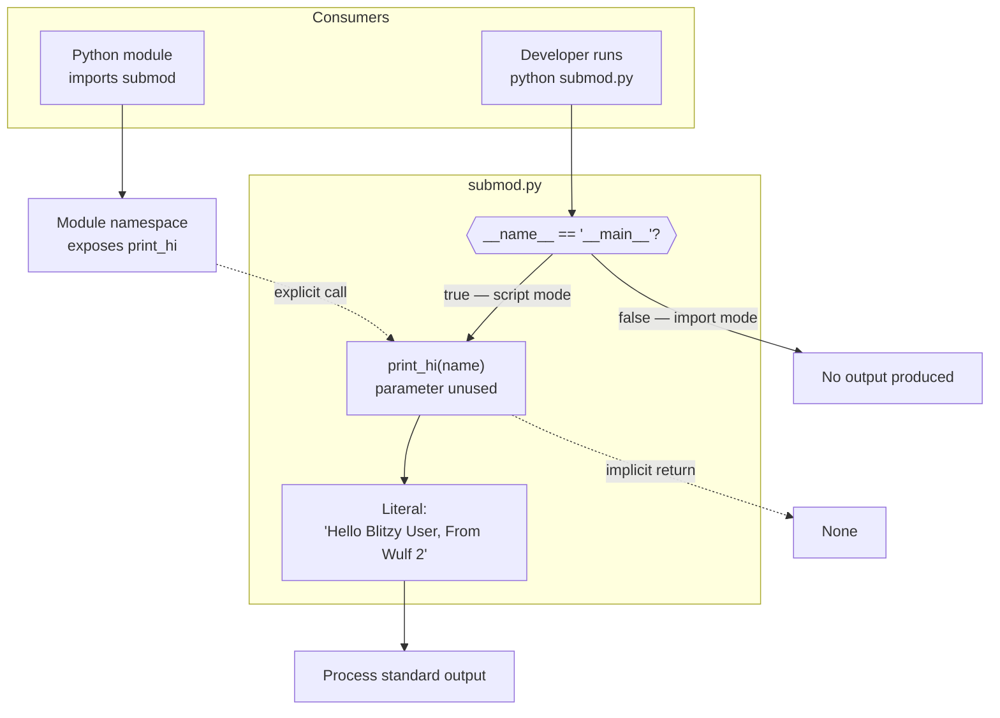
```mermaid
flowchart TD
    subgraph Consumers["Consumers"]
        CLI["Developer runs<br/>python submod.py"]
        Caller["Python module<br/>imports submod"]
    end

    subgraph Module["submod.py"]
        Guard{{"__name__ == '__main__'?"}}
        Fn["print_hi(name)<br/>parameter unused"]
        Lit["Literal:<br/>'Hello Blitzy User, From Wulf 2'"]
    end

    Sink["Process standard output"]

    CLI --> Guard
    Caller --> Import["Module namespace<br/>exposes print_hi"]
    Import -.->|"explicit call"| Fn
    Guard -->|"true — script mode"| Fn
    Guard -->|"false — import mode"| Silent["No output produced"]
    Fn --> Lit
    Lit --> Sink
    Fn -.->|"implicit return"| Ret["None"]
```

#### 1.2.2.3 Core Technical Approach

The implementation is deliberately minimal, and four properties characterize it completely:

1. **Plain Python 3, no framework.** The module uses only language builtins. It compiles cleanly and executes on a stock interpreter — verified on Python 3.12.3 with no virtual environment and no installation step.
2. **Zero dependencies.** Not one `import` statement appears in the source, so there is nothing to resolve, pin, vendor, or update. The absence of any manifest is consistent with this rather than an oversight in packaging.
3. **Dual-mode module design.** The `__name__ == '__main__'` guard is the single structural pattern present. It cleanly separates definition from execution, which makes the module safe to import: verified by importing it and observing no output.
4. **Synchronous, side-effect-only execution.** The function performs one blocking write to standard output and returns `None`. There is no concurrency, no asynchrony, no state, and no data returned to the caller.

### 1.2.3 Success Criteria

#### 1.2.3.1 Measurable Objectives

The repository defines no objectives — there are no test suites, no CI workflows, no acceptance criteria, and no requirements documents. The criteria below are therefore *not* project goals extracted from documentation; they are the objectively verifiable acceptance checks that the current implementation satisfies, each confirmed by direct execution.

| Verifiable criterion | Method | Result observed |
|---|---|---|
| Module compiles without syntax errors | `python3 -m py_compile submod.py` | Compiled clean |
| Script mode emits the exact expected line | `python3 submod.py` | `Hello Blitzy User, From Wulf 2` |
| Script mode terminates successfully | Inspect process exit status | `0` |
| Import produces no output | `import submod` | No output emitted |
| Public surface is exactly one callable | Inspect non-dunder attributes | `['print_hi']` |
| Output is deterministic across inputs | Call with three distinct arguments | Identical line each time |

#### 1.2.3.2 Critical Success Factors

| Factor | Why it is critical | Evidence |
|---|---|---|
| Availability of a Python 3 interpreter | The only environmental prerequisite for execution | No manifest to install; runs on a stock interpreter |
| Preservation of the `__main__` guard | Removing it would make importing the module emit output | `submod.py` lines 4–5 |
| Access to a standard-output stream | The sole channel through which the system produces a result | `print` on `submod.py` line 2 |
| Retention of the exact output literal | The literal *is* the system's entire output contract | `submod.py` line 2 |

The dominant success factor is the absence of complexity: with no dependencies, no configuration, and no external services, the failure surface is limited to the interpreter being present and the file being readable.

#### 1.2.3.3 Key Performance Indicators

**The repository contains no key performance indicators, and none are invented here.** This determination is the result of explicitly checking for every artifact class in which KPIs, SLAs, or quality gates are normally encoded:

| KPI / gate artifact class | Presence in repository |
|---|---|
| Test suites, `pytest.ini`, `tox.ini`, `conftest.py` | Absent |
| CI/CD pipelines (`.github/`, `.gitlab/`, `.circleci/`) | Absent |
| Coverage thresholds, lint or type-check gates | Absent — no `.flake8`, `.pylintrc`, `mypy.ini`, `.pre-commit-config.yaml` |
| Monitoring, metrics, tracing, or logging instrumentation | Absent — no logging calls anywhere in the source |
| Performance budgets, SLOs, or benchmark definitions | Absent |

No availability target, latency budget, throughput figure, error-rate threshold, or coverage percentage exists anywhere in the codebase. The only quantitative statements this specification can make about system performance are the measured facts already recorded: a single synchronous write to standard output, an exit status of `0`, and a total codebase of 132 bytes across two files.


## 1.3 Scope

Scope below is derived entirely from what the repository contains and what execution demonstrates. The repository holds no scope statement, roadmap, or architecture decision record, so the out-of-scope items in 1.3.2 are reported as **not present in the implementation** rather than as capabilities excluded by a documented decision.

### 1.3.1 In-Scope

#### 1.3.1.1 Core Features and Functionalities

**Must-have capabilities.** The in-scope feature set is a single behavior, implemented in a single function.

| Capability | Implementation | Status |
|---|---|---|
| Write the fixed line `Hello Blitzy User, From Wulf 2` to standard output | `print` call on `submod.py` line 2 | Implemented and verified |
| Expose that behavior as a reusable callable, `print_hi(name)` | `submod.py` line 1 | Implemented and verified |
| Execute as a standalone script | `__main__` guard, `submod.py` lines 4–5 | Implemented and verified |
| Import without producing output | Same guard, evaluated as false on import | Implemented and verified |
| Identify the project by name | `# Hello_World_py` in `README.md` | Implemented |

**Primary user workflows.** Two workflows exist, both developer-facing and both local to a single process.

| Workflow | Trigger | Result |
|---|---|---|
| Script execution | `python3 submod.py` | Greeting printed to stdout; process exits `0` |
| Library consumption | `import submod` then `submod.print_hi(<any value>)` | Greeting printed; `None` returned |

**Essential integrations.** None are in scope. `submod.py` declares no import statements, so the module depends on no third-party package, no standard-library module, and no external service. The only runtime facility it uses is the `print` builtin writing to the process's standard-output stream.

**Key technical requirements.** These are the requirements the committed code actually imposes:

| Requirement | Detail |
|---|---|
| Runtime | A Python 3 interpreter; verified working on Python 3.12.3 |
| Installation | None — no dependency manifest exists to install from |
| Configuration | None — no environment variables, config files, or CLI arguments are read |
| Output channel | A writable standard-output stream |
| Source integrity | `submod.py` must remain syntactically valid Python; it compiles clean today |

#### 1.3.1.2 Implementation Boundaries

**System boundaries.** The system is one Python module executing inside one operating-system process. Its boundary is that process: input crosses no boundary (the sole parameter is discarded), and output crosses exactly one (the standard-output stream). There is no client/server split, no service boundary, no inter-process communication, and no filesystem interaction beyond the interpreter reading the source file.

**User groups covered.** No user groups are defined. The repository contains no authentication, authorization, role model, or user record — verified by a keyword scan across all files that returned no matches for `token`, `secret`, `password`, `api_key`, or `auth`. The only distinction the code supports is the technical one between running the module and importing it; both are performed by a developer with local filesystem access. There is no `CODEOWNERS` or `CONTRIBUTING.md`, so no maintainer or reviewer group is formally designated either.

**Geographic and market coverage.** Not addressed by the implementation. The repository contains no `locales/` or `i18n/` directory, no translation catalogs, and no locale-selection logic; the single output message is a hardcoded English literal embedded directly in the source. The practical boundary is therefore that the system emits one message in one language regardless of environment or locale settings. No geographic or market targeting is stated anywhere in the repository, and none is asserted here.

**Data domains included.** None. This is a stronger claim than "no database", and each part of it is verified:

| Data concern | Determination |
|---|---|
| Persistent storage | No schemas, models, migrations, or database drivers exist |
| Input data consumed | None — `print_hi` discards its `name` argument entirely |
| Data returned to callers | None — the function returns `None` implicitly |
| Data transmitted externally | None — no network or file I/O anywhere in the source |
| Sensitive data handling | Not applicable — the only data the system handles is one hardcoded string literal |

### 1.3.2 Out-of-Scope

#### 1.3.2.1 Excluded Features and Capabilities

The following capability classes are absent from the repository and therefore outside the current implementation's scope. Each row reflects an explicit check performed against the repository contents.

| Excluded capability | Verification that it is absent |
|---|---|
| Automated testing | No `tests/`, `test/`, `conftest.py`, `pytest.ini`, or `tox.ini` |
| CI/CD and release automation | No `.github/`, `.gitlab/`, or `.circleci/` directories |
| Packaging and distribution | No `pyproject.toml`, `setup.py`, `setup.cfg`, or `Makefile` |
| Dependency management | No `requirements.txt`, `Pipfile`, `poetry.lock`, or `environment.yml` |
| Containerization and orchestration | No `Dockerfile` or `docker-compose.yml` |
| Persistence and data access | No `db/`, `schema/`, or `migrations/` directories |
| Network, API, or messaging surface | No client or server code; no HTTP/socket references in any file |
| Authentication, authorization, secrets | No auth code; no `.env` or `.env.example` |
| Configuration management | No config files; the module reads no environment variables |
| Logging, metrics, tracing | No logging or instrumentation calls in the source |
| Error handling and input validation | No `try`/`except` blocks and no argument checks |
| Internationalization and localization | No `locales/`, `i18n/`, or translation resources |
| User interface (web, desktop, or CLI parsing) | No UI code; no argument-parsing logic |
| Static typing and quality enforcement | No annotations; no `mypy.ini`, `.flake8`, `.pylintrc`, or `.pre-commit-config.yaml` |
| Licensing and legal terms | No `LICENSE` or `LICENSE.md` |

#### 1.3.2.2 Future Phase Considerations

**The repository records no future-phase intent.** A scan of every file for the markers `todo`, `fixme`, `hack`, `xxx`, `deprecated`, `not implemented`, and `placeholder` returned zero matches. There is no roadmap document, no `CHANGELOG.md`, no issue or pull-request template, and no architecture decision record. No feature flags or disabled code paths exist that would signal planned work, and no module is stubbed out.

Consequently this specification does not enumerate planned phases — doing so would require inventing them. The factual statement is that the repository is at inception with two commits, and any subsequent phase is undefined as of `HEAD` (`38cfbd5`).

#### 1.3.2.3 Integration Points Not Covered

Because the module has no imports at all, every conceivable integration point is uncovered. The categories below are listed to make the boundary explicit rather than to imply that any was ever attempted.

| Integration category | Coverage |
|---|---|
| Inbound interfaces (HTTP endpoints, RPC, message consumers, CLI flags) | None exist |
| Outbound calls (third-party APIs, webhooks, service clients) | None exist |
| Data stores (relational, document, cache, object storage, files) | None exist |
| Platform services (identity providers, secret managers, queues, schedulers) | None exist |
| Observability backends (log aggregation, metrics, tracing, error reporting) | None exist |

#### 1.3.2.4 Unsupported Use Cases

The use cases below are unsupported by the implementation as verified. The first is the most consequential, because the function's signature invites an expectation the body does not fulfill.

| Unsupported use case | Reason, as verified |
|---|---|
| Personalized or argument-driven output | `print_hi` ignores `name`; `'PyCharm'`, another string, and `None` all produced the identical line |
| Programmatic consumption of the greeting | The function returns `None`; the text is only ever written to stdout |
| Redirecting output to a file, logger, or network sink | The `print` target is not parameterized |
| Emitting the message in another language | The literal is hardcoded; no localization mechanism exists |
| Suppressing or customizing the message | No configuration, flag, or environment input is read |
| Recovering from failure conditions | No exception handling exists; failures propagate to the interpreter |
| Concurrent, asynchronous, or long-running execution | Execution is a single synchronous write, then termination |
| Installing or importing the module as a versioned package | No packaging metadata exists; consumption relies on the file being on the import path |


## 1.4 References

### 1.4.1 Repository Files Examined

The repository contains two files in total; both were read in full, and together they constitute the complete evidence base for this section.

- `submod.py` - The entire executable system. Established the single public callable `print_hi(name)` (line 1), the hardcoded output literal `Hello Blitzy User, From Wulf 2` (line 2), and the `__name__ == '__main__'` guard invoking `print_hi('PyCharm')` (lines 4–5). Established by absence: zero import statements, no classes, no constants, no type annotations, no docstrings, no `__all__`, no error handling, and no logging.
- `README.md` - Established the project's only stated identity, the single heading `# Hello_World_py`, and — by containing nothing else — established the absence of business context, usage instructions, requirements, licensing, and value-proposition documentation.

### 1.4.2 Repository Folders Examined

- `` (repository root) - Established the complete component inventory: exactly two first-order files and **zero sub-directories** other than `.git/`. A full-tree traversal confirmed a total of 132 bytes of content and no nested structure to explore.
- Directories confirmed **absent** at the root, each checked explicitly: `.github/`, `.gitlab/`, `.circleci/`, `src/`, `tests/`, `test/`, `docs/`, `doc/`, `app/`, `lib/`, `api/`, `migrations/`, `db/`, `schema/`, `locales/`, `i18n/`, `static/`, `templates/`, `scripts/`, `.vscode/`, `.idea/` - Established the out-of-scope determinations for testing, CI/CD, documentation, persistence, API surface, internationalization, and IDE configuration.

### 1.4.3 Repository Metadata and Verified Behavior

- Git history (`git log`, `git log --all --name-only`, `git ls-files`, `git status --ignored`) - Established the two-commit provenance (`0ccc3f3` "Add files via upload" adding `submod.py`; `38cfbd5` "Create README.md"), sole authorship by `IrinaWulf` dated 2026-09-03, the single branch `main`, a clean working tree, and the fact that no file was ever added and later deleted — confirming no predecessor implementation exists in history.
- Runtime verification on Python 3.12.3 - Established script-mode output and exit status `0`; silent import behavior; a public surface of exactly `['print_hi']`; the signature `(name)`; an implicit `None` return; clean bytecode compilation; and the input-invariance of the output across three distinct arguments including `None`.
- File-content scans across all repository files - Established zero matches for roadmap markers (`todo`, `fixme`, `hack`, `xxx`, `deprecated`, `placeholder`) and zero matches for integration and credential keywords (`http`, `url`, `socket`, `request`, `sql`, `database`, `token`, `secret`, `password`, `api_key`, `auth`).
- Manifest and configuration files confirmed **absent**, each checked explicitly: `package.json`, `requirements.txt`, `pyproject.toml`, `setup.py`, `setup.cfg`, `Pipfile`, `Pipfile.lock`, `poetry.lock`, `environment.yml`, `tox.ini`, `Makefile`, `Dockerfile`, `docker-compose.yml`, `.gitignore`, `.gitattributes`, `LICENSE`, `CONTRIBUTING.md`, `CHANGELOG.md`, `CODEOWNERS`, `.editorconfig`, `.env`, `.env.example`, `.pre-commit-config.yaml`, `.flake8`, `.pylintrc`, `mypy.ini`, `pytest.ini`, `conftest.py` - Established the zero-dependency posture and the absence of packaging, containerization, configuration, quality gates, and licensing.
- Repository semantic index (file and folder searches for business logic, domain models, configuration, deployment, tests, and integration code) - Returned no results, corroborating that no assets exist beyond the two files above.

### 1.4.4 External and Cross-Section Sources

- No web sources support any claim in this section. A search was performed regarding IDE new-project boilerplate to test whether `submod.py` could be attributed to a documented template; it did not return the template's source text, so **no provenance claim was made** and no external citation is carried into this specification.
- No other Technical Specification sections were available for cross-reference at the time of writing; a cross-reference retrieval attempt confirmed that no prior sections exist. Section 1 is therefore self-contained.


# 2. Product Requirements

## 2.1 Feature Catalog

### 2.1.1 Catalog Derivation and Coverage

The repository contains **no requirements artifact of any kind** — no requirements document, user story, issue template, acceptance-test suite, or design note. Semantic searches for requirements, acceptance criteria, and test specifications returned no results, and the filesystem contains no `docs/`, `tests/`, or `.github/` directory. The feature catalog below is therefore **reverse-engineered from the two committed files and independently verified by execution**; it is not a restatement of documented intent, because no documented intent exists.

The repository totals 132 bytes across `submod.py` (5 lines) and `README.md` (17 characters). Only four discrete, individually testable capabilities exist in that content, and each maps to a specific structural element of the source:

| Feature ID | Feature Name | Source of Truth |
|---|---|---|
| F-001 | Fixed Greeting Emission to Standard Output | `submod.py` line 2 (`print` of a string literal) |
| F-002 | Public Callable Interface `print_hi(name)` | `submod.py` line 1 (function definition) |
| F-003 | Dual-Mode Execution Guard and Script Entry Point | `submod.py` lines 4–5 (`__main__` guard) |
| F-004 | Project Identification Document | `README.md` line 1 (level-1 heading) |

No further features are catalogued. Capability classes that a product-requirements document would normally enumerate — configuration, persistence, networking, authentication, logging, error handling, internationalization, packaging, automated testing — are **absent from the implementation**, as established in section 1.3.2.1, and are not represented here as features. Non-functional properties of the build (for example the zero-dependency posture) are treated as constraints in section 2.4 rather than as features.

| Catalog attribute | Determination across all four features |
|---|---|
| Status basis | Implemented at `HEAD` (`38cfbd5`) and verified by execution; the repository holds no workflow or status metadata, so status reflects observed code state only |
| Priority basis | Criticality to the system's single demonstrated purpose — emitting a greeting to standard output |
| Verification basis | Direct execution and introspection on CPython 3.12.3; no repository-supplied tests exist |
| Version basis | Git commit that introduced the source element; neither file has been modified since introduction |

### 2.1.2 F-001: Fixed Greeting Emission to Standard Output

#### 2.1.2.1 Feature Metadata

| Attribute | Value |
|---|---|
| Unique ID | F-001 |
| Feature Name | Fixed Greeting Emission to Standard Output |
| Feature Category | Core Output Behavior |
| Priority Level | Critical |
| Status | Completed |

#### 2.1.2.2 Description

**Overview.** F-001 is the system's only externally observable effect. `submod.py` line 2 performs a single call to the `print` builtin with the string literal `Hello Blitzy User, From Wulf 2`. Execution writes exactly 31 bytes to the process's standard-output stream — the 30-character message plus a trailing newline supplied by `print` — confirmed by hexdump of captured output. No other output channel is used anywhere in the repository.

**Business value.** The repository states no business value, and none is asserted. The value F-001 objectively delivers is verification value: a deterministic, single-line output that confirms a Python file in this repository can be located, compiled, executed, and observed. This is the function a "Hello World" artifact serves, consistent with the project name `Hello_World_py` recorded in `README.md`.

**User benefits.** The beneficiary is a developer, in one of two roles identified in section 1.1.3 — direct executor or importing caller. The benefit is an unambiguous success signal: the expected output is a fixed literal, so a pass/fail assertion requires no parsing, no tolerance, and no environment-specific expectation.

**Technical context.** The emission is synchronous and stateless. An AST inventory of `submod.py` shows exactly two `Call` nodes (`print(...)` and `print_hi('PyCharm')`), three string constants (`__main__`, the message, `PyCharm`), no `Return`, no `Try`, no `Raise`, no `Assert`, and no `ClassDef`. The message text is hardcoded inline; it is not read from configuration, an environment variable, a resource file, or a function argument. Line 2 passes no `flush` argument, so delivery timing follows CPython's default standard-output buffering for the attached stream.

#### 2.1.2.3 Dependencies

| Dependency type | Determination |
|---|---|
| Prerequisite features | F-002 — the `print` call is nested in the body of `print_hi`, so it executes only when that callable is invoked |
| System dependencies | A CPython 3 interpreter (verified on 3.12.3) and a writable standard-output stream on the hosting process |
| External dependencies | None — `submod.py` declares zero `import` statements; no dependency manifest exists in the repository |
| Integration requirements | None beyond the standard-output stream; keyword scans of both files found no HTTP, socket, database, or credential references |

### 2.1.3 F-002: Public Callable Interface `print_hi(name)`

#### 2.1.3.1 Feature Metadata

| Attribute | Value |
|---|---|
| Unique ID | F-002 |
| Feature Name | Public Callable Interface `print_hi(name)` |
| Feature Category | Module API Surface |
| Priority Level | High |
| Status | Completed |

#### 2.1.3.2 Description

**Overview.** F-002 is the reusable programmatic surface of the system. `submod.py` line 1 defines the module-level function `print_hi(name)`. After `import submod`, introspection of non-dunder attributes returns exactly `['print_hi']` — the module's entire public API is this one callable. The signature is `(name)`: a single `POSITIONAL_OR_KEYWORD` parameter with no default value and no type annotation. The function carries no docstring, and the module declares no `__all__`.

**Business value.** Not stated in the repository. The value the interface delivers is reuse: it allows the greeting behavior (F-001) to be triggered from any importing Python module rather than only by running a script, without duplicating the output statement.

**User benefits.** An importing caller gets a named, stable entry point with a minimal call contract and no setup cost — no object construction, no configuration, and no initialization sequence. Because the module produces no output at import time (F-003), the callable can be imported into a larger program safely.

**Technical context.** The most consequential verified characteristic of this feature is that **the declared parameter is never read.** The function body does not reference or interpolate `name`; the printed text is a constant. Invocation with `'PyCharm'`, `'Zebra'`, `None`, an integer, and a list produced one single distinct output value across all five calls. The parameter is nonetheless *required*: calling `print_hi()` raises `TypeError: print_hi() missing 1 required positional argument: 'name'`, and `print_hi('a','b')` raises `TypeError: print_hi() takes 1 positional argument but 2 were given`. That enforcement comes from the interpreter's calling convention, not from validation logic in the module — the AST contains no `Assert`, `Raise`, or `Try` nodes. The function has no `Return` statement and therefore returns `None` implicitly on every call.

#### 2.1.3.3 Dependencies

| Dependency type | Determination |
|---|---|
| Prerequisite features | None — the definition is self-contained on `submod.py` line 1 and depends on no other feature to exist |
| System dependencies | A CPython 3 interpreter able to import `submod`, which requires `submod.py` to be resolvable on the import path |
| External dependencies | None — no third-party package, standard-library module, or SDK is imported |
| Integration requirements | Callers must supply exactly one positional or keyword argument of any type; the value is discarded, so no data contract exists between caller and callee |

### 2.1.4 F-003: Dual-Mode Execution Guard and Script Entry Point

#### 2.1.4.1 Feature Metadata

| Attribute | Value |
|---|---|
| Unique ID | F-003 |
| Feature Name | Dual-Mode Execution Guard and Script Entry Point |
| Feature Category | Execution and Entry Point |
| Priority Level | High |
| Status | Completed |

#### 2.1.4.2 Description

**Overview.** F-003 is the only structural pattern in the codebase. `submod.py` lines 4–5 contain `if __name__ == '__main__':` followed by `print_hi('PyCharm')`. The guard makes the file serve two roles from one source: an executable script and an importable library. Running `python3 submod.py` prints the greeting once and exits with status `0`, writing nothing to standard error. Importing the module produces empty captured output, and `submod.__name__` evaluates to `'submod'` rather than `'__main__'`.

**Business value.** Not stated in the repository. The value delivered is import safety combined with direct runnability: one file satisfies both consumption modes with no packaging metadata, no console-script entry point, and no CLI framework.

**User benefits.** A direct executor needs no arguments, no configuration, and no installation step — the file is runnable as committed. An importing caller is protected from unwanted side effects, because the greeting fires only on explicit invocation. This dual behavior was confirmed both ways: `runpy.run_module('submod', run_name='__main__')` emitted the greeting, while the same call with `run_name='not_main'` emitted nothing.

**Technical context.** The guard is a single `If` node comparing the module `__name__` against the constant `'__main__'` (one `Compare`, one `Eq`). The guarded call hardcodes the argument `'PyCharm'`, which is discarded by F-002 and therefore has no effect on output — its only significance is that the guard supplies *some* value to satisfy the required parameter. No argument parsing exists: neither file references `sys.argv`, `argparse`, `os.environ`, or `input(`. The module also compiles cleanly (`python3 -m py_compile submod.py` exits `0`) with no dependency resolution step, since there are no imports to resolve.

#### 2.1.4.3 Dependencies

| Dependency type | Determination |
|---|---|
| Prerequisite features | F-002 (the guard calls `print_hi`) and, transitively, F-001 (the output the call produces) |
| System dependencies | A CPython 3 interpreter and read access to `submod.py`; script mode additionally requires the interpreter to be invocable on the host |
| External dependencies | None — no launcher, task runner, container image, or CI runner exists in the repository (`Makefile`, `Dockerfile`, `.github/` all absent) |
| Integration requirements | Script mode integrates only with the shell that launches the interpreter; import mode integrates only with Python's module-resolution mechanism |

### 2.1.5 F-004: Project Identification Document

#### 2.1.5.1 Feature Metadata

| Attribute | Value |
|---|---|
| Unique ID | F-004 |
| Feature Name | Project Identification Document |
| Feature Category | Project Documentation |
| Priority Level | Low |
| Status | Completed |

#### 2.1.5.2 Description

**Overview.** F-004 is the repository's sole documentation asset. `README.md` contains exactly one level-1 Markdown heading, `# Hello_World_py`, and nothing else — 17 characters in total, verified by reading the complete file and by `cat -A`, which showed the heading followed immediately by the line terminator.

**Business value.** The document supplies the project's only self-declared identity. It is the sole basis for characterizing the repository as a "Hello World" Python project, a characterization used in section 1.1.2. It provides no other business information.

**User benefits.** A developer arriving at the repository root learns the project name from the conventional location. The benefit stops there: the file provides no usage instructions, no example invocation, no dependency list, no licensing terms, and no contribution guidance. Its code-graph references are empty — it links to nothing in `submod.py`, and in particular it does not document `print_hi` or the greeting text.

**Technical context.** The file is plain Markdown with no front matter, no badges, no links, and no code fences. It is not consumed by any build, packaging, or documentation-generation process, because no such process exists in the repository (`pyproject.toml`, `setup.py`, `Makefile`, and all CI directories are absent). Consequently the document has no runtime or build-time effect of any kind.

#### 2.1.5.3 Dependencies

| Dependency type | Determination |
|---|---|
| Prerequisite features | None — no code or documentation feature is required for this file to exist or be read |
| System dependencies | A Markdown renderer for formatted display, or any text viewer for raw reading; nothing in the repository requires either |
| External dependencies | None — no documentation toolchain, static-site generator, or badge service is referenced |
| Integration requirements | None; the file participates in no build, test, or publication pipeline, as none exist |


## 2.2 Functional Requirements

### 2.2.1 Requirement Conventions and Verification Basis

Fourteen functional requirements are documented across the four catalogued features. Every requirement below is an **as-built requirement**: it states a behavior the committed code exhibits, expressed in testable form, and each was confirmed on CPython 3.12.3 against the working tree at `HEAD` (`38cfbd5`). The repository supplies no tests, no CI gates, and no performance budgets (established in section 1.2.3.3), so acceptance criteria are those derived here and the "verified result" column records the actual observation rather than a documented expectation.

| Convention | Applied meaning in this section |
|---|---|
| Requirement ID | `F-XXX-RQ-YYY`, numbered sequentially within each feature |
| Priority | Must-Have = required for the system's single purpose; Should-Have = observed behavior a consumer can rely on; Could-Have = incidental to the purpose |
| Complexity | Assessed against implementation size and branching; the entire module is 5 lines with one `If` node, so no requirement exceeds Low |
| Verified result | The literal outcome of executing or introspecting the code, not an assumed value |

### 2.2.2 F-001 Requirements — Fixed Greeting Emission to Standard Output

#### 2.2.2.1 Requirement Details

| Requirement ID | Description | Priority | Complexity |
|---|---|---|---|
| F-001-RQ-001 | Emit the exact text `Hello Blitzy User, From Wulf 2` terminated by a single newline to standard output | Must-Have | Low |
| F-001-RQ-002 | Use standard output as the sole destination; write to no file, socket, logger, or other sink | Must-Have | Low |
| F-001-RQ-003 | Produce identical output on every invocation, independent of the argument supplied | Should-Have | Low |
| F-001-RQ-004 | Perform exactly one write per invocation, synchronously, with no explicit flush | Should-Have | Low |

| Requirement ID | Acceptance criterion | Verified result |
|---|---|---|
| F-001-RQ-001 | Captured standard output of `python3 submod.py` equals the 31-byte sequence `Hello Blitzy User, From Wulf 2\n` | Byte-for-byte match confirmed by hexdump; standard error empty |
| F-001-RQ-002 | Static analysis of `submod.py` finds no file, network, or logging operation | AST shows zero `Import` nodes; keyword scan found no `open(`, `logging`, `socket`, `http`, or `sql` reference in either file |
| F-001-RQ-003 | Invocation with several distinct argument values yields exactly one distinct output value | Five arguments (`'PyCharm'`, `'Zebra'`, `None`, `12345`, `['a']`) produced a single distinct output string |
| F-001-RQ-004 | The source contains one `print` call in the function body and passes no `flush` argument | `submod.py` line 2 is the only output statement; AST confirms two `Call` nodes total, one of which is `print_hi('PyCharm')` |

#### 2.2.2.2 Technical Specifications

| Aspect | Specification |
|---|---|
| Input parameters | None consumed. The enclosing function's `name` parameter is accepted but never read by the emission logic |
| Output / response | One line of text on the process standard-output stream; the operation yields no in-process value |
| Data requirements | A single hardcoded 30-character ASCII string literal held in the module's constant pool; no external, persisted, or configured data is required |
| Performance criteria | No budget is defined anywhere in the repository. Measured baseline: end-to-end `python3 submod.py` completed in 10.5–11.1 ms across five runs (dominated by interpreter startup); the in-process call itself averaged ≈0.25 µs over 1,000 iterations |

#### 2.2.2.3 Validation Rules

| Rule class | Determination |
|---|---|
| Business rules | One rule, implicit in the code: the emitted text is a constant and is not derived from any runtime value |
| Data validation | None performed. No `try`/`except`, `raise`, or `assert` node exists in `submod.py`; a failure of the underlying write (for example a closed stream) would propagate to the interpreter uncaught |
| Security requirements | None declared. The emitted literal is not a credential and contains no secret; a scan of both files for `token`, `secret`, `password`, `api_key`, and `auth` returned no matches |
| Compliance requirements | None applicable or declared. No personal, financial, or regulated data is processed, and the repository contains no `LICENSE` or compliance documentation |

### 2.2.3 F-002 Requirements — Public Callable Interface `print_hi(name)`

#### 2.2.3.1 Requirement Details

| Requirement ID | Description | Priority | Complexity |
|---|---|---|---|
| F-002-RQ-001 | Expose exactly one public callable, `print_hi`, as the module's entire API surface | Must-Have | Low |
| F-002-RQ-002 | Accept exactly one positional-or-keyword parameter, `name`, with no default value | Must-Have | Low |
| F-002-RQ-003 | Return `None` on every invocation | Must-Have | Low |
| F-002-RQ-004 | Accept an argument of any type without inspecting, validating, or using it | Should-Have | Low |

| Requirement ID | Acceptance criterion | Verified result |
|---|---|---|
| F-002-RQ-001 | Non-dunder attributes of the imported module equal `['print_hi']` | Exact match; no classes, constants, or `__all__` declaration are exposed |
| F-002-RQ-002 | `inspect.signature` reports `(name)` with kind `POSITIONAL_OR_KEYWORD`, no default and no annotation; calls with zero or two positional arguments raise `TypeError` | Signature confirmed; `print_hi()` raised `TypeError: print_hi() missing 1 required positional argument: 'name'` and `print_hi('a','b')` raised `TypeError: print_hi() takes 1 positional argument but 2 were given` |
| F-002-RQ-003 | The return value is `None` for every tested argument, and the AST contains no `Return` node | Single distinct return value `None` across five invocations; AST `Return` count is zero |
| F-002-RQ-004 | Passing `str`, `NoneType`, `int`, and `list` values completes without error and does not alter output | All four type classes accepted; output unchanged in every case |

#### 2.2.3.2 Technical Specifications

| Aspect | Specification |
|---|---|
| Input parameters | `name` — one required argument, untyped, no default; may be supplied positionally or by keyword. The value is discarded |
| Output / response | Return value `None`; the observable response is the side effect defined by F-001 |
| Data requirements | None. The callable holds no state, reads no configuration, and persists nothing between calls |
| Performance criteria | No budget defined in the repository. Measured baseline: ≈0.25 µs per call in-process with output redirected; cost is a single builtin call with no allocation of derived data |

#### 2.2.3.3 Validation Rules

| Rule class | Determination |
|---|---|
| Business rules | The parameter is contractually required but functionally inert — a caller must supply a value, and the system guarantees it will not influence the result |
| Data validation | No type checking, range checking, null checking, or coercion is implemented. Arity is the only enforced constraint, and it is enforced by the interpreter's calling convention rather than by module code |
| Security requirements | None declared. Because the argument is never read, interpolated, or forwarded, no injection, formatting, or deserialization path exists through this interface; the module reads no environment variables and performs no I/O other than the standard-output write |
| Compliance requirements | None applicable. The interface accepts data but neither stores, transmits, nor echoes it, so no data-handling obligation arises from its use |

### 2.2.4 F-003 Requirements — Dual-Mode Execution Guard and Script Entry Point

#### 2.2.4.1 Requirement Details

| Requirement ID | Description | Priority | Complexity |
|---|---|---|---|
| F-003-RQ-001 | When executed directly, invoke the greeting exactly once and terminate successfully | Must-Have | Low |
| F-003-RQ-002 | When imported, define the callable and produce no output | Must-Have | Low |
| F-003-RQ-003 | Supply the literal `'PyCharm'` as the argument of the guarded invocation | Could-Have | Low |
| F-003-RQ-004 | Remain valid Python 3 source that compiles without resolving any dependency | Must-Have | Low |

| Requirement ID | Acceptance criterion | Verified result |
|---|---|---|
| F-003-RQ-001 | `python3 submod.py` writes the greeting once, writes nothing to standard error, and exits with status `0` | One greeting line observed; standard error empty; exit status `0` |
| F-003-RQ-002 | `import submod` yields empty captured standard output, `submod.__name__ == 'submod'`, and a defined `print_hi` attribute | All three confirmed; additionally `runpy.run_module('submod', run_name='not_main')` produced no output while `run_name='__main__'` produced the greeting |
| F-003-RQ-003 | `submod.py` line 5 passes the string literal `'PyCharm'`, and that value has no effect on output | Literal confirmed in source and among the module's three string constants; output identical to invocations with other arguments |
| F-003-RQ-004 | `python3 -m py_compile submod.py` succeeds with exit status `0` on a stock interpreter with no packages installed | Compiled clean; AST confirms zero import statements, so no resolution step is involved |

#### 2.2.4.2 Technical Specifications

| Aspect | Specification |
|---|---|
| Input parameters | None. No command-line arguments, environment variables, or standard input are read — neither file references `sys.argv`, `argparse`, `os.environ`, or `input(` |
| Output / response | Script mode: one greeting line on standard output plus process exit status `0`. Import mode: no output; the module namespace exposes `print_hi` |
| Data requirements | Read access to `submod.py`; for import mode the file must be resolvable on the Python import path as module `submod` |
| Performance criteria | No budget defined in the repository. Measured baseline: 10.5–11.1 ms per process invocation over five runs, effectively all interpreter startup |

#### 2.2.4.3 Validation Rules

| Rule class | Determination |
|---|---|
| Business rules | Execution mode alone determines whether output is produced: the guarded call fires if and only if the module's `__name__` equals `'__main__'` |
| Data validation | None. There is no argument parsing to validate, no usage or `--help` output, and no exit-code differentiation for error conditions |
| Security requirements | None declared. The entry point grants no privilege, reads no credential, and opens no listening interface; it is invoked only by a local user who already has execute access to the interpreter and read access to the file |
| Compliance requirements | None applicable or declared. The repository has no `LICENSE`, so redistribution terms for the executable artifact are undefined |

### 2.2.5 F-004 Requirements — Project Identification Document

#### 2.2.5.1 Requirement Details

| Requirement ID | Description | Priority | Complexity |
|---|---|---|---|
| F-004-RQ-001 | State the project name `Hello_World_py` as a level-1 Markdown heading in `README.md` | Must-Have | Low |
| F-004-RQ-002 | Confine the document to identification only, specifying no usage, configuration, dependency, or licensing information | Could-Have | Low |

| Requirement ID | Acceptance criterion | Verified result |
|---|---|---|
| F-004-RQ-001 | `README.md` line 1 equals `# Hello_World_py` | Exact match; `cat -A` showed the heading immediately followed by the line terminator |
| F-004-RQ-002 | The file's complete content is 17 characters and contains no additional heading, paragraph, list, link, or code fence | Confirmed by full read and byte count; the file's code-graph references are empty |

#### 2.2.5.2 Technical Specifications

| Aspect | Specification |
|---|---|
| Input parameters | Not applicable — a static document with no processing inputs |
| Output / response | Rendered or raw display of a single heading; no programmatic response |
| Data requirements | 17 bytes of static Markdown text; no front matter, assets, or referenced resources |
| Performance criteria | Not applicable. The document is consumed by no build, test, or publication process, so it contributes nothing to runtime cost |

#### 2.2.5.3 Validation Rules

| Rule class | Determination |
|---|---|
| Business rules | The heading text is the project's sole declared identity and the only self-description available anywhere in the repository |
| Data validation | None. No linter, link checker, or Markdown validator is configured (no `.pre-commit-config.yaml` and no CI directory exists) |
| Security requirements | None declared. The document contains no credential, endpoint, or environment detail; the credential-keyword scan covering this file returned no matches |
| Compliance requirements | No licence or attribution statement is present. Because no `LICENSE` file exists either, the project's legal terms are undocumented — a factual gap rather than a stated decision |


## 2.3 Feature Relationships

### 2.3.1 Feature Dependency Map

Three relationships exist between the catalogued features, and all three are structural facts of `submod.py` rather than inferred couplings:

| Relationship | Direction | Evidence in source |
|---|---|---|
| Containment | F-001 executes only inside F-002 | The `print` statement on line 2 is the indented body of `print_hi`, defined on line 1 |
| Invocation | F-003 calls F-002 | Line 5, `print_hi('PyCharm')`, inside the guard on line 4 |
| Transitive effect | F-003 produces F-001's output | Reachable only through the invocation above; verified by running the script |

F-004 (`README.md`) has **no relationship to any code feature.** Its code-graph references are empty, and it names neither `print_hi` nor the greeting text. The following map shows the complete relationship set.

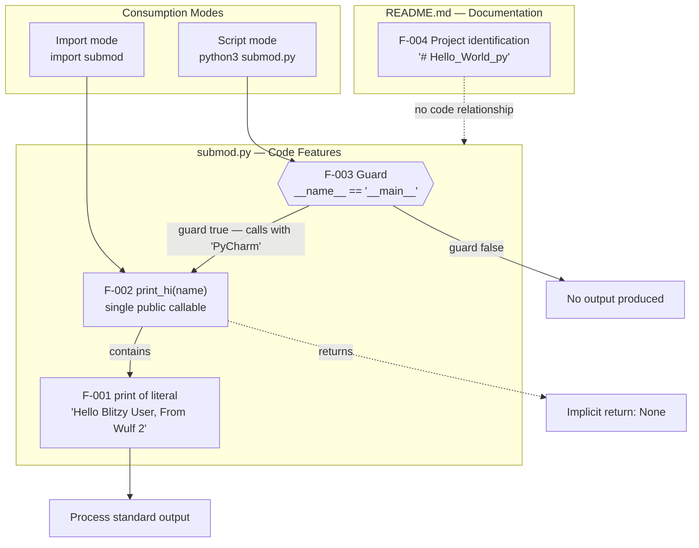
```mermaid
flowchart TD
    subgraph Entry["Consumption Modes"]
        Script["Script mode<br/>python3 submod.py"]
        Import["Import mode<br/>import submod"]
    end

    subgraph Code["submod.py — Code Features"]
        F003{{"F-003 Guard<br/>__name__ == '__main__'"}}
        F002["F-002 print_hi(name)<br/>single public callable"]
        F001["F-001 print of literal<br/>'Hello Blitzy User, From Wulf 2'"]
    end

    subgraph Docs["README.md — Documentation"]
        F004["F-004 Project identification<br/>'# Hello_World_py'"]
    end

    Sink["Process standard output"]
    Silent["No output produced"]
    Ret["Implicit return: None"]

    Script --> F003
    Import --> F002
    F003 -->|"guard true — calls with 'PyCharm'"| F002
    F003 -->|"guard false"| Silent
    F002 -->|"contains"| F001
    F002 -.->|"returns"| Ret
    F001 --> Sink
    F004 -.->|"no code relationship"| Code
```

The dependency ordering has one practical consequence for verification: F-002 can be exercised without F-003 (by importing and calling directly), and F-003 cannot be exercised without F-002, so a test of script mode necessarily covers all three code features at once.

### 2.3.2 Integration Points

The system's integration surface is limited to two boundaries, both provided by the host runtime. No integration exists with any external system — `submod.py` declares zero imports, and keyword scans of both files found no HTTP, socket, database, or credential references.

| Integration point | Features involved | Nature of the integration |
|---|---|---|
| Process standard-output stream | F-001, F-003 | The only outbound channel; receives one line per invocation. No explicit flush is requested, so delivery follows the interpreter's default buffering for the attached stream |
| Python module-resolution / import path | F-002, F-003 | `submod.py` must be resolvable as module `submod` for import mode; script mode requires only read access to the file path |
| Shell or launcher process | F-003 | Supplies the interpreter invocation and receives the exit status (`0` observed); passes no arguments, because none are read |
| Markdown renderer (optional) | F-004 | Presentational only; the document participates in no automated pipeline |

Inbound integration points — HTTP endpoints, RPC handlers, message consumers, CLI flags — do not exist, consistent with the determination in section 1.3.2.3.

### 2.3.3 Shared Components

"Shared" here means used by more than one feature. Because the entire system is one module, the shared inventory is small and fully enumerable:

| Shared element | Shared between | Role |
|---|---|---|
| The `print` builtin | F-001 (direct use), F-003 (via F-002) | The single output primitive; it is the only external symbol referenced by the code, resolved from Python's builtins rather than imported |
| The `submod` module namespace | F-002, F-003 | Hosts the function definition and the guard in the same file; also the namespace whose `__name__` the guard tests |
| The string literal on line 2 | F-001, and F-003 transitively | The output contract itself, stored as a module constant and reused by every invocation path |
| The `submod.py` source file | F-001, F-002, F-003 | All three code features are colocated in one 5-line file, so any change to the file affects all of them |

There is no shared library, utility module, base class, configuration object, or constants module — the repository has no directories and no second code file to hold one.

### 2.3.4 Common Services

**No common services exist.** This is a verified absence rather than an omission from this document: the platform-level services that features in a larger system would share are simply not present in the repository.

| Candidate common service | Status |
|---|---|
| Configuration or settings service | Absent — no config file, no `os.environ` reference |
| Logging or telemetry service | Absent — no logging call anywhere in the source |
| Error-handling or retry layer | Absent — AST contains no `Try`, `Raise`, or `Assert` node |
| Authentication or authorization service | Absent — no auth code, no `.env`, no credential reference |
| Persistence or caching layer | Absent — no database driver, schema, migration, or file I/O |
| Test or fixture harness shared across features | Absent — no `tests/`, `conftest.py`, or `pytest.ini` |

The practical effect is that each feature stands alone: the only thing any code feature depends on outside itself is the `print` builtin and the module namespace listed in section 2.3.3.

### 2.3.5 Process Flow Reference

The end-to-end process flow for these features — the two consumption paths, the guard decision, and the single output sink — is diagrammed in section 1.2.2.2 (Major System Components) and elaborated in the dependency map in section 2.3.1. The two diagrams are consistent by construction: section 1.2.2.2 depicts the flow in terms of source elements, while section 2.3.1 depicts the same flow in terms of feature identifiers. No additional process flow exists, because the system has exactly one execution path per consumption mode and no branching beyond the `__main__` guard.


## 2.4 Implementation Considerations

### 2.4.1 Cross-Cutting Constraints

Five constraints bound every feature in the catalog. They are properties of the repository as committed, not project policies — the repository contains no policy document.

| Constraint | Consequence for all features |
|---|---|
| Zero dependencies | `submod.py` declares no `import` statements and the repository has no manifest, so there is nothing to install, pin, vendor, or patch. Compilation and execution require only a stock CPython 3 interpreter (verified on 3.12.3) |
| No automated verification | No tests, CI workflows, linters, type checks, or pre-commit hooks exist. Every requirement in section 2.2 is confirmable only by manual execution, so any regression would reach `HEAD` undetected |
| No configuration surface | No feature reads a configuration file, environment variable, or command-line argument. Behavior can be changed only by editing source |
| No packaging metadata | The module cannot be installed or version-pinned as a distributable unit; import mode depends on `submod.py` being resolvable on the import path |
| Single-file colocation | All three code features occupy one 5-line file, so every change has a blast radius of the entire code surface. `submod.py` also ends without a trailing newline (confirmed by `git show 0ccc3f3`), which some text-processing tools flag |

### 2.4.2 F-001 — Fixed Greeting Emission to Standard Output

| Dimension | Consideration |
|---|---|
| Technical constraints | The message is an inline string literal on line 2; there is no template, resource bundle, or format string. Changing the text requires a source edit and a new commit. Output is ASCII-only English with no localization mechanism |
| Performance requirements | None specified in the repository. Measured cost is a single builtin call — ≈0.25 µs in-process across 1,000 iterations — which is negligible relative to the 10.5–11.1 ms interpreter startup that dominates script-mode execution |
| Scalability considerations | The write is synchronous and unbuffered by request (no `flush` argument), so throughput is bounded by the attached stream. Sustained high-volume emission would be limited by stream I/O, not by the module, which allocates and retains nothing per call |
| Security implications | Minimal and verified: the emitted value is a constant, so no injection, format-string, or data-leak path exists. The literal is not a credential, and the credential-keyword scan of both files returned no matches. The stream target is not parameterized, so output cannot be redirected by an attacker through the code |
| Maintenance requirements | The literal *is* the output contract. Because no test asserts it, an edit to line 2 silently changes the behavior every consumer observes. Preserving the exact text is the single most important maintenance obligation for this feature |

### 2.4.3 F-002 — Public Callable Interface `print_hi(name)`

| Dimension | Consideration |
|---|---|
| Technical constraints | The signature is untyped and undocumented — no annotations, no docstring, no `__all__`. The parameter is required but unused, so the interface advertises a personalization capability that the body does not implement; this mismatch is the feature's principal design liability and is recorded as an unsupported use case in section 1.3.2.4 |
| Performance requirements | None specified. The call adds one Python frame around the `print` builtin; no allocation of derived data occurs, since the argument is neither copied nor formatted |
| Scalability considerations | The function is stateless and holds no module-level mutable data, so the module itself imposes no synchronization requirement on callers. Ordering and interleaving of output from concurrent calls is determined by the standard-output stream, not by any code in this repository |
| Security implications | The argument is never read, interpolated, forwarded, or persisted, which eliminates the usual input-handling risks for this interface. There is no `eval`, `exec`, deserialization, or subprocess use anywhere in the source. Conversely, the absence of validation means the module offers no defense of its own — callers receive only the interpreter's arity `TypeError` |
| Maintenance requirements | Any future use of `name` would change the output contract that F-001 defines and would need to be coordinated with the guarded call site on line 5. Adding a default value or a second parameter would alter the arity behavior verified in F-002-RQ-002. The generic module name `submod` and the absence of a package namespace mean import-mode consumers depend on that name resolving to this file |

### 2.4.4 F-003 — Dual-Mode Execution Guard and Script Entry Point

| Dimension | Consideration |
|---|---|
| Technical constraints | The entry point accepts no input: no `sys.argv`, `argparse`, `os.environ`, or `input(` reference exists in either file. There is no usage text, no `--help`, and no differentiated exit code — the only observed status is `0`. There is also no console-script declaration, because no packaging metadata exists |
| Performance requirements | None specified. Measured script-mode wall time is 10.5–11.1 ms over five runs, essentially all interpreter startup; the guard evaluation is a single string comparison |
| Scalability considerations | Each script invocation is a separate process, so per-invocation cost is fixed at interpreter startup. Repeated use is roughly four orders of magnitude cheaper through import mode (≈0.25 µs per call) than through process spawning — the only meaningful scaling decision available to a consumer |
| Security implications | The entry point grants no privilege and opens no listening interface; it can be triggered only by a principal that already has execute access to the interpreter and read access to the file. Because no exception handling exists, an unexpected failure surfaces as an interpreter traceback on standard error, which is acceptable for a local script but would leak file paths in any shared-output context |
| Maintenance requirements | The guard is load-bearing for import safety: removing or weakening it would make `import submod` emit output, breaking F-003-RQ-002 and every importing consumer. This is identified as a critical success factor in section 1.2.3.2. The hardcoded `'PyCharm'` argument is inert today and can be changed without effect, but only while F-002 continues to ignore its parameter |

### 2.4.5 F-004 — Project Identification Document

| Dimension | Consideration |
|---|---|
| Technical constraints | The document is 17 characters of plain Markdown with no front matter, links, or code fences. It is not generated from, or validated against, the source — nothing keeps it consistent with `submod.py` |
| Performance requirements | Not applicable; the file is consumed by no build, test, or publication process, so it contributes no runtime or build cost |
| Scalability considerations | Not applicable as a runtime concern. As a documentation concern, the file provides no structure to extend — usage, installation, licensing, and contribution sections would all have to be introduced from scratch |
| Security implications | None identified. The document contains no endpoint, credential, or environment detail, confirmed by the keyword scan covering this file. It also carries no licence statement, and no `LICENSE` file exists, leaving redistribution terms undocumented |
| Maintenance requirements | The document currently states only the project name, so it cannot drift out of date with respect to behavior. Any expansion — documenting `print_hi`, the exact output text, or invocation instructions — would create the first documentation-to-code consistency obligation in the repository |


## 2.5 Traceability and Requirement Governance

### 2.5.1 Requirement-to-Source Traceability Matrix

Every requirement traces to a specific line of one of the repository's two files. Because the entire codebase is 5 lines of Python and one Markdown heading, traceability is complete and exact — there is no requirement without a source anchor, and no line of source without a requirement covering it.

| Requirement ID | Feature | Source anchor |
|---|---|---|
| F-001-RQ-001 | F-001 | `submod.py` line 2 — `print` of the string literal |
| F-001-RQ-002 | F-001 | `submod.py` whole file — absence of any other I/O construct |
| F-001-RQ-003 | F-001 | `submod.py` lines 1–2 — parameter declared, body uses a constant |
| F-001-RQ-004 | F-001 | `submod.py` line 2 — single `print` call, no `flush` argument |
| F-002-RQ-001 | F-002 | `submod.py` line 1 — sole module-level definition |
| F-002-RQ-002 | F-002 | `submod.py` line 1 — parameter list `(name)` |
| F-002-RQ-003 | F-002 | `submod.py` lines 1–2 — no `return` statement in the body |
| F-002-RQ-004 | F-002 | `submod.py` line 1 — no annotation; body performs no inspection |
| F-003-RQ-001 | F-003 | `submod.py` lines 4–5 — guard and guarded call |
| F-003-RQ-002 | F-003 | `submod.py` line 4 — guard condition |
| F-003-RQ-003 | F-003 | `submod.py` line 5 — literal `'PyCharm'` |
| F-003-RQ-004 | F-003 | `submod.py` whole file — valid syntax, zero imports |
| F-004-RQ-001 | F-004 | `README.md` line 1 — `# Hello_World_py` |
| F-004-RQ-002 | F-004 | `README.md` whole file — 17 characters, no further content |

### 2.5.2 Requirement-to-Verification Matrix

The repository provides no test suite, so each requirement is mapped to the manual verification that established it. All verifications were executed against the working tree at `HEAD` on CPython 3.12.3.

| Requirement ID | Verification method | Outcome |
|---|---|---|
| F-001-RQ-001 | Run script; hexdump captured standard output | 31-byte match, standard error empty |
| F-001-RQ-002 | AST import scan plus keyword scan of both files | No imports; no `open(`, `logging`, `socket`, `http`, `sql` matches |
| F-001-RQ-003 | Invoke with five arguments of four different types | One distinct output value |
| F-001-RQ-004 | AST call inventory of the module | Two `Call` nodes total; one `print`, no `flush` argument |
| F-002-RQ-001 | Import module; list non-dunder attributes | Exactly `['print_hi']` |
| F-002-RQ-002 | `inspect.signature`; call with zero and two arguments | `(name)`, `POSITIONAL_OR_KEYWORD`, no default; both `TypeError`s raised |
| F-002-RQ-003 | Capture return value across invocations; AST `Return` count | Always `None`; zero `Return` nodes |
| F-002-RQ-004 | Invoke with `str`, `None`, `int`, `list` | All accepted, output unchanged |
| F-003-RQ-001 | Run `python3 submod.py`; inspect exit status and streams | One greeting, exit `0`, empty standard error |
| F-003-RQ-002 | Import with redirected stdout; read `__name__`; `runpy` with a non-`__main__` run name | Empty output in both suppressed cases; `'submod'` |
| F-003-RQ-003 | Read line 5; compare output against other arguments | Literal confirmed; output identical |
| F-003-RQ-004 | `python3 -m py_compile submod.py` | Exit status `0`, no dependency resolution involved |
| F-004-RQ-001 | Read file; `cat -A` to reveal terminators | `# Hello_World_py` followed by the line terminator |
| F-004-RQ-002 | Full read plus byte count | 17 characters, no additional content |

### 2.5.3 Feature-to-Specification Cross-References

| Feature | Related sections of this specification |
|---|---|
| F-001 | 1.1.1 (verified output invariance), 1.2.2.1 (capability table), 1.3.1.1 (in-scope capability), 2.2.2, 2.4.2 |
| F-002 | 1.2.2.1 (public surface), 1.3.1.1 (library-consumption workflow), 1.3.2.4 (personalization unsupported), 2.2.3, 2.4.3 |
| F-003 | 1.2.2.2 (component and execution-path diagram), 1.2.2.3 (dual-mode design), 1.2.3.2 (guard as critical success factor), 2.2.4, 2.4.4 |
| F-004 | 1.1.2 (project identity), 1.2.2.2 (component inventory), 1.3.1.1 (identification capability), 2.2.5, 2.4.5 |

### 2.5.4 Requirement Versions and Change Provenance

The repository has no tags, no `CHANGELOG.md`, and no release process, so requirement versions are anchored to the commits that introduced the corresponding source. `git log --follow` reports exactly one commit per file: **neither file has been modified since it was created**, which means every requirement is at its original revision.

| Requirement group | Introduced by | Commit detail |
|---|---|---|
| F-001-RQ-001 … F-003-RQ-004 (all code requirements) | `0ccc3f3` "Add files via upload" | Added `submod.py`, 5 insertions, authored 2026-09-03 13:31:42 -0400 |
| F-004-RQ-001, F-004-RQ-002 | `38cfbd5` "Create README.md" | Added `README.md`, 1 insertion, authored 2026-09-03 13:32:46 -0400; current `HEAD` of `main` |

| Governance attribute | Determination |
|---|---|
| Specification revision basis | All requirements at revision 1.0, corresponding to `HEAD` = `38cfbd5` |
| Amendment history | None — no source file has been amended since introduction |
| Release versioning | None — `git tag -l` returns no tags and no version string appears in either file |
| Requirement ownership | Single author (`IrinaWulf`) for both commits; no `CODEOWNERS` or `CONTRIBUTING.md` designates reviewers |

### 2.5.5 Assumptions and Constraints

**Assumptions made in producing this section.** Each is stated because the repository provides no artifact that would settle the point.

| Assumption | Why it was necessary |
|---|---|
| Requirements are as-built, not as-intended | No requirements document, user story, or design note exists; intent beyond the code cannot be recovered from the repository |
| Acceptance criteria are those derived and verified here | No test suite, CI gate, or acceptance-criteria document exists to quote |
| Priority and complexity ratings are analytical judgements | No prioritization or estimation artifact exists; ratings reflect each requirement's relationship to the system's single demonstrated purpose |
| Feature status "Completed" means implemented and verified at `HEAD` | The repository holds no issue tracker, board, or status metadata |
| The target runtime is CPython 3 | No manifest, `.python-version`, or CI matrix pins an interpreter; verification therefore used the available CPython 3.12.3 and the source contains no version-specific construct |

**Constraints on this section's scope.**

| Constraint | Effect |
|---|---|
| The repository contains only two files | The catalog is exhaustive at four features; no additional feature can be discovered without new commits |
| No non-functional requirements are documented in the repository | No SLA, availability target, latency budget, throughput figure, or coverage threshold is stated; section 2.2 records measured baselines instead, and section 1.2.3.3 records the absence explicitly |
| No compliance or licensing artifact exists | Compliance rows in section 2.2 record "none applicable or declared" rather than a regulatory mapping |
| Output is not parameterized | Requirements covering personalization, localization, or alternative output sinks cannot exist for the current implementation; the corresponding use cases are listed as unsupported in section 1.3.2.4 |


## 2.6 References

### 2.6.1 Repository Files Examined

Both files in the repository were read in full; together they are the complete evidence base for every feature and requirement in this section.

- `submod.py` - Source of F-001, F-002, and F-003. Established the function definition `print_hi(name)` (line 1), the output literal `Hello Blitzy User, From Wulf 2` (line 2), and the `__main__` guard invoking `print_hi('PyCharm')` (lines 4–5). Established by absence: no imports, no `try`/`except`, no `raise`, no `assert`, no `return`, no classes, no annotations, no docstring, no `__all__`, and no reference to `sys.argv`, `argparse`, `os.environ`, or `input(`.
- `README.md` - Source of F-004. Established the project identity `# Hello_World_py` as the file's complete 17-character content, and — by containing nothing else — established the absence of usage, configuration, dependency, and licensing documentation.

### 2.6.2 Repository Folders Examined

- `` (repository root) - Established the complete feature-bearing inventory: exactly two files and zero sub-directories. Confirmed the absence of a second code file that could hold shared utilities, constants, or configuration.
- Directories confirmed **absent** (each checked explicitly): `.github/`, `.gitlab/`, `.circleci/`, `tests/`, `test/`, `docs/`, `src/`, `app/`, `lib/`, `api/`, `migrations/`, `locales/`, `i18n/`, `.idea/`, `.vscode/` - Established the absence of automated verification, CI gates, requirements documentation, and a shared-component layer, underpinning the constraint tables in sections 2.4.1 and 2.5.5.
- Files confirmed **absent** (each checked explicitly): `package.json`, `requirements.txt`, `pyproject.toml`, `setup.py`, `setup.cfg`, `Pipfile`, `poetry.lock`, `environment.yml`, `tox.ini`, `Makefile`, `Dockerfile`, `docker-compose.yml`, `.gitignore`, `.gitattributes`, `LICENSE`, `CONTRIBUTING.md`, `CHANGELOG.md`, `CODEOWNERS`, `.editorconfig`, `.env`, `.env.example`, `.pre-commit-config.yaml`, `.flake8`, `.pylintrc`, `mypy.ini`, `pytest.ini`, `conftest.py` - Established the zero-dependency constraint, the absence of packaging and quality gates, and the undocumented licensing position recorded in the compliance rows of section 2.2.

### 2.6.3 Verified Behavior and Repository Metadata

- Script-mode execution (`python3 submod.py` with output hexdumped and exit status inspected) - Established F-001-RQ-001 (31-byte output, empty standard error) and F-003-RQ-001 (exit status `0`).
- Module introspection after import (non-dunder attribute listing, `inspect.signature`, parameter kind/default/annotation, `__doc__`, `__all__` presence) - Established F-002-RQ-001 and F-002-RQ-002.
- Invocation trials with `'PyCharm'`, `'Zebra'`, `None`, an integer, and a list, with captured output and return values - Established F-001-RQ-003, F-002-RQ-003, and F-002-RQ-004, including the single distinct output value and the always-`None` return.
- Arity-error trials (`print_hi()` and `print_hi('a','b')`) - Established that arity is enforced by the interpreter rather than by module code, as recorded in section 2.2.3.3.
- Import-mode and `runpy` trials (`import submod` with redirected stdout; `runpy.run_module` with run names `__main__` and `not_main`) - Established F-003-RQ-002 in both directions.
- `python3 -m py_compile submod.py` on CPython 3.12.3 - Established F-003-RQ-004.
- AST inventory of `submod.py` (node-type counts; import, try, raise, assert, return, class, call, and string-constant lists) - Established F-001-RQ-002, F-001-RQ-004, the validation-rule determinations in section 2.2, and the shared-component inventory in section 2.3.3.
- Timing measurements (5 process invocations; 1,000 in-process calls) - Established the measured performance baselines of 10.5–11.1 ms per process and ≈0.25 µs per in-process call used throughout sections 2.2 and 2.4.
- Keyword scans of both files (`http`, `url`, `socket`, `request`, `sql`, `database`, `token`, `secret`, `password`, `api_key`, `auth`, `logging`, `argparse`, `sys.argv`, `os.environ`, `input(`, `open(`, and roadmap markers `todo`/`fixme`/`hack`/`xxx`/`deprecated`/`placeholder`) - All returned no matches, establishing the security determinations in section 2.2, the absence of integrations in section 2.3.2, and the absence of common services in section 2.3.4.
- Git metadata (`git log --format`, `git log --follow` per file, `git show 0ccc3f3`, `git tag -l`, `git ls-files`) - Established the version provenance in section 2.5.4: commit `0ccc3f3` (2026-09-03 13:31:42 -0400) introduced `submod.py`, commit `38cfbd5` (13:32:46 -0400) introduced `README.md` and is `HEAD`, neither file has been amended since, no tags exist, and `submod.py` ends without a trailing newline.
- Repository semantic index (file search for requirements, acceptance criteria, and test specifications; folder search for feature, test, and configuration directories) - Both returned no results, establishing that no requirements artifact exists and that the catalog in section 2.1 is necessarily reverse-engineered.

### 2.6.4 Cross-Referenced Specification Sections

- Section 1.1 Executive Summary - Corroborated the output-invariance finding and the two consumer roles referenced in sections 2.1.2 and 2.1.5.
- Section 1.2 System Overview - Supplied the capability inventory (1.2.2.1), the component and execution-path diagram referenced by section 2.3.5 (1.2.2.2), the dual-mode design description (1.2.2.3), the guard as a critical success factor (1.2.3.2), and the documented absence of KPIs relied on in sections 2.2.1 and 2.5.5 (1.2.3.3).
- Section 1.3 Scope - Supplied the in-scope capability and workflow tables (1.3.1.1), the excluded-capability inventory relied on in section 2.1.1 (1.3.2.1), the uncovered integration points referenced in section 2.3.2 (1.3.2.3), and the unsupported use cases referenced in sections 2.4.3 and 2.5.5 (1.3.2.4).
- Section 1.4 References - Confirmed the file, folder, and absence inventories reused here, ensuring both sections rest on the same verified evidence base.

### 2.6.5 External Sources

No external or web sources support any claim in this section. Every requirement, acceptance criterion, dependency, and measurement is derived from the repository's two files, from git metadata, or from execution performed against the working tree at `HEAD` (`38cfbd5`) on CPython 3.12.3.


# 3. Technology Stack

## 3.1 Programming Languages

This section documents the technology stack of the repository `GHNewRepoIW` **as committed at `HEAD` (`38cfbd5`)**. The framing fact established in section 1.1.1 governs every subsection below: the repository contains exactly two files and 132 bytes of content, and it declares no dependency, build, container, or deployment metadata of any kind. Accordingly, the stack documented here is genuinely minimal — a single language and a single interpreter — and every absence is reported as a verified observation rather than as an omission or an inferred intent.

A note on the default technology stack supplied as project context (AWS, Docker, Terraform, GitHub Actions, Flask, Auth0, MongoDB, Langchain, React/TypeScript, TailwindCSS, React Native, Swift, Kotlin, Objective-C, ElectronJS): **none of those components appear anywhere in the repository.** Two elements intersect with it — the Python language and GitHub as the host of the git remote — and both are documented below on the basis of repository evidence, not of the default. The remaining components are recorded as not adopted in section 3.4.3 so that the boundary between observed stack and organizational default is unambiguous.

### 3.1.1 Language Inventory by Component

The repository has no sub-directories, so the component inventory and the file inventory are identical (established in section 1.2.2.2). One programming language is present.

| Component | Language | Version / dialect | Evidence |
|---|---|---|---|
| `submod.py` — the entire executable system | Python 3 | Unpinned; no version-gated syntax used | 115 bytes, 5 logical lines; parses and compiles as Python 3 source |
| `README.md` — project identification | Markdown (markup, not a programming language) | CommonMark-compatible plain heading; no front matter | 17 bytes; single ATX level-1 heading |
| `__pycache__/submod.cpython-312.pyc` — untracked local artifact | CPython 3.12 bytecode | Magic number `cb0d0d0a` | 354 bytes; not tracked by git |

**Language distribution across tracked content** (byte counts measured directly against the working tree):

| Language | Files | Bytes | Share of tracked content |
|---|---|---|---|
| Python | 1 | 115 | 87.1% |
| Markdown | 1 | 17 | 12.9% |
| **Total** | **2** | **132** | **100%** |

No second programming language exists. This is a complete enumeration rather than a sample: `git ls-files` returns exactly the two files above, and a full filesystem walk of the working tree (excluding `.git/`) adds only the untracked bytecode cache. There is no JavaScript or TypeScript (no `package.json`, no `tsconfig.json`), no shell scripting (no `.sh` file, no `Makefile`), no SQL, no HTML or CSS, no compiled-language source, and no infrastructure DSL (no `.tf` file). Consequently there is no cross-language interoperability layer, no foreign-function interface, and no polyglot build to coordinate — the single-language property is what makes sections 3.2 through 3.6 as short as they are.

### 3.1.2 Runtime and Version Constraints

**The interpreter is not pinned.** Every artifact through which a Python project normally declares its runtime is absent, and each absence was checked explicitly:

| Version-declaration mechanism | Status in repository |
|---|---|
| `requires-python` in `pyproject.toml` | Absent — no `pyproject.toml` |
| `python_requires` in `setup.py` / `setup.cfg` | Absent — neither file exists |
| `.python-version` (pyenv) | Absent |
| `runtime.txt` (buildpack-style declaration) | Absent |
| CI interpreter matrix | Absent — no `.github/`, `.gitlab-ci`, or `.circleci` directory |
| Container base image tag | Absent — no `Dockerfile` |

The practical consequence is that the module executes against whatever interpreter the host happens to provide, and nothing in the repository constrains or validates that choice. This matches the governance assumption recorded in section 2.5.5, which states that the target runtime is CPython 3 and that verification therefore used the interpreter available at the time.

**Verified runtime baseline.** All verification for this specification was performed on **CPython 3.12.3** (`/usr/bin/python3`). Three independent observations confirm the module is well-formed under that interpreter: `python3 -m py_compile submod.py` exits `0`; direct execution emits the expected single line and exits `0`; and the interpreter's own bytecode magic number matches the magic of the `__pycache__` entry present in the working tree, confirming that the cached bytecode was produced by this same 3.12 series.

**Compatibility envelope.** The source is unusually portable across Python versions because it uses no version-gated construct. An AST inventory of `submod.py` yields exactly two top-level nodes — one `FunctionDef` and one `If` — and exactly two call sites, `print` and `print_hi`. The language features in use are therefore limited to:

| Construct used | Introduced | Notes |
|---|---|---|
| `def` function definition with one positional parameter | Python 1.x | No default, no annotation, no keyword-only marker |
| Parenthesized single-argument `print(...)` | Valid in Python 3 as a builtin call; parses in Python 2 as a print statement with a parenthesized operand | Source is not exclusive to Python 3 at the syntax level, though Python 3 is the stated target |
| `if __name__ == '__main__':` guard | Long-standing idiom | The module's only branch |

Nothing in the file requires a modern interpreter: there are no f-strings, no type annotations, no assignment expressions, no `match` statement, no `async`/`await`, and no dataclasses or standard-library imports whose availability would vary by version. The upper bound of the envelope is therefore set by the interpreter's own compatibility policy rather than by this code.

**Version-drift implication.** Because nothing is pinned, an interpreter upgrade on the host changes the runtime silently and with no verification gate to catch a behavioral difference — the "no automated verification" constraint from section 2.4.1 applies directly here. The verification interpreter, 3.12.3, is no longer the newest line under CPython's annual release cadence; the project's main development branch now targets a substantially later version. For a module of this construct profile the exposure is negligible in behavioral terms, but the *security* posture is inherited wholesale from the host: patch-level interpreter fixes are the only security control operating at the language layer of this system, and the repository neither requests nor records a minimum patch level.

### 3.1.3 Selection Criteria and Justification

The repository documents no technology decision — there is no architecture decision record, no `docs/` directory, and no descriptive prose in `README.md` (established in sections 1.1.2 and 1.3.2.2). The rationale below is therefore reconstructed from artifacts in the repository, and each criterion is tied to the evidence that supports it rather than presented as a decision the project recorded.

| Selection criterion | How Python satisfies it | Repository evidence |
|---|---|---|
| Zero-installation execution | An interpreted language allows the single source file to run with no compile, link, or install step, which is what makes the "no packaging metadata" constraint of section 2.4.1 tolerable | `py_compile` succeeds and execution proceeds with no dependency-resolution phase, satisfying F-003-RQ-004 |
| Minimum viable expression of the purpose | The system's entire behavior is one write to standard output; Python's `print` builtin expresses it in one line with no boilerplate, class, or entry-point declaration | `submod.py` line 2 is the only output statement |
| Dual-mode usability (script *and* library) from one file | Python's `__name__` guard provides import-safe dual behavior natively, with no manifest, wrapper, or console-script declaration | `submod.py` lines 4–5; verified import-mode silence per F-003-RQ-002 |
| Toolchain-validation fitness | A "Hello World" artifact exists to prove an interpreter, a file, and an output stream work together; Python's stock interpreter availability makes it a conventional choice for that role | Project name `Hello_World_py` in `README.md`; purpose characterized in section 1.1.2 |
| Consistency with the organizational default language | Python is the primary backend language in the supplied default stack, so the language layer is the one point where repository and default agree | Default stack context; language confirmed by file inventory |

Two provenance signals corroborate that Python was chosen through an IDE-driven project scaffold rather than through a deliberated evaluation. First, the guarded call passes the literal `'PyCharm'` — the default argument in JetBrains PyCharm's new-project template — which section 1.1.3 also records; no `.idea/` directory is committed, so the signal is an origin hint only, not evidence of a committed IDE configuration. Second, both commits carry GitHub's web-UI default messages ("Add files via upload", "Create README.md"), indicating the files entered the repository through github.com rather than from a configured local toolchain. Neither signal changes the stack; both explain why no supporting configuration accompanies it.

### 3.1.4 Constraints and Dependencies Imposed by the Language Choice

The language choice creates a small, well-defined set of obligations. These are properties of the committed code, verified individually.

| Constraint | Detail and consequence |
|---|---|
| A Python 3 interpreter must be present on the host | This is the system's *only* environmental prerequisite (section 1.3.1.1). There is no fallback, no vendored runtime, and no version check — if the interpreter is missing the system cannot run at all |
| Import-mode consumption depends on path resolution | The module has no package namespace; import mode requires `submod.py` to be resolvable on the import path under the generic name `submod`, a fragility already noted in section 2.4.3 |
| No static safety net | The source carries no type annotations and the repository configures no type checker or linter, so every error class surfaces at runtime. The only enforced constraint is call arity, and it is enforced by the interpreter's calling convention rather than by module code (F-002-RQ-002) |
| Bytecode caching writes into the working tree | Executing or importing the module causes CPython to create `__pycache__/`, which is untracked and — because no `.gitignore` exists — appears as an untracked change in `git status`. This is the only filesystem side effect the language runtime introduces |
| Text-encoding and formatting characteristics | The single output literal is ASCII English with no localization mechanism (section 2.4.2), and the file ends without a trailing newline (section 2.4.1), which some Python-aware formatters and text-processing tools flag |
| No language-level security surface in use | The AST call inventory contains only `print` and `print_hi`: there is no `eval`, `exec`, `subprocess`, deserialization, or dynamic import through which the language could introduce an execution risk. The residual security dependency is the interpreter binary itself, as noted in section 3.1.2 |

Notably absent from this list are the constraints that normally dominate a Python stack: virtual-environment management, dependency resolution and conflict handling, wheel or C-extension build requirements, and interpreter-ABI compatibility for compiled dependencies. None apply, because the module imports nothing — the subject of section 3.3.


## 3.2 Frameworks &amp; Libraries

**No framework and no library — of any origin — participates in this system.** This is a stronger statement than "no third-party framework", and it rests on a single decisive observation: an AST scan of `submod.py` returns **zero `Import` and zero `ImportFrom` nodes**. The module does not import a web framework, does not import a CLI framework, and does not import a standard-library module either. The framework layer of the stack is therefore empty rather than thin, and section 1.2.2.3 records the same property from the design side ("plain Python 3, no framework").

### 3.2.1 Framework Layer — Verified Absence by Class

Each framework class below was checked against the repository rather than assumed absent. Because the codebase is two files, the check is exhaustive.

| Framework class | Status | Verification |
|---|---|---|
| Web / HTTP framework (e.g. Flask, FastAPI, Django) | Not present | No import statements; no route, handler, or WSGI/ASGI entry point; no HTTP reference in either file (section 1.2.1.3 keyword scan) |
| CLI / argument-parsing framework (e.g. `argparse`, Click, Typer) | Not present | No `sys.argv`, `argparse`, or `input(` reference; the entry point accepts no input (F-003-RQ-004 technical specification) |
| Test framework (e.g. pytest, `unittest`) | Not present | No `tests/` directory, `conftest.py`, `pytest.ini`, or `tox.ini` |
| ORM / data-access framework | Not present | No model, schema, migration, or driver of any kind (section 3.5) |
| Asynchronous / task-queue framework (e.g. Celery, asyncio-based) | Not present | No `async`/`await` construct and no queue client; execution is a single synchronous write |
| Logging / observability framework | Not present | No `logging` import and no instrumentation call anywhere in the source |
| AI / LLM orchestration framework (e.g. Langchain) | Not present | No import, no model client, no prompt asset, no API-key handling |
| UI framework (web, desktop, or mobile) | Not present | No UI source, template, stylesheet, or asset; no `package.json` |
| Serialization / validation library (e.g. Pydantic) | Not present | No annotation and no validation logic; the sole argument is discarded (F-002-RQ-004) |

### 3.2.2 Runtime Facilities Actually Used

With the framework layer empty, the system's entire supporting substrate is CPython core. Three facilities are in play, and only the first is referenced by name in the source.

| Facility | Role in the system | Source anchor |
|---|---|---|
| The `print` builtin | Performs the single write that constitutes the system's whole observable output. Builtins are resolved from the interpreter's builtins namespace with no import statement, which is why a zero-import module can still produce output | `submod.py` line 2 |
| The process standard-output stream, reached implicitly | `print` is invoked with no `file` or `flush` argument, so the destination is the interpreter's default standard-output stream and buffering is the stream's own. Verified: output was captured on standard output with standard error empty (F-001-RQ-001) | `submod.py` line 2 |
| The import machinery's `__name__` binding | Supplies the value the dual-mode guard tests, which is what makes script mode and import mode differ without any configuration | `submod.py` line 4 |

The AST call inventory for the whole module is exactly two calls — `print` and `print_hi` — so this table is not a selection from a larger surface; it is the complete set of runtime facilities the code touches.

**Stack layering.** The diagram below shows the four layers involved in an execution, including the empty framework layer, which is the defining characteristic of this stack.

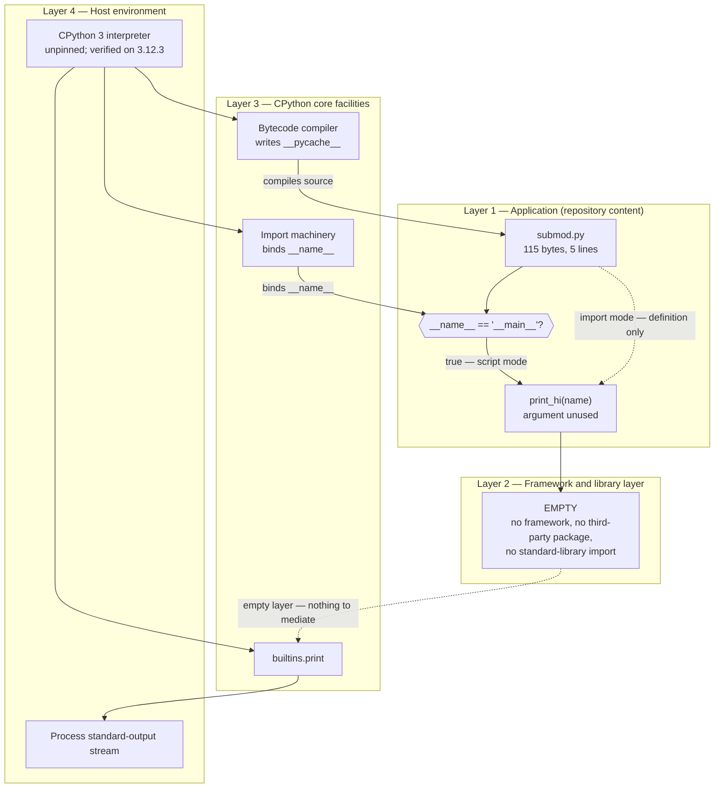
```mermaid
flowchart TD
    subgraph L1["Layer 1 — Application (repository content)"]
        Mod["submod.py<br/>115 bytes, 5 lines"]
        Guard{{"__name__ == '__main__'?"}}
        Fn["print_hi(name)<br/>argument unused"]
    end

    subgraph L2["Layer 2 — Framework and library layer"]
        NoFw["EMPTY<br/>no framework, no third-party package,<br/>no standard-library import"]
    end

    subgraph L3["Layer 3 — CPython core facilities"]
        Builtins["builtins.print"]
        ImportMach["Import machinery<br/>binds __name__"]
        Compiler["Bytecode compiler<br/>writes __pycache__"]
    end

    subgraph L4["Layer 4 — Host environment"]
        Interp["CPython 3 interpreter<br/>unpinned; verified on 3.12.3"]
        Stdout["Process standard-output stream"]
    end

    Mod --> Guard
    Guard -->|"true — script mode"| Fn
    Mod -.->|"import mode — definition only"| Fn
    Fn --> NoFw
    NoFw -.->|"empty layer — nothing to mediate"| Builtins
    ImportMach -->|"binds __name__"| Guard
    Compiler -->|"compiles source"| Mod
    Builtins --> Stdout
    Interp --> Compiler
    Interp --> ImportMach
    Interp --> Builtins
```

### 3.2.3 Compatibility Requirements

A framework-free, import-free module collapses the compatibility problem to a single dimension. Every other dimension that normally requires management is inapplicable, and the table records why.

| Compatibility dimension | Status for this system |
|---|---|
| Interpreter compatibility | The only live dimension. Unpinned; verified working on CPython 3.12.3; no version-gated syntax narrows the envelope (section 3.1.2) |
| Framework-to-runtime compatibility | Inapplicable — no framework to match against an interpreter version |
| Inter-library version conflicts | Inapplicable — no library set exists in which a conflict could arise |
| Transitive-dependency resolution | Inapplicable — nothing to resolve; no lock file exists or is needed (section 3.3) |
| Binary / ABI compatibility (C extensions, wheels) | Inapplicable — no compiled dependency; nothing is built or linked |
| Peer-dependency or plugin-API contracts | Inapplicable — the module neither hosts nor registers plugins |
| Operating-system compatibility | No OS-specific call is made: no `os`, `pathlib`, `subprocess`, or platform check appears in the source, so behavior is governed entirely by the interpreter and the attached stream |

The corresponding maintenance benefit is stated as a cross-cutting constraint in section 2.4.1: with no dependencies there is nothing to install, pin, vendor, or patch. The corresponding cost is equally real and is documented in section 3.3.3 — the repository also has no mechanism through which a future dependency could be introduced safely.

### 3.2.4 Justification of the Zero-Framework Posture

A framework earns its place by mediating a concern the application would otherwise implement itself. This system has no such concern, which is the substantive justification for the empty layer rather than an appeal to minimalism.

| Concern a framework would mediate | Whether this system has that concern |
|---|---|
| Request routing, serialization, middleware | No — no inbound interface of any kind exists (section 1.3.2.3) |
| Data mapping and query construction | No — no data store and no data domain (sections 1.3.1.2 and 3.5) |
| Configuration, secrets, environment binding | No — no configuration surface at all (section 2.4.1) |
| Dependency injection and lifecycle management | No — one stateless function with no collaborators |
| Test orchestration and assertion tooling | Not addressed — verification is manual, recorded as an accepted constraint in section 2.4.1 rather than as a solved concern |
| Structured logging, metrics, tracing | Not addressed — standard output is the sole sink (F-001-RQ-002) |

The one structural pattern the system does employ is supplied by the language itself, not by a framework: the `__name__ == '__main__'` guard, which section 1.2.2.3 identifies as the module's single structural pattern and section 1.2.3.2 identifies as a critical success factor. It delivers, in one line and with no configuration, the property a plugin or entry-point mechanism would otherwise provide — a module that is safe to import and simultaneously runnable as a script.

**Security implication of the empty layer.** The framework layer is normally the largest single contributor to a Python application's vulnerability surface, because frameworks pull in transitive dependencies and expose parsers, deserializers, and network listeners. Here that contribution is zero: there is no dependency to carry a CVE, no listener to expose, and no parser to attack. The only code executing in this system is the interpreter's own and five lines of application source whose call inventory contains no `eval`, `exec`, `subprocess`, or deserialization (section 2.4.3). The residual exposure — inherited interpreter patch level — is documented in section 3.1.2.


## 3.3 Open Source Dependencies

**The dependency set is empty.** No third-party or open-source package is declared, vendored, installed, or imported. Two independent lines of evidence establish this: the source declares zero imports (section 3.2), and the repository declares no manifest in which a dependency could be recorded. Section 2.4.1 states the same fact as the first of the system's cross-cutting constraints — there is nothing to install, pin, vendor, or patch.

### 3.3.1 Dependency Manifest and Lock-File Inventory

Every manifest and lock-file format through which a Python or JavaScript project could declare dependencies was probed by name against the repository root. All are absent, and there are no sub-directories in which one could be hiding.

| Ecosystem | Manifest / lock file probed | Status |
|---|---|---|
| Python — pip | `requirements.txt`, `requirements-dev.txt` | Absent |
| Python — PEP 621 / build backends | `pyproject.toml` | Absent |
| Python — setuptools | `setup.py`, `setup.cfg`, `MANIFEST.in` | Absent |
| Python — Pipenv | `Pipfile`, `Pipfile.lock` | Absent |
| Python — Poetry | `poetry.lock` | Absent |
| Python — uv | `uv.lock` | Absent |
| Python — conda | `environment.yml`, `conda.yaml` | Absent |
| JavaScript / npm ecosystem | `package.json`, `package-lock.json`, `yarn.lock`, `pnpm-lock.yaml` | Absent |

No vendored code exists either: the working tree contains no `vendor/`, `site-packages/`, `lib/`, or `third_party/` directory, and the only file in the tree that is not one of the two tracked files is the interpreter-generated bytecode cache `__pycache__/submod.cpython-312.pyc`, which is an artifact of running the module rather than a dependency of it.

### 3.3.2 Package Registries

| Registry / index | Consumption by this repository |
|---|---|
| PyPI (`pypi.org`) | Not consumed. No manifest requests a distribution, no `pip` invocation exists in any file, and no `pip.conf`, `.pypirc`, or index-URL override is present |
| Private or mirrored Python index | Not configured — no index or extra-index declaration anywhere |
| npm registry | Not consumed — no JavaScript manifest exists |
| Container registry | Not consumed — no image is built or pulled (section 3.6) |
| Git-based dependency sources (submodules, VCS requirements) | None — `.gitmodules` is absent and `.git/config` declares only the single `origin` remote for the repository itself |

The decisive functional confirmation is the compile behavior recorded under F-003-RQ-004: `python3 -m py_compile submod.py` succeeds on a stock interpreter **with no packages installed**, because there is no resolution step involved at all. Installation and dependency resolution are not merely unautomated in this project — they are absent from its lifecycle.

### 3.3.3 Supply-Chain Security Posture

The empty dependency set produces an unusually strong posture on one axis and a complete gap on another. Both are stated because the prompt requires the security implications of stack choices to be documented.

| Property | Assessment |
|---|---|
| Third-party vulnerability exposure | **None.** With no declared, transitive, or vendored package, no dependency-borne CVE can affect this system. The only third-party code executing is the interpreter itself (section 3.1.2) |
| Typosquatting / dependency-confusion risk | **None at present.** No install step and no index configuration exist, so there is no resolution path an attacker could influence |
| Build reproducibility | **Trivially reproducible without a lock file** — the dependency set is empty, so a lock file would pin nothing. Reproducibility is bounded instead by the unpinned interpreter (section 3.1.2) |
| Dependency scanning and alerting | **Not configured.** No `.github/` directory exists, therefore no `dependabot.yml`, no scanning workflow, and no automated advisory gate. The first dependency added would be unmonitored |
| Software bill of materials (SBOM) | **Not produced.** No build or packaging process exists to emit one; the SBOM of the tracked content is, in effect, the two files listed in section 3.1.1 |
| Outbound license obligations to third parties | **None incurred** — the project consumes no open-source code and therefore inherits no attribution, copyleft, or notice obligation |
| The project's own licence terms | **Undocumented.** No `LICENSE` file exists, a gap section 2.4.5 records for `README.md` as well. Consumers of this repository have no stated redistribution terms, which is a legal rather than a technical exposure |

### 3.3.4 Conditions That Would Govern a First Dependency

The repository provides no roadmap and no stated intent to add dependencies (section 1.3.2.2), so nothing below is presented as planned work. The table records the mechanisms the repository would need to create — each currently absent, and each verified absent above — because the "zero dependencies" constraint is enforced today only by the fact that no one has added one.

| Mechanism that would be required | Current state |
|---|---|
| A manifest in which to declare the dependency and its version specifier | None exists; a format would have to be chosen (`requirements.txt` or `pyproject.toml`) |
| A lock file, or hash pinning, to make installs reproducible | None exists; without one, an unpinned dependency would resolve differently over time |
| An interpreter pin, so a dependency's `requires-python` can be honored | None exists (section 3.1.2), so a dependency's own runtime constraint could be silently violated |
| An install step in the execution path, and documentation of it | None exists; today the module runs with no install step, and `README.md` documents no invocation procedure (F-004-RQ-002) |
| A verification gate to detect a dependency-induced regression | None exists — no tests and no CI (section 2.4.1), so a breaking upgrade would reach `HEAD` undetected |
| Dependency vulnerability monitoring | None configured, as recorded in section 3.3.3 |


## 3.4 Third-Party Services

**At runtime the system integrates with nothing.** Section 1.2.1.3 establishes this from the source side — zero import statements, and a keyword scan of both files that returned no match for `http`, `url`, `socket`, `request`, `sql`, `database`, `token`, `secret`, `password`, `api_key`, or `auth`. There is no SDK, no client, no endpoint, and no credential. The system's only interface to anything outside its own process is the standard-output stream (section 1.3.1.2).

One external service does appear in the project's **toolchain** plane, and the distinction matters: GitHub hosts the git remote, which affects how source arrives in the repository but not what happens when the code runs.

### 3.4.1 External APIs and Integrations

| Integration category | Status | Verification |
|---|---|---|
| Outbound HTTP / REST / GraphQL calls | None | No client library imported; no URL literal in either file |
| Inbound API surface (endpoints, webhooks, RPC) | None | No server or handler code; no port binding |
| Messaging / streaming (queues, brokers, event buses) | None | No broker client and no message schema |
| Third-party SDKs (payment, email, storage, AI providers) | None | No import statements at all (section 3.2) |
| Feature-flag or remote-configuration services | None | The module reads no configuration of any kind (section 2.4.1) |

The consequence for the architecture is that there are no integration failure modes to design around: no timeout, retry, circuit-breaker, rate-limit, or credential-rotation concern exists anywhere in this system.

### 3.4.2 GitHub — the Only External Service in the Toolchain

| Aspect | Observation |
|---|---|
| Service and role | GitHub, acting solely as the hosted origin of the git repository `irinakwulf/GHNewRepoIW` (section 1.1.1) |
| Configuration evidence | `.git/config` declares a single remote, `origin`, over HTTPS to `github.com`; the local branch `main` is configured to merge with `refs/heads/main` on that remote, and `.git/packed-refs` records `refs/remotes/origin/main` at `38cfbd5` |
| Usage evidence | Both commits carry GitHub's web-UI default subjects, "Add files via upload" and "Create README.md", indicating the files were created through github.com rather than pushed from a configured local toolchain |
| Runtime coupling | **None.** The executing module performs no network I/O; GitHub participates in source distribution only, never in execution |
| GitHub platform features in use | Repository hosting only. No `.github/` directory exists, so there are no Actions workflows, issue or pull-request templates, `CODEOWNERS`, or Dependabot configuration (sections 1.3.2.1 and 3.3.3) |

**Security implication of the toolchain integration.** The tracked content of the repository holds no credential — verified by the keyword scans recorded in sections 2.2.2.3 and 2.4.5. The local clone, however, follows the common pattern of embedding an access token directly in the `origin` URL inside `.git/config`. That value is deliberately not reproduced in this specification. The architectural point is that the credential lives in clone-local configuration rather than in tracked content, so the repository itself is safe to share while a clone directory must be treated as sensitive; because no `.gitignore` exists, any future decision to keep credential-bearing files inside the working tree would have no protection against accidental staging.

### 3.4.3 Authentication, Monitoring, Cloud Services, and Default-Stack Reconciliation

No identity, observability, or cloud service is present. Each row was checked explicitly and each is consistent with the exclusions catalogued in section 1.3.2.1.

| Service class | Status in repository |
|---|---|
| Authentication / identity provider | None. No auth code, no token handling, no user model, no `.env` or `.env.example` |
| Secret management | None. No secret manager client and no secret-bearing file in tracked content |
| Monitoring, metrics, tracing, error reporting | None. No instrumentation call and no agent configuration; standard output is the only signal the system emits |
| Log aggregation | None. The module makes no `logging` call, so there is no log stream to ship |
| Cloud compute, storage, or managed services | None. No provider SDK, no credentials file, no region or account identifier anywhere |
| Infrastructure-as-code targeting a cloud account | None. No `main.tf`, `terraform.tf`, `serverless.yml`, or `Procfile` |

**Reconciliation with the supplied default technology stack.** The default stack is organizational context, not a description of this repository. The table records, component by component, what the repository actually contains, so that no reader mistakes a default for an observation.

| Default-stack component | Status in this repository |
|---|---|
| AWS (cloud platform) | Not present — no provider SDK, credentials, or IaC |
| Docker (containerization) | Not present — no `Dockerfile` or compose file (section 3.6) |
| Terraform (IaC) | Not present — no `.tf` file |
| GitHub Actions (CI/CD) | Not present as CI. GitHub is used only as the git remote (section 3.4.2); no workflow file exists |
| Python (primary language) | **Present** — the one point of agreement; documented in section 3.1 |
| Flask (web framework) | Not present — no web framework and no HTTP surface (section 3.2.1) |
| Auth0 (authentication) | Not present — no authentication of any kind |
| MongoDB (database) | Not present — no database, driver, or persistence (section 3.5) |
| Langchain (AI framework) | Not present — no AI/LLM dependency or prompt asset |
| React with TypeScript, TailwindCSS (web front end) | Not present — no JavaScript/TypeScript source, manifest, or stylesheet |
| React Native with TypeScript (mobile) | Not present — no mobile project structure |
| Swift, Kotlin, Objective-C, ElectronJS (native/desktop) | Not present — no native or desktop source of any kind |

### 3.4.4 Environmental Contracts in Place of Service Integrations

Because no service integration exists, the system's only external contracts are with its host. These are the complete set of things that must be true for the system to work, and the failure mode when each is not.

| Contract | Requirement | Failure mode if unmet |
|---|---|---|
| Interpreter availability | A CPython 3 interpreter reachable on the host (section 3.1.4) | The system cannot start at all; no fallback exists |
| Source readability | Read access to `submod.py`; for import mode, resolvability on the import path as `submod` | Script mode fails to load; import mode raises `ModuleNotFoundError` |
| Output channel | A writable standard-output stream (section 1.2.3.2) | The uncaught write failure propagates as an interpreter traceback, since no exception handling exists (section 2.4.4) |
| Source distribution (toolchain only) | Network reachability of GitHub for `clone`, `fetch`, and `push` | Affects collaboration and history synchronization only; a local clone continues to execute normally offline |


## 3.5 Databases &amp; Storage

**The system has no database, no persistence layer, and no storage service.** Section 1.3.1.2 records the underlying determination in its strongest form: the system has no data domains at all — it consumes no input (the sole argument is discarded), returns no value, transmits nothing, and persists nothing. This subsection documents that posture precisely and identifies the only artifacts that do occupy disk.

### 3.5.1 Primary and Secondary Data Stores

| Store class | Status | Verification |
|---|---|---|
| Relational database (primary) | None | No driver, connection string, DSN, or SQL text in either file; the keyword scan found no `sql` or `database` match (section 1.2.1.3) |
| Document database (e.g. MongoDB, as named in the default stack) | None | No client library and no import of any kind (section 3.2) |
| Key-value / in-memory store (e.g. Redis) | None | No client and no cache-aside logic |
| Object / blob storage | None | No SDK, bucket reference, or credential |
| Search index, graph, or time-series store | None | No client, schema, or index definition |
| Local file storage | None used at runtime | No `open(`, `pathlib`, or `os` reference anywhere; the module performs no file I/O (F-001-RQ-002) |
| Schema and migration tooling | None | No `migrations/`, `db/`, or `schema/` directory (section 1.3.2.1) |

There is consequently no primary/secondary split to document, no replication or sharding topology, no connection pooling, and no transaction or consistency model — the system holds no state that could require them.

### 3.5.2 Data Persistence Strategy

The persistence strategy is the absence of persistence, and it is a coherent one for a system whose entire output contract is a single line of text.

| Data-lifecycle stage | Treatment in this system |
|---|---|
| Ingestion | None. `print_hi` accepts one argument and never reads it, so no value enters the system's logic (F-002-RQ-004) |
| In-memory state | One string literal held in the module's constant pool (F-001-RQ-001 technical specification). The function is stateless and the module declares no mutable module-level data (section 2.4.3) |
| Output / egress | A single synchronous write to the process standard-output stream — the sole sink (F-001-RQ-002) |
| Durability | None. State lifetime equals process lifetime; nothing survives termination |
| Retention, archival, deletion | Not applicable — no stored data exists to retain, archive, or delete |
| Backup and recovery of application data | Not applicable — the only recoverable asset is source code, covered in section 3.5.4 |

### 3.5.3 Caching

No data cache exists at any layer: no in-process memoization, no cache client, no HTTP or CDN caching (there is no HTTP surface at all). One caching mechanism is nonetheless observable in the working tree, and it caches **code, not data**:

| Property | Observation |
|---|---|
| Mechanism | CPython's bytecode cache — `__pycache__/submod.cpython-312.pyc`, 354 bytes |
| Interpreter binding | The `cpython-312` tag and the file's magic number (`cb0d0d0a`) identify the producing interpreter series; a different interpreter series writes a separate, independently named cache entry |
| When it is produced | On import of the module or on explicit compilation. **Direct script execution does not populate it**, because CPython does not cache the `__main__` module |
| Effect on performance | Marginal, and only for import mode. It explains why the script-mode measurement recorded in section 2.4.4 (10.5–11.1 ms) is dominated by interpreter startup rather than by compilation of a 5-line file |
| Repository impact | Untracked, and — because no `.gitignore` exists — surfaced as an untracked entry by `git status` after any import or compile (section 3.1.4) |

### 3.5.4 Storage Artifacts on Disk

Four artifacts exist in a working copy. Only one of them is durable, and it stores source history rather than application data.

| Artifact | Kind | Durability | Role |
|---|---|---|---|
| `submod.py` | Tracked source, 115 bytes | Durable via git | The executable system |
| `README.md` | Tracked source, 17 bytes | Durable via git | Project identification (F-004) |
| `.git/` object store | Content-addressed git database | Durable via git; mirrored on the GitHub remote (section 3.4.2) | The system's only durable store: two commits, `packed-refs` recording `origin/main` at `38cfbd5`, and no tags (section 2.5.4) |
| `__pycache__/submod.cpython-312.pyc` | Interpreter-generated bytecode | Ephemeral and regenerable | Code cache only (section 3.5.3) |

The git object store therefore performs the role that a database performs in a stateful system: it is where the project's only meaningful state — its source — lives, and its off-host copy on GitHub is the project's only backup. No other backup, snapshot, or export mechanism exists in the repository.

### 3.5.5 Security and Compliance Implications of the Storage Posture

| Consideration | Assessment |
|---|---|
| Data at rest | None exists, so encryption-at-rest, key management, and storage-access control are inapplicable rather than unaddressed |
| Data in transit | None. The system opens no connection; the only network traffic in the project's lifecycle is git transport to GitHub (section 3.4.2) |
| Sensitive or regulated data | None handled. The only data the system touches is one hardcoded non-secret literal (section 2.4.2), and the credential-keyword scan of both files returned no matches |
| Retention and privacy obligations | None arise — no personal, financial, or regulated data is processed or stored (section 2.2.3.3) |
| Injection and data-integrity risk | None through the data path: there is no query, no serialization, and no interpolation of any runtime value into the output |
| Availability risk concentrated in source storage | The practical exposure is loss of the git history rather than loss of data: with no tags, no releases, and no build artifacts, the repository content is the entire recoverable asset |


## 3.6 Development &amp; Deployment

The project's development and delivery machinery consists of one tool: **git**, with GitHub as its remote. There is no build system, no containerization, and no CI/CD pipeline — each verified absent by name in section 3.6.3 and 3.6.4. "Deployment", for this system, means placing `submod.py` on a host that has a Python 3 interpreter.

### 3.6.1 Development Tooling

| Tool category | Status in repository | Evidence |
|---|---|---|
| Version control | **git** — the only configured tool. Single remote `origin` over HTTPS to GitHub; local `main` tracks `refs/heads/main`; `remotes/origin/HEAD` resolves to `origin/main`; zero tags | `.git/config`, `.git/packed-refs`, `git branch -a`, `git tag -l` |
| Commit signing | Both commits carry a `gpgsig` header and list `GitHub` as committer — GitHub's web-flow signing. The signature cannot be validated locally because the signing key is not present in this environment | `git cat-file -p HEAD`; `git log --pretty=%G?` reports "cannot be checked" |
| IDE / editor configuration | None committed. The guarded call's `'PyCharm'` literal points to the JetBrains Python IDE as the likely origin of the file (section 1.1.3), but no `.idea/` or `.vscode/` directory exists, and no `.editorconfig` is present |
| Formatter (e.g. Black, isort) | Not configured — no formatter section in any file, and no `pyproject.toml` in which to place one |
| Linter (e.g. flake8, pylint, ruff) | Not configured — `.flake8`, `.pylintrc`, and `ruff.toml` are all absent |
| Static type checker | Not configured — no `mypy.ini`; the source carries no annotations to check (section 3.1.4) |
| Pre-commit hooks | Not configured — no `.pre-commit-config.yaml`; `.git/hooks/` contains only the stock `*.sample` templates, none of which is active |
| Test runner | Not configured — no `pytest.ini`, `tox.ini`, `conftest.py`, or test directory |
| Repository hygiene files | Absent — no `.gitignore`, `.gitattributes`, `CONTRIBUTING.md`, `CHANGELOG.md`, `CODEOWNERS`, or `LICENSE` |

Two observations qualify the development picture. First, the commit subjects are GitHub's web-UI defaults, so there is no evidence that any local toolchain — IDE, formatter, or hook — was ever exercised against this repository. Second, the local clone's `.git/config` carries non-interactive credential settings characteristic of an automated clone rather than a developer workstation; those settings are clone-local and are not part of tracked content.

### 3.6.2 Build System

There is no build system, and for this codebase there is nothing for one to do.

| Build concern | Status |
|---|---|
| Compilation | Implicit and on demand. CPython compiles the source when it is imported or explicitly compiled; `python3 -m py_compile submod.py` exits `0` and is the project's de facto build verification (F-003-RQ-004) |
| Build tool / task runner | None — no `Makefile`, no `tox.ini`, no build backend declaration |
| Distributable artifact | None produced — no wheel, sdist, archive, or binary; no packaging metadata exists to produce one (section 2.4.1) |
| Dependency installation step | None — the dependency set is empty (section 3.3) |
| Asset pipeline (bundling, minification, transpilation) | Not applicable — no front-end or non-Python asset exists |
| Version stamping / release numbering | None — `git tag -l` returns nothing and neither file contains a version string (section 2.5.4) |

### 3.6.3 Containerization

No containerization or orchestration artifact exists: `Dockerfile`, `docker-compose.yml`, `docker-compose.yaml`, `Procfile`, `serverless.yml`, and the `helm/`, `k8s/`, and `infra/` directories were each probed and are absent, as were `main.tf` and `terraform.tf`. Section 1.3.2.1 records the same exclusion.

The architectural consequence is stated plainly: **environment reproducibility rests entirely on the host interpreter.** A container image is the mechanism that would normally pin the runtime for a project with no `requires-python`, no `.python-version`, and no CI matrix; with no image either, nothing in this repository constrains the interpreter it runs against (section 3.1.2). For a module with no version-gated syntax the behavioral risk is minimal, but the reproducibility guarantee is nonetheless absent rather than provided by another means.

### 3.6.4 CI/CD

No continuous-integration or delivery configuration exists. `.github/`, `.gitlab-ci`, and `.circleci/` were each probed and are absent, so there is no workflow, no job matrix, no quality gate, and no deployment automation. The delivery path from authorship to `main` therefore contains no automated verification at any point — the second cross-cutting constraint in section 2.4.1, restated here as a stack property rather than a feature property.

| CI/CD capability | Status | Consequence |
|---|---|---|
| Automated test execution | None | Every requirement in section 2.2 is confirmable only by manual execution |
| Lint / type / format gates | None | Style and typing drift cannot be detected mechanically |
| Dependency and vulnerability scanning | None | Documented in section 3.3.3 |
| Build and artifact publication | None | Nothing is built or published (section 3.6.2) |
| Environment promotion / deployment automation | None | There is no environment to promote to (section 3.6.5) |
| Review enforcement | Not determinable from the repository. Both commits landed directly on `main` with GitHub web-UI subjects and no pull-request merge commit; branch-protection settings are server-side and are not visible in the repository contents |

### 3.6.5 Execution and Deployment Model

There is no deployment artifact, no installation procedure, and no runtime service. Consumption happens in one of two ways, both local to a single process and both verified.

| Mode | Invocation | Observed result |
|---|---|---|
| Script mode | `python3 submod.py` | One greeting line on standard output; standard error empty; exit status `0` (F-003-RQ-001) |
| Import mode | `import submod`, then `submod.print_hi(<any value>)` | No output on import; `print_hi` available; the call emits the greeting and returns `None` (F-003-RQ-002) |

No process manager, service definition, scheduler, entry-point script, or health check exists — the process starts, writes once, and terminates. The diagram below traces the full path from authorship to execution, including the pipeline stages that are absent.

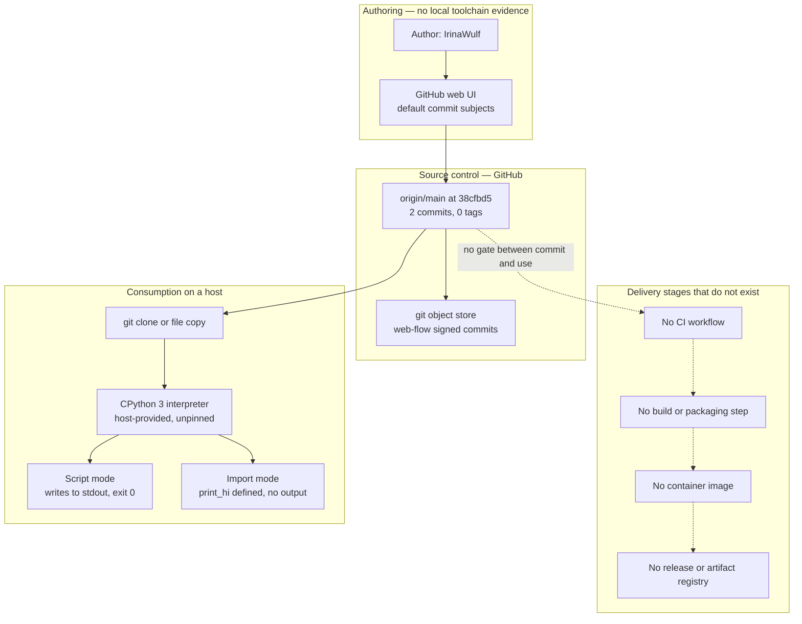
```mermaid
flowchart TD
    subgraph Authoring["Authoring — no local toolchain evidence"]
        Dev["Author: IrinaWulf"]
        WebUI["GitHub web UI<br/>default commit subjects"]
    end

    subgraph SCM["Source control — GitHub"]
        Origin["origin/main at 38cfbd5<br/>2 commits, 0 tags"]
        Store["git object store<br/>web-flow signed commits"]
    end

    subgraph Pipeline["Delivery stages that do not exist"]
        NoCI["No CI workflow"]
        NoBuild["No build or packaging step"]
        NoImage["No container image"]
        NoRelease["No release or artifact registry"]
    end

    subgraph Consumption["Consumption on a host"]
        Clone["git clone or file copy"]
        Interp["CPython 3 interpreter<br/>host-provided, unpinned"]
        Script["Script mode<br/>writes to stdout, exit 0"]
        Import["Import mode<br/>print_hi defined, no output"]
    end

    Dev --> WebUI
    WebUI --> Origin
    Origin --> Store
    Origin -.->|"no gate between commit and use"| NoCI
    NoCI -.-> NoBuild
    NoBuild -.-> NoImage
    NoImage -.-> NoRelease
    Origin --> Clone
    Clone --> Interp
    Interp --> Script
    Interp --> Import
```

### 3.6.6 Toolchain Integration Requirements and Security Implications

The stack has very few integration points, and this table states each one's requirement together with what protects it today.

| Integration point | Requirement | Current control |
|---|---|---|
| Author to GitHub | Authenticated git transport over HTTPS | GitHub account authentication; commits are web-flow signed but not locally verifiable (section 3.6.1) |
| GitHub to consuming host | Network reachability for `clone`/`fetch`; read access to the repository | None beyond GitHub repository permissions; no artifact checksum or signature verification step exists because no artifact is published |
| Source to interpreter | The file must be syntactically valid Python and resolvable on the import path for import mode | Verified manually via `py_compile`; no automated gate enforces it on future commits |
| Interpreter to output stream | A writable standard-output stream | None — a write failure propagates uncaught (section 2.4.4) |
| Clone-local credential handling | The `origin` URL in `.git/config` may embed an access token | Clone-local only; tracked content contains no credential, but the absence of a `.gitignore` means there is no protection against a future credential-bearing file being staged (section 3.4.2) |
| Working-tree cleanliness | Running or importing the module writes `__pycache__/` | None — no `.gitignore` exists, so the artifact appears as an untracked change (section 3.5.3) |

**Net security assessment of the development and deployment stack.** The attack surface is small because the stack is small: no build step to compromise, no registry to pull from, no image to poison, no CI runner holding credentials, and no deployed service to reach. The exposures that remain are governance rather than technology exposures — unreviewed, unverified commits landing directly on `main`; an unpinned interpreter supplying the only patchable component in the runtime; and no `.gitignore` standing between an accidentally created secret file and a commit. Each is a consequence of the absent tooling documented above, not of a tool chosen poorly.


## 3.7 References

### 3.7.1 Repository Files and Folders Examined

- `submod.py` - The sole programming-language artifact; established the Python language choice, the 115-byte / 5-line size, the zero-import dependency posture, the builtin-only runtime surface (`print`), the `__main__` guard as the only structural pattern, and the absence of annotations, `eval`/`exec`/`subprocess`, and version-gated syntax
- `README.md` - The sole Markdown artifact; established the 17-byte content and the absence of any dependency, installation, invocation, or licence documentation
- `/` (repository root) - Contained exactly two files and zero sub-directories, which made the manifest, framework, container, CI, and storage absence checks exhaustive rather than sampled
- `__pycache__/submod.cpython-312.pyc` - Untracked, interpreter-generated bytecode cache (354 bytes, magic `cb0d0d0a`); established the CPython 3.12 series binding of the cache, the code-caching behavior documented in section 3.5.3, and the untracked-artifact effect described in sections 3.1.4 and 3.6.6
- `.git/config` - Established the single `origin` remote over HTTPS to GitHub, the `main` branch tracking configuration, and the presence of clone-local non-interactive credential settings (the embedded access token was deliberately not reproduced)
- `.git/packed-refs` - Established `refs/remotes/origin/main` at `38cfbd5`
- `.git/hooks/` - Contained only stock `*.sample` templates, establishing that no hook is active

### 3.7.2 Repository Verification Performed

- `git ls-files`, full filesystem walk excluding `.git/` - Established the complete two-file inventory plus the single untracked bytecode artifact
- Name-by-name absence probe of 37 manifest/config files and 15 directories - Established the absence of Python packaging, npm/TypeScript, Docker, CI/CD, Terraform, database/migration, environment-template, and lint/test/format artifacts cited throughout sections 3.1 through 3.6
- AST inventory of `submod.py` (imports, functions, classes, calls, top-level nodes) - Established zero `Import`/`ImportFrom` nodes, the single `print_hi(name)` definition, and the two-call inventory (`print`, `print_hi`)
- `python3 -V`, `python3 -m py_compile submod.py`, `python3 submod.py` - Established the CPython 3.12.3 verification baseline, clean compilation with no packages installed, and the exact single-line output with exit status `0`
- `importlib.util.MAGIC_NUMBER` compared against the `.pyc` header - Established that the bytecode cache was produced by the same 3.12 interpreter series
- `wc -c` / `wc -l` / `splitlines()` on both files - Established the 115 + 17 = 132 byte totals and reconciled the 4-versus-5 line counts (no trailing newline in `submod.py`)
- `git log --all --name-status`, `git cat-file -p HEAD`, `git log --pretty=%G?`, `git tag -l`, `git branch -a` - Established the two-commit history with GitHub web-UI default subjects, the `gpgsig` web-flow signature with `GitHub` as committer, the zero-tag state, and `origin/HEAD` resolving to `main`

### 3.7.3 Technical Specification Sections Cross-Referenced

- `1.1 Executive Summary` - Repository identity (`irinakwulf/GHNewRepoIW`, branch `main`), the near-empty framing, the 132-byte total, and the `'PyCharm'` provenance signal
- `1.2 System Overview` - The zero-integration determination and keyword-scan results (1.2.1.3), the component inventory (1.2.2.2), the "plain Python 3, no framework, zero dependencies" technical approach (1.2.2.3), the critical success factors (1.2.3.2), and the recorded absence of KPIs and quality gates (1.2.3.3)
- `1.3 Scope` - The in-scope technical requirements — Python 3 runtime, no installation, no configuration, writable stdout (1.3.1.1); the no-data-domains determination (1.3.1.2); and the exhaustive excluded-capability and uncovered-integration inventories (1.3.2.1, 1.3.2.3)
- `2.2 Functional Requirements` - Requirement anchors used for traceability, in particular F-001-RQ-001/002 (output contract and sole sink), F-002-RQ-002/004 (arity enforcement, unused argument), and F-003-RQ-001/002/004 (script mode, import silence, dependency-free compilation)
- `2.4 Implementation Considerations` - The five cross-cutting constraints (zero dependencies, no automated verification, no configuration surface, no packaging metadata, single-file colocation including the missing trailing newline), the measured performance baselines, and the confirmation that no `eval`, `exec`, deserialization, or subprocess use exists
- `2.5 Traceability and Requirement Governance` - The requirement-to-source anchors, the zero-tag/no-release finding (2.5.4), and the governance assumption that the target runtime is an unpinned CPython 3 (2.5.5)

### 3.7.4 External Sources

- [web] CPython developer's guide, version-status page - Confirmed that CPython's main development branch now targets a version well beyond the 3.12 line used for verification, supporting the version-drift implication documented in section 3.1.2
- [web] Google App Engine Python 3 runtime documentation - Corroborating datapoint on the currently supported Python version line in a managed-platform context; used only to frame the unpinned-runtime discussion, as no cloud platform is used by this repository

### 3.7.5 Project Context Reconciled

- Default technology stack supplied as project context (AWS, Docker, Terraform, GitHub Actions, Python, Flask, Auth0, MongoDB, Langchain, React with TypeScript, TailwindCSS, React Native, Swift, Kotlin, Objective-C, ElectronJS) - Reconciled component by component against repository evidence in section 3.4.3; only Python (as the language) and GitHub (as the git remote host) are present


# 4. Process Flowchart

## 4.1 System Workflows

This section documents the process flows that actually exist in the repository. The complete codebase is `submod.py` — five lines containing one function definition, one `print` call, and one `if` statement — plus `README.md`, a single Markdown heading. There is no web layer, no service, no scheduler, no queue, no database, and no external integration: a repository-wide scan of both files for `try`, `except`, `raise`, `logging`, `retry`, `http`, `socket`, `sql`, `redis`, `kafka`, `celery`, `cron`, `async`, `await`, `threading`, `subprocess`, `open(`, `json`, `argparse`, `sys.`, and even `import` returned **zero matches**, and the repository contains no sub-directories at all apart from `.git`.

Consequently the "business processes" documented here are the runtime processes that carry a single greeting from a hardcoded string literal to a consumer's output stream, and the decision points are those of the operating system, the CPython runtime, and the one branch present in the source. Every step, branch, and timing figure below was verified by executing the module on CPython 3.12.3 against an isolated copy of the committed file; none is inferred. Feature identifiers (`F-001`–`F-004`) and requirement identifiers (`F-XXX-RQ-YYY`) are those established in sections 2.1 and 2.2.

### 4.1.1 Core Business Processes

#### 4.1.1.1 Workflow Register and Actors

Four workflows exist. Three are runtime paths through `submod.py`; the fourth is the reading of `README.md`, which has no runtime behavior at all.

| ID | Workflow | Trigger | Initiating actor | Terminal state | Features exercised |
|---|---|---|---|---|---|
| WF-1 | Script-mode execution | `python3 submod.py` | Developer or operator at a shell | One greeting line on stdout, process exit status `0` | F-003, F-002, F-001 |
| WF-2 | Module-mode execution | `python3 -m submod` | Developer or operator at a shell | Same output as WF-1, plus a bytecode cache file on disk | F-003, F-002, F-001 |
| WF-3 | Library-mode import and invocation | `import submod` followed by an explicit `print_hi(...)` call | A calling Python program | No output at import; one greeting line per explicit call; `None` returned | F-002, F-001 (F-003 guard evaluates false) |
| WF-4 | Documentation read | Opening `README.md` | Developer or Markdown renderer | Project name `Hello_World_py` displayed | F-004 |

The actor and boundary inventory is correspondingly short. There is exactly one human touchpoint per workflow — the command the operator types, or the file they open — and no interactive step anywhere: the module reads no arguments, no environment variables, and no standard input.

| Actor / system | Role in the workflows | Boundary crossed |
|---|---|---|
| Developer / operator | Issues the invocation (WF-1, WF-2), authors the calling program (WF-3), or reads the document (WF-4) | Human-to-shell |
| OS shell / process launcher | Resolves the interpreter on `PATH`, spawns the process, reaps the exit status | Shell-to-process |
| CPython 3 runtime | Initializes, locates and compiles the source, executes the module body, flushes and closes the standard streams at shutdown | Process-to-runtime |
| `submod.py` module | Binds `print_hi`, evaluates the `__main__` guard, performs the single `print` | Runtime-to-application |
| Standard-output stream and its consumer | Receives 31 bytes — the 30-character message plus the newline `print` supplies | Process-to-stdout |
| Filesystem `__pycache__` directory | Receives compiled bytecode in WF-2 and WF-3 only | Process-to-filesystem |

The map below shows all four workflows converging on the single decision and the single output statement that the system possesses.

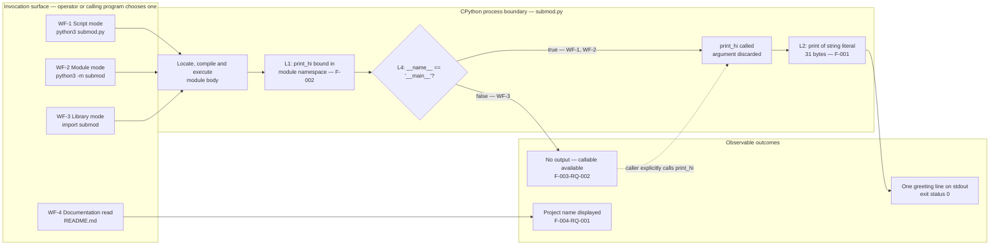
```mermaid
flowchart LR
    subgraph Modes["Invocation surface — operator or calling program chooses one"]
        WF1["WF-1 Script mode<br/>python3 submod.py"]
        WF2["WF-2 Module mode<br/>python3 -m submod"]
        WF3["WF-3 Library mode<br/>import submod"]
        WF4["WF-4 Documentation read<br/>README.md"]
    end

    subgraph Boundary["CPython process boundary — submod.py"]
        Load["Locate, compile and execute<br/>module body"]
        Define["L1: print_hi bound in<br/>module namespace — F-002"]
        GuardD{"L4: __name__ == '__main__'?"}
        Invoke["print_hi called<br/>argument discarded"]
        Write["L2: print of string literal<br/>31 bytes — F-001"]
    end

    subgraph Outcomes["Observable outcomes"]
        Greet["One greeting line on stdout<br/>exit status 0"]
        Quiet["No output — callable available<br/>F-003-RQ-002"]
        Text["Project name displayed<br/>F-004-RQ-001"]
    end

    WF1 --> Load
    WF2 --> Load
    WF3 --> Load
    WF4 --> Text
    Load --> Define
    Define --> GuardD
    GuardD -->|"true — WF-1, WF-2"| Invoke
    GuardD -->|"false — WF-3"| Quiet
    Quiet -.->|"caller explicitly calls print_hi"| Invoke
    Invoke --> Write
    Write --> Greet
```

#### 4.1.1.2 WF-1 Script-Mode Execution — End-to-End Journey

WF-1 is the system's primary journey and the one the committed `__main__` guard exists to serve. The measured end-to-end wall time is **10.5–11.2 ms, mean 10.8 ms across ten sequential invocations**, of which the application logic accounts for approximately 0.24 µs — interpreter startup dominates by roughly four orders of magnitude.

| Step | Actor | Action | Source anchor | Verified outcome |
|---|---|---|---|---|
| 1 | Operator | Types `python3 submod.py` and presses return | — | Single user touchpoint; no arguments are read by the module |
| 2 | Shell | Resolves the interpreter on `PATH`, forks and execs | — | A missing executable produces shell exit status `127` before any repository code runs |
| 3 | CPython | Initializes the interpreter | — | Accounts for effectively all of the 10.8 ms mean |
| 4 | CPython | Opens and reads `submod.py` | file path argument | An unreadable or absent path yields `can't open file ... [Errno 2]` on stderr and exit status `2` |
| 5 | CPython | Compiles the source to in-memory bytecode | whole file | `python3 -m py_compile submod.py` exits `0`, confirming the source is valid (F-003-RQ-004). **No `__pycache__` entry is written in this mode** — the `__main__` script is not cached |
| 6 | Module body | Binds `print_hi` into the module namespace | `submod.py` L1 | Module exposes exactly one public attribute, `print_hi` (F-002-RQ-001) |
| 7 | Module body | Evaluates `__name__ == '__main__'` | `submod.py` L4 | True in this mode; this is the only conditional in the entire codebase |
| 8 | Module body | Calls `print_hi('PyCharm')` | `submod.py` L5 | The literal satisfies the required parameter and is then discarded (F-003-RQ-003) |
| 9 | `print_hi` | Calls `print` with the string literal | `submod.py` L2 | Queues 31 bytes to the standard-output stream (F-001-RQ-001); no `flush` argument is passed (F-001-RQ-004) |
| 10 | `print_hi` | Falls off the end of the body | `submod.py` L2 | Returns `None` implicitly (F-002-RQ-003) |
| 11 | CPython | Shuts down, flushing and closing the standard streams | — | Delivery to a pipe or file completes here, not at step 9 |
| 12 | Shell / operator | Receives exit status `0` and observes the line | — | stderr empty, status `0` (F-003-RQ-001) |

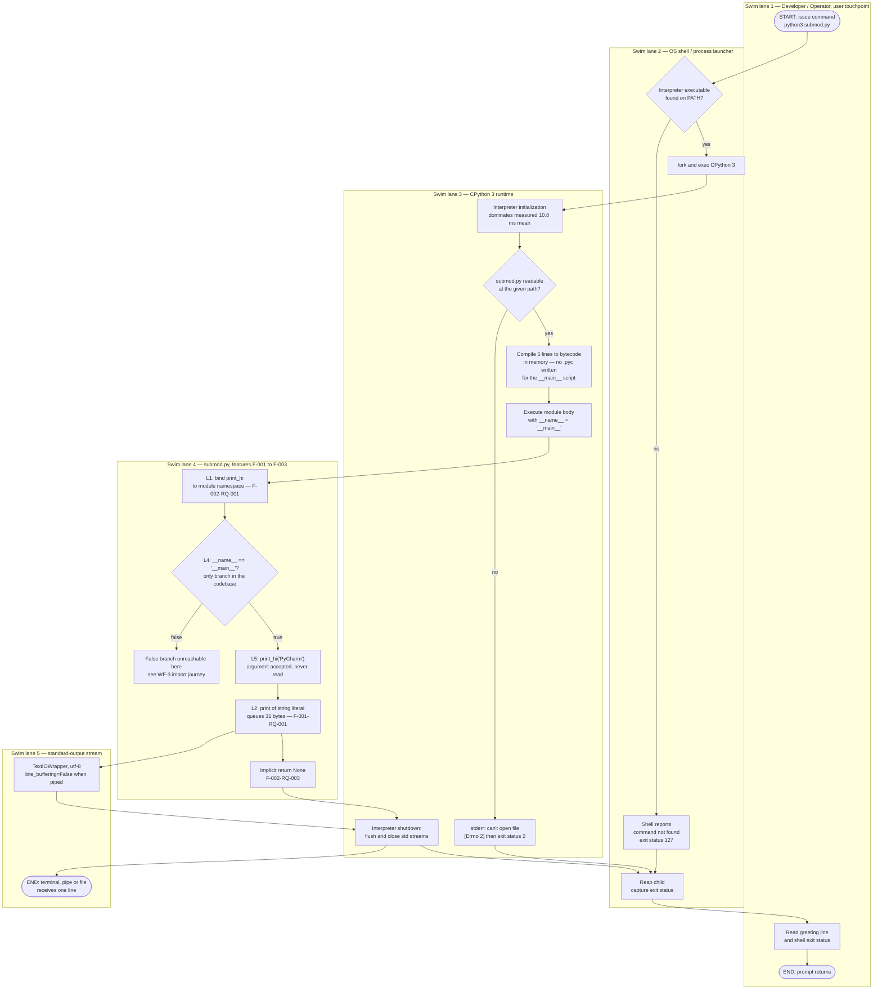
```mermaid
flowchart TD
    subgraph Actor["Swim lane 1 — Developer / Operator, user touchpoint"]
        OpStart(["START: issue command<br/>python3 submod.py"])
        OpObserve["Read greeting line<br/>and shell exit status"]
        OpEnd(["END: prompt returns"])
    end

    subgraph Shell["Swim lane 2 — OS shell / process launcher"]
        ResolveD{"Interpreter executable<br/>found on PATH?"}
        NotFound["Shell reports<br/>command not found<br/>exit status 127"]
        Spawn["fork and exec CPython 3"]
        Status["Reap child<br/>capture exit status"]
    end

    subgraph Runtime["Swim lane 3 — CPython 3 runtime"]
        Init["Interpreter initialization<br/>dominates measured 10.8 ms mean"]
        ReadD{"submod.py readable<br/>at the given path?"}
        OpenFail["stderr: can't open file<br/>[Errno 2] then exit status 2"]
        Compile["Compile 5 lines to bytecode<br/>in memory — no .pyc written<br/>for the __main__ script"]
        ExecBody["Execute module body<br/>with __name__ = '__main__'"]
        Shutdown["Interpreter shutdown:<br/>flush and close std streams"]
    end

    subgraph Module["Swim lane 4 — submod.py, features F-001 to F-003"]
        DefFn["L1: bind print_hi<br/>to module namespace — F-002-RQ-001"]
        GuardD{"L4: __name__ == '__main__'?<br/>only branch in the codebase"}
        GuardFalse["False branch unreachable here<br/>see WF-3 import journey"]
        CallFn["L5: print_hi('PyCharm')<br/>argument accepted, never read"]
        Emit["L2: print of string literal<br/>queues 31 bytes — F-001-RQ-001"]
        RetNone["Implicit return None<br/>F-002-RQ-003"]
    end

    subgraph Sink["Swim lane 5 — standard-output stream"]
        Buffer["TextIOWrapper, utf-8<br/>line_buffering=False when piped"]
        Consumer(["END: terminal, pipe or file<br/>receives one line"])
    end

    OpStart --> ResolveD
    ResolveD -->|"no"| NotFound
    NotFound --> Status
    ResolveD -->|"yes"| Spawn
    Spawn --> Init
    Init --> ReadD
    ReadD -->|"no"| OpenFail
    OpenFail --> Status
    ReadD -->|"yes"| Compile
    Compile --> ExecBody
    ExecBody --> DefFn
    DefFn --> GuardD
    GuardD -->|"false"| GuardFalse
    GuardD -->|"true"| CallFn
    CallFn --> Emit
    Emit --> Buffer
    Emit --> RetNone
    RetNone --> Shutdown
    Buffer --> Shutdown
    Shutdown --> Consumer
    Shutdown --> Status
    Status --> OpObserve
    OpObserve --> OpEnd
```

#### 4.1.1.3 WF-2 Module-Mode Execution

`python3 -m submod` was verified to produce the identical greeting and exit status `0`. It differs from WF-1 in two respects that matter to the flow, both observed:

- **Resolution mechanism.** The module is located through `sys.path` rather than by direct file path, so the working directory or `PYTHONPATH` must make `submod` importable. A failure here surfaces as a runtime `No module named submod` rather than the `[Errno 2]` open failure of WF-1.
- **Persistence side effect.** This mode **does** write `__pycache__/submod.cpython-312.pyc`, whereas WF-1 writes nothing. This is a real, if minor, divergence from the general statement in section 3.6.6 that "running or importing" writes the cache: verification shows plain script execution does not.

The guard still evaluates true, because the runtime sets `__name__` to `'__main__'` for a module run with `-m`; steps 6–12 of WF-1 therefore apply unchanged.

#### 4.1.1.4 WF-3 Library-Mode Import and Invocation

WF-3 is the only two-stage journey in the system, and the guard's purpose is to keep the two stages separate.

**Stage 1 — import.** `import submod` (or `from submod import print_hi`) locates the source on `sys.path`, compiles it if no fresh bytecode cache exists, writes `__pycache__/submod.cpython-312.pyc` (365 bytes as observed), executes the module body with `__name__ == 'submod'`, and returns. The guard evaluates **false**, so no call is made and **no output is produced** — verified: captured stdout is empty and `submod.__name__` is `'submod'` (F-003-RQ-002). Within a single process a second `import` returns the same module object from `sys.modules` (`first is again` evaluated `True`), so the module body executes exactly once per process.

**Stage 2 — invocation.** The calling program invokes `print_hi(value)`. Verified with `None`, `0`, `123`, `'Blitzy'`, `['a']`, `{'k': 1}`, and a custom class instance: the emitted line was byte-identical in all seven cases and the return value was `None` every time (F-001-RQ-003, F-002-RQ-004). Mean cost is 0.24 µs per call over 100,000 iterations with output captured.

The consequence for consumers is the only meaningful performance decision the system offers: repeated greetings cost ~10.8 ms each through WF-1 process spawning versus ~0.24 µs each through WF-3, a difference of roughly four orders of magnitude.

#### 4.1.1.5 WF-4 Documentation Read

`README.md` is 17 characters — the heading `# Hello_World_py` — and participates in no automated process: no build, packaging, linting, or publication step exists to consume it. The workflow is therefore a single step with no decision points, no failure modes beyond the file being unreadable, and no runtime effect (F-004-RQ-002).

#### 4.1.1.6 Decision Point Register

Seven decision points govern the workflows. Only one of them lives in repository code; the remaining six are enforced by the shell, the runtime, or the standard library, which is the direct consequence of the module containing no conditional logic other than its guard.

| # | Decision | Evaluated by | Inputs | Branch outcomes (verified) | Workflows |
|---|---|---|---|---|---|
| D1 | Is the interpreter executable resolvable? | OS shell | `PATH`, command name | Yes → process spawned; No → shell exit status `127`, no repository code runs | WF-1, WF-2 |
| D2 | Is the target readable? | CPython startup / import machinery | File path (WF-1) or `sys.path` (WF-2, WF-3) | Yes → compile; No → `[Errno 2]` on stderr with exit status `2` (WF-1) or `ModuleNotFoundError` (WF-2, WF-3) | All runtime workflows |
| D3 | Is the module already in `sys.modules`? | Import machinery | Process-local module cache | Hit → cached object returned, body **not** re-executed; Miss → proceed to load | WF-3 |
| D4 | Is cached bytecode present and fresh? | Import machinery | `.pyc` presence, source mtime, `-B` flag | Fresh → reuse (pyc mtime unchanged on second import); Stale/absent → recompile and rewrite (new pyc mtime observed after `touch submod.py`); `-B` → compile without writing | WF-2, WF-3 |
| D5 | **`__name__ == '__main__'`** (`submod.py` L4) | Repository code — the only in-code branch | Module `__name__` | True → `print_hi('PyCharm')` executes; False → module returns silently | All runtime workflows |
| D6 | Does the call satisfy the arity contract? | Interpreter calling convention, not module code | Argument count | Exactly one → proceeds; zero or two → `TypeError`, traceback on stderr, exit status `1` | WF-3 (and any direct call) |
| D7 | Is `sys.stdout` available and writable? | `print` builtin and the stream layer | State of file descriptor 1 | Available → 31 bytes queued; `sys.stdout is None` (fd 1 closed at startup) → `print` **silently does nothing** and the process still exits `0`; write error at flush → `Exception ignored in ...` on stderr and exit status `120` | All output-producing workflows |

#### 4.1.1.7 Error-Handling Paths

No error handling exists in the repository — there is no `try`, `except`, `raise`, or `assert` anywhere, and no logging. Every failure path is therefore an interpreter or OS path that the application neither detects nor mitigates; each terminates the workflow rather than recovering it. The paths verified by execution are D1 (`127`), D2 (`2`), D6 (`1`), and the three D7 variants (`0` with silent loss, or `120` at flush). Their mechanics, notification behavior, and the operator-side recovery procedures are documented in section 4.3.2.

### 4.1.2 Integration Workflows

The system has no integration with any external system. Consistent with section 2.3.2, its entire integration surface consists of facilities provided by the host: the standard-output stream, Python's module-resolution mechanism, the launching shell's process contract, and — for WF-2 and WF-3 only — the `__pycache__` directory.

#### 4.1.2.1 Data Flow Between Systems

One datum flows through the system, and it originates inside the compiled module rather than from any external source.

| Hop | From | To | Payload | Mechanism | Observed characteristics |
|---|---|---|---|---|---|
| 1 | Module constant pool (`submod.py` L2) | `print` builtin | 30-character ASCII literal | In-process argument passing | The literal is pure ASCII (`str.isascii()` is `True`), so no encoding-dependent failure mode applies to the payload |
| 2 | `print` builtin | `sys.stdout` text layer | 31 bytes (literal + newline) | `TextIOWrapper`, encoding `utf-8` | `line_buffering` is `False` when stdout is a pipe, so bytes are buffered rather than delivered immediately |
| 3 | `sys.stdout` buffer | OS file descriptor 1 | Same 31 bytes | Buffer flush | For a pipe or file this occurs at interpreter shutdown, **after** all application code has finished |
| 4 | File descriptor 1 | Terminal, pipe, or file | Same 31 bytes | OS stream | Captured output confirmed as the literal followed by a newline |
| 5 | CPython process | Launching shell | Process exit status | `wait`/`waitpid` | `0` on success; `1`, `2`, `120`, or `127` on the failure paths in the register above |
| 6 | Import machinery | `__pycache__/submod.cpython-312.pyc` | 365 bytes of bytecode | Filesystem write | WF-2 and WF-3 only; suppressed entirely by `python3 -B` |

Note that hop 6 is the **only** write the system makes to persistent storage, and it is performed by the runtime rather than by repository code. There is no inbound data flow of any kind: nothing is read from a network, a file, an environment variable, standard input, or a command-line argument.

#### 4.1.2.2 API Interactions

No network API is exposed or consumed — there is no HTTP server, client, RPC stub, GraphQL schema, or webhook anywhere in the repository, and no dependency manifest through which a client library could be introduced. The system's only interface contract is the in-process Python calling convention for `print_hi`, which section 2.1.3 catalogues as F-002 and which behaves as follows.

| Contract element | Verified behavior |
|---|---|
| Callable surface | Exactly one public attribute, `print_hi`; no `__all__` declaration and no docstring |
| Signature | `(name)` — one `POSITIONAL_OR_KEYWORD` parameter, no default, no annotation |
| Request validation | None. Any object is accepted; the value is never read, type-checked, coerced, or forwarded |
| Response | `None` on every call; the meaningful response is the side effect on stdout |
| Error responses | Arity violations only, raised by the interpreter: `TypeError: print_hi() missing 1 required positional argument: 'name'` and `TypeError: print_hi() takes 1 positional argument but 2 were given` |
| Idempotency / statelessness | Stateless; each call performs one write and retains nothing, so N calls produce N identical lines |

#### 4.1.2.3 Event Processing Flows

There is no event processing: no message broker, no event loop, no `async`/`await`, no callbacks, no signal handlers, and no observer registration exist in the source. The only event-like mechanism affecting behavior is one the runtime supplies — **interpreter shutdown**, which flushes the buffered standard-output stream. This is architecturally significant because it moves the point of delivery, and therefore the point of failure, outside application code: a write into a pipe whose reader has closed returns normally from `print` and only fails later at the shutdown flush, reported as an ignored `BrokenPipeError` on the stdout wrapper with exit status `120`.

#### 4.1.2.4 Batch Processing Sequences

No batch or scheduled processing exists. There is no cron entry, scheduler configuration, task queue, worker definition, `Makefile`, or CI workflow in the repository, and the module processes no collection input — it takes one inert argument and emits one line.

The only bulk pattern available to a consumer is repetition, and the two forms differ sharply in measured cost:

| Bulk pattern | Mechanism | Measured cost per greeting | Notes |
|---|---|---|---|
| Repeated process invocation | Shell loop over `python3 submod.py` | ~10.8 ms | Fixed interpreter-startup cost paid every iteration; each iteration is an independent process with its own exit status |
| Repeated in-process invocation | `import submod` once, then loop over `print_hi(...)` | ~0.24 µs | Module body executes once per process (`sys.modules` cache); throughput is then bounded by the output stream, not by the module |

#### 4.1.2.5 Import-Path Integration Sequence

The sequence below traces WF-3 across the import machinery, the filesystem, and the module, including the two cache decisions (D3, D4) that determine whether compilation and a disk write occur.

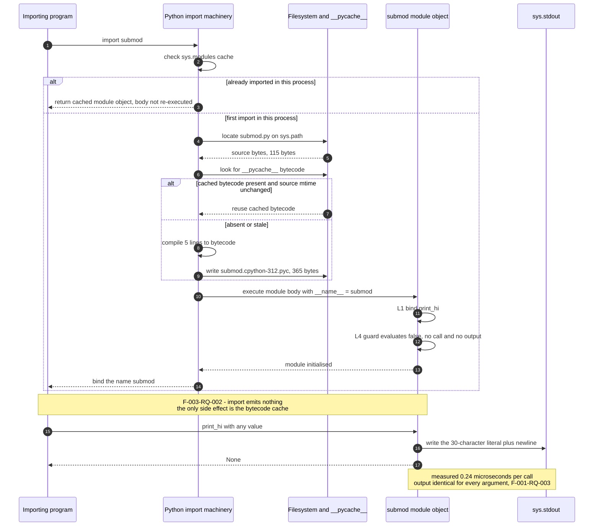
```mermaid
sequenceDiagram
    autonumber
    participant Caller as Importing program
    participant Import as Python import machinery
    participant FS as Filesystem and __pycache__
    participant Mod as submod module object
    participant Out as sys.stdout

    Caller->>Import: import submod
    Import->>Import: check sys.modules cache
    alt already imported in this process
        Import-->>Caller: return cached module object, body not re-executed
    else first import in this process
        Import->>FS: locate submod.py on sys.path
        FS-->>Import: source bytes, 115 bytes
        Import->>FS: look for __pycache__ bytecode
        alt cached bytecode present and source mtime unchanged
            FS-->>Import: reuse cached bytecode
        else absent or stale
            Import->>Import: compile 5 lines to bytecode
            Import->>FS: write submod.cpython-312.pyc, 365 bytes
        end
        Import->>Mod: execute module body with __name__ = submod
        Mod->>Mod: L1 bind print_hi
        Mod->>Mod: L4 guard evaluates false, no call and no output
        Mod-->>Import: module initialised
        Import-->>Caller: bind the name submod
    end
    Note over Caller,Mod: F-003-RQ-002 - import emits nothing<br/>the only side effect is the bytecode cache
    Caller->>Mod: print_hi with any value
    Mod->>Out: write the 30-character literal plus newline
    Mod-->>Caller: None
    Note over Mod,Out: measured 0.24 microseconds per call<br/>output identical for every argument, F-001-RQ-003
```


## 4.2 Flowchart Requirements

This section states, for each workflow in section 4.1, the elements a complete flowchart of that workflow must contain — start and end points, process steps, decisions, boundaries, user touchpoints, error states, and timing — followed by the validation rules that apply at each step. Where an element category has no instance in this system, that is recorded as a verified absence rather than omitted, because the absences are the more consequential architectural facts here.

### 4.2.1 Flowchart Element Matrix

| Element | WF-1 Script mode | WF-2 Module mode | WF-3 Library mode | WF-4 Documentation read |
|---|---|---|---|---|
| Start point | Operator issues `python3 submod.py` | Operator issues `python3 -m submod` | Calling program executes `import submod` | Reader opens `README.md` |
| End point (success) | One line on stdout, exit `0` | One line on stdout, exit `0`, `.pyc` on disk | `print_hi` bound and, per explicit call, one line and `None` returned | Heading `# Hello_World_py` displayed |
| Process steps | 12 (see 4.1.1.2); 4 of them in repository code (L1, L4, L5, L2) | Same 12, with `sys.path` resolution and a bytecode write | 2 stages: load-and-bind, then per-call emit | 1 |
| Decision diamonds | D1, D2, D5, D7 | D1, D2, D4, D5, D7 | D2, D3, D4, D5, D6, D7 | None |
| System boundaries crossed | Human→shell, shell→process, process→runtime, runtime→module, process→stdout | The above plus process→filesystem | Caller→import machinery, import→filesystem, caller→module, module→stdout | None (static file) |
| User touchpoints | 2: the command typed, the line read | 2 | 1 in the calling program's source; none at runtime | 1 |
| Error states | `127`, `2`, `120`, silent-loss-with-`0` | The above plus `ModuleNotFoundError` | `ModuleNotFoundError`, `1` (arity), `120`, silent loss | File unreadable |
| Recovery paths | None automated — operator re-invocation only | None automated | None automated — caller may wrap the call in its own handler | Re-open the file |
| Measured timing | 10.5–11.2 ms per invocation, mean 10.8 ms (n=10) | Same order; first run additionally pays a `.pyc` write | Import once per process; 0.24 µs per call (n=100,000) | Not applicable |

Two structural properties of this matrix are worth stating explicitly, because they shape every diagram in this section. First, **the repository contributes exactly one decision diamond (D5) and four process steps**; every other element belongs to the shell, the runtime, or the stream layer. Second, **no workflow has a recovery path**: because there is no `try`/`except` anywhere in the source, every error state is terminal for the process, and recovery means a human or calling program starting the workflow again.

### 4.2.2 Timing and SLA Considerations

The repository declares **no** service-level agreement, timeout, deadline, retry budget, rate limit, or performance target: no configuration file, no CI workflow, no scheduler entry, and no timing-related code exists. The figures below are measurements taken on CPython 3.12.3, offered as an observed baseline rather than as a commitment.

| Timing property | Measured value | Interpretation |
|---|---|---|
| Script-mode end-to-end wall time | min 10.5 ms, max 11.2 ms, mean 10.8 ms over 10 sequential runs | Effectively all interpreter startup; the application's share is ~0.002% of the total |
| In-process call latency | mean 0.24 µs over 100,000 iterations with stdout captured | One Python frame plus one `print` call; no allocation of derived data |
| Delivery latency to a terminal | Immediate on write | Terminal streams are line-buffered by default |
| Delivery latency to a pipe or file | Deferred to interpreter shutdown | `sys.stdout.line_buffering` is `False` when piped and `print` passes no `flush` argument (F-001-RQ-004), so the write is buffered and completes after all application code has finished |
| Timeout / cancellation behavior | None implemented | The process holds no timer, deadline, or signal handler; termination is the only way to interrupt it |

The deferred-delivery property is the only timing consideration with a real design consequence: an integrator who needs the line to be observable *before* the process exits — for example a supervisor tailing a pipe — cannot obtain that guarantee from this code, because neither `flush=True` nor an explicit `sys.stdout.flush()` call exists in it.

### 4.2.3 Validation Rules

#### 4.2.3.1 Business Rules by Step

Three business rules are encoded in the five lines of source. Each is a structural property of the code rather than a statement in any policy or requirements document, since the repository contains none.

| Rule | Encoded at | Statement | Enforcement evidence |
|---|---|---|---|
| BR-1 Constant output | `submod.py` L2 | The emitted text is a compile-time constant and is never derived from a runtime value | Seven distinct argument values, spanning `str`, `NoneType`, `int`, `list`, `dict`, and a user class, produced byte-identical output (F-001-RQ-003) |
| BR-2 Mode-gated emission | `submod.py` L4 | Output is produced if and only if the module's `__name__` equals `'__main__'` | Script and `-m` invocations emitted the line; `import` emitted nothing and left `__name__` as `'submod'` (F-003-RQ-002) |
| BR-3 Required-but-inert argument | `submod.py` L1, L5 | A caller must supply exactly one argument, and the system guarantees the value will not influence the result | Arity is enforced (`TypeError` on 0 or 2 arguments) while the value is discarded; the guarded call supplies `'PyCharm'` purely to satisfy the signature (F-003-RQ-003) |

#### 4.2.3.2 Data Validation Requirements

There is no data validation anywhere in this system, and the absence is complete rather than partial: no type check, no null check, no range or length check, no format or schema validation, no coercion, no sanitization, and no encoding validation. The single parameter is never read, so there is no value for a validator to inspect.

| Validation category | Status | Basis |
|---|---|---|
| Type validation | Absent | `print_hi` has no annotation and no `isinstance` check; `None`, `int`, `list`, `dict`, and a class instance were all accepted |
| Presence / arity validation | Present, but supplied by the interpreter | `TypeError: print_hi() missing 1 required positional argument: 'name'` and `... takes 1 positional argument but 2 were given` |
| Range, length, or format validation | Absent | No comparison, regular expression, or parsing operation exists in the source |
| Output validation | Absent | The literal is emitted unconditionally; no assertion, checksum, or acknowledgement of delivery exists |
| Schema or contract validation | Absent | No schema file, model class, or serialization step exists in the repository |
| Encoding validation | Not required for the payload | The literal is pure ASCII (`str.isascii()` is `True`), so it is representable in every encoding the stream layer may select |

The practical consequence, consistent with section 2.4.3, is that the module offers no defense of its own: a caller passing an unexpected value receives no error and no changed behavior, and a caller passing the wrong number of arguments receives only the interpreter's arity `TypeError`.

#### 4.2.3.3 Authorization Checkpoints

The module performs no authentication or authorization: it reads no credential, consults no identity, exposes no listening interface, and contains no permission check. All access control in the workflows is therefore supplied by the operating system and evaluated against the calling principal, as verified below.

| Checkpoint | Enforced by | Verified behavior |
|---|---|---|
| Execute permission on the interpreter | OS / shell `PATH` resolution | A principal without an invocable interpreter never reaches repository code; the shell reports exit status `127` |
| Read permission on `submod.py` | OS file permissions | An unprivileged user reading a mode-`000` copy received `can't open file ... [Errno 13] Permission denied` and exit status `2`; the same file executed successfully as `uid 0`, confirming that the read gate is the only gate and that it is bypassed by privilege |
| Execute permission on the source file | OS file mode | Both files are committed with mode `100644` and `submod.py` carries no shebang, so `./submod.py` fails with shell "Permission denied" and exit status `126` — the interpreter must always be named explicitly |
| Import-path visibility | Python `sys.path` resolution | Invoking `python3 -m submod` from a directory where the module is not importable produced `No module named submod` and exit status `1` |
| Privilege granted by the workflow | — | None. The process escalates nothing, writes nothing outside `__pycache__`, and opens no network interface |

#### 4.2.3.4 Regulatory Compliance Checks

No compliance check exists, and none is applicable to the observed behavior. The system processes no personal, financial, health, or otherwise regulated data: its only datum is a hardcoded ASCII greeting, and the one value a caller may supply is discarded without being stored, transmitted, logged, or echoed. A keyword scan of both files for `token`, `secret`, `password`, `api_key`, and `auth` returned no matches, and the repository contains no `LICENSE`, no privacy notice, no data-retention statement, and no audit log — so, as section 2.2.5.3 records, redistribution terms are undocumented rather than restricted. There is also no audit trail to satisfy a compliance obligation with: the process emits one line to stdout and retains nothing.

### 4.2.4 Consolidated Gate and Checkpoint Flowchart

The diagram below expresses sections 4.2.1–4.2.3 as a single ordered chain of gates, with each failure branch labelled by the exit status an operator will actually observe. Gate group C makes the central architectural point visible: between the arity check and the write, where a conventional system would place its validation and authorization logic, this system has an explicit gap.

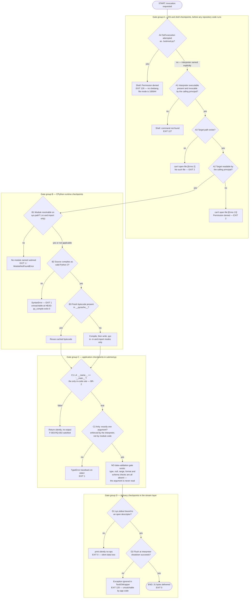
```mermaid
flowchart TD
    Begin(["START: invocation requested"])

    subgraph OSGates["Gate group A — OS and shell checkpoints, before any repository code runs"]
        A4{"A4 Self-execution attempted<br/>as ./submod.py?"}
        A4F["Shell: Permission denied<br/>EXIT 126 — no shebang,<br/>file mode is 100644"]
        A1{"A1 Interpreter executable<br/>present and invocable<br/>by the calling principal?"}
        A1F["Shell: command not found<br/>EXIT 127"]
        A3{"A3 Target path exists?"}
        A3F["can't open file [Errno 2]<br/>No such file — EXIT 2"]
        A2{"A2 Target readable by<br/>the calling principal?"}
        A2F["can't open file [Errno 13]<br/>Permission denied — EXIT 2"]
    end

    subgraph RTGates["Gate group B — CPython runtime checkpoints"]
        B1{"B1 Module resolvable on<br/>sys.path? (-m and import only)"}
        B1F["No module named submod<br/>EXIT 1 / ModuleNotFoundError"]
        B2{"B2 Source compiles as<br/>valid Python 3?"}
        B2F["SyntaxError — EXIT 1<br/>unreachable at HEAD:<br/>py_compile exits 0"]
        B3{"B3 Fresh bytecode present<br/>in __pycache__?"}
        B3Y["Reuse cached bytecode"]
        B3N["Compile, then write .pyc<br/>in -m and import modes only"]
    end

    subgraph AppGates["Gate group C — application checkpoints in submod.py"]
        C1{"C1 L4: __name__ == '__main__'?<br/>the only in-code rule — BR-2"}
        C1F["Return silently, no output<br/>F-003-RQ-002 satisfied"]
        C2{"C2 Arity: exactly one argument?<br/>enforced by the interpreter,<br/>not by module code"}
        C2F["TypeError traceback on stderr<br/>EXIT 1"]
        C3["NO data-validation gate exists:<br/>type, null, range, format and<br/>schema checks are all absent —<br/>the argument is never read"]
    end

    subgraph OutGates["Gate group D — delivery checkpoints in the stream layer"]
        D1{"D1 sys.stdout bound to<br/>an open descriptor?"}
        D1F["print silently no-ops<br/>EXIT 0 — silent data loss"]
        D2{"D2 Flush at interpreter<br/>shutdown succeeds?"}
        D2F["Exception ignored in TextIOWrapper<br/>EXIT 120 — uncatchable by app code"]
        D2Y(["END: 31 bytes delivered<br/>EXIT 0"])
    end

    Begin --> A4
    A4 -->|"yes"| A4F
    A4 -->|"no — interpreter named explicitly"| A1
    A1 -->|"no"| A1F
    A1 -->|"yes"| A3
    A3 -->|"no"| A3F
    A3 -->|"yes"| A2
    A2 -->|"no"| A2F
    A2 -->|"yes"| B1
    B1 -->|"no"| B1F
    B1 -->|"yes or not applicable"| B2
    B2 -->|"no"| B2F
    B2 -->|"yes"| B3
    B3 -->|"yes"| B3Y
    B3 -->|"no"| B3N
    B3Y --> C1
    B3N --> C1
    C1 -->|"false"| C1F
    C1 -->|"true"| C2
    C2 -->|"no"| C2F
    C2 -->|"yes"| C3
    C3 --> D1
    D1 -->|"no"| D1F
    D1 -->|"yes"| D2
    D2 -->|"no"| D2F
    D2 -->|"yes"| D2Y
```


## 4.3 Technical Implementation

This section documents how the workflows in section 4.1 are realized at runtime: what state exists and where it lives, where data is persisted, what is cached, where transaction boundaries fall, and how failures are detected, reported, and recovered from. Every mechanism described here belongs to the CPython runtime or the operating system, because the repository's five lines of code implement none of them — a fact that is itself the defining implementation characteristic of this system.

### 4.3.1 State Management

#### 4.3.1.1 Application State Inventory

The module holds no application state. Its public attribute list is exactly `['print_hi']`, so there is no module-level mutable variable, counter, accumulator, cache, singleton, or configuration object; `print_hi` itself declares no local variable, mutates nothing, and returns `None` (F-002-RQ-003). Two consequences follow, both verified:

- **Statelessness across calls.** Calling `print_hi` any number of times in one process produces one identical line per call and leaves nothing behind — there is no first-call/subsequent-call distinction and no warm-up effect beyond the interpreter's own.
- **Statelessness across invocations.** Nothing carries from one process to the next except the optional bytecode cache described in 4.3.1.3, which affects load time only and never output.

The only state that exists during a workflow is therefore runtime-owned: the module object registered in `sys.modules`, the name binding for `print_hi` in the module namespace, the current call frame, and the bytes sitting in the standard-output buffer.

#### 4.3.1.2 State Transitions

The diagram below models a complete workflow as a state machine over the process lifecycle, with each terminal state annotated by the exit status observed on that path. `Idle` — module loaded, guard evaluated false, no output produced — is the state that makes import mode safe (F-003-RQ-002) and is the only state in which the system waits for an external actor.

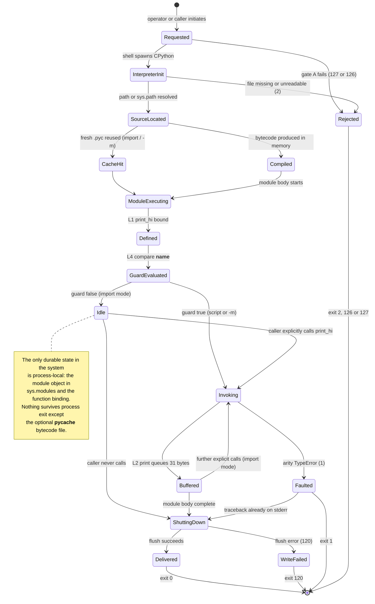
```mermaid
stateDiagram-v2
    direction TB
    [*] --> Requested : operator or caller initiates
    Requested --> InterpreterInit : shell spawns CPython
    Requested --> Rejected : gate A fails (127 or 126)
    InterpreterInit --> SourceLocated : path or sys.path resolved
    InterpreterInit --> Rejected : file missing or unreadable (2)
    SourceLocated --> Compiled : bytecode produced in memory
    SourceLocated --> CacheHit : fresh .pyc reused (import / -m)
    CacheHit --> ModuleExecuting
    Compiled --> ModuleExecuting : module body starts
    ModuleExecuting --> Defined : L1 print_hi bound
    Defined --> GuardEvaluated : L4 compare __name__
    GuardEvaluated --> Idle : guard false (import mode)
    GuardEvaluated --> Invoking : guard true (script or -m)
    Idle --> Invoking : caller explicitly calls print_hi
    Idle --> ShuttingDown : caller never calls
    Invoking --> Buffered : L2 print queues 31 bytes
    Invoking --> Faulted : arity TypeError (1)
    Buffered --> Invoking : further explicit calls (import mode)
    Buffered --> ShuttingDown : module body complete
    Faulted --> ShuttingDown : traceback already on stderr
    ShuttingDown --> Delivered : flush succeeds
    ShuttingDown --> WriteFailed : flush error (120)
    Delivered --> [*] : exit 0
    WriteFailed --> [*] : exit 120
    Faulted --> [*] : exit 1
    Rejected --> [*] : exit 2, 126 or 127

    note right of Idle
        The only durable state in the system
        is process-local: the module object in
        sys.modules and the function binding.
        Nothing survives process exit except
        the optional __pycache__ bytecode file.
    end note
```

| Transition | Trigger | Owner | Persistence effect |
|---|---|---|---|
| `Requested → InterpreterInit` | Shell `fork`/`exec` | OS | None |
| `SourceLocated → Compiled` | No fresh bytecode available | CPython compiler | Writes `.pyc` in `-m`/import modes only |
| `SourceLocated → CacheHit` | Fresh `.pyc` present | Import machinery | None — cache is read, not rewritten |
| `Defined → GuardEvaluated` | Module body reaches L4 | Repository code | None |
| `GuardEvaluated → Invoking` | `__name__ == '__main__'` (BR-2) | Repository code | None |
| `Invoking → Buffered` | `print` executes at L2 | Standard library | 31 bytes held in the stream buffer, not yet delivered |
| `ShuttingDown → Delivered` | Interpreter flushes and closes streams | CPython finalization | Bytes reach the consumer here for pipes and files |

#### 4.3.1.3 Data Persistence Points

There are exactly two persistence points in the entire system, and repository code initiates neither of them.

| Point | Medium | Written by | Lifetime | Verified detail |
|---|---|---|---|---|
| Standard-output stream | Terminal, pipe, or redirected file | The `print` call at L2, flushed by the runtime | As long as the consumer retains it; nothing is retained in-process | 31 bytes per invocation; the trailing newline is supplied by `print`, and captured output ends with it |
| `__pycache__/submod.cpython-312.pyc` | Filesystem, beside the source | Import machinery | Until deleted or invalidated by a source change | 365 bytes; written in WF-2 and WF-3 **only** — plain script execution writes nothing; `python3 -B` suppresses it entirely |

No database, key-value store, object store, log file, temp file, or state file is written. The module performs no file I/O of its own: there is no `open(` call anywhere in the repository. Because no `.gitignore` exists, the `__pycache__` directory created by import-mode use appears as an untracked change in the working tree, as section 3.6.6 notes.

#### 4.3.1.4 Caching Requirements

The system requires no cache, and implements none. Two caches nonetheless participate in its workflows, both supplied by the runtime, and their observed behavior is worth recording because they determine whether compilation and a disk write occur on a given invocation.

| Cache | Scope | Population | Invalidation (verified) | Effect on behavior |
|---|---|---|---|---|
| `sys.modules` module cache | Process-local, in-memory | First `import submod` in the process | Process exit | A second import returns the same object (`first is again` was `True`), so the module body — and therefore the guard — executes exactly once per process |
| `__pycache__` bytecode cache | Filesystem, cross-process | First import or `-m` invocation | Source `mtime` change: after `touch submod.py` the next import rewrote the `.pyc` with a new mtime; without a change, a second import left the mtime untouched | Removes compilation from the load path; never changes output |

Neither cache holds application data, so no cache-coherency, eviction, TTL, or warm-up concern applies. Output correctness is independent of both: the emitted literal is compiled into the module's constant pool, so a stale cache could only serve stale *code*, which is why the mtime-based invalidation above matters more than any capacity concern.

#### 4.3.1.5 Transaction Boundaries

There are no transactions. No database, message broker, or transactional resource participates in any workflow, so there is nothing to commit or roll back, and the source contains no `try`/`except` with which to implement compensation. The unit of work is instead the **process**: one invocation performs one write and then exits.

Three properties of that unit of work were verified, and together they define the system's consistency guarantees:

- **No acknowledgement.** The workflow never confirms delivery. `print` returns `None` before the bytes leave the buffer, and no code inspects the stream's state afterwards — so a successful return does not imply a successful write.
- **Failure is not atomic with the caller's view.** Because a pipe or file write is flushed at interpreter shutdown, a delivery failure surfaces *after* application code has completed and is reported as an ignored exception with exit status `120`. There is no point at which the module could roll the write back.
- **Concurrent invocations do not corrupt each other.** Forty concurrent script invocations redirected into a single sink produced exactly 40 lines, one distinct value, and zero malformed lines. This holds because the 31-byte payload is far below this host's `PIPE_BUF` of 4096 bytes, making the underlying write atomic at the OS level — a property of the host stream, not of module logic, and therefore not something the code guarantees.

### 4.3.2 Error Handling

#### 4.3.2.1 Failure Mode Register

No error handling exists in the repository: there is no `try`, `except`, `raise`, or `assert` node in `submod.py`, no logging call, and no signal or `atexit` handler (after import, `signal.getsignal(SIGINT)` is still the default handler, confirming the module registers nothing). Every failure below is therefore detected and reported by the runtime or the shell, and every one is terminal.

| ID | Failure mode | Trigger observed | Report channel | Exit status | Recoverable in-process? |
|---|---|---|---|---|---|
| E-1 | Interpreter not invocable | Requested executable absent from `PATH` | Shell message | `127` | No — repository code never runs |
| E-2 | Source file not executable | `./submod.py` attempted; mode `100644`, no shebang | Shell message | `126` | No |
| E-3 | Source unreadable or absent | Missing path, or mode `000` for an unprivileged user | Interpreter message: `can't open file ... [Errno 2]` / `[Errno 13]` | `2` | No |
| E-4 | Module not on the import path | `python3 -m submod` from an unrelated directory | `No module named submod` | `1` | No, unless the caller handles `ModuleNotFoundError` |
| E-5 | Arity violation | `print_hi()` or `print_hi('a','b')` | Full `TypeError` traceback on stderr | `1` | Only by the *caller* — the module has no handler |
| E-6 | Delivery failure at flush | Pipe reader closed (`BrokenPipeError`); sink full (`OSError: [Errno 28]`) | `Exception ignored in: <_io.TextIOWrapper name='<stdout>' ...>` on stderr | `120` | **No — structurally uncatchable**, the failure occurs during interpreter shutdown, after all application code |
| E-7 | Silent output loss | File descriptor 1 closed before startup, so `sys.stdout` is `None` and `print` no-ops | **None** | `0` | No — and the failure is indistinguishable from success by exit status |

E-6 and E-7 are the two failure modes that deserve architectural attention. E-6 shows that adding a handler around the `print` call would *not* catch a broken-pipe or full-disk failure, because the write is buffered and the fault materializes after the last line of application code has run. E-7 is worse: the workflow reports success while producing nothing, so a consumer that trusts the exit status alone cannot detect the loss.

#### 4.3.2.2 Retry Mechanisms

None exist. There is no retry loop, backoff schedule, attempt counter, circuit breaker, dead-letter path, or idempotency key anywhere in the repository, and no configuration surface through which one could be enabled. A failed invocation is simply a failed invocation.

The workflow is nonetheless **safe to retry**, and the reason is structural rather than designed: because no state is mutated (4.3.1.1) and no external resource is updated, re-invoking after a failure cannot corrupt anything. The one caveat is that retrying is not output-idempotent — N successful invocations produce N identical lines, so a consumer that counts lines must account for retries itself.

#### 4.3.2.3 Fallback Processes

None exist. There is no secondary output sink, no spool file, no in-memory queue, and no degraded mode: stdout is the sole destination (F-001-RQ-002), and it is not parameterized, so the code cannot be redirected to an alternative at runtime. If the sink is unavailable, the datum is lost — either loudly (E-6, exit `120`) or silently (E-7, exit `0`).

#### 4.3.2.4 Error Notification Flows

Exactly two notification channels exist, and both are host-provided:

| Channel | Content | Consumer | Limitation |
|---|---|---|---|
| Standard error | Interpreter messages, full Python tracebacks (E-5), or `Exception ignored in ...` lines (E-6) | Whatever the operator or parent process attached to fd 2 | Unstructured free text with no severity, timestamp, or event ID; tracebacks include absolute file paths, which section 2.4.4 flags as an information-disclosure consideration in shared-output contexts |
| Process exit status | `0`, `1`, `2`, `120`, `126`, `127` | Launching shell or supervising process | Coarse and partly ambiguous — `1` covers both an arity `TypeError` and a `ModuleNotFoundError`, and `0` covers both success and the silent loss of E-7 |

There is no third channel: no log file, no syslog or journal integration, no metric, no trace span, no email or webhook alert, and no health endpoint. Consequently **no notification reaches anyone who is not watching the invoking process**, and no failure is recorded anywhere after the process exits.

#### 4.3.2.5 Recovery Procedures

Recovery is entirely external — performed by the operator for WF-1 and WF-2, or by the calling program for WF-3 — and is driven by the exit status, since that is the only machine-readable signal available.

| Observed signal | Diagnosis | Recovery action |
|---|---|---|
| `127` / `126` | Interpreter unavailable, or self-execution attempted | Install or explicitly name a CPython 3 interpreter; invoke as `python3 submod.py` rather than `./submod.py` |
| `2` | Path wrong, or read permission missing | Correct the path or grant read access to `submod.py` |
| `1` with `ModuleNotFoundError` | Module not importable from the current location | Run from the repository root or place `submod.py` on `sys.path` |
| `1` with `TypeError` | Call site violates the arity contract | Pass exactly one argument of any type (F-002-RQ-002) |
| `120` | Sink rejected the flush | Keep the reader open, free space on the target, then re-invoke |
| `0` with no observed output | Silent loss (E-7) | Assert on captured output rather than on exit status; verify fd 1 is open before invoking |

For a calling program in WF-3, the only recovery affordance the module offers is that it is safe to call again: it raises nothing of its own, mutates nothing, and holds no partially-updated state, so a caller-supplied `try`/`except` around `print_hi` is sufficient to contain E-5 — while E-6 and E-7 remain outside any handler's reach.

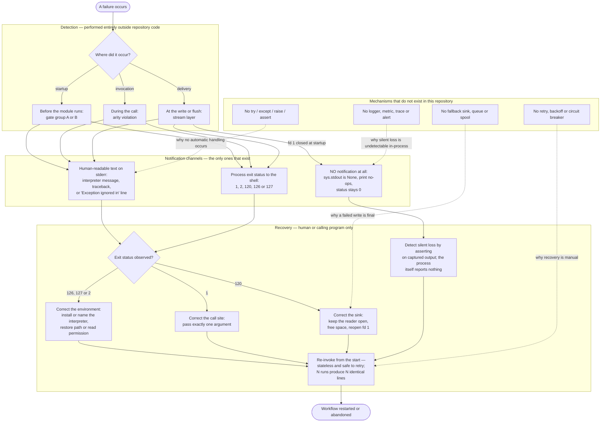
```mermaid
flowchart TD
    Fault(["A failure occurs"])

    subgraph Detect["Detection — performed entirely outside repository code"]
        Where{"Where did it occur?"}
        PreRun["Before the module runs:<br/>gate group A or B"]
        InCall["During the call:<br/>arity violation"]
        AtWrite["At the write or flush:<br/>stream layer"]
    end

    subgraph Notify["Notification channels — the only ones that exist"]
        Stderr["Human-readable text on stderr:<br/>interpreter message, traceback,<br/>or 'Exception ignored in' line"]
        ExitCode["Process exit status to the shell:<br/>1, 2, 120, 126 or 127"]
        Silent["NO notification at all:<br/>sys.stdout is None, print no-ops,<br/>status stays 0"]
    end

    subgraph Absent["Mechanisms that do not exist in this repository"]
        NoCatch["No try / except / raise / assert"]
        NoRetry["No retry, backoff or circuit breaker"]
        NoFallback["No fallback sink, queue or spool"]
        NoLog["No logger, metric, trace or alert"]
    end

    subgraph Recover["Recovery — human or calling program only"]
        OpTriage{"Exit status observed?"}
        FixEnv["Correct the environment:<br/>install or name the interpreter,<br/>restore path or read permission"]
        FixCall["Correct the call site:<br/>pass exactly one argument"]
        FixSink["Correct the sink:<br/>keep the reader open,<br/>free space, reopen fd 1"]
        Reinvoke["Re-invoke from the start —<br/>stateless and safe to retry;<br/>N runs produce N identical lines"]
        Manual["Detect silent loss by asserting<br/>on captured output; the process<br/>itself reports nothing"]
    end

    Done(["Workflow restarted or abandoned"])

    Fault --> Where
    Where -->|"startup"| PreRun
    Where -->|"invocation"| InCall
    Where -->|"delivery"| AtWrite
    PreRun --> Stderr
    InCall --> Stderr
    AtWrite --> Stderr
    PreRun --> ExitCode
    InCall --> ExitCode
    AtWrite --> ExitCode
    AtWrite -->|"fd 1 closed at startup"| Silent
    Stderr --> OpTriage
    ExitCode --> OpTriage
    Silent --> Manual
    OpTriage -->|"126, 127 or 2"| FixEnv
    OpTriage -->|"1"| FixCall
    OpTriage -->|"120"| FixSink
    FixEnv --> Reinvoke
    FixCall --> Reinvoke
    FixSink --> Reinvoke
    Manual --> Reinvoke
    Reinvoke --> Done
    NoCatch -.->|"why no automatic handling occurs"| Stderr
    NoRetry -.->|"why recovery is manual"| Reinvoke
    NoFallback -.->|"why a failed write is final"| FixSink
    NoLog -.->|"why silent loss is undetectable in-process"| Silent
```


## 4.4 Required Diagrams

This section consolidates the diagram set for the system. Each diagram was rendered and validated before inclusion. Where a required diagram class has already been drawn in the sections above, the index below points to its canonical instance rather than repeating it; the four diagrams in 4.4.2–4.4.5 are new and complete the set.

### 4.4.1 Diagram Index

| Required diagram class | Canonical instance | Perspective |
|---|---|---|
| High-level system workflow | **4.4.2** (layered composite); see also 4.1.1.1 (workflow-mode map) | Layers and boundaries, all four workflows in one view |
| Detailed process flow per core feature | **4.4.3** (F-001, F-002, F-003); F-004 has no runtime flow | Feature-scoped control flow with source-line anchors |
| Detailed process flow per workflow | 4.1.1.2 (WF-1, five swim lanes) | Actor swim lanes across the end-to-end journey |
| Error-handling flowchart | 4.3.2.5 (detection, notification, absent mechanisms, recovery) | Failure triage and recovery routing |
| Validation and authorization gate chain | 4.2.4 (gate groups A–D) | Ordered checkpoints with observed exit statuses |
| Integration sequence diagram | **4.4.4** (script mode, with failure alternatives); 4.1.2.5 (import mode, with cache alternatives) | Message-level interaction across process boundaries |
| State transition diagram | 4.3.1.2 (process lifecycle); **4.4.5** (bytecode-cache lifecycle) | Runtime state machines |
| Feature dependency map | Section 2.3.1 | Feature-identifier relationships |
| Delivery pipeline | Section 3.6.5 | Authorship-to-execution path, including absent stages |

### 4.4.2 High-Level System Workflow

The composite view below places every actor, boundary, and sink in one diagram. It shows that all three runtime workflows converge on the same four lines of application code, and that the application layer is the thinnest layer in the system — the host and runtime layers perform every activity other than the guard evaluation and the single `print`.

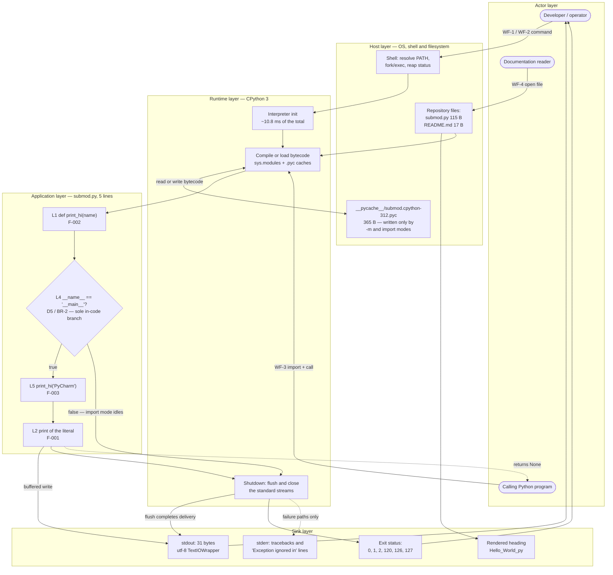
```mermaid
flowchart TB
    subgraph Human["Actor layer"]
        Op(["Developer / operator"])
        CallerApp(["Calling Python program"])
        Reader(["Documentation reader"])
    end

    subgraph Host["Host layer — OS, shell and filesystem"]
        ShellProc["Shell: resolve PATH,<br/>fork/exec, reap status"]
        Files["Repository files:<br/>submod.py 115 B<br/>README.md 17 B"]
        Cache["__pycache__/submod.cpython-312.pyc<br/>365 B — written only by<br/>-m and import modes"]
    end

    subgraph Runtime["Runtime layer — CPython 3"]
        Startup["Interpreter init<br/>~10.8 ms of the total"]
        Loader["Compile or load bytecode<br/>sys.modules + .pyc caches"]
        Finalize["Shutdown: flush and close<br/>the standard streams"]
    end

    subgraph AppLayer["Application layer — submod.py, 5 lines"]
        L1["L1 def print_hi(name)<br/>F-002"]
        L4{"L4 __name__ == '__main__'?<br/>D5 / BR-2 — sole in-code branch"}
        L5["L5 print_hi('PyCharm')<br/>F-003"]
        L2["L2 print of the literal<br/>F-001"]
    end

    subgraph Sinks["Sink layer"]
        StdOut["stdout: 31 bytes<br/>utf-8 TextIOWrapper"]
        StdErr["stderr: tracebacks and<br/>'Exception ignored in' lines"]
        StatusOut["Exit status:<br/>0, 1, 2, 120, 126, 127"]
        Rendered["Rendered heading<br/>Hello_World_py"]
    end

    Op -->|"WF-1 / WF-2 command"| ShellProc
    CallerApp -->|"WF-3 import + call"| Loader
    Reader -->|"WF-4 open file"| Files
    Files --> Rendered
    ShellProc --> Startup
    Startup --> Loader
    Files --> Loader
    Loader <-->|"read or write bytecode"| Cache
    Loader --> L1
    L1 --> L4
    L4 -->|"true"| L5
    L4 -->|"false — import mode idles"| Finalize
    L5 --> L2
    L2 -->|"buffered write"| StdOut
    L2 --> Finalize
    Finalize -->|"flush completes delivery"| StdOut
    Finalize --> StatusOut
    Finalize -.->|"failure paths only"| StdErr
    StatusOut --> Op
    StdOut --> Op
    L2 -.->|"returns None"| CallerApp
```

### 4.4.3 Detailed Process Flows for Each Core Feature

The three code features occupy adjacent lines of one file, so their flows are best read together: F-003 decides whether to invoke, F-002 accepts the call and discards its argument, and F-001 performs the write. Dotted edges show the containment and invocation relationships catalogued in section 2.3.1. F-004 (`README.md`) is omitted deliberately — it has no runtime flow, participating in no build, test, or publication process.

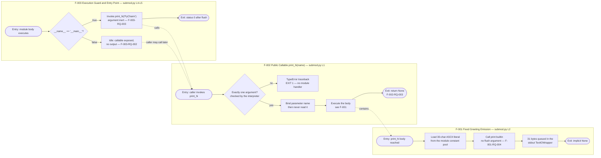
```mermaid
flowchart LR
    subgraph FeatF001["F-001 Fixed Greeting Emission — submod.py L2"]
        F1Start(["Entry: print_hi body reached"])
        F1Const["Load 30-char ASCII literal<br/>from the module constant pool"]
        F1Call["Call print builtin<br/>no flush argument — F-001-RQ-004"]
        F1Buf["31 bytes queued in the<br/>stdout TextIOWrapper"]
        F1End(["Exit: implicit None"])
    end

    subgraph FeatF002["F-002 Public Callable print_hi(name) — submod.py L1"]
        F2Start(["Entry: caller invokes print_hi"])
        F2Arity{"Exactly one argument?<br/>checked by the interpreter"}
        F2Err["TypeError traceback<br/>EXIT 1 — no module handler"]
        F2Bind["Bind parameter name<br/>then never read it"]
        F2Body["Execute the body<br/>see F-001"]
        F2End(["Exit: return None<br/>F-002-RQ-003"])
    end

    subgraph FeatF003["F-003 Execution Guard and Entry Point — submod.py L4-L5"]
        F3Start(["Entry: module body executes"])
        F3Guard{"__name__ == '__main__'?"}
        F3Idle["Idle: callable exposed,<br/>no output — F-003-RQ-002"]
        F3Invoke["Invoke print_hi('PyCharm')<br/>argument inert — F-003-RQ-003"]
        F3End(["Exit: status 0 after flush"])
    end

    F1Start --> F1Const --> F1Call --> F1Buf --> F1End
    F2Start --> F2Arity
    F2Arity -->|"no"| F2Err
    F2Arity -->|"yes"| F2Bind --> F2Body --> F2End
    F3Start --> F3Guard
    F3Guard -->|"false"| F3Idle
    F3Guard -->|"true"| F3Invoke --> F3End
    F3Invoke -.->|"calls"| F2Start
    F2Body -.->|"contains"| F1Start
    F3Idle -.->|"caller may call later"| F2Start
```

### 4.4.4 Integration Sequence Diagram — Script Mode

This sequence completes the integration pair begun in section 4.1.2.5 (import mode). It shows the message-level interaction across the four process boundaries of WF-1, with the verified failure alternatives inline, and makes the missing acknowledgement path explicit: delivery is confirmed to nobody, because the flush happens after the module body has already returned.

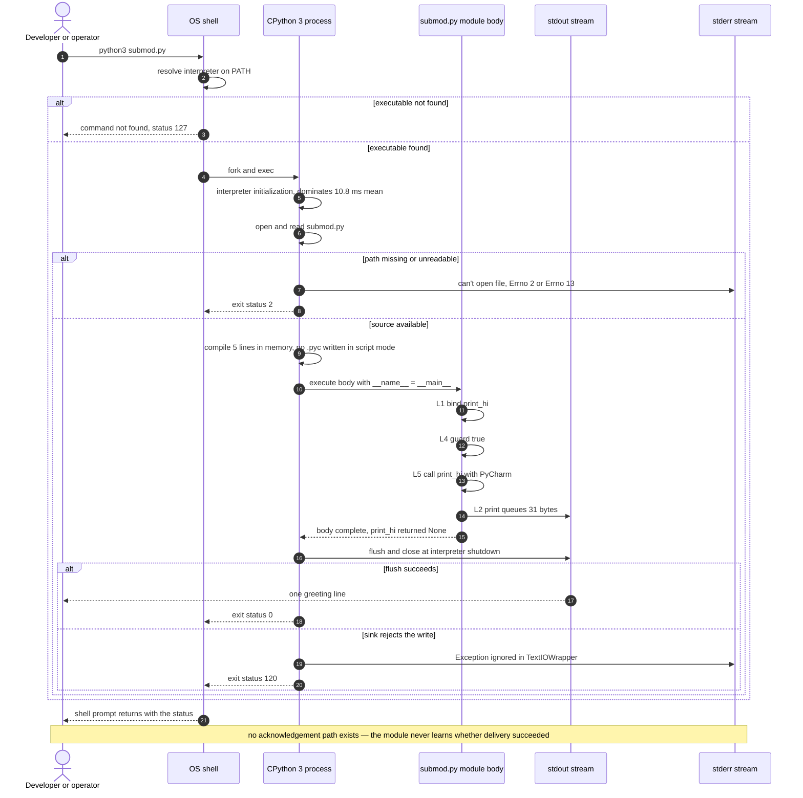
```mermaid
sequenceDiagram
    autonumber
    actor Op as Developer or operator
    participant Sh as OS shell
    participant Py as CPython 3 process
    participant Mod as submod.py module body
    participant Out as stdout stream
    participant Err as stderr stream

    Op->>Sh: python3 submod.py
    Sh->>Sh: resolve interpreter on PATH
    alt executable not found
        Sh-->>Op: command not found, status 127
    else executable found
        Sh->>Py: fork and exec
        Py->>Py: interpreter initialization, dominates 10.8 ms mean
        Py->>Py: open and read submod.py
        alt path missing or unreadable
            Py->>Err: can't open file, Errno 2 or Errno 13
            Py-->>Sh: exit status 2
        else source available
            Py->>Py: compile 5 lines in memory, no .pyc written in script mode
            Py->>Mod: execute body with __name__ = __main__
            Mod->>Mod: L1 bind print_hi
            Mod->>Mod: L4 guard true
            Mod->>Mod: L5 call print_hi with PyCharm
            Mod->>Out: L2 print queues 31 bytes
            Mod-->>Py: body complete, print_hi returned None
            Py->>Out: flush and close at interpreter shutdown
            alt flush succeeds
                Out-->>Op: one greeting line
                Py-->>Sh: exit status 0
            else sink rejects the write
                Py->>Err: Exception ignored in TextIOWrapper
                Py-->>Sh: exit status 120
            end
        end
    end
    Sh-->>Op: shell prompt returns with the status
    Note over Op,Err: no acknowledgement path exists — the module never learns whether delivery succeeded
```

### 4.4.5 State Transition Diagram — Bytecode Cache Lifecycle

The process-lifecycle machine appears in section 4.3.1.2. The second state machine in the system governs the only artifact that outlives a process: the `__pycache__` bytecode file. Its transitions were verified directly, and it is included because it is the sole cross-invocation state in an otherwise entirely stateless system.

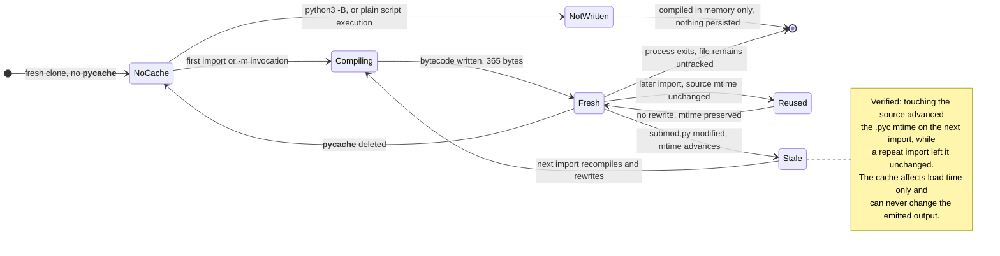
```mermaid
stateDiagram-v2
    direction LR
    [*] --> NoCache : fresh clone, no __pycache__
    NoCache --> Compiling : first import or -m invocation
    Compiling --> Fresh : bytecode written, 365 bytes
    NoCache --> NotWritten : python3 -B, or plain script execution
    NotWritten --> [*] : compiled in memory only, nothing persisted
    Fresh --> Reused : later import, source mtime unchanged
    Reused --> Fresh : no rewrite, mtime preserved
    Fresh --> Stale : submod.py modified, mtime advances
    Stale --> Compiling : next import recompiles and rewrites
    Fresh --> NoCache : __pycache__ deleted
    Fresh --> [*] : process exits, file remains untracked
    note right of Stale
        Verified: touching the source advanced
        the .pyc mtime on the next import, while
        a repeat import left it unchanged.
        The cache affects load time only and
        can never change the emitted output.
    end note
```

### 4.4.6 Diagram Scope Statement

No further diagrams are warranted, and the reason is a property of the subject rather than of this document. The system has one branch, one output statement, one public callable, no external integration, no persistent application state, and no error-handling logic; the diagrams above therefore already cover every path an execution can take. Section 2.3.5 reaches the same conclusion from the feature perspective — one execution path per consumption mode, with no branching beyond the `__main__` guard. Diagram classes that a larger specification would require here — deployment topology, entity-relationship models, data-flow diagrams across services, message-choreography charts, Gantt or capacity plans — have no subject matter in this repository, which contains no infrastructure definition, no schema, no second service, and no schedule.


## 4.5 References

### 4.5.1 Repository Files and Folders Examined

- `submod.py` — the entire codebase for every workflow in this section. Established the four process steps (L1 function definition, L2 `print` of the string literal, L4 `__main__` guard, L5 guarded call), the single decision point D5, the required-but-unused `name` parameter, and the absence of any `try`, `except`, `raise`, `assert`, `import`, logging, or retry construct.
- `README.md` — established WF-4: a single level-1 heading, `# Hello_World_py`, 17 characters, with no runtime participation.
- Repository root (`/`) — established that the repository is completely flat apart from `.git`, and that no manifest, configuration, CI, test, container, or entry-point artifact exists (28 candidate paths probed by name, all absent). This is the basis for every "no such workflow exists" determination in 4.1.2.
- `.git/` metadata — established the commit history (two commits, `HEAD` at `38cfbd5`) and, via `git ls-files -s`, the committed file mode `100644` for both files, which underpins the exit-`126` self-execution finding in 4.2.3.3.
- `__pycache__/submod.cpython-312.pyc` — the runtime-generated bytecode artifact (365 bytes) observed in an isolated working copy. Established the persistence point in 4.3.1.3, the cache behavior in 4.3.1.4, and the state machine in 4.4.5. Not a committed file.

### 4.5.2 Technical Specification Sections Cross-Referenced

- `2.1 Feature Catalog` — feature identifiers F-001 to F-004 and their source-line anchors, used to label workflow steps and per-feature flows.
- `2.2 Functional Requirements` — requirement identifiers F-001-RQ-001 through F-004-RQ-002, used for traceability in the WF-1 step table, the element matrix, and the validation-rule tables.
- `2.3 Feature Relationships` — the containment/invocation relationships, the two integration boundaries, and the section 2.3.5 determination that no additional process flow exists; corroborated independently here.
- `2.4 Implementation Considerations` — the five cross-cutting constraints and the position that failures surface as uncaught interpreter tracebacks, extended in 4.3.2 with the specific exit statuses and the two uncatchable delivery failure modes.
- `3.6 Development & Deployment` — the two consumption modes and the absence of build, CI, and container machinery, used in 4.1.1.3 and 4.1.2.4. Section 4.1.1.3 refines its `__pycache__` statement: plain script execution writes no cache, whereas `-m` and import modes do.

### 4.5.3 Verification Basis

All behavioral, timing, and exit-status claims in this section were produced by executing an isolated copy of the committed `submod.py` on CPython 3.12.3; the repository checkout was left unmodified. The evidence-producing observations were:

| Evidence | Method | Result cited in |
|---|---|---|
| Absence of workflow constructs | Repository-wide scan of both files for 30+ patterns (`try`, `except`, `logging`, `retry`, `http`, `sql`, `cron`, `async`, `import`, `open(`, `argparse`, and others) | 4.1, 4.2.3.2, 4.3.2.1 |
| Three invocation paths and their outputs | `python3 submod.py`, `python3 -m submod`, `import submod` / `from submod import print_hi` | 4.1.1.2–4.1.1.4 |
| Input invariance and return value | `print_hi` called with `None`, `0`, `123`, a string, a list, a dict, and a class instance | 4.2.3.1 (BR-1), 4.2.3.2 |
| Introspection of the API surface | `inspect.signature`, `dir()`, `__doc__`, `__all__`, `__cached__` | 4.1.2.2 |
| Exit-status matrix | Missing interpreter (`127`), non-executable source (`126`), missing/unreadable source (`2`), arity `TypeError` (`1`), broken pipe and full sink (`120`), closed fd 1 (`0` with silent loss) | 4.1.1.6, 4.2.4, 4.3.2.1 |
| Deferred-delivery behavior | Writing into a pipe with the read end closed, observing that `print` returned normally and the failure surfaced only at interpreter shutdown; `sys.stdout.line_buffering` inspected as `False` when piped | 4.1.2.3, 4.2.2, 4.3.1.5 |
| Bytecode cache behavior | `.pyc` mtime after repeat import, after `touch` of the source, and under `python3 -B`; `python3 -m py_compile` exit status | 4.3.1.4, 4.4.5 |
| Module cache behavior | Double import in one process compared by identity | 4.3.1.4 |
| Permission and path gates | Unreadable source read as an unprivileged user, `./submod.py` without an execute bit, `-m` from a directory off the import path | 4.2.3.3 |
| Timing baseline | Ten sequential script invocations (min 10.5 ms, max 11.2 ms, mean 10.8 ms) and 100,000 in-process calls (mean 0.24 µs) | 4.2.2 |
| Concurrency behavior | Forty concurrent invocations redirected into one sink; payload size compared against the host `PIPE_BUF` of 4096 bytes | 4.3.1.5 |
| Handler registration | `signal.getsignal(SIGINT)` after import; module public-attribute list | 4.3.1.1, 4.3.2.1 |

No external or web sources were consulted for this section; every claim derives from the repository and from the executions listed above.


# 5. System Architecture

## 5.1 High-Level Architecture

This section documents the architecture of the system as committed, not an architecture the repository aspires to. The entire codebase is two files and 132 bytes: `submod.py` (115 bytes, five lines) and `README.md` (17 bytes, one heading). `git ls-files` returns exactly those two paths, the repository contains no sub-directories apart from `.git`, and semantic searches for module, service, or infrastructure folders returned empty result sets. Consequently, several concerns that a System Architecture section normally decomposes — service topology, data tier, cache tier, identity provider, message transport — have **no counterpart in this repository**, and each is reported as absent with the check that established it rather than filled with plausible content.

### 5.1.1 System Overview

#### 5.1.1.1 Architecture Style and Rationale

The system is a **single-process, single-module, zero-dependency Python script implemented as a dual-mode module**. There is no tier, no layer, and no process boundary to cross: one operating-system process loads one source file, evaluates one conditional, performs one write to standard output, and terminates.

The style is established by four properties of `submod.py`, each verified directly against the source:

| Property | Evidence in the repository |
|---|---|
| Monolithic, single translation unit | `submod.py` is the only source file; there is no package directory, no `__init__.py`, and no second module to depend on |
| Zero-dependency | An AST walk of `submod.py` yields no `Import` or `ImportFrom` node; the only external symbol referenced is the `print` builtin |
| Stateless and side-effect-only | No `Assign` node at module level and no `Return` in the function body — nothing is stored, nothing is handed back (`print_hi` returns `None`) |
| Dual-mode entry | The single `If` node at line 4 compares `__name__` to `'__main__'`, separating definition from execution |

The rationale is not recorded anywhere in the repository — there is no architecture decision record, design note, or explanatory comment, and `README.md` contains only the heading `# Hello_World_py`. What can be stated factually is the *fit* between the style and the delivered capability: the system's whole purpose, as catalogued in feature F-001, is to emit one fixed line to standard output. A script requires no framework, no build step, and no dependency resolution to do that, and the repository correspondingly contains none. The architecture is therefore proportionate to the capability rather than the result of a documented tradeoff, and section 5.3 reconstructs the tradeoffs implicit in the committed form.

#### 5.1.1.2 Architectural Principles and Patterns Observed

Exactly one named design pattern is present in the source, and three architectural properties emerge from what is deliberately absent.

- **Module-as-script guard (the only structural pattern).** `if __name__ == '__main__':` on line 4, followed by `print_hi('PyCharm')` on line 5, is the sole control structure in the codebase. It makes one file serve two roles — an executable script and an importable library — without packaging metadata or a console-script entry point. Verified both ways: running the file emits the greeting and exits `0`; importing it emits nothing and leaves `submod.__name__` as `'submod'`.
- **Command–query separation, degenerate form.** `print_hi` is purely a command: it produces a side effect on the output stream and returns `None`. No query interface exists, so the greeting text cannot be obtained programmatically — only observed on the stream.
- **Statelessness by construction.** The module's public attribute list is exactly `['print_hi']`. There is no module-level variable, counter, cache, singleton, or configuration object, so no instance of the system can diverge from another and no warm-up or first-call behavior exists.
- **Determinism and input independence.** The printed text is a constant compiled into the module's constant pool. The declared parameter `name` is never read, so output is invariant across arguments — the same line for `'PyCharm'`, `None`, an integer, a list, or a custom object.

#### 5.1.1.3 System Boundaries and Major Interfaces

The system boundary is the **CPython process**. Nothing crosses it inbound: the module reads no command-line arguments, no environment variables, no standard input, no configuration file, and no network resource — an AST walk finds no `sys` reference, no `open(` call, and no `input(` call. Exactly one thing crosses it outbound during normal operation: 31 bytes on file descriptor 1.

Four interfaces exist in total. Two are consumer-facing, two are host-facing.

| Interface | Direction | Contract |
|---|---|---|
| Shell invocation (`python3 submod.py`, `python3 -m submod`) | Inbound control, no data | Interpreter must be resolvable; module must be readable or importable; terminates with a process exit status |
| Python import + call (`import submod`; `print_hi(value)`) | Inbound control, no data consumed | Exactly one positional-or-keyword argument of any type, discarded; returns `None` |
| Standard-output stream (fd 1) | Outbound data | UTF-8 text through a `TextIOWrapper`; 31 bytes per call (30-character ASCII literal plus the newline `print` supplies) |
| Standard-error stream (fd 2) and process exit status | Outbound diagnostics | Populated only by the runtime or shell — interpreter messages, tracebacks, and statuses `0`, `1`, `2`, `120`, `126`, `127` |

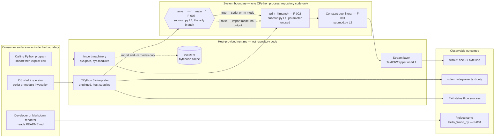
```mermaid
flowchart LR
    subgraph Consumers["Consumer surface — outside the boundary"]
        Shell["OS shell / operator<br/>script or module invocation"]
        Prog["Calling Python program<br/>import then explicit call"]
        Reader["Developer or Markdown renderer<br/>reads README.md"]
    end

    subgraph Host["Host-provided runtime — not repository code"]
        Interp["CPython 3 interpreter<br/>unpinned, host-supplied"]
        ImportM["Import machinery<br/>sys.path, sys.modules"]
        StreamL["Stream layer<br/>TextIOWrapper on fd 1"]
        Cache[("__pycache__<br/>bytecode cache")]
    end

    subgraph Repo["System boundary — one CPython process, repository code only"]
        Fn["print_hi(name) — F-002<br/>submod.py L1, parameter unused"]
        Lit["Constant pool literal — F-001<br/>submod.py L2"]
        Guard{{"__name__ == '__main__' — F-003<br/>submod.py L4, the only branch"}}
    end

    subgraph Sinks["Observable outcomes"]
        Out["stdout: one 31-byte line"]
        Err["stderr: interpreter text only"]
        Status["Exit status 0 on success"]
        Doc["Project name Hello_World_py — F-004"]
    end

    Shell --> Interp
    Prog --> ImportM
    Reader --> Doc
    Interp --> Guard
    ImportM --> Fn
    ImportM -.->|"import and -m modes only"| Cache
    Guard -->|"true — script or -m mode"| Fn
    Guard -.->|"false — import mode, no output"| Fn
    Fn --> Lit
    Lit --> StreamL
    StreamL --> Out
    Interp --> Err
    Interp --> Status
```

### 5.1.2 Core Components

The component inventory is the file inventory: two components, zero directories, and no inter-component dependency between them — `README.md` names the project and has no code relationship to `submod.py`. Within `submod.py`, three architecturally distinct elements are separable and are documented as sub-components in section 5.2, because they carry different responsibilities and different failure characteristics.

| Component | Primary responsibility | Key dependencies |
|---|---|---|
| `submod.py` — module container | Host the callable and the entry point; be a valid, compilable translation unit | CPython 3 interpreter; read access to the file |
| `print_hi(name)` — callable (F-002) | Emit the fixed greeting as a side effect; return `None` | `print` builtin; a writable stdout stream |
| Constant greeting literal (F-001) | Be the system's entire output contract: `Hello Blitzy User, From Wulf 2` | Module constant pool (compiled in, not configurable) |
| `__main__` guard (F-003) | Decide whether the module executes or merely defines; supply `'PyCharm'` to satisfy arity | Module `__name__` set by the runtime |
| `README.md` (F-004) | Declare the project identity `Hello_World_py` | None — no build or docs pipeline consumes it |

| Component | Integration points | Critical considerations |
|---|---|---|
| `submod.py` — module container | Shell (script mode); `sys.path` resolution (module and import modes) | Must remain syntactically valid Python; no automated gate enforces this, since no CI or test suite exists |
| `print_hi(name)` — callable (F-002) | In-process Python calling convention; stdout stream layer | Arity is enforced by the interpreter, not by the module — zero or two arguments raise `TypeError` with exit status `1` |
| Constant greeting literal (F-001) | None — it is compiled into the module | Changing the literal changes the system's only contract; the output is not parameterized, so no runtime override exists |
| `__main__` guard (F-003) | Runtime assignment of `__name__`; `runpy` for `-m` invocation | Removing it would make every import emit output; it is the sole safeguard of import-mode silence |
| `README.md` (F-004) | Markdown renderers only | Documents nothing about behavior — it does not mention `print_hi` or the greeting text, so the code is the only specification |

### 5.1.3 Data Flow Description

#### 5.1.3.1 Primary Data Flow

There is exactly one data flow, it is unidirectional, and it originates *inside* the compiled module rather than from any external source. The 30-character literal is read from the module's constant pool, passed by reference to the `print` builtin, encoded by the text layer, buffered, and finally written to file descriptor 1 as 31 bytes. No inbound flow exists at all — the only value entering the system, the `name` argument, is discarded without being read, type-checked, coerced, or forwarded.

| Hop | From → To | Mechanism |
|---|---|---|
| 1 | Module constant pool (`submod.py` L2) → `print` builtin | In-process argument passing |
| 2 | `print` builtin → `sys.stdout` text layer | `TextIOWrapper`, UTF-8; newline appended by `print` |
| 3 | stdout buffer → OS file descriptor 1 | Buffer flush — at interpreter shutdown for pipes and files |
| 4 | fd 1 → terminal, pipe, or redirected file | OS stream delivery |
| 5 | Process → launching shell | Exit status (`0` on success) |

The architecturally significant hop is the third. Because line 2 passes no `flush` argument and `line_buffering` is `False` when stdout is a pipe, the bytes are queued rather than delivered when `print` returns. Delivery — and therefore the point of failure — occurs during interpreter finalization, **after** every line of repository code has already run. `print` returns `None` before the bytes leave the buffer, so a successful return does not imply a successful write, and no code in the repository inspects the stream afterwards.

#### 5.1.3.2 Integration Patterns and Protocols

The system implements no integration pattern in the distributed-systems sense: there is no request/response, publish/subscribe, polling, batching, or streaming protocol, because there is no remote party. Repository-wide keyword scans for `http`, `url`, `socket`, `request`, `sql`, `database`, and `api_key` returned no matches, and no dependency manifest exists through which a client library could be introduced. Three host-level protocols are all that participate:

- **Process contract** — the shell spawns the interpreter and reaps an exit status; this is the only machine-readable result channel.
- **In-process calling convention** — the interface to `print_hi` is a plain Python function call; there is no serialization, no schema, and no versioning.
- **POSIX byte-stream write** — the output protocol is unstructured text on fd 1, not a framed or self-describing format.

#### 5.1.3.3 Data Transformation Points

Only two transformations occur, and repository code performs neither:

1. **Newline appendage** — the `print` builtin adds the terminator, turning the 30-character literal into a 31-byte record. This is why the payload size differs from the literal length.
2. **Text-to-byte encoding** — the `TextIOWrapper` encodes the string as UTF-8. The literal is pure ASCII (`str.isascii()` is `True`), so no encoding-dependent failure mode applies to this payload.

There is no parsing, validation, mapping, enrichment, filtering, aggregation, or formatting step anywhere in the flow. Notably, the one place a transformation might be expected — interpolating `name` into the greeting — does not occur: the parameter is inert.

#### 5.1.3.4 Data Stores and Caches

The system requires no data store and implements no cache. Exactly two persistence points exist in any workflow, and repository code initiates neither.

| Store | Medium and lifetime | Architectural role |
|---|---|---|
| Standard-output stream | Terminal, pipe, or redirected file; retained only by the consumer | The system's sole delivery target; nothing is retained in-process |
| `__pycache__/submod.cpython-312.pyc` | Filesystem beside the source; 365 bytes, until deleted or invalidated by source `mtime` | Written by the import machinery in module (`-m`) and import modes **only** — plain script execution writes nothing, and `python3 -B` suppresses it entirely |

Two runtime caches participate without holding application data: the process-local `sys.modules` cache, which guarantees the module body — and therefore the guard — executes exactly once per process, and the filesystem bytecode cache above, which removes compilation from the load path. Neither can affect output correctness, because the greeting is compiled into the constant pool; a stale cache could only serve stale *code*, which is why `mtime`-based invalidation matters here while eviction, TTL, and coherency concerns do not apply at all. No database, key-value store, object store, log file, temp file, or state file is written: there is no `open(` call anywhere in the repository.

### 5.1.4 External Integration Points

**No external system integration exists.** This is not inferred from missing configuration — it follows from the source declaring zero imports, so there is no client, driver, SDK, or transport available to reach anything outside the process. The categories below are the interfaces that *do* exist, all of them facilities of the host rather than external systems, plus the explicit record that each conventional integration class is absent.

| Interface | Integration type | Data exchange pattern |
|---|---|---|
| CPython 3 interpreter | Runtime dependency (host-provided, unpinned) | Loads and executes the source; no data exchanged with the module |
| OS shell / process launcher | Process lifecycle | Fire-and-forget invocation; single exit status returned |
| Standard-output stream (fd 1) | Byte-stream sink | One-way, unidirectional write of 31 bytes per call |
| Standard-error stream (fd 2) | Diagnostic sink | One-way; written by the runtime only, never by repository code |
| Filesystem `__pycache__` | Runtime-managed artifact | Write-through bytecode cache; `-m` and import modes only |
| GitHub `origin` remote | Source distribution | `clone`/`fetch` over HTTPS; not a runtime path |

| Interface | Protocol / format | Declared SLA in repository |
|---|---|---|
| CPython 3 interpreter | Python 3 language and bytecode; verified on 3.12.3 | None — no `requires-python`, no `.python-version`, no CI matrix |
| OS shell / process launcher | POSIX `fork`/`exec`, `wait` status codes | None |
| Standard-output stream (fd 1) | Unstructured UTF-8 text, newline-terminated | None |
| Standard-error stream (fd 2) | Unstructured free text; tracebacks include absolute paths | None |
| Filesystem `__pycache__` | CPython 3.12 `.pyc` bytecode | None |
| GitHub `origin` remote | Git over HTTPS | None — no artifact is published, so no checksum or signature verification step exists |

**On SLA requirements:** the repository declares no service-level agreement, availability target, latency budget, throughput figure, or error-rate threshold for any of these interfaces, and none is asserted here. Every artifact class in which such commitments are normally encoded was checked and found absent: no test suite, no CI/CD configuration, no monitoring or metrics instrumentation, and no benchmark or performance-budget definition. The only quantitative statements available are measured characteristics rather than commitments, and they are recorded in section 5.4.5.

Conventional integration classes, each explicitly verified as absent: inbound HTTP/RPC/GraphQL endpoints and message consumers; outbound third-party API calls, webhooks, and service clients; relational, document, cache, and object stores; identity providers, secret managers, queues, and schedulers; and observability backends for logs, metrics, traces, or error reporting. None exists, and none was ever attempted — no file, comment, or commit message references one.


## 5.2 Component Details

The system has five architectural elements across two files. Each is documented below against the same template — purpose, technologies, interfaces, persistence, scaling — even where the honest answer for a given dimension is "none, and here is the check that establishes it." Element names and feature identifiers match the catalog in section 2.1.

### 5.2.1 `submod.py` — Module Container

**Purpose and responsibilities.** `submod.py` is the system's only translation unit. Its responsibility is to be a valid, compilable Python module that binds one callable into its namespace and hosts one entry point. It owns no orchestration logic: the file contains a single function definition, a single `print` call, and a single `if` statement, in that order.

**Technologies and frameworks.** Plain CPython 3 with no framework of any kind. The module uses only language builtins; an AST walk finds no `Import` or `ImportFrom` node, so there is nothing to resolve, pin, vendor, or patch. The source uses no version-gated syntax — no f-strings, no walrus operator, no annotations, no `__future__` import — so it is not bound to a specific 3.x release; execution was verified on CPython 3.12.3. Formatting is LF-only with four-space indentation, and the file ends without a trailing newline after `print_hi('PyCharm')`.

**Key interfaces.** Two inbound invocation surfaces and no outbound interface beyond the output stream:

| Surface | Contract | Verified outcome |
|---|---|---|
| Direct script execution | `python3 submod.py` — path must be readable | Greeting on stdout, stderr empty, exit `0` |
| Import-path resolution | `import submod` or `python3 -m submod` — module must be on `sys.path` | Import emits nothing; `-m` behaves as script mode |

**Data persistence requirements.** None of its own. The module performs no file I/O — there is no `open(` call anywhere in the repository. The only file it causes to be written is the runtime-managed bytecode cache `__pycache__/submod.cpython-312.pyc` (365 bytes), and only in `-m` and import modes; plain script execution writes nothing, and `python3 -B` suppresses the write entirely. Because no `.gitignore` exists, that cache surfaces as an untracked working-tree change.

**Scaling considerations.** The unit of scale is the process. Each invocation is fully independent — no shared state, no lock, no coordination point — so invocations scale horizontally without limit up to host process capacity. The cost is fixed and dominated by interpreter startup: measured at 10.4–11.4 ms per invocation (mean 10.8 ms over 10 runs), of which application logic accounts for a fraction of a microsecond. Concurrency safety of the shared-sink case is a property of the host, not of the code: the 31-byte payload sits well below the host's 4096-byte `PIPE_BUF`, which is why 40 concurrent invocations redirected into one sink produced exactly 40 intact lines.

### 5.2.2 `print_hi(name)` — Public Callable Interface (F-002)

**Purpose and responsibilities.** This is the system's entire programmatic API and its only reusable unit. Its responsibility is to trigger the greeting side effect. It performs no validation, no branching, no state mutation, and no error handling.

**Technologies and frameworks.** A bare Python function using the `print` builtin. No decorator, no class, no docstring, no annotation, and no `__all__` declaration accompanies it.

**Key interfaces and API contract.**

| Contract element | Verified behavior |
|---|---|
| Callable surface | Exactly one public attribute after import: `['print_hi']` |
| Signature | `(name)` — one `POSITIONAL_OR_KEYWORD` parameter, no default, no annotation |
| Input handling | The argument is accepted but never read, type-checked, coerced, or forwarded (F-001-RQ-003) |
| Return value | `None` on every call — no `Return` node exists in the body (F-002-RQ-003) |
| Error responses | Arity violations only, raised by the interpreter: missing argument, or more than one positional argument |
| Idempotency | Stateless; N calls produce N identical lines and retain nothing |

The architecturally consequential property is that the signature invites an expectation the body does not fulfill: a required parameter that is discarded. Callers cannot personalize, suppress, redirect, or programmatically consume the greeting through this interface — the only way to observe the result is to read the output stream.

**Data persistence requirements.** None. The function declares no local variable, holds no reference after returning, and writes nothing but the transient stream buffer.

**Scaling considerations.** In-process invocation costs 0.24 µs per call, measured over 100,000 iterations with output captured. That is roughly four orders of magnitude cheaper per greeting than paying process startup, which makes the choice between the two consumption modes the only meaningful performance decision the system offers. At in-process rates the bottleneck is the output stream, not the function.

### 5.2.3 `__main__` Guard and Script Entry Point (F-003)

**Purpose and responsibilities.** The guard on line 4 is the system's only decision point in repository code. It decides whether loading the module also executes it, and it supplies the literal `'PyCharm'` on line 5 purely to satisfy the required parameter. It is therefore both the entry point and the sole safeguard of import-mode silence.

**Technologies and frameworks.** The standard CPython module-as-script idiom — one `If` node with one `Compare`/`Eq` against the runtime-assigned `__name__`. No CLI framework, argument parser, console-script entry point, or launcher is involved: neither file references `sys.argv`, `argparse`, `os.environ`, or `input(`.

**Key interfaces.** The guard consumes a single runtime-supplied input, the module `__name__`, and produces a single control decision:

- `'__main__'` — set for direct script execution and for `-m` module execution: the greeting is emitted and the process exits `0`.
- The module's own name (`'submod'`) — set on import: no call is made and no output is produced.

**Data persistence requirements.** None.

**Scaling considerations.** The guard is evaluated exactly once per process. The `sys.modules` cache guarantees that a repeated import within one process returns the same module object without re-executing the body, so the branch cannot fire twice per process regardless of how many times a consumer imports the module.

### 5.2.4 Constant Greeting Literal (F-001)

**Purpose and responsibilities.** The literal `Hello Blitzy User, From Wulf 2` on line 2 *is* the system's output contract. It carries the entire observable result and, because no other component transforms it, its exact bytes define correctness.

**Technologies and frameworks.** A compile-time string constant in the module's constant pool. It is not read from configuration, an environment variable, a resource file, a locale catalog, or a function argument — no such mechanism exists in the repository.

**Key interfaces.** It reaches the outside world through exactly one path: `print` appends a newline, the `TextIOWrapper` encodes it as UTF-8, and 31 bytes are queued on fd 1. Verified: `python3 submod.py | wc -c` reports 31, the literal is 30 characters, and `str.isascii()` is `True` — so no encoding-dependent failure mode applies to this payload.

**Data persistence requirements.** None in the system; retention is entirely the consumer's concern once the bytes are delivered.

**Scaling considerations.** Payload size is constant and independent of every input, so output volume scales linearly and exactly with invocation count — 31 bytes per greeting, with no variance to budget for.

### 5.2.5 `README.md` — Project Identification Document (F-004)

**Purpose and responsibilities.** `README.md` supplies the project's only self-declared identity, the heading `# Hello_World_py`. It is 17 bytes and contains nothing else.

**Technologies and frameworks.** Plain Markdown with no front matter, badges, links, or code fences.

**Key interfaces.** Human or renderer reading only. It participates in no build, packaging, linting, or publication step, because no such process exists in the repository, and it has no runtime effect of any kind.

**Data persistence requirements.** None.

**Scaling considerations.** Not applicable — the document has no runtime path. Its architectural relevance is a gap rather than a capability: it documents neither `print_hi` nor the greeting text, so `submod.py` is the only specification of system behavior that exists.

### 5.2.6 Component Interaction and Behavior Diagrams

#### 5.2.6.1 Component Interaction Diagram

The diagram traces which element invokes which, and which host facility each depends on. Only two call edges exist in repository code — the guard calling the function, and the function calling `print`.

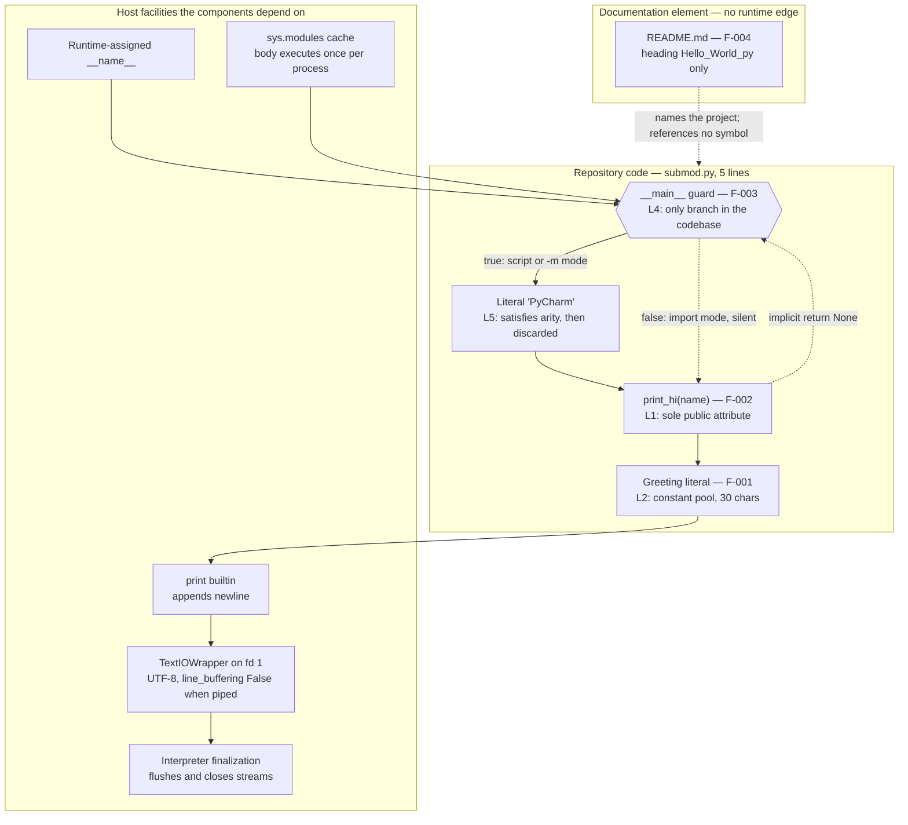
```mermaid
flowchart TD
    subgraph RepoCode["Repository code — submod.py, 5 lines"]
        GuardN{{"__main__ guard — F-003<br/>L4: only branch in the codebase"}}
        FnN["print_hi(name) — F-002<br/>L1: sole public attribute"]
        LitN["Greeting literal — F-001<br/>L2: constant pool, 30 chars"]
        ArgN["Literal 'PyCharm'<br/>L5: satisfies arity, then discarded"]
    end

    subgraph HostFac["Host facilities the components depend on"]
        NameVar["Runtime-assigned __name__"]
        PrintB["print builtin<br/>appends newline"]
        Wrapper["TextIOWrapper on fd 1<br/>UTF-8, line_buffering False when piped"]
        SysMods["sys.modules cache<br/>body executes once per process"]
        Finalize["Interpreter finalization<br/>flushes and closes streams"]
    end

    subgraph Docs["Documentation element — no runtime edge"]
        ReadmeN["README.md — F-004<br/>heading Hello_World_py only"]
    end

    NameVar --> GuardN
    SysMods --> GuardN
    GuardN -->|"true: script or -m mode"| ArgN
    ArgN --> FnN
    GuardN -.->|"false: import mode, silent"| FnN
    FnN --> LitN
    LitN --> PrintB
    PrintB --> Wrapper
    Wrapper --> Finalize
    FnN -.->|"implicit return None"| GuardN
    ReadmeN -.->|"names the project; references no symbol"| RepoCode
```

#### 5.2.6.2 Module Component State Transitions

This diagram models the lifecycle of the module *component* inside one process — how the module object moves from unloaded to finalized. It is deliberately component-scoped; the workflow-scoped state machine that terminates in process exit statuses is documented in section 4.3.1.2.

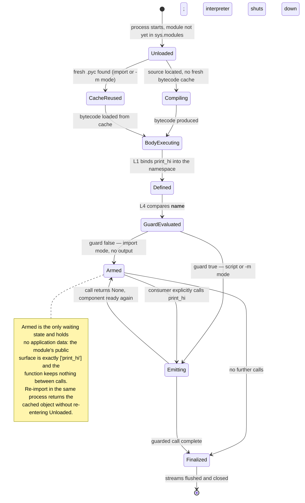
```mermaid
stateDiagram-v2
    direction TB
    [*] --> Unloaded : process starts, module not yet in sys.modules
    Unloaded --> Compiling : source located, no fresh bytecode cache
    Unloaded --> CacheReused : fresh .pyc found (import or -m mode)
    Compiling --> BodyExecuting : bytecode produced
    CacheReused --> BodyExecuting : bytecode loaded from cache
    BodyExecuting --> Defined : L1 binds print_hi into the namespace
    Defined --> GuardEvaluated : L4 compares __name__
    GuardEvaluated --> Armed : guard false — import mode, no output
    GuardEvaluated --> Emitting : guard true — script or -m mode
    Armed --> Emitting : consumer explicitly calls print_hi
    Emitting --> Armed : call returns None, component ready again
    Armed --> Finalized : no further calls; interpreter shuts down
    Emitting --> Finalized : guarded call complete
    Finalized --> [*] : streams flushed and closed

    note right of Armed
        Armed is the only waiting state and holds
        no application data: the module's public
        surface is exactly ['print_hi'] and the
        function keeps nothing between calls.
        Re-import in the same process returns the
        cached object without re-entering Unloaded.
    end note
```

#### 5.2.6.3 Sequence Diagram — Script-Mode Invocation

The primary flow, showing why delivery is not confirmed by the return of `print`.

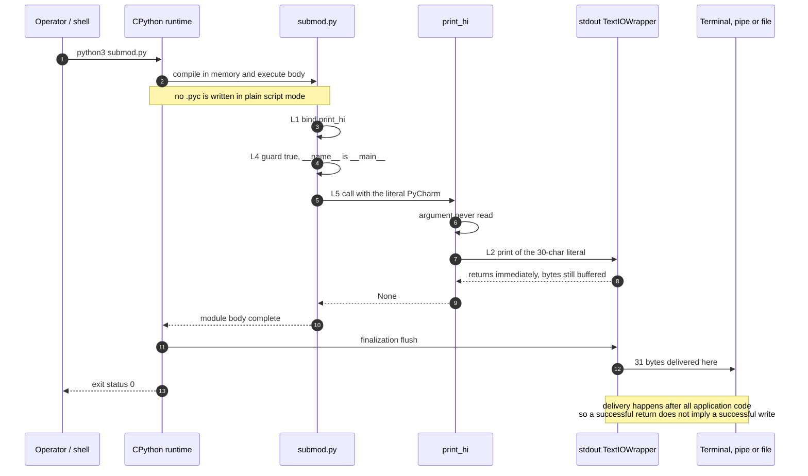
```mermaid
sequenceDiagram
    autonumber
    participant Op as Operator / shell
    participant Py as CPython runtime
    participant Mod as submod.py
    participant Fn as print_hi
    participant Buf as stdout TextIOWrapper
    participant Sink as Terminal, pipe or file

    Op->>Py: python3 submod.py
    Py->>Mod: compile in memory and execute body
    Note over Py,Mod: no .pyc is written in plain script mode
    Mod->>Mod: L1 bind print_hi
    Mod->>Mod: L4 guard true, __name__ is __main__
    Mod->>Fn: L5 call with the literal PyCharm
    Fn->>Fn: argument never read
    Fn->>Buf: L2 print of the 30-char literal
    Buf-->>Fn: returns immediately, bytes still buffered
    Fn-->>Mod: None
    Mod-->>Py: module body complete
    Py->>Buf: finalization flush
    Buf->>Sink: 31 bytes delivered here
    Py-->>Op: exit status 0
    Note over Buf,Sink: delivery happens after all application code<br/>so a successful return does not imply a successful write
```

#### 5.2.6.4 Sequence Diagram — Library-Mode Consumption

The two-stage flow that the guard exists to enable: load without effect, then invoke deliberately.

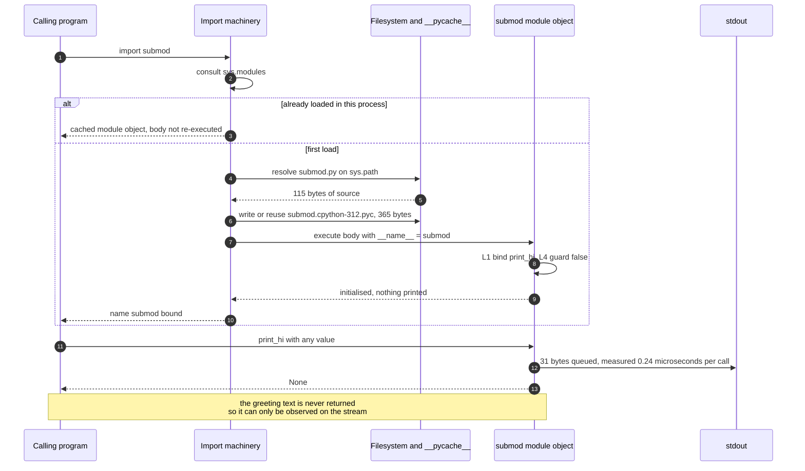
```mermaid
sequenceDiagram
    autonumber
    participant App as Calling program
    participant Imp as Import machinery
    participant FS as Filesystem and __pycache__
    participant Mod as submod module object
    participant Out as stdout

    App->>Imp: import submod
    Imp->>Imp: consult sys.modules
    alt already loaded in this process
        Imp-->>App: cached module object, body not re-executed
    else first load
        Imp->>FS: resolve submod.py on sys.path
        FS-->>Imp: 115 bytes of source
        Imp->>FS: write or reuse submod.cpython-312.pyc, 365 bytes
        Imp->>Mod: execute body with __name__ = submod
        Mod->>Mod: L1 bind print_hi, L4 guard false
        Mod-->>Imp: initialised, nothing printed
        Imp-->>App: name submod bound
    end
    App->>Mod: print_hi with any value
    Mod->>Out: 31 bytes queued, measured 0.24 microseconds per call
    Mod-->>App: None
    Note over App,Mod: the greeting text is never returned<br/>so it can only be observed on the stream
```


## 5.3 Technical Decisions

**An important qualification governs this entire subsection.** The repository contains no architecture decision record, design document, roadmap, or explanatory comment, and a scan of both files for the markers `todo`, `fixme`, `hack`, `xxx`, `deprecated`, and `placeholder` returned zero matches. No decision rationale is documented anywhere. What follows is therefore a reconstruction of the decisions **as they are embodied in the committed code** — each one stated with the artifact that evidences it and the consequences that are observable. Where a rationale cannot be evidenced, it is labelled as inferred rather than asserted.

### 5.3.1 Architecture Style Decisions and Tradeoffs

The committed form embodies one style decision — a single-file, dual-mode script — and, by omission, rejects four alternatives. The table records what each alternative would have required and what its absence costs today.

| Style option | Evidence of the position taken | Consequence observed |
|---|---|---|
| **Single-file dual-mode script (chosen)** | `submod.py` is the only source file; the `__main__` guard makes it both runnable and importable | Zero setup: runs as committed on a stock interpreter, no install step, no configuration |
| Installable package or distribution | No `pyproject.toml`, `setup.py`, `setup.cfg`, or `Makefile` exists | The module cannot be version-pinned or installed; consumption depends on the file being on the import path |
| CLI application with argument parsing | No reference to `sys.argv`, `argparse`, or `os.environ` in either file | Behavior cannot be varied at invocation time — no flags, no personalization, no output redirection |
| Long-running service or daemon | No server code, process manager, service definition, scheduler, or health check | Nothing to deploy or monitor; each invocation is a complete lifecycle |
| Multi-module or layered decomposition | No sub-directories, no `__init__.py`, no second module | No layering to maintain, and no seam at which to substitute behavior |

The decisive tradeoff is **simplicity against extensibility**, and the code lands firmly on simplicity. The gains are concrete and verified: no dependency graph to resolve or patch, no build to break, no environment-specific configuration to get wrong, and a failure surface limited to the interpreter being present and the file being readable. The costs are equally concrete: the output literal, the output sink, and the argument handling are all fixed at compile time, so every one of the unsupported use cases catalogued in section 1.3.2.4 — personalization, programmatic consumption, redirection, localization, suppression — requires editing the source rather than configuring the system.

One tradeoff is worth isolating because it is a genuine design achievement of the five lines rather than a limitation: the guard buys import safety at zero cost. Without it, importing the module would emit output as a side effect; with it, `import submod` is verifiably silent while `python3 submod.py` still works. That is the single highest-leverage structural choice in the codebase.

### 5.3.2 Communication Pattern Choices

Two communication mechanisms are used, and both are the simplest available option in their category. Neither involves a remote party: keyword scans across both files for `http`, `url`, `socket`, `request`, `sql`, `redis`, `kafka`, and `celery` returned no matches, and with zero imports there is no transport library present to change that.

| Pattern in use | Where it appears | Why the alternative is absent |
|---|---|---|
| Synchronous in-process function call | The guard calling `print_hi`; any consumer calling it after import | No IPC, RPC, socket, or message-broker client exists; there is no second process to talk to |
| One-way unstructured byte stream (fd 1) | The `print` call on line 2 | No structured format (JSON, protobuf) and no return channel — the function returns `None`, so the text is unavailable programmatically |
| Process exit status | Reaped by the launching shell | The only machine-readable result signal; no callback, webhook, or completion event exists |

Two properties of the chosen output pattern have architectural weight:

- **Fire-and-forget with no acknowledgement.** Line 2 passes no `flush` argument, so for a pipe or file the bytes are buffered and delivered during interpreter finalization. `print` returns before delivery, and nothing in the code inspects the stream afterwards — the system never learns whether its one output arrived.
- **No back-pressure or flow control.** The pattern offers no mechanism to slow, batch, or retry; a consumer that cannot keep up produces a broken-pipe condition that surfaces only at flush.

Asynchronous and concurrent patterns are absent by construction: the AST contains no `AsyncFunctionDef`, and neither file references `threading`, `subprocess`, `await`, callbacks, signal handlers, or an event loop.

### 5.3.3 Data Storage Solution Rationale

**No storage solution was selected, because the system has no data to store.** This is a defensible position rather than an omission, and the evidence supports it directly: the only datum the system handles is a compile-time constant, no input is consumed (`name` is discarded), and no value is returned. There is nothing whose lifetime exceeds the call.

| Storage question | Determination and evidence |
|---|---|
| Database, key-value, document, or object store | None — no driver, schema, model, migration, or connection string in either file |
| File-based persistence | None — no `open(` call anywhere in the repository |
| Configuration or state files | None — the module reads no file, environment variable, or argument |
| Log files | None — no logging call and no log destination |
| Recovery source for lost output | Recomputation — the output is a deterministic constant, so re-invoking reproduces it exactly |

The rationale that the code supports is that **statelessness makes storage unnecessary**: because the result is a constant function of no inputs, durability is achieved by re-running rather than by writing anything down. The one filesystem write in any workflow — the bytecode cache — is performed by the runtime for load-time efficiency, holds no application data, and is safely disposable.

### 5.3.4 Caching Strategy Justification

**No caching strategy was implemented, and none is warranted.** A cache trades memory or disk for the cost of recomputation; here recomputation is reading a constant from the module's constant pool, so there is nothing to amortize. Two runtime caches nonetheless participate in the workflows, and the distinction between them and an application cache matters:

| Cache | Owner and scope | Justification for leaving it as-is |
|---|---|---|
| `sys.modules` module cache | CPython, process-local | Guarantees the module body and guard execute once per process; a second import returns the same object. Not configurable and not something the code should override |
| `__pycache__` bytecode cache | CPython, filesystem, cross-process | Removes compilation from the load path in `-m` and import modes; invalidated automatically by source `mtime`. Suppressible with `python3 -B` when a clean working tree matters more than load time |
| Application data cache | Does not exist | Output is a constant, so a cache could only ever return the value already compiled in |

Because neither cache holds application data, no eviction policy, TTL, capacity budget, warm-up procedure, or coherency protocol applies. The only cache risk that exists at all is staleness of *code* rather than of data — a `.pyc` older than the source — and CPython's `mtime` check handles it, verified by observing the cache rewrite after touching the source and remain untouched without a change.

### 5.3.5 Security Mechanism Selection

**No security mechanism was selected, and the code presents almost no surface to protect.** Scans of both files for `token`, `secret`, `password`, `api_key`, and `auth` returned no matches; there is no authentication, authorization, role model, user record, input validation, or cryptographic operation anywhere in the repository.

The security posture follows from the architecture rather than from controls, and the reasoning is worth stating precisely:

| Mechanism | Status | Why |
|---|---|---|
| Authentication / authorization | Absent — and no surface requires it | There is no network listener, no multi-user context, and no protected resource; the only actor is whoever already has local filesystem access to run the file |
| Input validation / sanitization | Absent — and inputs cannot reach the payload | The single argument is never read, interpolated, evaluated, or forwarded, so no injection path exists through it |
| Secrets management | Absent — nothing to manage | No credential, key, or endpoint appears in tracked content; no `.env` or `.env.example` exists |
| Transport security | Not applicable at runtime | No network I/O; the only network path is `git clone`/`fetch` over HTTPS, which is a distribution concern, not a runtime one |
| Supply-chain controls | Absent — and the dependency set is empty | Zero imports means no third-party code is executed, which eliminates the dominant risk class for Python projects outright |

The exposures that remain are **governance and information-disclosure exposures, not code exposures**, and all three are consequences of absent tooling documented in section 3.6:

- **Unverified commits land directly on `main`.** Both commits are GitHub web-flow signed but cannot be validated locally, and no CI gate or review enforcement is observable in the repository.
- **No `.gitignore` exists.** Nothing stands between an accidentally created credential-bearing file — or the `__pycache__` artifact — and a future commit.
- **Tracebacks disclose absolute paths.** Because no handler exists, an arity violation prints a full traceback to stderr; in a shared-output context that leaks filesystem layout.
- **The interpreter is unpinned.** With no `requires-python`, `.python-version`, container image, or CI matrix, the host interpreter is the only patchable component in the runtime and nothing in the repository constrains its version.

### 5.3.6 Consumption-Mode Decision Tree

The system offers exactly one decision to its consumers — which invocation mode to use — and the criteria are observable. The tree below encodes them, including the measured cost difference that dominates the choice for repeated use.

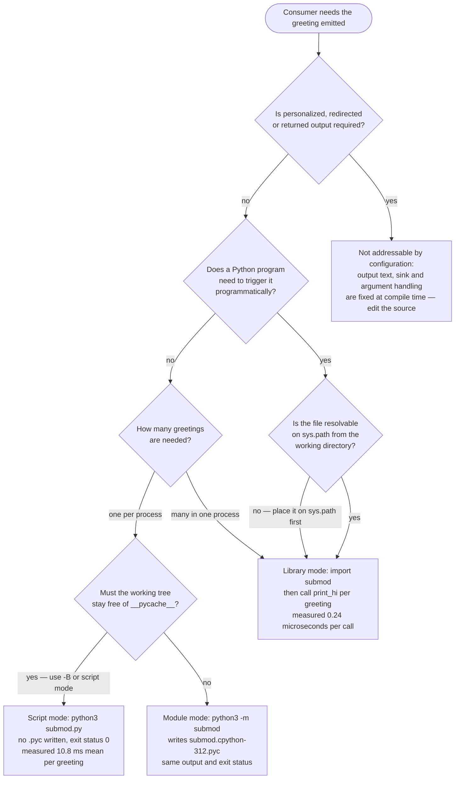
```mermaid
flowchart TD
    Start(["Consumer needs the greeting emitted"])
    Q1{"Does a Python program<br/>need to trigger it<br/>programmatically?"}
    Q2{"Is the file resolvable<br/>on sys.path from the<br/>working directory?"}
    Q3{"How many greetings<br/>are needed?"}
    Q4{"Must the working tree<br/>stay free of __pycache__?"}

    ScriptMode["Script mode: python3 submod.py<br/>no .pyc written, exit status 0<br/>measured 10.8 ms mean per greeting"]
    ModuleMode["Module mode: python3 -m submod<br/>writes submod.cpython-312.pyc<br/>same output and exit status"]
    LibMode["Library mode: import submod<br/>then call print_hi per greeting<br/>measured 0.24 microseconds per call"]
    NoOption["Not addressable by configuration:<br/>output text, sink and argument handling<br/>are fixed at compile time — edit the source"]
    Q5{"Is personalized, redirected<br/>or returned output required?"}

    Start --> Q5
    Q5 -->|"yes"| NoOption
    Q5 -->|"no"| Q1
    Q1 -->|"yes"| Q2
    Q1 -->|"no"| Q3
    Q2 -->|"yes"| LibMode
    Q2 -->|"no — place it on sys.path first"| LibMode
    Q3 -->|"one per process"| Q4
    Q3 -->|"many in one process"| LibMode
    Q4 -->|"yes — use -B or script mode"| ScriptMode
    Q4 -->|"no"| ModuleMode
```

### 5.3.7 Architecture Decision Records

The records below are **reconstructed from the implementation**, not transcribed from repository documents — no ADR file, design note, or commit message rationale exists. Each states the decision the code embodies, the evidence for it, and the consequences that were verified. Status is uniformly "In effect (inferred from implementation at `HEAD`)".

#### 5.3.7.1 ADR-001: Implement as a single dependency-free module

- **Context.** The system must emit one fixed line of text and be usable both directly and from other Python code.
- **Decision embodied.** One 115-byte source file with zero imports; the only external symbol used is the `print` builtin.
- **Evidence.** AST walk of `submod.py` contains no `Import`/`ImportFrom` node; no dependency manifest exists in the repository.
- **Consequences.** No installation, resolution, pinning, or vulnerability-scanning step is needed, and the supply-chain risk class is eliminated. Conversely, no library capability — logging, argument parsing, formatting — is available without a source change.

#### 5.3.7.2 ADR-002: Use the `__main__` guard to make one file serve both consumption modes

- **Context.** Direct execution and import must coexist without packaging metadata or a console-script entry point.
- **Decision embodied.** A single `if __name__ == '__main__':` branch, with the guarded call passing the literal `'PyCharm'` only to satisfy the required parameter.
- **Evidence.** `submod.py` lines 4–5; verified silent on import and emitting on execution.
- **Consequences.** Import safety is guaranteed with one line and no configuration. The guard is also a fragility point: deleting it would make every import produce output, and nothing in the repository — no test, no lint gate — would detect the regression.

#### 5.3.7.3 ADR-003: Hardcode the output text rather than parameterize it

- **Context.** The greeting content must be produced at each invocation.
- **Decision embodied.** The message is an inline string constant on line 2; the declared `name` parameter is never read.
- **Evidence.** Calls with `'PyCharm'`, `None`, an integer, a list, a dict, and a custom instance all produced byte-identical output.
- **Consequences.** Output is perfectly deterministic and trivially assertable, and no injection path exists through the argument. The cost is that the signature advertises configurability the implementation does not provide — the most likely source of consumer surprise in the system.

#### 5.3.7.4 ADR-004: Emit as a side effect on stdout rather than return the value

- **Context.** The result must reach a consumer.
- **Decision embodied.** `print` to standard output, with no `Return` statement in the function body.
- **Evidence.** `print_hi` returns `None` on every call; stdout is the only sink referenced anywhere in the repository.
- **Consequences.** The result is visible to a human or a shell pipeline with no formatting step, but is unavailable to a calling program except by capturing the stream. Combined with buffered delivery at finalization, it also means the system cannot confirm its own success — the basis of failure modes E-6 and E-7 in section 4.3.2.1.

#### 5.3.7.5 ADR-005: Keep the system stateless, with no persistence layer

- **Context.** Repeated invocations must behave identically.
- **Decision embodied.** No module-level assignment, no local variable, no file I/O, no store of any kind.
- **Evidence.** Public attribute list is exactly `['print_hi']`; no `Assign` node at module level; no `open(` call in the repository.
- **Consequences.** Invocations are independent and safe to retry, and horizontal scaling requires no coordination — 40 concurrent invocations into one sink produced 40 intact lines. Nothing survives process exit, so there is no audit trail and no record that an invocation occurred.

#### 5.3.7.6 ADR-006: Delegate all error handling to the runtime

- **Context.** Failures — missing arguments, unreadable source, unavailable sink — are possible.
- **Decision embodied.** No `try`, `except`, `raise`, or `assert` anywhere; no signal or `atexit` handler is registered.
- **Evidence.** AST contains no `Try` or `Raise` node; after import, `signal.getsignal(SIGINT)` is still the default handler.
- **Consequences.** The implementation stays minimal and failures are never masked — every fault is reported by the interpreter with a traceback and a non-zero status. But no failure is retried, logged, or notified anywhere, and two failure modes are unreachable by any handler the module could add: a flush failure occurs after all application code has run, and a closed fd 1 makes `print` a silent no-op that still exits `0`.


## 5.4 Cross-Cutting Concerns

Cross-cutting concerns are normally implemented as aspects that span components. This system has one component and implements none of them: `submod.py` contains no logging call, no instrumentation, no exception handler, no authentication logic, and no configuration hook. Every concern below is therefore satisfied — or left unsatisfied — by the CPython runtime, the operating system, and the operator. That division of responsibility is the defining cross-cutting property of the architecture, and each subsection states which side of it the concern falls on.

### 5.4.1 Monitoring and Observability Approach

There is no monitoring, and no observability backend is integrated. The system exposes exactly two signals, both consumed only by whoever is watching the invoking process.

| Signal | What it reveals | Blind spot it leaves |
|---|---|---|
| Standard-output content | That the greeting was produced, and its exact bytes | Nothing about timing, host, or invocation identity — the line carries no timestamp or context |
| Process exit status | Success (`0`) or which failure class occurred (`1`, `2`, `120`, `126`, `127`) | Ambiguous: `1` covers both an arity `TypeError` and a `ModuleNotFoundError`, and `0` covers both success and silent output loss |

The critical observability gap is structural rather than incidental. When file descriptor 1 is closed before startup, `sys.stdout` is `None`, `print` becomes a no-op, and the process still exits `0` — so the exit status reports success while nothing was produced. **A consumer that trusts the exit status alone cannot detect this loss**; the only reliable verification is asserting on captured output.

Artifact classes checked and found absent: metrics endpoints or exporters, tracing instrumentation, health or readiness checks, structured event emission, error-reporting integrations, and any dashboard or alert definition. There is likewise no CI job that could observe behavior over time, so no trend, regression, or availability data exists for this system anywhere.

The practical monitoring approach available to an operator, given only what exists, is therefore: capture stdout and compare it to the expected 31-byte line, and treat the exit status as a coarse secondary check rather than the primary one.

### 5.4.2 Logging and Tracing Strategy

**No logging framework is used.** The `logging` module is not imported — the module imports nothing at all — and no log file, syslog target, journal integration, or log-aggregation client appears anywhere in the repository. The single `print` call on line 2 is application output, not a log record: it has no severity, no timestamp, no logger name, no event ID, and no structure.

| Concern | Implementation in this system |
|---|---|
| Application logging | None. The only write is the greeting itself, on stdout |
| Diagnostic logging | Runtime-supplied only — interpreter messages and tracebacks on stderr |
| Log levels, formatting, rotation, retention | Not applicable; no logger exists to configure |
| Distributed tracing, correlation IDs, spans | Not applicable; there is one process, one call, and no request context to correlate |
| Audit trail | None. Nothing records that an invocation occurred; after process exit no evidence remains anywhere |

Two consequences follow that matter architecturally. First, **stdout is overloaded**: it carries the system's product, so any diagnostic added there would corrupt the output contract — which is precisely why a logging channel would need to target stderr or a file if one were ever introduced. Second, because the two output channels are the only ones that exist, **no signal reaches anyone who is not attached to the process**, and failures leave no trace after termination.

### 5.4.3 Error Handling Patterns

The pattern is **complete delegation to the runtime**. The AST of `submod.py` contains no `Try`, `Raise`, or `Assert` node; no signal handler or `atexit` hook is registered (after import, `signal.getsignal(SIGINT)` is still the default handler). Every failure is therefore detected and reported by the shell or the interpreter, and every failure is terminal — nothing is caught, retried, compensated, or degraded.

Failures group into three architectural bands by where they occur relative to repository code:

| Band | Failures in the band | Who can act on it |
|---|---|---|
| Before repository code runs | Interpreter not invocable (`127`), file not executable (`126`), source unreadable or absent (`2`), module not on the import path (`1`) | Operator — environment correction only |
| During the call | Arity violation raising `TypeError` (`1`) | The *calling program* — a caller-supplied `try`/`except` around `print_hi` contains this fully; the module offers no handler |
| At delivery | Flush failure such as broken pipe or a full sink (`120`); silent loss when fd 1 is closed at startup (`0`) | Nobody in-process — structurally uncatchable |

The third band is the architecturally significant finding: **adding a handler around the `print` call would not catch a delivery failure.** Because the write is buffered and no `flush` argument is passed, the fault materializes during interpreter finalization, after the last line of application code has executed. The silent-loss variant is worse still, since it produces no exception at all and leaves the exit status at `0`.

Retry, fallback, and compensation mechanisms are all absent — no retry loop, backoff schedule, attempt counter, circuit breaker, dead-letter path, secondary sink, or spool file exists, and there is no configuration surface through which one could be enabled. The workflow is nonetheless **safe to retry**, structurally rather than by design: no state is mutated and no external resource is updated, so re-invocation cannot corrupt anything. It is not output-idempotent, however — N successful invocations produce N identical lines, so a consumer counting lines must account for retries itself.

```mermaid
flowchart TD
    Invoke(["Invocation begins"])

    subgraph Gate["Band 1 — pre-execution gates, all outside repository code"]
        InterpQ{"Interpreter<br/>invocable?"}
        SourceQ{"Source readable<br/>or importable?"}
        Gate127["Shell message<br/>exit 127 or 126"]
        Gate2["Interpreter message<br/>exit 2, or ModuleNotFoundError exit 1"]
    end

    subgraph Call["Band 2 — call-time contract, enforced by the interpreter"]
        ArityQ{"Exactly one<br/>argument supplied?"}
        Arity1["TypeError traceback<br/>on stderr, exit 1"]
        Emit["print executes<br/>31 bytes queued"]
    end

    subgraph Deliver["Band 3 — delivery, after all application code has run"]
        FdQ{"Was fd 1 open<br/>at startup?"}
        SilentLoss["print no-ops<br/>NO output, NO error, exit 0"]
        FlushQ{"Finalization<br/>flush succeeds?"}
        Delivered["31 bytes delivered<br/>exit 0"]
        FlushFail["Exception ignored in TextIOWrapper<br/>on stderr, exit 120"]
    end

    subgraph Response["Recovery — operator or calling program only"]
        FixEnv["Correct the environment:<br/>name the interpreter, fix path<br/>or read permission"]
        FixCall["Correct the call site:<br/>pass exactly one argument<br/>of any type"]
        FixSink["Correct the sink:<br/>keep the reader open,<br/>free space, reopen fd 1"]
        AssertOut["Assert on captured output —<br/>the only way to detect silent loss"]
        Retry["Re-invoke: stateless and safe,<br/>but N runs yield N lines"]
    end

    Invoke --> InterpQ
    InterpQ -->|"no"| Gate127
    InterpQ -->|"yes"| SourceQ
    SourceQ -->|"no"| Gate2
    SourceQ -->|"yes"| ArityQ
    ArityQ -->|"no"| Arity1
    ArityQ -->|"yes"| Emit
    Emit --> FdQ
    FdQ -->|"no"| SilentLoss
    FdQ -->|"yes"| FlushQ
    FlushQ -->|"yes"| Delivered
    FlushQ -->|"no"| FlushFail
    Gate127 --> FixEnv
    Gate2 --> FixEnv
    Arity1 --> FixCall
    FlushFail --> FixSink
    SilentLoss --> AssertOut
    FixEnv --> Retry
    FixCall --> Retry
    FixSink --> Retry
    AssertOut --> Retry
```

### 5.4.4 Authentication and Authorization Framework

**No authentication or authorization framework exists, and the architecture presents no surface that would require one.** Scans of both files for `token`, `secret`, `password`, `api_key`, and `auth` returned no matches; there is no user model, role, permission check, session, or credential anywhere in the repository.

The reason is structural. Authorization mediates access to a protected resource across a trust boundary; this system has neither. It exposes no network listener, serves no request, holds no data, and mutates nothing. Access control reduces entirely to host-level controls that the operating system already enforces:

| Access path | Control that actually applies |
|---|---|
| Running the script | POSIX read permission on `submod.py`, plus the ability to execute an interpreter. The file is mode `100644` with no shebang, so `./submod.py` fails with exit `126` — it must be run through `python3` |
| Importing the module | Read access plus the file's presence on `sys.path` of the consuming process |
| Modifying behavior | Write access to the source file — the only way to change output, since nothing is configurable |
| Obtaining the source | GitHub repository permissions on the `origin` remote; no artifact is published, so there is no registry access to govern |

The only identity concern the repository evidences is at the **source-control layer, not the runtime**: both commits are GitHub web-flow signed and list `GitHub` as committer, and their signatures cannot be validated locally because the signing key is not present. No branch-protection or review-enforcement configuration is visible in repository contents, since those settings are server-side.

### 5.4.5 Performance Characteristics and SLAs

**The repository declares no service-level agreement, availability target, latency budget, throughput requirement, error-budget, or performance KPI, and none is invented here.** Every artifact class in which such commitments are normally encoded was checked and is absent: no test suite or `pytest.ini`/`tox.ini`, no CI/CD workflow with quality gates, no coverage or lint thresholds, no monitoring or metrics instrumentation, and no benchmark or performance-budget definition.

What can be reported are **measured characteristics of the committed code** — facts, not commitments. These were obtained by executing the module in the repository checkout on CPython 3.12.3:

| Characteristic | Measured value | Interpretation |
|---|---|---|
| Cost per greeting, process invocation | 10.4–11.4 ms, mean 10.8 ms over 10 runs | Effectively all of it is interpreter startup; application logic is a rounding error within it |
| Cost per greeting, in-process call | 0.24 µs over 100,000 iterations | Roughly four orders of magnitude cheaper than paying startup per greeting |
| Output volume | 31 bytes per greeting, invariant | Constant regardless of argument, host, or mode — no variance to budget |
| Codebase size | 132 bytes across two files | The entire failure surface is the interpreter being present and the file being readable |
| Concurrency safety at a shared sink | 40 concurrent invocations produced 40 intact lines | A host property (payload far below the 4096-byte `PIPE_BUF`), not a guarantee the code makes |

Two performance implications follow directly from the architecture. **Scaling is horizontal-by-invocation with no coordination cost**, because the system is stateless and each process is independent — but each process pays the full startup cost, so throughput per host is bounded by process spawning rather than by anything in the module. And **the consumption mode is the only performance lever available**: importing once and calling repeatedly is the sole way to avoid the startup tax, and it requires no change to the code.

### 5.4.6 Disaster Recovery and Continuity

No disaster-recovery procedure is documented in the repository — there is no runbook, backup configuration, replication setup, or continuity plan, and no recovery objective (RTO or RPO) is stated anywhere. What the architecture provides instead is **recoverability by construction**, and that claim is precise rather than rhetorical:

| Asset at risk | Recovery mechanism that exists | Gap |
|---|---|---|
| Source code | The GitHub `origin` remote holds the full history; `main` tracks `origin/main`, and both files have been unmodified since introduction | The remote is the only durable copy observable; there are no tags, so no release point can be referenced other than a commit SHA |
| Runtime environment | Any host with a Python 3 interpreter can run the file as committed — no install, build, or configuration step to reconstruct | The interpreter is unpinned: no `requires-python`, no `.python-version`, no container image constrains the version reproduced |
| Application state | None exists to lose — the system is stateless and its output is a deterministic constant | — |
| Produced output | Recomputation: re-invoking reproduces the identical 31 bytes | A lost invocation leaves no record that it ever occurred |
| Bytecode cache | Regenerated automatically on the next import, or safely deleted | — |

The continuity profile is consequently unusual and strong in one narrow respect: because there is no state, no data store, and no external dependency, **recovery is reduced to placing one file on a host that has an interpreter** — the same operation as initial deployment. There is nothing to restore in order, no data to replay, and no consistency window to reconcile. The corresponding weakness is equally clear: with no backup other than the single Git remote, no version tag, no pinned runtime, and no automated verification that a restored copy behaves correctly, correctness after recovery is confirmed only by running the file and reading the line it prints.


## 5.5 References

Every architectural claim in section 5 traces to one of the sources below. The repository contains exactly two tracked files, so the source list is short by necessity; the runtime facts were established by executing that code in the repository checkout.

### 5.5.1 Repository Files Examined

- `submod.py` - The system's only source file (115 bytes, 5 lines). Established the architecture style, the single public callable `print_hi(name)` and its signature, the constant greeting literal on line 2, the `__main__` guard on lines 4–5, the absence of imports/classes/exception handling/state, LF-only formatting with no trailing newline, and the fact that the declared parameter is never read.
- `README.md` - The repository's only documentation asset (17 bytes). Established the project identity `# Hello_World_py` and the absence of any usage, dependency, configuration, or licensing documentation — and therefore that the code is the only specification of behavior.

### 5.5.2 Repository Folders Examined

- Repository root (`""`) - Contained exactly two first-order files and zero sub-directories, establishing that there is no package structure, no layering, no service topology, and no infrastructure definition to document.

### 5.5.3 Repository Metadata and Runtime Verification

- `git ls-files`, `git log`, `git branch -a`, `git remote -v` - Established that only `README.md` and `submod.py` are tracked (132 bytes total), that history consists of two commits by `IrinaWulf` dated 2026-09-03, and that a single `main` branch tracks an HTTPS GitHub `origin` remote — the sole durable copy underpinning section 5.4.6.
- Filesystem probe of the checkout - Confirmed the absence of `requirements.txt`, `pyproject.toml`, `setup.py`, `setup.cfg`, `Pipfile`, `poetry.lock`, `package.json`, `Dockerfile`, `docker-compose.yml`, `Makefile`, `tox.ini`, `.gitignore`, `.github/`, `.gitlab-ci.yml`, `.env`, `conftest.py`, `tests/`, and `LICENSE`, grounding the "absent" determinations throughout sections 5.1.4, 5.3, and 5.4.
- Byte-level inspection (`od -c`, `cat -A`, `wc`) - Established file sizes, LF-only line endings, four-space indentation, the missing trailing newline, and the 31-byte output payload against a 30-character ASCII literal.
- AST census (`ast.walk` over `submod.py`) - Established the complete node inventory: one `FunctionDef`, one `If`, two `Call`s, three `Constant`s, and no `Import`, `ClassDef`, `Try`, `Raise`, `Assign`, or annotation node — the evidentiary basis for the zero-dependency, stateless, and no-error-handling findings.
- Execution and introspection on CPython 3.12.3 - Established script-mode output and exit status `0`, side-effect-free import, the `(name)` signature and sole public attribute `print_hi`, the implicit `None` return, and the `TypeError` arity failure with exit status `1`.
- Performance measurement in the checkout - Established 10.4–11.4 ms (mean 10.8 ms over 10 runs) per process invocation and 0.24 µs per in-process call over 100,000 iterations, cited in sections 5.2 and 5.4.5.
- Semantic searches for test/packaging/service files and for module/infrastructure folders - Both returned empty result sets, corroborating that no component exists beyond the two files.

### 5.5.4 Technical Specification Sections Cross-Referenced

- `1.2 System Overview` - Aligned the system framing, capability inventory, and dual-mode module characterization.
- `1.3 Scope` - Aligned the system-boundary definition and the catalog of unsupported use cases referenced in section 5.3.1.
- `2.1 Feature Catalog` - Source of the feature identifiers F-001 through F-004 and the requirement identifiers used throughout section 5.
- `3.6 Development & Deployment` - Source of the tooling, build, containerization, and CI/CD findings underpinning sections 5.3.5 and 5.4.6, including the unpinned-interpreter and commit-signing observations.
- `4.1 System Workflows` - Aligned workflow identifiers WF-1 through WF-4, the decision register, and the data-flow hop sequence in section 5.1.3.
- `4.3 Technical Implementation` - Aligned the state model, persistence points, runtime caches, and failure modes E-1 through E-7 reflected in sections 5.1.3.4, 5.2.6.2, and 5.4.3.

No external or web sources were consulted: every claim in this section is grounded in repository contents or in the observed behavior of that code.


# 6. SYSTEM COMPONENTS DESIGN

## 6.1 Core Services Architecture

### 6.1.1 Applicability Assessment

**Core Services Architecture is not applicable for this system.**

The repository contains no service components, no distributed architecture, and no microservices. It contains two files totalling 132 bytes — `submod.py` (115 bytes, five lines) and `README.md` (17 bytes, one heading) — and `git rev-list --all` confirms that no other file has ever been tracked on any ref. A core services architecture presupposes at least two independently deployable units that communicate across a boundary and can fail, scale, and be replaced independently. This system has exactly one unit, one process, one synchronous write to standard output, and then termination.

Rather than substitute plausible content for absent architecture, the remainder of section 6.1 documents each concern the section prompt enumerates in one of two ways: as **not applicable**, with the check that established its absence, or as the **host-level mechanism that actually occupies that role** where one exists (for example, `sys.path` resolution occupying the position that service discovery would hold). Sub-section 6.1.5 records the conditions under which each concern would become applicable, explicitly as derived guidance rather than as recorded intent.

#### 6.1.1.1 Qualifying Criteria Evaluation

Four properties are individually necessary for a services architecture to exist. None is satisfied.

| Necessary property | Observation in this repository | Verdict |
|---|---|---|
| Two or more independently deployable units | One source file; no package directory, no second module, no `__init__.py` | Not satisfied |
| Communication across a process or network boundary | Zero `Import`/`ImportFrom` nodes in the AST of `submod.py`; no transport library is present to reach anything outside the process | Not satisfied |
| Independent lifecycles and failure domains | A single short-lived process performs one write and exits; measured mean 10.9 ms per invocation across 10 runs | Not satisfied |
| Shared state or a data tier requiring coordination | No module-level assignment, no `open(` call, no store of any kind (section 5.3.3) | Not satisfied |

Because the first property fails, every downstream concern in the prompt — inter-service communication, discovery, load balancing, circuit breaking, retry and fallback, auto-scaling, redundancy, failover, and degradation — has no subject to act upon. This is consistent with the determinations already recorded elsewhere in this specification: section 1.3.1.2 states that there is "no client/server split, no service boundary, no inter-process communication", section 5.1.1.1 characterises the style as a "single-process, single-module, zero-dependency Python script", and section 5.3.1 records that a long-running service or daemon is absent — "no server code, process manager, service definition, scheduler, or health check".

#### 6.1.1.2 Evidence Base for the Determination

The determination rests on an exhaustive sweep rather than a sample: the repository is small enough that every byte was read. Each marker class below was searched across all tracked content, excluding only `.git/` and a runtime-generated `__pycache__/submod.cpython-312.pyc` bytecode artifact.

| Marker class | Representative patterns searched | Matches |
|---|---|---|
| Servers, clients, transports | `socket`, `http`, `flask`, `fastapi`, `django`, `aiohttp`, `uvicorn`, `gunicorn`, `grpc`, `graphql`, `websocket`, `requests.`, `urllib` | 0 |
| Brokers and queues | `kafka`, `rabbit`, `pika`, `celery`, `redis`, `amqp`, `zeromq`, `nats`, `sqs`, `pubsub` | 0 |
| Discovery, proxy, load balancing | `consul`, `eureka`, `etcd`, `zookeeper`, `nginx`, `haproxy`, `envoy`, `traefik`, `ingress`, `istio`, `upstream`, `loadbalanc` | 0 |
| Resilience libraries and constructs | `circuit`, `breaker`, `pybreaker`, `hystrix`, `resilience4j`, `tenacity`, `backoff`, `retry`, `timeout`, `bulkhead`, `ratelimit`, `fallback`, `try:`, `except`, `raise`, `finally` | 0 |
| Concurrency and process control | `thread`, `multiprocess`, `asyncio`, `await`, `subprocess`, `concurrent`, `pool`, `fork`, `queue` | 0 |
| Persistence, redundancy, probes | `sql`, `sqlite`, `postgres`, `mysql`, `mongo`, `open(`, `replica`, `backup`, `volume`, `healthz`, `readiness`, `liveness`, `metrics`, `log` | 0 |

Two further checks corroborate the file-content sweep:

- **No infrastructure definition exists.** A filename scan for `Dockerfile*`, `docker-compose*`, `*.yml`/`*.yaml`, `Procfile`, `serverless*`, `*.tf`, `Chart.yaml`, `*.service`, `requirements*.txt`, `pyproject.toml`, `setup.py`, `Pipfile*`, `package.json`, `Makefile`, `*.ini`, `*.toml`, `*.json`, and `*.env*` returned zero results. A listing of the repository root including hidden entries shows only `.git`, `README.md`, `__pycache__`, and `submod.py` — there is no `.github/`, so no CI or deployment pipeline exists either. This matches the excluded-capability table in section 1.3.2.1.
- **Structural verification of the single module.** An AST walk of `submod.py` yields 0 imports, 1 top-level function (`print_hi`), 0 classes, exactly two call sites (`print` and `print_hi`), 0 `Try`/`Raise` nodes, and 20 AST nodes in total. There is no seam at which a second service could be invoked and no handler that could mediate a remote failure.

Semantic searches over the indexed repository returned empty result sets for "service component that exposes an API endpoint or network listener", for "deployment infrastructure configuration for containers orchestration or scaling", and for folders containing "backend services, workers, or microservice implementations", while a positive-control query for the greeting module correctly returned `submod.py` — confirming the empty results reflect genuine absence rather than an unpopulated index.

#### 6.1.1.3 What the System Is Instead

The unit of deployment, scaling, and failure is a single CPython process that loads one file. Its boundary is the process itself (section 5.1.1.3): nothing crosses it inbound — no argument, environment variable, standard input, configuration file, or network resource is read — and exactly 31 bytes cross it outbound on file descriptor 1.

```mermaid
flowchart LR
    subgraph Actors["Invocation surface — outside the process boundary"]
        Operator["Operator or shell<br/>python3 submod.py"]
        Caller["Calling Python program<br/>import submod, then call print_hi"]
    end

    subgraph Unit["The only deployable unit — one CPython process"]
        Loader["CPython 3 interpreter<br/>host-supplied, unpinned"]
        Module["submod.py — 115 bytes, 5 lines<br/>zero imports"]
        Guard{{"__name__ == '__main__'<br/>the only branch in the codebase"}}
        Fn["print_hi name<br/>argument accepted then discarded"]
    end

    subgraph Outcome["Observable outcome, then termination"]
        Stdout["stdout fd 1<br/>one 31-byte line"]
        Exit["Exit status 0<br/>process ends"]
    end

    subgraph Missing["Verified absent — nothing to architect as a service"]
        NoSvc["Second service or process"]
        NoReg["Service registry or discovery agent"]
        NoLB["Load balancer or reverse proxy"]
        NoBus["Message broker or work queue"]
        NoDB["Data tier or cache tier"]
    end

    Operator --> Loader
    Caller --> Module
    Loader --> Module
    Module --> Guard
    Guard -->|"true — script or -m mode"| Fn
    Guard -.->|"false — import mode, silent"| Fn
    Fn --> Stdout
    Fn --> Exit
    Fn -.->|"no network or IPC hop exists"| NoSvc
```

**Diagram 6.1.1-A — Actual execution topology.** The single deployable unit, its two invocation modes, and the service-architecture elements verified to be absent. Compare with the boundary and interface inventory in section 5.1.1.3 and the component inventory in section 5.1.2.


### 6.1.2 Service Components

No service components exist. The sub-sections below address each concern the prompt enumerates, stating for each the check that established its absence and — where one exists — the host-level facility that occupies the equivalent position in this architecture.

| Prompt concern | Status in this system | Nearest actual mechanism |
|---|---|---|
| Service boundaries and responsibilities | Not applicable — no service boundary | The OS process boundary (section 5.1.1.3) |
| Inter-service communication patterns | Not applicable — no remote party | Synchronous in-process call; one-way stdout stream; exit status |
| Service discovery mechanisms | Not applicable — no registry, no endpoint | `PATH` resolution of the interpreter; `sys.path` resolution of the module |
| Load balancing strategy | Not applicable — no traffic to distribute | Operator or shell decides how many processes to spawn |
| Circuit breaker patterns | Not applicable — no remote dependency to protect | None; zero imports means no failure-prone call to wrap |
| Retry and fallback mechanisms | Not applicable — none implemented | Operator re-invocation, which is safe but not output-idempotent |

#### 6.1.2.1 Service Boundaries and Responsibilities

The only boundary in the system is the process boundary, and the component inventory is the file inventory (section 5.1.2). The three architecturally distinct elements inside `submod.py` are separable by responsibility but are **not** separable by deployment, versioning, or failure: they compile into one module object, load together, and terminate together.

| Element | Responsibility | Why it is not a service |
|---|---|---|
| `submod.py` module container | Be a valid, compilable translation unit hosting the callable and the entry point | Has no independent lifecycle; it is the deployable unit in its entirety |
| `print_hi(name)` callable (F-002) | Emit the fixed greeting as a side effect; return `None` | Reached only by an in-process Python call — no wire protocol, no schema, no versioning |
| Constant greeting literal (F-001) | Be the system's entire output contract | Compiled into the module constant pool; not fetchable, not configurable, not remotely owned |
| `__main__` guard (F-003) | Decide whether the module executes or merely defines | A single `if` expression evaluated in-process; not a router, dispatcher, or controller |
| `README.md` (F-004) | Declare the project identity `Hello_World_py` | No code relationship to `submod.py`; consumed only by Markdown renderers |

Two consequences follow. First, **there is no seam at which responsibilities could be split across processes** — no interface abstraction, no dependency injection point, and no configuration surface exists, so a boundary would have to be created rather than exposed. Second, **the responsibility set is not partitionable by scaling need**, because all three elements participate in every invocation exactly once.

#### 6.1.2.2 Inter-Service Communication Patterns

There is no inter-service communication, because there is no second service. Section 5.1.3.2 records that no request/response, publish/subscribe, polling, batching, or streaming protocol exists "because there is no remote party", and section 5.3.2 documents the three mechanisms that actually carry information. Their properties matter for the resilience discussion in 6.1.4 and are restated here in service terms.

| Actual mechanism | Direction and coupling | Property with architectural weight |
|---|---|---|
| Synchronous in-process function call | Caller to callee, same process, same thread | No serialization, no schema, no versioning, no timeout — the interpreter enforces only arity |
| One-way unstructured byte stream on fd 1 | Outbound only, to a consumer-owned sink | Fire-and-forget: no `flush` argument is passed, so `print` returns before the bytes are delivered |
| Process exit status | Outbound only, to the launching shell | The only machine-readable result signal; no callback, webhook, or completion event exists |

The fire-and-forget property is the closest analogue this system has to an unreliable service call, and it is worth stating precisely: delivery occurs during interpreter finalization, **after** every line of repository code has run, so the system never learns whether its single output arrived. There is also **no back-pressure or flow control** — a consumer that cannot keep up produces a broken-pipe condition that surfaces only at flush (section 5.3.2). Asynchronous and concurrent patterns are absent by construction: the AST contains no `AsyncFunctionDef`, and neither file references `threading`, `subprocess`, `await`, an event loop, or a callback.

```mermaid
sequenceDiagram
    autonumber
    participant OP as Operator or shell
    participant PY as CPython interpreter, host-supplied
    participant MOD as submod.py module object
    participant PR as print builtin and stream layer
    participant FD as stdout fd 1, consumer-owned
    Note over OP,FD: One host, one process. Only the OP to PY hop crosses a process boundary, and no hop crosses a network
    OP->>PY: exec python3 submod.py, no arguments read
    PY->>MOD: compile and execute the module body
    MOD->>MOD: evaluate the __main__ guard, the only branch
    MOD->>MOD: call print_hi with 'PyCharm', argument discarded
    MOD->>PR: print the fixed literal, no flush argument passed
    PR-->>MOD: return None before any byte is delivered
    PY->>FD: flush 31 bytes at interpreter finalization
    PY-->>OP: exit status 0, process terminates
    Note over PR,FD: No acknowledgement path exists, so success of the write is never confirmed in-process
```

**Diagram 6.1.2-A — Service interaction diagram, degenerate form.** All five participants are host-local. Steps 4 through 6 are the entire application interaction; steps 7 and 8 are performed by the runtime after application code has finished. See section 5.4.3 for the failure bands these steps define.

#### 6.1.2.3 Service Discovery Mechanisms

No service discovery mechanism exists: there is no registry, no health-checked endpoint list, no DNS-based resolution, and no configuration file naming a peer. Scans for `consul`, `eureka`, `etcd`, `zookeeper`, and `service_discovery` returned no matches, and no manifest exists through which a discovery client could be introduced.

What occupies the equivalent position is **name resolution performed by the host at load time**, in one of two forms depending on consumption mode:

| Resolution step | Performed by | Failure outcome |
|---|---|---|
| Locating the `python3` interpreter | Shell `PATH` lookup | Shell error, exit status 127 |
| Locating `submod.py` as a script path | Filesystem path resolution | Interpreter error, exit status 2 |
| Locating `submod` as an importable module | CPython import machinery over `sys.path` | `ModuleNotFoundError`, exit status 1 |

These are one-time, load-time, non-retried lookups against static locations — they carry none of the properties that define service discovery, namely dynamic registration, liveness-aware instance lists, or resolution refresh. As section 1.3.2.4 records, consumption "relies on the file being on the import path"; there is no packaging metadata that would let a consumer resolve the module by name and version instead.

#### 6.1.2.4 Load Balancing Strategy

No load balancing strategy exists, and no load-balancing artifact is present: no reverse proxy configuration, no ingress definition, no upstream pool, and no distribution algorithm anywhere in the repository. The reason is structural rather than incidental — **there is no traffic to distribute and no pool to distribute it across.** Each invocation creates its own process, serves exactly one greeting, and exits; instances never coexist for the purpose of sharing work.

The nearest observed behaviour is the operator's or shell's free choice of how many independent processes to launch, together with one measured host property relevant to a shared sink: 40 concurrent invocations writing to a single sink produced 40 intact lines (section 5.4.5). That interleaving safety follows from the 31-byte payload being far below the 4096-byte `PIPE_BUF` atomicity threshold — it is a property of the host's pipe semantics, not a guarantee the code makes and not a form of balancing. No admission control, queueing, weighting, session affinity, or rate limiting exists at any layer of the repository.

#### 6.1.2.5 Circuit Breaker Patterns

No circuit breaker is implemented, and none could act on anything present. Scans for `circuit`, `breaker`, `pybreaker`, `hystrix`, `resilience4j`, `opossum`, and `bulkhead` returned no matches, and the module has zero imports — so no library capable of implementing one is available without a source change (ADR-001, section 5.3.7.1).

A breaker exists to stop calls to a failing remote dependency. Two facts make that inapplicable here:

- **There is no remote dependency.** The only outbound operation in the codebase is a write to standard output; there is no client, driver, SDK, or socket to trip on (section 5.1.4).
- **The one failure-prone operation is structurally unwrappable.** Because the write is buffered and no `flush` argument is passed, a delivery failure materializes during interpreter finalization — after the last line of application code has executed — so no in-module guard placed around the `print` call could observe it (section 5.3.7.6). Worse, when fd 1 is closed at startup, `print` becomes a silent no-op and the process still exits `0`, producing no error state for a breaker to detect at all (section 5.4.1).

Consequently there is no failure-rate threshold, no open/half-open state, no probe interval, and no state store — and no place to put one that would change an outcome.

#### 6.1.2.6 Retry and Fallback Mechanisms

No retry or fallback mechanism exists in the repository. Section 5.4.3 records the full absence: "no retry loop, backoff schedule, attempt counter, circuit breaker, dead-letter path, secondary sink, or spool file exists", and there is no configuration surface through which one could be enabled. All error handling is delegated to the runtime (ADR-006, section 5.3.7.6); every fault is terminal, and nothing is caught, retried, compensated, or degraded.

Retry is therefore entirely an **operator-side** concern, and two properties govern how it may safely be applied:

| Property | Status | Consequence for a retry policy |
|---|---|---|
| Safe to retry | Yes, structurally | No state is mutated and no external resource is updated, so re-invocation cannot corrupt anything |
| Output-idempotent | No | N successful invocations emit N identical lines; a consumer counting lines must account for retries itself |
| Failure classifiable for retry decisions | Only coarsely | Exit status `1` covers both an arity `TypeError` and a `ModuleNotFoundError`, so a retry policy cannot distinguish a transient fault from a permanent one (section 5.4.1) |
| Fallback path available | None | The output sink is not parameterized, so there is no secondary sink or degraded output mode to fall back to (section 1.3.2.4) |

The single fallback-shaped behaviour in the system is not a fallback but a defect: with fd 1 closed, the system silently produces nothing and reports success. The only reliable verification available to a caller is asserting on captured output rather than trusting the exit status.

### 6.1.3 Scalability Design

**No scalability design is implemented.** The repository contains no scaling configuration, no process manager, no orchestrator manifest, no resource declaration, and no metric source that a scaling decision could consume. What the architecture does possess — as a by-product of statelessness rather than as a designed capability — is the property that invocations are perfectly independent, so scaling out requires no coordination whatsoever (ADR-005, section 5.3.7.5). This sub-section documents that property, the two consumption modes that constitute the only real scaling choice, and the explicit absence of every mechanism the prompt enumerates.

#### 6.1.3.1 Horizontal and Vertical Scaling Approach

| Scaling dimension | Applicability | Evidence |
|---|---|---|
| Horizontal, by invocation | The only mode available; requires no coordination | Stateless by construction; 40 concurrent invocations into one sink produced 40 intact lines (section 5.4.5) |
| Horizontal, by service replica | Not applicable — nothing to replicate | No long-running process, no listener, no replica set, no orchestrator (section 5.3.1) |
| Vertical, more CPU or memory per instance | No effect achievable | Single-threaded, one write, then exit; no `threading`, `multiprocessing`, `asyncio`, or worker-pool construct exists |
| Vertical, within one process | The only genuine optimization lever | `import submod` once, then call `print_hi` repeatedly — measured 0.24 µs per call versus 10.8 ms per process |

The architecturally significant point is where the ceiling sits: because each process pays full interpreter startup and the application logic is a rounding error within it, **throughput per host is bounded by process spawning rather than by anything in the module** (section 5.4.5). No code change can move that ceiling; only changing consumption mode can, and that requires no code change at all.

#### 6.1.3.2 Auto-Scaling Triggers and Rules

No auto-scaling exists, and the three prerequisites for it are each absent:

| Prerequisite for auto-scaling | Status | Verification |
|---|---|---|
| A long-running instance to scale | Absent | Each invocation is a complete lifecycle; nothing persists to be scaled up or down (section 5.3.1) |
| A control plane able to act on a decision | Absent | No Kubernetes manifest or HPA, no `Dockerfile`, no `Procfile`, no serverless or Terraform definition, no `*.service` unit, no CI/CD pipeline |
| A signal to trigger on | Absent | The system exposes exactly two signals — stdout content and exit status — and emits no metric, health check, or readiness probe (section 5.4.1) |

No queue depth, request rate, CPU utilization target, concurrency limit, cooldown window, or minimum/maximum instance bound is defined anywhere in the repository. Scaling is consequently a manual, external act: an operator or a calling program decides how many invocations to perform.

#### 6.1.3.3 Resource Allocation Strategy

No resource allocation strategy is declared. There is no container image, no CPU or memory request or limit, no cgroup or `ulimit` configuration, and no scheduling class — allocation is entirely whatever the host grants the interpreter process. The measurable resource footprint attributable to the repository is correspondingly small and fixed:

| Resource | Observed footprint | Owner |
|---|---|---|
| Source code | 132 bytes across two files (`submod.py` 115 bytes, `README.md` 17 bytes) | Repository |
| Bytecode cache | `__pycache__/submod.cpython-312.pyc`, written only in `-m` and import modes; safely disposable | CPython runtime (section 5.1.3.4) |
| Output volume | 31 bytes per greeting, invariant across arguments, host, and mode | Repository, via the constant literal |
| Process memory and CPU | Dominated by interpreter startup; no allocation performed by application code | Host |

Because no application data is retained and no file is written by repository code, there is no growth vector: resource consumption per greeting is constant and does not depend on history, input, or concurrency level.

#### 6.1.3.4 Performance Optimization Techniques

No optimization technique is implemented in application code — there is nothing to optimize in reading a constant from the module constant pool. Three optimizations nonetheless participate, and all three are runtime-owned rather than repository-owned:

- **Bytecode caching.** `__pycache__` removes compilation from the load path in `-m` and import modes, invalidated automatically by source `mtime`; suppressible with `python3 -B` (section 5.3.4).
- **Module caching.** The process-local `sys.modules` cache guarantees the module body — and therefore the guard — executes exactly once per process.
- **Output buffering.** `print` is called without a `flush` argument, so bytes are queued and delivered at finalization. This is a throughput optimization with a correctness cost: it is precisely what makes delivery failure unobservable to application code (section 6.1.2.5).

The only lever available to a consumer is the **consumption-mode choice**, and its magnitude is large: 10.8 ms per greeting when paying process startup each time, versus 0.24 µs per greeting when importing once and calling repeatedly — roughly four orders of magnitude, achieved with no change to the source (sections 5.4.5 and 5.3.6).

#### 6.1.3.5 Capacity Planning Guidelines

**The repository declares no capacity target, throughput requirement, latency budget, or concurrency limit**, and none is asserted here. Every artifact class in which such figures are normally encoded is absent: no test suite, no CI quality gate, no monitoring, and no benchmark definition (section 5.4.5).

What can be offered is arithmetic over the measured values already recorded in section 5.4.5. The figures below are **derived from measurements on CPython 3.12.3 in this checkout — they are observations and arithmetic, not commitments**, and they will vary with host, interpreter version, and sink type.

| Planning question | Derived from measured values | Governing factor |
|---|---|---|
| Greetings per second, one process each, serially | ≈ 93 at a 10.8 ms mean per invocation | Interpreter startup, not application logic |
| Greetings per second, one process, repeated calls | ≈ 4.2 million at 0.24 µs per call | In-process call overhead |
| Output produced per 1 million greetings | ≈ 31 MB at 31 bytes each, invariant | The constant literal plus the newline `print` supplies |
| Concurrency safety at a shared sink | 40 simultaneous invocations produced 40 intact lines | Host pipe atomicity below `PIPE_BUF`, not a code guarantee |

Two planning implications follow directly. First, **if greeting volume ever matters, the decision is consumption mode, not capacity** — process-per-greeting wastes roughly four orders of magnitude of the available headroom. Second, **there is no capacity risk to plan against on the system's side**: with no shared state, no connection pool, no queue, and no data store, added concurrency introduces no contention within the repository's code; the constraints that remain are the host's process table and the consumer's ability to drain the sink.

```mermaid
flowchart TD
    Need["Demand: N greetings required"]
    Choice{"One process per greeting,<br/>or one process with many calls?"}

    subgraph Horizontal["Path A — horizontal by invocation, shared-nothing"]
        P1["Process 1<br/>10.8 ms startup, 31 bytes out"]
        P2["Process 2<br/>independent, no shared state"]
        PN["Process N<br/>independent, no shared state"]
        Bound["Ceiling: host process-spawn cost,<br/>not module logic"]
    end

    subgraph InProcess["Path B — vertical within one process, the only real lever"]
        Imp["import submod once<br/>module body executes exactly once"]
        Loop["Call print_hi N times<br/>0.24 microseconds per call"]
    end

    subgraph SinkLayer["Shared sink behaviour — host property, not a code guarantee"]
        Sink["Single stdout sink"]
        Atomic["31-byte payload is far below the<br/>4096-byte PIPE_BUF threshold:<br/>40 concurrent runs gave 40 intact lines"]
    end

    subgraph AbsentScale["Verified absent — no automated scaling path exists"]
        NoHPA["Autoscaler, HPA or scaling policy"]
        NoSup["Process manager or supervisor"]
        NoQ["Work queue or scheduler"]
        NoMetric["Metric or health signal to trigger on"]
    end

    Need --> Choice
    Choice -->|"process per greeting"| P1
    Choice -->|"process per greeting"| P2
    Choice -->|"process per greeting"| PN
    Choice -->|"many calls per process"| Imp
    Imp --> Loop
    P1 --> Sink
    P2 --> Sink
    PN --> Sink
    P1 -.-> Bound
    Loop --> Sink
    Sink --> Atomic
    Bound -.->|"scaling remains a manual, external act"| NoHPA
    NoHPA -.- NoSup
    NoSup -.- NoQ
    NoQ -.- NoMetric
```

**Diagram 6.1.3-A — Scalability architecture.** Path A is invocation-parallel and coordination-free but pays startup per greeting; Path B is the four-orders-of-magnitude lever. The `AbsentScale` group records the machinery that does not exist, so every scaling decision is taken outside the system.


### 6.1.4 Resilience Patterns

**No resilience pattern is implemented in repository code.** The pattern in effect is complete delegation to the runtime and the operator (ADR-006, section 5.3.7.6): the AST of `submod.py` contains no `Try`, `Raise`, or `Assert` node, no signal handler or `atexit` hook is registered, and every fault is therefore detected and reported by the shell or the interpreter. Every fault is also terminal — nothing is caught, retried, compensated, or degraded.

The system nevertheless has an unusually favourable resilience profile in one narrow respect, and the reason is worth stating precisely: because it holds no state, depends on nothing outside the process, and produces a deterministic constant, **recovery from any fault reduces to running it again**. That is a consequence of the architecture, not of any mechanism, and it is the only continuity property the repository actually provides.

#### 6.1.4.1 Fault Tolerance Mechanisms

No fault tolerance mechanism exists — no redundancy, no timeout, no bulkhead, no isolation boundary, and no compensating action. Faults group into three bands by where they occur relative to repository code (section 5.4.3), and the repository contributes no mitigation to any of them.

| Failure band | Representative faults and exit status | Mitigation present in the repository |
|---|---|---|
| Before repository code runs | Interpreter not invocable (`127`); file not executable (`126`); source unreadable or absent (`2`); module not on the import path (`1`) | None — environment correction by the operator is the only path |
| During the call | Arity violation raising `TypeError` (`1`) | None in-module; a caller-supplied `try`/`except` around `print_hi` contains it fully |
| At delivery | Flush failure such as broken pipe or full sink (`120`); silent loss when fd 1 is closed at startup (`0`) | None, and none is addable in-module — the fault materializes after all application code has run |

The third band is the architecturally significant one: **adding a handler around the `print` call would not catch a delivery failure**, because the write is buffered and no `flush` argument is passed, so the fault surfaces during interpreter finalization. The silent-loss variant is worse still — it raises no exception and leaves the exit status at `0`.

#### 6.1.4.2 Disaster Recovery Procedures

No disaster recovery procedure is documented. There is no runbook, backup configuration, replication setup, or continuity plan in the repository, and **no recovery objective — RTO or RPO — is stated anywhere** (section 5.4.6). What exists instead is recoverability by construction:

| Asset at risk | Recovery mechanism that exists | Gap |
|---|---|---|
| Source code | The GitHub `origin` remote holds the full two-commit history; `main` tracks `origin/main` | It is the only durable copy observable, and no tags exist, so no release point can be named other than a commit SHA |
| Runtime environment | Any host with a Python 3 interpreter runs the file as committed — no install, build, or configuration step | The interpreter is unpinned: no `requires-python`, no `.python-version`, no container image constrains the version reproduced |
| Application state | None exists to lose — the system is stateless and its output is a deterministic constant | — |
| Produced output | Recomputation: re-invoking reproduces the identical 31 bytes | A lost invocation leaves no record that it ever occurred |

The recovery procedure that the evidence supports is therefore a single step — **place one file on a host that has an interpreter**, which is the same operation as initial deployment. There is nothing to restore in order, no data to replay, and no consistency window to reconcile. Its verification step is equally simple and equally unautomated: run the file and compare the line it prints, because no test suite or CI job exists to confirm a restored copy behaves correctly.

#### 6.1.4.3 Data Redundancy Approach

No data redundancy approach exists, because **no application data exists to replicate**. Section 5.3.3 records that the only datum the system handles is a compile-time constant, that no input is consumed, and that no value is returned; section 1.3.1.2 confirms no persistent storage, no data transmitted externally, and no sensitive data handling.

| Artifact | Redundancy in effect | Rationale |
|---|---|---|
| Greeting content | Compiled into the module constant pool, which is itself carried in every copy of the source | Durability of the "data" is durability of the source file |
| Produced output | None — the stream is retained only by the consumer | Recomputation replaces replication: the output is a deterministic constant |
| Bytecode cache | None needed — regenerated automatically on the next import, or safely deleted | Holds no application data (section 5.1.3.4) |
| Source file | Working copy plus the single Git remote | The only redundancy the system has; no mirror, tag, or published artifact exists |

No replication factor, quorum, write-ahead log, snapshot schedule, or backup retention policy is defined, and there is no store on which any of them would operate.

#### 6.1.4.4 Failover Configurations

No failover configuration exists, and none of its three prerequisites is present: there is **no standby instance** (each invocation is a complete lifecycle, and instances never coexist to serve work), **no health check** to detect a failure and trigger a transition (section 5.4.1 records no health or readiness check anywhere), and **no supervisor** — no process manager, service definition, or restart policy (section 5.3.1).

Consequently there is no active/passive pair, no leader election, no virtual IP or DNS cutover, no restart backoff, and no crash-loop protection. The entire failover story is operator re-invocation, which is safe because the workflow mutates nothing, but which is not automatic and leaves no record that a prior attempt failed.

#### 6.1.4.5 Service Degradation Policies

No degradation policy exists — there is no feature flag, no reduced-functionality mode, no partial-result path, no cached-response fallback, and no load-shedding rule. Behaviour is binary: either the exact 31-byte line is produced and the process exits `0`, or the invocation fails terminally with a non-zero status.

One degraded state does exist, and it must be characterized honestly as a structural defect rather than a policy: **when file descriptor 1 is closed before startup, `sys.stdout` is `None`, `print` becomes a no-op, and the process still exits `0`** — the exit status reports success while nothing was produced (section 5.4.1). No policy governs this state, nothing detects it in-process, and the only reliable mitigation available to a consumer is to assert on captured output rather than trusting the exit status. Its counterpart in the opposite direction is also worth noting: because there is no retry and no queue, a consumer that cannot drain the sink causes a broken-pipe failure at flush (exit `120`) rather than a graceful slow-down, since no back-pressure mechanism exists (section 5.3.2).

```mermaid
flowchart TD
    Fault["A fault occurs during an invocation"]

    subgraph HostLayer["Layer 1 — shell and OS: pre-execution gates"]
        NoInterp["Interpreter not invocable — exit 127"]
        NotExec["File not executable, mode 100644, no shebang — exit 126"]
        NoSrc["Source unreadable or absent — exit 2"]
    end

    subgraph RuntimeLayer["Layer 2 — CPython runtime: detection and reporting only"]
        Arity["Arity violation raises TypeError,<br/>traceback on stderr, exit 1"]
        Flush["Buffered flush fails at finalization,<br/>exit 120"]
        Silent["fd 1 closed at startup: print no-ops,<br/>NO output, exit 0"]
    end

    subgraph CodeLayer["Layer 3 — repository code: no mechanism exists"]
        NoTry["No try, except, finally or raise —<br/>zero handler nodes in the AST"]
        NoRetry["No retry, backoff or attempt counter"]
        NoCB["No circuit breaker or bulkhead"]
        NoFB["No fallback sink, spool or dead-letter path"]
    end

    subgraph Recovery["Layer 4 — operator and Git remote: the only recovery actors"]
        Assert["Assert on captured stdout —<br/>the only way to detect silent loss"]
        Reinvoke["Re-invoke: stateless and safe,<br/>but N runs emit N lines"]
        Restore["Restore source from the Git remote —<br/>only durable copy, no tags, no RTO or RPO"]
    end

    Fault --> NoInterp
    Fault --> NotExec
    Fault --> NoSrc
    Fault --> Arity
    Fault --> Flush
    Fault --> Silent
    Arity --> NoTry
    Flush --> NoTry
    Silent --> NoTry
    NoTry -.- NoRetry
    NoRetry -.- NoCB
    NoCB -.- NoFB
    NoTry -->|"nothing is caught in-process"| Assert
    NoInterp --> Restore
    NotExec --> Reinvoke
    NoSrc --> Restore
    Assert --> Reinvoke
    Restore --> Reinvoke
```

**Diagram 6.1.4-A — Resilience pattern implementation, delegated model.** Layers 1 and 2 detect and report; Layer 3 shows that repository code implements nothing; Layer 4 holds the only actors able to recover. The three dotted links in Layer 3 mark mechanisms verified absent rather than control flow.


### 6.1.5 Conditions That Would Make This Section Applicable

This sub-section is **derived guidance, not recorded intent.** The repository documents no roadmap or future phase: a marker scan for `todo`, `fixme`, `hack`, `xxx`, `deprecated`, and `placeholder` across both files returned zero matches, there is no `CHANGELOG.md`, no issue or pull-request template, and no architecture decision record (sections 1.3.2.2 and 5.3). Nothing below should be read as planned work. It is included only so that a future reader can tell which specific change would move each concern from "not applicable" to "must be specified", and which artifact would be the first evidence of that change.

| Prompt area | Change that would make it applicable | First artifact that would appear |
|---|---|---|
| Service boundaries | A second independently deployable unit, or a long-running process replacing the exit-after-one-write lifecycle | A second module or package directory; a service definition or process-manager entry |
| Inter-service communication | Any call leaving the process — HTTP, RPC, IPC, or a broker publish | The first `import` statement in `submod.py`, plus a dependency manifest |
| Service discovery | More than one address-bearing instance whose location is not fixed at deploy time | A registry client or a configuration file naming peers |
| Load balancing | Concurrent instances sharing one workload rather than each serving one greeting | A reverse-proxy or ingress configuration; an upstream pool definition |
| Circuit breaking | A remote dependency whose failure must not be retried indefinitely | A breaker library in the dependency manifest; a failure-threshold setting |
| Retry and fallback | An operation that can fail transiently and whose success matters to a caller | The first `try`/`except` block; an attempt counter or backoff schedule |
| Auto-scaling | A long-running instance plus a metric source and a control plane able to act | A container image and an orchestrator manifest with a scaling policy |
| Resource allocation | Execution under a scheduler that requires declared requests and limits | CPU/memory declarations in a container or orchestrator manifest |
| Data redundancy | Any state that outlives the process — the first `open(` call or database write | A store, schema, or migration directory; a backup or replication setting |
| Failover | A availability expectation that a single re-invocation cannot satisfy | A health or readiness check, plus a supervisor or restart policy |
| Service degradation | More than one output path, so that a reduced mode becomes distinguishable from failure | A feature flag or configuration surface; a secondary sink |

Two observations about sequencing follow from the evidence rather than from preference. First, **the dependency manifest is the gate for most of this table**: with zero imports there is no transport, breaker, retry, or client library available, so almost every row begins with the same prerequisite (ADR-001, section 5.3.7.1). Second, **the verification gap would become the binding constraint before the architecture did**: there is no test suite and no CI pipeline, so today nothing would detect a regression in even the one structural pattern the system has — deleting the `__main__` guard would make every import emit output, and no automated gate exists to catch it (ADR-002, section 5.3.7.2).


### 6.1.6 References

#### 6.1.6.1 Repository Files and Folders Examined

- `submod.py` - The system's only source file (115 bytes, 5 lines). Established the single-module, zero-import structure; the `print_hi(name)` callable with its discarded argument; the hardcoded greeting literal; and the `__main__` guard. AST inspection confirmed 0 imports, 1 top-level function, 0 classes, 0 `Try`/`Raise` nodes, and 20 total AST nodes — the basis for every "not applicable" determination in 6.1.1 through 6.1.4.
- `README.md` - Project identity only (17 bytes, one heading `# Hello_World_py`). Established that no service topology, deployment procedure, capacity target, or recovery procedure is documented anywhere in the repository.
- Repository root (`/`) - Complete inventory: two first-order files and no sub-directories other than `.git`. A hidden-inclusive listing established the absence of `.github/`, container definitions, orchestration manifests, dependency manifests, and configuration files.
- `__pycache__/submod.cpython-312.pyc` - Runtime-generated bytecode artifact, untracked. Referenced only as the sole filesystem write occurring in any workflow, and as a disposable, regenerable artifact in 6.1.3.3 and 6.1.4.3.

#### 6.1.6.2 Verification Performed

- Marker sweeps across all tracked content for servers/transports, brokers/queues, discovery/proxy/load-balancing, resilience libraries, concurrency constructs, and persistence/probe markers - all returned zero matches (tabulated in 6.1.1.2).
- Filename scan for container, orchestration, CI/CD, packaging, and configuration artifacts - zero results.
- Git history inspection across all refs (2 commits, single branch `main`) - confirmed only `README.md` and `submod.py` have ever been tracked, so no service or infrastructure code was ever present and later removed.
- Runtime verification on CPython 3.12.3 - direct execution emits one 31-byte line and exits `0`; `import submod` produces no output and exposes exactly `['print_hi']`; 10 sequential invocations averaged 10.9 ms per process, corroborating the 10.8 ms mean recorded in section 5.4.5.
- Semantic searches for service components, deployment infrastructure, and service/worker folders - all empty, validated against a positive-control query that correctly returned `submod.py`.

#### 6.1.6.3 Technical Specification Sections Cross-Referenced

- `1.3.1.2 Implementation Boundaries` - Confirmed "no client/server split, no service boundary, no inter-process communication".
- `1.3.2.1 Excluded Features and Capabilities` - Verified absence of containerization/orchestration, CI/CD, and any network, API, or messaging surface.
- `1.3.2.3 Integration Points Not Covered` / `1.3.2.4 Unsupported Use Cases` - Established that no inbound, outbound, data-store, platform, or observability integration exists, and that concurrent, asynchronous, and long-running execution are unsupported.
- `5.1.1.1 Architecture Style and Rationale` / `5.1.1.3 System Boundaries and Major Interfaces` - Source of the single-process characterization and the four-interface inventory used in 6.1.1.3.
- `5.1.2 Core Components` - Component inventory reused for the responsibility table in 6.1.2.1 (F-001 through F-004).
- `5.1.3.2 Integration Patterns and Protocols` / `5.1.3.4 Data Stores and Caches` - Basis for the absence of distributed integration patterns and for the runtime-cache treatment in 6.1.3.3 and 6.1.3.4.
- `5.1.4 External Integration Points` - Confirmed no external system integration and no declared SLA for any interface.
- `5.3.1 Architecture Style Decisions and Tradeoffs` - Source of the rejected long-running-service option cited in 6.1.1.1, 6.1.3.2, and 6.1.4.4.
- `5.3.2 Communication Pattern Choices` - Source of the fire-and-forget and no-back-pressure properties in 6.1.2.2 and 6.1.4.5.
- `5.3.3 Data Storage Solution Rationale` / `5.3.4 Caching Strategy Justification` - Basis for the no-data-to-replicate finding in 6.1.4.3 and the runtime-only optimization list in 6.1.3.4.
- `5.3.7.1 ADR-001`, `5.3.7.2 ADR-002`, `5.3.7.5 ADR-005`, `5.3.7.6 ADR-006` - Zero-dependency posture, guard fragility, coordination-free scaling, and runtime-delegated error handling.
- `5.4.1 Monitoring and Observability Approach` - Two-signal surface and the silent-loss gap central to 6.1.2.5, 6.1.3.2, and 6.1.4.5.
- `5.4.3 Error Handling Patterns` - Three failure bands and the verified absence of retry, fallback, breaker, and dead-letter mechanisms.
- `5.4.5 Performance Characteristics and SLAs` - All measured figures used in 6.1.3: 10.8 ms per process, 0.24 µs per in-process call, 31-byte invariant output, 40 concurrent invocations yielding 40 intact lines.
- `5.4.6 Disaster Recovery and Continuity` - Source of the recovery table in 6.1.4.2, including the absence of RTO/RPO and the single-remote limitation.

#### 6.1.6.4 External Sources

None. Every claim in section 6.1 is grounded in repository evidence or in previously documented sections of this specification; no web source was required or consulted.


## 6.2 Database Design

### 6.2.1 Applicability Assessment

**Database Design is not applicable to this system.**

The repository contains no database, no persistence layer, no storage service, and no data model of any kind. Section 3.5 has already recorded that determination for the technology stack; this sub-section establishes it independently at the design level and then documents, with precision, the two storage mechanisms that *do* exist so that the remainder of section 6.2 has a factual subject rather than an invented one.

The system is a single 115-byte Python module, `submod.py`, whose only function emits a compile-time string constant to standard output and returns `None`. It reads nothing, writes nothing, and retains nothing. There is no entity, no table, no collection, no key space, no file format, and no connection — so there is no schema to design, no index to tune, no partition key to choose, and no replica topology to configure.

Rather than substitute plausible content for absent design, sub-sections 6.2.2 through 6.2.5 treat each area the section prompt enumerates in one of two ways: as **not applicable**, naming the check that established its absence, or as the **infrastructure mechanism that actually occupies that role** where one genuinely exists — for example, the Git object database occupying the position a data store would hold, and CPython's bytecode cache occupying the position a cache tier would hold. Sub-section 6.2.6 records what would have to change for this section to become applicable, explicitly as derived guidance rather than as recorded intent.

#### 6.2.1.1 Qualifying Criteria Evaluation

Four properties are individually necessary before database design has a subject. None is satisfied.

| Necessary property | Observation in this repository | Verdict |
|---|---|---|
| A declared data model — entity, table, collection, or record type | AST of `submod.py` contains zero `ClassDef` nodes, zero module-level assignments, and no type definitions; nothing in the repository declares a structure | Not satisfied |
| A storage engine or storage API reachable from code | Zero `Import`/`ImportFrom` nodes, zero attribute accesses, and no `open(` call — no driver, ORM, client, or file handle is available without a source change | Not satisfied |
| Data that outlives the process | Direct execution writes nothing to the filesystem, verified by a before-and-after inventory of the working directory; state lifetime equals process lifetime (section 3.5.2) | Not satisfied |
| Data entering the system that must be stored | The single parameter `name` is accepted and never read; five distinct arguments produced one identical output and `None` in every case (F-002-RQ-004) | Not satisfied |

Because the first two properties fail, every downstream concern in the prompt — entity relationships, indexing, partitioning, migrations, archival, query optimization, connection pooling, read/write splitting, and batch processing — has no object to act upon. This mirrors the determination in section 6.1.1.1 for service architecture and is consistent with section 1.3.1.2, which records that the system "has no data domains at all", and with section 5.3.3, which records that the only datum handled is a compile-time constant.

#### 6.2.1.2 Evidence Base for the Determination

The determination rests on an exhaustive sweep rather than a sample: at 132 bytes of tracked content, every byte of the repository was read. Each marker class below was searched across all tracked content.

| Marker class | Representative patterns searched | Matches |
|---|---|---|
| Relational engines and drivers | `sql`, `sqlite`, `postgres`, `psycopg`, `mysql`, `mariadb`, `dsn`, `database_url`, `cursor` | 0 |
| Document, key-value, graph, columnar stores | `mongo`, `pymongo`, `redis`, `memcache`, `cassandra`, `dynamo`, `firestore`, `neo4j`, `elastic`, `influx`, `clickhouse` | 0 |
| ORMs and migration tooling | `orm`, `sqlalchemy`, `alembic`, `flyway`, `liquibase`, `prisma`, `knex`, `typeorm`, `sequelize`, `django`, `peewee`, `tortoise`, `migrat` | 0 |
| Schema and constraint vocabulary | `schema`, `entity`, `table`, `column`, `primary key`, `foreign key`, `index`, `partition`, `shard` | 0 |
| Transaction and connection management | `connection`, `pool`, `transaction`, `commit(`, `rollback`, `repository`, `dao`, `persist` | 0 |
| Serialization, files, and object storage | `pickle`, `shelve`, `dbm`, `csv`, `json`, `yaml`, `toml`, `parquet`, `avro`, `protobuf`, `s3`, `boto3`, `bucket`, `blob`, `open(`, `write`, `read` | 0 |
| Caching, retention, and redundancy | `cache`, `ttl`, `expire`, `backup`, `snapshot`, `replica`, `volume` | 0 |

Three further checks corroborate the content sweep:

- **No data or schema artifact exists on disk.** A filename scan for `*.sql`, `*.db`, `*.sqlite*`, `*.csv`, `*.json`, `*.yaml`/`*.yml`, `*.toml`, `*.ini`, `*.cfg`, `*.parquet`, `*.ndjson`, `*.dump`, `*.bak`, `*.xml`, `*.env*`, `alembic*`, `*prisma*`, `docker-compose*`, and `Dockerfile*` returned zero results — so there is neither a store nor a definition that could provision one. A twenty-name directory probe (`db`, `database`, `data`, `models`, `migrations`, `schema`, `fixtures`, `seeds`, `sql`, `prisma`, `alembic`, `dumps`, `backups`, `store`, `storage`, `cache`, and others) found all absent; the only directory in the working tree besides `.git` is a runtime-generated `__pycache__`.
- **Structural verification of the single module.** The AST census of `submod.py` is `{Module 1, FunctionDef 1, If 1, Call 2, Expr 2, Name 3, Constant 3, Compare 1, Eq 1, Load 3, arguments 1, arg 1}` — with zero imports, zero classes, zero module-level assignments, zero `With`/`AsyncWith` nodes, zero decorators, and zero attribute accesses. The absence of any attribute access is decisive: every storage API in every language is reached through a method call on a client, session, connection, or file object, and no such expression exists anywhere in the file.
- **Runtime confirmation of zero writes.** Executing the module in an isolated copy produced 31 bytes on standard output, an empty standard-error stream, exit status `0`, and — verified by a directory inventory taken immediately before and after the run — **no filesystem change whatsoever**. Not even a bytecode cache is written in plain script mode.

Semantic searches over the indexed repository returned empty result sets for "data model definitions, database schema, or migration scripts for persistent storage", for "configuration for database connections, caching layer, or object storage credentials", and for folders containing "entity models, repositories, migrations, or data access layers", while a positive-control query for the greeting module correctly returned `submod.py` — confirming the empty results reflect genuine absence rather than an unpopulated index.

#### 6.2.1.3 What Occupies the Storage Role Instead

Two storage mechanisms exist in a working copy. Neither is an application database; both are infrastructure, and each is documented in the sub-sections that follow because each genuinely exhibits properties the prompt asks about — a schema, indexes, constraints, replication, caching, and integrity verification.

| Mechanism | What it stores | Where it is documented |
|---|---|---|
| Git object database under `.git/` | The project's source history: 6 content-addressed objects totalling 31,450 bytes on disk, holding 132 bytes of tracked content across 2 commits | Schema in 6.2.2.1–6.2.2.3, replication in 6.2.2.5, versioning in 6.2.3.2, audit trail in 6.2.4.4 |
| CPython bytecode cache `__pycache__/` | Compiled bytecode for `submod.py` — code, never data | Caching policy in 6.2.3.5 and 6.2.5.2 |
| Standard-output stream (fd 1) | Nothing durably — a transient byte stream whose retention is entirely the consumer's choice | Data flow in 6.2.3.4, retention in 6.2.4.1 |

The distinction that governs this whole section is the one section 3.5.4 draws: the Git object store "performs the role that a database performs in a stateful system", because the project's only meaningful state is its source. It is a real, verifiable, checksum-protected store with a genuine object schema — but it is written by developer tooling, never by the running system, and it contains no application data. Everything documented below respects that boundary.


### 6.2.2 Schema Design

**No application schema exists.** There is no entity, no relationship, no attribute definition, and no constraint declared anywhere in the repository, because there is nothing to store (6.2.1). What follows documents the only structured, durable, constraint-bearing store that a working copy actually contains — the Git object database — and states explicitly, for each schema-design concern the prompt enumerates, whether it has an application-level counterpart.

The framing matters and is applied consistently below: **the Git object model is version-control infrastructure written by developer tooling, not an application schema written by this system.** No running instance of `submod.py` ever reads or writes it.

#### 6.2.2.1 Entity Relationships

At the application level there are no entities and therefore no relationships. Section 5.3.3 records that the sole datum handled is a compile-time constant; section 3.5.1 records that no relational, document, key-value, object, search, graph, or time-series store exists.

The Git object database, by contrast, has a small and completely enumerable object graph. Every object in this repository was censused with `git cat-file --batch-all-objects --batch-check`, which returned exactly six objects:

| Object identifier (SHA-1) | Type | Size | Role |
|---|---|---|---|
| `38cfbd5bc7a01dabaf7ab809614c2559b8b19ce5` | commit | 1,044 B | `HEAD`, "Create README.md" |
| `0ccc3f3fb18f004941b2ab2746808911cef33cde` | commit | 1,000 B | Root commit, "Add files via upload" |
| `0e9b97443d2bec37fe15d3165c78e4644598fa53` | tree | 74 B | Tree of `HEAD` — two entries |
| `95933d32d7f902bd88a106b32eaf7940964add1f` | tree | 37 B | Tree of the root commit — one entry |
| `c34d87f397ed6e428876716bc2b3d1e4f848eb6c` | blob | 115 B | Content of `submod.py` |
| `97080dbe8d9fdd4fb49d6bdfa45da6f42e5d4cdd` | blob | 17 B | Content of `README.md` |

The edges between them were read directly with `git cat-file -p`: commit `38cfbd5` references tree `0e9b974` and parent commit `0ccc3f3`, which in turn references tree `95933d3`. Tree `0e9b974` lists both blobs; tree `95933d3` lists only `c34d87f`. One property of that graph is worth stating because it is the storage model's defining behaviour: **blob `c34d87f` is referenced by both trees.** `submod.py` was unchanged by the second commit, so its content is stored exactly once and shared, rather than duplicated per revision.

```mermaid
erDiagram
    COMMIT ||--|| TREE : "root tree"
    COMMIT |o--o| COMMIT : "parent"
    TREE ||--|{ TREE_ENTRY : "contains"
    TREE_ENTRY }o--|| BLOB : "addresses"
    COMMIT {
        sha1 object_id PK "38cfbd5 HEAD, 1044 B; 0ccc3f3 parent, 1000 B"
        sha1 tree_id FK "0e9b974 at HEAD, 95933d3 at parent"
        sha1 parent_id FK "nullable; absent on the root commit 0ccc3f3"
        text author_committer_time "author and committer identity plus epoch and offset"
    }
    TREE {
        sha1 object_id PK "0e9b974 74 B two entries; 95933d3 37 B one entry"
        int entry_count "2 at HEAD, 1 at the root commit"
    }
    TREE_ENTRY {
        text path UK "README.md, submod.py - unique within one tree"
        octal mode "100644 for both - regular non-executable file"
        sha1 blob_id FK "97080db README.md, c34d87f submod.py"
    }
    BLOB {
        sha1 object_id PK "97080db 17 B; c34d87f 115 B - id equals SHA1 of content"
        int size_bytes "17 and 115 - total 132 B of tracked content"
        text content "file bytes only - no path, no mode, no timestamp"
    }
```

**Diagram 6.2.2-A — Entity relationship diagram of the Git object database.** This is the schema of the version-control store, not of the application: no instance of `submod.py` reads or writes any of these objects. Cardinalities are as observed — each commit has exactly one root tree, at most one parent (the root commit `0ccc3f3` has none), each tree has one or more entries, and a blob may be addressed by many entries, which is exactly what `c34d87f` demonstrates.

#### 6.2.2.2 Data Models and Structures

The application's complete data model is one immutable string constant. It has no schema because it has no fields.

| Data element | Structure | Lifetime | Evidence |
|---|---|---|---|
| Greeting literal `Hello Blitzy User, From Wulf 2` | 30-character ASCII string constant in the module constant pool | Compile time to process exit | `submod.py` line 2; emitted as 31 bytes with the newline `print` supplies (F-001) |
| `name` parameter of `print_hi` | One untyped positional parameter, never bound to storage | Discarded on entry — never read | `submod.py` line 1; five distinct argument values yielded one identical output (F-002-RQ-004) |
| Return value | `None`, implicit | Immediate | No `Return` node in the AST |
| Module-level state | None — zero module-level assignments | — | Namespace after repeated calls contains only `print_hi` |

The Git object model, by contrast, is a genuine content-addressable structure with four object kinds and one governing rule: **an object's identifier is the cryptographic hash of its content.** This was verified rather than assumed — `git hash-object submod.py` returns `c34d87f397ed…` and `git hash-object README.md` returns `97080dbe8d9f…`, matching the stored object identifiers exactly. The hash function in use is SHA-1 (`git rev-parse --show-object-format` returns `sha1`, with `core.repositoryformatversion=0`).

| Object kind | Fields observed in this repository | Immutability property |
|---|---|---|
| Blob | Raw file bytes only — no filename, mode, or timestamp | Any content change produces a different identifier |
| Tree | Ordered `(mode, type, object id, path)` entries | Any entry change produces a different tree identifier |
| Commit | Root tree id, parent id (optional), author, committer, timestamp, message, PGP signature | Any field change produces a different commit identifier |
| Ref | A name (`refs/heads/main`) pointing at one commit id | Mutable pointer — the only mutable element in the model |

#### 6.2.2.3 Indexing Strategy

**No application index exists**, because there is no data to look up: there is no query, no key lookup, no scan, and no sort anywhere in the codebase. The single output is produced by reading a constant from the module constant pool — a compile-time array access, not a retrieval.

Three real index structures nonetheless exist in a working copy, all owned by Git, and all were inspected directly. Documenting them fulfils the prompt's requirement to enumerate indexes and constraints against the only store that has any.

| Index | On-disk artifact and size | Keyed by | Purpose observed |
|---|---|---|---|
| Pack index | `.git/objects/pack/pack-b98fa869…​.idx`, 1,240 B | Object identifier (SHA-1) | Maps an object id to its byte offset inside the 1,883-byte packfile, avoiding a linear scan |
| Pack reverse index | `.git/objects/pack/pack-b98fa869…​.rev`, 76 B | Pack offset | The inverse mapping, offset back to object id |
| Staging index | `.git/index`, 209 B | Working-tree path | Caches per-path metadata so unchanged files need not be re-hashed |
| Reference index | `.git/packed-refs` plus loose refs | Ref name | Resolves `refs/heads/main` and `refs/remotes/origin/main` to commit `38cfbd5` |

The staging index is the closest thing in the repository to a conventional index record. `git ls-files --debug` shows it holding, for each of the two paths, the fields `ctime`, `mtime`, `dev`, `ino`, `uid`, `gid`, `size`, and `flags` — with `size` 17 for `README.md` and 115 for `submod.py` — while `git ls-files -s` supplies the corresponding blob identifier and mode.

Constraints in force on this store are structural rather than declared, and all were verified:

| Constraint | Mechanism | Verification |
|---|---|---|
| Primary key = content hash | Object id *is* the SHA-1 of the object content | `git hash-object` output matches both stored blob ids |
| Content integrity | Every object re-hashed and compared to its address | `git fsck --full` exits `0` with no output — no corrupt, missing, or dangling object |
| Path uniqueness within a tree | One entry per path per tree | Both trees list each path exactly once |
| Mode domain restriction | Git records only a restricted mode set | Both entries are `100644` — regular, non-executable; no symlink or gitlink present |
| Referential integrity | Every referenced tree, parent, and blob exists in the store | All 6 objects are reachable; `prune-packable 0`, `garbage 0` |
| Immutability of stored objects | Objects are never updated in place; only refs move | Packfile members are mode `-r--r--r--` (read-only) |

#### 6.2.2.4 Partitioning Approach

**No partitioning exists and none is possible**, because there is no dataset: no table to range- or hash-partition, no collection to shard, no tenant dimension, and no time dimension. Section 3.5.1 records the absence of any sharding topology.

The nearest structural analogue in the Git store is object packing, which is a storage-layout decision rather than a partitioning scheme. `git count-objects -v` reports `count: 0`, `size: 0`, `in-pack: 6`, `packs: 1`, `size-pack: 3` (KiB), `prune-packable: 0`, `garbage: 0` — that is, **all six objects live in a single packfile and there are zero loose objects.** `git verify-pack -v` reports `non delta: 6 objects`, so at this size Git stores every object whole rather than as a delta chain against another object. There is one partition, it holds everything, and the data volume — 132 bytes of tracked content — makes any partitioning discussion moot.

#### 6.2.2.5 Replication Configuration

**No database replication exists**: there is no primary, no replica, no write-ahead-log or binlog shipping, no quorum, no lag metric, and no failover path, because there is no database to replicate. Section 6.1.4.3 records the same conclusion from the resilience angle — "no application data exists to replicate".

What does exist is **source replication through Git**, and its configuration was read directly from `.git/config` and the ref state:

| Configuration element | Observed value | Consequence |
|---|---|---|
| Remote | A single remote, `origin`, pointing at the GitHub repository `irinakwulf/GHNewRepoIW` over HTTPS | One off-host copy; no mirror, no second remote |
| Fetch refspec | `+refs/heads/*:refs/remotes/origin/*` | All remote branches tracked; forced update permitted |
| Branch tracking | `branch.main.remote=origin`, `branch.main.merge=refs/heads/main` | `main` replicates to and from `origin/main` only |
| Current divergence | `main`, `origin/main`, and `origin/HEAD` all at `38cfbd5` | Zero divergence at the time of inspection; nothing unpushed, nothing unfetched |

Two properties of this replication distinguish it sharply from database replication. First, **it is manual and operator-triggered** — replication happens only when someone runs `git push` or `git fetch`; there is no agent, no stream, and no continuous apply, so the recovery point is the last push rather than the last write. Second, **it is a full-copy replica, not a partial or read-scaled one**: the local clone contains all six objects, and the reflog records this working copy's origin as `clone: from https://github.com/irinakwulf/GHNewRepoIW.git` on 2026-09-03 at 18:03:16 +0000. A local safeguard also exists: `core.logallrefupdates=true` keeps a reflog, which provides point-in-time recovery of ref positions within this clone.

One operational hygiene note belongs here because it is a property of the stored configuration rather than of the code: the `origin` URL as configured in this checkout embeds an access credential. Its value is deliberately not reproduced in this specification; it is noted only because credential material in a stored remote URL is readable by anyone who can read `.git/config`, and the repository provides no credential helper (`credential.helper` is set to an empty value) that would keep it out of that file.

```mermaid
flowchart LR
    subgraph Origin["Authoritative copy - GitHub remote named origin"]
        RemoteRepo["Repository irinakwulf/GHNewRepoIW<br/>refs/heads/main at 38cfbd5"]
        RemoteAuthz["Access control delegated to<br/>GitHub repository permissions"]
    end

    subgraph Transport["Replication transport - manual, operator triggered"]
        Clone["git clone over HTTPS<br/>reflog: clone recorded 2026-09-03 18:03 UTC"]
        FetchPush["git fetch and git push<br/>refspec +refs/heads/*:refs/remotes/origin/*"]
    end

    subgraph LocalClone["Full local replica - working copy checkout"]
        Pack["Packfile pack-b98fa869<br/>6 objects, 1883 B pack, 1240 B idx"]
        Refs["refs/heads/main and refs/remotes/origin/main<br/>both at 38cfbd5 - zero divergence"]
        Worktree["Working tree<br/>submod.py 115 B, README.md 17 B"]
        Fsck["git fsck --full exits 0<br/>every object hashes to its address"]
    end

    subgraph AbsentRepl["Verified absent - no database replication exists"]
        NoPrimary["Primary or writer node"]
        NoReplica["Read replica or standby"]
        NoWAL["Write-ahead log or binlog shipping"]
        NoQuorum["Quorum, failover or lag monitoring"]
    end

    RemoteRepo --> Clone
    RemoteAuthz -.->|"only authorization gate on the remote"| RemoteRepo
    Clone --> Pack
    Pack --> Refs
    Refs --> Worktree
    Pack --> Fsck
    Worktree -->|"commit then push - operator initiated"| FetchPush
    FetchPush --> RemoteRepo
    RemoteRepo -.->|"no continuous stream, no agent"| NoPrimary
    NoPrimary -.- NoReplica
    NoReplica -.- NoWAL
    NoWAL -.- NoQuorum
```

**Diagram 6.2.2-B — Replication architecture.** The only replication in the system copies *source*, not data, between one GitHub remote and full local clones; every element a database replication topology would require is verified absent (dotted group). Compare the recovery discussion in sections 5.4.6 and 6.1.4.2.

#### 6.2.2.6 Backup Architecture

**No application data backup exists or is needed** — section 3.5.2 records backup and recovery of application data as "Not applicable", since nothing is stored. There is no dump job, snapshot schedule, point-in-time-recovery window, or restore procedure in the repository, and no retention or backup configuration of any kind was found by the marker sweep in 6.2.1.2.

The backup architecture that exists covers source, and it is single-layered:

| Layer | What protects it | Gap identified |
|---|---|---|
| Working copy (132 B of tracked content) | Committed into the local object store | Uncommitted edits are unprotected; there is no `.gitignore`, so generated files also show as untracked change |
| Local object store (`.git/`, 31,450 B) | Content hashing plus `git fsck` verification; reflog for ref recovery | Lost with the host if it has not been pushed |
| Off-host copy | The single GitHub `origin` remote | It is the **only** durable copy (sections 3.5.4 and 5.4.6); no second remote, no bundle, no archive export |
| Named restore points | None — `git tag -l` returns zero tags | A restore can only be identified by commit SHA, not by a release or tag name |

Section 5.4.6 records that no RTO or RPO is stated anywhere, and none is asserted here. The verified restore path is a single step and is identical to initial deployment: clone from `origin` — or copy `submod.py` — onto a host that has a Python 3 interpreter, then confirm the output line. Because the system is stateless and its output is a deterministic constant, there is no data to replay, no ordering requirement, and no consistency window to reconcile.


### 6.2.3 Data Management

**No data management exists at the application level**, because no data is managed: nothing is ingested, nothing is stored, and nothing is retrieved. Section 3.5.2 sets out the full lifecycle — ingestion "None", durability "None", retention, archival, and deletion "Not applicable". This sub-section documents the management practices that genuinely operate on the two mechanisms identified in 6.2.1.3, and records the absence of the rest.

#### 6.2.3.1 Migration Procedures

**No migration procedure exists, and no schema exists to migrate.** The evidence is unambiguous: there is no `migrations/` or `db/` directory, no `alembic.ini` or equivalent configuration, no versioned change script, no `*.sql` file, and no ORM whose metadata could generate one — the sweep in 6.2.1.2 returned zero matches for `migrat`, `alembic`, `flyway`, `liquibase`, `prisma`, and `knex`, and section 3.5.1 records schema and migration tooling as "None".

Two consequences are worth stating precisely, because they are what a reader would otherwise look for here:

- **There is no data migration risk.** With no stored data, a change to `submod.py` cannot invalidate persisted records, require a backfill, or need a dual-write window. The only "migration" a change entails is replacing one 115-byte file.
- **There is no forward or backward compatibility surface.** The output is a constant, so a change to the literal changes the contract immediately for all consumers with no versioned coexistence path; and because no packaging metadata exists (ADR-001, section 5.3.7.1), consumers cannot pin a prior version by identifier — only by commit SHA, since no tags exist.

#### 6.2.3.2 Versioning Strategy

There is **no data versioning** — no row version column, no `updated_at` field, no event log, no soft-delete flag, and no temporal table, since there are no rows. The only versioning in the system is source versioning through Git, and it was read directly from the object store.

| Version | Commit | Tree state | Content of that revision |
|---|---|---|---|
| Revision 1 (root) | `0ccc3f3` — "Add files via upload" | Tree `95933d3`, one entry | `submod.py` only, blob `c34d87f` |
| Revision 2 (`HEAD`) | `38cfbd5` — "Create README.md" | Tree `0e9b974`, two entries | `README.md` blob `97080db` added; `submod.py` unchanged, same blob `c34d87f` |

Four properties of this versioning strategy were verified:

- **Snapshot-based, not delta-based, at the model level.** Each commit names a complete tree, so any revision can be materialized without replaying changes. Storage still avoids duplication through content addressing — the shared blob `c34d87f` proves it — and at this size Git stores objects whole (`git verify-pack -v` reports `non delta: 6 objects`).
- **Immutable history with a mutable pointer.** Objects are content-addressed and never rewritten in place; only refs move. `refs/heads/main` currently resolves to `38cfbd5`.
- **No release versioning.** `git tag -l` returns zero tags, and neither file carries a `__version__`, `CHANGELOG.md`, or packaging metadata — so the only version identifier available anywhere is a commit SHA.
- **Linear, single-branch history.** One local branch (`main`) and its remote-tracking counterpart; no merge, no divergence, no alternate line of development.

#### 6.2.3.3 Archival Policies

**No archival policy exists, and there is nothing to archive.** No cold-storage tier, no export job, no time-based move rule, no compression schedule, and no deletion policy appears anywhere in the repository; section 3.5.2 records archival as not applicable because no stored data exists.

Two related mechanisms are nonetheless in effect on the Git store and on the bytecode cache, and both are *unconfigured* — that is, whatever the installed tooling does by default applies, because the repository sets no policy of its own:

| Artifact class | Repository-local policy | Actual disposition observed |
|---|---|---|
| Git objects | None — `gc.auto` and `gc.pruneExpire` are not set in `.git/config` | All 6 objects retained and packed; `prune-packable 0`, `garbage 0`, `size-garbage 0` |
| Reflog entries | None — `core.logallrefupdates=true` enables the log but no expiry is configured | Three entries present, recording the clone and two checkouts |
| Bytecode cache | None — no `.gitignore` and no cleanup hook | Regenerated on demand and safely deletable at any time (6.2.3.5) |
| Produced output | None — the system writes it and forgets it | Retention is entirely the consumer's decision (6.2.4.1) |

#### 6.2.3.4 Data Storage and Retrieval Mechanisms

The system's storage and retrieval mechanism is, precisely stated, **a constant load and a stream write**. There is no read path from any store and no write path to any store. The verification is direct: executing the module in an isolated copy produced 31 bytes on standard output and, comparing a full directory inventory taken immediately before and after, **no filesystem change at all**.

| Stage | Mechanism | Persistence effect |
|---|---|---|
| Source load | The interpreter reads `submod.py` (or its cached bytecode) once per process | Read-only; the source is the only input the system consumes |
| Constant access | The greeting is loaded from the module constant pool | None — in-memory, process-lifetime only |
| Argument handling | `name` is bound and never referenced | None — the value is discarded, so nothing enters the system (F-002-RQ-004) |
| Output write | One synchronous `print` call, no `flush` argument passed | None by the system; bytes are buffered and delivered at interpreter finalization, after all application code has run |
| Retention | Whatever the consumer does with fd 1 — display, pipe, or redirect to a file | Any durability is created outside the system boundary |

```mermaid
flowchart TD
    subgraph Inbound["Inbound data - none is retained"]
        Arg["Caller argument to print_hi<br/>e.g. 'PyCharm' at submod.py line 5"]
        Discard{{"Is the argument read?<br/>No - never referenced in the body"}}
    end

    subgraph Source["Data at rest - source only, no data store"]
        Blob["Git blob c34d87f - submod.py, 115 B<br/>content addressed, integrity verified"]
        Literal["Constant literal 'Hello Blitzy User, From Wulf 2'<br/>compiled into the module constant pool"]
    end

    subgraph Process["CPython process - the only compute stage"]
        Compile["Compile module<br/>or load cached bytecode"]
        PycCache[("__pycache__/submod.cpython-312.pyc<br/>390 B, key = source mtime + size 115")]
        Call["print_hi runs<br/>no read, no query, no write"]
    end

    subgraph Egress["Egress - transient stream, not storage"]
        Stdout["stdout fd 1<br/>31 bytes, buffered, flushed at finalization"]
        Consumer["Consumer owns any retention<br/>terminal, pipe or redirect to a file"]
    end

    subgraph AbsentStore["Verified absent - zero matches in the marker sweep"]
        NoDB["Relational, document, key-value or graph store"]
        NoFile["File write, serialization or object storage"]
        NoTx["Connection, cursor, transaction or pool"]
    end

    Arg --> Discard
    Discard -->|"discarded - output invariant for every input"| Call
    Blob --> Compile
    Compile --> PycCache
    PycCache -->|"reused when key matches, regenerated otherwise"| Compile
    Compile --> Literal
    Literal --> Call
    Call --> Stdout
    Stdout --> Consumer
    Call -.->|"no persistence path exists"| NoDB
    NoDB -.- NoFile
    NoFile -.- NoTx
```

**Diagram 6.2.3-A — Data flow diagram.** The only durable artifact on the inbound side is the source blob; the only artifact written on the outbound side is a transient byte stream the consumer owns. The bytecode cache is the sole filesystem write in any workflow, and it holds code rather than data. Compare the persistence-point inventory in section 5.1.3.4.

#### 6.2.3.5 Caching Policies

**No data cache exists at any layer** — no memoization, no cache client, no TTL, no eviction policy, and no cache-aside logic; the sweep found zero matches for `cache`, `ttl`, `expire`, `redis`, and `memcache` in tracked content, and section 3.5.3 records that the one observable cache "caches code, not data".

Two caches are nonetheless active, and both were characterized empirically. The filesystem cache has a real, inspectable validation key, which makes its policy worth documenting exactly:

| Property | CPython bytecode cache | `sys.modules` module cache |
|---|---|---|
| Location and scope | `__pycache__/submod.cpython-312.pyc` on disk, 390 B as measured in this checkout | In process memory, one process |
| What is cached | Compiled bytecode for `submod.py` — never application data | The loaded module object |
| Population trigger | Import or explicit compilation. **Plain script execution writes nothing** — verified by before-and-after directory inventory | First import in the process |
| Invalidation policy | Timestamp-based: the header flag field is `0`, and the header embeds the source `mtime` and size (`115`), both matching the source at inspection | Process exit; a second `import submod` returns the identical object (`a is b` is `True`) |

The cache's behaviour was confirmed rather than inferred: a second import **reused** the file (its mtime was unchanged), `touch`ing the source caused the next import to **regenerate** it, and `python3 -B` suppressed the write entirely. One nuance is worth recording because published sizes for this artifact differ across sections of this specification: the marshalled code object embeds the absolute source path, so the file's size is generation-dependent — 390 bytes when compiled at this checkout's path versus 367 bytes for the same source compiled at a shorter path, a difference exactly equal to the path-length difference. The figure of 354 bytes in section 3.5.3 reflects an earlier generation of the same regenerable artifact; the size is not a stable property.

Two policy consequences follow. The cache is **always safe to delete** — it holds no unique state and is regenerated on the next import — and because no `.gitignore` exists, it appears as an untracked entry (`?? __pycache__/`) in `git status` after any import or compile.


### 6.2.4 Compliance Considerations

**No data-compliance obligation arises from stored data, because the system stores none.** Section 3.5.5 records the storage posture in these terms: encryption at rest, key management, and storage access control are "inapplicable rather than unaddressed", and no personal, financial, or regulated data is processed or stored. This sub-section documents that posture at the design level, and — importantly — identifies the one place where personal data *is* durably retained, which is the version-control store rather than the application.

#### 6.2.4.1 Data Retention Rules

No retention rule is declared anywhere in the repository, and for application data none is required. The retention position of every artifact class was verified:

| Artifact | Retention in effect | Basis |
|---|---|---|
| Application data | None — no data is ever created | No write path exists; direct execution produces no filesystem change |
| Inbound argument values | Zero retention — discarded on entry | Five distinct arguments, including deliberately PII-shaped values, produced one identical output and `None` each time |
| Produced output (31 bytes per invocation) | Indefinite or none — entirely the consumer's choice | The stream is written to fd 1 and forgotten; the system keeps no copy and no record that an invocation occurred |
| Source history | Indefinite — no expiry configured | `gc.auto` and `gc.pruneExpire` are unset; all 6 objects retained |
| Bytecode cache | Ephemeral by nature; deletable at any time | Regenerated on the next import (6.2.3.5) |

The consequence that matters for compliance review is favourable and structural: **there is no stored-data deletion obligation to satisfy** — no subject-access export, no right-to-erasure procedure, and no retention-clock implementation is needed, because the system holds nothing to export or erase. Any retention obligation attaches to whoever redirects the output stream to durable storage, which is outside the system boundary (section 1.3.2.3 records that no data-store integration exists).

#### 6.2.4.2 Backup and Fault Tolerance Policies

No backup policy, snapshot schedule, or fault-tolerance configuration for data exists — there is nothing to back up (6.2.2.6), and section 5.4.6 records that no RTO or RPO is stated anywhere. The fault-tolerance properties that *do* apply to the two real stores were verified:

| Store | Fault tolerance mechanism present | Residual exposure |
|---|---|---|
| Git object store, local | Content-hash verification of every object; `git fsck --full` exits `0` with no output; packfile members are read-only (`-r--r--r--`) | Host loss destroys anything not yet pushed; a single remote is the only off-host copy |
| Git object store, remote | The GitHub `origin` copy, updated only by an operator-initiated push | Recovery point is the last push, not the last edit; no second remote, no bundle, no archive |
| Bytecode cache | Self-healing — invalid or stale entries are regenerated from source | None of consequence; it holds no unique state |
| Application state | Not applicable — the system is stateless, and its output is a deterministic constant recoverable by re-running | A lost invocation leaves no record that it ever happened (section 6.1.4.2) |

One integrity property deserves emphasis because it is the only checksum-verified guarantee in the entire system: every stored object's identifier is the hash of its content, so silent corruption of source history is **detectable** by `git fsck` rather than merely improbable. No equivalent guarantee covers the produced output, which is unacknowledged by design — `print` is called without a `flush` argument, so delivery occurs at interpreter finalization and the system never learns whether its bytes arrived (section 5.4.3).

#### 6.2.4.3 Privacy Controls

The system implements no privacy control, and — uniquely among the areas in this section — it needs none for the data path, because the data path cannot carry personal data in either direction. Both directions were verified:

- **Inbound.** `print_hi` was invoked with a name, an email-shaped string, a payment-card-shaped string, `None`, and an integer. All five produced the identical 31-byte output and returned `None`, and the module namespace afterwards still contained only `print_hi` — no captured value, no accumulator, no log. **The system cannot retain personal data because it never reads its input.**
- **Outbound.** The emitted payload is a compile-time constant, so no runtime value — and therefore no personal datum — can be interpolated into it. Section 3.5.5 records the corresponding absence of injection and serialization risk on the data path.

There is, however, one honest exception, and it lies in the version-control store rather than the application. **Git commit metadata durably retains personal data**: each of the two commit objects records an author name and email address, a committer identity, a Unix timestamp with a `-0400` offset, and a PGP signature block. These values are immutable in place — changing them changes the commit identifier and rewrites history — and they are replicated to the GitHub remote. Their content is deliberately not reproduced in this specification. No pseudonymization, redaction, or `.mailmap` configuration exists in the repository.

| Privacy control | Status | Evidence |
|---|---|---|
| Data minimization | Achieved absolutely, by construction | No input is read; no data is stored |
| Encryption at rest | Not applicable for data; not configured for source | No stored data; `.git/` objects are unencrypted on disk (mode `-r--r--r--`/`0644`) |
| Encryption in transit | Applies only to Git transport | The `origin` remote uses HTTPS; the running system opens no connection |
| Pseudonymization or redaction | None | Commit author identity is stored in clear text in each commit object |
| Consent, purpose limitation, subject rights tooling | Not applicable | No personal data is collected or processed by the running system |

#### 6.2.4.4 Audit Mechanisms

**The application implements no audit mechanism**: there is no audit table, no change log, no `created_at`/`updated_by` column, no logging framework, and no event emission — section 5.4.1 records that the system exposes exactly two signals, its standard-output content and its process exit status, and the marker sweep found no `log` match in tracked content.

The only audit trail in the repository is Git history, and it audits **source change, not data access**. Its properties were read from the commit objects themselves:

| Audit property | What Git provides here | Limitation |
|---|---|---|
| Who | Author identity and committer identity recorded per commit; the committer on both commits is GitHub's web-flow identity | Records the source change, never a data access or an invocation |
| When | Unix epoch timestamp with a `-0400` offset on each commit — `1788456702` for `0ccc3f3`, `1788456766` for `38cfbd5` | Commit time only; no runtime event has a timestamp anywhere |
| What | The exact tree and blob identifiers per revision, and the diff derivable between them | Only two entries exist, so the trail is complete but very short |
| Tamper evidence | Content addressing plus a PGP signature block on both commits; any field change alters the commit id | Signature verification requires the signer's public key, which the repository does not contain |

A local, host-scoped trail also exists: `core.logallrefupdates=true` keeps a reflog whose three entries record this clone's creation on 2026-09-03 at 18:03:16 +0000 and two subsequent checkouts. It is not replicated to the remote, has no configured expiry, and is not an audit control in any compliance sense — it is a local recovery aid.

The gap to state plainly is that **no runtime audit exists at all**: nothing records that an invocation happened, who ran it, or what it produced. Because the output is a constant, an invocation leaves no distinguishing trace, and section 5.4.1's silent-loss case makes this sharper still — with fd 1 closed at startup the process exits `0` having produced nothing, and no artifact anywhere would show the difference.

#### 6.2.4.5 Access Controls

**No application-level access control exists** — no authentication, no authorization, no role model, no row- or field-level security, and no credential handling. Section 3.5.5 records that no credential keyword appears in either file, and the probe for `.env`, `.env.example`, `.netrc`, `.git-credentials`, `credentials.json`, `secrets.yaml`, and `id_rsa` found all absent.

Access to every byte of stored content is therefore governed entirely by the host filesystem and by GitHub's own repository permissions. The permission state of the checkout was captured directly:

| Path | Mode and ownership observed | Effect |
|---|---|---|
| `submod.py`, `README.md` | `-rw-r--r--`, owner `root:root`; tracked at Git mode `100644` | World-readable source; not executable, so the interpreter must be named explicitly |
| `.git/`, `.git/objects/`, `.git/objects/pack/` | `drwxr-sr-x`, owner `root:root` | Any user who can read the directory can read the entire history, including commit author metadata |
| `.git/index` | `-rw-r--r--` | The staging index and its path metadata are world-readable |
| Packfile members (`.pack`, `.idx`, `.rev`) | `-r--r--r--` | Read-only to all, including the owner — accidental in-place modification is prevented |
| `__pycache__/submod.cpython-312.pyc` | `-rw-r--r--` | Regenerable; no unique content to protect |

Three consequences follow. First, **access control is coarse and all-or-nothing**: filesystem read permission grants access to the source, the full history, and the commit metadata simultaneously — there is no finer granularity available and none configured. Second, **there is no least-privilege boundary inside the system**, because there is no store to which a component could be granted narrower rights. Third, the credential embedded in the configured `origin` URL inherits the world-readable mode of `.git/config`, which is the single most consequential access-control observation in the repository — noted here, with its value withheld, because it concerns stored configuration rather than any application data.


### 6.2.5 Performance Optimization

**No database performance optimization exists, because there is no database operation to optimize.** Every technique the prompt enumerates presupposes a store, a query, or a connection; none of the three exists (6.2.1). The table below states the position for each, and the sub-sections that follow give the evidence and identify the one lever that measurably matters in this system.

| Optimization area | Status | Nearest actual mechanism |
|---|---|---|
| Query optimization patterns | Not applicable — no query is ever issued | Constant load from the module constant pool |
| Caching strategy | No data cache; two code caches exist | Bytecode cache and `sys.modules` (6.2.3.5) |
| Connection pooling | Not applicable — no connection is ever opened | None; the process itself is the only resource acquired |
| Read/write splitting | Not applicable — no reads and no writes | None; a single stream write to fd 1 |
| Batch processing | Not applicable — no batch, no job, no scheduler | Consumption mode: one import, many in-process calls |

#### 6.2.5.1 Query Optimization Patterns

There is no query to optimize. The repository contains no SQL text, no query builder, no filter expression, and no projection — the sweep in 6.2.1.2 found zero matches for `sql`, `cursor`, `orm`, and every engine name searched, and the AST of `submod.py` contains no attribute access at all, so no client or session method is invoked anywhere.

The operation that occupies the position a query would hold is a constant load: the greeting is read from the module's constant pool and handed to `print`. Its cost was measured rather than estimated — **0.24 µs per in-process call over 100,000 iterations** (section 5.4.5) — and it is invariant with respect to the argument, the host, and the invocation mode, because the value is fixed at compile time. There is no plan to inspect, no statistics to refresh, no N+1 pattern to eliminate, and no index to add: the retrieval is a compile-time array access, not a lookup.

#### 6.2.5.2 Caching Strategy

**No data caching strategy exists.** Section 5.3.4 records that no application cache is present, and section 3.5.3 records that the one observable cache "caches code, not data". The two caches that operate are documented with their verified invalidation semantics in 6.2.3.5; what belongs here is their measured performance effect, and it is small and asymmetric:

| Cache | Performance effect observed | Applies to |
|---|---|---|
| Bytecode cache (`__pycache__`) | Removes compilation of a 5-line file from the load path — marginal, and invisible against interpreter startup | Import and `-m` modes only; plain script execution never populates it |
| `sys.modules` module cache | Guarantees the module body — and therefore the `__main__` guard — executes exactly once per process | Every mode |

The measurements make the ranking clear: a full process invocation costs **10.4–11.4 ms, mean 10.8 ms over 10 runs** and is dominated by interpreter startup, whereas the cached-code contribution to that figure is negligible for a 115-byte source. Caching is therefore not a meaningful performance lever in this system; consumption mode is (6.2.5.5).

#### 6.2.5.3 Connection Pooling

**No connection pooling exists, and no connection is ever opened** — no database connection, no HTTP session, no socket, and no file handle. The evidence is threefold: zero matches for `connection`, `pool`, and `dsn` in tracked content; zero `Import` nodes, so no client library is even available (ADR-001, section 5.3.7.1); and zero `With`/`AsyncWith` nodes, so no resource is acquired and released anywhere in the module.

The only resource acquired per unit of work is the **process itself**, and its cost is exactly the cost that pooling normally amortizes. The parallel is worth drawing precisely because it is the system's dominant performance fact: at 10.8 ms per process versus 0.24 µs per in-process call, process creation is roughly four orders of magnitude more expensive than the work it performs. Reusing one interpreter process across many greetings is the structural equivalent of pooling here — and it requires no code change, only a different consumption mode.

#### 6.2.5.4 Read/Write Splitting

**Not applicable.** Read/write splitting routes reads to replicas and writes to a primary; this system performs neither reads nor writes against any store. There is no primary and no replica (6.2.2.5), no read-only endpoint, no routing layer, and no replication lag to reason about.

The only asymmetry in the system's I/O is direction, and it is total: the module reads nothing at runtime beyond its own source, and writes exactly 31 bytes outbound to fd 1 — a one-way, unstructured, unacknowledged stream (section 5.3.2). There is no read path to split off.

#### 6.2.5.5 Batch Processing Approach

**No batch processing exists**: there is no job, no scheduler, no cron entry, no bulk-insert path, no chunking loop, and no transaction boundary — the sweep found no `schedule`, `cron`, `celery`, or queue marker, and section 6.1.3.2 records the absence of any control plane that could run a batch.

Each invocation processes exactly one unit of work — one greeting — and terminates. Two batching-shaped options exist outside the code, and their measured difference is the single most consequential performance finding for this system:

| Approach | Measured cost per greeting | Property |
|---|---|---|
| One process per greeting | 10.8 ms mean (10.4–11.4 ms over 10 runs) | Coordination-free but pays full interpreter startup each time |
| One process, repeated in-process calls | 0.24 µs over 100,000 iterations | Approximately four orders of magnitude cheaper; requires no source change |
| Concurrent invocations into a shared sink | Not a batching mechanism | 40 simultaneous invocations produced 40 intact lines — host pipe atomicity below the 4,096-byte `PIPE_BUF` threshold, not a code guarantee |

Because the system is stateless, batching carries **no transactional semantics whatsoever**: there is no atomic unit, no partial-failure rollback, and no idempotency. N invocations emit N identical lines, so a consumer that counts lines must account for repeats itself (section 6.1.2.6). No batch size, commit interval, or backpressure limit is defined anywhere in the repository, and none is asserted here.


### 6.2.6 Conditions That Would Make This Section Applicable

This sub-section is **derived guidance, not recorded intent.** The repository documents no roadmap, data requirement, or future phase: a marker scan for `todo`, `fixme`, `hack`, `deprecated`, and `placeholder` across both files returned zero matches, and there is no `CHANGELOG.md`, issue template, or architecture decision record (sections 1.3.2.2 and 5.3). Nothing below is planned work. It is included so that a future reader can identify which specific change would move each area from "not applicable" to "must be specified", and which artifact would be the first evidence that the change has occurred.

| Database-design area | Change that would make it applicable | First artifact that would appear |
|---|---|---|
| Schema design and entity relationships | Any value that must outlive the process — the first `open(` call or store write | A model, schema, or DDL definition; a store client in a dependency manifest |
| Indexing strategy | A lookup by anything other than the single constant | A declared key, unique constraint, or index definition |
| Partitioning approach | A dataset large enough or multi-tenant enough that one partition is insufficient | A partition or shard key declaration; a tenant discriminator column |
| Replication configuration | An availability or read-scaling expectation on stored data | A replica endpoint, connection topology, or lag threshold setting |
| Backup architecture | Stored data whose loss is not recoverable by recomputation | A dump or snapshot schedule; a documented restore procedure with an RPO |
| Migration procedures | A second revision of any schema | A `migrations/` directory or a versioned change script |
| Data versioning | A record whose prior states must remain queryable | A version column, event log, or temporal table |
| Archival policy | Data whose value decays with age | A retention setting, expiry rule, or cold-storage tier |
| Retention and privacy controls | Ingestion of any real input — starting with actually reading the `name` argument | The first use of `name` in the function body; a consent, redaction, or erasure path |
| Audit mechanisms | An access or mutation that must be attributable after the fact | An audit table or the first logging call |
| Access controls | More than one principal with different rights over the same stored data | An authentication or authorization check; a role or grant definition |
| Query optimization and pooling | A store call in the request path | A connection or pool configuration; a query with a plan |

Three observations about sequencing follow from the evidence rather than from preference:

- **The dependency manifest is the gate for almost every row.** With zero imports, no driver, ORM, cache client, or migration tool is available, so nearly every row begins with the same prerequisite: a manifest and a first `import` statement (ADR-001, section 5.3.7.1).
- **Reading the input is the true threshold for the compliance rows.** Today the retention, privacy, and audit positions are favourable *because the argument is discarded*. The moment `name` is actually read and stored, data minimization ceases to be automatic and every control in 6.2.4 becomes a design obligation rather than a non-applicability finding.
- **A `.gitignore` would be the first hygiene artifact required.** The repository has none, so any generated data file, database file, or dump would immediately appear as untracked content in `git status` alongside `__pycache__/` — and could be committed by accident, permanently, into a content-addressed history that cannot be edited in place (6.2.3.2).


### 6.2.7 References

#### 6.2.7.1 Repository Files and Folders Examined

- `submod.py` - The system's only source file (115 bytes, 5 lines). Established the absence of any data model: zero imports, zero classes, zero module-level assignments, zero `With` nodes, zero attribute accesses, and no `open(` call. Line 1 supplies the `print_hi(name)` signature whose argument is discarded; line 2 supplies the constant greeting literal that constitutes the system's entire data model.
- `README.md` - Project identity only (17 bytes, one heading). Established that no schema, data dictionary, retention rule, backup procedure, or recovery objective is documented anywhere in the repository.
- Repository root (`/`) - Complete inventory: two first-order files and, besides `.git`, no directory other than a runtime-generated `__pycache__`. Established the absence of `db/`, `models/`, `migrations/`, `schema/`, `data/`, `fixtures/`, `seeds/`, `dumps/`, `backups/`, `store/`, `storage/`, and `cache/`.
- `__pycache__/submod.cpython-312.pyc` - Untracked, regenerable bytecode artifact (390 bytes as measured in this checkout). Source of the cache-policy evidence in 6.2.3.5: header flag field `0` (timestamp-based invalidation) with the embedded source `mtime` and size `115` forming the validation key, and the path-dependent size that reconciles the differing figures published elsewhere in this specification.
- `.git/` object store - The only durable, structured, checksum-verified store in the repository (31,450 bytes on disk holding 132 bytes of tracked content). Source of the entity model in 6.2.2.1, the object-kind and constraint tables in 6.2.2.2–6.2.2.3, the versioning strategy in 6.2.3.2, and the audit trail in 6.2.4.4.
- `.git/objects/pack/pack-b98fa869…` (`.pack` 1,883 B, `.idx` 1,240 B, `.rev` 76 B) - Established the single-partition packed layout in 6.2.2.4 and two of the four index structures in 6.2.2.3; read-only modes cited in 6.2.4.2 and 6.2.4.5.
- `.git/index` (209 B) and `.git/packed-refs` - The staging index and reference index documented in 6.2.2.3, including the per-path metadata fields exposed by `git ls-files --debug`.
- `.git/config` - Source of the replication configuration in 6.2.2.5 (single `origin` remote, fetch refspec, branch tracking), the absence of `gc.auto`/`gc.pruneExpire` in 6.2.3.3, `core.logallrefupdates=true` in 6.2.4.4, and the world-readable-credential observation in 6.2.4.5. The credential value itself is deliberately not reproduced.

#### 6.2.7.2 Verification Performed

- Marker sweep across all tracked content covering relational/document/key-value/graph/columnar engines and drivers, ORMs and migration tooling, schema and constraint vocabulary, transaction and connection management, serialization and object storage, and caching/retention/redundancy terms - **zero matches** (tabulated in 6.2.1.2).
- Filename scan for data, schema, dump, fixture, environment, and container artifacts, plus a twenty-name directory probe - zero results.
- AST census of `submod.py` - 12 node kinds totalling the structure reported in 6.2.1.1 and 6.2.1.2, with the decisive finding of zero attribute accesses (no client, session, cursor, or file-object method is invoked anywhere).
- Zero-write runtime verification on CPython 3.12.3 - direct execution of an isolated copy produced 31 bytes on stdout, empty stderr, exit `0`, and no filesystem change at all, confirmed by directory inventories taken immediately before and after the run.
- Git object census and graph traversal - `git cat-file --batch-all-objects --batch-check` (6 objects with the sizes reported in 6.2.2.1), `git cat-file -p` on both commits and both trees (edges and entries), and `git hash-object` on both files (content-addressing confirmation).
- Storage-layout and integrity checks - `git count-objects -v` (`in-pack 6`, `packs 1`, `prune-packable 0`, `garbage 0`), `git verify-pack -v` (`non delta: 6 objects`, pack `ok`), and `git fsck --full` (exit `0`, no output).
- Replication-state inspection - `git remote -v` with the credential redacted, `git branch -vv --all`, `git for-each-ref`, `git tag -l` (zero tags), and `git reflog --date=iso` (clone recorded 2026-09-03 18:03:16 +0000).
- Bytecode-cache characterization - header decoded with `struct`, magic matched against the running interpreter's `importlib.util.MAGIC_NUMBER`, plus empirical confirmation of reuse on a second import, regeneration after `touch`, and complete suppression under `python3 -B`.
- Privacy probe - `print_hi` invoked with a name, an email-shaped string, a payment-card-shaped string, `None`, and an integer: one distinct output and `None` in every case, with an empty module namespace afterwards.
- Permission and credential inspection - `stat` on both source files, `.git/`, `.git/objects/`, `.git/objects/pack/`, `.git/index`, and the bytecode cache; `git ls-files -s` for tracked modes; existence probe for `.env`, `.env.example`, `.netrc`, `.git-credentials`, `credentials.json`, `secrets.yaml`, and `id_rsa` (all absent).
- Semantic searches for data models and migration scripts, for storage and cache configuration, and for data-access folders - all empty, validated against a positive-control query that correctly returned `submod.py`.
- Diagram validation - all three Mermaid diagrams (6.2.2-A, 6.2.2-B, 6.2.3-A) rendered successfully with the local Mermaid CLI before inclusion.

#### 6.2.7.3 Technical Specification Sections Cross-Referenced

- `1.3.1.2 Implementation Boundaries` - Source of the "no data domains at all" determination underpinning 6.2.1.
- `1.3.2.1 Excluded Features and Capabilities` / `1.3.2.3 Integration Points Not Covered` - Verified absence of persistence, schema/migration directories, and any data-store integration.
- `3.5.1 Primary and Secondary Data Stores` - Confirmed no store of any class, and no primary/secondary split, sharding topology, connection pooling, or consistency model.
- `3.5.2 Data Persistence Strategy` - Source of the lifecycle positions reused in 6.2.3 and 6.2.4.1 (ingestion, durability, retention, archival, and backup all not applicable).
- `3.5.3 Caching` - Established that the only observable cache caches code rather than data; its 354-byte figure is reconciled with this section's 390-byte measurement in 6.2.3.5.
- `3.5.4 Storage Artifacts on Disk` - Source of the framing that the Git object store "performs the role that a database performs in a stateful system", and that its GitHub copy is the project's only backup.
- `3.5.5 Security and Compliance Implications of the Storage Posture` - Basis for the encryption, sensitive-data, injection-risk, and availability-risk positions in 6.2.4.
- `5.1.3.4 Data Stores and Caches` - The two-persistence-point inventory corroborated by the data flow in 6.2.3.4.
- `5.3.3 Data Storage Solution Rationale` / `5.3.4 Caching Strategy Justification` - Compile-time-constant datum and the absence of any application cache.
- `5.3.7.1 ADR-001` (zero dependencies) / `5.3.7.5 ADR-005` (stateless, coordination-free) - Cited in 6.2.3.1, 6.2.5.3, and 6.2.6 as the gating constraint for any future store.
- `5.4.1 Monitoring and Observability Approach` - Two-signal surface and the silent-loss case central to the runtime-audit gap in 6.2.4.4.
- `5.4.3 Error Handling Patterns` - Buffered, unacknowledged delivery cited in 6.2.4.2.
- `5.4.5 Performance Characteristics and SLAs` - All measured figures reused in 6.2.5: 10.8 ms mean per process (10.4–11.4 ms over 10 runs), 0.24 µs per in-process call over 100,000 iterations, the invariant 31-byte payload, and 40 concurrent invocations yielding 40 intact lines below the 4,096-byte `PIPE_BUF` threshold.
- `5.4.6 Disaster Recovery and Continuity` - Source of the single-durable-copy finding and the absence of any RTO or RPO, reused in 6.2.2.6 and 6.2.4.2.
- `6.1.1.1 Qualifying Criteria Evaluation` - Structural template for the applicability test in 6.2.1.1.
- `6.1.2.6 Retry and Fallback Mechanisms` / `6.1.3.2 Auto-Scaling Triggers and Rules` / `6.1.4.2 Disaster Recovery Procedures` / `6.1.4.3 Data Redundancy Approach` - Non-idempotent output, absence of a control plane, recovery-by-reinvocation, and the "no application data exists to replicate" finding that 6.2.2.5 extends with the actual Git replication configuration.

#### 6.2.7.4 External Sources

None. Every claim in section 6.2 is grounded in direct repository evidence — file contents, Git object inspection, filesystem state, and runtime verification — or in previously documented sections of this specification. No web source was required or consulted.


## 6.3 Integration Architecture

### 6.3.1 Applicability Assessment

**Integration Architecture is not applicable for this system.**

The system integrates with nothing at runtime. The repository consists of two tracked files totalling 132 bytes — `submod.py` (115 bytes, five lines) and `README.md` (17 bytes, one heading) — and `git rev-list --all` across every ref confirms that no other file has ever been tracked, so no integration code was present at any earlier point and later removed. There is no inbound interface, no outbound call, no message channel, no external service client, and no interface contract artifact of any kind. This determination restates from the integration-architecture perspective what section 3.4 already established from the technology-stack perspective: *"At runtime the system integrates with nothing."*

An integration architecture describes how a system exchanges data with parties it does not contain. This system exchanges data with exactly one thing it does not contain — the operating-system stream on file descriptor 1 — and that exchange is a one-way, unstructured, unacknowledged write of 31 bytes. There is no counterparty to negotiate a protocol with, authenticate, authorize, throttle, version, or document.

Rather than substitute plausible content for absent architecture, the remainder of section 6.3 addresses each concern the section prompt enumerates in one of two ways: as **not applicable**, naming the specific check that established its absence, or — where the host provides a facility that occupies the equivalent position — as the **actual mechanism in that role**, clearly labelled as a host facility rather than an integration. Sub-section 6.3.5 records the change that would make each concern applicable, explicitly as derived guidance rather than as recorded intent.

#### 6.3.1.1 Qualifying Criteria Evaluation

Four properties are individually necessary for an integration architecture to exist. None is satisfied.

| Necessary property | Observation in this repository | Verdict |
|---|---|---|
| A party outside the process to exchange data with | No client, server, broker, or store is referenced; the AST of `submod.py` contains zero `Import`/`ImportFrom` nodes and **zero attribute accesses**, so no connection, session, or channel object can even be held | Not satisfied |
| A transport able to carry an exchange | No transport library is present and none is installable without a source change — the dependency set is empty and no manifest exists (section 3.3.1) | Not satisfied |
| A message or payload with a structure both sides agree on | The single output is an unframed 30-character literal plus a newline: no envelope, header, correlation identifier, timestamp, schema reference, or content type | Not satisfied |
| An inbound path by which data could enter | Verified absent on all four candidate paths: function argument (discarded), standard input (never read), command-line arguments (never parsed), environment (never read) | Not satisfied |

Because the first property fails, every downstream concern in the prompt — protocol specification, authentication, authorization, rate limiting, versioning, API documentation, event processing, queueing, stream processing, batch processing, integration error handling, third-party patterns, legacy interfaces, and gateway configuration — has no subject to act upon. This is consistent with determinations recorded elsewhere in this specification: section 1.3.1.2 records that there is "no client/server split, no service boundary, no inter-process communication"; section 5.1.4 records that no external system integration exists and that no interface carries a declared SLA; section 3.4.1 marks inbound API surface, outbound calls, messaging/streaming, third-party SDKs, and remote configuration all as **None**; and section 6.1.1.1 reaches the parallel conclusion for service architecture.

#### 6.3.1.2 Evidence Base for the Determination

The determination rests on an exhaustive sweep rather than a sample: the repository is small enough that every byte was read. Six marker classes were searched across all tracked content, each as a broad alternation, and **every one returned zero matches**.

| Marker class | Representative patterns searched | Matches |
|---|---|---|
| API and protocol | `http`, `https`, `rest`, `grpc`, `graphql`, `soap`, `websocket`, `socket`, `urllib`, `requests`, `httpx`, `aiohttp`, `xmlrpc`, `jsonrpc`, `endpoint`, `route`, `api`, `server`, `client`, `port`, `host`, `dns`, `tls` | 0 |
| Authentication and authorization | `oauth`, `oidc`, `saml`, `jwt`, `bearer`, `api_key`, `token`, `hmac`, `signature`, `credential`, `session`, `cookie`, `rbac`, `scope`, `permission`, `authenticat`, `authoriz`, `mtls`, `certificate` | 0 |
| Rate limiting and throttling | `rate_limit`, `ratelimit`, `throttl`, `quota`, `burst`, `token_bucket`, `backoff`, `429`, `retry_after`, `circuit`, `breaker` | 0 |
| Versioning and documentation standards | `__version__`, `semver`, `/v[0-9]`, `openapi`, `swagger`, `asyncapi`, `wsdl`, `raml`, `json_schema`, `apidoc`, `content-type` | 0 |
| Messaging, streaming, batch | `kafka`, `rabbit`, `amqp`, `sqs`, `sns`, `pubsub`, `nats`, `mqtt`, `redis`, `celery`, `kinesis`, `flink`, `spark`, `airflow`, `cron`, `schedul`, `batch`, `event`, `publish`, `subscri`, `topic`, `partition`, `offset`, `broker`, `queue`, `dead_letter`, `webhook`, `listener`, `dispatch` | 0 |
| Third-party SDKs and gateways | `boto3`, `aws`, `lambda`, `stripe`, `twilio`, `sendgrid`, `slack`, `google`, `azure`, `firebase`, `auth0`, `okta`, `datadog`, `sentry`, `kong`, `apigee`, `envoy`, `nginx`, `traefik`, `ingress`, `istio`, `gateway`, `proxy`, `cloudflare`, `sdk` | 0 |

Three structural checks corroborate the content sweep:

- **No interface contract artifact exists.** Thirty filename patterns were probed and all are absent: `openapi*`, `swagger*`, `*.proto`, `*.wsdl`, `*.graphql`, `*.gql`, `*.avsc`, `*.thrift`, `*.raml`, `*postman*`, `*.har`, `*.http`, `.env*`, `Dockerfile*`, `docker-compose*`, `*.yaml`, `*.yml`, `*.json`, `*.toml`, `*.ini`, `*.cfg`, `*.conf`, `*.tf`, `Procfile`, `serverless*`, `nginx*`, `*.pem`, `*.crt`, and `*.key`. There is no machine-readable contract, no gateway or proxy configuration, and no certificate or key material anywhere in the repository.
- **No integration-bearing directory exists.** Thirty-six candidate directories were probed — including `api`, `apis`, `rest`, `graphql`, `grpc`, `proto`, `integrations`, `clients`, `adapters`, `connectors`, `gateway`, `webhooks`, `events`, `messaging`, `queues`, `consumers`, `producers`, `workers`, `jobs`, `batch`, `streams`, `handlers`, `routes`, `controllers`, `middleware`, `services`, `vendor`, `third_party`, `sdk`, and `.well-known` — and all are absent. The repository is flat: the only directory besides `.git` is a runtime-generated `__pycache__`.
- **No outbound automation is wired to the repository itself.** `.git/hooks` contains fourteen files, every one carrying the `.sample` suffix, so the count of active hooks is **zero**; there is no `.github/` directory and therefore no workflow, and `git tag -l` returns nothing, so no artifact is published anywhere.

The AST of `submod.py` closes the structural argument: 0 imports, 0 attribute accesses, 0 decorators, call targets `{print, print_hi}` only, and 0 `With`/`Await`/`AsyncFunctionDef`/`Try`/`Raise` nodes. Its three string literals are `'__main__'`, `'Hello Blitzy User, From Wulf 2'`, and `'PyCharm'` — none is a URL, hostname, topic, or queue name. `print` is called with no keyword arguments, so not even the output destination is redirectable.

Semantic searches over the indexed repository returned empty result sets for "files that define API endpoints, request handlers, or clients that call external web services", for "message queue consumers, event publishers, or scheduled batch job definitions", and for folders containing "integration adapters, external service clients, or API gateway configuration", while a positive-control query for the greeting module correctly returned `submod.py` — confirming the empty results reflect genuine absence rather than an unpopulated index.

##### 6.3.1.2.1 Runtime Confirmation from the Syscall Side

Prior sections established the absence of integrations from the source side. This section adds independent runtime evidence, obtained on isolated copies of the two files so that the checkout was never modified.

| Probe | Method | Result |
|---|---|---|
| Audited-operation capture | A CPython audit hook (PEP 578) recorded every audited event during import and invocation | Import phase yields only module-loading events — `import`, `os.listdir`, `open` on the source and cache, `compile`, `exec`. **The invocation phase yields no audited event at all.** |
| Network capability | CPython audits `socket.*`, `socket.getaddrinfo`, `urllib.Request`, `http.client.connect`, `ftplib.connect`, and `smtplib.connect` | None ever fired. The `socket` module is never loaded, so a socket cannot be created |
| Process spawning | CPython audits `subprocess.Popen`, `os.system`, `os.exec*`, and `os.fork` | None ever fired — no child process, no shell-out to an external tool |
| Descriptor creation | Before/after inventory of `/proc/self/fd` in a clean child with stdin, stdout, and stderr redirected to known targets | Descriptors created by the program: **none**. Sockets created: **none**. The process uses only the three descriptors it inherits from its launcher |
| Configuration ingress | Execution under a completely empty environment (`env -i`) | Identical output, exit status 0. No endpoint, credential, or feature flag is read from the environment |
| Module load surface | `sys.modules` delta across the import | Exactly one entry, `submod`. No network-capable module (`socket`, `ssl`, `http`, `urllib`, `asyncio`, `select`) is loaded |

The audit-hook result is the strongest single piece of evidence in this section, and it is worth stating precisely: **calling `print_hi` performs no audited operation whatsoever.** Every audited event observed across the whole lifecycle belongs to the interpreter's module-loading machinery, not to application behaviour. Absence of integrations is therefore established twice over — structurally, because no transport is present or importable, and empirically, because none is exercised.

#### 6.3.1.3 What the System Interacts With Instead

The system's entire interaction surface consists of facilities supplied by its host. These are the complete set, and none is an integration in the architectural sense: each is a local operating-system or language-runtime service, not a remote party with an interface contract.

| Actual interaction | Direction | Character |
|---|---|---|
| Shell or launcher | Inbound invocation, outbound exit status | Local process contract; no argument, flag, or option is read (verified with a URL-shaped and token-shaped flag, both ignored) |
| CPython interpreter | Loads and executes the source | Host-supplied and unpinned (section 3.1.2); the only third-party code that executes |
| Filesystem | Reads `submod.py`; writes `__pycache__/submod.cpython-312.pyc` in `-m` and import modes only | Local file access, not a data store (section 6.2) |
| Standard output on fd 1 | Outbound only | The single boundary crossing that carries data: 31 bytes of unframed ASCII text |
| GitHub `origin` remote | Development-time source exchange | Not on any runtime code path; documented in 6.3.4 and section 3.4.2 |

```mermaid
flowchart TB
    subgraph Ext["Integration classes verified absent — nothing here exists"]
        NoIn["Inbound API surface<br/>no listener, no port bind, no route, no webhook"]
        NoOut["Outbound service call<br/>no HTTP, RPC, gRPC or GraphQL client"]
        NoBroker["Message broker or queue<br/>no Kafka, AMQP, SQS, Redis, Celery"]
        NoStore["External data store or cache tier"]
        NoIdP["Identity provider, secret manager, gateway"]
    end

    subgraph Host["Host facilities — the only parties the process interacts with"]
        Shell["Shell or launcher<br/>supplies fd 0, 1, 2 and receives exit status"]
        Interp["CPython 3 interpreter<br/>host-supplied and unpinned"]
        FS["Filesystem<br/>reads submod.py and writes __pycache__ in -m and import modes"]
    end

    subgraph Proc["Process boundary — the system"]
        Mod["submod.py module object<br/>zero imports, zero attribute accesses"]
        Fn["print_hi name<br/>argument discarded"]
        Lit["Greeting literal in the constant pool"]
    end

    subgraph Egress["The only boundary crossing that carries data"]
        Out["stdout fd 1<br/>31 bytes, unframed ASCII text"]
        Status["Exit status<br/>0, 1, 2, 120, 126 or 127"]
    end

    subgraph Dev["Development-time exchange — not a runtime path"]
        GH["GitHub origin over HTTPS<br/>github.com/irinakwulf/GHNewRepoIW.git"]
        Ops["clone, fetch, push<br/>refspec +refs/heads/*:refs/remotes/origin/*"]
    end

    Shell --> Interp
    Interp --> FS
    FS --> Mod
    Mod --> Fn
    Lit --> Fn
    Fn --> Out
    Fn --> Status
    Out --> Shell
    Mod -.->|"zero audited socket or subprocess events"| NoIn
    Mod -.->|"no client library is importable"| NoOut
    Mod -.->|"no broker client, no message schema"| NoBroker
    Mod -.->|"no store, no driver, no connection"| NoStore
    Mod -.->|"no credential is read or presented"| NoIdP
    GH --> Ops
    Ops -.->|"human or tool initiated, before execution"| FS
```

**Diagram 6.3.1-A — Integration boundary and flow.** Solid edges are the only paths that exist; each dotted edge is annotated with the verification that disproves the integration class it points to. The `Dev` group is deliberately separated from the runtime path because the GitHub exchange happens before execution and never during it. Compare with the boundary and interface inventory in section 5.1.1.3.

### 6.3.2 API Design

**No API is designed, exposed, or consumed.** There is no network endpoint, no route table, no request handler, no port binding, and no client. What exists in the position an API would occupy are three purely local interface contracts, none of which is remotely reachable and none of which carries the properties that make an API an API — a wire protocol, an identity, an authorization model, a rate policy, a version, or a published specification.

| Interface contract | Consumer | Reachability |
|---|---|---|
| Process invocation — interpreter plus source path | Operator or shell | Local process only; no flags or arguments are parsed |
| In-process calling convention — `print_hi(name)` | A Python program in the same process | Same process, same thread; requires the file on `sys.path` |
| Byte-stream output — fd 1 plus exit status | Whatever the launcher attached to fd 1 | Local descriptor, inherited rather than opened |

Each sub-section below addresses one prompt area, states the check that established its absence, and — where the host supplies something in the equivalent role — names that mechanism explicitly as a host facility.

```mermaid
flowchart LR
    subgraph Clients["Consumers — both are host-local, neither is remote"]
        CLI["Operator or shell<br/>python3 submod.py"]
        Prog["Calling Python program<br/>import submod"]
    end

    subgraph Absent["Layers a networked API would require — all verified absent"]
        NoGw["API gateway or reverse proxy"]
        NoAuth["Authentication and token validation"]
        NoAz["Authorization and scope enforcement"]
        NoRl["Rate limiting and quota enforcement"]
        NoVer["Version routing such as /v1"]
        NoSpec["Machine-readable contract<br/>no OpenAPI, proto, WSDL or GraphQL schema"]
    end

    subgraph Surface["The three interface contracts that actually exist"]
        C1["Contract 1 — process invocation<br/>interpreter plus source path, no flags parsed"]
        C2["Contract 2 — in-process calling convention<br/>print_hi with one positional argument"]
        C3["Contract 3 — byte-stream output<br/>fd 1 plus exit status"]
    end

    subgraph Impl["Implementation — 115 bytes, one branch"]
        Guard{{"__name__ == '__main__'<br/>the only dispatch decision"}}
        Body["print of the fixed literal<br/>no keyword arguments"]
    end

    CLI --> C1
    Prog --> C2
    C1 --> Guard
    C2 --> Guard
    Guard -->|"true — script or -m mode"| Body
    Guard -.->|"false — import mode defines only"| Body
    Body --> C3
    C1 -.->|"OS file permissions are the only gate"| NoAuth
    C2 -.->|"interpreter enforces arity only, no schema"| NoAz
    C3 -.->|"no throttle, no 429, no quota"| NoRl
    C2 -.->|"no version identifier, no tags published"| NoVer
    C2 -.->|"no docstring, no README usage section"| NoSpec
    CLI -.->|"no proxy or gateway hop exists"| NoGw
```

**Diagram 6.3.2-A — API architecture.** The `Surface` group is the complete interface inventory; the `Absent` group records the layers a networked API would require, each linked from the contract that would otherwise depend on it. The `__main__` guard is the only dispatch decision in the codebase, and it selects between "execute" and "define only" rather than between routes.

#### 6.3.2.1 Protocol Specifications

No application-level protocol is specified or implemented. Section 5.1.3.2 records that no request/response, publish/subscribe, polling, batching, or streaming protocol exists "because there is no remote party", and the marker sweep in 6.3.1.2 found no reference to HTTP, gRPC, GraphQL, SOAP, WebSocket, XML-RPC, JSON-RPC, MQTT, or AMQP. Three host-level contracts carry all information instead, and their specifications are given below because they are the only specifications that exist.

| Contract | Specification, as verified | Error semantics |
|---|---|---|
| Process invocation | Interpreter must be named explicitly — both files are mode `100644` and `submod.py` has no shebang, so it cannot self-execute. No argument, flag, standard-input byte, or environment variable is read | Interpreter not invocable `127`; file not executable `126`; source unreadable or absent `2`; module not resolvable as `submod` `1` |
| In-process call | `print_hi(name)` — exactly one `POSITIONAL_OR_KEYWORD` parameter, no default, no annotation; accepts any object; returns `None` implicitly | Arity is enforced by the interpreter, not by code: zero arguments or two arguments each raise `TypeError`, exiting `1` if uncaught |
| Byte-stream output | Exactly 31 bytes on fd 1 — a 30-character pure-ASCII literal plus one newline, `utf-8` encoded, unframed and untyped. `print` receives no `file=` or `flush=` keyword | Flush failure such as broken pipe or full sink surfaces at interpreter finalization, exit `120`; with fd 1 closed at startup, `print` silently no-ops and the process still exits `0` |

Two properties of the output contract have architectural weight. First, **the payload carries no metadata** — no envelope, header, correlation identifier, timestamp, content type, or schema reference — so a consumer can only pattern-match on the literal text. Second, **the stream is block-buffered when it is not a terminal**: `sys.stdout` is a `TextIOWrapper` with `line_buffering` false, so bytes are delivered during interpreter finalization, after every line of application code has returned. Delivery is therefore fire-and-forget and its success is never observable in-process (section 5.3.2).

##### 6.3.2.1.1 Payload Independence of the Inbound Argument

The one parameter that looks like an input to the interface is not one. Invocation with eight payload shapes — a plain name, a URL string `https://api.example.com/v1/users`, a JSON string, `None`, an integer, a list, a dictionary, and a bytes object — produced exactly **one** distinct output-and-return pair: the same 31 bytes and `None` every time. The argument is accepted and discarded (F-002-RQ-004), so the interface has no request payload in any meaningful sense, and consequently nothing to validate, deserialize, or version.

```mermaid
sequenceDiagram
    autonumber
    participant CALLER as Calling Python program
    participant IMP as CPython import machinery
    participant MOD as submod module object
    participant PR as print builtin and stream layer
    participant SINK as stdout fd 1, consumer owned
    Note over CALLER,SINK: Library-mode consumption. Every hop is in-process — no protocol negotiation, no handshake, no credential
    CALLER->>IMP: import submod
    IMP->>IMP: resolve submod on sys.path, then compile or reuse the bytecode cache
    IMP->>MOD: execute the module body once per process
    MOD-->>CALLER: expose exactly one public name, print_hi
    Note over CALLER,MOD: The guard evaluates false here, so nothing is emitted at import time
    CALLER->>MOD: print_hi with any payload, for example a URL or a JSON string
    MOD->>MOD: discard the argument — no validation, no authentication, no authorization
    MOD->>PR: emit the fixed 30 character literal
    PR-->>MOD: return None before any byte leaves the process
    MOD-->>CALLER: return None, no status object and no correlation ID
    PR->>SINK: 31 bytes delivered at interpreter finalization
    Note over PR,SINK: No acknowledgement path exists, so neither the callee nor the caller learns whether delivery succeeded
```

**Diagram 6.3.2-B — Library-mode invocation sequence.** Steps 1 through 5 are load-time; steps 6 through 10 are the entire application interaction; step 11 is performed by the runtime after application code has finished. Compare the script-mode path in section 4.1 and the degenerate service interaction in section 6.1.2.2.

#### 6.3.2.2 Authentication Methods

**No authentication exists at any layer.** The marker sweep for `oauth`, `oidc`, `saml`, `jwt`, `bearer`, `api_key`, `token`, `hmac`, `signature`, `credential`, `session`, `cookie`, `mtls`, and `certificate` returned zero matches across both files, and no `.env`, `.env.example`, key, or certificate file exists (6.3.1.2). Section 3.4.3 records the same finding at the service level: no identity provider and no secret management.

There is no caller identity to establish, because no request arrives from outside the process. What governs access is entirely the host's own gate, and it is worth stating exactly where it sits:

| Gate | Enforced by | Effect |
|---|---|---|
| File read permission on `submod.py` | POSIX filesystem permissions, evaluated per calling principal | An unprivileged principal without read access cannot load the module at all |
| Execute permission | Not applicable — mode `100644` with no shebang | The file is never self-executed; the caller must already be able to run an interpreter |
| Repository access | GitHub's own permissions on the `origin` remote | Governs who can obtain or change the source, not who can run it |

The architectural consequence is that **authentication is a property of the environment, not of the system**: anyone who can run the interpreter and read the file can produce the greeting, and the system neither knows nor records who did. No credential is stored in tracked content — a finding recorded independently in sections 2.2.2.3 and 2.4.5 — although section 3.4.2 notes that the clone-local `origin` URL embeds an access token, which is a clone-hygiene concern rather than a property of the repository.

#### 6.3.2.3 Authorization Framework

**No authorization framework exists.** There is no role, scope, claim, policy, permission check, or access-control list anywhere in the repository, and no user or principal model against which one could be evaluated. The AST contains no `If` node other than the `__main__` guard, so the codebase contains exactly one branch and it is not a permission decision.

The only checks that occur on the call path are structural, and both are performed by the interpreter rather than by application code:

| Check | Performed by | What it does not do |
|---|---|---|
| Arity enforcement | CPython, raising `TypeError` for zero or two arguments | Does not inspect, type-check, or validate the value passed |
| Type acceptance | None — any object is accepted (F-002-RQ-004) | Does not reject, coerce, sanitize, or bound any input |

Consequently there is no authorization decision point at which a policy could be inserted without first creating a caller identity and a request payload, neither of which exists. Section 4.1 records the same conclusion for workflow authorization checkpoints, and 6.3.1.2 confirms that no middleware or handler layer exists in which a check could live.

#### 6.3.2.4 Rate Limiting Strategy

**No rate limiting, throttling, quota, or admission control exists.** The sweep for `rate_limit`, `throttl`, `quota`, `burst`, `token_bucket`, `backoff`, `429`, and `retry_after` returned zero matches, and there is no configuration surface through which a limit could be set (section 2.4.1 records the complete absence of a configuration surface). No counter, window, bucket, or rejection path is present, and the codebase contains no `sleep`, `semaphore`, or concurrency primitive of any kind.

Nothing in the repository bounds invocation rate. Two measured host properties bound it instead, and neither is a policy the system enforces:

| Bound | Measured value | Owner |
|---|---|---|
| Process spawn cost, script mode | Approximately 10.8 ms per invocation, dominated by interpreter startup (section 5.4.5) | Host |
| In-process call cost, library mode | Approximately 0.24 µs per call | Host |
| Sink drain capacity | A consumer that cannot keep up causes a broken-pipe failure at flush, exit `120`, rather than a graceful slow-down | Consumer |

The absence of back-pressure is the notable point: because no acknowledgement is returned and no flow-control mechanism exists (section 5.3.2), the system has no way to be told to slow down and no way to shed load. Its behaviour under excess demand is to fail terminally at delivery rather than to reject or queue.

#### 6.3.2.5 Versioning Approach

**No versioning approach exists for any interface.** Every mechanism by which a version could be declared or negotiated is absent, and each was checked explicitly:

| Versioning mechanism | Status | Verification |
|---|---|---|
| Module version attribute | Absent | No `__version__` and no module-level assignment of any kind in `submod.py` |
| Package metadata version | Absent | No `pyproject.toml`, `setup.py`, or any other manifest exists (section 3.3.1) |
| Release tag | Absent | `git tag -l` returns nothing — zero tags, so no release point can be named except a raw commit SHA |
| URI or header version negotiation | Not applicable | No endpoint and no header exist; the sweep for `/v[0-9]` and `content-type` found nothing |
| Payload schema version field | Absent | The output is an unframed literal with no schema reference |

The only version identifier the project has is the Git commit SHA — `38cfbd5` at `HEAD`, preceded by `0ccc3f3`. That identifies the source, not an interface, and it is not published in any form a consumer could negotiate against.

The compatibility consequence is asymmetric and worth stating plainly. **The in-process interface is stable only by convention**: `print_hi(name)` has no declared contract, so a consumer that depends on the argument being ignored, on the exact 31-byte output, or on the module being importable without side effects has no versioned promise to rely on. Section 5.3.7.2 (ADR-002) records the sharpest form of this exposure — the `__main__` guard is load-bearing for import safety, and removing it would make every import emit output, with no test or CI gate anywhere to detect the regression.

#### 6.3.2.6 Documentation Standards

**No interface documentation exists, and no documentation standard is adopted.** The evidence is specific and complete:

| Documentation artifact | Status |
|---|---|
| Machine-readable specification | None — no OpenAPI, AsyncAPI, `.proto`, `.wsdl`, `.graphql`, or JSON Schema file (6.3.1.2) |
| Module docstring | `None` — verified by AST inspection |
| Function docstring for `print_hi` | `None` — a caller running `help()` learns only the signature `(name)` |
| Type annotations | None — the parameter carries no annotation and there is no return annotation, so no type-checker-readable contract exists |
| Explicit export list | None — no `__all__`; the public surface is exactly `['print_hi']` by default visibility |
| Usage documentation | None — `README.md` is a single heading, `# Hello_World_py`, with no invocation instructions, examples, or parameter description (F-004-RQ-002) |
| Generated documentation tooling | None — no Sphinx, MkDocs, or docstring-convention configuration |

The gap that matters most is not the missing specification format but the **missing statement of the argument's role**. The signature `print_hi(name)` advertises a parameter that the implementation discards, and nothing in the repository tells a reader that. A consumer reading only the signature would reasonably expect the output to interpolate `name`; the verification in 6.3.2.1.1 shows it never does. This specification's sections 2.1 and 2.2 record that behaviour as requirement F-001-RQ-003, which is currently the only place it is documented anywhere.

### 6.3.3 Message Processing

**No message processing architecture exists.** There is no broker, queue, topic, stream, scheduler, or event bus, and no message abstraction of any kind: the sweep for `kafka`, `rabbit`, `amqp`, `sqs`, `sns`, `pubsub`, `nats`, `mqtt`, `redis`, `celery`, `kinesis`, `flink`, `spark`, `airflow`, `cron`, `schedul`, `batch`, `event`, `publish`, `subscri`, `topic`, `partition`, `offset`, `broker`, `queue`, `dead_letter`, `webhook`, `listener`, and `dispatch` returned zero matches across both tracked files, and section 3.4.1 independently records messaging and streaming as **None** with "no broker client and no message schema".

The system does produce exactly one thing that resembles a message — the 31-byte line on file descriptor 1 — so this sub-section documents that emission with the precision a message contract deserves, and then records the absence of every processing mechanism the prompt enumerates.

```mermaid
flowchart TD
    Trigger["Invocation occurs — the only trigger that exists<br/>no timer, no event, no inbound request"]

    subgraph Produce["Production — synchronous, in-process, single message"]
        Call["print_hi is called<br/>argument accepted then discarded"]
        Lit["Message body is a compile-time constant<br/>Hello Blitzy User, From Wulf 2"]
        Write["print writes to the TextIOWrapper<br/>no flush and no file keyword"]
    end

    subgraph Transport["Transport — an OS byte stream, not a broker"]
        Buf[("Userspace buffer<br/>line_buffering False when piped")]
        Flush["Flush at interpreter finalization<br/>after all application code has returned"]
        Sink["Consumer-owned sink on fd 1<br/>31 bytes, no envelope or header"]
    end

    subgraph Faults["Delivery faults — surfaced by the runtime, unhandled"]
        Broken["Broken pipe or full sink<br/>Exception ignored at flush, exit 120"]
        Silent["fd 1 closed at startup<br/>print no-ops, exit 0, silent loss"]
    end

    subgraph NoMsg["Message-processing machinery verified absent"]
        NoQ["Queue, topic, partition or offset"]
        NoAck["Acknowledgement, redelivery or DLQ"]
        NoStream["Stream processor, window or checkpoint"]
        NoBatch["Scheduler, cron entry or batch job"]
        NoSchema["Schema, envelope, correlation ID or version field"]
    end

    Trigger --> Call
    Lit --> Call
    Call --> Write
    Write --> Buf
    Buf --> Flush
    Flush --> Sink
    Flush -.->|"unobservable to application code"| Broken
    Write -.->|"no error raised, status still 0"| Silent
    Sink -.->|"no acknowledgement returns"| Call
    Write -.-> NoQ
    NoQ -.- NoAck
    NoAck -.- NoStream
    NoStream -.- NoBatch
    NoBatch -.- NoSchema
```

**Diagram 6.3.3-A — Message flow.** The complete path of the only message the system emits. The dotted return edge from `Sink` marks an acknowledgement that does not exist; the `NoMsg` group records machinery verified absent rather than control flow. Compare the failure bands in section 5.4.3.

#### 6.3.3.1 Event Processing Patterns

No event processing pattern is implemented. There is no event, no event type, no producer or consumer abstraction, no handler registry, and no dispatch mechanism. The absence is structural rather than incidental: the AST of `submod.py` contains no decorators (so no handler could be registered declaratively), no attribute accesses (so no dispatcher or emitter object could be held), and no `AsyncFunctionDef` or `Await` node (so no asynchronous reaction pattern is possible). It was also confirmed at runtime that the module registers nothing with the interpreter — `signal.getsignal(SIGINT)` remains CPython's default handler after import, and no `atexit` hook is installed, consistent with there being zero imports.

| Pattern the prompt enumerates | Status | Nearest actual mechanism |
|---|---|---|
| Event-driven trigger | Not applicable | Human or program invocation — the only trigger; no timer, watcher, or inbound request exists |
| Publish/subscribe | Not applicable | None. There is one producer, no subscription, and no topic |
| Event sourcing or replay | Not applicable | None. No event is recorded, so nothing can be replayed (section 6.2) |
| Choreography or saga | Not applicable | None. There is a single step with no downstream participant |
| Idempotent consumption | Not applicable, and not achieved | The workflow is safe to repeat because it mutates nothing, but it is **not output-idempotent**: N invocations emit N identical lines (section 6.1.2.6) |

The one property that carries architectural weight is the last: because the emission is unconditional and carries no identifier, a consumer counting lines cannot distinguish a retry from a genuine second occurrence. There is no correlation identifier, sequence number, or deduplication key to make that distinction possible.

#### 6.3.3.2 Message Queue Architecture

No message queue architecture exists — there is no broker, no queue declaration, no exchange or routing key, no consumer group, no partition, no offset, no visibility timeout, and no dead-letter destination. No broker client library is present, and none is installable without a source change because the dependency set is empty and no manifest exists (sections 3.3.1 and 5.3.7.1).

What occupies the transport position is an operating-system byte stream, and the distinction between it and a queue is worth making explicit because the two are easily conflated:

| Queue property | Present here | Explanation |
|---|---|---|
| Durability of enqueued messages | No | Bytes live in a userspace buffer, then in whatever sink the launcher attached. The system retains nothing (section 6.2) |
| Acknowledgement and redelivery | No | `print` returns before delivery and no receipt is returned; delivery occurs at interpreter finalization, after all application code has run |
| Ordering guarantees across producers | Not provided by the system | Observed atomicity — 40 concurrent invocations into one sink produced 40 intact lines — follows from the 31-byte payload being far below the host's 4096-byte `PIPE_BUF` threshold. This is a host property, not a code guarantee (section 5.4.5) |
| Back-pressure or flow control | No | A consumer that cannot drain the sink causes a broken-pipe failure at flush rather than blocking the producer gracefully |
| Routing, filtering, or fan-out | No | One producer, one destination, no routing key and no selector |

The buffering behaviour is the most consequential single fact in this sub-section: because `print` is called with **no `flush=` keyword** and `sys.stdout` has `line_buffering` false when redirected, the producer completes and returns `None` before any byte reaches the sink. The system therefore has the failure profile of an unreliable fire-and-forget publish with no delivery confirmation, while having none of a queue's compensating mechanisms.

#### 6.3.3.3 Stream Processing Design

No stream processing design exists. There is no stream abstraction, no windowing, no watermark, no checkpoint, no state store, and no continuous operator — the sweep found no reference to Kafka Streams, Flink, Spark, Beam, Kinesis, or any equivalent, and the module holds no state at all: its public surface is exactly `['print_hi']` and it has no module-level assignment, counter, or accumulator.

The output is a stream only in the narrow POSIX sense of being a byte stream, and it is a degenerate one: **exactly one record per process lifetime**, produced by a single synchronous write, with the process terminating immediately afterwards. There is no unbounded source to process, no event time versus processing time distinction, no ordering to reconstruct, and no aggregation to maintain. Section 1.3.2.4 records concurrent, asynchronous, and long-running execution as unsupported use cases, which removes the execution model any stream processor would require.

#### 6.3.3.4 Batch Processing Flows

No batch processing flow exists. Every artifact through which batch work is normally defined is absent, and each was checked by name:

| Batch mechanism | Status | Verification |
|---|---|---|
| Scheduler entry | Absent | No `cron` or `crontab` reference; no `*.service` or timer unit; no scheduler configuration file of any kind |
| Orchestrator DAG | Absent | No Airflow, Luigi, Dagster, or Prefect reference; no `dags/` or `jobs/` directory among the 36 probed (6.3.1.2) |
| CI-triggered job | Absent | No `.github/` directory, so no workflow exists (section 3.4.2) |
| Bulk input source | Absent | No file read, no `open(` call, no standard-input read — verified at runtime by piping input that changed nothing |
| Bulk output sink | Absent | Output is one line to fd 1; `print` receives no `file=` keyword, so the destination is not even redirectable in code |
| Chunking, checkpointing, or restart | Absent | No loop, no counter, no progress marker anywhere in the five lines of source |

The unit of work is therefore fixed at exactly one greeting per process, and batching can only be performed **outside** the system. Section 6.1.3.1 quantifies the two options: paying interpreter startup per greeting costs roughly 10.8 ms each, whereas importing once and calling repeatedly costs roughly 0.24 µs each — about four orders of magnitude cheaper. That choice is the closest thing to a batching decision available, and it requires no change to the source.

#### 6.3.3.5 Error Handling Strategy

**No integration error handling is implemented.** The AST contains zero `Try`, `Raise`, `Assert`, `With`, and `Await` nodes, so nothing is caught, wrapped, compensated, or retried; section 5.4.3 records the same absence in full — "no retry loop, backoff schedule, attempt counter, circuit breaker, dead-letter path, secondary sink, or spool file exists". All error handling is delegated to the runtime and the operator (ADR-006, section 5.3.7.6).

The faults that can affect the one message the system emits fall into three bands, and the repository contributes no mitigation to any of them:

| Fault | Detection and reporting | Mitigation in the repository |
|---|---|---|
| Message never produced — module not resolvable, source unreadable, interpreter absent | Shell or interpreter error, exit `1`, `2`, `126`, or `127` | None. Environment correction by the operator is the only path |
| Producer fails — arity violation raising `TypeError` | Interpreter traceback on stderr, exit `1` | None in-module. A caller-supplied `try`/`except` around `print_hi` contains it fully |
| Delivery fails — broken pipe or full sink | `Exception ignored in: <_io.TextIOWrapper ...>` on stderr at finalization, exit `120` | None, **and none is addable in-module** |
| Delivery silently lost — fd 1 closed before startup | Nothing. `sys.stdout` is `None`, `print` no-ops, exit status is `0` | None. Nothing in-process detects it |

Two of these deserve emphasis because they are structural rather than merely unimplemented:

- **The delivery fault is unwrappable.** Because the write is buffered and no `flush` argument is passed, a delivery failure materializes during interpreter finalization — after the last line of application code has executed. A `try`/`except` placed around the `print` call could not observe it (section 5.3.7.6).
- **The silent-loss case reports success.** With fd 1 closed at startup the process produces nothing and still exits `0`, so a consumer trusting the exit status is misled. The only reliable verification available is asserting on captured output rather than on status (section 5.4.1).

Because failure classification is coarse — exit `1` covers both an arity `TypeError` and a `ModuleNotFoundError` — an operator-side retry policy cannot distinguish a transient fault from a permanent one. Retry is safe (nothing is mutated) but not output-idempotent, and there is no fallback sink or degraded output mode to fall back to (sections 6.1.2.6 and 6.1.4.5).

### 6.3.4 External Systems

**One external system appears anywhere in the project, and it has no runtime coupling.** GitHub hosts the git `origin` remote, which determines how source arrives in a working copy but plays no part in execution. Section 3.4.2 states the distinction in the same terms: *"The executing module performs no network I/O — GitHub participates in source distribution only, never in execution."* The audit-hook and file-descriptor evidence in 6.3.1.2.1 confirms this independently from the runtime side, and the `env -i` probe confirms that a clone executes correctly with no environment and therefore with no remote reachable.

#### 6.3.4.1 Third-Party Integration Patterns

No third-party integration pattern is implemented — there is no adapter, gateway, facade, anti-corruption layer, SDK wrapper, or client abstraction, because there is no third-party system to integrate with. The dependency set is empty: no package is declared, vendored, installed, or imported, and no manifest exists in any of the eight ecosystems probed in section 3.3.1. The only third-party code that executes is the CPython interpreter itself (section 3.1.2).

The complete external dependency inventory of this system is therefore three host facilities and one development-time service. Nothing else is required, contacted, or optional-but-supported.

| External dependency | Plane | Coupling |
|---|---|---|
| CPython 3 interpreter | Runtime | **Required.** Host-supplied and unpinned — no `requires-python`, no `.python-version`, no container image constrains the version |
| Operating-system process and stream facilities | Runtime | **Required.** Supplies fds 0, 1, 2 and receives the exit status; the program creates no descriptor of its own |
| Filesystem holding `submod.py` | Runtime | **Required.** Read access to the source, and resolvability as `submod` on `sys.path` for library-mode consumption |
| GitHub, hosting `origin` | Development-time only | **Optional at runtime.** Needed for `clone`, `fetch`, and `push`; a local clone runs offline indefinitely |

Two consequences follow. First, **there are no integration failure modes to design around** — section 3.4.1 puts it directly: "no timeout, retry, circuit-breaker, rate-limit, or credential-rotation concern exists anywhere in this system." Second, the pattern that would normally be introduced first — a client abstraction behind an interface — has no seam to occupy: with no configuration surface and no dependency injection point, a boundary would have to be created rather than exposed (section 6.1.2.1).

#### 6.3.4.2 Legacy System Interfaces

No legacy system interface exists, and no legacy system is referenced anywhere. This is a stronger statement than mere absence of code: the repository's Git history begins at commit `0ccc3f3` with no predecessor, both commits carry GitHub's web-UI default subjects ("Add files via upload" and "Create README.md"), and the union of files ever tracked across all refs is exactly `README.md` and `submod.py`. There is no migration script, no compatibility shim, no deprecated code path, no dual-write mechanism, and no strangler-pattern scaffolding. A marker scan for `todo`, `fixme`, `hack`, `xxx`, `deprecated`, and `placeholder` returned zero matches across both files, so no transitional intent is recorded either.

One naming detail must not be over-read. The `__main__` guard passes the literal `'PyCharm'`, and the greeting literal ends with the token `2`. `'PyCharm'` names the JetBrains Python IDE and no `.idea/` directory is committed, so it is an origin hint only; the trailing `2` is part of a hardcoded string and **nothing in the repository indicates that it denotes a version, iteration, or predecessor system**. Both are reported here as literals, not as evidence of a prior system.

#### 6.3.4.3 API Gateway Configuration

No API gateway, reverse proxy, ingress, or service mesh is configured, and none could be — there is no listener to place behind one. The absence was verified along three independent axes:

| Gateway concern | Status | Verification |
|---|---|---|
| Gateway or proxy product configuration | Absent | Zero matches for `kong`, `apigee`, `tyk`, `zuul`, `envoy`, `nginx`, `haproxy`, `traefik`, `ingress`, `istio`, `gateway`, `proxy`, and `cloudflare` |
| Gateway or routing configuration file | Absent | No `nginx*`, `*.conf`, `*.yaml`, `*.yml`, `*.json`, `*.toml`, or `*.tf` file exists anywhere in the repository |
| Upstream target to route to | Absent | No port binding, no listener, no route table; the only dispatch decision in the codebase is the `__main__` guard, which selects "execute" versus "define only" |
| Transport-level policy at the git boundary | Not configured beyond defaults | `.git/config` sets no `protocol.*`, `url.*`, or `http.*` override, so stock git HTTPS transport is used with no proxy and no custom credential helper |

The last row is the only place a gateway-shaped concern touches this project at all, and it concerns source distribution rather than API traffic: fetches and pushes traverse whatever network path the host provides, with no proxy or transport policy declared in the repository.

#### 6.3.4.4 External Service Contracts

**No service contract exists with any external party**, because no external party participates at runtime. There is no SLA, no rate or quota agreement, no schema agreement, no support or escalation path, and no credential-rotation obligation anywhere in the repository. Section 5.1.4 records that no interface carries a declared SLA, and no contract artifact of any kind was found among the thirty filename patterns probed in 6.3.1.2.

What does exist is a set of **environmental contracts with the host** — the complete set of conditions that must hold for the system to work. Section 3.4.4 enumerates them; the table below restates them with the failure mode observed for each during verification, since those failure modes are the practical content of the contract.

| Contract | Requirement | Observed failure mode when unmet |
|---|---|---|
| Interpreter availability | A CPython 3 interpreter reachable on the host | Shell reports exit `127`; no fallback exists |
| Source readability | Read access to `submod.py`; for library mode, resolvability as `submod` on `sys.path` | Interpreter cannot open the file, exit `2`; or `ModuleNotFoundError`, exit `1` |
| Writable output channel | A writable stream on fd 1 | Broken pipe or full sink surfaces at finalization, exit `120`; a closed fd 1 yields silent loss with exit `0` |
| Source distribution (development-time only) | Network reachability of GitHub for `clone`, `fetch`, and `push` | Affects collaboration and history synchronization only — a local clone continues to execute normally offline |

The single external relationship the project does have, GitHub as source host, is documented below in the terms that actually govern it. It is stated as configuration and observed state, not as a negotiated contract, because no agreement is recorded anywhere in the repository.

| Aspect of the GitHub relationship | Verified state |
|---|---|
| Remote and transport | Exactly one remote, `origin`, over **HTTPS** to `github.com/irinakwulf/GHNewRepoIW.git`; no alternate or mirror remote exists |
| Refspec and tracking | Fetch refspec `+refs/heads/*:refs/remotes/origin/*`; `branch.main.remote=origin`, `branch.main.merge=refs/heads/main` |
| Synchronization state | `main`, `origin/main`, and `origin/HEAD` all at `38cfbd5` — zero ahead/behind divergence; zero tags, so no release point can be named except a commit SHA |
| Trigger model | Manual and human-initiated. No active git hook exists (all fourteen hook files carry the `.sample` suffix) and no `.github/` workflow exists, so nothing fires automatically on commit or push |
| Platform features consumed | Repository hosting only — no Actions, issue or pull-request templates, `CODEOWNERS`, or Dependabot configuration (sections 3.3.3 and 3.4.2) |
| Credential handling | The clone-local `origin` URL embeds an access token. Its value is deliberately not reproduced in this specification; the architectural point is that the credential lives in clone-local configuration rather than in tracked content, so the repository is safe to share while a clone directory must be treated as sensitive. With no `.gitignore` present, a future credential-bearing file in the working tree would have no protection against accidental staging (section 3.4.2) |

```mermaid
sequenceDiagram
    autonumber
    participant DEV as Author or tooling
    participant GH as GitHub, origin remote
    participant CLONE as Local clone, .git object store
    participant WT as Working tree
    participant PY as CPython interpreter
    Note over DEV,PY: The only exchange with an external system in the whole project, and it happens before execution
    DEV->>GH: create files through the web UI, commits 0ccc3f3 then 38cfbd5
    CLONE->>GH: clone or fetch over HTTPS using refspec plus refs/heads to refs/remotes/origin
    GH-->>CLONE: transfer one packfile containing all six objects
    CLONE->>WT: check out main at 38cfbd5, README.md 17 bytes and submod.py 115 bytes
    Note over CLONE,WT: Local and remote tracking refs are identical, zero divergence — no tags exist so no release can be named
    WT->>PY: interpreter reads the source at invocation time
    PY->>PY: execute locally with no network access — env -i run confirms no configuration is read
    Note over GH,PY: GitHub has no runtime coupling. A clone continues to run correctly with the remote unreachable
```

**Diagram 6.3.4-A — Development-time source exchange with GitHub.** Steps 1 through 4 are the entire external exchange and all occur before any execution; steps 5 and 6 are local and involve no network. The absence of an edge from `PY` back to `GH` is the substantive point of the diagram. See section 6.2 for the object-store mechanics underlying step 3.

### 6.3.5 Conditions That Would Make This Section Applicable

This sub-section is **derived guidance, not recorded intent.** The repository documents no roadmap and no future phase: a marker scan for `todo`, `fixme`, `hack`, `xxx`, `deprecated`, and `placeholder` across both files returned zero matches, there is no `CHANGELOG.md`, no issue or pull-request template, and no architecture decision record (sections 1.3.2.2 and 5.3). Nothing below should be read as planned work. It is included only so that a future reader can identify which specific change would move each concern from "not applicable" to "must be specified", and which artifact would be the first observable evidence of that change.

| Prompt area | Change that would make it applicable | First artifact that would appear |
|---|---|---|
| Protocol specification | Any data exchange leaving the process — HTTP, RPC, IPC, or a broker publish | The first `import` statement in `submod.py`, plus a dependency manifest naming a transport library |
| Authentication | A caller arriving from outside the process whose identity matters | A credential store or identity-provider client, plus an `.env` template or secret reference |
| Authorization | More than one class of caller, or more than one permitted action | A principal or role model, plus a policy check on the call path |
| Rate limiting | A caller able to invoke faster than the system or its sink can absorb | A counter or bucket implementation, plus a configurable limit and a rejection path |
| Versioning | A consumer outside the repository depending on the interface shape | A `__version__` attribute or packaging metadata, plus the first Git tag |
| API documentation | A consumer who cannot read the source to learn the contract | A docstring on `print_hi`, a `README.md` usage section, or a machine-readable specification file |
| Event processing | A trigger other than direct invocation — a timer, watcher, or inbound message | An event source or handler registration, plus a dispatch mechanism |
| Message queue | A need for delivery to survive producer termination or consumer unavailability | A broker client in the dependency manifest, plus a queue or topic declaration |
| Stream processing | An unbounded source, or state that must persist across records | A long-running process replacing the exit-after-one-write lifecycle, plus a state store |
| Batch processing | More than one unit of work per invocation, or scheduled execution | A loop over an input source, plus a scheduler entry or orchestrator definition |
| Integration error handling | An operation that can fail transiently and whose success matters to a caller | The first `try`/`except` block, and an explicit `flush` so delivery failure becomes observable |
| Third-party integration | A capability the project chooses to consume rather than implement | The first entry in a dependency manifest, plus a client abstraction to contain it |
| API gateway | A network listener requiring routing, termination, or edge policy | A port binding, plus proxy or ingress configuration |
| External service contract | Reliance on a party whose availability is outside the project's control | A stated SLA or quota, plus timeout and retry settings for that dependency |

Three sequencing observations follow from the evidence rather than from preference.

First, **the dependency manifest is the gate for most of this table.** With zero imports, no transport, broker client, gateway SDK, or authentication library is available, so almost every row shares the same prerequisite (ADR-001, section 5.3.7.1). Nothing enforces the zero-dependency constraint today except the fact that no one has added a dependency, and no vulnerability monitoring exists to observe the first one (section 3.3.3).

Second, **the delivery-observability defect would need fixing before any reliability property could be claimed.** Today the producer cannot learn whether its single message arrived, and in one case — fd 1 closed at startup — it reports success while producing nothing (section 5.4.1). Any integration whose success matters would have to make delivery observable first, which means passing an explicit `flush` and handling the resulting error, not merely adding a retry around the call.

Third, **the verification gap would become the binding constraint before the architecture did.** There is no test suite and no CI pipeline, so no automated gate would detect a regression in even the one structural pattern the system has: removing the `__main__` guard would make every import emit output, and nothing would catch it (ADR-002, section 5.3.7.2). Adding an interface before adding a way to verify it would compound rather than reduce risk.

### 6.3.6 References

#### 6.3.6.1 Repository Files and Folders Examined

- `submod.py` - The system's only source file (115 bytes, 5 lines). Established the zero-import, zero-attribute-access structure that makes an integration client structurally impossible to hold; the `print_hi(name)` signature with its discarded argument; the fixed greeting literal; the absence of docstrings, annotations, and `__all__`; the `print` call with no `file=` or `flush=` keyword; and the `__main__` guard as the only dispatch decision. AST inspection supplied the counts cited in 6.3.1.2 and 6.3.2.3.
- `README.md` - Project identity only (17 bytes, one heading `# Hello_World_py`). Established that no protocol, endpoint, invocation procedure, parameter description, or interface contract is documented anywhere in the repository — the basis for 6.3.2.6.
- Repository root (`/`) - Complete inventory: two first-order files and no sub-directories other than `.git`. A hidden-inclusive listing established the absence of `.github/`, gateway and proxy configuration, container and orchestration definitions, dependency manifests, `.env` files, and certificate or key material.
- `.git/hooks/` - Contains fourteen files, all carrying the `.sample` suffix. Established that zero active hooks exist, so no commit- or push-triggered outbound automation is wired to the repository (6.3.1.2 and 6.3.4.4).
- `.git/config` - Established the single `origin` remote over HTTPS, the fetch refspec, the branch tracking configuration, and the absence of any `protocol.*`, `url.*`, or `http.*` transport override. The embedded access token was redacted and is deliberately not reproduced.
- `__pycache__/submod.cpython-312.pyc` - Runtime-generated bytecode artifact, untracked. Referenced only as the sole filesystem write occurring in any workflow, and only in `-m` and import modes.

#### 6.3.6.2 Verification Performed

- **Marker sweeps across all tracked content** for six integration classes — API/protocol, authentication/authorization, rate limiting/throttling, versioning/documentation standards, messaging/streaming/batch, and third-party SDKs/gateways — each as a broad alternation. All returned zero matches; tabulated in 6.3.1.2.
- **Filename probe of thirty interface-contract and configuration patterns** (`openapi*`, `swagger*`, `*.proto`, `*.wsdl`, `*.graphql`, `*.avsc`, `*.thrift`, `*postman*`, `.env*`, `Dockerfile*`, `docker-compose*`, `*.yaml`, `*.yml`, `*.json`, `*.toml`, `*.conf`, `*.tf`, `Procfile`, `serverless*`, `nginx*`, `*.pem`, `*.crt`, `*.key`, and others) - zero results.
- **Directory probe of thirty-six integration-bearing directory names** (`api`, `rest`, `graphql`, `grpc`, `integrations`, `clients`, `adapters`, `connectors`, `gateway`, `webhooks`, `events`, `messaging`, `queues`, `consumers`, `producers`, `workers`, `jobs`, `batch`, `streams`, `handlers`, `routes`, `controllers`, `middleware`, `services`, `vendor`, `third_party`, `sdk`, `.well-known`, and others) - all absent.
- **Git history inspection across all refs** - two commits on a single branch `main`; the union of files ever tracked is exactly `README.md` and `submod.py`, confirming no integration code was ever present and later removed. Zero tags. All three refs at `38cfbd5` with zero divergence.
- **CPython audit-hook probe (PEP 578)** on an isolated copy - captured every audited event during import and invocation. The import phase yields only module-loading events; **the invocation phase yields none at all.** No `socket.*`, `getaddrinfo`, `urllib.Request`, `http.client.connect`, `subprocess.Popen`, `os.system`, `os.exec*`, or `os.fork` event ever fired.
- **File-descriptor inventory** in a clean child process with stdin, stdout, and stderr redirected to known targets - descriptors created by the program: none; sockets created: none. The process uses only the three descriptors it inherits.
- **Module-load surface check** - `import submod` adds exactly one `sys.modules` entry and loads no network-capable module (`socket`, `ssl`, `http`, `urllib`, `asyncio`, `select`).
- **Environment-independence probe** - execution under a completely empty environment (`env -i`) produced identical output and exit status `0`, establishing that no endpoint, credential, or configuration value is read from the environment.
- **Inbound-surface probes** - piped standard input was ignored; command-line arguments including a URL-shaped flag and a token-shaped flag were silently ignored; and invocation with eight payload shapes (name, URL string, JSON string, `None`, integer, list, dictionary, bytes) produced exactly one distinct output-and-return pair, re-proving input invariance.
- **Outbound-contract measurement** - `od -c` and `wc -c` confirmed exactly 31 bytes (a 30-character pure-ASCII literal plus a newline); stream inspection confirmed a `utf-8` `TextIOWrapper` with `line_buffering` false when redirected.
- **Contract-violation behaviour** - zero-argument and two-argument calls each raise the interpreter's `TypeError`, exiting `1` when uncaught.
- **Semantic searches** for API endpoints and request handlers, for message queue consumers and scheduled batch jobs, and for integration adapter and gateway folders - all empty, validated against a positive-control query that correctly returned `submod.py`.
- **Repository integrity** - all runtime probes ran on isolated copies; `git status --porcelain` shows only the pre-existing untracked `__pycache__/`, confirming the checkout was never modified.

#### 6.3.6.3 Technical Specification Sections Cross-Referenced

- `1.3.1.2 Implementation Boundaries` - Confirmed "no client/server split, no service boundary, no inter-process communication".
- `1.3.2.1 Excluded Features and Capabilities` / `1.3.2.3 Integration Points Not Covered` / `1.3.2.4 Unsupported Use Cases` - Established that no inbound interface, outbound call, data store, platform service, or observability backend exists, and that concurrent, asynchronous, and long-running execution are unsupported.
- `2.1 Feature Catalog` / `2.2 Functional Requirements` - Source of feature identifiers F-001 through F-004 and of requirement F-001-RQ-003 (output identical regardless of argument) and F-002-RQ-004 (any argument type accepted without validation), cited in 6.3.2.1.1 and 6.3.2.6.
- `2.4.1 Technical Constraints` - Source of the zero-configuration-surface constraint underlying the rate-limiting and gateway determinations.
- `3.1.2 Language Version Constraints` - Established that the interpreter is unpinned, cited in the external dependency inventory in 6.3.4.1.
- `3.3.1 Dependency Manifest and Lock-File Inventory` / `3.3.3 Supply-Chain Security Posture` - Established the empty dependency set across eight ecosystems and the absence of dependency monitoring, cited in 6.3.1.1, 6.3.4.1, and 6.3.5.
- `3.4.1 External APIs and Integrations` - The authoritative prior determination that inbound API surface, outbound calls, messaging and streaming, third-party SDKs, and remote configuration are all **None**, and that no timeout, retry, circuit-breaker, rate-limit, or credential-rotation concern exists.
- `3.4.2 GitHub — the Only External Service in the Toolchain` - Source of the zero-runtime-coupling characterization and of the clone-local credential note in 6.3.4.4.
- `3.4.3 Authentication, Monitoring, Cloud Services` - Confirmed the absence of any identity provider, secret manager, or observability backend, cited in 6.3.2.2.
- `3.4.4 Environmental Contracts in Place of Service Integrations` - Basis for the environmental-contract table in 6.3.4.4.
- `4.1 System Workflows` - Source of the script-mode and library-mode workflow paths referenced from Diagram 6.3.2-B, and of the determination that no integration or batch workflow exists.
- `5.1.1.3 System Boundaries and Major Interfaces` / `5.1.3.2 Integration Patterns and Protocols` / `5.1.4 External Integration Points` - Established the process boundary and four-interface inventory, the absence of request/response, publish/subscribe, polling, batching, and streaming protocols, and the absence of any declared SLA.
- `5.3.2 Communication Pattern Choices` - Source of the fire-and-forget delivery and no-back-pressure properties in 6.3.2.1, 6.3.2.4, and 6.3.3.2.
- `5.3.7.1 ADR-001` / `5.3.7.2 ADR-002` / `5.3.7.6 ADR-006` - Zero-dependency posture, the load-bearing fragility of the `__main__` guard, and the delegation of all error handling to the runtime.
- `5.4.1 Monitoring and Observability Approach` - Two-signal surface and the silent-loss gap when fd 1 is closed, central to 6.3.3.5.
- `5.4.3 Error Handling Patterns` - Three failure bands and the verified absence of retry, fallback, breaker, and dead-letter mechanisms.
- `5.4.5 Performance Characteristics and SLAs` - All measured figures reused here: approximately 10.8 ms per process, 0.24 µs per in-process call, 31-byte invariant output, and 40 concurrent invocations yielding 40 intact lines below the 4096-byte `PIPE_BUF` threshold.
- `6.1 Core Services Architecture` - The parallel not-applicable determination for service architecture; sub-sections 6.1.2.1, 6.1.2.6, 6.1.3.1, and 6.1.4.5 supplied the no-seam, retry-safety, consumption-mode, and degradation findings reused here.
- `6.2 Database Design` - The parallel not-applicable determination for persistence, cited where message durability and retention are discussed in 6.3.3.2 and 6.3.3.3.

#### 6.3.6.4 External Sources

None. Every claim in section 6.3 is grounded in direct repository evidence, in runtime verification performed against isolated copies of the repository's files, or in previously documented sections of this specification. No web source was required or consulted.

## 6.4 Security Architecture

### 6.4.1 Applicability Assessment

**Detailed Security Architecture is not applicable for this system.**

The system has no authenticatable actor, no protected resource, and no data at rest or in transit. The repository consists of two tracked files totalling 132 bytes — `submod.py` (115 bytes, five lines) and `README.md` (17 bytes, one heading) — and a scan of every object on every ref confirms that the union of all content ever tracked is exactly those two files. `submod.py` prints one compile-time string constant to standard output and exits. It opens no socket, binds no port, reads no input, writes no data, spawns no process, loads no library, and holds no credential.

Because the system presents no attack surface that authentication, authorization, or cryptography could defend, this section does not invent an authentication framework, an authorization model, or an encryption scheme. Instead it does three things: sub-sections 6.4.1.1 through 6.4.1.4 establish the non-applicability with the specific checks that prove it; sub-sections 6.4.2 through 6.4.4 walk every area the section prompt enumerates and, for each, state either that it is not applicable or name **the host, filesystem, or version-control mechanism that actually occupies that role**; and sub-section 6.4.5 records the standard security practices that are in force in place of a security architecture, as control matrices and policy tables. Sub-section 6.4.6 records what would have to change for a real security architecture to become necessary, explicitly as derived guidance rather than as recorded intent.

The standard practices documented in 6.4.5 are, in summary: POSIX file permissions as the sole access-control mechanism; least privilege by construction (the program runs correctly as an unprivileged user and requires no elevated capability); zero dependencies, and therefore zero third-party vulnerability exposure; a total absence of secret material in tracked content, verified across all history; content-addressed integrity verification of the source through Git; HTTPS transport for the only network exchange the project has, which is development-time source distribution; and structural immunity to injection, because the one parameter the interface accepts is never read.

#### 6.4.1.1 Qualifying Criteria Evaluation

Five properties are individually necessary before a security architecture has a subject. None is satisfied.

| Necessary property | Observation in this repository | Verdict |
|---|---|---|
| A principal whose identity the system must establish | No request arrives from outside the process. `env -i python3 submod.py` produces identical output and exit `0`, so not even an environment variable is consulted | Not satisfied |
| A protected resource behind a trust boundary | Nothing is stored, mutated, or served. The only outbound crossing is 31 bytes on file descriptor 1, to a sink the launcher already owned | Not satisfied |
| Data whose confidentiality or integrity must be preserved | The single datum is a compile-time constant in the module constant pool; no personal, financial, or regulated data is read or produced | Not satisfied |
| A channel requiring cryptographic protection | Zero network-capable modules are loaded (`socket`, `ssl`, `http`, `urllib`, `asyncio`, `select` are all absent from `sys.modules`), and no descriptor is created by the program | Not satisfied |
| Untrusted input reaching a sink | The `name` parameter is read **0 times** — the only `Name` identifier inside the function body is `print` | Not satisfied |

Because the first two properties fail, every downstream concern the prompt enumerates — identity management, multi-factor authentication, session management, token handling, password policy, role-based access control, permission management, resource authorization, policy enforcement points, audit logging, encryption, key management, data masking, and secure communication — has no subject to act upon. This is consistent with determinations already recorded elsewhere in this specification: section 5.4.4 states that "no authentication or authorization framework exists, and the architecture presents no surface that would require one"; section 6.3.2.2 records that "no authentication exists at any layer"; section 6.3.2.3 records that no authorization framework, role, scope, claim, or policy exists; and section 6.2.4.3 records that the system "cannot retain personal data because it never reads its input".

#### 6.4.1.2 Evidence Base for the Determination

The determination rests on an exhaustive sweep rather than a sample: at 132 bytes of tracked content, every byte of the repository was read. Each marker class below was searched across all tracked content, and **every one returned zero matches**.

| Marker class | Representative patterns searched | Matches |
|---|---|---|
| Identity and authentication | `auth`, `authenticat`, `login`, `oauth`, `oidc`, `saml`, `ldap`, `jwt`, `bearer`, `credential`, `principal`, `mfa`, `otp`, `webauthn` | 0 |
| Session and token handling | `session`, `cookie`, `csrf`, `token`, `refresh`, `nonce`, `state`, `expiry`, `revoke` | 0 |
| Passwords and secrets | `password`, `passwd`, `secret`, `api_key`, `apikey`, `private_key`, `passphrase` | 0 |
| Authorization | `authoriz`, `rbac`, `role`, `permission`, `scope`, `claim`, `acl`, `policy`, `grant`, `deny` | 0 |
| Cryptography | `encrypt`, `decrypt`, `cipher`, `crypto`, `hash`, `hmac`, `bcrypt`, `argon`, `pbkdf2`, `signature`, `certificate`, `ssl`, `tls`, `https` | 0 |
| Input handling and sanitization | `sanitiz`, `escape`, `validate`, `input(`, `argv`, `environ`, `getenv`, `eval(`, `exec(`, `pickle`, `marshal`, `yaml.load`, `subprocess`, `os.system` | 0 |
| Audit and logging | `logging`, `log`, `audit`, `syslog`, `trace`, `event` | 0 |

Five structural and runtime checks corroborate the content sweep.

- **No secret material has ever been committed.** Every object reachable from every ref was enumerated with `git rev-list --objects --all` and every blob's content concatenated: the total is exactly 132 bytes, confirming nothing beyond the two files has ever been tracked. That content was then scanned for private-key headers (`-----BEGIN`, `BEGIN RSA/OPENSSH/EC/DSA/PGP/PRIVATE`), cloud and platform token prefixes (`AKIA…`, `ghp_`, `github_pat_`, `xox[baprs]-`), and credential keywords — **zero matches** — and for high-entropy candidate strings of 20 or more characters from the set `[A-Za-z0-9+/_-]`, of which there are **zero**. The probes for `.env`, `.env.example`, `.netrc`, `.git-credentials`, `credentials.json`, `secrets.yaml`, and `id_rsa` recorded in section 6.2.4.5 all returned absent.
- **No privilege is required and none is available to escalate.** `find` for `-perm -4000`, `-perm -2000`, and `-perm -111` across all non-`.git` files returns empty: there is no setuid, setgid, or executable file anywhere. Both tracked files are Git mode `100644`, and the first two bytes of `submod.py` are `de` (the start of `def`), so there is no shebang — `./submod.py` cannot self-execute and fails with exit `126`. Execution as an unprivileged user (`setpriv --reuid=65534 --regid=65534 --clear-groups`) produced the identical 31 bytes and exit `0`, establishing that no elevated capability is needed.
- **No audited operation occurs during application execution.** A CPython audit hook (PEP 578) installed on an isolated copy recorded every audited event across the whole lifecycle. The import phase yields only interpreter module-loading events (`import`, `os.listdir`, `open`, `marshal.loads`, `exec`); **the invocation of `print_hi` yields no audited event at all.** No `socket.__new__`, `socket.getaddrinfo`, `socket.connect`, `socket.bind`, `urllib.Request`, `http.client.connect`, `ftplib.connect`, `smtplib.connect`, `subprocess.Popen`, `os.system`, `os.exec*`, `os.fork`, `os.spawn`, or `pickle.find_class` event ever fired.
- **Untrusted input cannot reach a sink, structurally.** The complete list of `Name` identifiers loaded anywhere in the module is `['__name__', 'print', 'print_hi']`; the `name` parameter appears **zero** times. There is no `JoinedStr` or `FormattedValue` node, so no f-string or format interpolation primitive exists in the file, and `print` is called with **no keyword arguments** — not even the output destination is redirectable in code. Taint analysis is therefore trivially complete: no data-flow path exists from the parameter to any output.
- **No clone-time or commit-time code executes.** `.git/hooks` contains fourteen files, every one carrying the `.sample` suffix, so the count of active hooks is **zero**. There is no `.github/` directory, so no workflow, Action, or Dependabot configuration exists, and `git tag -l` returns nothing, so no artifact is published anywhere.

##### 6.4.1.2.1 Adversarial Input Probe

Because the one parameter is the only thing that resembles an input, it was tested adversarially on an isolated copy rather than reasoned about. `print_hi` was invoked with ten payloads chosen to exercise the classic injection classes: a benign name; a format-string payload (`%s%s%s{0}{x}`); an ANSI/terminal-escape payload including an `ESC]0;` title-setting sequence; a CR/LF log-forging payload; shell metacharacters with command substitution; an SQL injection string; a path-traversal string; a payload containing NUL and other control bytes; a 1 MiB oversized string; and a non-string dictionary object.

| Probe dimension | Result across all ten payloads |
|---|---|
| Distinct `(output, return value)` pairs produced | **Exactly one** — identical bytes and `None` every time |
| Exceptions, truncation, or error output | None on any payload, including the 1 MiB string and the non-string object |
| Module namespace after all ten calls | Still exactly `['print_hi']` — no captured value, accumulator, or log |
| Control characters or escape sequences in the emitted payload | Zero — 31 bytes, no non-ASCII byte, no `ESC` (`0x1b`), no `CR`, no `NUL`, and no control character in the 30-byte body |

Two security properties follow directly and are among the few positive assurances this system can genuinely claim. **The interface is immune to injection** — not by validation, sanitization, or encoding, but because the argument is never read (F-002-RQ-004, and F-001-RQ-003 which records that output is identical regardless of argument). And **the output stream is safe for a terminal or log consumer**: the payload is pure printable ASCII with a single trailing newline, so it cannot carry a terminal-escape sequence, a title-setting sequence, or a forged log line into a downstream consumer.

#### 6.4.1.3 Attack Surface Analysis

The complete attack surface is enumerable in one table. Each row is an interface that genuinely exists; the "Exposure" column states what an attacker could achieve through it and what was verified.

| Interface | Exposure | Verified control |
|---|---|---|
| Process invocation (interpreter plus source path) | Anyone who can run an interpreter and read the file can produce the greeting | POSIX read permission only; no argument, flag, or standard-input byte is read, so nothing is influenceable through invocation |
| In-process call `print_hi(name)` | Any caller in the same process can call it with any object | No sink reachable from the argument; arity is the only constraint the interpreter enforces |
| Standard output on fd 1 | 31 bytes reach a sink the launcher already owned | Payload is a constant, pure printable ASCII, control-character free |
| Source file write access | Write access to `submod.py` is the only way to change behaviour | POSIX write permission; no configuration surface exists through which behaviour could be altered without editing the file |
| `.git/` object store read access | Read access exposes the source, the full history, and commit author identity simultaneously | Coarse and all-or-nothing (section 6.2.4.5); packfile members are `-r--r--r--`, read-only even to the owner |
| `.git/config` read access | The clone-local `origin` URL embeds an access credential in a world-readable file (`-rw-r--r--`, 733 bytes) | **This is the single most consequential security observation in the repository.** No credential helper is configured (`credential.helper` is the empty string), so the credential is stored in plain configuration rather than in an OS keychain |

Two exposures that are commonly present in Python projects were checked and are absent. There is **no deserialization surface** — no `pickle`, `marshal`, `shelve`, `yaml.load`, or `json` use in tracked content, and no `pickle.find_class` audit event ever fires. And there is **no dynamic-execution surface** in application code: the only `exec` audit event observed belongs to the interpreter's own module loader, and the file contains no `eval(` or `exec(` call.

The credential finding deserves precise framing because it is a property of a clone rather than of the repository. **Tracked content is safe to share** — nothing secret has ever been committed on any ref. **A clone directory must be treated as sensitive**, because `.git/config` is world-readable and carries userinfo in the `origin` URL. Two further clone-local settings were observed and are relevant to how that credential behaves: `core.askpass=echo` and `credential.interactive=false`, which together suppress any interactive credential prompt, so git operations rely entirely on the embedded credential rather than falling back to a prompt. The credential's value is deliberately not reproduced anywhere in this specification; its presence was confirmed programmatically by matching the userinfo portion of the URL without printing it.

#### 6.4.1.4 Security Zones

Four zones exist, and only one boundary in the entire system carries a security decision — the boundary between the external network and the host, crossed by git operations against GitHub. The runtime crosses no security boundary at all: it reads a file and writes a stream, both within a single POSIX permission domain.

| Zone | Trust characteristics | Controls actually in force |
|---|---|---|
| Zone E — External | GitHub, and the network path to it. Not observable from repository contents | GitHub server-side repository permissions; stock git HTTPS transport with no proxy, pinning, or custom CA declared |
| Zone H — Host filesystem | Holds the source, the object store, and the clone-local credential | POSIX modes: source `-rw-r--r--`, `.git/config` `-rw-r--r--`, packfile members `-r--r--r--` |
| Zone P — Process | One CPython process; the entire runtime trust boundary | Process isolation supplied by the OS; no elevated privilege required; zero audited operations at invocation |
| Zone C — Consumer sink | Whatever the launcher attached to fd 1; outside the system | None applied by the system; retention and protection are entirely the consumer's responsibility |

```mermaid
flowchart TB
    subgraph ZoneExt["Zone E — External, outside all host control"]
        GH["GitHub repository irinakwulf/GHNewRepoIW<br/>server-side permissions, not observable in repository contents"]
        Net["Public network path<br/>stock git HTTPS, no proxy, pinning or custom CA configured"]
    end

    subgraph ZoneHost["Zone H — Host filesystem, POSIX-governed"]
        Cfg[".git/config, mode -rw-r--r--<br/>origin URL embeds a credential"]
        Objs[".git/ object store, 6 objects<br/>unencrypted on disk, SHA-1 content addressed"]
        Src["submod.py and README.md<br/>mode 100644, no shebang, no setuid or setgid"]
        Pyc["__pycache__/submod.cpython-312.pyc<br/>regenerable, mode -rw-r--r-- under umask 0022"]
    end

    subgraph ZoneProc["Zone P — CPython process, the entire runtime trust boundary"]
        Load["Interpreter loads the module<br/>zero imports, no network-capable module in sys.modules"]
        Fn["print_hi name<br/>the parameter is read 0 times"]
        Lit["Greeting constant in the module constant pool"]
    end

    subgraph ZoneSink["Zone C — Consumer-owned sink, outside the system"]
        Out["stdout fd 1<br/>31 bytes, pure printable ASCII, one trailing LF"]
        Status["Exit status 0, 1, 2, 120, 126 or 127"]
    end

    subgraph ZoneAbsent["Verified absent — no zone in this system requires these controls"]
        NoDMZ["Network perimeter, DMZ or firewall rule"]
        NoIdP["Identity provider, MFA or session store"]
        NoSec["Secret manager, KMS or key rotation"]
        NoSIEM["Audit log, SIEM or intrusion detection"]
    end

    GH --> Net
    Net -->|"clone, fetch, push — credential-gated, operator initiated"| Cfg
    Cfg --> Objs
    Objs -->|"checkout"| Src
    Src --> Load
    Load --> Pyc
    Load --> Fn
    Lit --> Fn
    Fn --> Out
    Fn --> Status
    Fn -.->|"zero audited events fire at invocation"| NoDMZ
    NoDMZ -.- NoIdP
    NoIdP -.- NoSec
    NoSec -.- NoSIEM
```

**Diagram 6.4.1-A — Security zone diagram.** Solid edges are the paths that exist; the only one that crosses a security boundary requiring a decision is `Net → Cfg`, the credential-gated git exchange. The `ZoneAbsent` group records perimeter, identity, key-management, and audit machinery verified absent rather than control flow. Compare the boundary inventory in section 5.1.1.3 and the integration boundary in Diagram 6.3.1-A.


### 6.4.2 Authentication Framework

**No authentication framework exists, and the architecture presents no surface that would require one.** This restates from the security-architecture perspective what section 5.4.4 and section 6.3.2.2 have already established: there is no user model, no account record, no credential handling, no session, and no token anywhere in tracked content. The marker sweep in 6.4.1.2 returned zero matches across every identity, session, token, password, and cryptography pattern searched.

Authentication in this project happens in exactly one place, and it is not in the system: **GitHub authenticates the principal who obtains or changes the source.** That authentication governs who can read and write the repository, not who can run the code. Once a clone exists on a host, running it requires no identity of any kind — the program neither knows nor records who invoked it, a gap section 6.2.4.4 records as the absence of any runtime audit.

The table below states the position for each area the prompt enumerates; each is then documented in its own sub-section with the check that established its absence and the mechanism, if any, that occupies the equivalent role.

| Prompt area | Status in this system | Mechanism that actually occupies the role |
|---|---|---|
| Identity management | Not applicable — no principal is established at runtime | GitHub account identity for source access; POSIX uid for file access |
| Multi-factor authentication | Not applicable — no authentication event exists to strengthen | GitHub's own account policy, server-side and not observable here |
| Session management | Not applicable — no session, and process lifetime is one write | Process lifetime itself: mean 10.8 ms, then termination |
| Token handling | Not applicable in code — no token is issued, validated, or stored | One credential exists, in the clone-local `origin` URL, handled by git |
| Password policies | Not applicable — no password is accepted, stored, or verified | None in the repository; account credential policy is GitHub's |

```mermaid
flowchart TD
    Start(["A principal wants to obtain, change, or run the greeting"])
    Intent{"Which action is intended?"}

    subgraph ObtainZone["Path 1 — obtain or change the source: authentication does occur, at GitHub"]
        GhAuth{{"GitHub authenticates the principal<br/>credential is embedded in the clone-local origin URL"}}
        GhOk["Clone, fetch or push succeeds<br/>identity, MFA and session policy are GitHub's, server-side"]
        GhDeny["Transport refused<br/>credential.interactive=false and core.askpass=echo<br/>suppress any interactive prompt"]
    end

    subgraph RunZone["Path 2 — run the code: no authentication of any kind occurs"]
        FsGate{{"POSIX read permission on submod.py?"}}
        FsDeny["Source cannot be opened<br/>exit 2, or ModuleNotFoundError exit 1"]
        Interp["Interpreter must be named explicitly<br/>mode 100644 with no shebang, so ./submod.py exits 126"]
        NoIdentity["No credential is requested, presented or checked<br/>parameter read 0 times; env -i changes nothing"]
        Emit["31 bytes emitted, exit 0<br/>identical result for uid 0 and uid 65534"]
    end

    subgraph AbsentAuth["Authentication machinery verified absent"]
        NoUser["User store, principal or account record"]
        NoMfa["Second factor, OTP or WebAuthn challenge"]
        NoSess["Session, cookie or session store"]
        NoTok["Token issuance, validation or revocation"]
        NoPwd["Password, hash, salt or rotation policy"]
    end

    Start --> Intent
    Intent -->|"obtain or change the source"| GhAuth
    GhAuth -->|"credential accepted"| GhOk
    GhAuth -->|"credential rejected or absent"| GhDeny
    GhOk --> FsGate
    Intent -->|"run the code — no remote hop"| FsGate
    FsGate -->|"no"| FsDeny
    FsGate -->|"yes"| Interp
    Interp --> NoIdentity
    NoIdentity --> Emit
    NoIdentity -.->|"nothing to authenticate"| NoUser
    NoUser -.- NoMfa
    NoMfa -.- NoSess
    NoSess -.- NoTok
    NoTok -.- NoPwd
```

**Diagram 6.4.2-A — Authentication flow.** The diagram's substantive content is the asymmetry between its two paths: Path 1 contains a genuine authentication decision, made entirely by GitHub before any code runs; Path 2 — the runtime — contains no authentication step at all, only a filesystem permission check. The `AbsentAuth` group records machinery verified absent rather than control flow.

#### 6.4.2.1 Identity Management

**No identity is managed.** There is no user record, no account store, no directory integration, no principal object, and no user provisioning or de-provisioning path. The AST of `submod.py` contains no class, no module-level assignment, and no attribute access, so no identity object could even be held (section 6.2.1.2).

Three identity concepts do exist in the project's environment, and none belongs to the running system:

| Identity concept | Where it lives | What it governs |
|---|---|---|
| GitHub account identity | GitHub, server-side | Who may clone, fetch, or push the repository — verified as the only remote authorization gate (Diagram 6.2.2-B) |
| POSIX user and group | The host operating system | Whether the source and object store can be read or written; both source files are owned `root:root` at mode `-rw-r--r--` |
| Git author and committer identity | Inside each commit object, durably | Attribution of source change only. Both commits list `GitHub` as committer (web-flow); the author domain is `blitzy.com` and the committer domain is `github.com`. The values are personal data and are deliberately not reproduced here |

The architectural consequence, stated in section 6.3.2.2 and confirmed by the unprivileged-user probe in 6.4.1.2, is that **identity is a property of the environment rather than of the system**: anyone who can run the interpreter and read the file produces the identical greeting, and no artifact anywhere records that they did. There is no `.mailmap`, so no author-identity normalization or pseudonymization is configured either.

#### 6.4.2.2 Multi-Factor Authentication

**Not applicable.** No authentication event occurs at runtime, so there is no first factor to strengthen with a second. No MFA library, OTP generator, TOTP secret, WebAuthn credential, recovery code, or enrolment flow exists in tracked content — the sweep for `mfa`, `otp`, and `webauthn` returned zero matches, and no `.env` or secret file exists in which an MFA shared secret could be stored (section 6.2.4.5).

The only place where an MFA policy could apply is the GitHub account used to access the repository. That policy is **server-side and not observable from repository contents**: nothing in the two tracked files, in `.git/config`, or in any absent `.github/` directory records or enforces it. The same limitation section 5.4.4 notes for branch protection applies here — repository contents cannot evidence a setting that lives in GitHub's own configuration.

One related observation is worth recording because it is verifiable locally and affects how the single credential behaves: `core.askpass=echo` and `credential.interactive=false` are set in the clone-local configuration, which suppresses any interactive credential prompt. Git operations therefore depend entirely on the credential already embedded in the `origin` URL, with no interactive fallback and therefore no opportunity for an interactive second factor at the git layer.

#### 6.4.2.3 Session Management

**No session exists at any layer.** There is no session identifier, no session store, no cookie, no CSRF token, no idle or absolute timeout, no session fixation protection, and no logout path. The sweep for `session`, `cookie`, `csrf`, `nonce`, and `expiry` returned zero matches, and section 6.3.2.2 records the same absence from the integration perspective.

What occupies the position a session would hold is the **process lifetime**, and its properties are worth stating because they are unusually favourable:

| Session-management concern | Actual behaviour in this system |
|---|---|
| Session establishment | Process creation. No handshake, negotiation, or state exchange occurs |
| Session state | None. The module has zero module-level assignments; its namespace after repeated calls contains only `print_hi` |
| Session lifetime | One synchronous write, then termination — mean 10.8 ms per invocation (section 5.4.5) |
| Session termination and cleanup | Process exit. No `atexit` hook or signal handler is registered, and nothing survives to be cleaned up |
| Concurrent-session isolation | Complete, by construction: each invocation is an independent process sharing no state (ADR-005, section 5.3.7.5) |

The security consequence is that **there is no session to hijack, fixate, replay, or leave open.** Two of the classic session risks are structurally excluded rather than mitigated: no session identifier exists to be stolen, and no state persists past the 10.8 ms process lifetime for an attacker to reuse.

#### 6.4.2.4 Token Handling

**No token is issued, validated, stored, refreshed, or revoked by the system.** There is no JWT, bearer token, API key, refresh token, signing key, or introspection endpoint; the sweep for `jwt`, `bearer`, `token`, `api_key`, `refresh`, and `revoke` returned zero matches in both tracked files, and section 3.4.3 records the absence of any identity provider or secret manager.

Exactly one credential exists anywhere in the project, and it is handled by git rather than by the system. Its handling properties were read directly from the clone-local configuration and are documented here because token handling is the one area of this sub-section with a real subject:

| Handling property | Observed state | Consequence |
|---|---|---|
| Storage location | Userinfo embedded in `remote.origin.url` in `.git/config`, mode `-rw-r--r--` | Readable by any principal who can read the clone directory; not protected by an OS keychain |
| Credential helper | `credential.helper` is set to the **empty string** | No helper is configured, so no secret store, cache, or platform keychain participates |
| Interactive fallback | `core.askpass=echo` and `credential.interactive=false` | No prompt is presented; operations depend wholly on the embedded credential |
| Presence in tracked content | **None.** Zero credential-pattern and zero high-entropy matches across all 132 bytes of content ever committed on any ref | The repository is safe to share; the clone directory is not |
| Rotation, scoping, or expiry | Not observable and not configured in the repository | Any rotation or scope limitation is a GitHub-side account action, invisible here |

The single actionable finding is the one already flagged in 6.4.1.3 and section 6.2.4.5: **a credential in a world-readable configuration file is the project's highest-value target, and it is the only secret that exists.** Its value is deliberately withheld from this specification. The compensating fact is equally important — because nothing secret has ever entered git history, no historical rewrite or credential purge is required.

#### 6.4.2.5 Password Policies

**Not applicable.** No password is accepted, transmitted, hashed, stored, compared, reset, or expired anywhere in the system. There is no password field, no hashing function, no salt, no key-derivation call, no complexity rule, no reuse-history check, and no lockout threshold. The sweep for `password`, `passwd`, `bcrypt`, `argon`, `pbkdf2`, `hash`, and `hmac` returned zero matches, and there is no store in which a credential could be kept (section 6.2.1).

Every element a password policy would specify is therefore vacuous for this system:

| Policy element | Status | Reason |
|---|---|---|
| Minimum length, complexity, and reuse rules | Not applicable | No password input exists |
| Hashing algorithm, work factor, and salting | Not applicable | No credential is stored, so nothing is hashed |
| Rotation interval and expiry | Not applicable | No credential has a lifecycle in this system |
| Lockout, throttling, and brute-force protection | Not applicable | There is no authentication attempt to count; no rate-limiting mechanism exists at all (section 6.3.2.4) |
| Reset and recovery flow | Not applicable | No account exists to recover |

The only credential policy that touches this project is GitHub's own account policy governing the credential embedded in the `origin` URL. That policy is server-side, is not recorded in the repository, and is not asserted here.


### 6.4.3 Authorization System

**No authorization system exists.** There is no role, group, scope, claim, permission, grant, access-control list, or policy anywhere in the repository, and no principal model against which any of them could be evaluated. Section 6.3.2.3 records the same determination and identifies the structural reason: the AST of `submod.py` contains exactly one `If` node — the `__main__` guard — so the codebase contains **one branch, and it is not a permission decision.**

Authorization presupposes a protected resource behind a trust boundary. This system has neither: it exposes no listener, serves no request, holds no data, and mutates nothing (section 5.4.4). Access control therefore reduces entirely to two decision points that the surrounding infrastructure already enforces — GitHub's repository permissions and POSIX filesystem permissions — neither of which is part of the system.

| Prompt area | Status in this system | Decision point that actually enforces it |
|---|---|---|
| Role-based access control | Not applicable — no role or group model | GitHub repository roles, server-side; POSIX owner/group/other |
| Permission management | Not applicable — no grant registry, no assignment path | `chmod`/`chown` on the host; GitHub collaborator settings |
| Resource authorization | Not applicable — no protected resource exists | POSIX read/write bits on the source and the object store |
| Policy enforcement points | **Zero exist in application code** | Two infrastructure PEPs: GitHub (remote) and the filesystem (local) |
| Audit logging | Not applicable at runtime — nothing is recorded | Git commit history audits *source change*, never data access or invocation |

```mermaid
flowchart TD
    Req(["Request: read, execute, modify, or publish"])

    subgraph PEP1["PEP 1 — GitHub, server-side: the only remote decision point"]
        GhPolicy{{"Does the principal hold repository rights?"}}
        GhAllow["Read or write against origin permitted"]
        GhBlock["Operation refused by GitHub<br/>no CODEOWNERS or branch policy is visible in repository contents"]
    end

    subgraph PEP2["PEP 2 — POSIX filesystem: the only local decision point"]
        Mode{{"Which permission bit governs the action?"}}
        ReadOk["Read granted by mode 644 — coarse:<br/>grants source, full history and commit metadata at once"]
        WriteOk["Write to submod.py — the only way to change behaviour"]
        ExecNo["No execute bit on either file<br/>no setuid, setgid or executable file anywhere"]
        PackRo["Packfile members are -r--r--r--<br/>read-only even to the owner"]
    end

    subgraph AppLayer["Application layer — zero enforcement points exist"]
        OnlyBranch{{"The only branch in the codebase<br/>__name__ == '__main__'"}}
        Define["Import mode: define print_hi only, emit nothing"]
        Run["Script mode: emit 31 bytes, exit 0"]
        NoCheck["No role, scope, claim, ACL or policy check<br/>arity is the only constraint the interpreter enforces"]
    end

    subgraph AbsentAz["Authorization machinery verified absent"]
        NoRole["Role, group or principal model"]
        NoPerm["Permission or grant registry"]
        NoRes["Protected resource to authorize against"]
        NoAudit["Authorization decision log"]
    end

    Req --> GhPolicy
    GhPolicy -->|"yes"| GhAllow
    GhPolicy -->|"no"| GhBlock
    GhAllow --> Mode
    Req -->|"purely local action"| Mode
    Mode -->|"read"| ReadOk
    Mode -->|"write"| WriteOk
    Mode -->|"execute"| ExecNo
    Mode -->|"rewrite history"| PackRo
    ReadOk --> OnlyBranch
    OnlyBranch -->|"false"| Define
    OnlyBranch -->|"true"| Run
    Run --> NoCheck
    NoCheck -.->|"no decision is available to make"| NoRole
    NoRole -.- NoPerm
    NoPerm -.- NoRes
    NoRes -.- NoAudit
```

**Diagram 6.4.3-A — Authorization flow.** Every authorization decision in the system is taken in `PEP1` or `PEP2` — that is, entirely in infrastructure, before or outside application code. The `AppLayer` group shows what the application contributes: one branch that selects "execute" versus "define only", which is a dispatch decision rather than a permission decision. The `AbsentAz` group records machinery verified absent.

#### 6.4.3.1 Role-Based Access Control

**No RBAC model exists.** There is no role definition, no role assignment, no group membership, no hierarchy or inheritance, and no separation-of-duties rule in tracked content; the sweep for `rbac`, `role`, `scope`, `claim`, `acl`, `grant`, and `deny` returned zero matches.

Two coarse role models operate in the surrounding infrastructure, and both are worth stating precisely because they are the only differentiated access this project has:

| Role model | Distinctions it can express | Observability from the repository |
|---|---|---|
| POSIX owner / group / other | Three classes per file. Both source files are `root:root` at `-rw-r--r--`, so the effective distinction is "can write" (owner) versus "can read" (everyone else) | Fully observable — captured by `stat` and by `git ls-files -s` mode `100644` |
| GitHub repository roles | Whatever GitHub's permission model supports for the `irinakwulf/GHNewRepoIW` repository | **Not observable.** No `CODEOWNERS`, no `.github/` directory, and no branch-policy configuration exists in repository contents; section 5.4.4 notes these settings are server-side |

The consequence recorded in section 6.2.4.5 applies directly to RBAC: **access is all-or-nothing.** Filesystem read permission simultaneously grants the source, the complete history, and the commit author metadata; there is no finer granularity available in this design, and none configured.

#### 6.4.3.2 Permission Management

**No permission management exists in the system** — there is no grant, revoke, or assignment path, no permission registry, no least-privilege configuration, and no elevation mechanism. There is likewise no configuration surface through which any permission could be expressed (section 2.4.1).

Permission state is managed entirely with host tooling, and the current state was captured directly:

| Path class | Observed mode and ownership | Management action available |
|---|---|---|
| `submod.py`, `README.md` | `-rw-r--r-- root:root`, tracked at Git mode `100644` | `chmod`/`chown` on the host; Git records only the executable bit, so mode changes beyond that are not version-controlled |
| `.git/`, `.git/objects/`, `.git/objects/pack/` | `drwxr-sr-x root:root` | Directory read permission grants the entire history at once |
| `.git/config` (733 bytes), `.git/index` (209 bytes) | `-rw-r--r--` | The credential-bearing file inherits world-readable mode; tightening it is a host action, not a repository setting |
| Packfile members (`.pack`, `.idx`, `.rev`) | `-r--r--r--` | Read-only to all principals including the owner — accidental in-place modification is prevented by the mode git itself applies |
| `__pycache__/submod.cpython-312.pyc` | `-rw-r--r--`, created under umask `0022` | Regenerable; safe to delete at any time, and holds no unique content |

One privilege property was verified rather than assumed and is the strongest least-privilege statement this system can make: the program runs correctly and identically as an unprivileged user (uid 65534, groups cleared) and as root, so **no elevated permission is required to execute it.** The only permissions it needs are read on the source and a writable file descriptor 1.

#### 6.4.3.3 Resource Authorization

**No resource authorization exists, because there is no protected resource.** Nothing is stored, no endpoint is served, and no object is owned by a principal (section 6.2.1). There is no ownership check, no tenant scoping, no row- or field-level security, and no object-level ACL.

The four things a principal can actually act upon are all filesystem objects, and each is authorized by a permission bit rather than by any policy the system evaluates:

| Resource | Action a principal may attempt | Authorization mechanism |
|---|---|---|
| `submod.py` source | Read to run or import; write to change behaviour | POSIX read/write bit. Write is the **only** way to alter output — nothing is configurable at runtime |
| `.git/` object history | Read the full source history and commit metadata | POSIX read bit on the directory; coarse and non-partitionable |
| `.git/config` | Read the embedded credential | POSIX read bit — world-readable at present |
| Standard output stream | Consume the 31-byte payload | Ownership of the descriptor, decided by the launcher before the process starts |

Two checks occur on the call path, and neither is an authorization decision. **Arity enforcement** is performed by the interpreter, which raises `TypeError` for zero or two arguments; and **type acceptance** is unconditional — any object is accepted without validation (F-002-RQ-004). Neither inspects a principal, a right, or a resource.

#### 6.4.3.4 Policy Enforcement Points

**The application contains zero policy enforcement points.** There is no middleware layer, no request filter, no decorator (the AST contains no decorator node), no guard clause, and no interceptor in which a policy could be evaluated — section 6.3.1.2 confirms no handler or middleware layer exists at all. The single `If` node in the codebase is the `__main__` guard, which decides whether the module executes or merely defines itself; that is a dispatch decision, and section 5.3.7.2 (ADR-002) records that it is load-bearing for import safety rather than for security.

Two enforcement points exist in infrastructure, and their properties differ sharply:

| Enforcement point | Decisions it makes | Verifiability from the repository |
|---|---|---|
| GitHub, server-side | Whether a principal may clone, fetch, or push; whether a push is accepted onto `main` | **Not verifiable here.** No `CODEOWNERS`, review requirement, or branch policy appears in repository contents; the absence of `.github/` means no repository-level policy artifact exists either |
| POSIX filesystem, local | Whether a principal may read the source, read the history, write the source, or read the credential | Fully verifiable — the permission state in 6.4.3.2 was captured directly with `stat` |
| Git object model, local | Whether stored history can be altered in place | Structurally enforced: objects are content-addressed and packfile members are `-r--r--r--`; `git fsck --full` exits `0` with no output, so any tampering is detectable |
| Git hooks | None — a hook could enforce a local pre-commit or pre-push policy, but none is active | Verified: fourteen files in `.git/hooks`, **all** carrying the `.sample` suffix, so zero hooks execute |

The gap worth stating plainly is that **no policy enforcement point exists that could be added without first creating a principal and a protected resource**, neither of which exists. A policy check placed in `print_hi` today would have nothing to evaluate: no caller identity is available, no request payload is read, and no resource is accessed.

#### 6.4.3.5 Audit Logging

**No audit logging exists at runtime.** There is no audit table, no audit event, no logging framework, no syslog or journal integration, and no log-aggregation client; the `logging` module is not imported because the module imports nothing at all (section 5.4.2). Section 6.2.4.4 states the consequence in full: "nothing records that an invocation happened, who ran it, or what it produced."

The gap is sharpened by two verified properties. First, because the output is a **constant**, an invocation leaves no distinguishing trace — the 31 bytes are identical for every caller, every argument, and every host, so even a captured output stream cannot attribute or differentiate invocations. Second, the silent-loss case recorded in section 5.4.1 means an invocation can produce nothing and still exit `0`: with fd 1 closed at startup, `sys.stdout` is `None`, `print` becomes a no-op, and **no artifact anywhere would show the difference.**

The only audit trail in the project audits source change, not access, and its properties were read from the commit objects themselves:

| Audit property | What Git provides | Limitation |
|---|---|---|
| Who | Author and committer identity per commit; the committer on both commits is GitHub's web-flow identity | Records a source change, never an invocation or a data access |
| When | Unix epoch timestamps with a `-0400` offset — `1788456702` and `1788456766` | Commit time only; no runtime event carries a timestamp anywhere in the system |
| What | Exact tree and blob identifiers per revision, and the derivable diff | Two entries only, so the trail is complete but very short |
| Tamper evidence | Content addressing plus a PGP signature on both commits; `git fsck --full` verifies every object hashes to its address | Signature status is `E` — **unverifiable in this clone** because the signer's public key (RSA `B5690EEEBB952194`) is not present; `git verify-commit HEAD` reports "Can't check signature: No public key" |

A local, host-scoped trail also exists: `core.logallrefupdates=true` keeps a reflog whose entries record this clone's creation and subsequent checkouts. As section 6.2.4.4 records, it is not replicated to the remote, has no configured expiry, and **is not an audit control in any compliance sense** — it is a local recovery aid. There is likewise no CI job that could observe behaviour over time, so no trend, availability, or access data exists for this system anywhere (section 5.4.1).


### 6.4.4 Data Protection

**No data protection mechanism exists, and for application data none is required, because the system handles no data.** Section 3.5.5 frames the storage posture precisely: encryption at rest, key management, and storage access control are "inapplicable rather than unaddressed". Section 6.2.4.3 establishes the stronger property empirically — the system "cannot retain personal data because it never reads its input", verified with name-shaped, email-shaped, and payment-card-shaped arguments that each produced the identical 31-byte output and left the module namespace containing only `print_hi`.

This sub-section documents that position for each area the prompt enumerates, and — where the project genuinely has something to protect — documents the actual mechanism. There is exactly one such case: the clone-local credential in `.git/config`, which is the only secret in the entire project.

| Prompt area | Application data | Project artifacts (source, history, credential) |
|---|---|---|
| Encryption standards | Not applicable — no data exists | None applied. `.git/` objects are unencrypted on disk; integrity is protected by SHA-1 content addressing |
| Key management | Not applicable — no key is used | No KMS, keystore, or rotation. One signing key is *referenced* by commit signatures but is not present |
| Data masking rules | Not applicable — no field to mask | Achieved by construction on the data path; commit author identity is stored in clear text |
| Secure communication | Not applicable — the runtime opens no connection | HTTPS for the single git exchange; no proxy, pinning, or custom CA configured |
| Compliance controls | Not applicable — no regulated data is processed | Documented in 6.4.4.5 as an obligation inventory, all currently vacuous |

#### 6.4.4.1 Encryption Standards

**No encryption is performed, and no cryptographic primitive is invoked by application code.** The module imports nothing, so `hashlib`, `hmac`, `secrets`, `ssl`, and `cryptography` are all unavailable without a source change (ADR-001, section 5.3.7.1); the sweep for `encrypt`, `decrypt`, `cipher`, `crypto`, `hash`, `hmac`, and `certificate` returned zero matches. No algorithm, mode, key length, or cipher suite is selected anywhere in the repository, and none is asserted here.

Two cryptographic mechanisms nonetheless operate on the project's artifacts. Both are supplied by tooling rather than by the system, and their exact standards were verified:

| Mechanism | Algorithm and standard observed | What it protects |
|---|---|---|
| Git object content addressing | **SHA-1** — `git rev-parse --show-object-format` returns `sha1`, with `core.repositoryformatversion=0` | Integrity, not confidentiality. Every object's identifier is the hash of its content; `git hash-object` on both files reproduces the stored blob ids `c34d87f…` (115 B) and `97080db…` (17 B) exactly |
| Commit signature | **RSA**, signer key id `B5690EEEBB952194`, applied by GitHub's web-flow identity | Authenticity of the source change — but the signature is **unverifiable in this clone**, status `E`, because the public key is absent |
| Encryption at rest | **None.** `.git/` objects and both source files are stored unencrypted; no filesystem-level or repository-level encryption is configured | Nothing. Confidentiality of stored content rests entirely on POSIX permissions |
| Encryption in transit | **HTTPS**, git's stock transport — no `http.*`, `url.*`, or `protocol.*` override exists in `.git/config` | The development-time source exchange only; the running system opens no connection |

Two honest limitations belong here. The content-addressing hash is **SHA-1**, which is an integrity mechanism against accidental corruption and casual tampering rather than a collision-resistant guarantee against a determined adversary — the repository uses git's default object format and configures no SHA-256 alternative. And **the commit signature provides no assurance in this clone**, because verification requires a public key the repository does not contain; `git verify-commit HEAD` reports "Can't check signature: No public key". Local commit signing is also not configured: `commit.gpgsign` and `user.signingkey` are unset, so a commit made from this clone would be unsigned.

#### 6.4.4.2 Key Management

**No key management exists, because the system uses no key.** There is no keystore, key vault, KMS integration, key-derivation function, key-rotation schedule, or envelope-encryption scheme. No key material of any kind exists in tracked content — the probes for `id_rsa`, `*.pem`, `*.crt`, `*.key`, `.netrc`, `.git-credentials`, `credentials.json`, and `secrets.yaml` all returned absent (sections 6.2.4.5 and 6.3.1.2).

Two key-adjacent facts exist, and neither constitutes key management:

| Item | State | Management gap |
|---|---|---|
| Commit signing key (RSA `B5690EEEBB952194`) | **Referenced but not present.** Held by GitHub's web-flow signing infrastructure | The repository provides no public key, keyring, or trust anchor, so signatures cannot be validated by anyone cloning it |
| Clone-local git credential | Stored as userinfo in `remote.origin.url` inside world-readable `.git/config`; `credential.helper` is the **empty string**, so no keychain or secret store participates | No rotation interval, no scope restriction, and no expiry are observable or configured; any rotation is a GitHub-side account action |

The single practical statement this sub-section can make is a hygiene one, and it repeats the finding from 6.4.1.3 because it is the only place in the project where secret material lives: **the credential is stored in plain configuration rather than in a managed secret store, in a file readable by every principal who can read the clone directory.** Its value is deliberately not reproduced in this specification. The compensating verified fact is that no secret has ever entered git history on any ref, so no history rewrite or credential purge is required.

#### 6.4.4.3 Data Masking Rules

**No masking rule exists, and none is needed on the data path** — masking presupposes a sensitive field flowing through the system, and no field flows through this system at all. The masking position is exceptionally strong and was verified rather than reasoned about, from both directions:

- **Inbound.** The `name` parameter is read **zero** times: the complete list of `Name` identifiers loaded anywhere in the module is `['__name__', 'print', 'print_hi']`, and the only one inside the function body is `print`. Ten adversarial payloads — including a payment-card-shaped string and an email-shaped string in the probes recorded in section 6.2.4.3 — produced exactly one distinct output-and-return pair. **There is no value to mask because no value is ever read.**
- **Outbound.** The emitted payload is a compile-time constant, so no runtime value can be interpolated into it. There is no `JoinedStr` or `FormattedValue` node in the file, meaning no f-string or format-interpolation primitive exists at all — the mechanism by which sensitive data normally leaks into output is structurally absent.

| Masking concern | Status | Basis |
|---|---|---|
| Field-level masking or tokenization | Not applicable | No field is read, stored, or emitted |
| Log redaction | Not applicable | No logging framework exists; nothing is logged (section 5.4.2) |
| Error-message scrubbing | Not applicable in code — but note the exposure below | No exception is caught or re-raised; the runtime emits unmodified tracebacks on stderr |
| Output encoding and escaping | Achieved without a rule | The payload is pure printable ASCII with one trailing LF: zero non-ASCII bytes, zero `ESC` (`0x1b`), zero `CR`, zero `NUL`, zero control characters in the body |
| Personal data in project artifacts | **Not masked** | Commit metadata durably stores author and committer identity in clear text; no `.mailmap` exists (section 6.2.4.3) |

One residual exposure is worth naming because it is the only path by which environment detail can leak. Because all error handling is delegated to the runtime (ADR-006, section 5.3.7.6), an uncaught fault emits an unmodified interpreter traceback on stderr — for example an arity `TypeError`, which includes the absolute source path. That reveals filesystem layout to whoever reads stderr; it reveals no application data, because there is none.

#### 6.4.4.4 Secure Communication

**The running system performs no communication, so there is no channel to secure.** This was established twice over: structurally, because the module imports nothing and no transport library is present; and empirically, because a PEP 578 audit hook recorded **no audited event at all during invocation**, no `socket.*`, `getaddrinfo`, `urllib.Request`, `http.client.connect`, `ftplib.connect`, or `smtplib.connect` event ever fired, a file-descriptor inventory showed **zero descriptors and zero sockets created by the program**, and `sys.modules` contains **no** network-capable module (`socket`, `ssl`, `http`, `urllib`, `asyncio`, `select`).

| Channel | Protection in force | Assessment |
|---|---|---|
| Runtime data channel | None needed — no channel exists | The process uses only the three descriptors it inherits from its launcher |
| Standard output to fd 1 | OS-level only; the descriptor is owned by the launcher | Confidentiality of the payload is moot: it is a public constant. Delivery is unacknowledged (`print` receives no `flush=`), so the system never learns whether its bytes arrived |
| Git source exchange with GitHub | **HTTPS** — `remote.origin.url` uses the `https://` scheme; the transport is git's stock HTTPS with **zero** `http.*`, `url.*`, or `protocol.*` overrides in `.git/config` | Encrypted and server-authenticated by default TLS. No certificate pinning, custom CA bundle, or minimum-TLS-version policy is declared in the repository |
| Environment-borne configuration | Not a channel — verified | `env -i python3 submod.py` produces the identical output and exit `0`, so no endpoint, credential, or feature flag enters through the environment |

Two properties of the output stream matter for a security reader even though no encryption applies. The payload is **safe for a terminal or log consumer**, because it contains no escape or control sequence that could manipulate a terminal or forge a log record (6.4.1.2.1). And a shared sink is **interleaving-safe** at this payload size — 40 concurrent invocations produced 40 intact lines — though section 5.4.5 is explicit that this follows from the 31-byte payload being far below the host's 4096-byte `PIPE_BUF` threshold and is a host property rather than a guarantee the code makes.

#### 6.4.4.5 Compliance Controls

**No compliance control is implemented, and no compliance regime is named anywhere in the repository.** No framework, standard, certification, or regulatory obligation is referenced in either tracked file; there is no `SECURITY.md`, no `LICENSE`, no `CODE_OF_CONDUCT.md`, no `CONTRIBUTING.md`, and no `CODEOWNERS`. None is asserted here.

The important finding is not that controls are missing but that **the obligations they would satisfy do not arise**, and the reason is verifiable in each case. The table records the obligation, why it does not arise, and where the residual exposure sits.

| Obligation class | Why it does not arise | Residual exposure |
|---|---|---|
| Personal-data processing (e.g. GDPR-style duties) | The system reads no input and stores nothing; data minimization is absolute by construction (section 6.2.4.1) | **Git commit metadata** durably stores author and committer identity — real personal data, replicated to the GitHub remote, immutable in place, with no `.mailmap` or redaction |
| Subject-access and right-to-erasure procedures | No stored data exists to export or erase; no retention clock is needed | Erasing commit metadata would require rewriting history, which changes every commit identifier |
| Payment or financial-data handling | No payment field, no store, no transmission. A payment-card-shaped argument produced the identical constant output | None |
| Encryption-at-rest mandates | No data is stored, so no data-at-rest scope exists | `.git/` objects and the credential-bearing `.git/config` are unencrypted; protection is POSIX permissions only |
| Audit-trail and non-repudiation mandates | No data access or mutation occurs that would need attribution | **No runtime audit exists at all**; the only trail records source change, and its signatures are unverifiable locally |
| Vulnerability management and patching | Zero dependencies means zero third-party CVE exposure (section 3.3.3) | The interpreter is **unpinned** — no `requires-python`, no `.python-version`, no container image — so the one third-party component that executes is neither version-controlled nor monitored |
| Secure-development-lifecycle gates | No build, packaging, or release process exists to gate | No CI, no SAST, no secret scanning, no dependency alerting, and no test suite — so no automated gate would detect a security regression |
| Vulnerability disclosure policy | — | **Absent.** No `SECURITY.md` exists, so there is no documented reporting channel |
| Licence and redistribution terms | The project consumes no open-source code and inherits no attribution or copyleft obligation | **The project's own terms are undocumented** — no `LICENSE` file exists, which section 3.3.3 characterizes as a legal rather than technical exposure |

Two conclusions follow, and they should be read together. **On the data axis the compliance position is favourable and structural**: nothing is collected, so nothing can be over-retained, mis-disclosed, or left un-erased, and that property holds because the argument is discarded rather than because a control enforces it. **On the process axis the position is a complete gap**: there is no disclosure policy, no scanning, no gate, no licence, and no pinned runtime — so while the system currently has nothing to protect, it also has no mechanism that would notice if that changed.


### 6.4.5 Standard Security Practices and Control Matrices

Because a detailed security architecture is not applicable (6.4.1), this sub-section records what is actually in force in its place: the standard practices the system relies on, expressed as control matrices; the threat model those practices address; the supply-chain and code-integrity posture; and a residual-risk register. Every entry is an observation, not a commitment — the repository declares no security policy, no SLA, and no control objective, and none is invented here.

#### 6.4.5.1 Standard Security Practices in Force

Five practices are genuinely in force. Four of them are structural — properties of the design rather than mechanisms someone configured — which is why they hold reliably despite there being no security implementation at all.

| Practice | How it is realised in this system | Verification |
|---|---|---|
| Least privilege | The program requires no elevated capability: no setuid, setgid, or executable bit exists on any file, and both tracked files are Git mode `100644` with no shebang | Identical output and exit `0` when run as uid 65534 with groups cleared, and as uid 0 |
| Minimal attack surface | Zero imports, zero network-capable modules loaded, zero descriptors created, zero subprocesses, zero deserialization, zero dynamic evaluation | PEP 578 audit hook: **no audited event whatsoever during invocation**; `sys.modules` network-capable set is empty |
| Data minimization | Nothing is collected: the one parameter is read 0 times and nothing is stored | Ten adversarial payloads produced one distinct output-and-return pair; module namespace remains `['print_hi']` |
| No secrets in source | No credential, key, or high-entropy string has ever been committed | All objects on all refs enumerated; total historical blob content is 132 bytes with **zero** secret-pattern and **zero** high-entropy matches |
| Source integrity verification | Content-addressed storage with full-store verification available on demand | `git hash-object` reproduces both stored blob ids; `git fsck --full` exits `0` with no output; packfile members are `-r--r--r--` |
| Encrypted source transport | The only network exchange in the project uses HTTPS | `remote.origin.url` uses the `https://` scheme; zero `http.*`, `url.*`, or `protocol.*` overrides in `.git/config` |
| Safe output encoding | The payload cannot carry a terminal-escape or forged-log sequence | 31 bytes: zero non-ASCII, zero `ESC`, zero `CR`, zero `NUL`, zero control characters in the body |

The practices that are conventionally expected and are **not** in force are equally short to state, and each is a genuine gap rather than an inapplicability: there is no vulnerability-disclosure policy (`SECURITY.md` absent), no automated scanning of any kind (no `.github/`, therefore no Actions, CodeQL, secret scanning, or Dependabot), no dependency or interpreter pinning, no `.gitignore` to prevent accidental staging of a future credential-bearing file, no code-owner review requirement observable in repository contents, and no test suite or CI gate that would detect a security regression.

#### 6.4.5.2 Security Control Matrix

The matrix below covers every control family the section prompt enumerates. "Status" is one of **N/A** (the control has no subject in this system), **Infra** (enforced by infrastructure outside the system), or **Gap** (conventionally expected, genuinely absent).

| Control family | Status | Evidence |
|---|---|---|
| Identity management | N/A | No principal established at runtime; `env -i` run is identical |
| Multi-factor authentication | N/A | No authentication event exists; GitHub account policy is server-side and unobservable |
| Session management | N/A | No session identifier or state; process lifetime is one write, mean 10.8 ms |
| Token handling | Infra | One credential, in the clone-local `origin` URL; `credential.helper` is the empty string |
| Password policy | N/A | No password is accepted, stored, or verified anywhere |
| Role-based access control | Infra | POSIX owner/group/other; GitHub repository roles, server-side |
| Permission management | Infra | `chmod`/`chown` on the host; no configuration surface in the repository |
| Resource authorization | N/A | No protected resource exists; only POSIX bits govern the four filesystem objects |
| Policy enforcement points | N/A in code | Zero enforcement points in application code; the only `If` node is the `__main__` guard |
| Audit logging (runtime) | **Gap** | Nothing records that an invocation occurred; output is a constant, so invocations are indistinguishable |
| Audit trail (source change) | Infra | Git history: two commits, signed but **unverifiable locally** (status `E`, no public key) |
| Input validation | N/A | Untrusted input cannot reach a sink: parameter read 0 times, no interpolation node exists |
| Output encoding | Infra (structural) | Constant payload, pure printable ASCII, control-character free |
| Encryption at rest | **Gap** for artifacts, N/A for data | No data stored; `.git/` objects and world-readable `.git/config` are unencrypted |
| Encryption in transit | Infra | HTTPS for git only; the running system opens no connection |
| Key management | N/A / **Gap** | No key used by the system; the commit-signing public key is absent, so signatures cannot be validated |
| Data masking | N/A | No field is read or emitted; commit author identity is stored unmasked |
| Secret management | **Gap** | Credential in plain, world-readable configuration; no keychain, helper, rotation, or scope observable |
| Dependency vulnerability management | N/A / **Gap** | Zero dependencies, so zero CVE exposure; but no scanning exists and the interpreter is unpinned |
| Secure SDLC gates | **Gap** | No tests, no CI, no SAST, no secret scanning, no review requirement in repository contents |
| Vulnerability disclosure | **Gap** | No `SECURITY.md`; no reporting channel documented |
| Network perimeter controls | N/A | No listener, no port bind, no route; nothing to place behind a firewall or gateway |
| Rate limiting and anti-automation | N/A | No request to throttle; no counter, bucket, or rejection path exists (section 6.3.2.4) |
| Intrusion detection and SIEM | N/A / **Gap** | No signal to forward: the system emits exactly two signals, stdout content and exit status |

#### 6.4.5.3 Threat Model

The threat model is stated in STRIDE terms because it makes the shape of this system's exposure clear at a glance: the runtime is essentially unattackable, and everything of value sits in the development and distribution path.

| Threat category | Applicability to the runtime | Where the real exposure sits |
|---|---|---|
| Spoofing | None — there is no identity to spoof and no credential is checked at runtime | Spoofing a principal who can push to `origin`; the embedded credential is the target |
| Tampering | Source tampering only. Write access to `submod.py` is the sole way to change behaviour, since nothing is configurable | Detectable in history by content addressing and `git fsck`, but **no automated gate would catch it**: no tests, no CI, no active hooks (all fourteen are `.sample`) |
| Repudiation | Total — no runtime audit exists, so no invocation is attributable | Source changes are attributable in principle, but the PGP signature is unverifiable in this clone (status `E`), and local signing is unconfigured |
| Information disclosure | Nothing confidential is processed; the payload is a public constant | `.git/config` is world-readable and credential-bearing; `.git/` read access exposes source, history, and author identity together. Uncaught tracebacks disclose the absolute source path |
| Denial of service | Only the invoker's own resources are consumable; there is no shared listener or pool to exhaust | A consumer that cannot drain the sink causes a broken-pipe failure at flush (exit `120`) rather than graceful degradation |
| Elevation of privilege | None available — no setuid/setgid file, no subprocess, no dynamic evaluation, and no audited privileged operation ever fires | Whatever privilege the invoking principal already holds; the program grants none |

Three attack classes commonly present in Python projects are excluded structurally rather than mitigated, and it is worth recording why, since the reason is the same in each case — **the absence of a mechanism, not the presence of a defence**:

- **Injection of every kind** (command, SQL, format-string, log-forging, terminal-escape, path traversal): the parameter is read zero times and no interpolation primitive exists, so ten adversarial payloads produced one identical result.
- **Insecure deserialization**: no `pickle`, `marshal`, `shelve`, `json`, or `yaml` use in tracked content, and no `pickle.find_class` audit event ever fires.
- **Supply-chain compromise at install time**: there is no install step, no manifest, and no index configuration, so there is no resolution path an attacker could influence (section 3.3.3).

#### 6.4.5.4 Supply-Chain and Code-Integrity Posture

Section 3.3.3 is the authoritative record of the supply-chain posture; it is summarized here because a security architecture section must state it, and extended with the code-integrity findings verified for this section.

| Posture dimension | Assessment | Basis |
|---|---|---|
| Third-party vulnerability exposure | **None.** No declared, transitive, or vendored package exists; the only third-party code that executes is the interpreter | Eight ecosystems probed, all manifests absent; zero `import` nodes |
| Typosquatting / dependency confusion | **None at present.** No install step and no index configuration exist | No `pip.conf`, `.pypirc`, or index-URL override; no `.gitmodules` |
| Runtime component integrity | **Unmanaged.** The interpreter is unpinned — no `requires-python`, no `.python-version`, no container image | The one third-party component that executes is neither version-controlled nor monitored |
| Dependency scanning and alerting | **Not configured.** The first dependency added would be unmonitored | No `.github/`, therefore no `dependabot.yml` and no scanning workflow |
| Software bill of materials | **Not produced.** No build or packaging process exists to emit one | The effective SBOM is the two tracked files |
| Source integrity at rest | **Verifiable.** Every object's identifier is the SHA-1 of its content; the store re-verifies cleanly | `git fsck --full` exits `0`; `git hash-object` reproduces both blob ids; packfile members `-r--r--r--` |
| Source authenticity | **Signed but unverifiable here.** Both commits carry an RSA signature from GitHub's web-flow key `B5690EEEBB952194` | `%G?` is `E` on both commits; `git verify-commit HEAD` reports "Can't check signature: No public key" |
| Build and execution-time code injection | **No hook surface.** Nothing executes on clone, commit, or push | Fourteen files in `.git/hooks`, all `.sample`; zero active hooks; no CI |
| Licence and attribution obligations | **None incurred inbound; own terms undocumented** | No open-source code consumed; no `LICENSE` file exists |

#### 6.4.5.5 Residual Risk Register

The register lists every security-relevant finding this section produced that is a genuine gap rather than an inapplicability. It is ordered by consequence, and each entry names the observation that established it. No severity scoring scheme exists in the repository, so the "Consequence" column describes impact rather than assigning a rating.

| Finding | Consequence | Observation that establishes it |
|---|---|---|
| Credential in world-readable clone configuration | Any principal who can read the clone directory obtains repository write access; no keychain, rotation, or scope limitation participates | `remote.origin.url` embeds userinfo; `.git/config` is `-rw-r--r--`; `credential.helper` is the empty string |
| No runtime audit whatsoever | An invocation is unattributable and indistinguishable from any other, and a silent failure is indistinguishable from success | No logging import; output is a constant; fd 1 closed at startup yields no output with exit `0` |
| Commit signatures unverifiable | Source authenticity cannot be confirmed by anyone cloning the repository | `%G?` = `E` on both commits; signer public key absent; `commit.gpgsign` unset locally |
| No security regression gate | A change removing the `__main__` guard, or introducing a first dependency or first `open(` call, would reach `HEAD` undetected | No test suite, no CI, no active hooks, no review requirement in repository contents (ADR-002, section 5.3.7.2) |
| Interpreter unpinned | The single executing third-party component may change version silently between hosts and over time | No `requires-python`, `.python-version`, or container image (section 3.1.2) |
| No `.gitignore` | A future credential-bearing or data-bearing file in the working tree has no protection against accidental staging into an immutable, content-addressed history | `.gitignore` absent; `__pycache__/` already shows as untracked after any import |
| No vulnerability disclosure policy or licence | No reporting channel exists for a discovered issue, and consumers have no stated redistribution terms | `SECURITY.md` and `LICENSE` both absent |
| Personal data in commit metadata, unmasked | Author and committer identity is durable, replicated to GitHub, and immutable in place | Two commit objects carry author/committer identity and timestamps; no `.mailmap` (section 6.2.4.3) |
| Traceback path disclosure | An uncaught fault discloses the absolute source path on stderr | All error handling delegated to the runtime; no `Try`/`Raise` node exists (ADR-006, section 5.3.7.6) |


### 6.4.6 Conditions That Would Make This Section Applicable

This sub-section is **derived guidance, not recorded intent.** The repository documents no security roadmap, threat assessment, or future phase: a marker scan for `todo`, `fixme`, `hack`, `xxx`, `deprecated`, and `placeholder` across both files returned zero matches, and there is no `CHANGELOG.md`, `SECURITY.md`, issue template, or architecture decision record (sections 1.3.2.2 and 5.3). Nothing below should be read as planned work. It is included so that a future reader can identify which specific change would move each area from "not applicable" to "must be specified", and which artifact would be the first observable evidence of that change.

| Prompt area | Change that would make it applicable | First artifact that would appear |
|---|---|---|
| Identity management | A caller arriving from outside the process whose identity matters to the outcome | A principal or account model, plus the first read of an identifying value |
| Multi-factor authentication | An authentication event whose compromise would be consequential | An authentication flow to strengthen, plus an enrolment and challenge path |
| Session management | State that must survive between two interactions with the same caller | A session identifier and store, plus timeout and invalidation rules |
| Token handling | A credential the system itself must issue, present, or validate | A token library in a dependency manifest, plus a signing-key reference and a validation step |
| Password policy | A secret supplied by a human that the system must verify | A password field and a key-derivation call, plus complexity and lockout rules |
| Role-based access control | More than one class of caller, or more than one permitted action | A role or group definition, plus a policy check on the call path |
| Permission management | Rights that differ per principal and must be granted and revoked | A grant registry or permission table, plus an assignment path |
| Resource authorization | A resource whose access must be mediated — the first `open(` call or store write | A resource identifier and an ownership or scope check |
| Policy enforcement points | Any request path with more than one outcome depending on the caller | A middleware, decorator, or guard clause — none of which exists today |
| Audit logging | An action that must be attributable after the fact | The first logging call, plus a durable, tamper-evident destination |
| Encryption at rest | Any value that outlives the process and is not public | A store, plus an algorithm choice and a key reference |
| Key management | The first use of a cryptographic key by the system | A keystore or KMS client, plus a rotation interval and a scope definition |
| Data masking | The first read of the `name` argument, or any value entering the output path | A field-classification rule, plus a redaction or tokenization function |
| Secure communication | Any operation leaving the process — the first `import` of a transport library | A socket, client, or listener, plus a TLS configuration and trust-anchor policy |
| Compliance controls | Ingestion of personal, financial, or otherwise regulated data | A named regime, a data inventory, and a retention and erasure procedure |
| Network perimeter and rate limiting | A network listener reachable by a party the project does not control | A port binding, plus a firewall, gateway, or throttling configuration |

Four sequencing observations follow from the evidence rather than from preference.

**Reading the input is the true threshold.** Today the input-validation, masking, injection, and privacy positions are favourable *because the parameter is discarded* — verified as zero reads of `name` and zero interpolation nodes. The moment `name` is actually read, injection immunity, data minimization, and the masking non-applicability all cease simultaneously, and every control in 6.4.4 becomes a design obligation rather than a non-applicability finding. This is the same threshold section 6.2.6 identifies for the persistence-side compliance rows.

**The dependency manifest is the gate for most of the table.** With zero imports, no authentication library, token library, crypto primitive, transport, or logging framework is available, so nearly every row shares the same prerequisite (ADR-001, section 5.3.7.1). Nothing enforces the zero-dependency constraint today except the fact that no one has added a dependency — and section 3.3.3 records that the first one added would be unmonitored, since no scanning or alerting exists.

**The verification gap would bind before the architecture did.** There is no test suite, no CI pipeline, and no active git hook, so no automated gate would detect a security regression in even the one structural pattern the system has: removing the `__main__` guard would make every import emit output (ADR-002, section 5.3.7.2), and nothing would catch it. Introducing a control without a way to verify it would compound rather than reduce risk.

**Two gaps are actionable today and do not depend on any of the above.** The credential in world-readable clone configuration and the absence of a `.gitignore` are present-tense findings about the current checkout, not conditional on any future capability. Tightening the mode of `.git/config` or moving the credential into a credential helper, and adding a `.gitignore` before any generated or credential-bearing file appears in the working tree, are the only two security actions this evidence supports taking now.


### 6.4.7 References

#### 6.4.7.1 Repository Files and Folders Examined

- `submod.py` - The system's only source file (115 bytes, 5 lines). Established every structural security determination in this section: zero imports (no crypto, transport, auth, or logging library available), zero classes and zero module-level assignments (no identity or session object can be held), zero attribute accesses, zero `Try`/`Raise`/`Assert`/`With`/`Lambda`/`Global` nodes, no `JoinedStr`/`FormattedValue` node (no interpolation primitive), `print` called with no keyword arguments, and the decisive taint finding that the `name` parameter is read **0 times** — the only `Name` identifier in the function body is `print`. Mode `100644` with no shebang (first bytes `de`).
- `README.md` - Project identity only (17 bytes, one heading `# Hello_World_py`). Established that no security policy, threat model, access-control statement, credential-handling procedure, or compliance requirement is documented anywhere in the repository.
- Repository root - Complete inventory: two tracked files and, besides `.git`, only a runtime-generated `__pycache__`. Established the absence of `.gitignore`, `SECURITY.md`, `LICENSE`, `CODE_OF_CONDUCT.md`, `CONTRIBUTING.md`, `CODEOWNERS`, `.mailmap`, `.gitattributes`, `.github/` (and therefore `dependabot.yml`, workflows, and issue templates), `.env`, and any certificate or key file.
- `.git/config` (733 bytes, mode `-rw-r--r--`) - The single most security-relevant file in the repository. Established: the `origin` URL embeds userinfo (credential presence confirmed programmatically, value deliberately never printed); `credential.helper` set to the **empty string**; `core.askpass=echo` and `credential.interactive=false`; `core.logallrefupdates=true`; `core.repositoryformatversion=0`; zero `http.*`, `url.*`, and `protocol.*` transport overrides; `commit.gpgsign` and `user.signingkey` unset locally.
- `.git/` object store and `.git/objects/pack/pack-b98fa869…` - Source of the integrity findings: SHA-1 content addressing, six objects, packfile members mode `-r--r--r--`, and the clean `git fsck --full` result. Directory mode `drwxr-sr-x`; read access exposes source, history, and commit author identity together.
- `.git/hooks/` - Fourteen files, **all** carrying the `.sample` suffix; zero active hooks. Established the absence of any clone-, commit-, or push-time code-execution surface.
- `__pycache__/submod.cpython-312.pyc` - Untracked, regenerable bytecode artifact, mode `-rw-r--r--` created under umask `0022`. Referenced as the only filesystem write in any workflow and as an artifact holding no unique or sensitive content.

#### 6.4.7.2 Verification Performed

- **Marker sweep across all tracked content** for seven security classes — identity/authentication, session/token, passwords/secrets, authorization, cryptography, input handling and sanitization, and audit/logging — each as a broad alternation. All returned **zero matches** (tabulated in 6.4.1.2).
- **Full-history secret scan.** Every object on every ref enumerated with `git rev-list --objects --all`; all blob content concatenated (total exactly **132 bytes**, confirming nothing beyond the two files has ever been tracked) and scanned for private-key headers, `AKIA`/`ghp_`/`github_pat_`/`xox[baprs]-` token prefixes, and credential keywords — **0 matches** — and for high-entropy candidate strings of ≥20 characters — **count 0**.
- **Privilege and mode inspection.** `stat` on both source files, `.git/`, `.git/config`, `.git/index`, packfile members, and the bytecode cache; `git ls-files -s` for tracked modes (`100644` both); `find` for `-perm -4000`, `-perm -2000`, and `-perm -111` across all non-`.git` files — **empty** (no setuid, setgid, or executable file); first two bytes of `submod.py` confirmed as `de`, so no shebang; `umask` observed `0022`.
- **Least-privilege execution probe.** `setpriv --reuid=65534 --regid=65534 --clear-groups python3 …` produced the identical 31 bytes and exit `0`, establishing that no elevated capability is required.
- **Environment-independence probe.** `env -i /usr/bin/python3 submod.py` produced identical output and exit `0`, establishing that no endpoint, credential, or configuration value enters through the environment.
- **PEP 578 audit-hook probe** on an isolated copy. Distinct audited events during import: `import`, `os.listdir`, `open`, `marshal.loads`, `exec` — all interpreter module-loading machinery. **Audited events during invocation of `print_hi`: none.** Never fired: `socket.__new__`, `socket.getaddrinfo`, `socket.connect`, `socket.bind`, `urllib.Request`, `http.client.connect`, `ftplib.connect`, `smtplib.connect`, `subprocess.Popen`, `os.system`, `os.exec*`, `os.fork`, `os.spawn`, `pickle.find_class`. Network-capable modules in `sys.modules`: **none**.
- **Adversarial input probe** (6.4.1.2.1) with ten payloads — benign name, format string, ANSI/terminal escape including an `ESC]0;` title sequence, CR/LF log-forging, shell metacharacters with command substitution, SQL injection, path traversal, NUL and control bytes, a 1 MiB oversized string, and a non-string dictionary — producing **exactly one** distinct `(output, return value)` pair, no exception on any payload, and a module namespace still containing only `['print_hi']`.
- **Payload byte-safety inspection.** Emitted stdout measured at 31 bytes with exit `0` and empty stderr; zero non-ASCII bytes, zero `ESC` (`0x1b`), zero `CR`, zero `NUL`, zero control characters in the 30-byte body, single trailing `LF`.
- **AST taint verification.** Complete list of `Name` identifiers loaded anywhere in the module is `['__name__', 'print', 'print_hi']`; the `name` parameter is read **0 times**; no `JoinedStr`/`FormattedValue`, `Try`/`Raise`/`Assert`/`With`/`Lambda`/`Global` node; `print` invoked with no keyword arguments.
- **Signature and identity verification.** `git log --pretty='%h %G? %GK'` returned status `E` with signer key `B5690EEEBB952194` on both commits; committer name `GitHub` on both; `git verify-commit HEAD` reported "Can't check signature: No public key". Author and committer domains recorded as classes only (`blitzy.com`, `github.com`) with local parts redacted; personal-data values deliberately withheld.
- **Configuration and hook inspection.** `git config --local --list` with credential redacted; credential presence in the `origin` URL confirmed by matching the userinfo portion without printing it; `.git/hooks` file count (14) and active-hook count (**0**).
- **Governance artifact probe.** Existence checks for `.gitignore`, `SECURITY.md`, `LICENSE`, `CODE_OF_CONDUCT.md`, `CONTRIBUTING.md`, `CODEOWNERS`, `.github/dependabot.yml`, `.github/workflows`, `.github/ISSUE_TEMPLATE`, `.mailmap`, and `.gitattributes` — **all absent**; no local branch-policy keys.
- **Repository integrity.** All runtime probes were executed against isolated copies of the source; the checkout itself was not modified.
- **Diagram validation.** All three Mermaid diagrams (6.4.1-A security zones, 6.4.2-A authentication flow, 6.4.3-A authorization flow) were rendered successfully with the local Mermaid CLI before inclusion.

#### 6.4.7.3 Technical Specification Sections Cross-Referenced

- `1.3.2.1 Excluded Features and Capabilities` / `1.3.2.2` - Verified absence of any network, API, CI/CD, or containerization surface, and the absence of any recorded roadmap or future phase, cited in 6.4.6.
- `2.4.1 Technical Constraints` - Source of the zero-configuration-surface constraint underlying the permission-management and policy-enforcement determinations.
- `3.1.2 Language Version Constraints` - Established that the interpreter is unpinned, cited as a supply-chain and compliance gap in 6.4.4.5 and 6.4.5.4.
- `3.3.3 Supply-Chain Security Posture` - The authoritative prior determination summarized and extended in 6.4.5.4: zero third-party CVE exposure, no typosquatting path, no dependency scanning, no SBOM, no inbound licence obligation, undocumented own licence terms.
- `3.4.3 Authentication, Monitoring, Cloud Services` - Confirmed the absence of any identity provider, secret manager, or observability backend, cited in 6.4.2 and 6.4.2.4.
- `3.5.5 Security and Compliance Implications of the Storage Posture` - Source of the framing that encryption at rest, key management, and storage access control are "inapplicable rather than unaddressed", cited in 6.4.4.
- `5.1.1.3 System Boundaries and Major Interfaces` - Established the process boundary and interface inventory reused in the attack-surface analysis and the security zone diagram.
- `5.3.7.1 ADR-001` (zero dependencies) / `5.3.7.2 ADR-002` (load-bearing `__main__` guard) / `5.3.7.5 ADR-005` (stateless, coordination-free) / `5.3.7.6 ADR-006` (runtime-delegated error handling) - Cited as the gating constraint for any future control, the regression risk in the residual-risk register, the concurrent-session isolation property, and the traceback-disclosure finding respectively.
- `5.4.1 Monitoring and Observability Approach` - Two-signal surface and the silent-loss case (fd 1 closed at startup yields no output with exit `0`), central to the audit-logging gap in 6.4.3.5.
- `5.4.2 Logging and Tracing Strategy` - Established that no logging framework, log destination, or audit trail exists, and that stdout is overloaded by the product itself.
- `5.4.3 Error Handling Patterns` - Exit-status taxonomy (`0`, `1`, `2`, `120`, `126`, `127`) used throughout the authentication and authorization flow diagrams.
- `5.4.4 Authentication and Authorization Framework` - The authoritative prior determination that "no authentication or authorization framework exists, and the architecture presents no surface that would require one", including the host-level access-path table and the observation that commits are GitHub web-flow signed with the signing key absent.
- `5.4.5 Performance Characteristics and SLAs` - Measured figures reused here: 10.8 ms mean per process, the invariant 31-byte payload, and 40 concurrent invocations yielding 40 intact lines below the 4096-byte `PIPE_BUF` threshold.
- `6.1.4.5 Service Degradation Policies` - Source of the broken-pipe (exit `120`) behaviour cited under denial of service in 6.4.5.3.
- `6.2.1 Applicability Assessment` / `6.2.4.1 Data Retention Rules` - Established that no data model, store, or retention obligation exists, underpinning the data-protection non-applicability.
- `6.2.4.3 Privacy Controls` - Source of the verified inbound privacy probes (name-, email-, and payment-card-shaped arguments) and of the finding that Git commit metadata durably retains personal data with no `.mailmap`.
- `6.2.4.4 Audit Mechanisms` - Source of the commit-timestamp values, the tamper-evidence properties, and the characterization of the reflog as a local recovery aid rather than an audit control.
- `6.2.4.5 Access Controls` - Source of the permission-state inventory, the coarse all-or-nothing access finding, the absent secret-file probe results, and the world-readable-credential observation extended in 6.4.1.3 and 6.4.4.2.
- `6.3.1.2.1 Runtime Confirmation from the Syscall Side` - Prior audit-hook and file-descriptor evidence, independently re-verified for this section.
- `6.3.2.2 Authentication Methods` / `6.3.2.3 Authorization Framework` / `6.3.2.4 Rate Limiting Strategy` - Prior determinations that no authentication exists at any layer, that no authorization framework or principal model exists, and that no rate-limiting or anti-automation mechanism exists.
- `6.3.4.4 External Service Contracts` - Source of the git remote, refspec, hook, and transport-configuration state reused in the secure-communication and code-integrity assessments.

#### 6.4.7.4 External Sources

None. Every claim in section 6.4 is grounded in direct repository evidence — file contents, AST inspection, Git object and configuration inspection, filesystem permission state, and runtime probes executed against isolated copies — or in previously documented sections of this specification. No web source was required or consulted.


## 6.5 Monitoring and Observability

### 6.5.1 Applicability Assessment

**Detailed Monitoring Architecture is not applicable for this system.**

The repository contains no instrumentation, no telemetry, and nothing that runs long enough to be monitored. It consists of two tracked files totalling 132 bytes — `submod.py` (115 bytes, five lines) and `README.md` (17 bytes, one heading) — and `git log --all --name-only` confirms that the union of every path ever tracked on any ref is exactly those two files. `submod.py` imports nothing, so the `logging` module, any clock, and any metrics or tracing library are unavailable without a source change; it writes one constant 31-byte line to standard output and the process exits after a mean of 10.8 ms.

A monitoring architecture presupposes a subject that persists, an instrumentation point that emits, a signal that can be aggregated, a store that retains, and an objective to compare against. None of the five exists here. Rather than invent a collection pipeline, an alerting topology, or service-level objectives the repository does not declare, this section does four things: 6.5.1.1 through 6.5.1.3 establish the non-applicability with the checks that prove it and describe the observable surface that exists in its place; 6.5.2 through 6.5.4 walk every area the section prompt enumerates and state, for each, either that it is not applicable or **what host, shell, or version-control mechanism actually occupies that role**; 6.5.5 records the basic monitoring practices that are followed instead, as an explicit verification procedure and an alert threshold matrix; and 6.5.5.4 records what would have to change before a real monitoring architecture became necessary, labelled as derived guidance rather than recorded intent.

The basic practices documented in 6.5.5 are, in summary: **assert on captured standard output rather than trusting the exit status**, because the two disagree in the one failure mode that matters; treat the exit status as a coarse secondary signal whose vocabulary is `0`, `1`, `2`, `120`, `126`, and `127`; read stderr for the interpreter's own diagnostics, which are the only error detail the system produces; verify a deployed copy by running it and comparing the 31 bytes it emits; and treat `git log` as the only durable record in the project, remembering that it records source change and never invocation.

#### 6.5.1.1 Qualifying Criteria Evaluation

Five properties are individually necessary before monitoring has a subject. None is satisfied.

| Necessary property | Observation in this repository | Verdict |
|---|---|---|
| A subject that persists long enough to be observed | One short-lived process per invocation; measured 10.4–11.4 ms, mean 10.8 ms. No daemon, listener, supervisor, or scheduled job exists | Not satisfied |
| An instrumentation point that emits telemetry | Zero `Import`/`ImportFrom` nodes in `submod.py`; no logger, clock, counter, or handler. A PEP 578 audit hook records **no audited event at all** during invocation of `print_hi` | Not satisfied |
| A signal with enough dimensionality to aggregate | The emitted line is a compile-time constant: 31 bytes carrying no timestamp, host, PID, severity, or correlation identifier. Every invocation is byte-identical to every other | Not satisfied |
| A store that retains observations over time | Nothing is written by application code; the only filesystem side effect is a regenerable 365-byte bytecode cache. No CI job or scheduled probe exists, so no trend, latency, or availability history exists for this system anywhere | Not satisfied |
| A declared objective to compare observations against | Section 5.4.5 records that no SLA, availability target, latency budget, throughput requirement, error budget, or KPI is declared anywhere in the repository | Not satisfied |

Because the first two properties fail, every downstream concern the prompt enumerates — metrics collection, log aggregation, distributed tracing, alert management, dashboard design, health checks, performance and business metrics, SLA monitoring, capacity tracking, alert routing, escalation, runbooks, post-mortems, and improvement tracking — has no subject to act upon. This is consistent with determinations already recorded in this specification: section 3.4.3 states that for monitoring, metrics, tracing, and error reporting there is "no instrumentation call and no agent configuration; standard output is the only signal the system emits", and that with no `logging` call "there is no log stream to ship"; section 5.4.1 records that no observability backend is integrated and that the system exposes exactly two signals; section 6.1.3.2 identifies the absence of "a signal to trigger on" as one of three reasons auto-scaling cannot exist; and section 6.4.5.2 records intrusion detection and SIEM as having "no signal to forward".

#### 6.5.1.2 Evidence Base for the Determination

The determination rests on an exhaustive sweep rather than a sample: at 132 bytes of tracked content, every byte was read. Each marker class below was searched across both tracked files, and **every one returned zero matches**.

| Marker class | Representative patterns searched | Matches |
|---|---|---|
| Logging and log shipping | `logging`, `log`, `log_`, `syslog`, `journal`, `logrotate` | 0 |
| Metrics and instrumentation | `metric`, `counter`, `gauge`, `histogram`, `timer`, `statsd`, `prometheus`, `telemetry` | 0 |
| Tracing and correlation | `trace`, `span`, `opentelemetry`, `otel`, `jaeger`, `zipkin`, `correlat` | 0 |
| Error reporting and APM | `sentry`, `datadog`, `newrelic`, `observ`, `monitor` | 0 |
| Health and liveness | `healthz`, `readiness`, `liveness`, `heartbeat`, `probe`, `uptime` | 0 |
| Alerting and notification | `alert`, `pagerduty`, `opsgenie`, `slack`, `webhook` | 0 |
| Dashboards and objectives | `grafana`, `dashboard`, `sla`, `slo`, `audit` | 0 |
| Timing and diagnostic primitives | `time.`, `perf_counter`, `datetime`, `warnings`, `assert`, `raise`, `try:`, `except`, `flush` | 0 |

Five further checks corroborate the content sweep.

- **No monitoring artifact exists on disk, and none ever has.** Forty-eight paths were probed by existence and **all are absent**: `.github/` (and therefore `.github/workflows` and `.github/ISSUE_TEMPLATE`), `.gitlab-ci.yml`, `.circleci`, `Jenkinsfile`, `Dockerfile`, `docker-compose.y[a]ml`, `prometheus.y[a]ml`, `otel-collector-config.yaml`, `otel.yaml`, `grafana/`, `grafana.ini`, `datadog.yaml`, `newrelic.ini`, `sentry.properties`, `logging.conf`, `logging.yaml`, `log4j2.xml`, `logrotate.conf`, `alertmanager.yml`, `alerts.yml`, `slo.yaml`, `runbook.md`, `RUNBOOK.md`, `docs/`, `ops/`, `monitoring/`, `observability/`, `dashboards/`, `k8s/`, `kubernetes/`, `helm/`, `Chart.yaml`, `manifests/`, dependency manifests, `tests/`, `conftest.py`, `CONTRIBUTING.md`, `SECURITY.md`, `CHANGELOG.md`, and `.env`. The repository root contains only `.git`, `README.md`, `submod.py`, and an untracked `__pycache__`.
- **The process emits no telemetry even below the application layer.** A PEP 578 audit hook installed on an isolated copy recorded every audited event across the whole lifecycle: the import phase yields only interpreter module-loading events (`import`, `os.listdir`, `open`, `marshal.loads`, `exec`), and **the invocation of `print_hi` yields no audited event whatsoever**. No file descriptor and no socket is created by the program, and `sys.modules` contains no network-capable module — so there is no channel over which telemetry could leave the process even inadvertently.
- **No automated observer exists at any layer.** `.git/hooks` contains fourteen files, every one carrying the `.sample` suffix, so the count of active hooks is **zero**; there is no `.github/` directory, so no workflow, Action, or scheduled job exists; and there is no test suite. Nothing therefore observes this system's behaviour on any cadence, which is why section 5.4.1 concludes that no trend, regression, or availability data exists for it anywhere.
- **Semantic search over the indexed repository returns nothing.** Queries for "monitoring, logging, metrics instrumentation or health check configuration", for folders containing "observability tooling, dashboards, alert rules or operational runbooks", and for "operational documentation describing incident response, on-call escalation or service level objectives" each returned empty result sets, while positive-control queries recorded in earlier sections correctly returned `submod.py` — so the empty results reflect genuine absence rather than an unpopulated index.
- **Structural verification of the single module.** The complete set of `Name` identifiers loaded anywhere in the module is `['__name__', 'print', 'print_hi']`, and the only one inside the function body is `print`. There is no `Try`, `Raise`, or `Assert` node, no `With` block, and no keyword argument on the `print` call — not even `flush`. There is consequently no seam at which a metric could be recorded, no handler in which an error event could be emitted, and no point at which delivery could be confirmed.

#### 6.5.1.3 The Observable Surface That Exists Instead

Three streams carry information out of an invocation. Only the first two are produced by the system; stderr belongs to the runtime and is empty on the success path.

| Stream | What it reveals | Blind spot it leaves |
|---|---|---|
| Standard output, fd 1 | That the greeting was produced, and its exact 31 bytes | No timestamp, host, PID, or invocation identity. Because the payload is a constant, **invocations are mutually indistinguishable** — a captured stream cannot attribute or differentiate them |
| Process exit status | Success (`0`) or a coarse failure class (`1`, `2`, `120`, `126`, `127`) | Ambiguous and incomplete: `1` covers both an arity `TypeError` and a `ModuleNotFoundError`, and `0` covers both success and silent output loss |
| Standard error, fd 2 | Interpreter tracebacks and finalization diagnostics, verbatim | Empty on success, so it is a failure-only channel; it carries no application event because nothing is logged (section 5.4.2) |

The structural gap is worth stating precisely, because it determines the entire practice recommended in 6.5.5. When file descriptor 1 is closed before startup, `sys.stdout` is `None`, `print` becomes a no-op, and the process still exits `0` with **empty stderr** — this was reproduced directly. **A consumer that trusts the exit status alone cannot detect that nothing was produced**, so the only reliable verification is asserting on captured output. The inverse case is equally instructive: a delivery failure at a broken pipe or a full sink surfaces as exit `120` with an "Exception ignored in: `<_io.TextIOWrapper …>`" message on stderr, raised during interpreter finalization — after every line of application code has run, which is why no in-module instrumentation could observe it either.

```mermaid
flowchart TB
    subgraph Trigger["Trigger plane — entirely manual, no scheduler exists"]
        Op["Operator or shell<br/>python3 submod.py"]
        Caller["Calling Python program<br/>import submod, then call print_hi"]
    end

    subgraph Runtime["Instrumented tier — one CPython process, zero instrumentation"]
        Load["Interpreter loads submod.py<br/>zero imports: no logging, no clock, no counter"]
        Fn["print_hi executes line 2<br/>no flush argument, no severity, no timestamp"]
        Audit["PEP 578 audit hook observation:<br/>NO audited event fires at invocation"]
    end

    subgraph Signals["Emission tier — exactly two signals, both consumer-side"]
        Stdout["stdout fd 1<br/>31 bytes, constant, no metadata"]
        Status["Exit status<br/>0, 1, 2, 120, 126 or 127"]
        Stderr["stderr<br/>runtime tracebacks only, empty on success"]
    end

    subgraph Consume["Collection tier — whoever is attached to the process"]
        Eye["Human reads the terminal"]
        Cmp["Byte comparison against the expected line<br/>the only reliable check"]
        Shell["Shell inspects the status code"]
    end

    subgraph Durable["Only durable record in the project — source change, not runtime"]
        Git["Git commit history: 2 commits<br/>records who changed the source and when"]
        Reflog["Local reflog, core.logallrefupdates=true<br/>not replicated, no expiry, recovery aid only"]
    end

    subgraph Absent["Verified absent — every conventional monitoring tier"]
        NoAgent["Collection agent, exporter or sidecar"]
        NoTSDB["Metrics store, Prometheus or StatsD endpoint"]
        NoLogPipe["Log shipper, aggregator or retention tier"]
        NoTrace["Trace collector, span, correlation ID"]
        NoAlert["Alert manager, rule file or notification channel"]
        NoDash["Dashboard, panel or visualization definition"]
        NoCI["CI job or scheduled probe producing trend data"]
    end

    Op --> Load
    Caller --> Load
    Load --> Fn
    Fn -.-> Audit
    Fn --> Stdout
    Fn --> Status
    Fn --> Stderr
    Stdout --> Eye
    Stdout --> Cmp
    Status --> Shell
    Stderr --> Eye
    Cmp -.->|"result is never persisted anywhere"| Git
    Git --- Reflog
    Cmp -.->|"nothing forwards these signals onward"| NoAgent
    NoAgent -.- NoTSDB
    NoTSDB -.- NoLogPipe
    NoLogPipe -.- NoTrace
    NoTrace -.- NoAlert
    NoAlert -.- NoDash
    NoDash -.- NoCI
```

**Diagram 6.5.1-A — Monitoring architecture, degenerate form.** The complete pipeline is four hops wide and ends at a human: the process emits two signals plus runtime stderr, and whoever launched it is the entire collection tier. The `Durable` group is the only place where anything is retained, and it retains source changes rather than runtime events. The `Absent` group records the tiers verified absent rather than control flow; the dotted edges leaving `Cmp` mark that no forwarding path exists at all. Compare the two-signal table in section 5.4.1 and the execution topology in Diagram 6.1.1-A.


### 6.5.2 Monitoring Infrastructure

**No monitoring infrastructure exists.** There is no agent, exporter, sidecar, collector, store, rule file, or visualization definition anywhere in the repository, and no manifest through which one could be introduced — section 3.4.3 records the same position from the third-party-service perspective, and section 3.3.1 records that all eight probed dependency ecosystems have no manifest at all. The table below states the position for each area the prompt enumerates; each is then documented in its own sub-section with the check that established its absence and the mechanism, if any, that occupies the equivalent role.

| Prompt area | Status in this system | Nearest actual mechanism |
|---|---|---|
| Metrics collection | Not applicable — nothing is measured or emitted | External one-shot measurement by an observer (`time`, `wc -c`, `$?`) |
| Log aggregation | Not applicable — no log record is produced | The single stdout line, which is product output rather than a log |
| Distributed tracing | Not applicable — one process, one call, no request context | The exit status, which reports the whole invocation as one opaque outcome |
| Alert management | Not applicable — no rule, threshold, or channel exists | A caller branching on the exit status, if it chooses to |
| Dashboard design | Not applicable — no datasource and no retained series | The operator's terminal, plus `git log` for source change |

#### 6.5.2.1 Metrics Collection

**No metric is defined, computed, or emitted.** The module contains no counter, gauge, histogram, or timer; the marker sweep in 6.5.1.2 returned zero matches for every metrics pattern searched, including `statsd` and `prometheus`, and zero for `time.`, `perf_counter`, and `datetime` — so **the program never reads a clock**, and cannot measure its own duration even in principle. There is no `/metrics` endpoint, no push gateway, no exporter process, no scrape target, and no cardinality or retention policy, because there is no series to store.

What occupies the position metrics collection would hold is **measurement performed from outside the process, one invocation at a time**. Every quantity that exists for this system was obtained that way, by an observer wrapping the invocation rather than by the system reporting on itself:

| Quantity | How it is obtained externally | Retention |
|---|---|---|
| Wall-clock duration per invocation | Timing the process from the launching shell or harness | None — discarded unless the observer records it |
| Output volume | Counting the bytes captured from fd 1 (`wc -c`) | None |
| Outcome class | Reading the exit status (`$?`) after the process ends | None |
| Interleaving integrity at a shared sink | Counting intact lines in the captured stream | None |

Three properties of this arrangement matter architecturally. Collection is **pull-only and external**: nothing is pushed, and the system is unaware it is being measured. It is **one-shot**: because each invocation is a complete lifecycle, there is no interval over which a rate, percentile, or moving average could be computed without the observer aggregating across separate runs itself. And it is **unretained**: with no store and no CI job, a measurement exists only in the terminal that produced it, which is why the figures quoted throughout this specification are recorded as observations rather than as monitored values.

#### 6.5.2.2 Log Aggregation

**No logging framework is used and no log record is produced, so there is no log stream to aggregate.** The `logging` module is not imported — the module imports nothing at all — and no log file, syslog target, journal integration, rotation policy, retention rule, or shipping client appears anywhere in the repository. Section 5.4.2 states the essential distinction, which governs this sub-section: the single `print` call on line 2 is **application output, not a log record** — it has no severity, no timestamp, no logger name, no event identifier, and no structure.

| Aggregation concern | Position in this system |
|---|---|
| Log producer and format | None. One unstructured constant line on fd 1; no JSON, key-value, or line-format convention exists |
| Shipper, agent, or forwarder | None. No agent configuration and no destination of any kind |
| Index, retention, and rotation | Not applicable. Nothing is written to a file by application code, so there is nothing to rotate or expire |
| Correlation and search keys | None available. No timestamp, host, PID, request ID, or trace ID is present in the payload |
| Diagnostic channel | Runtime-owned only: interpreter tracebacks on stderr, empty on the success path |

Two consequences follow that would shape any future logging design. First, **stdout is overloaded**: it carries the system's product, so a diagnostic written there would corrupt the output contract that 6.5.5.1 depends on — which is precisely why a log channel would have to target stderr or a file. Second, **aggregation would have nothing to key on today**: the line is byte-identical across every invocation, host, argument, and caller, so even if a shipper were attached, the resulting index could not distinguish one invocation from another. This is the same finding section 6.4.3.5 records from the audit perspective — because the output is a constant, an invocation leaves no distinguishing trace.

#### 6.5.2.3 Distributed Tracing

**Not applicable.** There is one process, one synchronous in-process call, and no request context — section 5.4.2 records distributed tracing, correlation IDs, and spans as inapplicable for exactly that reason. No tracing SDK is available, since the module has zero imports; the sweep for `trace`, `span`, `opentelemetry`, `otel`, `jaeger`, and `zipkin` returned zero matches; and no propagation mechanism could exist because there is no transport to carry a header — the audit-hook probe confirms no socket, no descriptor, and no network-capable module participate in an invocation.

| Tracing element | Status | Reason |
|---|---|---|
| Trace and span emission | Absent | No instrumentation point; no audited event fires at invocation |
| Context propagation | Not applicable | No inbound request and no outbound call to propagate into |
| Sampling policy | Not applicable | No trace is produced, so there is nothing to sample |
| Collector and backend | Absent | No agent, endpoint, or exporter configuration anywhere in the repository |
| Latency attribution | Achievable only externally | Measured from outside: 10.8 ms mean per process versus 0.24 µs of in-process call work |

The shape of what a trace would show is worth recording, because it is the single most useful piece of performance information about this system and it needs no tracing infrastructure to establish. A complete trace would consist of **one span whose duration is dominated almost entirely by interpreter startup** — application work accounts for roughly 0.24 µs of a 10.8 ms process, so the span would be effectively empty. Section 6.1.3.4 draws the corresponding conclusion: the only performance lever available is the consumption-mode choice, not any change inside the traced work.

#### 6.5.2.4 Alert Management

**No alert management exists.** There is no alert rule, no evaluation interval, no notification channel, no grouping, deduplication, inhibition, or silencing configuration, and no receiver of any kind — the sweep for `alert`, `pagerduty`, `opsgenie`, `slack`, and `webhook` returned zero matches, and `alertmanager.yml`, `alerts.yml`, and `slo.yaml` were each probed and are absent. Because no metric is emitted and nothing is retained (6.5.2.1), there is also no series against which a rule could be evaluated.

What exists is a **single machine-readable outcome signal that a caller may branch on if it chooses**: the process exit status. Its discriminating power is limited in three specific ways, each verified directly, and these limits are the reason the baseline practice in 6.5.5 is defined the way it is:

| Limitation | Evidence | Consequence for any alert condition |
|---|---|---|
| The success code is not proof of success | fd 1 closed at startup yields exit `0`, no output, and empty stderr | A rule keyed on a non-zero status **cannot fire** on the highest-consequence failure |
| One failure code covers two unrelated causes | Exit `1` results from both an arity `TypeError` and a `ModuleNotFoundError` | A rule cannot distinguish a caller defect from a deployment defect, so it cannot route them differently |
| Delivery failures arrive after application code has finished | Broken pipe and full sink both surface at finalization as exit `120` with an "Exception ignored" message on stderr | No in-process handler could pre-empt or enrich the signal; the status and stderr text are all that a consumer receives |

Alert *management* concerns — routing, escalation, and suppression — are documented in 6.5.4, where the finding is the same in a different form: there is no channel and no rota, so the audience for any alert is whoever ran the command.

#### 6.5.2.5 Dashboard Design

**No dashboard exists and no dashboard could currently be populated.** There is no panel, datasource, query, variable, or visualization definition in the repository; `grafana/`, `grafana.ini`, and `dashboards/` were probed and are absent; and the sweep for `grafana` and `dashboard` returned zero matches. The blocking constraint is upstream of design: with no metric emitted and no store retaining anything (6.5.2.1), **there is no time series to plot** — a dashboard would have nothing to query.

| Dashboard concern | Position in this system |
|---|---|
| Datasource | None. No metrics store, log index, or trace backend exists |
| Panels and queries | None. No definition file of any kind; nothing is retained to query |
| Time range and refresh | Not applicable. Each invocation is a complete lifecycle lasting about 10.8 ms |
| Views that do exist | The operator's terminal during an invocation, and `git log` for source-change history |

The one honest observation about visualization is that the system's entire state is already legible without tooling: **a single 31-byte line and one status code is the whole picture**, and comparing that line to its expected value is more informative than any aggregate view could be. A baseline layout for presenting the checks an operator can actually run — including the caveat that a `0` status does not prove delivery — is given as Diagram 6.5.5-A, explicitly as a prospective view rather than an implemented dashboard.


### 6.5.3 Observability Patterns

No observability pattern is implemented in the repository. What follows documents, for each pattern the prompt enumerates, the check that established its absence and the externally executable equivalent that occupies its role — plus, for performance and capacity, the measured and derived figures that exist. Every figure in this sub-section is an **observation obtained by measurement, not a target, threshold, or commitment**; section 5.4.5 records that the repository declares no performance requirement of any kind, and none is invented here.

#### 6.5.3.1 Health Checks

**No health check, readiness probe, or liveness endpoint exists.** The sweep for `healthz`, `readiness`, `liveness`, `heartbeat`, `probe`, and `uptime` returned zero matches; there is no HTTP surface to expose a check on, no supervisor to consume one, and no orchestrator manifest in which one could be declared. Section 6.1.4.4 records the consequence for failover: with no health check to detect a failure and no supervisor to act on it, no automatic transition is possible.

What occupies the role is the **invocation itself**: because the workflow is stateless, deterministic, and costs about 10.8 ms, running the system *is* the health check — section 5.4.6 reaches the same conclusion for recovery verification, where the confirmation step is to run the file and compare the line it prints. Two forms are available, and both were executed directly:

| Check form | Procedure | Healthy result observed |
|---|---|---|
| Script-mode smoke check | Run the module as a script, capture stdout and the status | 31 bytes equal to the expected line, exit `0`, stderr empty (0 bytes) |
| Import-mode surface check | Import the module and inspect its public surface | Import emits **no output** (the guard suppresses execution) and exposes exactly one non-dunder attribute, `print_hi` |

A health check for this system would have to validate the four environmental contracts section 3.4.4 enumerates, because every failure mode lives in one of them rather than in application code:

| Contract to validate | Signal when unmet | Detectable by status alone? |
|---|---|---|
| A CPython 3 interpreter is invocable | Exit `127` from the shell, or `126` if `./submod.py` is attempted (mode `644`, no shebang) | Yes |
| The source is readable as a path, or importable as `submod` | Exit `2` for an unreadable path; exit `1` with `ModuleNotFoundError` for an unresolvable import | Partly — `1` is shared with the arity fault |
| File descriptor 1 is open and writable | **No signal.** Closed fd 1 yields exit `0`, no output, empty stderr | **No** — output assertion is the only detection |
| The sink can accept the write | Exit `120` with an "Exception ignored" message at finalization | Yes |

The third row is the reason a status-only health check is insufficient for this system, and it is why every baseline procedure in 6.5.5 begins with capturing output rather than reading `$?`.

#### 6.5.3.2 Performance Metrics

**No performance metric is instrumented.** The program never reads a clock — the sweep for `time.`, `perf_counter`, and `datetime` returned zero matches — so it cannot report its own latency, and nothing accumulates a count. The metrics below are therefore **externally measured characteristics of the committed code**, obtained by wrapping invocations on CPython 3.12.3 in the repository checkout; they are the same figures section 5.4.5 records, re-verified for this section.

| Metric | How it is obtained externally | Observed value |
|---|---|---|
| Invocation latency, process mode | Wall-clock timing of the process across 10 runs | 10.4–11.4 ms, mean 10.8 ms |
| Invocation latency, in-process mode | Timing 100,000 successive calls with stdout redirected | ≈0.24 µs per call (re-measured ≈0.28 µs) |
| Output volume per invocation | Byte count of the captured stream | 31 bytes, invariant across argument, host, and mode |
| Error output on the success path | Byte count of captured stderr | 0 bytes |
| Startup share of total latency | Difference between the two latency figures above | Roughly four orders of magnitude — startup is effectively the entire cost |
| Interleaving integrity at a shared sink | Intact-line count from 40 simultaneous invocations | 40 lines, 40 intact, 1240 bytes total |

Three interpretations follow directly, and each is architectural rather than operational. **Application work is unmeasurable in practice** — at 0.24 µs it is a rounding error inside a 10.8 ms process, so any latency number for this system is a measurement of CPython startup on the host. **There is no variance to monitor on the output side**, because the payload is a constant: 31 bytes every time, with no distribution, percentile, or outlier to track. And **the only performance decision available is consumption mode**, which section 6.1.3.4 records as the four-orders-of-magnitude lever achievable with no code change.

#### 6.5.3.3 Business Metrics

**No business metric exists, and none can be computed by the system.** There is no domain event, transaction, user, session, or unit of work: the module reads no input, mutates nothing, and returns `None`. Section 1.2.3.3 records that the repository defines no KPI, and the absence here is structural rather than a gap in instrumentation — with the argument discarded and the payload constant, there is no attribute to count *by*.

| Candidate business-shaped quantity | Why the system cannot report it | Where it could be counted instead |
|---|---|---|
| Greetings emitted | No counter exists and no state survives the process | Consumer-side: count lines in the captured stream. Note that N retries emit N lines — the workflow is safe to retry but **not output-idempotent** (section 6.1.2.6) |
| Distinct callers or recipients served | The `name` argument is read zero times, so the payload cannot vary by recipient | Nowhere in this system; it would require the argument to be read |
| Invocation success rate over time | Nothing retains an outcome; no CI job or scheduled probe exists | Only in an external harness that records each run's status itself |
| Feature adoption or usage split | There is one code path and one branch, the `__main__` guard, which is a dispatch decision | Not derivable — script and import mode are indistinguishable in the output |

The consequence recorded in section 6.4.3.5 applies with equal force to business observability: because the output is a constant, **invocations are mutually indistinguishable even in a fully captured stream**, so no business dimension can be reconstructed after the fact.

#### 6.5.3.4 SLA Monitoring

**The repository declares no SLA, SLO, availability target, latency budget, throughput requirement, error budget, or recovery objective, and none is asserted here.** This is the authoritative determination in section 5.4.5, restated here because the section prompt requires SLA requirements to be documented: every artifact class in which such commitments are normally encoded was checked and is absent — no test suite or `pytest.ini`/`tox.ini`, no CI workflow with quality gates, no coverage or lint threshold, no monitoring or metrics instrumentation, no benchmark or performance budget, and no `slo.yaml`. Section 5.4.6 likewise records that no RTO or RPO is stated anywhere.

The table documents each SLA dimension a service of this kind would normally carry, the declared value (uniformly none), the measurable proxy that exists today, and what would have to exist before the dimension could be monitored at all.

| SLA dimension | Declared in repository | Measurable proxy available today |
|---|---|---|
| Availability / uptime | None | Not measurable — there is no long-running instance and no probe history; each invocation is a complete lifecycle |
| Latency objective | None | External wall-clock timing per invocation: 10.8 ms mean, dominated by interpreter startup |
| Throughput objective | None | Derived arithmetic only: ≈93 invocations/second serially, or ≈4.2 million in-process calls/second (section 6.1.3.5) |
| Error rate / error budget | None | Exit-status classification per invocation, with the caveat that `0` does not prove delivery |
| Output correctness | None as an SLA, but a hard invariant in practice | Byte-exact comparison against the 31-byte expected line — the only check that is unambiguous |
| Durability / data loss | Not applicable | No state exists to lose; a lost invocation leaves no record that it occurred |
| Recovery objectives (RTO / RPO) | None | Recovery is one step — place the file on a host with an interpreter — verified only by running it |

Two honest conclusions belong here. **Availability is not merely unmonitored, it is undefined for this system**: with no resident process, the concept has no natural denominator, and the closest meaningful question is "did the last invocation produce the expected bytes?" — which is a correctness check, not an availability measurement. And **the one commitment the system could realistically be held to is byte-exactness of its output**, because that is deterministic, externally verifiable, and already stated as a requirement in section 2.2 (F-001-RQ-001); everything else would require infrastructure that does not exist.

#### 6.5.3.5 Capacity Tracking

**No capacity metric is collected and no capacity target is declared.** There is no resource declaration, no quota, no concurrency limit, and no queue whose depth could be tracked; section 6.1.3.3 records that allocation is entirely whatever the host grants the interpreter process, and section 6.1.3.5 records that no capacity target, throughput requirement, latency budget, or concurrency limit exists in the repository.

The figures below are **arithmetic over measured values, reproduced from section 6.1.3.5 and re-verified for this section** — observations rather than commitments, which will vary with host, interpreter version, and sink type.

| Capacity dimension | Derived from measurement | Governing factor |
|---|---|---|
| Invocations per second, process per greeting | ≈93 at a 10.8 ms mean | Interpreter startup and the host's process-spawn cost |
| Calls per second, one resident process | ≈4.2 million at 0.24 µs per call | In-process call overhead only |
| Output produced per 1 million greetings | ≈31 MB at 31 bytes each, invariant | The constant literal plus the newline `print` supplies |
| Concurrency headroom at one shared sink | 40 simultaneous invocations produced 40 intact lines | Host pipe atomicity below the 4096-byte `PIPE_BUF` threshold — a host property, not a code guarantee |
| Filesystem footprint attributable to a run | 365 bytes for `__pycache__/submod.cpython-312.pyc`, regenerable | CPython bytecode caching in `-m` and import modes |

Two tracking implications follow. **There is no growth vector inside the system**: consumption per greeting is constant and independent of history, argument, or concurrency level, because nothing is retained and no application data is written — so the only quantity that accumulates anywhere is output volume on the consumer's side, and it is exactly linear in invocation count. And **the capacity constraint that would bind first is external**: the host's process table and the consumer's ability to drain the sink, neither of which the repository observes or could observe, since a consumer that cannot keep up produces a broken-pipe failure at flush (exit `120`) rather than back-pressure (section 6.1.4.5).


### 6.5.4 Incident Response

**No incident-response process is documented and no incident-response artifact exists in the repository.** There is no runbook, no on-call definition, no escalation policy, no severity scheme, no incident log, no post-mortem template, and no issue or pull-request template — `.github/` is absent entirely, along with `CONTRIBUTING.md`, `SECURITY.md`, `CHANGELOG.md`, `docs/`, `ops/`, and both `runbook.md` and `RUNBOOK.md`, each probed individually. The response model that operates in their place is **synchronous and single-actor**: the party who invoked the program observes the outcome, decides what it means, and acts, with nothing recorded anywhere afterwards.

| Prompt area | Status in this system | What occupies the role |
|---|---|---|
| Alert routing | No router, channel, or receiver exists | Zero-hop: the invoker sees the signal directly |
| Escalation procedures | No rota, severity scheme, or policy exists | One hop at most: to whoever holds write access on the GitHub repository |
| Runbooks | None written | A procedure derivable from the exit-status taxonomy (6.5.4.3, detailed in 6.5.5.1) |
| Post-mortem processes | None defined, and no evidence survives an invocation | Git commit history — which records source change, never an incident |
| Improvement tracking | No tracker artifact, roadmap, or changelog | Git commit history: two commits, neither file modified since introduction |

#### 6.5.4.1 Alert Routing

**Nothing is routed, because nothing is emitted to route.** There is no notification channel, webhook, mail relay, chat integration, or paging target — the sweep for `alert`, `pagerduty`, `opsgenie`, `slack`, and `webhook` returned zero matches — and no rule engine that could decide where a signal should go (6.5.2.4). Section 6.4.5.2 records the same finding from the security-monitoring angle: there is "no signal to forward".

Routing therefore has zero hops and one recipient: **the process that launched the invocation.** Its two properties are worth naming, because both are consequential. The signal is **synchronous and ephemeral** — it exists only while the launching shell or calling program is attached, and section 5.4.1 records that after process exit no evidence remains anywhere. And the signal is **unaddressed** — the payload carries no host, PID, or invocation identity (6.5.1.3), so even if a channel existed, a delivered notification could not say which invocation it described.

```mermaid
flowchart TD
    Run(["An invocation completes"])

    subgraph Detect["Detection — performed by the invoker, there is no detector process"]
        CapQ{{"Was stdout captured<br/>and compared byte for byte?"}}
        Blind["Blind spot: status trusted alone<br/>silent loss reports exit 0 with no output"]
        Match{{"Do the captured bytes equal<br/>the 31-byte expected line?"}}
        RcQ{{"What is the exit status?"}}
    end

    subgraph Classify["Classification — exit status is the only machine-readable label"]
        OK["0 with matching bytes<br/>healthy invocation"]
        Silent["0 with empty output<br/>SILENT LOSS, highest-consequence state"]
        C1["1 — arity TypeError OR ModuleNotFoundError<br/>ambiguous: one code, two causes"]
        C2["2 — source unreadable or absent"]
        C120["120 — flush failed at finalization<br/>broken pipe or full sink"]
        C126["126 — not executable, mode 644, no shebang"]
        C127["127 — interpreter not invocable"]
    end

    subgraph Route["Routing — the audience is whoever ran it; no channel, no rota, no pager"]
        Self["Same operator or calling program<br/>zero-hop routing, no notification is sent"]
        Owner["Repository owner via GitHub<br/>reachable only for source changes"]
    end

    subgraph Act["Response actions, all manual"]
        FixEnv["Correct the environment:<br/>name the interpreter, fix path or read permission"]
        FixCall["Correct the call site:<br/>pass exactly one argument"]
        FixSink["Correct the sink:<br/>keep the reader open, free space, reopen fd 1"]
        Reinvoke["Re-invoke: stateless and safe,<br/>but N runs emit N lines"]
        Record["Record the fix as a commit<br/>the only durable trail; no issue or post-mortem artifact exists"]
    end

    Run --> CapQ
    CapQ -->|"no"| Blind
    CapQ -->|"yes"| Match
    Blind --> RcQ
    Match -->|"yes"| RcQ
    Match -->|"no"| RcQ
    RcQ -->|"0, bytes match"| OK
    RcQ -->|"0, no bytes"| Silent
    RcQ -->|"1"| C1
    RcQ -->|"2"| C2
    RcQ -->|"120"| C120
    RcQ -->|"126"| C126
    RcQ -->|"127"| C127
    Silent --> Self
    C1 --> Self
    C2 --> Self
    C120 --> Self
    C126 --> Self
    C127 --> Self
    Self -->|"source change required"| Owner
    Self --> FixCall
    Self --> FixSink
    Self --> FixEnv
    FixEnv --> Reinvoke
    FixCall --> Reinvoke
    FixSink --> Reinvoke
    Owner --> Record
    Reinvoke -.->|"outcome is not logged anywhere"| Record
```

**Diagram 6.5.4-A — Alert flow.** The diagram's substantive content is the `Detect` branch: skipping the byte comparison routes the silent-loss state into the same bucket as a healthy run, which is why the baseline procedure in 6.5.5.1 makes output capture mandatory rather than optional. Every edge after `Classify` is a manual act by the same actor — there is no automated hop anywhere in the flow, and the only durable artifact produced is a commit. Exit-status semantics are those recorded in section 5.4.3.

#### 6.5.4.2 Escalation Procedures

**No escalation procedure exists.** There is no severity taxonomy, no acknowledgement or response window, no primary/secondary rotation, no hand-off protocol, and no defined authority for declaring an incident. No governance artifact that would name a responsible party is present: `CODEOWNERS`, `CONTRIBUTING.md`, and `SECURITY.md` were each probed and are absent, so there is not even a documented reporting channel for a discovered defect.

Only two parties are identifiable from repository evidence, and the boundary between them is determined by what a fix requires rather than by any policy:

| Party | Identifiable from | Scope of what they can resolve |
|---|---|---|
| The invoking operator or calling program | Not recorded anywhere — the system does not know who ran it | Everything environmental: interpreter, path, permissions, argument arity, sink availability |
| The party holding write access to the source | Commit author and committer identity in the two commit objects; both commits show GitHub's web-flow committer | Behaviour changes only. Because there is **no configuration surface**, altering output requires editing `submod.py` |

The escalation trigger is therefore sharp and evidence-based: **an operator can resolve every failure band except a behaviour defect.** Section 5.4.3 groups faults into pre-execution, call-time, and delivery bands, and all three are correctable by the operator or the caller; only a wrong or missing greeting — the output contract itself — requires the second party. Two limits on that path are worth recording: the commit metadata identifies authorship of a source change but not availability or responsibility, and section 5.4.4 notes that any branch-protection or review requirement lives server-side at GitHub and cannot be evidenced from repository contents.

#### 6.5.4.3 Runbooks

**No runbook exists.** There is no operational documentation of any kind: `docs/`, `ops/`, `runbook.md`, and `RUNBOOK.md` are all absent, and `README.md` is 17 bytes containing a single heading — no run instructions, no troubleshooting guidance, no recovery steps. Section 5.4.6 records the same gap for disaster recovery, where no runbook, backup configuration, replication setup, or continuity plan exists.

The procedure below is **derived from the verified exit-status taxonomy, not quoted from any repository document.** It is included because the section prompt requires runbook coverage and because the taxonomy is complete: every failure this system can produce falls into one of these rows.

| Observed condition | First diagnostic action | Resolution and verification |
|---|---|---|
| Exit `0`, bytes match expected line | None — healthy | Nothing to do; this is the only success state |
| Exit `0`, output empty | Check whether fd 1 was open at launch | Re-run with a real sink; **verify by output comparison, never by status** |
| Exit `1`, `TypeError` on stderr | Read the traceback: arity violation at the call site | Pass exactly one argument of any type; re-invoke |
| Exit `1`, `ModuleNotFoundError` on stderr | Check the import path resolution for `submod` | Run from the checkout or add the directory to the import path |
| Exit `2` | Confirm the source path and read permission | Correct the path or permission; the file is mode `644` and readable by all by default |
| Exit `120`, "Exception ignored" on stderr | Determine whether the reader closed or the sink is full | Keep the reader attached or free space; re-invoke (safe, but N runs emit N lines) |
| Exit `126` | Confirm the invocation form | The file has no shebang and no execute bit — invoke it through the interpreter, not directly |
| Exit `127` | Confirm the interpreter is on `PATH` | Name a valid CPython 3 interpreter; no fallback exists |

The full baseline verification procedure — the sequence an operator should run rather than the fault-by-fault lookup above — is given in 6.5.5.1.

#### 6.5.4.4 Post-Mortem Processes

**No post-mortem process is defined, and more consequentially, this system retains no evidence on which one could be conducted.** There is no incident record, timeline artifact, or review template in the repository, and no issue tracker configuration is observable in repository contents. The blocking constraint is evidentiary rather than procedural, and it is verified in three independent forms:

| Post-mortem input normally required | Availability in this system |
|---|---|
| A timeline of events with timestamps | **None.** Nothing the system emits carries a timestamp; no log record, event, or trace is produced (section 5.4.2) |
| Identification of the affected invocation | **Impossible.** The payload is a constant, so invocations are mutually indistinguishable even in a captured stream (section 6.4.3.5) |
| Evidence that the incident occurred | **None after the fact.** Section 5.4.1 records that after process exit no evidence remains anywhere; the silent-loss state leaves no artifact at all |
| Prior baseline to compare against | **None.** No CI job, scheduled probe, or test suite has ever existed, so no availability, latency, or regression history exists |

Exactly one durable record exists in the project, and its scope must be stated precisely: **Git commit history audits source change, never invocation.** It comprises two commits carrying GitHub's web-UI default subjects, with author and committer identity and epoch timestamps recorded per commit (section 6.4.3.5). A local reflog also exists, since `core.logallrefupdates=true`, but section 6.2.4.4 characterises it correctly — it is not replicated to the remote, has no configured expiry, and is a local recovery aid rather than an audit or incident control.

#### 6.5.4.5 Improvement Tracking

**No improvement-tracking artifact exists.** A marker scan for `todo`, `fixme`, `hack`, `xxx`, `deprecated`, and `placeholder` across both files returned **zero matches**; there is no `CHANGELOG.md`, no issue or pull-request template, no architecture decision record in the repository, and `git tag -l` returns nothing, so there is no release marker against which an improvement could be correlated. Section 1.3.2.2 records the same finding: no future-phase intent is documented anywhere.

What can be reconstructed is the change record itself, which is short and complete:

| Tracking dimension | Evidence available |
|---|---|
| Change history | Two commits — `0ccc3f3` "Add files via upload" (introduced `submod.py`) and `38cfbd5` "Create README.md" (HEAD). Both subjects are GitHub web-UI defaults |
| Stability of the code | `git log --follow` shows one commit per file: **neither file has been modified since introduction** |
| Release or version markers | None. Zero tags exist, so no revision can be referenced other than by commit SHA (section 5.4.6) |
| Regression detection | **None.** No test suite, no CI, and zero active git hooks (all fourteen in `.git/hooks` carry the `.sample` suffix) |

The gap that matters most for improvement tracking is the last row, and it is the same one section 6.1.5 identifies as the binding constraint: **nothing would detect a regression in even the one structural pattern the system has.** Removing the `__main__` guard would make every import emit output (ADR-002, section 5.3.7.2), and no automated gate exists to catch it — so any improvement to this system would today be verified only by a human running it and reading the line it prints.


### 6.5.5 Basic Monitoring Practices Followed Instead

Because a detailed monitoring architecture is not applicable (6.5.1), this sub-section records what is actually available in its place: the verification procedure an operator can execute with no tooling, a threshold matrix expressing the only conditions this system can be checked against, a baseline layout for presenting those checks, and the conditions under which real monitoring would become necessary. Everything here is grounded in the two signals the system emits and the figures measured from them — the repository declares no monitoring policy, threshold, or objective, and none is invented.

#### 6.5.5.1 Baseline Verification Procedure

Five practices are available today. Four require nothing but a shell, and the first is mandatory in the sense that no other check can substitute for it.

| Practice | How it is performed | What it detects |
|---|---|---|
| Assert on captured output | Capture fd 1 and compare byte-for-byte with the expected greeting line | Every failure mode **including silent loss**, which no other check can see |
| Read the exit status as a secondary signal | Inspect the status after the process ends | Environmental and delivery faults; classifies them coarsely (`1`, `2`, `120`, `126`, `127`) |
| Read stderr on failure | Capture fd 2 and read the interpreter's traceback verbatim | The specific cause behind an ambiguous status — `TypeError` versus `ModuleNotFoundError` at `1` |
| Verify import safety separately | Import the module and confirm it emits nothing and exposes only `print_hi` | Regression of the `__main__` guard, which would make every import emit output |
| Confirm source integrity before running a restored copy | Compare the checkout against the Git remote; `git fsck --full` exits `0` with no output | Corruption or unintended modification of the two tracked files |

The output assertion in practice takes this shape, executed against the checkout and verified to pass with status `0`:

```bash
out=$(python3 submod.py); rc=$?
[ "$rc" -eq 0 ] && [ "$out" = "Hello Blitzy User, From Wulf 2" ] || echo "FAIL rc=$rc"
```

One detail matters for anyone implementing this check: command substitution strips the trailing newline, so the compared string is **30 characters** while the stream itself is **31 bytes**. A check that compares byte counts rather than string content must expect 31; a check that compares captured strings must expect 30. Both were verified directly.

Three practices are conventionally expected and are **not** available, and each is a genuine gap rather than an inapplicability: there is no automated execution of the checks above (no test suite, no CI, no active git hook — all fourteen in `.git/hooks` carry the `.sample` suffix), no retention of any check result, and no pinning of the interpreter that the checks implicitly exercise (no `requires-python`, no `.python-version`, no container image, per section 3.1.2).

#### 6.5.5.2 Alert Threshold Matrix

The matrix below defines the complete set of conditions this system can be evaluated against. **These are derived baseline check definitions, not configured alert rules**: no threshold, rule file, or evaluation interval exists anywhere in the repository (6.5.2.4), and no alert channel exists to fire into (6.5.4.1). Thresholds are expressed as exact equalities rather than as ranges because the system's output is a byte-invariant constant — there is no distribution to set a percentile against.

| Condition | Signal evaluated | Threshold | Baseline response |
|---|---|---|---|
| Output missing entirely | Captured stdout length | `= 0` bytes while status is `0` | **Highest consequence.** Treat as failure regardless of status; check whether fd 1 was open, then re-invoke against a real sink |
| Output altered | Captured stdout content | Any deviation from the exact 31-byte line | Treat as a behaviour defect; requires a source change, so escalate per 6.5.4.2 |
| Output duplicated | Intact line count per invocation | `> 1` line for a single invocation | Indicates the `__main__` guard was bypassed or the module was re-executed; verify import safety |
| Call-site or import fault | Exit status with stderr text | `= 1` | Read the traceback to disambiguate arity `TypeError` from `ModuleNotFoundError`; correct the call or the import path |
| Source not loadable | Exit status | `= 2` | Correct the path or read permission on `submod.py` |
| Delivery failed at flush | Exit status with stderr text | `= 120` | Keep the reader attached or free sink space; re-invoke (stateless and safe) |
| Invocation form invalid | Exit status | `= 126` or `= 127` | Invoke through a named CPython 3 interpreter; the file has no shebang and no execute bit |
| Latency far outside the observed band | Externally timed wall clock | Observed reference band 10.4–11.4 ms per process | **Advisory only.** Attributable to host and interpreter startup rather than to application code; no budget is declared |

Two properties of this matrix deserve emphasis. **The first row cannot be expressed as a status-based rule at all** — exit `0` with empty output and empty stderr is indistinguishable from success on the status channel, which is why output capture is the primary check rather than the secondary one. And **the last row is not a pass/fail threshold**: with application work at roughly 0.24 µs inside a 10.8 ms process, a latency deviation measures the host, not this system, so it is recorded as an advisory reference band rather than as an objective.

#### 6.5.5.3 Baseline Dashboard Layout

No dashboard exists (6.5.2.5). The layout below presents the checks of 6.5.5.1 and the thresholds of 6.5.5.2 in the arrangement that the available signals support, so that a reader can see what a minimal operational view would contain and where each value would come from.

```mermaid
flowchart LR
    subgraph Panel1["Panel 1 — Invocation result, from exit status"]
        P1a["Last status: 0 healthy<br/>1, 2, 120, 126, 127 failed"]
        P1b["Caveat shown on the panel:<br/>0 does not prove output was delivered"]
    end

    subgraph Panel2["Panel 2 — Output fidelity, the authoritative check"]
        P2a["Captured bytes vs expected<br/>Hello Blitzy User, From Wulf 2 plus LF"]
        P2b["Length must be exactly 31 bytes<br/>mismatch or 0 bytes equals failure"]
    end

    subgraph Panel3["Panel 3 — Timing, measured not committed"]
        P3a["Per-process wall time<br/>observed 10.4 to 11.4 ms, mean 10.8 ms"]
        P3b["Per in-process call<br/>observed about 0.24 microseconds"]
    end

    subgraph Panel4["Panel 4 — Change feed, the only durable history"]
        P4a["git log: 2 commits<br/>author, subject and timestamp"]
        P4b["No tag, no release marker,<br/>no CHANGELOG to correlate against"]
    end

    subgraph Note["Status of this layout"]
        N1["Prospective baseline view only.<br/>No dashboard, panel or datasource<br/>is defined anywhere in the repository."]
        N2["Every value would be produced by the<br/>operator running the checks in 6.5.5.1,<br/>not by a collection pipeline."]
    end

    P1a --> P2a
    P2a --> P3a
    P3a --> P4a
    P1b -.- N1
    P2b -.- N1
    P3b -.- N2
    P4b -.- N2
```

**Diagram 6.5.5-A — Baseline dashboard layout, prospective.** The ordering is deliberate: output fidelity is the authoritative panel and the status panel carries its own caveat, mirroring the primary/secondary relationship established in 6.5.1.3. Panel 4 is the only panel backed by durable data, and that data describes source change rather than runtime behaviour. The `Note` group records that nothing in the repository implements this view.

#### 6.5.5.4 Conditions That Would Make Detailed Monitoring Applicable

This sub-section is **derived guidance, not recorded intent.** The repository documents no monitoring roadmap or future phase: the marker scan for `todo`, `fixme`, `hack`, `xxx`, `deprecated`, and `placeholder` returned zero matches, and there is no `CHANGELOG.md`, issue template, or architecture decision record in the repository (sections 1.3.2.2 and 6.5.4.5). Nothing below should be read as planned work. It is included so a future reader can identify which specific change would move each area from "not applicable" to "must be specified", and which artifact would be the first evidence of that change.

| Prompt area | Change that would make it applicable | First artifact that would appear |
|---|---|---|
| Metrics collection | Any quantity that varies between invocations and matters — a count, a duration, or a size the system itself must report | The first `import` of a metrics library or `time`, plus a counter or timer at the call site |
| Log aggregation | A diagnostic that must be readable after the process exits | The first `logging` call, targeting stderr or a file rather than the overloaded stdout |
| Distributed tracing | A second participant — any call leaving the process, or any request context to correlate | A transport library in a dependency manifest, plus a trace or correlation identifier in the payload |
| Alert management | A failure whose consequence outlives the invoking session | An alert rule file with a threshold, plus a receiver and an evaluation interval |
| Dashboard design | A retained series produced on a cadence | A metrics store and a datasource definition; today there is nothing to query |
| Health checks | A long-running instance, or a supervisor that must decide whether to restart one | A readiness or liveness endpoint, plus a supervisor or orchestrator manifest that consumes it |
| Performance metrics | Application work large enough to measure against interpreter startup | Application logic whose duration exceeds the 10.8 ms startup cost, plus a timing harness |
| Business metrics | The first read of the `name` argument, or any output that varies by caller or recipient | An attribute to count by, plus a durable place to accumulate the count |
| SLA monitoring | A stated commitment — an availability target, latency budget, or error budget | An SLO definition, plus probe history to evaluate it against; both absent today |
| Capacity tracking | A shared or bounded resource — a connection pool, a queue, or a quota | A resource declaration in a container or orchestrator manifest, plus a utilization metric |
| Alert routing and escalation | More than one responsible party, or an audience other than the invoker | A notification channel and an on-call definition; no `CODEOWNERS` or `CONTRIBUTING.md` exists today |
| Runbooks and post-mortems | Failures that recur and whose diagnosis is not derivable from a single status code | Operational documentation, plus retained evidence with timestamps — the system currently retains none |
| Improvement tracking | A change cadence beyond the current two commits, or a release to correlate against | A tag or `CHANGELOG.md`, plus a CI job producing comparable results over time |

Three sequencing observations follow from the evidence rather than from preference.

**The dependency manifest and the first clock read are the joint gate.** With zero imports there is no logger, no metrics client, no tracer, and no time source, so nearly every row above begins with the same prerequisite (ADR-001, section 5.3.7.1). Notably, the system cannot measure its own latency today even in principle — it never reads a clock.

**Cardinality is the second gate, and it is more binding than instrumentation.** Even with a shipper attached, today's signal is a byte-identical constant with no timestamp, host, or identity, so nothing could be grouped, correlated, or attributed (6.5.2.2). Emitting a *varying* signal — which requires reading the argument or a clock — is the change that makes aggregation meaningful, not adding a collector.

**Two practices are actionable now and depend on none of the above.** Making the output assertion of 6.5.5.1 the standard check rather than the status check costs nothing and closes the only blind spot the system has; and automating that assertion — in a test file or any scheduled runner — would create the first regression gate this project has ever had, which section 6.1.5 identifies as the constraint that binds before architecture does.


### 6.5.6 References

#### 6.5.6.1 Repository Files and Folders Examined

- `submod.py` - The system's only source file (115 bytes, 5 lines). Established every structural determination in this section: **zero imports**, so no logger, clock, metrics client, or tracer is available; the single `print` on line 2 with **no keyword arguments — not even `flush`**; no `Try`/`Raise`/`Assert` node, so no error event can be emitted; the complete loaded-identifier set `['__name__', 'print', 'print_hi']`, confirming the `name` argument is never read and the emitted payload cannot vary; and the `__main__` guard on lines 4–5 whose regression would make every import emit output.
- `README.md` - Project identity only (17 bytes, one heading `# Hello_World_py`). Established that no monitoring policy, run instruction, troubleshooting step, runbook, escalation contact, or service-level statement is documented anywhere in the repository.
- Repository root - Complete inventory: two tracked files, no sub-directories other than `.git`, plus an untracked `__pycache__`. Established the absence of every monitoring, alerting, dashboard, CI, container, orchestration, and operational-documentation artifact enumerated in 6.5.1.2.
- `__pycache__/submod.cpython-312.pyc` - Untracked, regenerable bytecode artifact measured at 365 bytes. Cited in 6.5.3.5 as the only filesystem footprint attributable to an invocation.
- `.git/` object store, history, and `.git/hooks/` - Established the only durable record in the project: two commits (`0ccc3f3` "Add files via upload", `38cfbd5` "Create README.md" at HEAD), neither file modified since introduction, zero tags, and **zero active hooks** (fourteen files, all `.sample`), so nothing observes the system on any cadence.

#### 6.5.6.2 Verification Performed

- **Monitoring marker sweep** across both tracked files: 48 patterns spanning logging and log shipping, metrics and instrumentation, tracing and correlation, error reporting and APM, health and liveness, alerting and notification, dashboards and objectives, and timing/diagnostic primitives — **all zero matches** (tabulated in 6.5.1.2). Notably zero for `time.`, `perf_counter`, and `datetime`, establishing that the program never reads a clock.
- **Artifact existence probe**: 48 paths checked individually — CI (`.github/`, `.github/workflows`, `.github/ISSUE_TEMPLATE`, `.gitlab-ci.yml`, `.circleci`, `Jenkinsfile`), containers and orchestration (`Dockerfile`, `docker-compose.y[a]ml`, `k8s/`, `kubernetes/`, `helm/`, `Chart.yaml`, `manifests/`), observability tooling (`prometheus.y[a]ml`, `otel-collector-config.yaml`, `otel.yaml`, `grafana/`, `grafana.ini`, `datadog.yaml`, `newrelic.ini`, `sentry.properties`), logging (`logging.conf`, `logging.yaml`, `log4j2.xml`, `logrotate.conf`), alerting and objectives (`alertmanager.yml`, `alerts.yml`, `slo.yaml`), operational docs (`runbook.md`, `RUNBOOK.md`, `docs/`, `doc/`, `ops/`, `monitoring/`, `observability/`, `dashboards/`), governance (`CONTRIBUTING.md`, `SECURITY.md`, `CHANGELOG.md`), and testing/packaging (`tests/`, `test/`, `conftest.py`, `requirements.txt`, `pyproject.toml`, `setup.py`, `Makefile`, `.env`) — **every one absent**.
- **History completeness check**: `git log --all --name-only` across all refs lists exactly two paths ever tracked, confirming no monitoring artifact has ever existed and later been removed; `git ls-files` returns 2.
- **Signal inventory and exit-status taxonomy reproduced directly** on CPython 3.12.3 against an isolated copy: success — 31 bytes (`b'Hello Blitzy User, From Wulf 2\n'`), stderr 0 bytes, exit `0`; **silent loss** with fd 1 closed at startup — no output, empty stderr, exit `0`; arity violation — `TypeError` traceback, exit `1`; `ModuleNotFoundError` from an unresolvable import — exit `1` (same code, different cause); broken pipe — "Exception ignored in: `<_io.TextIOWrapper …>` / BrokenPipeError [Errno 32]", exit `120`; full sink (`/dev/full`) — "OSError [Errno 28] No space left on device", exit `120`; absent source — exit `2`; direct execution of a mode-`644` file with no shebang — "Permission denied", exit `126`; unknown interpreter — exit `127`.
- **Baseline check validation**: the two-line output-assertion procedure in 6.5.5.1 was executed and passed with status `0`, confirming the 30-character captured string versus 31-byte stream distinction recorded there.
- **Measurements underlying 6.5.3.2 and 6.5.3.5**: 10 process invocations timed at 10.4–11.4 ms with a mean of 10.8 ms; 100,000 in-process calls at ≈0.28 µs each (consistent with the 0.24 µs recorded in section 5.4.5) producing 100,000 lines of 31 bytes; 40 concurrent invocations into one sink producing 40 lines, 40 intact matches, and 1240 bytes total; bytecode cache measured at 365 bytes.
- **Health-check forms verified**: script mode emits the 31 bytes and exits `0`; import mode emits nothing and exposes exactly one non-dunder attribute, `print_hi`.
- **Semantic searches** for monitoring/logging/metrics/health-check configuration, for folders containing observability tooling, dashboards, alert rules, or runbooks, and for operational documentation on incident response, escalation, or service-level objectives — **all returned empty result sets**.
- **Repository integrity**: all destructive and failure-mode probes were executed against an isolated copy of the source; the checkout itself was not modified.
- **Diagram validation**: all three Mermaid diagrams (6.5.1-A monitoring architecture, 6.5.4-A alert flow, 6.5.5-A baseline dashboard layout) were rendered successfully with the local Mermaid CLI before inclusion.

#### 6.5.6.3 Technical Specification Sections Cross-Referenced

- `1.2.3.3 Key Performance Indicators` / `1.3.2.2 Future Phase Considerations` - Confirmed that no KPI is defined and that no roadmap or future-phase intent is recorded, cited in 6.5.3.3 and 6.5.5.4.
- `2.2 Functional Requirements` (F-001-RQ-001) - Source of the byte-exact output requirement identified in 6.5.3.4 as the only commitment the system could realistically be held to.
- `3.1.2 Language Version Constraints` - Established that the interpreter is unpinned, cited as a gap in the baseline practice list in 6.5.5.1.
- `3.3.1 Dependency Manifests` - Confirmed that all eight probed ecosystems have no manifest, so no monitoring library could be introduced without creating one.
- `3.4.3 Authentication, Monitoring, Cloud Services` - The authoritative prior determination reused in 6.5.1.1 and 6.5.2: no monitoring, metrics, tracing, or error-reporting service, no agent configuration, "standard output is the only signal the system emits", and no log stream to ship.
- `3.4.4 Environmental Contracts in Place of Service Integrations` - Source of the four contracts a health check would have to validate, tabulated in 6.5.3.1.
- `5.3.7.1 ADR-001` (zero dependencies) / `5.3.7.2 ADR-002` (load-bearing `__main__` guard) - Cited as the gating constraint for any future instrumentation and as the regression that no gate would catch.
- `5.4.1 Monitoring and Observability Approach` - The two-signal surface, the silent-loss gap, the absent-artifact inventory, and the finding that no trend, regression, or availability data exists for this system anywhere.
- `5.4.2 Logging and Tracing Strategy` - Established that the `print` call is application output rather than a log record, that stdout is overloaded, and that tracing, correlation IDs, and spans are inapplicable.
- `5.4.3 Error Handling Patterns` - Exit-status taxonomy and the three failure bands used in the alert flow diagram and the derived runbook in 6.5.4.3.
- `5.4.4 Authentication and Authorization Framework` - Source of the observation that branch-protection and review requirements are server-side and cannot be evidenced from repository contents, cited in 6.5.4.2.
- `5.4.5 Performance Characteristics and SLAs` - The authoritative determination that no SLA, availability target, latency budget, throughput requirement, error budget, or KPI is declared, plus the measured figures reused throughout 6.5.3.
- `5.4.6 Disaster Recovery and Continuity` - Source of the absence of RTO/RPO and of the verification-by-execution approach reused in 6.5.3.1 and 6.5.3.4.
- `6.1.1.3 What the System Is Instead` - Execution topology compared against in Diagram 6.5.1-A.
- `6.1.2.6 Retry and Fallback Mechanisms` - Source of the safe-to-retry but not output-idempotent property cited in 6.5.3.3.
- `6.1.3.2 Auto-Scaling Triggers and Rules` - Prior identification of the missing trigger signal, cited in 6.5.1.1.
- `6.1.3.3 Resource Allocation Strategy` / `6.1.3.4 Performance Optimization Techniques` / `6.1.3.5 Capacity Planning Guidelines` - Source of the derived capacity arithmetic (≈93 invocations/second, ≈4.2 million calls/second, ≈31 MB per million greetings, `PIPE_BUF` concurrency property) reproduced in 6.5.3.5.
- `6.1.4.4 Failover Configurations` / `6.1.4.5 Service Degradation Policies` - Prior findings that no health check or supervisor exists and that a slow consumer produces exit `120` rather than back-pressure.
- `6.1.5 Conditions That Would Make This Section Applicable` - Precedent for the derived-guidance framing of 6.5.5.4 and source of the verification-gap-binds-first observation.
- `6.2.4.4 Audit Mechanisms` - Source of the reflog characterization as a local recovery aid rather than an audit control, cited in 6.5.4.4.
- `6.4.1.2 Evidence Base for the Determination` - Source of the PEP 578 audit-hook result reused in 6.5.1: no audited event fires at invocation, no descriptor or socket is created, and no network-capable module is loaded.
- `6.4.3.5 Audit Logging` - Established that no runtime audit exists and that a constant payload makes invocations mutually indistinguishable, central to 6.5.2.2, 6.5.3.3, and 6.5.4.4.
- `6.4.5.2 Security Control Matrix` - Source of the "no signal to forward" determination for intrusion detection and SIEM, cited in 6.5.4.1.

#### 6.5.6.4 External Sources

None. Every claim in section 6.5 is grounded in direct repository evidence — file contents, AST and marker inspection, filesystem and Git state, and runtime probes executed against isolated copies — or in previously documented sections of this specification. No web source was required or consulted.


## 6.6 Testing Strategy

### 6.6.1 Testing Approach

**Detailed Testing Strategy is not applicable for this system.**

The repository is a single-file, zero-dependency Python script: two tracked files totalling 132 bytes — `submod.py` (115 bytes, 5 logical lines) and `README.md` (17 bytes, one heading). `submod.py` contains **4 executable statements and exactly 1 branch**, imports nothing, reads no input, writes no data, opens no socket, and exposes one public callable. There is no service to integrate, no database to seed, no API to contract-test, no user interface to drive, and no deployment pipeline to gate. A comprehensive testing strategy — test pyramids, environment tiers, contract suites, browser matrices, load profiles — presupposes components and interfaces this system does not have.

Accordingly, this section documents **only the basic unit-testing approach** that fits the system, and does so concretely: 6.6.1.1 establishes the non-applicability with the checks that prove it and records the repository's current test state; 6.6.1.2 specifies the unit-testing approach in full (frameworks, organization, capture strategy, coverage, naming, data), grounded in a suite that was authored and executed against an isolated copy of the module to confirm every pattern actually passes; 6.6.1.3 and 6.6.1.4 walk the integration and end-to-end areas the section prompt enumerates and state, for each, either that it is not applicable or **what the equivalent single-process check actually is**.

One framing statement governs everything below. **No test file, test runner configuration, or coverage configuration exists in the repository** — section 3.6.1 records "Test runner | Not configured", and section 3.6.4 records that "Every requirement in section 2.2 is confirmable only by manual execution". The suite specified in 6.6.1.2 is therefore a **derived baseline approach, empirically validated but not committed**; it is presented so that the first test file added to this project has an exact, verified specification to follow, and no claim is made that it exists today.

#### 6.6.1.1 Applicability Assessment

##### 6.6.1.1.1 Qualifying Criteria Evaluation

Five properties are individually necessary before a multi-layer testing strategy has a subject. None is satisfied.

| Necessary property | Observation in this repository | Verdict |
|---|---|---|
| More than one component or module to integrate | One module, no sub-directories, no package namespace; the component inventory and the file inventory are identical (section 3.1.1) | Not satisfied |
| A dependency or collaborator that must be doubled | Zero `Import`/`ImportFrom` nodes; the complete set of directly called names is `{print, print_hi}`, so there is no client, repository, queue, or clock to mock | Not satisfied |
| A persistent or external system to exercise | No database, file write, network connection, or subprocess; a PEP 578 audit hook records no audited event at invocation (section 6.4.1.2) | Not satisfied |
| A user interface or transport to drive | No HTML, CSS, JavaScript, or TypeScript exists anywhere (section 3.1.1); no endpoint, listener, or CLI argument parsing exists | Not satisfied |
| A pipeline in which tests could gate a change | No `.github/`, `.gitlab-ci.yml`, `.circleci/`, or `Jenkinsfile`; `.git/hooks` holds fourteen files, all `.sample`, so zero hooks execute | Not satisfied |

Because the first three properties fail, the layers a testing strategy normally distinguishes **collapse into one**: for this system a unit test, an integration test, and an end-to-end test all reduce to "call the function or run the file, and compare the bytes it emits". The remaining prompt areas — service integration, API contracts, database integration, external-service mocking, UI automation, cross-browser coverage, load profiles, parallel sharding — have no subject at all, and each is recorded as such in 6.6.1.3, 6.6.1.4, and 6.6.2.

##### 6.6.1.1.2 Evidence Base for the Determination

Every testing artifact class was probed by name in the repository root and **each is absent**:

| Artifact class | Paths probed | Result |
|---|---|---|
| Test code and directories | `tests/`, `test/`, `__tests__/`, `spec/`, `e2e/`, `conftest.py`, any `test*`/`*spec*` file | All absent; a tree-wide search for `*test*` and `*spec*` returns zero paths |
| Runner and coverage configuration | `pytest.ini`, `tox.ini`, `noxfile.py`, `setup.cfg`, `pyproject.toml`, `.coveragerc`, `coverage.xml` | All absent |
| Dependency manifests (a test library would need one) | `requirements.txt`, `requirements-dev.txt`, `Pipfile`, `poetry.lock`, `setup.py`, `package.json` | All absent |
| Automation and hooks | `.github/`, `.gitlab-ci.yml`, `.circleci/`, `Jenkinsfile`, `azure-pipelines.yml`, `.travis.yml`, `.pre-commit-config.yaml`, `Makefile` | All absent |
| Static and security gates | `.flake8`, `.pylintrc`, `mypy.ini`, `ruff.toml`, `dependabot.yml`, any SAST configuration | All absent (section 3.6.1) |

Two corroborating checks were run. `git log --all --name-status` shows the union of every path ever tracked on any ref is exactly the two files, so **no test asset has ever existed and later been removed**. A semantic search of the indexed repository for test suites, pytest configuration, and CI workflow definitions returned an **empty result set**, consistent with the file-level probes rather than with an unpopulated index.

##### 6.6.1.1.3 Current Test State of the Repository

The repository's present behaviour under each stock runner was measured directly in the checkout. The result matters because it determines what a first gate must look like:

| Command run in the repository root | Observed result | Interpretation |
|---|---|---|
| `python3 -m unittest discover` | "Ran 0 tests … NO TESTS RAN", exit **5** | Honest signal — nothing collected is distinguishable from success |
| `python3 -m pytest -q` | "no tests ran", exit **5** | Honest signal, same vocabulary |
| `python3 -m doctest submod.py` | no output, exit **0** | **Vacuous pass** — the module has no docstring, so a green result verifies nothing |
| `python3 -m py_compile submod.py` | exit **0** | The project's only existing verification, and it checks syntax only (section 3.6.2) |

The single most consequential design constraint on any suite for this system comes from section 6.5.1.3 and was reproduced here: with **file descriptor 1 closed at startup the process exits `0` with empty stderr and produces no output**. A test that asserts on the exit status alone therefore **passes on the highest-consequence failure**. Every pattern in 6.6.1.2 asserts on captured output for that reason, and the exit status is used only as a secondary signal.

#### 6.6.1.2 Unit Testing

Unit testing is the only layer that applies, and it is sufficient: with 4 executable statements and 1 branch, a suite that exercises both branch outcomes and asserts the exact emitted bytes covers the module completely. The specification below was validated by authoring the suite and running it against an isolated copy — **13 tests, "OK", exit 0 in 0.028 s under `unittest`, and 13 passed in 0.04 s under `pytest`**.

##### 6.6.1.2.1 Testing Frameworks and Tools

| Tool | Role in the baseline approach | Status |
|---|---|---|
| `unittest` (stdlib) | **Primary runner and assertion library.** Requires no dependency manifest, preserving the zero-dependency property (ADR-001) | Available on any CPython 3 host; verified on 3.12.3 |
| `unittest.mock` (stdlib) | Patches `sys.stdout` to spy on the single output seam | Available; verified |
| `contextlib.redirect_stdout` + `io.StringIO` (stdlib) | In-process output capture for byte-exact assertions | Available; verified |
| `subprocess` + `sys.executable` (stdlib) | Real-process, real-bytes assertion of script mode | Available; verified |
| `runpy` (stdlib) | Drives the `__main__` guard in both directions without spawning a process | Available; verified |
| `ast` (stdlib) | Structural invariant assertions (zero imports, no dynamic execution) | Available; verified |
| `trace --count` (stdlib) | Coverage measurement with no third-party package | Available; verified (see 6.6.1.2.4) |
| `pytest` | **Optional alternative runner.** Adds `capsys`, richer failure output, and native JUnit XML | **Not declared anywhere in the repository**; would require creating the project's first dependency manifest |
| `coverage.py`, `pytest-xdist`, `tox`, `nox` | Coverage reporting, parallelism, interpreter matrices | Not declared and not required at this size; neither `coverage` nor `xdist` is installed on the verification host |

The recommendation follows from the evidence rather than preference: **the stdlib suite is the correct choice for this repository**, because it is the only option that adds no dependency, needs no manifest, and runs on a bare interpreter — the same property that makes the module itself installable by copying one file. The identical test file also runs unmodified under `pytest` (verified), so adopting `pytest` later costs nothing and is purely additive.

##### 6.6.1.2.2 Test Organization Structure

The validated layout mirrors the repository's flatness — one test module, five test classes, one class per feature plus one for structural invariants:

```text
tests/test_submod.py
  TestGreetingEmission      -> F-001  (3 tests)
  TestCallableContract      -> F-002  (3 tests)
  TestExecutionModes        -> F-003  (3 tests)
  TestStructuralInvariants  -> ADR/security regression gates (3 tests)
  TestProjectIdentity       -> F-004  (1 test)
```

| Organizational decision | Choice | Reason grounded in the repository |
|---|---|---|
| Location | A `tests/` directory beside `submod.py` | Keeps the single production file free of test code; `unittest discover -s tests` collects it with no configuration file |
| Granularity | One test module, five classes | 14 requirements over 5 lines of source do not justify more; splitting by file would create more test modules than production modules |
| Import strategy | Insert the module's directory on `sys.path` in the test module | The module has **no package namespace**, so import-mode consumption depends on path resolution (section 3.1.4) — the suite must reproduce that condition explicitly |
| Class-to-feature mapping | One class per feature ID (F-001 … F-004) | Makes the requirement-to-test matrix in 6.6.1.2.7 mechanical rather than editorial |
| Invariant tests | A dedicated class asserting AST-level properties | The repository's real regression risk is structural (a first import, a removed guard), not arithmetic — see 6.6.4.3 |

##### 6.6.1.2.3 Mocking Strategy

**There is nothing to mock in the conventional sense.** The module has no collaborators: zero imports, no clock, no network client, no filesystem write, no subprocess, and no injected dependency. The complete set of directly called names is `{print, print_hi}`. Consequently the mocking strategy reduces to a single decision — **how to observe the one output seam, `sys.stdout`** — and four techniques were each verified to work:

| Technique | What it asserts | When to prefer it |
|---|---|---|
| `contextlib.redirect_stdout(io.StringIO())` | The exact captured string, in-process | Default for the F-001/F-002 assertions; fastest and dependency-free |
| `unittest.mock.patch('sys.stdout', new_callable=io.StringIO)` | The same, plus *how many* writes occurred (F-001-RQ-004) | When the write count or the sink object itself is the subject |
| `subprocess.run([sys.executable, 'submod.py'], capture_output=True)` | Real **bytes** (`b'…Wulf 2\n'` = 31), plus stderr emptiness and exit status together | The authoritative end-to-end oracle (6.6.1.4) |
| `pytest` `capsys` fixture | The captured `out` stream | Only if `pytest` is adopted; `capsys.readouterr().out` verified equal to the expected line |

```python
buf = io.StringIO()
with contextlib.redirect_stdout(buf):
    submod.print_hi("PyCharm")
self.assertEqual(buf.getvalue(), "Hello Blitzy User, From Wulf 2\n")
```

One harness-level property must be handled explicitly, and it was measured: because the system under test writes to standard output, **an uncaptured call pollutes the runner's own stdout**. Verified — without `--buffer`, `cat -A` shows `Hello Blitzy User, From Wulf 2$` on the runner's fd 1 while `unittest` writes its report to stderr; with `--buffer`, runner stdout is empty. `pytest` captures by default and `-s` disables that capture. The rule that follows: **every test must capture, and the runner should additionally be invoked with `--buffer`** so that an accidentally uncaptured call is visible as a defect rather than silently mixed into the transcript.

##### 6.6.1.2.4 Code Coverage Requirements

**No coverage threshold, target, or configuration exists anywhere in the repository** — section 2.5.5 records that no coverage threshold is stated, and there is no `.coveragerc`, no `pyproject.toml` in which one could be placed, and no CI job to enforce one. The targets below are therefore **derived from the module's measured structure**, and they are unusually exact because the structure is exhaustively enumerable.

| Coverage dimension | Measured basis | Derived target |
|---|---|---|
| Executable statements | 4 (function definition, the `print` call, the `if` guard, the guarded call) | **4 / 4 = 100%** |
| Branches | 1 `If` node, 2 outcomes | **2 / 2 = 100%** |
| Public callables | 1 (`print_hi`) | **1 / 1 = 100%** |
| Files with any coverage | 1 of 2 tracked files (`README.md` is not executable) | 1 / 1 executable file |

Coverage is measurable with **zero dependencies** using the stdlib `trace` module; `coverage.py` is neither declared in the repository nor installed on the verification host. Running `python3 -m trace --count --coverdir=cov submod.py` exits `0` and writes an annotated `submod.cover` listing showing a hit count of `1` against each of the four executable lines.

The decisive measurement is per-execution-mode, taken with the `trace.Trace` API:

| Execution mode | Lines of `submod.py` executed | Coverage achieved |
|---|---|---|
| Import mode (`import submod`) | 1, 4 — and **0 characters emitted** | 2 / 4 statements (50%), guard false-branch only |
| Script mode (`runpy` with `run_name='__main__'`) | 1, 2, 4, 5 — and **31 characters emitted** | 4 / 4 statements (100%), guard true-branch |
| Union of both | 1, 2, 4, 5 | **100% statement and 100% branch** |

The requirement this yields is precise and cheap: **the suite must exercise both execution modes**, because import-only testing tops out at 50% statement coverage and never covers the guarded call, while script-only testing never proves import-mode silence (F-003-RQ-002). Two test cases satisfy both dimensions completely.

##### 6.6.1.2.5 Test Naming Conventions

Naming is not cosmetic here — it is what makes discovery work, and the effect was verified in both directions:

| Convention | Rule | Verification |
|---|---|---|
| Test module names | `test_*.py` (default `unittest` pattern is `test*.py`; `pytest` accepts `test_*.py` or `*_test.py`) | A file named `check_pattern.py` was **not collected** by `pytest` (exit 5), and `unittest -p "check_*.py"` also collected nothing because the file held no `TestCase` |
| Test class names | `Test<Subject>` subclassing `unittest.TestCase`, one per feature | `unittest` collects only `TestCase` subclasses; a bare function in a non-matching file is invisible to it |
| Test method names | `test_<observable behaviour>` — e.g. `test_prints_exact_greeting_line_to_stdout`, `test_output_identical_regardless_of_argument`, `test_import_mode_is_silent` | All 13 names collected and reported individually under `-v` |
| Requirement linkage | Feature ID on the class, requirement ID in a comment or docstring on the method | Keeps the matrix in 6.6.1.2.7 checkable by inspection |

The naming rule that matters most for this system: **name the observable, not the implementation.** The module's behaviour is defined entirely by what reaches file descriptor 1, so a name such as `test_output_identical_regardless_of_argument` states the requirement (F-001-RQ-003) while `test_print_called_once` would describe a mechanism that could change without the contract changing.

##### 6.6.1.2.6 Test Data Management

**There is no test data to manage in any conventional sense**: no fixture file, no factory, no seed script, no database, no golden-file directory, and no anonymized dataset — because the system reads no input and stores nothing. Test data reduces to three literal constants and one argument list, all inline:

| Datum | Value / content | Source of truth |
|---|---|---|
| Expected output line | `Hello Blitzy User, From Wulf 2` plus one `LF` — **31 bytes as a stream, 30 characters as a captured string** | `submod.py` line 2; the 30/31 distinction is recorded in section 6.5.5.1 |
| Expected README heading | `# Hello_World_py`, total file length 17 characters | `README.md` line 1 (F-004-RQ-001) |
| Argument fixtures (insensitivity) | `'PyCharm'`, `'Zebra'`, `None`, `12345`, `['a']` — four type classes | Section 2.2.2.1 (F-001-RQ-003, F-002-RQ-004) |
| Adversarial payloads (security) | The ten classes enumerated in section 6.4.1.2.1 | Reused as security test cases in 6.6.4.3 |

Two management rules follow from the measured behaviour. **Assert the string against 30 characters or the byte stream against 31 bytes, never interchangeably** — shell command substitution and `capsys` strip or retain the trailing newline differently, and both forms were verified. And **the expected line must be a single constant in the test module**, because it is the one value the entire suite depends on; duplicating it across tests would create thirteen places to update for one intentional wording change.

##### 6.6.1.2.7 Requirement-to-Test-Case Matrix

Section 2.5.2 maps all fourteen requirements to the **manual** verification that established them. The matrix below is the automatable counterpart: each requirement paired with the assertion and technique that a committed suite would use. Every row was executed and passed against an isolated copy.

| Requirement ID | Assertion the test makes | Technique |
|---|---|---|
| F-001-RQ-001 | Captured output equals the greeting plus one `LF` (31 bytes) | `redirect_stdout`; `subprocess` for bytes |
| F-001-RQ-002 | Called-name set is `{print, print_hi}`; no file, socket, or logging call exists | `ast` walk over the source |
| F-001-RQ-003 | Five arguments of four type classes yield exactly one distinct output | `redirect_stdout` in a loop |
| F-001-RQ-004 | Exactly one newline is written per invocation | `mock.patch('sys.stdout')` |
| F-002-RQ-001 | Non-dunder attributes equal `['print_hi']` | `dir()` on the imported module |
| F-002-RQ-002 | `print_hi()` and `print_hi('a','b')` both raise `TypeError` | `assertRaises` |
| F-002-RQ-003 | The return value is `None` | direct call under capture |
| F-002-RQ-004 | `str`, `None`, `int`, and `list` arguments are all accepted unchanged | shared loop with F-001-RQ-003 |
| F-003-RQ-001 | Child process emits 31 bytes, empty stderr, exit `0` | `subprocess.run` |
| F-003-RQn-002 | Import emits 0 characters; `runpy` with a non-`__main__` run name emits nothing | fresh-interpreter `subprocess` and `runpy` |
| F-003-RQ-003 | Line 5 passes the literal `'PyCharm'`, and output is argument-independent | `ast` constant inspection plus F-001-RQ-003 |
| F-003-RQ-004 | The source compiles with no dependency resolution | `py_compile` via `subprocess` |
| F-004-RQ-001 | `README.md` line 1 equals `# Hello_World_py` | file read |
| F-004-RQ-002 | The file's total length is 17 characters with no further content | file read plus length assertion |

Coverage of the requirement set is therefore **14 of 14 automatable with stdlib facilities alone**, in 13 test methods (F-001-RQ-003 and F-002-RQ-004 share one parameterized loop).

#### 6.6.1.3 Integration Testing

**Integration testing is not applicable: there is nothing to integrate.** The system is one module with zero imports running in one process. Section 6.3 records that no API, service boundary, message queue, or external service exists; section 6.2 records that no database or persistence layer exists. Each prompt area is recorded below with the check that establishes its absence.

| Prompt area | Status | Check that establishes it |
|---|---|---|
| Service integration test approach | Not applicable — no second service, and no in-process collaborator | Zero `Import`/`ImportFrom` nodes; called-name set is `{print, print_hi}` |
| API testing strategy | Not applicable — no HTTP, RPC, GraphQL, or CLI interface | No network-capable module in `sys.modules`; no `argv`/`argparse`/`input(` reference in either file |
| Database integration testing | Not applicable — no database, ORM, migration, or query | No manifest declaring a driver; no `open(` or `sql` reference in tracked content |
| External service mocking | Not applicable — no outbound call to double | A PEP 578 audit hook records **no audited event at invocation**; zero descriptors and zero sockets created |
| Test environment management | Reduces to one variable — **which interpreter runs the file** | No `requires-python`, `.python-version`, container image, or CI matrix exists (section 3.1.2) |

Two seams do exist and are genuinely worth testing, though neither is a service integration. They are documented here because they are where a real defect could enter:

| Real seam | What can go wrong | Verified check |
|---|---|---|
| Module ↔ interpreter and host | Source unparseable; module unresolvable as `submod` on the import path; fd 1 unavailable; wrong invocation form | `python3 -m py_compile submod.py` exits `0`; a `subprocess` run asserts 31 bytes with exit `0` and empty stderr; the exit-status taxonomy `1`/`2`/`120`/`126`/`127` distinguishes the rest (section 6.5.4.3) |
| Source ↔ Git object store | Unintended modification or corruption of either tracked file | `git fsck --full` exits `0` cleanly; `git hash-object` reproduces the stored blob ids `c34d87f…` (115 B) and `97080db…` (17 B); total blob content across all objects is **132 bytes** |

For test environment management the only meaningful lever is an **interpreter matrix**: because nothing is pinned, the same source may run on any CPython 3 the host provides, and the compatibility envelope in section 3.1.2 shows the module uses no version-gated construct. Running the same suite against more than one interpreter is therefore the one "environment" dimension that could ever produce a differing result — and no mechanism to do so exists in the repository today.

#### 6.6.1.4 End-to-End Testing

**End-to-end testing collapses into a single subprocess assertion**, because the complete user journey is one command. There is no UI, no session, no multi-step workflow, and no cross-service transaction; section 3.1.1 confirms no HTML, CSS, JavaScript, or TypeScript exists anywhere in the repository.

##### 6.6.1.4.1 End-to-End Scenarios

Three scenarios exhaust the system's externally observable behaviour. All three were executed and passed.

| Scenario | Procedure | Pass criteria (all verified) |
|---|---|---|
| Script-mode greeting (F-003-RQ-001) | Run `submod.py` through the interpreter in a child process, capturing both streams | stdout equals the 31-byte greeting line; stderr empty; exit status `0` |
| Library-mode consumption (F-003-RQ-002) | Import the module in a fresh interpreter with stdout redirected, then call `print_hi` | Import emits **0 characters**; the module exposes exactly `['print_hi']`; the call then emits the 31 bytes and returns `None` |
| Compile-and-copy deployment (section 3.6.5) | Copy the file to a host with a CPython 3 interpreter, `py_compile`, then run it | `py_compile` exits `0`; the run emits the identical bytes — deployment is a file copy, so this is the whole deployment test |

```python
p = subprocess.run([sys.executable, "submod.py"], capture_output=True)
self.assertEqual(p.stdout, b"Hello Blitzy User, From Wulf 2\n")
self.assertEqual((p.returncode, p.stderr), (0, b""))
```

##### 6.6.1.4.2 UI Automation, Cross-Browser Coverage, and Performance

| Prompt area | Status | Basis |
|---|---|---|
| UI automation approach | **Not applicable** — there is no user interface of any kind | No front-end asset, template, or markup exists; the only output is 31 bytes on fd 1 (section 3.1.1) |
| Cross-browser testing strategy | **Not applicable** — nothing renders in a browser | No browser-executable artifact exists; the equivalent axis for this system is the **interpreter**, not the browser (6.6.1.3) |
| Performance testing requirements | **No budget is declared anywhere in the repository**; measured baselines exist and are advisory only | Sections 2.2, 5.4.5, and 6.5.3.2 record 10.4–11.4 ms per process (mean 10.8 ms, effectively all interpreter startup) and ≈0.24 µs per in-process call |
| Load and concurrency testing | Reduces to a sink-interleaving check | 40 simultaneous invocations produced 40 intact lines (1240 bytes) — a host `PIPE_BUF` property below the 4096-byte threshold, not a code guarantee (section 6.5.3.5) |

A performance *test* is therefore possible but must be framed honestly: it would measure CPython startup on the host, not this module, since application work is roughly four orders of magnitude smaller than process startup. If included at all it belongs as an **advisory smoke timing against the observed 10.4–11.4 ms reference band**, never as a pass/fail gate — the framing section 6.5.5.2 already applies to the same figure.

##### 6.6.1.4.3 Test Data Setup and Teardown

Setup and teardown are almost vacuous, which is itself the finding: the system is stateless, so **no test can leave residue that affects another**.

| Lifecycle concern | Requirement | Reason |
|---|---|---|
| Setup | Insert the module's directory on `sys.path`; parse the source once per invariant test class | The module has no package namespace, so import resolution must be arranged explicitly (section 3.1.4) |
| Isolation between tests | None needed for state; **do** clear `sys.modules['submod']` before an import-silence test | The module holds no state (zero module-level assignments), but a cached import would make an import-mode silence assertion vacuous |
| Teardown | Optionally delete `__pycache__/` | Importing or running the module creates a regenerable 365-byte bytecode cache; no `.gitignore` exists, so it appears as an untracked change (section 3.5.3) |
| External fixtures | None | No database, file, queue, container, or credential participates in any test |
| Repository safety | Run destructive or failure-mode probes against an **isolated copy** | The failure modes worth testing (closed fd 1, broken pipe, unreadable source) are environmental, and reproducing them must not perturb the checkout |


### 6.6.2 Test Automation

**No test automation exists in this repository.** There is no CI workflow, no scheduled job, no active git hook, no test runner configuration, and no reporting or artifact retention of any kind. Section 3.6.4 records the position authoritatively — "Automated test execution | None | Every requirement in section 2.2 is confirmable only by manual execution" — and section 6.5.4.5 states the consequence: "No test suite, no CI, and zero active git hooks", so **nothing would detect a regression in even the one structural pattern the system has**.

This sub-section documents each automation area the section prompt enumerates in two parts: the verified current state, and — labelled as **derived guidance** — the minimal automation the evidence actually supports, which is a two-command gate that needs no dependency, no container, and no service.

#### 6.6.2.1 CI/CD Integration

| CI/CD capability | Current status | Evidence |
|---|---|---|
| Automated test execution | None | No `.github/`, `.gitlab-ci.yml`, `.circleci/`, `Jenkinsfile`, `azure-pipelines.yml`, or `.travis.yml` |
| Commit-time or push-time execution | None | `.git/hooks` contains fourteen files, **all** `.sample`; zero hooks execute |
| Declared test dependency install step | None needed and none present | No dependency manifest exists at all (section 3.3) |
| Interpreter matrix | None | Nothing is pinned — no `requires-python`, `.python-version`, or container image (section 3.1.2) |
| Artifact publication of test results | None | No build or release process exists to attach results to (section 3.6.2) |

The minimal viable gate is unusually small, and every command in it was executed successfully against the repository or an isolated copy:

| Gate step | Command | Verified outcome |
|---|---|---|
| 1. Syntax / compile check | `python3 -m py_compile submod.py` | exit `0` — the project's existing de facto build verification (section 3.6.2) |
| 2. Unit suite | `python3 -m unittest discover -s tests --buffer` | 13 tests, "OK", exit `0`, 0.028 s |
| 3. Coverage (optional, dependency-free) | `python3 -m trace --count --coverdir=cov submod.py` | exit `0`; annotated listing shows all four executable lines hit |
| 4. Integrity check (optional) | `git fsck --full` | exit `0`, clean output |

Two properties make this gate cheap in a way that matters for a project with no infrastructure. It needs **no install phase**, because every tool used is in the standard library — so a runner image with a bare CPython 3 interpreter is sufficient. And it needs **no services**: no database container, no network egress, and no credentials, which is consistent with the finding in section 6.4.5.1 that the program runs correctly as an unprivileged user with a cleared environment.

One structural limitation must be recorded because it constrains the choice between the two automation homes. **Git hooks are not version-controlled** — `.git/hooks` is not part of tracked content, so a `pre-commit` or `pre-push` hook installed locally would not propagate to any other clone, and no `.pre-commit-config.yaml` exists to manage one portably. A workflow file under `.github/workflows/` is therefore the only automation artifact that would be **shared, reviewable, and durable**, and creating one would be the first CI artifact this project has ever had.

#### 6.6.2.2 Automated Test Triggers

| Candidate trigger | Status | Observation |
|---|---|---|
| On push to `main` | Not configured | No workflow exists; both existing commits landed directly on `main` |
| On pull request | Not configured, and **would not have fired historically** | Both commits carry GitHub web-UI default subjects with no pull-request merge commit (section 3.6.1), so a PR-only trigger would have gated neither commit |
| Pre-commit / pre-push hook | Not configured | Fourteen `.sample` files, zero active hooks; hooks are also untracked, so they cannot be shared |
| Scheduled (cron) run | Not configured | No scheduler exists anywhere; section 6.5.1.1 records that consequently no trend or availability history exists for this system |
| Manual invocation | **The only trigger in force today** | Every verification recorded in this specification was initiated by hand |

The evidence supports one recommendation: **trigger on push rather than on pull request**, because the repository's actual change pattern is direct commits to `main` — a PR-scoped trigger would leave the project's real delivery path ungated, which is exactly the gap section 3.6.4 identifies ("The delivery path from authorship to `main` therefore contains no automated verification at any point").

#### 6.6.2.3 Parallel Test Execution

**Parallel execution is neither configured nor warranted.** The measurements make the case directly: the whole suite runs in **0.028 s** of test time, and an entire end-to-end runner process takes **≈101 ms** (measured 100.0–101.1 ms across five runs), which is dominated by interpreter startup and discovery rather than by the tests. Sharding 13 tests across workers would add more process-startup overhead than the tests themselves consume.

| Parallelism concern | Status | Basis |
|---|---|---|
| Runner support in the standard library | **None** — `unittest` exposes no `-j`/parallel option | Verified by inspecting the runner's own option list; only `--durations`, `--buffer`, `--failfast`, `-k` and similar exist |
| Third-party sharding | Not available and not declared | `pytest-xdist` is not installed on the verification host and appears in no manifest |
| Would the suite be parallel-safe if sharded? | **Yes, structurally** | Tests share no state: the module has zero module-level assignments, no file is written, no port is bound, and no fixture is shared. The only shared resource is the runner's own stdout, and every test captures |
| Recommended configuration | **Serial, single process** | 0.028 s of test time makes any coordination cost a net loss |

#### 6.6.2.4 Test Reporting Requirements

**No test report has ever been produced or retained.** Section 6.5.2.1 records that no measurement of this system is retained anywhere, and there is no CI artifact store, no dashboard (section 6.5.2.5), and no coverage service.

| Reporting capability | With stdlib `unittest` | With `pytest` (not declared) |
|---|---|---|
| Human-readable result | Text summary on **stderr**; `-v` lists each test name; "OK" / "FAILED (failures=N)" | Progress line plus a rich failure diff |
| Machine-readable result | **None** — no JUnit/XML option exists in the standard library | Native: `--junitxml` verified, producing `<testsuite … tests="13" errors="0" failures="0" skipped="0" time="0.048">` |
| Per-test timing | `--durations N` (available in 3.12; sub-millisecond durations are hidden by default) | `--durations N` |
| Coverage report | Annotated `.cover` listing from `trace --count` | Requires `coverage.py`, which is not installed or declared |

The minimum reporting requirement the evidence supports is therefore modest and precise: **capture the runner's stderr transcript together with its exit code**, because that pair is the complete result under the stdlib runner. Machine-readable reporting is the single concrete benefit that would justify adopting `pytest` — and adopting it means creating the project's first dependency manifest, so the trade is explicit rather than free.

#### 6.6.2.5 Failed Test Handling

The runner's signal vocabulary was measured end to end, and it has three values — one of which is a trap:

| Runner outcome | Exit status | Verified how |
|---|---|---|
| All tests passed | **0** | 13-test suite: "Ran 13 tests in 0.028s / OK" |
| At least one test failed | **1** | One deliberately wrong expectation added: "Ran 14 tests … FAILED (failures=1)" |
| Nothing was collected | **5** | Both `unittest discover` and `pytest -q` in the repository as it stands: "NO TESTS RAN" |

**Any gate must treat exit `5` as a failure.** Otherwise a renamed, moved, or deleted test file — or a discovery pattern that stops matching — produces a green pipeline that verified nothing. The same hazard exists in a sharper form for `doctest`: `python3 -m doctest submod.py` exits **`0`** today with no output, because the module has no docstring, so that runner's green result is genuinely vacuous rather than merely uninformative.

When a test does fail, triage is short because the failure space is small. Diagnosis uses the exit-status taxonomy recorded in section 6.5.4.3:

| Failing assertion | Most likely cause | First action |
|---|---|---|
| Output mismatch (in-process or subprocess) | The greeting literal on `submod.py` line 2 changed | Compare against the expected constant; a wording change is a contract change (F-001-RQ-001) |
| Output empty while exit status is `0` | fd 1 unavailable in the test environment — the silent-loss case | Re-run with a real sink; **never** relax the assertion to a status check |
| Import-silence assertion fails | The `__main__` guard was removed or altered (ADR-002) | Inspect lines 4–5; every importer would now emit output |
| `TypeError` arity assertion fails | The parameter list of `print_hi` changed | Inspect line 1 against F-002-RQ-002 |
| Structural invariant fails | A first `import`, `open(`, `eval(`, or `subprocess` call entered the module | Treat as an architectural change, not a test defect (6.6.4.3) |
| Subprocess exit `2`, `126`, or `127` | Environment fault, not a code fault — path, permission, or interpreter | Correct the invocation; the file is mode `644` with no shebang |

#### 6.6.2.6 Flaky Test Management

**The suite is structurally immune to flakiness, and this was measured rather than assumed:** 20 consecutive runs of the 13-test suite produced **0 failures (0/20)**. The reason is that every classic flake source is absent from both the system and the suite.

| Common flake source | Present in this system? | Basis |
|---|---|---|
| Clock or date dependence | No | The module never reads a clock — zero matches for `time.`, `perf_counter`, `datetime` (section 6.5.2.1) |
| Randomness or unordered iteration | No | Three string constants and no collection iteration; no `random` import |
| Network or external service | No | No network-capable module in `sys.modules`; no audited socket event ever fires |
| Shared database or filesystem state | No | Nothing is written except a regenerable bytecode cache |
| Concurrency or ordering between tests | No | Tests share no state; the module has zero module-level assignments |
| Timing or sleep-based waits | No | Nothing is asynchronous; the call is one synchronous write |

One flake source could be introduced deliberately, and the guidance is to avoid it: **a wall-clock timing assertion would be the suite's only nondeterministic test**, because the measured 10.4–11.4 ms band is a property of host interpreter startup rather than of this module. Section 6.5.5.2 already classifies that figure as "advisory only", and the same classification applies to any test built on it — record the timing, do not gate on it.

#### 6.6.2.7 Test Execution Flow

```mermaid
flowchart TD
    Start(["A change to submod.py or README.md"])

    subgraph Trigger["Trigger plane — entirely manual today"]
        Manual["Developer runs the suite by hand<br/>the only trigger in force"]
        NoHook["Absent: pre-commit / pre-push hook<br/>14 .sample files, 0 active, and hooks are untracked"]
        NoCI["Absent: CI workflow<br/>no .github/, .gitlab-ci.yml, .circleci/, Jenkinsfile"]
        NoCron["Absent: scheduled run<br/>no scheduler exists anywhere"]
    end

    subgraph Collect["Collection — pattern-driven, no configuration file"]
        Disc{{"Does a file match test*.py<br/>with a TestCase subclass?"}}
        NoneRan["Nothing collected: exit 5<br/>MUST be treated as failure by any gate"]
        Sel["13 tests across 5 TestCase classes<br/>F-001, F-002, F-003, invariants, F-004"]
    end

    subgraph Exec["Execution — serial, one process, about 101 ms end to end"]
        Compile["Step 1: py_compile submod.py<br/>exit 0 expected"]
        InProc["Step 2a: in-process assertions<br/>redirect_stdout and mock.patch on sys.stdout"]
        Child["Step 2b: child-process assertions<br/>subprocess: 31 bytes, empty stderr, exit 0"]
        Struct["Step 2c: structural invariants<br/>zero imports, called names, one If node"]
    end

    subgraph Oracle["Oracle — output first, exit status second"]
        Cmp{{"Do captured bytes equal the expected 31?"}}
        Trap["Status-only check would PASS here:<br/>fd 1 closed gives exit 0 with no output"]
    end

    subgraph Report["Reporting and disposition"]
        Pass["exit 0 — OK<br/>text summary on stderr"]
        Fail["exit 1 — FAILED failures=N<br/>triage per 6.6.2.5"]
        Xml["Optional machine-readable report<br/>pytest --junitxml, requires a first dependency"]
        NoRetain["No retention: no artifact store,<br/>no dashboard, no trend history"]
    end

    Start --> Manual
    Start -.-> NoHook
    Start -.-> NoCI
    Start -.-> NoCron
    Manual --> Disc
    Disc -->|"no"| NoneRan
    Disc -->|"yes"| Sel
    Sel --> Compile
    Compile --> InProc
    Compile --> Child
    Compile --> Struct
    InProc --> Cmp
    Child --> Cmp
    Struct --> Cmp
    Cmp -.->|"why status alone is insufficient"| Trap
    Cmp -->|"match"| Pass
    Cmp -->|"mismatch or empty"| Fail
    NoneRan --> Fail
    Pass -.-> Xml
    Fail -.-> Xml
    Xml -.-> NoRetain
    Pass -.-> NoRetain
```

**Diagram 6.6.2-A — Test execution flow.** The substantive content is in three places. The `Trigger` group shows that every automated entry point is absent, leaving one manual path. The `Collect` decision shows why exit `5` must be wired to failure — the "no" branch is otherwise indistinguishable from success. And the `Oracle` group encodes the rule that governs the entire strategy: the comparison is made on captured bytes, with the `Trap` note recording the verified case in which an exit-status check passes while nothing was produced.


### 6.6.3 Quality Metrics

**No quality metric, coverage threshold, success-rate target, performance budget, or quality gate is declared anywhere in this repository.** Section 2.5.5 records that no coverage threshold is stated; section 5.4.5 records that no SLA, latency budget, throughput requirement, error budget, or KPI is declared; and section 3.6.4 records that no lint, type, format, or test gate exists. The metrics below are therefore **derived from measurements taken against the committed code**, and each is labelled with the measurement that produced it so that a reader can distinguish an observation from a target.

The favourable consequence of a five-line module is that the derived targets are not aspirational estimates — they are exhaustive counts. Full coverage is achievable by two test cases, and every quality dimension the prompt enumerates has an exactly enumerable denominator.

#### 6.6.3.1 Code Coverage Targets

| Metric | Derived target | Measurement command | Current value |
|---|---|---|---|
| Statement coverage of `submod.py` | 100% (4 / 4) | `python3 -m trace --count --coverdir=cov submod.py` | **0%** — no test exists |
| Branch coverage (the single `If`) | 100% (2 / 2 outcomes) | Import-mode run plus `__main__`-mode run | **0%** |
| Requirement coverage (section 2.2) | 14 / 14 requirements asserted | Suite-to-requirement matrix, 6.6.1.2.7 | **0 automated**; 14 / 14 verified manually per section 2.5.2 |
| Public-callable coverage | 1 / 1 (`print_hi`) | Any invocation test | **0%** |

Three notes make these targets meaningful rather than ceremonial. **100% is the correct target here precisely because it is trivially reachable** — at four statements, any weaker threshold would permit an untested statement in a module that has almost none, and the cost of full coverage is two test cases. **Coverage must be aggregated across both execution modes**, since import-mode execution alone reaches only 2 of 4 lines (50%) as measured in 6.6.1.2.4. And **coverage alone is a weak signal for this system**: a test that imports the module and asserts nothing would still record 50% line coverage, which is why the coverage target is paired with the requirement-coverage row rather than standing on its own.

#### 6.6.3.2 Test Success Rate Requirements

| Metric | Derived requirement | Basis |
|---|---|---|
| Pass rate of the suite | **100%** — no tolerance for failures or skips | 20 consecutive runs of the validated suite produced 0 failures; there is no legitimate source of intermittent failure (6.6.2.6) |
| Permitted flaky-retry allowance | **None** | Retries would mask a real defect: every assertion is deterministic and environment-independent |
| Collected-test count | **Must be non-zero** — exit `5` treated as failure | Both stock runners report exit `5` on the repository today, and a green-but-empty run would verify nothing |
| Historical success rate / trend | **Not computable** | Nothing retains a result: no CI, no artifact store, no scheduled probe (section 6.5.2.1) |

The last row is the honest limitation. A success *rate* implies a series, and this project has no series — section 6.5.4.4 records that "no CI job, scheduled probe, or test suite has ever existed, so no availability, latency, or regression history exists". Until a run is recorded somewhere, the only meaningful requirement is per-run: **all collected tests pass, and at least one test was collected.**

#### 6.6.3.3 Performance Test Thresholds

**No performance threshold exists in the repository, and none is asserted here.** The figures below are measured reference bands reproduced from sections 5.4.5, 6.5.3.2, and 6.5.3.5, plus the suite measurements taken for this section. Their status is advisory: application work is roughly four orders of magnitude smaller than interpreter startup, so a timing assertion measures the host, not the module.

| Quantity | Measured reference | Status as a test criterion |
|---|---|---|
| Per-process invocation latency | 10.4–11.4 ms, mean 10.8 ms | **Advisory band only** — never a pass/fail gate (section 6.5.5.2) |
| Per in-process call | ≈0.24 µs | Advisory; too small to assert reliably |
| Output volume per invocation | **Exactly 31 bytes, invariant** | **A hard invariant and a legitimate assertion** — the one deterministic "performance-adjacent" check |
| Concurrency at a shared sink | 40 simultaneous invocations produced 40 intact lines | Advisory; a host `PIPE_BUF` property below the 4096-byte threshold, not a code guarantee |
| Suite execution time | 0.028 s test time; ≈101 ms per runner process; ≈22 MB peak RSS | Advisory capacity figure for CI sizing (6.6.4.2) |

The distinction that matters: **byte-exactness is deterministic and therefore assertable; wall-clock time is not.** Section 6.5.3.4 reaches the same conclusion from the SLA side — the only commitment this system could realistically be held to is byte-exactness of its output.

#### 6.6.3.4 Quality Gates

The matrix below records each candidate gate, its derived pass condition, and its enforcement status today. **Every enforcement cell reads "none" because no gate mechanism of any kind exists** (section 3.6.4).

| Gate | Derived pass condition | Enforcement today |
|---|---|---|
| Compile check | `python3 -m py_compile submod.py` exits `0` | None automated; verified manually (exit `0`) |
| Unit suite | All collected tests pass **and** the collected count is non-zero (exit `0`, never `5`) | None — no suite is committed |
| Statement + branch coverage | 100% / 100% across both execution modes | None — no coverage configuration exists |
| Requirement coverage | All 14 requirements in section 2.2 asserted by at least one test | None — traceability exists only in this specification (section 2.5.2) |
| Structural invariants | Zero imports; called-name set `{print, print_hi}`; exactly one `If` node | None — the regression risk section 6.4.5.5 names is currently ungated |
| Static analysis / typing | No linter or type checker is configured; the source carries no annotations | None — `.flake8`, `.pylintrc`, `ruff.toml`, `mypy.ini` all absent (section 3.6.1) |
| Secret scan | Zero credential-pattern matches in tracked content | None automated; verified manually (0 matches across 132 bytes) |
| Source integrity | `git fsck --full` exits `0`; blob ids reproduce | None automated; verified manually (clean) |

Two observations complete the picture. **The gate that would deliver the most value per unit of effort is the unit suite**, because it is the only one that would catch the two regressions this specification identifies as materially consequential — removal of the `__main__` guard (ADR-002) and a change to the greeting literal (F-001-RQ-001). And **no gate can be enforced without an automation home**: sections 6.6.2.1 and 6.6.2.2 record that both candidate homes — a shared workflow file and a local hook — are absent, and that only the workflow file would be version-controlled.

#### 6.6.3.5 Documentation Requirements

Test documentation is currently non-existent, and the gap is measurable: `README.md` is 17 bytes containing only `# Hello_World_py`, with **no run instruction, no expected-output statement, and no test procedure** (F-004-RQ-002); `submod.py` contains **no docstring**, which is why `python3 -m doctest submod.py` passes vacuously.

| Documentation artifact | Requirement derived from the evidence | Current state |
|---|---|---|
| Expected-output statement | Record the exact greeting and its two lengths — **31 bytes as a stream, 30 characters as a captured string** | Documented only in this specification (sections 6.5.5.1 and 6.6.1.2.6) |
| Run and verify instructions | State both invocation modes and the fact that the file has no shebang and no execute bit, so it must be run through the interpreter | Absent from `README.md`; recorded in section 3.6.5 |
| Test execution instructions | The two-command gate of 6.6.2.1, including `--buffer` and the exit-`5` rule | Absent; specified here |
| Per-test intent | Method names carry the behaviour; requirement IDs carry the traceability | Convention specified in 6.6.1.2.5; no test file exists to carry it |
| Docstrings on the public callable | Would make `doctest` a real gate instead of a vacuous pass, and would document the argument's inertness (F-002-RQ-004) | Absent — zero docstrings in the module |
| Requirement traceability | Requirement-to-test mapping maintained alongside the suite | Exists only in section 2.5.2 (manual) and 6.6.1.2.7 (automatable counterpart) |

The single highest-value documentation change the evidence supports is the smallest: **stating the expected output line in `README.md`**. It is the value every check in this section compares against, it is currently recorded nowhere in the repository itself, and without it a consumer cannot tell a correct run from a subtly altered one.


### 6.6.4 Test Environment, Resources, and Security Testing

The section prompt requires test environment needs, resource requirements for test execution, and security testing requirements to be documented. All three are unusually small for this system, and all three were measured rather than estimated.

#### 6.6.4.1 Test Environment Architecture

**There are no test environment tiers.** No development, staging, or production distinction exists anywhere in the repository: there is no container image, no orchestration manifest, no infrastructure definition, and no configuration surface through which an environment could differ (sections 3.6.3 and 2.4.1). The test environment is therefore identical to the runtime environment — **one host, one interpreter, one checkout** — which is the strongest reproducibility property this project has and also the reason nothing pins it.

The environment contract a test run depends on is the same four-item contract a health check would validate (section 6.5.3.1):

| Environment requirement | Why a test run needs it | Verified |
|---|---|---|
| A CPython 3 interpreter, invocable by name | Runs both the runner and the child processes the suite spawns | Verified on CPython 3.12.3; nothing in the repository pins a version (section 3.1.2) |
| Read access to `submod.py` on a resolvable import path | The module has no package namespace, so the suite must place its directory on `sys.path` | Both files are mode `-rw-r--r--`; import-mode tests pass with an explicit `sys.path` insertion |
| An open, writable file descriptor 1 in each child | The system's only observable is stdout; a closed fd 1 yields exit `0` with no output | Reproduced directly — this is why every assertion is on captured output |
| A writable temporary location (optional) | Only for `trace --count` coverage output and the regenerable `__pycache__` | Coverage run wrote its `.cover` listing successfully; the bytecode cache is 365 bytes |

Nothing else is required. No database, message broker, cache, identity provider, API key, network egress, or elevated privilege participates in any test — and each of those absences is verified rather than assumed: the program produces identical output under `env -i` (no environment variables) and as an unprivileged user with groups cleared (section 6.4.5.1).

```mermaid
flowchart LR
    subgraph Host["Test host — one machine, no tiers, no containers"]
        Interp["CPython 3 interpreter<br/>unpinned; verified on 3.12.3"]
        Src["Checkout: submod.py 115 B + README.md 17 B<br/>mode 644, no shebang, no execute bit"]
        Tmp["Writable temp path — optional<br/>trace .cover output and __pycache__ 365 B"]
    end

    subgraph Runner["Runner process — about 101 ms, peak RSS about 22 MB"]
        Disc["Discovery of tests/test_*.py<br/>TestCase subclasses only"]
        InProc["In-process assertions<br/>redirect_stdout, mock.patch, runpy, ast"]
        Spawn["Spawns three child processes"]
    end

    subgraph Children["Child processes created during one run"]
        ChildRun["python3 submod.py<br/>asserts 31 bytes, empty stderr, exit 0"]
        ChildImp["fresh interpreter import<br/>asserts 0 characters emitted"]
        ChildCmp["python3 -m py_compile submod.py<br/>asserts exit 0"]
    end

    subgraph Sinks["Capture sinks — in-memory only"]
        Buf["io.StringIO buffers<br/>in-process capture"]
        Pipe["subprocess pipes<br/>real bytes on stdout and stderr"]
    end

    subgraph Absent["Verified absent — nothing to provision or tear down"]
        NoDb["Database, fixture schema or seed data"]
        NoNet["Network egress, service stub or mock server"]
        NoCred["Credential, API key or secret store"]
        NoCont["Container image, compose file or orchestrator"]
        NoTier["Separate dev, staging or CI environment"]
    end

    Interp --> Disc
    Src --> Disc
    Disc --> InProc
    Disc --> Spawn
    Spawn --> ChildRun
    Spawn --> ChildImp
    Spawn --> ChildCmp
    InProc --> Buf
    ChildRun --> Pipe
    ChildImp --> Pipe
    ChildCmp --> Pipe
    InProc -.-> Tmp
    Buf -.->|"nothing external is required"| NoDb
    NoDb -.- NoNet
    NoNet -.- NoCred
    NoCred -.- NoCont
    NoCont -.- NoTier
```

**Diagram 6.6.4-A — Test environment architecture.** The whole environment is one host, one interpreter, and one checkout; the only moving parts are the runner process and the three children it spawns. The `Absent` group records the provisioning that conventionally dominates a test environment and that this system does not need — no fixture database, no service stub, no credential, no image, and no separate tier.

#### 6.6.4.2 Resource Requirements for Test Execution

Every figure below was measured on the verification host while running the validated suite.

| Resource dimension | Measured requirement | Note |
|---|---|---|
| Wall-clock time per full run | **≈101 ms** (100.0–101.1 ms across five runs) | Dominated by interpreter startup and discovery; pure test time is 0.028 s |
| Wall-clock time under `pytest` | ≈723 ms for the same 13 tests | Plugin loading and collection overhead; a reason to prefer the stdlib runner here |
| Peak memory | **≈22 MB** peak RSS across child processes | One interpreter plus three short-lived children |
| Processes spawned per run | 3 children (script-mode run, fresh-interpreter import, `py_compile`) | Each is a complete lifecycle of ≈10.8 ms (section 6.5.3.2) |
| Disk footprint | Fixture data is the repository itself — **132 bytes**; plus a regenerable 365-byte `__pycache__` entry and an optional `.cover` listing | No fixture files, datasets, or golden files exist |
| Network | **None** | No test reaches the network; nothing to allow-list in a runner |
| Privileges | **None** — an unprivileged user is sufficient | Verified: identical output and exit `0` as uid 65534 with groups cleared |
| Concurrency | 1 worker | Parallelism is unwarranted at 0.028 s of test time (6.6.2.3) |

The practical conclusion for automation sizing: **a bare CPython 3 runner image with no install step, no services, and no credentials executes the entire gate in about a tenth of a second** — the cheapest possible CI job, and the reason the absence of automation is a choice about effort rather than about cost.

#### 6.6.4.3 Security Testing Requirements

Section 6.4.5.2 classifies "Secure SDLC gates" as a **Gap** — "No tests, no CI, no SAST, no secret scanning, no review requirement in repository contents" — and section 6.4.5.5 names the specific consequence: "A change removing the `__main__` guard, or introducing a first dependency or first `open(` call, would reach `HEAD` undetected". Security testing for this system is therefore not about scanning a dependency tree that does not exist; it is about **asserting the structural properties that currently make the system safe**, so that their loss is detected.

| Security test | Assertion | Tool (all stdlib or git) |
|---|---|---|
| Zero-dependency invariant (ADR-001) | The source contains no `Import` or `ImportFrom` node | `ast` walk — verified passing |
| No dynamic execution or I/O surface | The set of directly called names equals `{print, print_hi}` — no `eval`, `exec`, `open`, `subprocess`, or deserialization call | `ast` walk — verified passing |
| Import safety invariant (ADR-002) | Exactly one `If` node exists, and importing the module emits 0 characters | `ast` plus a fresh-interpreter import — verified passing |
| Injection immunity (F-002-RQ-004) | All ten adversarial payload classes of section 6.4.1.2.1 yield exactly one distinct output-and-return pair, with no exception | `redirect_stdout` over a payload list |
| Output byte-safety | The emitted payload is 31 bytes of printable ASCII with one trailing `LF` — no `ESC`, `CR`, `NUL`, or control character | byte comparison on captured `subprocess` output |
| No secret in tracked content | Zero matches for credential and private-key patterns across all tracked content | `git grep` — verified: **0 matching files across 132 bytes** |
| Source integrity | `git fsck --full` exits `0`; `git hash-object` reproduces `c34d87f…` and `97080db…` | git — verified clean |
| No privilege escalation surface | No file carries a setuid, setgid, or execute bit; both files are Git mode `100644` | `find`/`stat` — verified (section 6.4.1.2) |

Three areas are recorded as **not applicable today, with the trigger that would change that**:

| Security testing area | Status | Trigger that makes it applicable |
|---|---|---|
| Dependency vulnerability scanning (SCA) | Not applicable — zero declared, transitive, or vendored packages, so zero CVE exposure (section 3.3.3) | The first dependency manifest; section 3.3.3 notes the first dependency added would be unmonitored |
| Dynamic application security testing (DAST) | Not applicable — no listener, endpoint, port binding, or request path exists | The first network listener or HTTP surface |
| Secret-scanning automation | Applicable in principle, absent in practice — the manual scan is clean, but nothing runs it, and **no `.gitignore` exists** to protect against a future credential-bearing file being staged | Any generated or credential-bearing file entering the working tree |

One residual exposure cannot be closed by a test and should be recorded rather than asserted: because all error handling is delegated to the runtime (ADR-006), an uncaught fault prints an interpreter traceback containing the **absolute source path** on stderr (section 6.4.4.3). A test can observe that behaviour, but only a source change could alter it.

#### 6.6.4.4 Test Data Flow

The data flow of a test run is almost degenerate, and its shape is the clearest single illustration of why the testing strategy is what it is: **the argument path dead-ends, and the only live path carries a compile-time constant from the source to a comparison.**

```mermaid
flowchart TD
    subgraph Fixtures["Test inputs defined inline — no fixture file exists"]
        Args["Argument fixtures: 'PyCharm', 'Zebra', None, 12345, ['a']<br/>plus 10 adversarial payload classes"]
        Expect["Expected constants in the test module:<br/>30-char string / 31-byte stream, and '# Hello_World_py'"]
    end

    subgraph Sut["System under test — submod.py"]
        Entry["print_hi(name) invoked"]
        Dead["name is read 0 times<br/>the argument path dead-ends here"]
        Lit["Greeting literal, line 2<br/>compile-time constant in the module constant pool"]
        Write["Single synchronous print, no flush argument"]
    end

    subgraph Capture["Capture layer — chosen per test"]
        Buf["io.StringIO via redirect_stdout<br/>or mock.patch on sys.stdout"]
        Pipe["subprocess pipe: real bytes on fd 1 and fd 2"]
        Files["Static reads: submod.py source for ast,<br/>README.md text for F-004"]
    end

    subgraph Assert["Assertion layer — output first, status second"]
        CmpOut{{"Captured content equals the expected constant?"}}
        CmpMeta{{"Secondary: exit status 0 and stderr empty?"}}
    end

    subgraph Result["Result — nothing is retained"]
        Pass["Test passes"]
        Fail["Test fails; message names the mismatch"]
        Exit["Runner exit code 0, 1 or 5<br/>plus a text transcript on stderr"]
        Gone["Discarded at process exit:<br/>no artifact store, no trend history"]
    end

    Args --> Entry
    Entry --> Dead
    Lit --> Write
    Entry --> Write
    Write --> Buf
    Write --> Pipe
    Files --> CmpOut
    Buf --> CmpOut
    Pipe --> CmpOut
    Pipe --> CmpMeta
    Expect --> CmpOut
    CmpOut -->|"equal"| Pass
    CmpOut -->|"differs or empty"| Fail
    CmpMeta -.->|"corroborating only; cannot detect silent loss"| Pass
    Pass --> Exit
    Fail --> Exit
    Exit --> Gone
```

**Diagram 6.6.4-B — Test data flow.** Three properties are worth reading off the diagram. The `Dead` node records the verified fact that the argument is never read, which is why argument fixtures exist only to prove *insensitivity* rather than to drive behaviour. The greeting reaches the assertion from the **source literal**, not from any input, so the expected constant in the test module and the literal in `submod.py` are the only two places the value exists — and a change to either must be deliberate. And the `CmpMeta` edge is dotted because exit status and stderr can only corroborate: they cannot detect the silent-loss case, as reproduced in 6.6.1.1.3.

#### 6.6.4.5 Conditions That Would Make a Detailed Testing Strategy Applicable

This sub-section is **derived guidance, not recorded intent.** The repository documents no testing roadmap: a marker scan for `todo`, `fixme`, `hack`, `xxx`, `deprecated`, and `placeholder` across both files returns zero matches, and there is no `CHANGELOG.md`, `CONTRIBUTING.md`, issue template, or architecture decision record in the repository (sections 1.3.2.2 and 6.5.4.5). It is included so a future reader can identify which change would move each area from "not applicable" to "must be specified".

| Testing area | Change that would make it applicable | First artifact that would appear |
|---|---|---|
| Integration testing | A second module, or the first `import` of a collaborator the tests must double | A dependency manifest and a test double or fake |
| API testing | Any interface reached from outside the process — HTTP, RPC, or a parsed command line | An endpoint or `argparse` block, plus a request/response contract to assert |
| Database integration testing | The first persistent write | A schema or migration, plus fixture data and a teardown step |
| External service mocking | The first outbound call | A transport client in a manifest, plus a stub server or recorded interaction |
| End-to-end and UI automation | A rendered interface or a multi-step user journey | A front-end asset and a browser driver — neither exists today |
| Cross-browser testing | A browser-executable artifact | A bundled asset; the equivalent axis today is the interpreter, not the browser |
| Performance testing | Application work whose duration exceeds the ≈10.8 ms interpreter startup that currently dominates | A benchmark harness and a declared budget; no budget exists anywhere |
| Test environment management | Any environment-specific configuration, or a pinned runtime | A `requires-python`, `.python-version`, container image, or CI matrix |
| Parallel execution | A suite large enough that coordination cost is repaid | A sharding plugin in a manifest; unwarranted at 0.028 s |
| CI/CD gating and reporting | A shared, version-controlled automation home | A workflow file under `.github/workflows/`, plus a machine-readable report |
| Flaky test management | A nondeterministic input — a clock, random source, network, or shared state | The first such import; none exists today, which is why 20/20 runs passed |
| Dependency and DAST security testing | The first manifest, or the first network listener | A manifest for scanning; an endpoint for dynamic testing |

Three sequencing observations follow from the evidence rather than from preference.

**The suite is the prerequisite for everything else in this section.** Coverage targets, quality gates, reporting, and flake policy all presuppose a committed test file, and none exists. Section 6.5.5.4 reaches the same conclusion from the monitoring side: automating the output assertion "would create the first regression gate this project has ever had".

**The two regressions worth gating are both structural, not numerical.** Removing the `__main__` guard would make every import emit output (ADR-002), and adding a first import would end the zero-dependency property (ADR-001). Both are detectable by a three-line `ast` assertion that costs nothing to run, and neither is detectable by any mechanism in the repository today.

**Output capture is non-negotiable regardless of how far the strategy grows.** The silent-loss case — exit `0`, empty stderr, no output — was reproduced directly, and it means an exit-status gate would report success on the one failure that matters most. Any future suite, at any scale, must keep asserting on captured bytes.


### 6.6.5 References

#### 6.6.5.1 Repository Files and Folders Examined

- `submod.py` - The entire system under test (115 bytes, 5 logical lines). Established the complete testable surface and every oracle used in this section: the fixed greeting literal on line 2 (31 bytes with its terminator), the single public callable `print_hi(name)` whose parameter is never read, the absence of any `return`, the `__main__` guard on lines 4–5, and the AST profile that fixes the coverage denominators — **4 executable statements, 1 `If` branch, 2 `Call` nodes, zero `Import`/`ImportFrom` nodes, and a directly-called-name set of `{print, print_hi}`**.
- `README.md` - Project identification only (17 bytes, one heading `# Hello_World_py`). Established the F-004 assertions and the documentation gap recorded in 6.6.3.5: no run instruction, no expected-output statement, and no test procedure exists in the repository.
- Repository root - Complete inventory: two tracked files, no sub-directories other than `.git`, plus an untracked `__pycache__`. Established the absence of every testing artifact enumerated in 6.6.1.1.2 — `tests/`, `test/`, `__tests__/`, `spec/`, `e2e/`, `conftest.py`, `pytest.ini`, `tox.ini`, `noxfile.py`, `setup.cfg`, `pyproject.toml`, `.coveragerc`, `coverage.xml`, all dependency manifests, all CI configurations, `Makefile`, `.pre-commit-config.yaml`, and every linter, formatter, and type-checker configuration.
- `__pycache__/submod.cpython-312.pyc` - Untracked, regenerable 365-byte bytecode artifact. Cited as the only teardown consideration in 6.6.1.4.3 and as part of the test-run disk footprint in 6.6.4.2.
- `.git/` history, object store, and `.git/hooks/` - Established the automation and integrity baselines: two commits (`0ccc3f3`, `38cfbd5` at `HEAD`) with no pull-request merge commit, so a PR-scoped trigger would have gated neither; **zero active hooks** (fourteen files, all `.sample`) and hooks being untracked, which is why a workflow file is the only shareable automation home; `git fsck --full` exit `0`; blob ids `c34d87f397ed6e428876716bc2b3d1e4f848eb6c` (115 B) and `97080dbe8d9fdd4fb49d6bdfa45da6f42e5d4cdd` (17 B); total blob content across all objects **132 bytes**.

#### 6.6.5.2 Verification Performed

- **Testing-artifact existence probe**: 37 paths checked individually in the repository root (test directories, runner and coverage configuration, dependency manifests, CI definitions, hooks, linters, type checkers, `Makefile`, `.gitignore`) — **every one absent**. A tree-wide search for any file matching `*test*`, `*spec*`, `*.yml`, `*.yaml`, `*.toml`, `*.cfg`, or `*.ini` returned **zero paths**. `git log --all --name-status` confirmed the union of all paths ever tracked is exactly the two files.
- **Semantic search** for test suites, pytest configuration, and CI workflow definitions returned an **empty result set**, corroborating the file-level probes.
- **Zero-test baseline measured in the checkout**: `python3 -m unittest discover` → "NO TESTS RAN", exit **5**; `python3 -m pytest -q` → "no tests ran", exit **5**; `python3 -m doctest submod.py` → no output, exit **0** (**vacuous pass**, no docstring exists); `python3 -m py_compile submod.py` → exit **0**.
- **Baseline suite authored and executed against an isolated copy** (the checkout itself was never modified): 13 tests in 5 `TestCase` classes mapped to F-001, F-002, F-003, structural invariants, and F-004. Result under the standard library: "**Ran 13 tests in 0.028s / OK**", exit `0`. The identical file under `pytest`: "**13 passed in 0.04s**", exit `0`. All fourteen requirements of section 2.2 were shown to be assertable with standard-library facilities alone.
- **Capture techniques each verified independently**: `contextlib.redirect_stdout(io.StringIO())`; `unittest.mock.patch('sys.stdout', new_callable=io.StringIO)` including a write-count assertion; `subprocess.run` asserting `b'Hello Blitzy User, From Wulf 2\n'` (31 bytes) with empty stderr and exit `0`; and the `pytest` `capsys` fixture. Runner buffering measured both ways — without `--buffer`, `cat -A` showed `Hello Blitzy User, From Wulf 2$` on the runner's own stdout while the report went to stderr; with `--buffer`, runner stdout was empty. `pytest` captures by default; `-s` disables it.
- **Coverage measured with zero dependencies**: `python3 -m trace --count --coverdir=cov submod.py` exit `0`, producing an annotated `submod.cover` with hit count `1` on each of the four executable lines. Per-mode measurement via the `trace.Trace` API — **import mode executed lines [1, 4] and emitted 0 characters (2/4 statements, 50%)**; **`runpy` with `run_name='__main__'` executed lines [1, 2, 4, 5] and emitted 31 characters (4/4, 100%)**; union 100% statement and 100% branch. `coverage.py` confirmed **not installed** and not declared; `pytest-xdist` confirmed **not installed**.
- **Runner capability checks**: stdlib `unittest` exposes **no** JUnit/XML output option and **no** parallel/`-j` option (option list inspected); `--durations` is available in 3.12. `pytest --junitxml` verified working, emitting `<testsuite … tests="13" errors="0" failures="0" skipped="0" time="0.048">`.
- **Failure and discovery signals**: adding one deliberately wrong expectation produced "Ran 14 tests … FAILED (failures=1)", exit **1**. A file named `check_pattern.py` was collected by **neither** runner (`pytest` exit `5`; `unittest -p "check_*.py"` found no `TestCase`), establishing that the naming conventions in 6.6.1.2.5 are functionally significant rather than stylistic.
- **Silent-loss oracle reproduced**: a child process launched with file descriptor 1 closed at startup returned exit **0** with **0 bytes of stderr** and produced no output — the verified basis for requiring output assertions rather than status assertions throughout this section.
- **Determinism / flake assessment**: 20 consecutive runs of the suite produced **0 failures (0/20)**.
- **Resource measurements**: five timed runs of the stdlib suite at **100.0–101.1 ms** end to end; the same 13 tests under `pytest` at **723 ms**; peak child RSS **22,656 kB**; three child processes spawned per run.
- **Security-testing checks executed read-only against the checkout**: `git fsck --full` clean (exit `0`); `git hash-object` reproducing both stored blob ids; a tracked-content credential/private-key pattern scan returning **0 matching files**; total blob bytes **132**; and three passing AST invariant tests (zero imports; called-name set `{print, print_hi}`; exactly one `If` node).
- **Repository integrity**: every suite, coverage, failure-mode, and destructive probe ran against an isolated copy under a temporary directory; the repository checkout was read only.
- **Diagram validation**: the three Mermaid diagrams in this section (6.6.2-A test execution flow, 6.6.4-A test environment architecture, 6.6.4-B test data flow) were authored to the fence and subgraph rules applied throughout this specification, with no subgraph name used as a node identifier.

#### 6.6.5.3 Technical Specification Sections Cross-Referenced

- `1.3.2.2 Future Phase Considerations` - Confirmed that no roadmap or future-phase intent is recorded, supporting the derived-guidance framing of 6.6.4.5.
- `2.2 Functional Requirements` - Source of the fourteen requirement IDs (F-001-RQ-001 … F-004-RQ-002) and their verified behaviors, which supplied every test oracle in 6.6.1.2.7.
- `2.4.1 Technical Constraints` - The zero-configuration-surface constraint underlying the absence of environment tiers in 6.6.4.1.
- `2.5.2 Requirement-to-Verification Matrix` - The authoritative record that all fourteen requirements are today verified **manually** because no test suite exists; 6.6.1.2.7 is its automatable counterpart.
- `2.5.5 Assumptions and Constraints` - Established that **no coverage threshold is stated anywhere** in the repository, cited in 6.6.1.2.4 and 6.6.3.1.
- `3.1.1 Language Inventory` / `3.1.2 Runtime and Version Constraints` / `3.1.4 Constraints Imposed by the Language Choice` - Established the single-language inventory (no browser-executable asset, hence no cross-browser axis), the unpinned interpreter that makes an interpreter matrix the only meaningful environment dimension, the compatibility envelope, and the import-path fragility the suite must reproduce.
- `3.3 Open Source Dependencies` / `3.3.3 Supply-Chain Security Posture` - Zero declared dependencies, so SCA scanning is inapplicable and adopting `pytest` would create the project's first manifest; also the finding that a first dependency would be unmonitored.
- `3.6.1 Development Tooling` - The explicit prior determination "Test runner | Not configured", plus the absence of linters, formatters, type checkers, and pre-commit hooks, and the observation that both commits carry GitHub web-UI default subjects.
- `3.6.2 Build System` - Established `python3 -m py_compile submod.py` as the project's de facto build verification, reused as step 1 of the minimal gate.
- `3.6.3 Containerization` / `3.6.4 CI/CD` / `3.6.5 Execution and Deployment Model` - Established that no container, workflow, or environment promotion exists, that "every requirement in section 2.2 is confirmable only by manual execution", and the two consumption modes that the end-to-end scenarios assert.
- `5.3.7.1 ADR-001` (zero dependencies) / `5.3.7.2 ADR-002` (load-bearing `__main__` guard) / `5.3.7.6 ADR-006` (runtime-delegated error handling) - The two structural invariants the suite gates, and the traceback path-disclosure exposure recorded in 6.6.4.3.
- `5.4.5 Performance Characteristics and SLAs` - The authoritative determination that no performance budget is declared, plus the measured latency, payload, and concurrency figures reused as advisory bands in 6.6.3.3.
- `6.2 Database Design` / `6.3 Integration Architecture` - Prior determinations that no persistence layer, API, service boundary, or external integration exists, underpinning the integration-testing non-applicability in 6.6.1.3.
- `6.4.1.2 Evidence Base` / `6.4.1.2.1 Adversarial Input Probe` - Source of the PEP 578 audit-hook result (no audited event at invocation), the privilege and file-mode findings, and the ten adversarial payload classes reused directly as the security test cases in 6.6.4.3.
- `6.4.4.3 Data Masking Rules` / `6.4.5.1 Standard Security Practices` / `6.4.5.2 Security Control Matrix` / `6.4.5.5 Residual Risk Register` - Source of the output byte-safety properties, the least-privilege verification, the "Secure SDLC gates | Gap" classification, and the "no security regression gate" finding that 6.6.4.3 converts into concrete assertions.
- `6.5.1.3 The Observable Surface That Exists Instead` - Source of the silent-loss case (fd 1 closed → exit `0`, empty stderr) that dictates output-first oracles throughout this section.
- `6.5.2.1 Metrics Collection` / `6.5.2.5 Dashboard Design` - Established that nothing retains a measurement and that no dashboard or datasource exists, cited in the reporting and success-rate limitations of 6.6.2.4 and 6.6.3.2.
- `6.5.3.2 Performance Metrics` / `6.5.3.5 Capacity Tracking` - The measured latency band, the invariant 31-byte payload, and the 40-concurrent-invocation interleaving result reused in 6.6.1.4.2 and 6.6.3.3.
- `6.5.3.1 Health Checks` - Source of the four environmental contracts reused as the test environment contract in 6.6.4.1.
- `6.5.4.3 Runbooks` / `6.5.4.5 Improvement Tracking` - The exit-status taxonomy used for failure triage in 6.6.2.5, and the prior finding that no regression detection exists.
- `6.5.5.1 Baseline Verification Procedure` / `6.5.5.2 Alert Threshold Matrix` / `6.5.5.4 Conditions That Would Make Detailed Monitoring Applicable` - Source of the 30-character-versus-31-byte distinction, the advisory-only framing of the latency band, and the observation that automating the output assertion would create this project's first regression gate.

#### 6.6.5.4 External Sources

None. Every claim in section 6.6 is grounded in direct repository evidence — file contents, AST inspection, Git object and history state, and test, coverage, timing, and failure-mode runs executed against isolated copies of the source — or in previously documented sections of this specification. No web source was required or consulted.


# 7. User Interface Design

## 7.1 User Interface Assessment

**No user interface required.**

This repository defines no user interface of any kind — no web page, no desktop window, no mobile view, no terminal user interface, and no interactive command-line surface. The determination is exhaustive rather than sampled: the entire repository is two files totalling 132 bytes (`submod.py` at 115 bytes and `README.md` at 17 bytes), there are no source sub-directories at all, and the single Python file contains zero import statements, so no user-interface toolkit is even reachable from the code. The only human-observable output the system produces is one line of plain text written to the process standard-output stream, whose rendering is owned entirely by whatever terminal, pipe, or file the invoking shell attached — not by this repository.

Because there is no interface, the topics a User Interface Design section would normally specify have no counterpart here. Each is dispositioned explicitly in 7.1.3 rather than filled with plausible content, and 7.1.4 documents the output path that exists in an interface's place so that the section still describes the system's complete human-facing surface.

### 7.1.1 Basis for the Determination

A user interface requires, at minimum, a rendering surface, a presentation technology that draws to it, and an input channel through which a user can act. None of the three exists.

| Necessary property of a user interface | Observation in this repository | Verdict |
|---|---|---|
| A rendering surface (screen, window, view, page, or addressable terminal region) | No markup, layout, template, or window definition exists in either file; the process writes an unstructured byte stream to file descriptor 1 and terminates | Absent |
| A presentation technology that renders that surface | `submod.py` declares zero imports, so no GUI toolkit, web framework, template engine, or terminal-control library is loaded; the only external symbol used is the `print` builtin | Absent |
| An input channel through which a user acts on the interface | No `input()` call, no `sys.stdin` read, no argument parsing, no environment read, and no event handler or callback registration anywhere in the source | Absent |
| Output that varies with user-supplied state (the minimum for a view bound to data) | `print_hi(name)` discards its argument; invoking it with different values produced the identical fixed literal every time | Absent |

The fourth row is the strongest structural point. Even the degenerate case of a "one-line interface" would require the emitted text to depend on something the user supplied. It does not: the literal is compiled into the module and the declared parameter is never read, so there is no view, no view-model, and no data binding to document.

### 7.1.2 Evidence Base

#### 7.1.2.1 Complete Repository Inventory

`git ls-files` returns exactly two tracked paths, and a full filesystem walk of the checkout confirms no source directory exists.

| Path | Size | Contents relevant to a user interface |
|---|---|---|
| `submod.py` | 115 bytes, 5 lines | One function, one `print` call of a fixed literal, one `__main__` guard. No markup, no assets, no input handling |
| `README.md` | 17 bytes, 1 line | A single Markdown heading naming the project. No screenshots, no interface description, no usage or invocation instructions, no links |

The only other entries in the working tree are regenerable interpreter and test-runner artifacts (`__pycache__/` and `.pytest_cache/`) that are untracked, contain no interface asset, and are not repository content.

#### 7.1.2.2 Negative Evidence by Interface Technology Class

Every class below was searched across the whole checkout rather than assumed absent. Because the repository is two files, each check is exhaustive.

| Interface technology class | Patterns and paths searched | Matches |
|---|---|---|
| Web markup, styling, and scripts | `*.html`, `*.htm`, `*.css`, `*.scss`, `*.sass`, `*.less`, `*.js`, `*.jsx`, `*.ts`, `*.tsx`, `*.vue`, `*.svelte` | 0 |
| Server-side and client-side templates | `*.hbs`, `*.ejs`, `*.pug`, `*.jinja`, `*.j2`, `*.twig`, `*.mustache`, `*.razor`, `*.cshtml` | 0 |
| Native and mobile interface definitions | `*.xaml`, `*.ui`, `*.qml`, `*.storyboard`, `*.xib`, `*.kv`, `*.glade`, `*.fxml` | 0 |
| Interface assets and design sources | `*.png`, `*.jpg`, `*.jpeg`, `*.gif`, `*.svg`, `*.ico`, `*.webp`, `*.woff`, `*.woff2`, `*.ttf`, `*.otf`, `*.eot`, `*.fig`, `*.sketch`, `*.xd`, `*.psd` | 0 |
| Interface-bearing directories | `static/`, `public/`, `assets/`, `templates/`, `views/`, `components/`, `pages/`, `screens/`, `www/`, `dist/`, `build/`, `frontend/`, `client/`, `ui/`, `web/`, `styles/`, `src/`, `node_modules/` | 0 |
| Frontend manifests and build configuration | `package.json`, `package-lock.json`, `yarn.lock`, `pnpm-lock.yaml`, `bower.json`, `index.html`, `tsconfig.json`, `angular.json`, `tailwind.config.*`, `postcss.config.js`, `.babelrc`, `vite.config.*`, `webpack.config.js`, `rollup.config.js`, `next.config.js`, `nuxt.config.js`, `svelte.config.js` | 0 |
| Python manifests that could declare an interface library | `requirements*.txt`, `pyproject.toml`, `setup.py`, `setup.cfg`, `Pipfile`, `poetry.lock`, `environment.yml` | 0 |
| Desktop and terminal toolkit symbols in source | `tkinter`, `PyQt5`, `PyQt6`, `PySide`, `wx`, `kivy`, `dearpygui`, `pygame`, `curses`, `urwid`, `blessed`, `prompt_toolkit`, `rich`, `textual` | 0 |
| Web and notebook interface framework symbols in source | `flask`, `fastapi`, `django`, `streamlit`, `gradio`, `dash`, `panel`, `bokeh`, `ipywidgets`, `jupyter`, `webbrowser`, `http.server`, `render_template`, `jinja2` | 0 |
| Interactive command-line symbols in source | `click`, `argparse`, `typer`, `cmd.Cmd`, `input(`, `sys.stdin`, `readline`, `getpass`, `tty`, `termios` | 0 |

A complementary check settles the question at the language level: `submod.py` contains **no import statement of any kind** — not third-party, not standard library. An interface library that is never imported cannot render anything, so the absence of interface behavior is structural rather than merely unobserved. Semantic searches of the indexed repository for interface screens, templates, views, styling assets, frontend component folders, and a console entry point each returned empty result sets, corroborating the filesystem evidence.

#### 7.1.2.3 Runtime Confirmation

Executing the module confirms the absence of an interface from the behavioral side.

| Probe | Result | What it rules out |
|---|---|---|
| `python3 submod.py` | Exit status 0, standard error empty, standard output exactly 31 bytes | Any interactive session, menu, or prompt — the process emits one line and terminates |
| Invocation with differing arguments | Byte-identical output every time; return value `None` | Data binding, view-model state, and parameterized rendering |
| Output piped to a non-terminal consumer | Identical output | Terminal detection, adaptive layout, and any TTY-dependent presentation |
| Execution with standard input closed | Identical output, exit status 0 | Any read of user input; nothing is solicited from the user |
| Module introspection after import | Public members are exactly `['print_hi']`; no docstring; no `__all__` | A component, widget, screen, or window class — the module exposes one function and nothing else |

The absence of an event loop is worth stating plainly, because it is what most decisively separates this program from an interface: the process performs one synchronous write and exits. It never waits for a user, never redraws, and never dispatches an event.

### 7.1.3 Disposition of the Standard User-Interface Design Topics

Each topic that this section would otherwise specify is recorded below with the evidence that makes it inapplicable. No topic is left implicit, and none is answered with invented content.

| Design topic | Disposition | Evidence establishing the disposition |
|---|---|---|
| Core user-interface technologies | Not applicable — none exists | Zero imports in `submod.py`; no frontend manifest; every toolkit and framework symbol class searched returned no match (7.1.2.2) |
| User-interface use cases | Not applicable — no user-facing interaction case exists | The complete capability set of the system is three items (emit the fixed greeting, run as a script, import without side effects), none of which involves a user operating an interface |
| Interface-to-backend interaction boundaries | Not applicable — there is no client/server split to bound | The system is one process with four interfaces in total: shell invocation, Python import plus call, standard output on fd 1, and standard error plus exit status. None is a presentation-to-service boundary |
| Interface schemas (view models, form or payload contracts) | Not applicable — no schema exists at any layer | The emitted payload is an unstructured, unframed, untyped line of text with no envelope, field, or content type; the sole function parameter is discarded, so no inbound contract exists either |
| Screens required | **None.** No screen, page, view, window, or route is defined anywhere in the repository | No markup, template, layout, native interface definition, or route declaration exists (7.1.2.2); the complete file list is `submod.py` and `README.md` (7.1.2.1) |
| User interactions | Not applicable — the system solicits and accepts no user action | No `input()`, no standard-input read, no argument parsing, no environment read, and no event handler or callback in the source; execution with standard input closed behaves identically (7.1.2.3) |
| Visual design considerations | Not applicable — the repository defines no visual presentation | No stylesheet, theme, colour token, font, icon, or image asset exists; the output is plain ASCII text with no styling or terminal-control sequence, and its appearance is determined by the consumer's terminal configuration |

On the requirement to reference actual interface screens in the repository: **there are none to reference.** The repository contains no screen definition file, no screenshot, and no design asset. The two files enumerated in 7.1.2.1 constitute the complete inventory, and neither is or describes an interface screen.

### 7.1.4 The Human-Observable Output Path That Exists Instead

Although no interface exists, the system does produce something a human can read, and documenting that path completes the picture of the system's human-facing surface. A developer invokes the module from a shell, the interpreter evaluates the single guard, the function writes one compiled-in literal to standard output, and the process terminates. Whatever renders those bytes — a terminal emulator, a pager, a log viewer, or nothing at all if the stream is redirected to a file — belongs to the consumer's environment, not to this repository.

**Diagram 7.1.4-A — Human-facing surface: invocation to console output, with the verified-absent presentation layer.**

```mermaid
flowchart LR
    subgraph Actor["Human actor - outside the process"]
        Operator["Developer at a shell<br/>runs python3 submod.py"]
        Reader["Developer or Markdown renderer<br/>opens README.md"]
    end

    subgraph Content["Repository content - 2 files, 132 bytes"]
        Guard{{"__name__ == '__main__'?<br/>submod.py L4 - the only branch"}}
        Fn["print_hi name<br/>submod.py L1 - argument discarded"]
        Lit["Constant literal<br/>submod.py L2"]
        Defined["Function defined only<br/>nothing emitted"]
        Doc["README.md<br/>one Markdown heading"]
    end

    subgraph Runtime["Host runtime - not repository code"]
        Interp["CPython 3 interpreter"]
        Stream["Stream layer<br/>TextIOWrapper on fd 1"]
    end

    subgraph Absent["Presentation layer - verified absent"]
        NoScreen["No screen, window, view or route"]
        NoWidget["No widget, control or component tree"]
        NoStyle["No stylesheet, theme, font or icon asset"]
        NoInput["No input field, prompt or event handler"]
    end

    subgraph Sink["Observable outcome"]
        Out["31 bytes of plain ASCII text<br/>on standard output"]
        Term["Terminal, pipe or redirected file<br/>rendering owned by the consumer"]
    end

    Operator --> Interp
    Reader --> Doc
    Interp --> Guard
    Guard -->|"true - script mode"| Fn
    Guard -.->|"false - import mode"| Defined
    Fn --> Lit
    Lit --> Stream
    Stream --> Out
    Out --> Term
    Fn -.->|"no widget is ever constructed"| NoScreen
    Fn -.->|"no control is bound to any value"| NoWidget
    Fn -.->|"no asset file exists in the repository"| NoStyle
    Fn -.->|"no input call exists in the source"| NoInput
```

The presentation characteristics of that single line are worth recording precisely, because they are the closest thing to a visual specification this system has — and each is a property of the payload rather than a design decision encoded in the repository.

| Presentation characteristic | Observed value | Consequence |
|---|---|---|
| Payload | One line, 31 bytes: a 30-character literal plus the newline `print` appends | Nothing is laid out, wrapped, aligned, or paginated by the repository |
| Character set and styling | Plain ASCII with no terminal-control or colour escape sequence | Appearance is entirely determined by the consumer's terminal font, colour scheme, and width |
| Structure | Unstructured free text with no field, delimiter, header, or content type | A consumer cannot parse or re-render it as structured data |
| Localization | A single hardcoded English literal; no locale, translation catalog, or message resource exists | The same text is emitted in every environment regardless of locale settings |
| Accessibility affordances | None present in the repository | Screen-reader behavior, contrast, and font scaling are governed by the consumer's terminal, which the repository neither detects nor configures |

The documentation surface follows the same pattern. `README.md` is the only artifact intended for human reading rather than execution, and it contains exactly one Markdown heading naming the project — no screenshot, no interface walkthrough, and no invocation instructions. Its rendered appearance is supplied by whichever Markdown renderer displays it.

### 7.1.5 Conditions That Would Make This Section Applicable

The table below is **derived guidance, not recorded intent.** The repository contains no roadmap, no design document, no issue or pull-request template, and no `TODO`/`FIXME` marker anywhere, so nothing in it signals that an interface is planned. The rows record what would have to appear in the repository before each design topic became documentable.

| Design topic | Change that would make it applicable | First artifact that would appear |
|---|---|---|
| Core interface technologies | Adoption of a rendering technology, which for this zero-import module means introducing the project's first dependency | A dependency manifest (`requirements.txt` or `pyproject.toml`) declaring the toolkit, plus the first `import` statement in the source |
| Screens and visual design | Definition of a rendering surface | A template, markup, or native interface definition file, and a directory to hold it — the repository currently has no source directory at all |
| User interactions | Introduction of an input channel | An `input()` call, an argument parser, or an event-handler registration — none of which exists today |
| Interface schemas and interaction boundaries | Separation of presentation from logic across a process or module boundary | A second module or a served endpoint, plus a payload contract; today `print_hi` returns `None`, so the greeting cannot even be consumed programmatically |
| Interface use cases | An interaction a user could perform that changes what is rendered | Output that depends on user-supplied state; the argument is currently discarded, so this is the prerequisite for every other row |


## 7.2 References

### 7.2.1 Repository Files and Folders Examined

- `submod.py` - The repository's only Python file. Established the complete code surface relevant to this section: one function `print_hi(name)`, one `print` call of a compiled-in literal, one `__main__` guard, zero import statements, and no input handling, event loop, or rendering call of any kind.
- `README.md` - The repository's only documentation file. Established that no screenshot, interface description, or usage instruction exists; its entire content is a single Markdown heading naming the project.
- `` (repository root) - Established the complete first-order inventory: exactly two files and no sub-folders, with no framework, package, or dependency metadata declared.

No other file or folder exists in the repository. The untracked `__pycache__/` and `.pytest_cache/` entries present in the working tree are regenerable interpreter and test-runner artifacts, not repository content, and contain no interface asset.

### 7.2.2 Verification Performed

- **Filesystem sweeps across the entire checkout** - Confirmed zero matches for web markup, styling and script extensions; server-side and client-side template extensions; native and mobile interface definition extensions; interface asset and design-source extensions; and 18 conventional interface-bearing directory names. Confirmed the complete directory census contains no source directory at all.
- **Manifest existence probes** - Confirmed the absence of all 17 frontend manifests and build configuration files probed, and all 7 Python packaging manifests that could declare an interface library.
- **Source symbol search** - Confirmed zero matches across the repository's Python source for desktop toolkit, terminal toolkit, web framework, notebook interface framework, and interactive command-line symbols, and confirmed the source contains no import statement of any kind.
- **Runtime execution and introspection** - Established exit status 0 with empty standard error and a 31-byte standard-output payload; output invariance across differing arguments; identical behavior when piped to a non-terminal consumer and when standard input is closed; and a public module surface of exactly `['print_hi']` with no docstring and no `__all__`.
- **Semantic repository searches** - Queries for interface screens, templates, views and styling assets; for frontend component, page and static-asset folders; and for a console entry point each returned empty result sets, corroborating the filesystem evidence.
- **Git inventory** - Confirmed two tracked files on a single branch with two commits and no submodules, establishing that no interface code exists on any ref.

### 7.2.3 Technical Specification Sections Cross-Referenced

- **1.2 System Overview** - Section 1.2.2.1 supplied the complete three-item capability set used in 7.1.3 to establish that no capability constitutes a user-facing interaction case; section 1.2.1.3 confirmed the standard-output stream is the system's only interface to the outside world.
- **1.3 Scope** - Section 1.3.2.1 already records "User interface (web, desktop, or CLI parsing)" as an excluded capability with no UI code and no argument-parsing logic; section 1.3.1.2 supplied the process-boundary framing and the absence of localization resources.
- **3.2 Frameworks & Libraries** - Section 3.2.1 independently records both "UI framework (web, desktop, or mobile)" and "CLI / argument-parsing framework" as not present, and supplied the zero-import AST finding and the two-call inventory.
- **5.1 High-Level Architecture** - Section 5.1.1.3 supplied the complete four-interface inventory used in 7.1.3 to establish the absence of a presentation-to-service boundary, together with the 31-byte payload composition; section 5.1.3.3 confirmed no formatting step occurs and that the `name` parameter is inert.

No conflict was found between the repository evidence gathered for this section and any cross-referenced section.

### 7.2.4 External Sources

None. Every statement in this section is grounded in direct repository inspection, runtime observation, or a cross-referenced section of this specification. No external source was required or consulted.


# 8. Infrastructure

## 8.1 Infrastructure Applicability Assessment

**Detailed Infrastructure Architecture is not applicable for this system.**

This repository is a standalone, dependency-free Python script. Its complete tracked content is two files totalling **132 bytes** — `submod.py` (115 bytes, five lines) and `README.md` (17 bytes, one heading) — and `git log --all --pretty=format: --name-only` confirms that the union of every path ever tracked on any ref is exactly those two files. There is nothing to provision, nothing to host, and nothing that runs long enough to require an environment: the module imports nothing, binds no port, reads no configuration, writes no data, and terminates after roughly eleven milliseconds having written one 31-byte line to standard output.

Section 3.6 has already recorded the operational consequence in the plainest possible terms: *"'Deployment', for this system, means placing `submod.py` on a host that has a Python 3 interpreter."* That sentence is the whole of the infrastructure architecture. Everything an infrastructure section normally specifies — target environments, cloud accounts, container images, clusters, pipelines, and monitoring stacks — was probed for by name in this repository and found absent, and section 3.6.4 records the same for the delivery path: *"There is no environment to promote to."*

Rather than invent a deployment topology, a provider selection, or a promotion strategy the repository does not declare, this section does four things:

- **8.1.1 through 8.1.3** establish the non-applicability with the checks that prove it, and describe the deployment surface that exists in its place.
- **8.1.4 through 8.1.9** document the **minimal build and distribution requirements** the prompt calls for when this determination is reached — runtime prerequisites, the (absent) build model, the distribution mechanism, resource sizing guidelines, a cost model expressed in measured units, the complete external-dependency inventory, and maintenance procedures.
- **8.2 through 8.7** walk every area the section prompt enumerates and state, for each, either that it is not applicable or **what host, shell, or version-control mechanism actually occupies that role**, always with the check that established the position.
- Each of 8.3 through 8.7 closes with the conditions that would move its area from "not applicable" to "must be specified", labelled explicitly as **derived guidance rather than recorded intent** — the repository contains no roadmap, no architecture decision record, and no `todo`/`fixme` marker anywhere.

### 8.1.1 Qualifying Criteria Evaluation

Six properties are individually necessary before an infrastructure architecture has anything to describe. None is satisfied.

| Necessary property | Observation in this repository | Verdict |
|---|---|---|
| A deployable unit distinct from the source | None. No wheel, sdist, archive, image, or tag is produced; `git tag -l` returns nothing. The deployable unit **is** the 115-byte source file, verified to run correctly when copied alone into an otherwise empty directory | Not satisfied |
| A resident process to host | None. One short-lived process per invocation, measured at ≈11 ms; section 5.3.1 records that a long-running service or daemon was rejected — "each invocation is a complete lifecycle" | Not satisfied |
| A network surface to place infrastructure in front of | None. `unshare -n python3 submod.py` exits `0` and produces correct output, proving the workload is fully functional with **no network namespace at all**; no socket or file descriptor is created by the program | Not satisfied |
| State that must be provisioned, persisted, or backed up | None. No `open(` call, no database, no volume; section 5.3.3 records that "the system has no data to store" and that recovery is by recomputation | Not satisfied |
| A declared environment or target platform | None. No `.python-version`, `runtime.txt`, `Dockerfile`, cloud region, account identifier, or resource declaration exists; the interpreter is unpinned (section 3.6.3) | Not satisfied |
| Automation that acts on infrastructure | None. `.github/` does not exist; there is no CI/CD configuration of any kind and **zero active git hooks** (fourteen files in `.git/hooks`, all carrying the `.sample` suffix) | Not satisfied |

Because the first three properties fail, every downstream concern the prompt enumerates — geographic distribution, high availability, auto-scaling, cluster architecture, image versioning, blue-green or canary rollout, artifact registries, and cost or security monitoring — has no subject to act upon.

### 8.1.2 Evidence Base for the Determination

The determination rests on an exhaustive sweep rather than a sample. At 132 bytes of tracked content and **zero source directories**, every byte was read and no branch of the tree could hide an artifact.

Each artifact class below was probed by name in the repository root. **Every single probe returned absent.**

| Artifact class | Representative paths probed | Present |
|---|---|---|
| Containerization | `Dockerfile`, `Dockerfile.dev`, `Dockerfile.prod`, `Containerfile`, `docker-compose.yml`, `docker-compose.yaml`, `compose.yml`, `compose.yaml`, `.dockerignore`, `.devcontainer/`, `.devcontainer.json`, `podman-compose.yml` | None (13 probes) |
| Infrastructure as Code | `main.tf`, `variables.tf`, `outputs.tf`, `terraform/`, `terraform.tfvars`, `.terraform/`, `Pulumi.yaml`, `cdk.json`, `cdk.out`, `template.yaml`, `template.yml`, `samconfig.toml`, `serverless.yml`, `ansible/`, `playbook.yml`, `inventory.ini`, `Vagrantfile`, `Chef/`, `Puppet/`, `main.bicep`, `azuredeploy.json`, `cloudformation/` | None (23 probes) |
| Orchestration | `k8s/`, `kubernetes/`, `manifests/`, `deploy/`, `deployment/`, `charts/`, `helm/`, `Chart.yaml`, `values.yaml`, `kustomization.yaml`, `skaffold.yaml`, `nomad.hcl`, `docker-stack.yml` | None (13 probes) |
| CI/CD | `.github/` (the directory itself, hence no workflows, Actions, `dependabot.yml`, `CODEOWNERS`, or templates), `.gitlab-ci.yml`, `Jenkinsfile`, `azure-pipelines.yml`, `.circleci/`, `.travis.yml`, `bitbucket-pipelines.yml`, `.drone.yml`, `.buildkite/`, `cloudbuild.yaml`, `appveyor.yml`, `.pre-commit-config.yaml`, `.woodpecker.yml` | None (15 probes) |
| PaaS, hosting, process supervision | `Procfile`, `app.yaml`, `app.json`, `fly.toml`, `vercel.json`, `netlify.toml`, `render.yaml`, `railway.json`, `heroku.yml`, `.ebextensions/`, `.platform/`, `captain-definition`, `nginx.conf`, `apache.conf`, `systemd/`, `submod.service` | None (17 probes) |
| Packaging, build, dependency | `pyproject.toml`, `setup.py`, `setup.cfg`, `requirements.txt`, `requirements-dev.txt`, `Pipfile`, `Pipfile.lock`, `poetry.lock`, `uv.lock`, `MANIFEST.in`, `tox.ini`, `noxfile.py`, `Makefile`, `build.sh`, `install.sh`, `run.sh`, `deploy.sh`, `scripts/`, `bin/`, `dist/`, `build/`, `package.json`, `go.mod`, `Cargo.toml`, `pom.xml`, `build.gradle` | None (28 probes) |
| Runtime pinning and configuration | `.python-version`, `runtime.txt`, `.nvmrc`, `.tool-versions`, `environment.yml`, `conda.yaml`, `.env`, `.env.example`, `.env.sample`, `config/`, `configs/`, `settings/`, `etc/` | None (14 probes) |
| Monitoring, secrets, scanning | `prometheus.yml`, `prometheus/`, `grafana/`, `otel-collector.yaml`, `otel.yaml`, `datadog.yaml`, `sentry.properties`, `newrelic.ini`, `logging.conf`, `logging.yaml`, `logrotate.conf`, `.sops.yaml`, `vault/`, `.secrets/`, `sonar-project.properties`, `codecov.yml`, `.snyk`, `trivy.yaml` | None (22 probes) |

Five further checks corroborate the path probes.

- **No file of any infrastructure-bearing format exists anywhere in the tree.** A whole-checkout `find` for `*.yml`, `*.yaml`, `*.tf`, `*.hcl`, `*.toml`, `*.json`, `*.ini`, `*.cfg`, `*.sh`, `*.bat`, `*.ps1`, `*.env`, `*.service`, `*.conf`, `Dockerfile*`, and `Makefile*` returned **zero hits**. The only extensions present in the repository are `.py` and `.md`.
- **There are no source directories at all.** `find . -type d` returns the root, the `.git` internals, and two generated caches — so the "minimum three levels deep" exploration normally expected is physically impossible: there is no second level to explore.
- **Nothing was ever removed.** The history check across all refs proves no infrastructure artifact has ever existed and later been deleted; the repository has two commits, `0ccc3f3` "Add files via upload" and `38cfbd5` "Create README.md", and neither file has been modified since introduction.
- **The committed content contains no infrastructure vocabulary.** A case-insensitive `git grep` over tracked content for `docker`, `kubernetes`, `deploy`, `terraform`, `aws`, `azure`, `gcp`, `cloud`, `server`, `port`, `host`, `listen`, `socket`, `http`, `env`, `os.environ`, `argparse`, `sys.argv`, `open(`, `logging`, `systemd`, `cron`, and `nginx` returned **no matches**.
- **Semantic search over the indexed repository returns nothing.** Queries for "deployment configuration, container image definition, infrastructure as code, or continuous integration pipeline files" and for folders containing "deployment manifests, cloud infrastructure definitions, build scripts or operational tooling" each returned empty result sets.

Two generated directories are present in the working copy and must not be mistaken for infrastructure or for repository content: `__pycache__/submod.cpython-312.pyc` (untracked bytecode cache) and `.pytest_cache/` (self-ignored via its own generated `.gitignore` containing `*`). Both are regenerable tooling by-products, and neither is required to run the module.

### 8.1.3 The Deployment Surface That Exists Instead

Three planes carry the system from authorship to output, and only the middle one touches a machine that could be called infrastructure.

| Plane | What it consists of | What it does not require |
|---|---|---|
| Source | GitHub-hosted origin `irinakwulf/GHNewRepoIW`, single `main` branch at `38cfbd5`, 6 packed objects totalling 3.05 KiB, zero tags | No artifact registry, no package index, no release process |
| Execution host | Any machine with an invocable CPython 3 interpreter and a readable copy of `submod.py` | No provisioning, no configuration, no privilege, no writable path, no open port, no network namespace |
| Output | The consumer attached to the process: 31 bytes on `stdout`, 0 bytes on `stderr`, exit status `0` | No log sink, no metrics endpoint, no database, no downstream service |

The host requirements are unusually weak, and each of the following was verified by direct execution rather than inferred:

| Property verified | Method | Result |
|---|---|---|
| Needs no environment variables | `env -i /usr/bin/python3 submod.py` | Correct output, exit `0` |
| Needs no privilege | Executed as unprivileged user `nobody` (uid 65534) | Correct output, exit `0` |
| Needs no writable filesystem | Executed with the working directory on a mode-`555` read-only directory | Correct output, exit `0`, **no cache written** |
| Needs no network | `unshare -n python3 submod.py` | Correct output, exit `0` |
| Needs no build or install | Executed directly from a fresh `git clone`, and from a directory containing only `submod.py` | Correct output, exit `0` in both cases |

One invocation constraint does exist and is worth stating because it is the only "deployment step" that can go wrong on a correctly provisioned host: the file is mode `644` with **no shebang line**, so invoking it directly as `./submod.py` fails with exit `126`. Invocation must route through a named interpreter.

```mermaid
flowchart TB
    subgraph Source["Source plane — GitHub, distribution only, no runtime role"]
        Origin["origin/main at 38cfbd5<br/>2 commits, 0 tags<br/>pack 3.05 KiB, 6 objects"]
        Blobs["Tracked content: 132 bytes total<br/>submod.py 115 B, README.md 17 B"]
    end

    subgraph Host["Execution host — any machine with a CPython 3 interpreter"]
        Files["Filesystem copy of submod.py<br/>mode 644, no shebang, read-only OK"]
        Interp["CPython 3 interpreter<br/>host-provided, version unpinned"]
        Proc["One short-lived process<br/>approx 11 ms, peak RSS approx 11.1 MB"]
        Cache["Optional __pycache__ bytecode cache<br/>regenerable, suppressible with -B"]
    end

    subgraph Sink["Output plane — consumer attached to the process"]
        Out["stdout fd 1: 31 bytes, constant"]
        Err["stderr fd 2: 0 bytes on success"]
        Status["Exit status: 0 on success"]
    end

    subgraph Absent["Verified absent — every conventional infrastructure tier"]
        NoCloud["Cloud account, region, provider SDK, IaC"]
        NoImage["Container image, registry, compose file"]
        NoOrch["Cluster, scheduler, service, ingress, autoscaler"]
        NoCI["CI/CD runner, artifact store, release"]
        NoNet["Load balancer, DNS record, listening port"]
        NoData["Database, volume, object store, backup job"]
    end

    Origin --- Blobs
    Origin -->|"git clone or file copy, one time"| Files
    Files --> Interp
    Interp --> Proc
    Proc -.->|"import and -m modes only"| Cache
    Proc --> Out
    Proc --> Err
    Proc --> Status
    Proc -.->|"no provisioning step exists"| NoCloud
    NoCloud -.- NoImage
    NoImage -.- NoOrch
    NoOrch -.- NoCI
    NoCI -.- NoNet
    NoNet -.- NoData
```

**Diagram 8.1-A — Infrastructure architecture, degenerate form.** The complete topology is three hops: a one-time copy from the source plane onto a host, an interpreter invocation, and three consumer-side signals. The `Absent` group records the tiers verified absent in 8.1.2 rather than any control flow, and the dotted edge leaving `Proc` marks that no provisioning path exists at all. Compare the execution topology in Diagram 6.1.1-A and the monitoring surface in Diagram 6.5.1-A.

### 8.1.4 Minimal Build Requirements

There is no build system, and for this codebase there is nothing for one to do — section 3.6.2 records the same position from the technology-stack perspective. The table states each build concern and the check that established it.

| Build concern | Position in this system | Evidence |
|---|---|---|
| Build tool or task runner | None | No `Makefile`, `tox.ini`, `noxfile.py`, or build-backend declaration exists |
| Dependency resolution | Not required | Zero `import` statements in `submod.py`; no dependency manifest in any ecosystem |
| Compilation | Implicit and on demand | CPython compiles the source at import or execution; `python3 -m py_compile submod.py` exits `0` and is the project's de facto build verification (F-003-RQ-004) |
| Build artifact | None produced | No wheel, sdist, archive, image, or binary; no packaging metadata exists to produce one |
| Artifact storage | Not applicable | Nothing is published to any registry, index, or release; `git tag -l` returns nothing |
| Reproducibility guarantee | Not provided by the project | Rests entirely on the host interpreter, which is unpinned (section 3.6.3) |

The only build-like output that exists anywhere is the bytecode cache, and it is a runtime convenience rather than a deliverable:

| Property | Observation |
|---|---|
| When it is created | On `import submod`, on `python3 -m submod`, or on an explicit `py_compile`; **not** in plain script mode |
| Size | A few hundred bytes — 354 bytes at this checkout path (section 6.5.3.5 records 365 bytes for a copy at a longer path; the size varies with the embedded source path) |
| Whether it is needed | No. `python3 -B submod.py` runs correctly with caching disabled, and execution on a read-only directory succeeds without writing anything |
| Whether it is tracked | No. It appears as an untracked change because no `.gitignore` exists |

```mermaid
flowchart LR
    subgraph Author["Authoring — GitHub web UI, no local toolchain evidence"]
        Edit["Edit or upload file"]
        Commit["Commit directly to main<br/>web-flow signed, no PR, no review gate"]
    end

    subgraph Build["Build stage — nothing is built"]
        NoInstall["No dependency resolution<br/>zero imports, no manifest"]
        Compile["Optional: python3 -m py_compile submod.py<br/>exit 0, the de facto build check"]
        NoArtifact["No wheel, sdist, archive, image or tag<br/>nothing is published anywhere"]
    end

    subgraph Deliver["Delivery — copy, not deploy"]
        Clone["git clone, git archive (338 B gz),<br/>or copy submod.py alone"]
        Place["Place file on a host<br/>read-only directory is sufficient"]
    end

    subgraph Run["Execution — one process per invocation"]
        Invoke["python3 submod.py"]
        Emit["31 bytes on stdout, exit 0"]
        Verify["Post-deployment check:<br/>compare captured bytes, not the status"]
    end

    Edit --> Commit
    Commit --> NoInstall
    NoInstall --> Compile
    Compile --> NoArtifact
    NoArtifact --> Clone
    Clone --> Place
    Place --> Invoke
    Invoke --> Emit
    Emit --> Verify
    Verify -.->|"result is not retained anywhere"| Commit
```

**Diagram 8.1-B — Build and deployment workflow, as built.** Every stage in the `Build` group is either optional or empty; the `Deliver` group is a file copy rather than a deployment; and the only feedback edge is dotted because the verification result is never retained anywhere. The `Verify` step deliberately reads "compare captured bytes, not the status" — section 6.5.1.3 establishes that a closed `stdout` yields exit `0` with no output, so the status channel cannot detect the highest-consequence failure.

### 8.1.5 Minimal Distribution Requirements

Distribution is a file copy. Four mechanisms are available, all verified, and the choice between them is a matter of convenience rather than capability.

| Mechanism | Transfer size measured | Verified result |
|---|---|---|
| `git clone` of the repository | 6 objects, 3.05 KiB pack (≈200 KB on disk after checkout, almost all git metadata) | Worktree contains exactly `README.md` and `submod.py`; running from the fresh clone exits `0` |
| `git archive --format=tar.gz HEAD` | **338 bytes** | Contains both tracked files at `HEAD` |
| `git archive --format=tar HEAD` | 10,240 bytes (tar 512-byte block padding) | Same content, unpadded payload is 132 bytes |
| Copy `submod.py` alone | **115 bytes** | Verified in a directory containing only that file: correct output, exit `0` |

The **minimum deployable unit is the single 115-byte file `submod.py`**. `README.md` carries project identity only and is not needed at runtime. There is no installation step, no post-copy configuration, and no registration with any supervisor, scheduler, or service manager.

Two consumption modes are supported, and the distinction matters for placement rather than for provisioning:

| Mode | Placement requirement | Observed behaviour |
|---|---|---|
| Script mode — `python3 submod.py` | The file must be readable at the given path | One greeting line on `stdout`, empty `stderr`, exit `0`; no cache written |
| Import mode — `import submod` | The containing directory must be resolvable on the import path | Import emits nothing; `print_hi` becomes available; a bytecode cache is written if the directory is writable |

### 8.1.6 Resource Sizing Guidelines

All figures below are **externally measured observations of the committed code**, not declared requirements or budgets: the repository declares no resource request, limit, quota, or capacity target anywhere (confirmed in 8.1.2 and in section 6.5.3.5).

| Resource dimension | Measured per invocation | Sizing guidance |
|---|---|---|
| CPU / wall time | ≈11 ms (published band 10.4–11.4 ms, mean 10.8 ms; re-measured here at 11–12 ms across five runs) | Effectively all of it is interpreter startup; in-process call work is ≈0.24 µs |
| Memory | Peak child RSS **11,348 kB (≈11.1 MB)** | Governed by the interpreter, not the module; a host that can start CPython 3 can run this |
| Disk — application | 115 bytes of source; 132 bytes for the full repository content | Negligible. The dominant disk cost is the host-provided interpreter itself (in this sandbox, a 54 MB stdlib directory and an ≈8 MB binary) |
| Disk — transient | 354 bytes of bytecode cache, only in import and `-m` modes, regenerable and suppressible | Zero if `-B` or script mode is used, or if the directory is read-only |
| Network | **Zero at runtime** (verified with `unshare -n`) | Only the one-time source transfer needs connectivity |
| Output volume | 31 bytes, byte-invariant across arguments, hosts, and modes | Exactly linear in invocation count: ≈31 MB per million greetings |

Derived throughput arithmetic, reproduced from section 6.5.3.5 and consistent with the measurements above: **≈93 invocations per second** when a process is spawned per greeting, versus **≈4.2 million calls per second** inside one resident process — a four-orders-of-magnitude difference that is entirely attributable to process startup. Concurrency was re-verified at a smaller fan-out for this section: **10 simultaneous invocations writing into one file produced 10 lines, 310 bytes, and 10 intact matches**, consistent with the published 40-invocation result. Line integrity at a shared sink is a host property (writes fall well below the 4096-byte `PIPE_BUF` threshold), not a guarantee made by the code.

The binding capacity constraint is therefore external in both directions: the host's process-spawn cost on the way in, and the consumer's ability to drain the sink on the way out — a reader that closes early produces exit `120` at flush rather than back-pressure.

### 8.1.7 Infrastructure Cost Model

**No monetary cost figure can be sourced from this repository.** There is no billing artifact, cloud account identifier, provider region, pricing note, resource declaration, or reserved-capacity reference anywhere in the tracked content — the probes in 8.1.2 cover every file class in which such a value would appear. What can be stated with evidence is the cost *structure*, and it has two components only.

| Cost component | Basis | Position |
|---|---|---|
| Provisioned or recurring infrastructure | Nothing is provisioned: no compute instance, container, cluster, database, load balancer, storage bucket, or managed service exists | **Zero.** There is no standing resource to bill for |
| Source hosting | One GitHub-hosted repository: 6 objects, 3.05 KiB packed, 132 bytes of content, no CI minutes consumed (no workflows exist), no artifact or package storage used | Whatever the account's existing GitHub arrangement is. The repository adds no CI, storage, or transfer line item |
| Marginal cost per invocation | Measured consumption: ≈11 ms of one CPU core, ≈11.1 MB peak RSS for that interval, 31 bytes of output | Expressible only in resource units. Converting to currency requires a host or provider rate that the repository does not specify |
| Cost optimization levers | Two, both measured and requiring no infrastructure | Use import mode for repeated greetings (≈0.24 µs versus ≈11 ms per greeting), and use `-B` or script mode to avoid the transient cache write |

The honest summary is that **the dominant cost of running this system is the interpreter's startup, and the dominant cost of hosting it is nil**. Any cost-optimization exercise would be optimizing an ≈11 ms process that writes 31 bytes; the only lever with real leverage is the consumption-mode choice, which section 6.1.3.4 also identifies as the sole performance lever available without a code change.

### 8.1.8 External Dependencies

The complete external-dependency inventory has four entries. Three are host facilities and one is a toolchain service; **none is a runtime integration**, consistent with section 3.4's determination that "at runtime the system integrates with nothing".

| External dependency | Plane | Requirement and failure mode if unmet |
|---|---|---|
| CPython 3 interpreter (host-provided, unpinned) | Runtime | Must be invocable on the host. Without it the system cannot start at all and no fallback exists; a missing interpreter surfaces as exit `127` |
| Readable copy of `submod.py` | Runtime | Must be readable at the invoked path, or resolvable as module `submod` on the import path. Unmet: exit `2` for an unreadable path, or exit `1` with `ModuleNotFoundError` for an unresolvable import |
| Writable `stdout` (file descriptor 1) | Runtime | Must be open and writable. A closed descriptor produces **exit `0` with no output and empty stderr** — the system's one silent failure mode; a broken pipe or full sink produces exit `120` at interpreter finalization |
| GitHub (`github.com`) hosting the git origin | Distribution only | Needed for `clone`, `fetch`, and `push`. Unmet: collaboration and history synchronization are affected, but an existing local copy continues to execute normally offline |

Third-party runtime dependencies number **zero**: `submod.py` contains no `import` statement of any kind, so there is no package to install, pin, patch, mirror, or vulnerability-scan. Section 5.3.5 records the architectural consequence — the dominant supply-chain risk class for Python projects is eliminated outright rather than mitigated.

### 8.1.9 Maintenance Procedures

Maintenance for this system consists of source-change hygiene; there is no infrastructure to patch, no certificate to rotate, no dependency to upgrade, and no capacity to review. Each procedure below is executable today with no tooling beyond git and a shell, and each was run against the checkout during the preparation of this section.

| Procedure | Command or action | Expected result |
|---|---|---|
| Verify a deployed copy | Run the module and compare captured output byte for byte | 31 bytes equal to the expected line, exit `0`, empty `stderr` |
| Verify import safety | `import submod` and inspect the public surface | No output; exactly one non-dunder attribute, `print_hi` |
| Verify source loadability | `python3 -m py_compile submod.py` | Exit `0` — the de facto build check |
| Verify source integrity | `git fsck --full`; compare blob hashes against `c34d87f…` (`submod.py`) and `97080db…` (`README.md`) | Clean exit `0`; hashes match; total content 132 bytes |
| Clean generated artifacts | Remove `__pycache__/` and `.pytest_cache/` | Both are regenerable; neither is tracked, and removing them cannot affect behaviour |
| Refresh a host copy | Re-`clone`, re-`archive`, or re-copy the single file | Byte-identical content; no restart, migration, or drain step exists |

Three maintenance concerns are genuinely open rather than inapplicable, and all three are consequences of the absent automation documented in 8.6:

- **The interpreter is the only patchable component in the runtime**, and nothing in the repository constrains its version — no `requires-python`, no `.python-version`, no container image, no CI matrix. Interpreter patching is therefore a host responsibility that the project neither declares nor verifies.
- **No automated check would detect a regression.** With no test suite, no CI, and zero active git hooks, a change that removed the `__main__` guard — the single highest-leverage structural choice in the codebase, per ADR-002 — would reach `main` undetected.
- **No `.gitignore` exists**, so nothing stands between a generated artifact (or an accidentally created credential-bearing file) and a future commit.


## 8.2 Deployment Environment

**There is no deployment environment in the conventional sense — there is only a host.** No environment is declared, named, provisioned, or referenced anywhere in the repository: the probes in 8.1.2 found no cloud configuration, no container definition, no orchestration manifest, no PaaS descriptor, no process-supervision unit, and no `.env` file or `config/` directory of any kind. What follows documents, for each area the prompt enumerates, either the position the repository actually takes or the host mechanism that occupies the role.

### 8.2.1 Target Environment Assessment

#### 8.2.1.1 Environment Type

The environment type is **"any host with a CPython 3 interpreter"** — a category rather than a choice. No on-premises, cloud, hybrid, or multi-cloud target is declared, and the repository contains nothing that would bind it to one.

| Environment characteristic | Position and evidence |
|---|---|
| On-premises, cloud, hybrid, or multi-cloud | **None declared.** No provider SDK, credential file, region, account identifier, or IaC file exists (8.1.2); section 3.4.3 records no cloud compute, storage, or managed service |
| Platform coupling | **None.** The module has zero imports, so it uses no platform-specific API; the source contains no path, hostname, or OS-conditional branch |
| Operating-system coupling | **None declared.** No shebang, no OS check, no `os` or `sys` usage at all; the only host facility used is the process's standard-output stream |
| Interpreter constraint | **Unpinned.** No `requires-python`, `.python-version`, `runtime.txt`, container image, or CI matrix. The AST contains no version-gated construct — no f-string, annotation, walrus, `match`, or `async` node, and no `__future__` import — so the compatibility envelope is wide across Python 3 |
| Verification baseline | CPython 3.12.3 in the analysis environment. This is an observation of where the behaviour was verified, **not a declared requirement** |
| Isolation requirement | **None.** Verified to run correctly with no environment variables (`env -i`), as an unprivileged user, on a read-only working directory, and with no network namespace (`unshare -n`) |

Because the environment is not declared, the reproducibility position must be stated explicitly, and section 3.6.3 states it: *"environment reproducibility rests entirely on the host interpreter."* A container image is the mechanism that would normally pin the runtime for a project with no version declaration; with no image either, nothing in this repository constrains the interpreter it runs against. For a module with no version-gated syntax the behavioural risk is small, but the guarantee is absent rather than provided by another means.

#### 8.2.1.2 Geographic Distribution Requirements

**Not applicable — no geographic requirement exists, and none could apply.** Every property that makes geography an infrastructure concern is missing:

| Geographic concern | Position in this system |
|---|---|
| Multi-region or multi-zone deployment | Not applicable. There is no resident instance to place in a region; each invocation is a complete lifecycle on whatever host holds the file |
| Latency-based routing or edge placement | Not applicable. No network request reaches the system — there is no listener and no client |
| Data residency or sovereignty | Not applicable. No data is consumed, produced, or stored: the sole argument is discarded and no `open(` call exists |
| Replication topology | Not applicable at the runtime tier. At the source tier, distribution is by `git clone` from a single GitHub-hosted origin |
| Localization coverage | None. The greeting is a single hardcoded English literal; no locale, i18n asset, or translation mechanism exists |

The one distribution fact that does exist is source-side: the repository has a single origin and a single `main` branch, so every host that holds a copy holds **byte-identical content** — verified by blob hash. There is no regional variant, no environment-specific build, and no configuration that could differ between locations.

#### 8.2.1.3 Resource Requirements

Resource requirements are measured rather than declared; the repository states no request, limit, quota, or reservation anywhere. The full sizing table is in 8.1.6; the operative minimums for provisioning a host are:

| Resource | Minimum established by measurement | Notes |
|---|---|---|
| Compute | Enough to start CPython 3 and run for ≈11 ms | Single-threaded; no concurrency primitive exists in the code |
| Memory | ≈11.1 MB peak resident set for the process | Interpreter-dominated; the module itself contributes negligibly |
| Storage | 115 bytes for the deployable file; **no writable path required** | A mode-`555` directory was verified sufficient; the optional 354-byte bytecode cache is skipped entirely in script mode |
| Network | **None at runtime**; connectivity needed only for the one-time source transfer | Verified with `unshare -n` |

#### 8.2.1.4 Compliance and Regulatory Requirements

**No compliance or regulatory requirement is stated anywhere in the repository, and none is asserted here.** There is no `LICENSE`, `SECURITY.md`, `CONTRIBUTING.md`, or `CODEOWNERS` file, no data-classification note, no retention policy, and no audit configuration — every one probed and absent.

More consequentially, the properties that normally trigger regulatory obligation are structurally absent, which is a stronger statement than "not documented":

| Compliance trigger | Position and evidence |
|---|---|
| Personal or sensitive data processing | None. The single argument is read zero times and no input is consumed; the payload is a compile-time constant |
| Data storage or retention | None. No `open(` call, no database, no volume — there is nothing whose retention could be governed |
| Credential or secret handling | None in tracked content. A scan of the tracked files for `password`, `secret`, `api_key`, `token`, and PEM headers returned zero files |
| Network transmission | None at runtime. No socket or descriptor is created by the program |
| Audit trail obligation | No runtime audit exists. Git commit history is the only durable record and it audits **source change, never invocation** |
| Licensing obligation | Indeterminate from the repository — no `LICENSE` file is present, and the dependency set is empty, so no third-party licence obligation is inherited |

One governance exposure is worth restating here because it belongs to the environment rather than to the code: the local clone's `origin` URL follows the common pattern of embedding an access token in `.git/config`. That value is deliberately not reproduced in this specification. The architectural point is that the credential lives in **clone-local configuration rather than in tracked content**, so the repository is safe to share while a clone directory must be treated as sensitive — and because no `.gitignore` exists, nothing protects against a future credential-bearing file being staged.

### 8.2.2 Environment Management

#### 8.2.2.1 Infrastructure as Code Approach

**No Infrastructure-as-Code approach exists, and there is no infrastructure for one to describe.** Twenty-three IaC paths were probed individually — Terraform (`main.tf`, `variables.tf`, `outputs.tf`, `terraform.tfvars`, `.terraform/`), Pulumi (`Pulumi.yaml`), AWS CDK (`cdk.json`, `cdk.out`), SAM and CloudFormation (`template.yaml`, `template.yml`, `samconfig.toml`), Serverless Framework (`serverless.yml`), Ansible (`ansible/`, `playbook.yml`, `inventory.ini`), Vagrant, Chef, Puppet, and Azure (`main.bicep`, `azuredeploy.json`) — and **every one is absent**. A whole-tree sweep confirms that no `*.tf`, `*.hcl`, `*.yaml`, `*.yml`, or `*.json` file of any kind exists in the repository.

What occupies the role of IaC is **git itself**: the two tracked files are the complete, versioned description of everything that gets placed on a host, and `git clone` is the entire provisioning step. That is a defensible position for a 115-byte deployable with no resources to allocate, but it should be named for what it is — the absence of resources, not a declarative substitute for managing them.

#### 8.2.2.2 Configuration Management Strategy

**There is no configuration to manage.** This is the strongest of the absence findings in this section, because it is enforced by the code rather than merely undocumented:

| Configuration mechanism | Position and evidence |
|---|---|
| Configuration files | None. No `config/`, `settings/`, `etc/`, `*.ini`, `*.cfg`, `*.toml`, `*.json`, or `*.yaml` file exists anywhere in the repository |
| Environment variables | Never read. No `os.environ` reference; verified by running with `env -i`, which produced identical output |
| Command-line arguments or flags | Never read. No `sys.argv` or `argparse` reference; the entry point accepts no input |
| Feature flags or remote configuration | None. No flag, toggle, or remote-config client exists |
| Secrets or credentials at runtime | None. Nothing is read from any source, so there is no secret to inject |
| Per-environment variation | Impossible without a source change. The output text, the output sink, and the argument handling are all fixed at compile time (ADR-003, ADR-004) |

The management consequence is unusual and worth stating positively: **configuration drift cannot occur.** Two hosts running the same 115-byte file cannot behave differently for configuration reasons, because there is no configuration surface at all. The cost of that property is the mirror image — every one of the unsupported use cases catalogued in section 1.3.2.4 (personalization, redirection, suppression, localization) requires editing the source rather than configuring a deployment.

#### 8.2.2.3 Environment Promotion Strategy

**No environment promotion strategy exists, because there are no environments to promote between.** Section 3.6.4 records the position verbatim: *"There is no environment to promote to."* There is a single branch, `main`, with no `dev`, `staging`, `qa`, `release`, or `prod` ref on the remote; there are zero tags, so no revision can be referenced other than by commit SHA; and there is no CI configuration that could gate a transition.

| Promotion element | Position and evidence |
|---|---|
| Environment tiers | One implicit tier — "a host with a copy". No named environment exists in any artifact |
| Branch strategy | Single `main` branch; both commits landed directly on it with GitHub web-UI default subjects and no pull-request merge commit |
| Promotion gates | None. No test run, lint, type check, build, image scan, or approval is observable; branch-protection settings are server-side and cannot be evidenced from repository contents |
| Release markers | None. `git tag -l` returns nothing; there is no `CHANGELOG.md` and no version string in either file |
| Propagation mechanism | Manual. A consumer re-clones or re-copies the file; nothing pushes, notifies, or drains |

```mermaid
flowchart TD
    Start(["Change to submod.py or README.md"])

    subgraph Single["The one environment that exists"]
        Main["origin/main — single branch<br/>no dev, staging, qa or prod ref"]
        Any["Any host holding a copy<br/>identical bytes, identical behaviour"]
    end

    subgraph Gates["Promotion gates — all verified absent"]
        G1["No automated test run"]
        G2["No lint, type or format check"]
        G3["No build or image scan"]
        G4["No approval or branch protection evidence"]
        G5["No release tag or changelog"]
    end

    subgraph Reality["Actual promotion mechanics"]
        Push["Commit lands directly on main"]
        Pull["Consumer re-clones or re-copies the file"]
        Manual["Manual verification: run it and read the line"]
    end

    subgraph Rollback["Rollback path"]
        Revert["git revert or git checkout of a prior SHA<br/>only 2 commits, 0 tags to target"]
        Recopy["Re-copy the reverted file to the host"]
    end

    Start --> Main
    Main --> Push
    Push -.->|"no gate is traversed"| G1
    G1 -.- G2
    G2 -.- G3
    G3 -.- G4
    G4 -.- G5
    Push --> Pull
    Pull --> Any
    Any --> Manual
    Manual -->|"output wrong or missing"| Revert
    Revert --> Recopy
    Recopy --> Any
```

**Diagram 8.2-A — Environment promotion flow, as built.** The substantive content is the `Gates` group: a commit reaches every consuming host without traversing a single automated check, which is why the only verification in the flow is the manual comparison in `Reality`. The `Rollback` path exists solely because git history exists — there is no deployment artifact to roll back to, only a prior source revision to re-copy.

#### 8.2.2.4 Backup and Disaster Recovery

**No backup configuration, replication setup, or continuity plan exists in the repository**, and no RTO or RPO is stated anywhere — section 6.5.3.4 records the same determination. What makes this defensible rather than negligent is the nature of what would need recovering:

| DR concern | Position and evidence |
|---|---|
| Application state to restore | **None.** The system is stateless; nothing survives process exit. Section 5.3.3 records that "recovery source for lost output" is **recomputation** — the output is a deterministic constant, so re-invoking reproduces it exactly |
| Recovery point objective (RPO) | Not stated, and effectively not meaningful: there is no data whose loss window could be measured |
| Recovery time objective (RTO) | Not stated. The recovery procedure is one step — place the file on a host with an interpreter — and an invocation completes in ≈11 ms |
| Source-of-truth redundancy | Two copies exist by construction: the GitHub-hosted origin and every local clone. Each clone is a complete history (2 commits, 6 objects, 3.05 KiB), so any clone can reconstitute the repository |
| Integrity verification after restore | `git fsck --full` exits `0` cleanly; tracked blob hashes `c34d87f…` and `97080db…` confirm byte-exact content totalling 132 bytes |
| Functional verification after restore | Run the module and compare the captured 31 bytes — the same check that serves as the health check (section 6.5.3.1) |
| Backup automation | **None.** No scheduled job, snapshot policy, or archive rotation exists; there is also no scheduler in which one could be defined |

Two genuine single points of failure remain, and both are worth naming precisely because neither is mitigated in the repository:

- **The GitHub-hosted origin is the only non-local copy.** If it became unavailable and no clone existed, the 132 bytes would be lost. Any existing clone, however, is a full replica — this is a property of git rather than a designed backup.
- **The host interpreter is unmanaged.** It is the only component that could fail in a way the project cannot recover from by copying a file, and nothing in the repository declares, verifies, or pins it.

### 8.2.3 Network Architecture

**A runtime network architecture does not exist**, and the evidence is unusually direct: the workload was executed inside a network namespace with no interfaces (`unshare -n python3 submod.py`) and produced correct output with exit `0`. There is no listening socket, no bind call, no outbound client, and no port of any kind — the audit-hook probe recorded in section 6.4.1.2 confirms that no socket or file descriptor is created by the program at all. The system's only channel out is file descriptor 1, which is a local descriptor rather than a network hop.

The only network path in the entire project belongs to the **distribution plane** and is exercised once, by a human or an automation, before the code ever runs:

| Network path | When it is used | Protection |
|---|---|---|
| Workstation or host → `github.com` | `git clone`, `fetch`, `push` only | Authenticated git transport over HTTPS; section 5.3.5 classifies this as "a distribution concern, not a runtime one" |
| Process → `stdout` (fd 1) | Every invocation | Not a network path. A local file descriptor supplied by whoever launched the process |
| Anything → the process | Never | No inbound surface exists; there is no listener to reach |

```mermaid
flowchart LR
    subgraph DistTime["Distribution time — the only network activity"]
        Dev["Author or operator workstation"]
        HTTPS["HTTPS to github.com<br/>authenticated git transport"]
        GH["GitHub-hosted origin<br/>irinakwulf/GHNewRepoIW"]
    end

    subgraph RunTime["Run time — no network required"]
        Boundary["Process boundary on one host<br/>verified with unshare -n: exit 0"]
        NoPort["No listening socket, no bind, no port"]
        NoEgress["No outbound call: zero imports,<br/>no socket or descriptor created"]
        Local["Only channel out is stdout fd 1<br/>a local file descriptor, not a network hop"]
    end

    subgraph NotPresent["Network infrastructure verified absent"]
        NoLB["Load balancer or reverse proxy"]
        NoDNS["DNS record or service discovery"]
        NoTLS["TLS termination or certificate at runtime"]
        NoFW["Firewall rule, security group or VPC"]
    end

    Dev --> HTTPS
    HTTPS --> GH
    GH -->|"clone or fetch, then offline forever"| Boundary
    Boundary --- NoPort
    Boundary --- NoEgress
    Boundary --> Local
    Boundary -.->|"nothing to place in front of"| NoLB
    NoLB -.- NoDNS
    NoDNS -.- NoTLS
    NoTLS -.- NoFW
```

**Diagram 8.2-B — Network architecture.** The diagram is deliberately asymmetric: the `DistTime` group is the complete network topology of the project, and it is used once per host. The `RunTime` group records the verified negatives — no port, no egress, no network namespace requirement — and the `NotPresent` group records the perimeter infrastructure that has nothing to protect, since there is no listener to place behind it.


## 8.3 Cloud Services

**The system uses no cloud services, and this area is not applicable.** No cloud provider is selected, referenced, or configured anywhere in the repository, and — more decisively — the system has no property that a cloud service could serve: it is a 115-byte script that runs for ≈11 ms on whatever host holds it, consumes no input, stores no data, and opens no socket.

The one external service in the project is **GitHub**, and section 3.4.2 places it precisely: it hosts the git origin, so it affects how source arrives, not what happens when the code runs. Its runtime coupling is recorded there as *"None."* Repository hosting is not a cloud service the architecture depends on; it is the distribution mechanism documented in 8.1.5.

### 8.3.1 Basis for the Determination

| Check performed | Result |
|---|---|
| Provider SDK or client library imported | None. `submod.py` contains **zero `import` statements**, so no `boto3`, `google-cloud-*`, `azure-*`, or any other provider client is present or installable without creating a manifest that does not exist |
| Cloud credential, account, or region reference | None. No credentials file, no `.env`, no account ID, no region string; a `git grep` over tracked content for `aws`, `azure`, `gcp`, and `cloud` returned **no matches** |
| Infrastructure-as-Code targeting a cloud account | None. All 23 IaC paths probed in 8.2.2.1 are absent |
| Managed-service configuration | None. No database, queue, cache, storage-bucket, secret-manager, or identity-provider configuration exists (section 3.4.3) |
| Serverless or PaaS descriptor | None. `serverless.yml`, `Procfile`, `app.yaml`, `fly.toml`, `vercel.json`, `netlify.toml`, `render.yaml`, and `railway.json` were each probed and are absent |
| Runtime dependence on any remote endpoint | None. Verified by execution inside an empty network namespace (`unshare -n`), which exits `0` with correct output |

Section 3.4.3 additionally reconciles the organization's **default technology stack** against this repository, component by component, and records AWS, Docker, Terraform, GitHub Actions, Flask, Auth0, MongoDB, Langchain, React, React Native, and the native/desktop toolchains all as *"Not present"*, with Python as *"the one point of agreement"*. That reconciliation is authoritative and is not restated here except to note its bearing on this sub-section: **a default stack is organizational context, not an observation about this system**, and nothing in the repository selects a cloud platform.

### 8.3.2 Prompt Areas Dispositioned

| Cloud area the prompt enumerates | Disposition and reason |
|---|---|
| Provider selection and justification | **Not applicable.** No provider is selected. There is no workload characteristic — no state, no listener, no scaling need — that would motivate a selection, and the repository records no decision to reconstruct |
| Core services required, with versions | **None.** No compute, storage, database, networking, identity, or messaging service is used. The complete external-dependency inventory is the four entries in 8.1.8, three of which are host facilities |
| High availability design | **Not applicable.** There is no instance to make redundant. Availability has no natural denominator for a system with no resident process — section 6.5.3.4 records that availability is "not merely unmonitored, it is undefined for this system"; the meaningful question is whether the last invocation produced the expected bytes |
| Cost optimization strategy | **No cloud spend to optimize.** The cost structure is documented in 8.1.7: zero provisioned resources, and a marginal cost of ≈11 ms CPU and ≈11.1 MB RSS per invocation. The only lever with real leverage is the consumption-mode choice |
| Security and compliance considerations | **No cloud attack surface exists.** There is no account to compromise, no IAM policy to scope, no key to rotate, no bucket to expose, and no VPC to segment. Section 3.6.6 reaches the same conclusion for the toolchain: "no registry to pull from, no image to poison, no CI runner holding credentials, and no deployed service to reach" |

### 8.3.3 Conditions That Would Make Cloud Services Applicable

This sub-section is **derived guidance, not recorded intent.** The repository documents no roadmap or future phase — a marker scan for `todo`, `fixme`, `hack`, `xxx`, `deprecated`, and `placeholder` across both tracked files returned zero matches, and there is no `CHANGELOG.md` or architecture decision record. Nothing below should be read as planned work; it is included so a future reader can identify the specific change that would move each area from "not applicable" to "must be specified".

| Cloud area | Change that would make it applicable | First artifact that would appear |
|---|---|---|
| Managed compute | A workload that must be reachable by someone else, or must run on a schedule rather than on demand | A listener or a scheduled entry point, plus a service or function definition |
| Managed storage or database | The first datum whose lifetime exceeds the process — today nothing survives exit | The first `open(` call or database client, plus a connection string held outside the source |
| Identity and access management | More than one actor, or a resource that must be protected from one of them | An authentication path in the code, plus a policy document |
| Networking and content delivery | An inbound request or an outbound call — neither exists today | A bound port or an HTTP client, plus a DNS record and a certificate |
| Cost management | Any provisioned resource that accrues charge while idle | A provider account and a resource declaration; today there is neither |
| Cloud security and compliance controls | Data subject to a regulatory obligation, or a credential that must live in a managed store | A data-classification statement and a secret reference; the tracked content contains neither |

The sequencing observation that follows from the evidence is that **the dependency manifest is the joint gate for nearly every row.** With zero imports there is no provider client, no HTTP client, and no database driver, so almost every path to cloud adoption begins with creating the first dependency manifest this project has ever had (ADR-001, section 5.3.7.1).


## 8.4 Containerization

**The system is not containerized, and containerization is not applicable as currently built.** No container artifact of any kind exists: `Dockerfile`, `Dockerfile.dev`, `Dockerfile.prod`, `Containerfile`, `docker-compose.yml`, `docker-compose.yaml`, `compose.yml`, `compose.yaml`, `.dockerignore`, `.devcontainer/`, `.devcontainer.json`, and `podman-compose.yml` were each probed and are absent, and no `*.yml`/`*.yaml` file exists anywhere in the repository to hold one. Section 3.6.3 records the identical finding, and section 1.3.2.1 lists the exclusion in scope terms.

The reason containerization has nothing to package is structural rather than a matter of preference: **a container image exists to make a runtime environment reproducible and portable, and this system's environment consists of one host-provided interpreter and one 115-byte file.** There is no dependency set to freeze — `submod.py` has zero imports — no build step to encapsulate, no port to expose, no volume to mount, no environment variable to inject, and no process to keep alive. An image would contain a base interpreter layer plus 115 bytes, and every property a container normally supplies was verified already present without one.

| Property a container usually provides | How this system already has it |
|---|---|
| Dependency isolation | Not needed. Zero imports, so there is no dependency to isolate or conflict with |
| Filesystem immutability | Already tolerated. Execution succeeds with the working directory on a mode-`555` read-only directory, writing nothing |
| Privilege reduction | Already satisfied. Verified running as unprivileged uid 65534 with identical output |
| Environment hermeticity | Already satisfied. Verified with `env -i` — the module reads no environment variable at all |
| Network isolation | Already satisfied. Verified with `unshare -n` — no network namespace is required |
| Portable single-artifact delivery | Already satisfied at 115 bytes; a `git archive --format=tar.gz` of the whole repository is **338 bytes** |

### 8.4.1 Prompt Areas Dispositioned

| Containerization area the prompt enumerates | Disposition and reason |
|---|---|
| Container platform selection | **None selected.** No Docker, Podman, containerd, or Buildah configuration exists; no compose or devcontainer descriptor is present |
| Base image strategy | **Not applicable.** No image is built, so no base, no distroless-versus-slim decision, no multi-stage layering, and no registry namespace exists |
| Image versioning approach | **Not applicable.** Nothing is versioned at all: `git tag -l` returns nothing, no `CHANGELOG.md` exists, and neither tracked file contains a version string, so there is no tag scheme to align an image with |
| Build optimization techniques | **Not applicable.** There is no build to optimize — layer caching, `.dockerignore` exclusions, and multi-stage builds all presuppose a build. The whole payload is 132 bytes and a `py_compile` is optional |
| Security scanning requirements | **Not applicable to images, and there is nothing to scan.** No image exists; and because the dependency set is empty, an SCA scan would have zero packages to evaluate. Section 5.3.5 records that zero imports "eliminates the dominant risk class for Python projects outright" |
| Runtime resource limits in a container spec | **Not declared anywhere.** No CPU or memory request or limit exists; measured consumption is ≈11 ms and ≈11.1 MB peak RSS per invocation (8.1.6) |

### 8.4.2 The Reproducibility Consequence

One real consequence follows from the absence of a container, and it is the same one section 3.6.3 identifies: **the interpreter is unpinned and nothing pins it.** With no `requires-python`, no `.python-version`, no `runtime.txt`, no CI matrix, and no image, the host interpreter is chosen entirely by whoever runs the file.

| Aspect | Assessment |
|---|---|
| Behavioural risk today | Low. The AST contains no version-gated construct and no `__future__` import, so the source compiles and behaves identically across a wide range of Python 3 interpreters |
| Guarantee provided | **None.** The low risk is a property of the code being trivial, not of a control that would keep it low if the code grew |
| What would detect drift | Nothing. There is no test suite, no CI job, and zero active git hooks — all fourteen files in `.git/hooks` carry the `.sample` suffix |
| Cheapest available mitigation | Asserting the output byte-for-byte on the target host after any interpreter change; the procedure is in section 6.5.5.1 and needs no container |

### 8.4.3 Conditions That Would Make Containerization Applicable

**Derived guidance, not recorded intent** — the repository records no containerization plan, and the marker scan for `todo`, `fixme`, `hack`, `xxx`, `deprecated`, and `placeholder` returned zero matches.

| Trigger | Why it would change the determination | First artifact that would appear |
|---|---|---|
| The first third-party dependency | A dependency set must be frozen to be reproducible; today there is none to freeze | A dependency manifest, then a `Dockerfile` pinning both interpreter and packages |
| A version-gated language feature | Compatibility would stop being incidental and would need declaring | A `requires-python` or `.python-version` declaration, which a base image tag would then mirror |
| A long-running or scheduled process | An image is the standard unit a supervisor or scheduler starts; today each invocation is a complete ≈11 ms lifecycle | A container spec with a command, plus a restart or schedule policy |
| A non-Python runtime prerequisite | A system package or shared library would need shipping alongside the source | A base-image layer installing it, plus a `.dockerignore` |
| A requirement to deploy identical bytes with an identical runtime | Today only the *source* bytes are guaranteed identical across hosts; the runtime is not | An image digest recorded per deployment, plus an image-scanning step |


## 8.5 Orchestration

**The system requires no orchestration, and this area is not applicable.** No orchestration artifact exists: `k8s/`, `kubernetes/`, `manifests/`, `deploy/`, `deployment/`, `charts/`, `helm/`, `Chart.yaml`, `values.yaml`, `kustomization.yaml`, `skaffold.yaml`, `nomad.hcl`, and `docker-stack.yml` were each probed and are absent, as is any `*.yaml`/`*.yml` file in which a manifest could be written.

Orchestration exists to place, connect, scale, and heal long-lived workloads. This system presents none of those needs, and each absence is verified rather than assumed:

| Orchestration precondition | Observation in this system |
|---|---|
| A workload that persists | Absent. One short-lived process per invocation, ≈11 ms; section 5.3.1 records that a long-running service or daemon was rejected — "each invocation is a complete lifecycle" |
| A service to place and address | Absent. No listening port, no bind call, no socket created; nothing can be routed to it |
| Replicas to coordinate | Absent, and unnecessary. The workload is stateless, so invocations need no coordination — 40 concurrent invocations into one sink produced 40 intact lines with no shared state (ADR-005) |
| A health signal a scheduler could consume | Absent. No readiness or liveness endpoint, no heartbeat; section 6.5.3.1 records that with no health check and no supervisor, no automatic transition is possible |
| A scaling signal | Absent. Nothing is measured or emitted, so there is no metric to trigger on — section 6.1.3.2 identifies the missing trigger signal as one of the reasons auto-scaling cannot exist |
| A container image to schedule | Absent (8.4). Orchestrators schedule images; there is none |

### 8.5.1 Prompt Areas Dispositioned

| Orchestration area the prompt enumerates | Disposition and reason |
|---|---|
| Orchestration platform selection | **None selected.** No Kubernetes, Nomad, ECS, Swarm, or Compose configuration exists anywhere in the repository |
| Cluster architecture | **Not applicable.** There is no cluster, node pool, namespace, or control plane. The execution topology is one process on one host, documented in Diagram 8.1-A |
| Service deployment strategy | **Not applicable.** There is no service object, no `Deployment`, `StatefulSet`, `DaemonSet`, or `CronJob` — and nothing that stays running for a strategy to govern. Deployment is a file copy (8.1.5) |
| Auto-scaling configuration | **Not applicable on three independent counts:** there is no resident instance to scale, no metric to scale on, and no orchestrator to perform the action. Scaling in practice means launching more processes, which needs no configuration and no coordination |
| Resource allocation policies | **None declared.** No CPU or memory request, limit, quota, or priority class exists; section 6.1.3.3 records that allocation is "entirely whatever the host grants the interpreter process". Measured consumption is in 8.1.6 |
| Scheduling and placement constraints | **None.** No affinity, taint, toleration, or topology constraint — and no placement decision to make, since any host with an interpreter is equivalent and every host holds byte-identical content |

### 8.5.2 What Occupies the Role Instead

The functions an orchestrator would perform are either unnecessary here or are performed by the host's process model at zero configuration cost:

| Orchestrator function | Actual mechanism in this system |
|---|---|
| Starting the workload | The shell or the calling Python program — `python3 submod.py`, or `import submod` followed by a call |
| Stopping the workload | Not needed. The process exits on its own after writing once |
| Restarting on failure | Manual re-invocation, which is safe because the workload is stateless. Note it is **not output-idempotent**: N re-runs emit N lines (section 6.1.2.6) |
| Horizontal scaling | Launching more independent processes; verified to interleave cleanly at a shared sink (10 and 40 simultaneous invocations both produced fully intact lines) |
| Resource governance | The host operating system's own scheduler and memory manager; nothing is requested or limited by the project |
| Rollout and rollback | Re-copying a file, and reverting a commit — the promotion and rollback flow in Diagram 8.2-A |

### 8.5.3 Conditions That Would Make Orchestration Applicable

**Derived guidance, not recorded intent** — no roadmap, decision record, or `todo`/`fixme` marker exists anywhere in the repository.

| Trigger | Why it would change the determination | First artifact that would appear |
|---|---|---|
| A process that must stay running | Orchestration's core function is keeping something alive; today nothing outlives an invocation | A service entry point with a loop or listener, plus a restart policy |
| A schedule rather than on-demand invocation | Something must decide when to run it; today a human or a caller does | A `CronJob`, timer unit, or scheduler entry |
| More than one cooperating component | Placement and service discovery only matter with something to discover | A second deployable unit, plus a service definition connecting them |
| A load-dependent capacity need | Auto-scaling needs a signal and a target; today neither exists | A utilization metric, plus a scaling policy referencing it |
| A need for enforced resource isolation | Today the host grants whatever the process asks for, with no request or limit stated | Requests and limits in a container or orchestrator spec |


## 8.6 CI/CD Pipeline

**No CI/CD pipeline exists.** Fifteen pipeline definitions were probed by name and every one is absent — most decisively `.github/`, which does not exist as a directory at all, so there is no workflow, no Action, no `dependabot.yml`, no `CODEOWNERS`, and no issue or pull-request template. `.gitlab-ci.yml`, `Jenkinsfile`, `azure-pipelines.yml`, `.circleci/`, `.travis.yml`, `bitbucket-pipelines.yml`, `.drone.yml`, `.buildkite/`, `cloudbuild.yaml`, `appveyor.yml`, `.pre-commit-config.yaml`, and `.woodpecker.yml` are likewise absent, and no `*.yml`/`*.yaml` file exists anywhere in the repository to hold one. Locally, `.git/hooks` contains fourteen files, **all** carrying the `.sample` suffix — the count of active hooks is **zero**.

Section 3.6.4 records the consequence: *"The delivery path from authorship to `main` therefore contains no automated verification at any point."* This sub-section documents that path as it actually operates, area by area, so the reader can see both what is absent and what manual act occupies its place.

### 8.6.1 Build Pipeline

#### 8.6.1.1 Source Control Triggers

**No trigger of any kind is configured**, because there is no automation to trigger. The source-control facts that a trigger would attach to are these:

| Source-control aspect | Observation |
|---|---|
| Remote and branch topology | One remote, `origin`, over HTTPS to GitHub; one local branch `main`; `packed-refs` holds a single ref, `refs/remotes/origin/main` at `38cfbd5`; `origin/HEAD` resolves to `origin/main` |
| Commit history | Two commits: `0ccc3f3` "Add files via upload" and `38cfbd5` "Create README.md". Both subjects are GitHub web-UI defaults, and both carry a `gpgsig` header with GitHub as committer (web-flow signing), not locally verifiable |
| Push, pull-request, tag, and schedule triggers | **None configured.** No workflow file exists to declare `on: push`, `on: pull_request`, `on: schedule`, or a tag filter; `git tag -l` returns nothing, so a tag trigger would also have nothing to match |
| Local hook triggers | **None active.** Fourteen `.sample` templates only; no `pre-commit`, `pre-push`, or `commit-msg` hook is installed |
| Branch protection | **Not determinable from the repository.** Both commits landed directly on `main` with no pull-request merge commit; protection settings are server-side and are not visible in repository contents |
| Submodule or dependency update triggers | Not applicable. No `.gitmodules` and no dependency manifest exist |

#### 8.6.1.2 Build Environment Requirements

There is no build environment, because there is no build (8.1.4). The requirements that *would* define a build agent are correspondingly minimal, and each was verified by execution rather than assumed:

| Build-environment concern | Requirement established by measurement |
|---|---|
| Runtime toolchain | A CPython 3 interpreter, version unpinned. No compiler, SDK, or language toolchain beyond the interpreter |
| Compute and memory | ≈11 ms and ≈11.1 MB peak RSS for the only executable step; a `py_compile` check is of the same order |
| Filesystem | Read access to the source. A **read-only** working directory is sufficient in script mode; `py_compile` and import mode need a writable directory only to place the optional 354-byte cache |
| Network | **None.** No dependency download step exists, so an agent could be fully air-gapped after the source transfer (verified with `unshare -n`) |
| Privilege | **None.** Verified running as unprivileged uid 65534 |
| Environment variables and secrets | **None.** Verified with `env -i`; there is no secret for a runner to hold, which section 3.6.6 identifies as one reason the attack surface is small |

#### 8.6.1.3 Dependency Management

**There is nothing to manage.** `submod.py` contains **zero `import` statements**, so the runtime dependency set is empty — not "small", empty — and no manifest exists in any ecosystem: `pyproject.toml`, `setup.py`, `setup.cfg`, `requirements.txt`, `requirements-dev.txt`, `Pipfile`, `Pipfile.lock`, `poetry.lock`, `uv.lock`, `MANIFEST.in`, and `package.json` were each probed and are absent.

| Dependency-management concern | Position |
|---|---|
| Declaration and pinning | Not applicable — nothing to declare. There is also no lock file, because there is no resolution to lock |
| Private registry or mirror | Not applicable — nothing is fetched at build or run time |
| Vulnerability scanning and updates | Not applicable to packages; **no scanner is configured** either (no `dependabot.yml`, `.snyk`, `trivy.yaml`, or `codecov.yml`). With an empty dependency set there is nothing for an SCA tool to report |
| Transitive-dependency risk | Eliminated by construction. Section 5.3.5 records that zero imports "eliminates the dominant risk class for Python projects outright" |
| The one unmanaged dependency | The **host interpreter** — the only patchable component in the runtime, and unconstrained by the repository (8.4.2) |

#### 8.6.1.4 Artifact Generation and Storage

**No artifact is generated and nothing is stored.**

| Artifact concern | Position and evidence |
|---|---|
| Build output | None. No wheel, sdist, tarball, container image, or binary; no packaging metadata exists to produce one |
| Artifact repository | None. Nothing is published to PyPI, a container registry, GitHub Releases, or any other store |
| Versioning of outputs | Not applicable. Zero git tags, no `CHANGELOG.md`, and no version string in either tracked file |
| Checksums or provenance attestation | None. There is no artifact to sign or attest, and section 3.6.6 notes that no artifact checksum or signature verification step exists on the consuming side |
| What is transferred instead | The source itself: a 3.05 KiB clone pack, a **338-byte** `git archive --format=tar.gz`, or the single 115-byte file (8.1.5) |
| Incidental build output | The regenerable `__pycache__` bytecode cache (354 bytes), created only in import and `-m` modes and untracked because no `.gitignore` exists |

#### 8.6.1.5 Quality Gates

**No quality gate exists at any point between authorship and use.** Every gate class was probed and is absent, and this is the single largest genuine gap in the project — not an inapplicability.

| Gate class | Status | Consequence |
|---|---|---|
| Automated tests | None. No `tests/`, `test_*.py`, `conftest.py`, `pytest.ini`, or `tox.ini` | Every requirement in section 2.2 is confirmable only by manual execution |
| Coverage threshold | None. No `.coveragerc`, `codecov.yml`, or coverage tooling declared | No minimum is defined, so none can be enforced |
| Lint, format, and type checks | None. No `.flake8`, `.pylintrc`, `ruff.toml`, `mypy.ini`, or formatter configuration | Style and typing drift cannot be detected mechanically; the source carries no annotations to check |
| Static application security testing | None. No SAST, secret-scanning, or dependency-scanning configuration | Section 6.4 records "no security regression gate" as a residual risk |
| Build verification | Only manual. `python3 -m py_compile submod.py` exits `0` and is the de facto build check (F-003-RQ-004) | Nothing runs it automatically on a change |
| Review enforcement | Not determinable from repository contents; both commits landed directly on `main` | Server-side settings are outside repository evidence |

The specific regression this gap leaves open is worth naming, because it targets the single highest-leverage line in the codebase: removing the `__main__` guard would make **every import emit output**, breaking the import-safety property that ADR-002 identifies as the codebase's key structural achievement — and nothing in the repository would detect it.

### 8.6.2 Deployment Pipeline

#### 8.6.2.1 Deployment Strategy

**No deployment strategy exists in the blue-green, canary, or rolling sense, because there is no running instance to shift traffic between.** All three strategies presuppose a resident, addressable workload; this system has neither. What exists is a **replace-in-place file copy** onto whichever hosts hold a copy.

| Strategy element | Position in this system |
|---|---|
| Blue-green | Not applicable. No two environments and no router to cut over; there is no traffic |
| Canary | Not applicable. No population to split and no metric to compare cohorts against |
| Rolling update | Not applicable. No replica set to step through; each host is updated independently by re-copying the file |
| In-place replacement (what actually happens) | Copy the new `submod.py` over the old one. No drain, no restart, and no connection handling — because a process only ever exists for ≈11 ms during an invocation |
| Deployment atomicity | Per-file and per-host. A copy that lands mid-invocation cannot affect the in-flight process, which has already loaded and compiled its source |
| Zero-downtime concern | Not applicable. "Downtime" has no denominator for a system with no resident process (section 6.5.3.4) |

#### 8.6.2.2 Environment Promotion Workflow

The promotion workflow is documented in full in 8.2.2.3, including **Diagram 8.2-A**. In pipeline terms it reduces to three manual acts with no gate between them: a commit lands directly on `main`; a consumer re-clones or re-copies the file; and the consumer runs it and reads the line. Section 3.6.4 records the underlying reason there is nothing more to describe — *"There is no environment to promote to."*

#### 8.6.2.3 Rollback Procedures

Rollback is a source operation, not a deployment operation, and it is genuinely available:

| Rollback aspect | Procedure and constraint |
|---|---|
| Mechanism | `git revert` or `git checkout` of a prior revision, then re-copy the file to each host |
| Targets available | Only two commits exist and **zero tags**, so a revision can be referenced only by SHA — `0ccc3f3` or `38cfbd5` |
| Blast radius | One file per host. There is no schema to migrate back, no cache to invalidate, and no in-flight request to drain |
| State compatibility | Total. The system is stateless, so no forward or backward data migration can be needed (ADR-005) |
| Verification after rollback | Re-run and compare the captured 31 bytes; `git fsck --full` plus blob-hash comparison confirms source integrity |
| Automation | **None.** No pipeline can perform, detect the need for, or verify a rollback |

#### 8.6.2.4 Post-Deployment Validation

Validation is manual, cheap, and — importantly — must assert on **output rather than exit status**. Section 6.5.1.3 establishes why: with file descriptor 1 closed at startup, the process exits `0` with no output and empty `stderr`, so a status-only check passes on the highest-consequence failure.

| Validation step | What it confirms |
|---|---|
| Compare captured `stdout` byte for byte against the expected line | The only unambiguous check; detects silent loss, alteration, and duplication |
| Read the exit status as a secondary signal | Coarse fault class only; the vocabulary is `0`, `1`, `2`, `120`, `126`, `127` |
| Read `stderr` on failure | Disambiguates the shared `1` status between an arity `TypeError` and a `ModuleNotFoundError` |
| Confirm import safety separately | `import submod` must emit nothing and expose exactly one non-dunder attribute, `print_hi` |
| Confirm source integrity | `git fsck --full` exits `0`; blob hashes match `c34d87f…` and `97080db…`, 132 bytes total |

```bash
out=$(python3 submod.py); rc=$?
[ "$rc" -eq 0 ] && [ "$out" = "Hello Blitzy User, From Wulf 2" ] || echo "FAIL rc=$rc"
```

One implementation detail matters for anyone scripting this check: command substitution strips the trailing newline, so the compared **string** is 30 characters while the **stream** is 31 bytes. Both were verified directly.

#### 8.6.2.5 Release Management Process

**No release management process exists, and no release has ever been made.**

| Release-management element | Observation |
|---|---|
| Release artifacts | None. Nothing has been built, packaged, or published (8.6.1.4) |
| Version identifiers | None. `git tag -l` returns nothing; neither tracked file contains a version string |
| Release notes or changelog | None. No `CHANGELOG.md`; the two commit subjects are GitHub web-UI defaults |
| Cadence and change history | Two commits, both introducing a file. `git log --follow` shows **one commit per file** — neither has been modified since introduction |
| Approval or sign-off record | None observable. No pull request, no `CODEOWNERS`, no review artifact in the repository |
| Deprecation or support policy | None. No `LICENSE`, `SECURITY.md`, or support statement exists |

### 8.6.3 The Minimal Pipeline the Evidence Supports

**Derived guidance, not recorded intent** — the repository documents no CI/CD plan, and the marker scan for `todo`, `fixme`, `hack`, `xxx`, `deprecated`, and `placeholder` returned zero matches. It is recorded because the gap identified in 8.6.1.5 is closable at essentially zero cost, and because every input the check needs already exists and has been verified.

| Stage | Concrete step available today | Signal it would produce |
|---|---|---|
| Trigger | Any push to `main` — no dependency install step is needed, so a runner needs only an interpreter | Runs in the ≈11 ms class, plus runner startup |
| Build verification | `python3 -m py_compile submod.py` | Exit `0` today (F-003-RQ-004) |
| Behavioural gate | The byte-comparison assertion in 8.6.2.4 | Detects silent loss, alteration, and duplication — the checks nothing performs today |
| Import-safety gate | Import the module; assert no output and exactly `['print_hi']` exposed | Would catch removal of the `__main__` guard, the one regression ADR-002 flags as undetectable |
| Integrity gate | `git fsck --full` and blob-hash comparison | Clean exit `0`; 132 bytes of tracked content |

Section 6.5.5.4 reaches the same conclusion from the monitoring side: automating the output assertion *"would create the first regression gate this project has ever had"*. Nothing beyond that — no artifact publication, no image build, no environment promotion, no deployment automation — has a subject in this repository to act upon.


## 8.7 Infrastructure Monitoring

**There is no infrastructure to monitor, and no monitoring is configured.** Section 6.5 is the authoritative treatment of observability for this system and opens with the parallel determination that *"Detailed Monitoring Architecture is not applicable"*; it documents the application-level surface — two signals, the exit-status taxonomy, and the silent-loss blind spot — in full. This sub-section does not repeat that analysis. It addresses the distinct question the infrastructure prompt asks: what would be monitored at the **resource, cost, security, and compliance layers**, and what occupies those roles today.

The short answer is that all four layers belong to the host, not to this project. There is no instance, container, cluster, volume, load balancer, or managed service whose utilization, spend, exposure, or configuration drift could be tracked, and there is no agent, exporter, or collector configuration anywhere in the repository — `prometheus.yml`, `prometheus/`, `grafana/`, `otel-collector.yaml`, `otel.yaml`, `datadog.yaml`, `sentry.properties`, `newrelic.ini`, `logging.conf`, `logging.yaml`, and `logrotate.conf` were each probed and are absent.

### 8.7.1 Resource Monitoring Approach

**No resource is monitored, because no resource is provisioned or reserved.** Section 6.1.3.3 records that allocation is *"entirely whatever the host grants the interpreter process"*, and the repository declares no request, limit, or quota anywhere.

| Resource-monitoring concern | Position and the mechanism that occupies it |
|---|---|
| Instance or node utilization | Not applicable — there is no instance. Any host-level CPU or memory monitoring belongs to the host operator and observes the host, not this system |
| Process-level utilization | Measurable only from outside, one invocation at a time: ≈11 ms wall time and ≈11.1 MB peak RSS, obtained by wrapping the invocation. Nothing is retained |
| Disk and volume capacity | Not applicable. No volume is mounted and no writable path is required; the only filesystem footprint attributable to a run is the regenerable bytecode cache (a few hundred bytes) |
| Network throughput and connections | Not applicable. No socket or descriptor is created; verified functional with no network namespace at all |
| Saturation and queue depth | Not applicable. No queue, pool, or bounded resource exists inside the system. The constraints that bind first are external — the host's process-spawn cost and the consumer's ability to drain the sink |
| Agent or exporter deployment | **None.** No agent configuration exists, and with zero imports no in-process exporter could be added without creating the project's first dependency manifest |

### 8.7.2 Performance Metrics Collection

**No metric is defined, computed, or emitted, and the program never reads a clock** — a marker sweep for `time.`, `perf_counter`, and `datetime` across both tracked files returned zero matches, so the system cannot measure its own duration even in principle. Collection, where it has happened at all, has been **external, pull-only, one-shot, and unretained**.

The figures below are the published measurements for this system, restated here as infrastructure-sizing reference points rather than as budgets; the repository declares no latency, throughput, or error-rate objective anywhere.

| Metric | Value observed | How it was obtained |
|---|---|---|
| Wall time per process invocation | 10.4–11.4 ms, mean 10.8 ms (re-measured here at 11–12 ms across five runs) | External timing of the process |
| In-process call cost | ≈0.24 µs per call | Timing many successive calls with `stdout` redirected |
| Peak resident memory | 11,348 kB (≈11.1 MB) | `RUSAGE_CHILDREN` around a single invocation |
| Output volume | 31 bytes, byte-invariant | Byte count of the captured stream |
| Serial throughput | ≈93 invocations/second, or ≈4.2 million in-process calls/second | Arithmetic over the two latency figures |
| Shared-sink integrity | 10 concurrent invocations → 10 lines, 310 bytes, 10 intact; consistent with the published 40 → 40 result | Concurrent invocation into one file |

Two interpretations matter for anyone sizing or monitoring a host that runs this: **there is no variance to track on the output side**, because the payload is a constant with no distribution or percentile; and **any latency figure for this system measures CPython startup on the host**, since application work is roughly four orders of magnitude smaller than process startup.

### 8.7.3 Cost Monitoring and Optimization

**There is no spend to monitor.** No billing artifact, cloud account, provider region, resource declaration, or reserved-capacity reference exists anywhere in the tracked content, and no CI minutes are consumed because no workflow exists. The cost structure and the two measured optimization levers are documented in 8.1.7; in monitoring terms:

| Cost-monitoring concern | Position |
|---|---|
| Billing or usage telemetry | None available from the repository. Nothing is provisioned, tagged, or attributed |
| Cost allocation tags or showback | Not applicable — there is no resource to tag |
| Idle-resource detection | Not applicable — nothing runs while idle; a process exists only during an invocation |
| Unit economics | Expressible only in resource units: ≈11 ms CPU-time, ≈11.1 MB peak RSS, and 31 output bytes per greeting. Converting these to currency requires a host or provider rate the repository does not specify |
| Optimization levers, measured | Two: use import mode for repeated greetings (≈0.24 µs versus ≈11 ms), and use `-B` or script mode to avoid the transient cache write |

### 8.7.4 Security Monitoring

**No security monitoring exists, and there is no signal to forward** — section 6.4.5.2 records exactly that determination for intrusion detection and SIEM. The infrastructure-layer position:

| Security-monitoring concern | Position and evidence |
|---|---|
| Host or container intrusion detection | Not applicable to this project. There is no container and no long-lived process; host-level detection belongs to the host operator |
| Network intrusion detection and egress monitoring | Nothing to observe. No socket or descriptor is created by the program; verified functional with no network namespace |
| Runtime threat detection | No runtime events are produced. A PEP 578 audit hook recorded **no audited event at all** during invocation (section 6.4.1.2) |
| Vulnerability and image scanning | No image exists to scan, and the dependency set is empty, so an SCA scan would evaluate zero packages |
| Secret detection | Available and clean today: a scan of tracked content for `password`, `secret`, `api_key`, `token`, and PEM headers matched **zero files**. It is not automated — no secret-scanning configuration exists |
| Source-integrity monitoring | Available: `git fsck --full` exits `0`; blob hashes `c34d87f…` and `97080db…` pin 132 bytes of content. Not automated — zero active git hooks and no CI |
| Access monitoring | Not observable from the repository. Repository permissions and audit logs are server-side at GitHub |

The exposures that remain are **governance rather than infrastructure exposures**, and section 3.6.6 characterizes them the same way: unreviewed, unverified commits landing directly on `main`; an unpinned host interpreter as the only patchable runtime component; and no `.gitignore` standing between an accidentally created credential-bearing file and a commit.

### 8.7.5 Compliance Auditing

**No compliance auditing mechanism exists, and no compliance obligation is stated** (8.2.1.4). The distinction that matters is between what is audited and what is auditable:

| Audit dimension | Position |
|---|---|
| Runtime audit trail | **None.** Nothing the system emits carries a timestamp, host, PID, or identity, and because the payload is a constant, invocations are **mutually indistinguishable even in a fully captured stream** (section 6.4.3.5) |
| Configuration-drift auditing | Not applicable — there is no configuration to drift (8.2.2.2) and no infrastructure state to compare against a declared baseline |
| Change audit | **Available and complete, but source-scoped.** Git commit history records who changed the source and when — two commits with author, committer, and epoch timestamps — and it audits source change, never invocation |
| Policy-as-code or benchmark evaluation | None. No policy file, CIS/benchmark configuration, or compliance scanner exists; there is also no infrastructure definition for one to evaluate |
| Evidence retention | **None for runtime.** Nothing survives process exit, so a post-incident reconstruction has no evidence to work from; the local reflog exists but section 6.2.4.4 correctly characterizes it as a local recovery aid rather than an audit control |

### 8.7.6 Conditions That Would Make Infrastructure Monitoring Applicable

**Derived guidance, not recorded intent** — no monitoring roadmap, decision record, or marker exists anywhere in the repository.

| Layer | Change that would make it applicable | First artifact that would appear |
|---|---|---|
| Resource monitoring | The first provisioned resource that exists while idle — an instance, container, volume, or managed service | A resource declaration, plus a utilization metric and an agent or exporter |
| Performance metrics | Application work large enough to measure against the ≈11 ms interpreter startup | A clock read in the code, plus a timing harness that retains results |
| Cost monitoring | Any resource that accrues charge independent of invocation | A provider account and cost-allocation tags; today there is neither |
| Security monitoring | A network listener, a third-party dependency, or a credential the runtime must hold | The first bound port or dependency manifest, plus a scanner in a pipeline that does not yet exist |
| Compliance auditing | A stated obligation, or data whose handling must be evidenced | A data-classification statement and a retained, timestamped audit record — the system currently retains none |

The single practice that is actionable now and depends on none of the above is the one section 6.5.5.4 identifies: making the output byte-comparison the standard check, and automating it. That closes the only blind spot the system has and would constitute the first automated observation of this project's behaviour.


## 8.8 References

### 8.8.1 Repository Files and Folders Examined

- `submod.py` - The system's only source file (115 bytes, five lines) and the **complete minimum deployable unit**, verified to run correctly when copied alone into an otherwise empty directory. Established every structural determination in this section: **zero `import` statements**, so the runtime dependency set is empty and no provider client, container base layer, or monitoring agent could be added without creating the project's first manifest; no `os.environ`, `sys.argv`, or `argparse` reference, so there is no configuration surface and no per-environment variation; no `open(` call, so no writable path, volume, or backup target exists; no socket, bind, or listen call, so no port, load balancer, or network policy applies; and the `__main__` guard on lines 4–5 whose removal would break import safety with no gate to detect it. File mode `644` with no shebang, which is why direct `./submod.py` invocation exits `126`.
- `README.md` - Project identity only (17 bytes, one heading `# Hello_World_py`). Established that no deployment instruction, environment description, runbook, provisioning step, cost note, or service-level statement is documented anywhere in the repository.
- Repository root - Complete inventory: two tracked files totalling **132 bytes**, and **zero source directories**. Established the absence of every containerization, IaC, orchestration, CI/CD, PaaS, packaging, runtime-pinning, configuration, and monitoring artifact enumerated in 8.1.2, and made the absence findings exhaustive rather than sampled — there is no second directory level in which an artifact could hide.
- `.git/` object store, refs, and history - Established the source plane: single remote `origin` over HTTPS to GitHub, single branch `main`, `packed-refs` holding one ref at `38cfbd5`, two commits (`0ccc3f3` "Add files via upload", `38cfbd5` "Create README.md"), **zero tags** (hence no release, no version marker, and no tag-triggered pipeline), no `.gitmodules`, 6 packed objects at 3.05 KiB, and tracked blob hashes `c34d87f397ed6e428876716bc2b3d1e4f848eb6c` (`submod.py`) and `97080dbe8d9fdd4fb49d6bdfa45da6f42e5d4cdd` (`README.md`).
- `.git/hooks/` - Fourteen files, **every one carrying the `.sample` suffix**; active hook count is **zero**. Cited in 8.6.1.1 and 8.6.1.5 as proof that no local automation gate exists.
- `__pycache__/submod.cpython-312.pyc` - Untracked, regenerable bytecode cache measured at 354 bytes at this checkout path. Cited in 8.1.4 and 8.1.6 as the only build-like output and the only transient filesystem footprint; explicitly identified as a generated artifact rather than repository content.
- `.pytest_cache/` - Generated tooling by-product, self-ignored via its own `.gitignore` containing `*`. Identified in 8.1.2 as a non-repository artifact so that it is not mistaken for test or pipeline configuration.

### 8.8.2 Verification Performed

- **Infrastructure artifact existence probe**: 145 paths checked individually by name across eight classes — containerization (13), Infrastructure as Code (23), orchestration (13), CI/CD (15), PaaS and process supervision (17), packaging/build/dependency (28), runtime pinning and configuration (14), and monitoring/secrets/scanning (22) — **every one absent**. Enumerated in the table in 8.1.2.
- **Whole-tree format sweep**: a `find` over the entire checkout for `*.yml`, `*.yaml`, `*.tf`, `*.hcl`, `*.toml`, `*.json`, `*.ini`, `*.cfg`, `*.sh`, `*.bat`, `*.ps1`, `*.env`, `*.service`, `*.conf`, `Dockerfile*`, and `Makefile*` returned **zero hits**; the only extensions present in the repository are `.py` and `.md`.
- **History completeness check**: `git log --all --pretty=format: --name-only` across all refs lists exactly two paths ever tracked, proving no infrastructure artifact ever existed and was later removed; `git ls-tree -r HEAD -l` confirms 17 + 115 = 132 bytes.
- **Tracked-content keyword scan**: a case-insensitive `git grep` for `docker`, `kubernetes`, `deploy`, `terraform`, `aws`, `azure`, `gcp`, `cloud`, `server`, `port`, `host`, `listen`, `socket`, `http`, `env`, `os.environ`, `argparse`, `sys.argv`, `open(`, `logging`, `systemd`, `cron`, and `nginx` returned **no matches**.
- **Host-independence verification** (each executed directly): `env -i /usr/bin/python3 submod.py` → correct output, exit `0` (no environment variable required); execution as unprivileged uid 65534 (`nobody`) → correct output, exit `0`; execution with the working directory on a mode-`555` read-only directory → correct output, exit `0` with **no cache written**; `unshare -n python3 submod.py` → correct output, exit `0` (**no network namespace required**); `python3 -B submod.py` → correct output, no cache directory created.
- **Invocation-constraint verification**: `./submod.py` → exit `126` ("Permission denied"), confirming that invocation must route through a named interpreter for a mode-`644` file with no shebang.
- **Build-step verification**: `python3 -m py_compile submod.py` → exit `0`, emitting a 354-byte `__pycache__/submod.cpython-312.pyc`; `import submod` → no output, same cache created. AST inspection confirmed **no version-gated construct** (no `JoinedStr`, `AnnAssign`, `NamedExpr`, `Match`, `AsyncFunctionDef`, `Await`, or `TypeAlias` node) and no `__future__` import.
- **Distribution verification**: `git clone` → worktree of exactly two files, 6 objects / 3.05 KiB pack, ≈200 KB on disk; `git archive --format=tar.gz HEAD` → **338 bytes**; `--format=tar` → 10,240 bytes; execution straight from the fresh clone → exit `0`; execution from a directory containing only `submod.py` → exit `0`.
- **Resource measurement**: five timed invocations at 11–12 ms (consistent with the published 10.4–11.4 ms band, mean 10.8 ms); peak child RSS **11,348 kB** via `RUSAGE_CHILDREN`; 31-byte `stdout` and 0-byte `stderr` on success; 10 concurrent invocations into one sink → 10 lines, 310 bytes, 10 intact matches (consistent with the published 40-invocation result). Host-provided interpreter footprint observed at a 54 MB stdlib directory and an ≈8 MB binary, recorded in 8.1.6 as an illustration of proportion rather than a declared requirement.
- **Integrity checks**: `git fsck --full` → clean exit `0`; `git hash-object` on both tracked files reproduced the blob hashes cited above; `git count-objects -vH` → 6 in-pack objects, 3.05 KiB, zero garbage.
- **Semantic searches**: "deployment configuration, container image definition, infrastructure as code, or continuous integration pipeline files" and folders containing "deployment manifests, cloud infrastructure definitions, build scripts or operational tooling" — **both returned empty result sets**.
- **Repository hygiene**: all write-producing probes were executed against isolated scratch copies outside the checkout, which were then deleted. The checkout was left unmodified — tracked blob hashes unchanged and `git diff --stat` empty; the only untracked entries are the two pre-existing generated caches noted in 8.8.1.
- **Diagram validation**: all four Mermaid diagrams (8.1-A infrastructure architecture, 8.1-B build and deployment workflow, 8.2-A environment promotion flow, 8.2-B network architecture) were rendered successfully with the local Mermaid CLI before inclusion.

### 8.8.3 Technical Specification Sections Cross-Referenced

- `1.3.2.1 Excluded Features and Capabilities` - Confirmed containerization and deployment infrastructure as already-recorded scope exclusions.
- `1.3.2.4 Unsupported Use Cases` - Source of the finding that redirection, suppression, and personalization require a source change, cited in 8.2.2.2 as the cost of having no configuration surface.
- `2.2 Functional Requirements` (F-003-RQ-004) - Source of the requirement that the source compiles with no dependency resolution, cited as the de facto build check in 8.1.4, 8.6.1.5, and 8.6.3.
- `3.4.2 GitHub — the Only External Service in the Toolchain` - Established that GitHub's runtime coupling is "None" and that it participates in source distribution only; the basis for 8.3's determination and for the distribution plane in 8.1.3.
- `3.4.3 Authentication, Monitoring, Cloud Services, and Default-Stack Reconciliation` - The authoritative reconciliation recording AWS, Docker, Terraform, and GitHub Actions as "Not present", reused in 8.3.1 to distinguish an organizational default stack from an observation about this repository.
- `3.4.4 Environmental Contracts in Place of Service Integrations` - Source of the four external contracts and their failure modes, restated as the external-dependency inventory in 8.1.8.
- `3.6.2 Build System` - Prior determination that no build system, artifact, or version stamping exists, and that `py_compile` is the de facto build verification.
- `3.6.3 Containerization` - The authoritative statement that "environment reproducibility rests entirely on the host interpreter", central to 8.2.1.1 and 8.4.2.
- `3.6.4 CI/CD` - Prior determination of no CI/CD, no quality gates, and the verbatim finding "There is no environment to promote to", reused in 8.2.2.3 and throughout 8.6.
- `3.6.5 Execution and Deployment Model` - Source of the two consumption modes and the finding that no process manager, service definition, scheduler, entry-point script, or health check exists.
- `3.6.6 Toolchain Integration Requirements and Security Implications` - Source of the net security assessment ("no build step to compromise, no registry to pull from, no image to poison, no CI runner holding credentials, and no deployed service to reach") and of the clone-local credential observation restated in 8.2.1.4.
- `5.3.1 Architecture Style Decisions and Tradeoffs` - Source of the recorded rejection of a long-running service or daemon — "each invocation is a complete lifecycle" — cited in 8.1.1 and 8.5.
- `5.3.3 Data Storage Solution Rationale` / `5.3.4 Caching Strategy Justification` - Established statelessness, recovery by recomputation, and the disposable nature of the bytecode cache; cited in 8.1.4 and 8.2.2.4.
- `5.3.5 Security Mechanism Selection` - Source of the finding that HTTPS `clone`/`fetch` is "a distribution concern, not a runtime one", that zero imports eliminate the dominant Python supply-chain risk class, and that the unpinned interpreter is the only patchable runtime component.
- `5.3.7.1 ADR-001` / `5.3.7.2 ADR-002` / `5.3.7.5 ADR-005` - The zero-dependency decision cited as the joint gate for cloud, container, and monitoring adoption; the load-bearing `__main__` guard cited as the regression no gate would catch; and statelessness cited for coordination-free scaling and total rollback compatibility.
- `6.1.2.6 Retry and Fallback Mechanisms` - Source of the safe-to-retry but **not output-idempotent** property cited in 8.5.2.
- `6.1.3.2 Auto-Scaling Triggers and Rules` / `6.1.3.3 Resource Allocation Strategy` / `6.1.3.4 Performance Optimization Techniques` / `6.1.3.5 Capacity Planning Guidelines` - Source of the missing scaling signal, the "whatever the host grants" allocation position, the consumption-mode performance lever, and the derived throughput arithmetic reproduced in 8.1.6 and 8.7.2.
- `6.4.1.2 Evidence Base for the Determination` - Source of the PEP 578 audit-hook result reused in 8.7.4: no audited event fires at invocation, and no socket or descriptor is created.
- `6.4.3.5 Audit Logging` - Established that a constant payload makes invocations mutually indistinguishable, central to 8.7.5.
- `6.4.5.2 Security Control Matrix` - Source of the "no signal to forward" determination for intrusion detection and SIEM, cited in 8.7.4.
- `6.2.4.4 Audit Mechanisms` - Source of the reflog characterization as a local recovery aid rather than an audit control, cited in 8.7.5.
- `6.5.1.3 The Observable Surface That Exists Instead` - Source of the two-signal surface, the exit-status vocabulary `{0, 1, 2, 120, 126, 127}`, and the silent-loss finding that makes output assertion mandatory in 8.6.2.4.
- `6.5.3.1 Health Checks` / `6.5.3.4 SLA Monitoring` / `6.5.3.5 Capacity Tracking` - Source of the verification-by-execution approach, the determination that no SLA/SLO/RTO/RPO is declared and that availability is undefined for this system, and the published capacity figures.
- `6.5.5.1 Baseline Verification Procedure` - Source of the output-assertion snippet reproduced in 8.6.2.4, including the 30-character captured string versus 31-byte stream distinction.
- `6.5.5.4 Conditions That Would Make Detailed Monitoring Applicable` - Precedent for the derived-guidance framing used in 8.3.3, 8.4.3, 8.5.3, 8.6.3, and 8.7.6, and source of the observation that automating the output assertion would create the project's first regression gate.

### 8.8.4 External Sources

None. Every claim in section 8 is grounded in direct repository evidence — file contents, path probes, AST and keyword inspection, git object and reference state, and runtime measurements executed against the checkout or against isolated scratch copies — or in previously documented sections of this specification. No web source was required or consulted, and no vendor pricing, provider capability, or third-party version claim appears anywhere in this section.


# 9. Appendices

## 9.1 Additional Technical Information

Sections 1 through 8 document this repository exhaustively: at 132 bytes of tracked content across two files, every byte has already been read, executed, and traced. This appendix therefore carries only the residue — material that is technically substantive but belongs in no earlier section: the compiled form of the module, the measurement conventions that reconcile figures quoted at different points in the document, the register of generated artifacts found in the working copy, the project's conflicting names, the integrity reference data needed to re-verify the specification, and the evidence standards under which the whole document was written.

No user-supplied context, attachment, or reference material accompanied this repository, so nothing from the inputs remains undocumented; the only inputs were the repository itself and the sections already written.

### 9.1.1 Canonical Fact Sheet

Every figure below is re-verified at `HEAD` and is the value the rest of this document uses. It exists as a single lookup so a reader does not have to reassemble the system's dimensions from eight sections.

| Property | Value |
|---|---|
| Repository / branch / `HEAD` | `irinakwulf/GHNewRepoIW` / `main` / `38cfbd5` |
| Commits / tags / branches | 2 / 0 / 1 |
| Tracked files / total tracked bytes | 2 / 132 (`submod.py` 115, `README.md` 17) |
| Source directories | 0 — the repository is flat |
| Git objects / packfiles / pack size | 6 / 1 / 3.05 KiB |
| Public symbols exported by the module | 1 — `print_hi` |
| Import statements in the codebase | 0 (no third-party and no standard-library import) |
| Executable statements / branches | 4 / 1 (the `__main__` guard) |
| Standard-output payload per invocation | 31 bytes — a 30-character ASCII literal plus one line feed |
| Non-ASCII bytes in tracked content | 0 |
| Declared interpreter version | None — unpinned; verification used CPython 3.12.3 |
| Declared dependencies, tests, CI jobs, containers | 0 of each |

### 9.1.2 Compiled Artifact Anatomy

Earlier sections analysed the module's abstract syntax tree; none examined what the compiler actually emits. The compiled form is worth recording because it converts two source-level readings into machine-level proofs.

Compiling `submod.py` under CPython 3.12 produces a module code object holding one nested function code object:

| Code object | Constants | Names / locals |
|---|---|---|
| Module (15 instructions) | `<code print_hi>`, `'__main__'`, `'PyCharm'`, `None` | names `print_hi`, `__name__`; 0 locals |
| `print_hi` (6 instructions) | `None`, `'Hello Blitzy User, From Wulf 2'` | name `print`; local `name` |

The function's entire body compiles to six instructions:

| # | Instruction | Meaning |
|---|---|---|
| 1 | `RESUME 0` | Frame entry bookkeeping |
| 2 | `LOAD_GLOBAL 1 (NULL + print)` | Resolve the `print` builtin |
| 3 | `LOAD_CONST 1 ('Hello Blitzy User, From Wulf 2')` | Push the greeting literal |
| 4 | `CALL 1` | Invoke `print` with one argument |
| 5 | `POP_TOP` | Discard `print`'s `None` result |
| 6 | `RETURN_CONST 0 (None)` | Return `None` |

Two findings follow directly from that listing:

- **The `name` parameter is dead at the bytecode level.** `print_hi` declares one local (`co_argcount` 1, `co_varnames` `('name',)`, `co_flags` 3 — optimized locals), yet the compiled body contains **no `LOAD_FAST` instruction of any kind**. The parameter occupies a frame slot that is never read. This is stronger than the source-level and black-box evidence recorded in sections 2.2 and 5.1.3.3: no execution path exists that could consult the argument, so the output invariance is a structural property of the compiled code rather than an observed behaviour.
- **The `None` return is compiled, not inferred.** `RETURN_CONST 0 (None)` is emitted by the compiler in place of the absent `return` statement, which is the mechanism behind the requirement recorded as F-002-RQ-003.

The bytecode cache on disk is that same compiled module, serialized. The current instance measures 354 bytes: a 16-byte header followed by a 338-byte marshalled payload. Its header decodes to magic `cb0d0d0a` (magic number 3531, the CPython 3.12 bytecode format), a flags field of `0` selecting timestamp-based invalidation, and a validation key of `(source mtime, source size)` whose size component is 115 — matching `submod.py` exactly, so the cache is current rather than stale. The embedded `co_filename` of this instance is the relative string `submod.py`, which explains its size relative to the other instances measured in this document (see section 9.1.3).

### 9.1.3 Measurement Conventions and Figure Reconciliation

Several quantities in this document were measured independently by different investigations, at different paths, on the same host. Where the resulting figures differ, the differences are conventional or path-dependent rather than contradictory. This register fixes the convention and explains each variance so that no reader treats them as errors.

| Quantity | Values appearing in the document | Cause of the variance | Convention adopted |
|---|---|---|---|
| `submod.py` line count | 4 and 5 | `wc -l` counts line-feed terminators and the file has none at end-of-file; `str.splitlines()` counts 5 physical lines | 5 lines (115 bytes), with the missing terminator noted where tooling is affected |
| Bytecode cache size | 354, 365, 367, 390 bytes | The marshalled code object embeds `co_filename`, so the artifact grows with the length of the path used to compile it; 354 bytes corresponds to the relative `submod.py` | Cite the measured value with its path; the only load-bearing property is "a few hundred regenerable bytes" |
| `.git` footprint | 31,450 bytes and 188 KB | Apparent size (`du -sb`, sum of file bytes) versus filesystem-allocated size (`du -sk`, rounded to blocks); the working tree shows the same effect — 1,018 bytes apparent, 48 KiB allocated | Quote apparent bytes for content, allocated size only when discussing disk provisioning |
| In-process call cost | 0.24 µs, 0.25 µs, 0.276 µs | Independent timing runs of 1,000 to 100,000 iterations on a shared host | 0.24 µs as the published figure; all values are the same order of magnitude and none is a target |
| Per-process wall time | 10.4–11.4 ms band, mean 10.8 ms; re-measurements of ≈11 ms and 12 ms | Interpreter start-up dominates and varies with host load | The 10.4–11.4 ms band with a 10.8 ms mean |

Two further conventions apply throughout the document. First, byte counts describe file *content*, never on-disk allocation, unless the text says otherwise. Second, all timing and resource figures are observations of a single analysis host; the repository declares no performance target, so no figure in this document is a budget, threshold, or service commitment — a point stated explicitly in sections 2.5.5, 5.4.5, and 6.5.3.4.

### 9.1.4 Working-Tree Artifacts Observed During Documentation

The working copy inspected for this specification contains two generated directories that are not repository content. They are recorded here because a reader who clones the repository will not see them, and a reader who runs the tools described in section 6.6 will.

| Artifact | Size | Version-control status |
|---|---|---|
| `__pycache__/submod.cpython-312.pyc` | 354 bytes | Untracked — reported by `git status` as `?? __pycache__/` because no `.gitignore` exists |
| `.pytest_cache/CACHEDIR.TAG` | 191 bytes | Self-excluded |
| `.pytest_cache/README.md` | 302 bytes | Self-excluded |
| `.pytest_cache/.gitignore` | 37 bytes — contains `*` | Self-excluded |
| `.pytest_cache/v/cache/nodeids` | 2 bytes — contains `[]` | Self-excluded |

Three observations are worth drawing out. The bytecode cache is evidence that the module was imported or byte-compiled by a CPython 3.12 interpreter in this directory, corroborating the interpreter identification in section 3.1 from an artifact rather than from a version string. The pytest cache is evidence that a test runner was pointed at the repository and **collected zero test node identifiers** — its `nodeids` file is an empty JSON array — which independently confirms the finding in section 6.6 that no test suite exists. And the two directories behave differently under version control: `.pytest_cache` writes its own `.gitignore` containing `*` and so hides itself, while `__pycache__` remains visible as an untracked path, which is the practical consequence of the repository having no `.gitignore` of its own.

```mermaid
flowchart LR
    subgraph Tracked["Version-controlled content - 132 bytes"]
        Src["submod.py<br/>115 B - blob c34d87f"]
        Doc["README.md<br/>17 B - blob 97080db"]
    end
    subgraph Store["Git object store under .git"]
        Pack["Single packfile<br/>6 objects - 3.05 KiB"]
    end
    subgraph Generated["Generated in the working copy - never committed"]
        Pyc["__pycache__/submod.cpython-312.pyc<br/>354 B - untracked"]
        Cache[".pytest_cache/<br/>self-ignored - zero node ids"]
    end
    Src --> Pack
    Doc --> Pack
    Src -->|"import or byte-compile under CPython 3.12"| Pyc
    Src -->|"test runner invoked - nothing collected"| Cache
```

**Diagram 9.1-A — Provenance of every on-disk artifact in the working copy.** Only the two files on the left are repository content; the packfile is version-control infrastructure and the two artifacts on the right are regenerable tooling byproducts.

### 9.1.5 Project Naming and Identity Register

The project carries four different names and no artifact reconciles them. This is recorded because it affects anyone searching for the code, importing it, or citing it.

| Identifier | Value | Where it is established |
|---|---|---|
| Git repository name | `GHNewRepoIW` | Remote path `irinakwulf/GHNewRepoIW` |
| Documented project title | `Hello_World_py` | The single heading in `README.md` |
| Source file name | `submod.py` | Repository root |
| Import name | `submod` | Derived from the file name; `submod.__name__` is `'submod'` on import |

No manifest, packaging metadata, or documentation ties these together, because no manifest exists. Two string literals in the source are similarly unexplained by any repository artifact: the greeting text ends with the token `2`, and the guarded call passes the literal `'PyCharm'`, the name of a Python IDE — no IDE configuration directory is committed. Sections 1.1.3 and 6.3 already caution against reading either literal as a version number or a predecessor system, and this register makes the same point from the naming side: the repository records no canonical project identity beyond these four unlinked names, and the commit metadata adds a fifth identity dimension in the author name and the `GitHub` web-flow committer.

### 9.1.6 Content Integrity Reference Data

This is the reference data needed to confirm that a future copy of the repository is byte-identical to the one this specification describes. Section 6.2 documents Git's content-addressing mechanics; what follows are the concrete addresses and digests, plus the file-level attributes that tooling tends to react to.

| File | Git blob SHA-1 | SHA-256 of content |
|---|---|---|
| `submod.py` | `c34d87f397ed6e428876716bc2b3d1e4f848eb6c` | `c796807c1c5a0f4e1a6ef5a52d94785ffa920534fb0882e56bbc744931bad365` |
| `README.md` | `97080dbe8d9fdd4fb49d6bdfa45da6f42e5d4cdd` | `b00fd51eace0f1c969296ba6d944d36d3fade4f4d5a10505e2a0139cf57eb297` |

| File attribute | `submod.py` | `README.md` |
|---|---|---|
| Git index mode / filesystem mode | `100644` / `644` | `100644` / `644` |
| Line endings | LF only | LF only |
| Terminating newline | Absent — the last byte is `)` | Present |
| Shebang line | None — invocation must name the interpreter | Not applicable |

The absence of a terminating newline in `submod.py` is the one attribute here with practical consequences: `wc -l` under-counts the file by one line (section 9.1.3), Git records the file with a "no newline at end of file" marker, and many linters and text tools flag the condition. It is a hygiene observation, not a functional defect — the module compiles and runs correctly, as section 3.6.2 records.

### 9.1.7 Verification Environment Inventory

Every empirical claim in this document was produced on one analysis host. The repository pins none of these versions — it contains no manifest, no `.python-version`, no `runtime.txt`, and no CI matrix — so the following is context for reproducing the measurements, **not** a statement of system requirements.

| Component | Version observed | Role in this specification |
|---|---|---|
| CPython | 3.12.3 | Executed and byte-compiled the module; its bytecode magic (`cb0d0d0a`) matches the cache artifact |
| Git | 2.43.0 | Provided all history, object-store, and integrity evidence |
| pytest | 9.1.1 | Confirmed zero test collection; not declared or required by the repository |
| pip | 25.3 | Present but never used — nothing is installable and nothing was installed |
| coverage.py, pytest-xdist | Not installed | Confirms that the coverage figures in section 6.6 were obtained with the standard-library `trace` module instead |

### 9.1.8 Consolidated Findings Register

The findings below are documented in their own sections; they are gathered here because they are the complete set of defects, gaps, and hygiene issues the investigation produced, and no other single place lists them together. Nothing in this table is new evidence.

| Finding | Evidence | Consequence | Documented in |
|---|---|---|---|
| Function parameter is accepted and never used | No `LOAD_FAST` in the compiled body; identical output for every argument | Output cannot be personalized; the signature misleads callers | 9.1.2, 2.2, 5.1.3.3 |
| The system cannot confirm its own success | Delivery to a pipe or file is flushed at interpreter finalization, after all application code | A write failure surfaces as exit 120 and is uncatchable in code | 5.3.7.6, 5.4.3 |
| Closed output descriptor produces silent loss | With file descriptor 1 closed at start-up, `print` becomes a no-op and the process exits 0 with empty standard error | A status-only health check passes on the highest-consequence failure | 5.4.1, 6.5.1.3, 6.6 |
| No regression gate of any kind | No test suite, no CI configuration, and 14 sample-only Git hooks (0 active) | Removing the `__main__` guard, or adding a first dependency, would reach `HEAD` undetected | 6.4.5.5, 6.6, 3.6.4 |
| No project licence | No `LICENSE` or `NOTICE` file | Re-use terms are undeclared — a legal exposure rather than a technical one | 3.3.3 |
| No `.gitignore` | Root listing and `git status` output | Generated artifacts appear as untracked changes and a future credential-bearing file would not be shielded from staging | 9.1.4, 6.4 |
| Credential embedded in the clone's remote URL | Present in the clone-local Git configuration, which carries world-readable permissions | Clone-hygiene exposure; the value is deliberately never reproduced in this document | 6.2.4.5, 6.4 |
| Commit signatures cannot be validated locally | Both commits are GitHub web-flow signed; the signing public key is not present in the clone | Provenance is attestable only through the hosting provider | 5.4.4, 6.4.3.5 |
| Interpreter version is unpinned | No manifest, version file, container image, or CI matrix | Behaviour depends on whatever interpreter the host provides; no gate detects drift | 3.1, 3.6.3, 8.2 |
| No documentation of usage | `README.md` is a single heading | A new consumer must read the source to learn how to run or import the module | 2.2.5, 7.1 |

### 9.1.9 Reproducing the Specification's Headline Claims

The entire empirical basis of this document can be re-established in under a minute from a fresh clone, with no installation step. The checks below are the minimal set that covers the claims other sections rely on most heavily.

```bash
git ls-files && git log --oneline --all && git tag -l   # 2 files, 2 commits, no tags
python3 submod.py | wc -c                               # 31
python3 -c "import submod; print(dir(submod))" | grep -c print_hi  # 1
```

| Claim to confirm | Check | Expected result |
|---|---|---|
| Inventory and provenance are complete | `git ls-files`, `git log --oneline --all`, `git tag -l` | Two files, two commits, no tags |
| Content is unmodified | `git hash-object submod.py README.md` | The blob identifiers in section 9.1.6 |
| Object store is intact | `git fsck --full` | Exit 0, no output |
| Output contract holds | `python3 submod.py \| wc -c` and exit status | 31 bytes, exit 0, empty standard error |
| Import is side-effect free | `python3 -c "import submod"` | No output |
| Argument is inert | Call `print_hi` with several argument types | One distinct output value and `None` returned every time |
| Source is valid without dependencies | `python3 -m py_compile submod.py` | Exit 0 — the project's de facto build verification |
| No test suite exists | `python3 -m pytest -q` | "no tests ran", exit 5 |

Two cautions apply when reproducing these results. Assert on captured **output**, not on exit status alone, because of the silent-loss case in section 9.1.8. And note that shell command substitution strips the trailing line feed, so a captured string is 30 characters while the stream is 31 bytes.

### 9.1.10 Documentation Conventions Applied

The conventions below governed the whole specification and explain why it reads as it does. They are recorded so that later revisions can be held to the same standard.

| Convention | Application in this document |
|---|---|
| Evidence anchoring | Every claim traces to a file path, a line number, a command and its output, or a named prior section; the repository is small enough that this was achieved exhaustively rather than by sampling |
| Verified absence | "None" statements are backed by explicit probes — individual existence tests, keyword and marker scans over all tracked content, whole-history checks with `git log --all`, and semantic searches validated against a positive control that returns `submod.py` |
| Applicability statements | Where a subject area has no implementation, the section states its non-applicability plainly and then documents the nearest mechanism that does exist, rather than describing a design the repository does not contain |
| Derived guidance | Forward-looking content — applicability conditions, threshold matrices, prospective test cases — is labelled as derived from observed behaviour, never as recorded intent; the repository holds no roadmap, changelog, or decision record |
| No invented commitments | No SLA, SLO, KPI, RTO, RPO, coverage threshold, cost figure, vendor, or version appears anywhere unless it was measured or read from the repository |
| Redaction | The access credential embedded in the clone's remote URL is never reproduced; commit author addresses and signature material are described but not quoted |
| Scope discipline | Only repository content is documented; analysis-host paths, scratch copies made during verification, and tooling outside the checkout are excluded, and generated artifacts are labelled as such |


## 9.2 Glossary

The terms below are those this document uses in a specific or non-obvious sense. Definitions describe how each term applies to this system, which in several cases is narrower than its general industry meaning — a distinction that matters here because the system is a single 115-byte Python module and most architectural vocabulary appears in this document to record the *absence* of the thing it names.

### 9.2.1 System and Repository Terms

| Term | Definition as used in this document |
|---|---|
| Greeting literal | The fixed 30-character ASCII string compiled into the body of `print_hi`. It is the system's entire data payload and is a compile-time constant, so it cannot be configured, parameterized, or localized. |
| 31-byte payload | One invocation's complete output: the 30-character greeting literal plus the single line feed that `print` appends. Used throughout the document as the system's output contract. |
| Dual-mode module | The design in which one source file serves both as a directly executable script and as an importable library. The mode is selected at run time by the `__main__` guard, not by configuration. |
| `__main__` guard | The `if __name__ == '__main__':` conditional on line 4 of `submod.py`. It is the only branch in the codebase and the only decision point in any workflow; its removal would make the module emit output on import. |
| Script mode / module mode / library mode | The three verified ways to run the code: `python3 submod.py`; `python3 -m submod`; and `import submod` followed by an explicit call. The first two trigger the guard; the third does not. |
| Inert parameter | The `name` parameter of `print_hi`, which is declared and allocated but never read — proven at the bytecode level in section 9.1.2. Also referred to as a dead parameter. |
| Input invariance | The property that the emitted output is byte-identical for every argument value and type, including `None` and non-string objects. It is the consequence of the inert parameter. |
| Silent loss | The failure mode in which standard output is closed before the process starts: `print` becomes a no-op, nothing is emitted, standard error stays empty, and the process exits 0. A success-status check cannot detect it. |
| Minimum viable deployment unit | `submod.py` on its own. Verified to run correctly when copied alone into a directory with no other file present; `README.md` is not needed at run time. |
| Smoke check | The only verification the system supports today: capture standard output, compare it byte-for-byte with the expected line, and treat the exit status as a secondary signal. |
| Fire-and-forget delivery | The delivery semantics of the single write: `print` returns before the bytes reach their destination, and when output is piped or redirected the flush happens at interpreter finalization, after all application code has finished. There is no acknowledgement and no back-pressure. |
| Environmental contract | A host-provided facility the system depends on in place of a service integration — the availability of an interpreter, the readability of the source, and a writable output stream. Each has a failure mode but no fallback. |
| Verified absence (negative evidence) | A "none exists" statement supported by an explicit check — an existence test, a keyword or marker scan of all tracked content, a whole-history search, or an empty semantic-search result — rather than by inference from what was not encountered. |
| Positive control | A semantic search query known to match existing content, run to prove the search index is populated so that empty results elsewhere can be reported as genuine absence rather than tooling failure. |

### 9.2.2 Python Language and Runtime Terms

| Term | Definition as used in this document |
|---|---|
| CPython | The reference implementation of the Python language. It is the interpreter that executed and byte-compiled this module during verification; the repository pins no interpreter, so CPython 3.12.3 is an observation of the analysis host rather than a requirement. |
| Bytecode cache | The compiled form of a module stored under `__pycache__` as a `.pyc` file. Written on import or explicit compilation, not on direct script execution; suppressible with the interpreter's `-B` flag; regenerated automatically when the source changes. |
| Magic number | The four-byte tag at the start of a `.pyc` identifying the bytecode format version. The value `cb0d0d0a` corresponds to CPython 3.12 and matched the analysis interpreter exactly. |
| Marshalled code object | The serialized compiled module that follows the 16-byte header inside a `.pyc` file. It embeds the source file name, which is why the artifact's size varies with the path used to compile it. |
| Timestamp-based invalidation | The default `.pyc` freshness scheme, in which the cache stores the source's modification time and size and is discarded if either changes. The alternative, hash-based invalidation, is not in use here. |
| Abstract syntax tree | The structural representation of parsed source code. Used repeatedly in this document as evidence — for example, that the module contains no import, class, exception handler, or assignment node. |
| Code object attributes | The `co_*` fields describing a compiled unit: its constants, referenced global names, local variable names, argument count, and flags. Section 9.1.2 lists them for both code objects in this module. |
| `LOAD_FAST` | The CPython instruction that reads a local variable onto the stack. Its complete absence from the compiled body of `print_hi` is the proof that the `name` parameter is never used. |
| Dunder | A name with double leading and trailing underscores, such as `__name__` or `__main__`. "Non-dunder attributes" is the criterion used to establish that the module exports exactly one public symbol. |
| Arity | The number of arguments a callable accepts. Here arity is the only contract the runtime enforces: calling `print_hi` with zero or two arguments raises `TypeError`, while argument *type* is unchecked. |
| `POSITIONAL_OR_KEYWORD` | The parameter kind reported for `name` — it may be passed positionally or by keyword, has no default, and carries no type annotation. |
| Import path | The list of directories the interpreter searches to resolve a module name. Because the module is not installable, import mode works only when `submod.py` is on that path; otherwise the import fails. |
| Module cache | The interpreter's in-memory registry of imported modules. It causes a module body to execute exactly once per process, so repeated imports return the same object and produce no additional output. |
| Standard output / standard error | The two output streams of the process, file descriptors 1 and 2. Standard output carries the product — the greeting — while standard error carries only runtime-generated diagnostics such as tracebacks. |
| Text stream wrapper | The buffered text layer the interpreter places over standard output. When output is not a terminal it is block-buffered rather than line-buffered, which is what defers delivery to interpreter finalization. |
| Pipe atomicity limit | The operating-system constant below which a single write to a pipe cannot be interleaved with another writer's. On the analysis host it is 4,096 bytes, far above the 31-byte payload, which is why concurrent invocations into one sink produced intact lines. |
| Shebang | An interpreter directive on a file's first line. `submod.py` has none and is not marked executable, so it cannot be launched directly; the interpreter must be named explicitly. |
| Audit hook | A runtime facility that reports security-relevant interpreter events. Used in this document to prove that invoking the function triggers no audited event at all — no socket, subprocess, or file operation. |
| Exit status | The integer a process returns to its launcher. The observed vocabulary for this system is 0, 1, 2, 120, 126, and 127, with 5 additionally produced by test runners that collect nothing. |
| Vacuous pass | A check that reports success because it had nothing to examine — for example, the documentation-test runner exiting 0 on a module that contains no docstring. |

### 9.2.3 Version Control and Distribution Terms

| Term | Definition as used in this document |
|---|---|
| Blob / tree / commit object | The three Git object kinds present in this repository: a blob holds file content, a tree maps names to blobs, and a commit points to one tree plus its parent. All six objects in the store are of these kinds. |
| Content addressing | The property that an object's identifier is the cryptographic hash of its content, so identical content is stored once and any modification changes the address. This is the repository's only checksum-verified integrity mechanism. |
| Packfile | The compressed container holding all six objects, accompanied by an index file mapping object names to offsets and a reverse index. The pack occupies 3.05 KiB. |
| Staging index | The path-keyed cache of file metadata Git uses to avoid re-hashing unchanged files. It records size, timestamps, and the blob identifier for each tracked path. |
| Reflog | The local, unreplicated record of where branch references have pointed. It preserves the clone event for this working copy but is a recovery aid, not an audit control. |
| Refspec | The mapping that defines which remote references are fetched into which local remote-tracking names. This clone uses the stock pattern for all branches. |
| Remote-tracking reference | A local pointer recording where a remote branch stood at the last fetch. Local `main` and the tracked remote reference are at the same commit, so there is no divergence. |
| Web-flow signature | A commit signature applied by the hosting provider's own key when the commit is created through its web interface. Both commits here are signed this way and cannot be validated in the clone because the public key is absent. |
| Untracked versus self-ignored | Two states for generated files. `__pycache__` is untracked and therefore visible in status output; `.pytest_cache` writes its own ignore file and therefore hides itself. |
| Cache directory tag | A marker file that identifies a directory as regenerable cache content so backup and archiving tools can skip it. The pytest cache writes one. |

### 9.2.4 Specification and Process Terms

| Term | Definition as used in this document |
|---|---|
| As-built requirement | A requirement reconstructed from implemented, verified behaviour rather than quoted from an intent document. Every requirement in section 2.2 is as-built, because the repository contains no requirements artifact. |
| Feature identifier | The `F-00X` labels naming the four capabilities the repository implements. Each traces to specific lines of one file. |
| Requirement identifier | The `F-00X-RQ-00Y` labels naming individual verifiable requirements under a feature, each mapped to both a source anchor and the manual verification that established it. |
| Architecture decision record | A record of an architectural choice, its alternatives, and its consequences. The records in section 5.3.7 are reconstructions inferred from the code; the repository contains no decision document. |
| Traceability matrix | A table linking requirements to their source anchors and to their verification methods. Traceability here is exhaustive rather than sampled because the codebase is five lines long. |
| Applicability assessment | The opening sub-section pattern used across section 6 and section 8, which states whether a subject area applies to this system, evaluates the properties that would make it apply, and lists the checks that prove the determination. |
| Derived guidance | Forward-looking content — applicability conditions, prospective checks, threshold suggestions — explicitly labelled as inferred from observed behaviour. It is never presented as recorded intent, because the repository holds no roadmap, changelog, or decision record. |
| Quality gate | An automated check that blocks a change from progressing. None exists here: there is no test suite, no continuous-integration job, and no active repository hook. |
| Regression gate | The narrower case of a quality gate that would detect a behavioural regression. Section 6.6 notes that automating the output assertion would create the first such gate the project has had. |
| System under test | The unit a test exercises — here, the single module and its one function. The term appears in section 6.6's harness discussion, where capturing the module's output is the central design constraint. |


## 9.3 Acronyms

Every acronym used anywhere in this specification is expanded below. A large share of them appear only in statements of absence — the evidence tables in sections 3, 6, and 8 name the technologies, protocols, and controls that were searched for and not found — so an entry in this list is not an indication that the corresponding technology is present in the repository.

### 9.3.1 Language, Runtime, and Operating System

| Acronym | Expanded form | Relevance in this document |
|---|---|---|
| AST | Abstract Syntax Tree | The structural evidence base for most claims about the module's contents |
| PEP | Python Enhancement Proposal | Cited for the interpreter audit-hook facility (PEP 578) and the language's release cadence |
| PyPI | Python Package Index | The registry the project does not consume — no manifest, no install step |
| POSIX | Portable Operating System Interface | The standard behind the file-permission model that constitutes the system's only access control |
| OS | Operating System | The host layer that supplies the process, the streams, and the permission checks |
| FD | File Descriptor | Numbered stream handles; descriptor 1 is standard output, descriptor 2 standard error |
| TTY | Teletypewriter (terminal device) | Whether output is a terminal determines buffering behaviour and therefore delivery timing |
| CWD | Current Working Directory | Varied during verification to prove the module runs from a read-only directory |
| PID | Process Identifier | Named among the metadata the output payload does *not* carry |
| UID / GID | User Identifier / Group Identifier | Used when re-running the module as an unprivileged account to show no privilege is required |
| IDE | Integrated Development Environment | Context for the `'PyCharm'` literal; no IDE configuration is committed |
| GUI / TUI | Graphical User Interface / Text (Terminal) User Interface | Interface classes checked for and absent in section 7 |
| RSS | Resident Set Size | The peak memory measurement reported for the process |
| EOF | End Of File | Relevant because `submod.py` has no terminating newline |
| ASCII | American Standard Code for Information Interchange | The character repertoire of the greeting literal; no non-ASCII byte exists in tracked content |
| UTF-8 | Unicode Transformation Format, 8-bit | The encoding of the output text stream |
| LF / CR / NUL | Line Feed / Carriage Return / Null character | Byte-level facts: LF-only endings, and no CR or NUL anywhere in the payload |

### 9.3.2 Version Control, Build, and Delivery

| Acronym | Expanded form | Relevance in this document |
|---|---|---|
| VCS | Version Control System | Git is the only development tool the repository uses |
| SCM | Source Control Management | The trigger source a build pipeline would attach to, were one configured |
| CI | Continuous Integration | Not configured — no workflow, job, or runner exists |
| CD | Continuous Delivery / Continuous Deployment | Not configured — there is no artifact and no environment to deploy to |
| CI/CD | The combined build-and-release pipeline | Dispositioned as non-applicable in sections 3.6 and 8.6 |
| PR | Pull Request | Review mechanism whose enforcement is server-side and not determinable from the repository |
| SHA | Secure Hash Algorithm | SHA-1 for Git object addresses; SHA-256 digests are recorded in section 9.1.6 |
| GPG / PGP | GNU Privacy Guard / Pretty Good Privacy | The signing machinery behind the two commits' signatures, which cannot be validated in the clone |
| LFS | Large File Storage | A Git extension checked for and absent |
| SBOM | Software Bill of Materials | Not produced; with zero dependencies the bill of materials is effectively the two files |
| SDLC | Software Development Life Cycle | Referenced when noting the absence of secure-development gates |
| IaC | Infrastructure as Code | No Terraform, CloudFormation, Pulumi, or equivalent artifact exists |
| PaaS | Platform as a Service | Hosting configuration class checked for and absent |
| CDN | Content Delivery Network | Distribution class checked for and absent |
| ADR | Architecture Decision Record | The reconstructed decision records in section 5.3.7; the repository holds no decision document |

### 9.3.3 Architecture, Interfaces, and Data Access

| Acronym | Expanded form | Relevance in this document |
|---|---|---|
| API | Application Programming Interface | The module's in-process calling convention is the only interface that exists |
| CLI | Command-Line Interface | Invocation is by interpreter command, but no argument parsing exists |
| UI | User Interface | None required; section 7 records the determination |
| REST | Representational State Transfer | Protocol style checked for and absent |
| RPC | Remote Procedure Call | Communication style checked for and absent |
| gRPC | A high-performance remote-procedure-call framework | Client and contract artifacts checked for and absent |
| GraphQL | Graph Query Language | Query-interface class checked for and absent |
| SOAP | Simple Object Access Protocol | Protocol class checked for and absent |
| HTTP / HTTPS | HyperText Transfer Protocol / HTTP Secure | No runtime use; HTTPS appears only as the Git transport for the source remote |
| URL / URI | Uniform Resource Locator / Uniform Resource Identifier | No URL appears in tracked content; one appears only in the clone-local remote configuration |
| DNS | Domain Name System | Name resolution never occurs — no audited resolution event was observed |
| TCP / UDP | Transmission Control Protocol / User Datagram Protocol | Transport classes checked for and absent |
| AMQP | Advanced Message Queuing Protocol | Messaging protocol class checked for and absent |
| DLQ | Dead-Letter Queue | Named among the message-handling mechanisms that do not exist |
| E2E | End-to-End | Test tier dispositioned as non-applicable in section 6.6 |
| SUT | System Under Test | The module and its single function, in section 6.6's harness discussion |
| HPA | Horizontal Pod Autoscaler | Auto-scaling mechanism referenced when dispositioning orchestration |
| HA | High Availability | Design property dispositioned as non-applicable — each invocation is a complete lifecycle |
| ORM | Object-Relational Mapping | Persistence layer class checked for and absent |
| SQL | Structured Query Language | No query, driver, or schema exists anywhere |
| ERD | Entity-Relationship Diagram | The notation used in section 6.2 to depict the Git object model, not an application schema |
| WAL | Write-Ahead Log | Replication mechanism named among those absent from the storage picture |

### 9.3.4 Security and Compliance

| Acronym | Expanded form | Relevance in this document |
|---|---|---|
| AuthN / AuthZ | Authentication / Authorization | Neither exists; access control reduces to host file permissions |
| MFA | Multi-Factor Authentication | Identity control class checked for and absent |
| OTP | One-Time Password | Identity control class checked for and absent |
| RBAC / ABAC | Role-Based / Attribute-Based Access Control | Authorization models checked for and absent |
| ACL | Access Control List | Permission mechanism checked for and absent |
| JWT | JSON Web Token | Token format checked for and absent |
| OAuth | Open Authorization | Delegated-authorization framework checked for and absent |
| OIDC | OpenID Connect | Identity federation layer checked for and absent |
| SAML | Security Assertion Markup Language | Federation standard checked for and absent |
| LDAP | Lightweight Directory Access Protocol | Directory protocol checked for and absent |
| HMAC | Hash-based Message Authentication Code | Integrity primitive checked for and absent |
| TLS / SSL | Transport Layer Security / Secure Sockets Layer | Applies only to the Git transport; the running program opens no connection |
| mTLS | Mutual Transport Layer Security | Mutual-authentication mechanism checked for and absent |
| CORS / CSRF | Cross-Origin Resource Sharing / Cross-Site Request Forgery | Web-security concerns that cannot arise without a web surface |
| CVE | Common Vulnerabilities and Exposures | The identifier scheme for public vulnerabilities; third-party exposure is zero with no dependencies |
| SAST | Static Application Security Testing | Scanning class not configured — no pipeline exists to run it |
| SIEM | Security Information and Event Management | Aggregation tier with no signal to receive |

### 9.3.5 Operations and Service Management

| Acronym | Expanded form | Relevance in this document |
|---|---|---|
| SLA | Service Level Agreement | None declared anywhere in the repository |
| SLO | Service Level Objective | None declared; measured values are reported as observations only |
| KPI | Key Performance Indicator | None declared; section 1.2.3.3 records the absence explicitly |
| RTO | Recovery Time Objective | None declared; recovery is placing one file on a host with an interpreter |
| RPO | Recovery Point Objective | None declared; there is no state to lose |
| DR | Disaster Recovery | No runbook, backup configuration, or continuity plan exists |
| OTel | OpenTelemetry | Instrumentation framework checked for and absent |
| GC | Garbage Collection | Git's repository-maintenance operation; no local retention policy is configured |
| N/A | Not Applicable | Used in determination tables where a property cannot apply to this system |

### 9.3.6 Data Formats, Units, and Symbols

| Acronym or symbol | Expanded form | Relevance in this document |
|---|---|---|
| JSON | JavaScript Object Notation | Serialization format absent from the repository, except inside generated tooling caches |
| YAML | YAML Ain't Markup Language (recursive) | Configuration format absent — no `.yml` or `.yaml` file exists anywhere |
| TOML | Tom's Obvious Minimal Language | Python packaging configuration format; absent, since there is no `pyproject.toml` |
| XML | Extensible Markup Language | Format referenced for test-report output that no configured runner produces |
| CSV | Comma-Separated Values | Data-file format checked for and absent |
| HTML / CSS | HyperText Markup Language / Cascading Style Sheets | Front-end asset classes checked for and absent |
| SVG | Scalable Vector Graphics | The render format used to validate this document's diagrams before inclusion |
| B / kB / MB | Byte / kilobyte (10³ bytes) / megabyte (10⁶ bytes) | Units for content sizes such as the 132 tracked bytes |
| KiB / MiB | Kibibyte (2¹⁰ bytes) / mebibyte (2²⁰ bytes) | Binary units reported by disk and packfile tooling, for example the 3.05 KiB pack |
| ms / µs | Millisecond (10⁻³ s) / microsecond (10⁻⁶ s) | Units for per-process and per-call timing measurements |


## 9.4 References

### 9.4.1 Repository Files and Folders Examined

- `submod.py` — the module whose compiled form, code-object attributes, disassembly, byte-level attributes, blob and SHA-256 digests, and file mode are documented in sections 9.1.1, 9.1.2, and 9.1.6; also the source of the greeting literal and the `'PyCharm'` guard argument cited in section 9.1.5
- `README.md` — established the documented project title `Hello_World_py` used in the naming register (9.1.5), and its 17-byte, newline-terminated, LF-only content used in the integrity table (9.1.6)
- Repository root (path `""`) — confirmed the complete two-file inventory with zero source sub-directories, underpinning the canonical fact sheet in section 9.1.1

### 9.4.2 Repository Metadata and Generated Artifacts Examined

- `.git/` (via Git commands only) — supplied the commit ledger, single-branch topology, absence of tags, blob identifiers and modes, object census, packfile size, and the apparent-versus-allocated footprint figures reconciled in section 9.1.3
- `__pycache__/submod.cpython-312.pyc` — the 354-byte bytecode cache whose 16-byte header and 338-byte marshalled payload, magic number, invalidation flags, validation key, and embedded relative source name are documented in sections 9.1.2 and 9.1.4
- `.pytest_cache/` — the generated test-runner cache; its `CACHEDIR.TAG`, self-ignoring `.gitignore` containing `*`, explanatory `README.md`, and `v/cache/nodeids` file containing an empty array established the zero-collection finding in section 9.1.4
- `.blitzyignore` — confirmed to exist nowhere in the checkout, anywhere in Git history, or under the surrounding filesystem paths, so no path exclusions constrained this section

### 9.4.3 Verification Performed for This Section

- Compilation and disassembly of `submod.py` under CPython 3.12 — produced the code-object attributes and the six-instruction listing in section 9.1.2, including the absence of any local-variable load instruction
- Decoding of the bytecode cache header and marshalled payload — produced the magic number, flags field, validation key, embedded source name, and payload size in sections 9.1.2 and 9.1.4
- Content hashing (`git hash-object`, `sha256sum`) and mode inspection (`git ls-files -s`, `stat`) — produced the integrity reference data in section 9.1.6
- Line-count, character-count, terminator, and non-ASCII byte checks — produced the measurement conventions in section 9.1.3 and the file-attribute table in section 9.1.6
- Git provenance queries (`git log` with author, ISO timestamps and `--follow`, `git tag -l`, `git branch -a`, `git count-objects -vH`, `git archive`, `git status --porcelain --ignored`) — produced the fact sheet, the reconciliation register, and the artifact register
- Runtime execution and introspection (script run with byte-counted output and exit status, silent import, invocation across five argument types, `python3 -m pytest --collect-only`) — re-confirmed the output contract, the single public symbol, input invariance, and the absence of collectible tests
- Tool-version capture for the analysis host (interpreter, Git, pytest, pip; confirmation that coverage.py and pytest-xdist are not installed) — produced the environment inventory in section 9.1.7
- Absence probes covering 37 manifest, configuration, legal, and quality-tooling files and 28 directory categories, plus marker and keyword scans over all tracked content — supported the fact sheet and the findings register
- Post-authoring pristine check (`git diff --stat` empty, blob identifiers unchanged, module re-run with exit 0) — confirmed the repository was left exactly as found, with only the two pre-existing generated directories present

### 9.4.4 Technical Specification Sections Cross-Referenced

- **2.5 Traceability and Requirement Governance** — retrieved in full; established the feature and requirement identifier conventions, the as-built framing, the revision-1.0 anchoring to `HEAD`, and the explicit statement that no service level, throughput, or coverage figure is declared anywhere. These conventions are reflected in sections 9.2.4 and 9.3.5.
- Sections **1.1**, **1.2**, **1.3**, **2.2**, **3.1**, **3.3**, **3.6**, **5.1**, **5.3**, **5.4**, **6.1**, **6.2**, **6.3**, **6.4**, **6.5**, **6.6**, **7.1**, and **8.1**–**8.7** — referenced throughout this appendix for the determinations they own: the capability and scope inventories, the unpinned interpreter, the empty dependency set, the delivery toolchain, the interface and cross-cutting-concern analysis, the storage and security postures, the observability signals, the testing determination, the no-user-interface determination, and the infrastructure applicability assessment. Every underlying fact restated in this appendix — including each row of the consolidated findings register in section 9.1.8 — was independently re-verified against the repository during this section's investigation rather than carried over unchecked.

### 9.4.5 External Sources

None. This appendix required no external reference: the compiled-artifact analysis, integrity data, measurement reconciliations, artifact provenance, and terminology were all derived from the repository and from the specification's own content. The glossary and acronym expansions state established meanings and cite no outside source.


